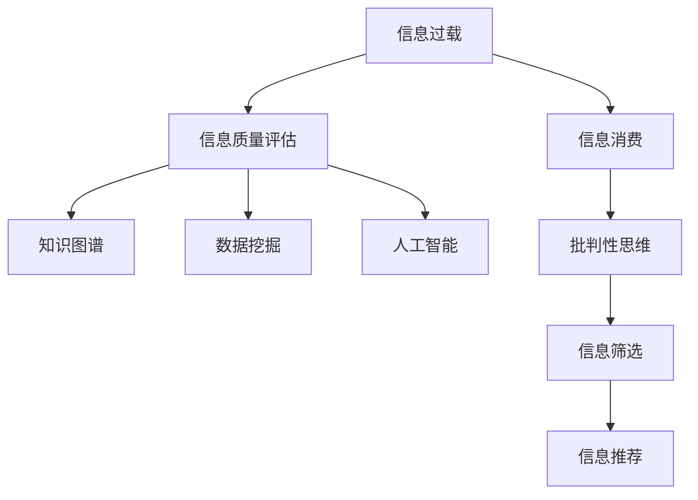

                 

# 信息过载与信息质量评估：如何批判性地评估和消费信息

> 关键词：信息过载,信息质量评估,知识图谱,数据挖掘,大数据,人工智能

## 1. 背景介绍

在互联网时代，信息流通渠道日益多元化，信息的数量和种类呈爆炸式增长。大数据、云计算和人工智能等技术的进步，进一步加速了信息生成的速度和规模。然而，信息量的激增也带来了信息过载（Information Overload）的问题，即人们在接受信息时面临大量的、低质量和冗余的信息，导致信息选择困难、认知负担加重、决策难度增加等问题。

为应对信息过载的挑战，提高信息质量，保证信息消费的有效性，本文将深入探讨信息质量评估与批判性消费的方法。首先，本文将介绍信息质量评估的核心概念和关键技术，并结合实际案例进行讲解。接着，本文将介绍如何通过批判性思维，提升信息消费的能力。最后，本文将展望信息过载的未来趋势和应对策略，给出相关的技术推荐。

## 2. 核心概念与联系

### 2.1 核心概念概述

信息过载与信息质量评估是当前信息技术领域的一个重要研究方向。下面将详细介绍这些核心概念及其相互关系：

- **信息过载**：指人们接收到的信息量超出其处理能力，导致认知负担加重、决策困难和信息焦虑等问题。其成因包括信息量爆炸、信息传播速度快、信息获取便利性高等。

- **信息质量评估**：指对信息真实性、准确性、完整性、相关性和可靠性等方面的评价，以确保信息的可信度和可用性。信息质量评估可以从多个维度进行，如内容深度、来源可靠性、语言清晰度等。

- **知识图谱**：基于图结构对知识进行表示和管理，用于构建知识网络、支持语义搜索和推理。知识图谱可以提供高质量的语义知识，帮助人们快速找到相关信息。

- **数据挖掘**：通过算法从数据中发现规律和模式，用于支持决策、个性化推荐和趋势预测等。数据挖掘可以挖掘出隐藏在海量数据中的高质量信息，减少信息过载的困扰。

- **大数据**：指规模庞大的数据集，包括结构化、半结构化和非结构化数据。大数据为信息质量评估和信息过载管理提供了数据基础和技术支持。

- **人工智能**：指模拟人类智能行为的技术，包括机器学习、自然语言处理、计算机视觉等。人工智能可以自动完成信息筛选、信息质量评估和信息推荐等任务。

这些概念通过信息链条相连接，构成了一个完整的系统：信息过载影响了信息消费，需要通过信息质量评估来保证信息可靠，利用知识图谱和大数据技术进行信息挖掘，并借助人工智能进行信息筛选和推荐。

### 2.2 核心概念原理和架构的 Mermaid 流程图(Mermaid 流程节点中不要有括号、逗号等特殊字符)



该图展示了从信息过载到信息消费的完整过程。信息过载需要通过信息质量评估进行甄别，利用知识图谱、数据挖掘和人工智能技术进行信息筛选和推荐，最终通过批判性思维提升信息消费能力。

## 3. 核心算法原理 & 具体操作步骤

### 3.1 算法原理概述

信息质量评估是一个多维度的评价过程，涉及信息的准确性、完整性、相关性、可信度等。下面详细介绍几个常用的评估算法：

- **准确性（Accuracy）**：评估信息与实际事实的匹配度，通过比较信息内容与已知数据或真相进行评估。

- **完整性（Completeness）**：评估信息是否涵盖了相关的事实或知识，通过缺失性分析和内容覆盖度评估。

- **相关性（Relevance）**：评估信息是否与用户的查询或任务相关，通过信息匹配度和用户满意度评估。

- **可信度（Reliability）**：评估信息的来源和发布者的可信度，通过链接分析、发布时间、发布平台等维度评估。

这些评估算法通常使用统计方法、机器学习模型或专家评估相结合的方式进行。以准确性评估为例，可以使用文本匹配技术（如余弦相似度、Jaccard相似度等）对信息内容与事实进行匹配，计算匹配得分。

### 3.2 算法步骤详解

信息质量评估的具体步骤包括：

1. **数据收集**：收集需要评估的信息源和相关数据，包括网页、文档、图片、视频等。

2. **数据清洗**：处理噪声数据和错误数据，保证数据质量和一致性。

3. **特征提取**：从数据中提取特征，如关键词、短语、实体等，用于后续评估。

4. **模型训练**：使用机器学习算法训练评估模型，如分类模型、聚类模型、回归模型等。

5. **评估与测试**：使用测试数据集对模型进行评估，计算评估指标，如准确率、召回率、F1分数等。

6. **结果分析**：分析评估结果，识别问题信息，提出改进建议。

7. **优化与迭代**：根据分析结果和反馈，优化评估模型，进行迭代改进。

### 3.3 算法优缺点

信息质量评估算法具有以下优点：

- **客观性**：通过量化指标进行评估，减少主观因素的影响。

- **系统性**：使用系统化的流程和方法进行评估，确保评估的全面性和准确性。

- **动态性**：可以实时更新和优化评估模型，适应数据和环境的变化。

但同时也存在以下缺点：

- **复杂性**：评估过程涉及多维度指标，需要综合考虑各种因素。

- **资源需求高**：需要大量的数据和计算资源，评估成本较高。

- **信息过载风险**：评估过程本身可能产生信息过载，需要谨慎处理。

### 3.4 算法应用领域

信息质量评估技术可以应用于多个领域：

- **新闻与媒体**：评估新闻报道的准确性和可信度，提高媒体内容的质量。

- **电子商务**：评估商品信息和用户评价的真实性和相关性，帮助消费者做出更好的购买决策。

- **社交网络**：评估社交媒体信息的真实性和可信度，防止虚假信息和谣言传播。

- **企业信息管理**：评估企业内部和外部的信息质量，支持企业决策和知识管理。

## 4. 数学模型和公式 & 详细讲解 & 举例说明

### 4.1 数学模型构建

信息质量评估的数学模型可以构建为多维度的向量空间，其中每个维度表示一种评估指标。以准确性评估为例，可以使用向量 $(x_1, x_2, x_3, ..., x_n)$ 表示信息的质量，其中每个 $x_i$ 代表一个评估特征。

### 4.2 公式推导过程

以准确性评估为例，设信息文本为 $T$，实际事实为 $F$，可以使用余弦相似度计算两者之间的匹配度：

$$
\text{CosineSimilarity}(T, F) = \frac{T \cdot F}{\|T\| \cdot \|F\|}
$$

其中 $T \cdot F$ 表示 $T$ 和 $F$ 的内积，$\|T\|$ 和 $\|F\|$ 分别表示 $T$ 和 $F$ 的模长。如果内积为正，表示 $T$ 与 $F$ 匹配度高。

### 4.3 案例分析与讲解

假设有一段新闻报道 $T$ 和相关的事实 $F$，内容如下：

- $T$：某公司发布新产品，售价 $X$ 元。
- $F$：某公司发布新产品，售价 $Y$ 元。

使用余弦相似度计算匹配度：

- $T \cdot F = (X - Y)^2$
- $\|T\| = \sqrt{X^2}$
- $\|F\| = \sqrt{Y^2}$
- $\text{CosineSimilarity}(T, F) = \frac{(X - Y)^2}{\sqrt{X^2} \cdot \sqrt{Y^2}}$

若 $X = Y$，则 $\text{CosineSimilarity}(T, F) = 1$，表示信息与事实匹配度高。若 $X \neq Y$，则 $\text{CosineSimilarity}(T, F) < 1$，表示信息与事实匹配度低。

## 5. 项目实践：代码实例和详细解释说明

### 5.1 开发环境搭建

本文使用Python和Scikit-learn进行信息质量评估的代码实现。首先需要安装Python环境和相关库：

```bash
pip install numpy pandas scikit-learn matplotlib
```

### 5.2 源代码详细实现

下面以准确性评估为例，展示如何使用Scikit-learn进行信息匹配度的计算：

```python
from sklearn.metrics.pairwise import cosine_similarity

# 假设信息文本和事实信息已经预处理并存储在x和y中
x = ['某公司发布新产品，售价X元。']
y = ['某公司发布新产品，售价Y元。']

# 计算余弦相似度
similarity_score = cosine_similarity(x, y)
print(similarity_score)
```

### 5.3 代码解读与分析

在上述代码中，使用Scikit-learn的cosine_similarity函数计算信息文本 $x$ 和事实 $y$ 的余弦相似度，并输出结果。具体步骤如下：

1. 导入cosine_similarity函数。
2. 将信息文本和事实信息存储在列表x和y中。
3. 调用cosine_similarity函数计算余弦相似度，并将结果存储在similarity_score变量中。
4. 打印输出余弦相似度结果。

## 6. 实际应用场景

### 6.4 未来应用展望

未来信息质量评估和信息过载管理将面临以下挑战：

1. **多模态数据的融合**：将文本、图像、视频等多模态数据进行统一评估，提升综合信息质量。

2. **自动化评估**：构建自动化评估系统，实时监控信息质量，减少人工干预。

3. **多领域应用**：将信息质量评估技术应用于更多领域，如医疗、法律、金融等。

4. **跨语言信息质量评估**：构建跨语言的信息质量评估体系，支持不同语言的信息筛选和推荐。

## 7. 工具和资源推荐

### 7.1 学习资源推荐

- **《信息检索与信息获取》**：介绍信息检索的基本原理、方法和应用，包括信息质量评估。

- **《知识图谱与信息获取》**：探讨知识图谱在信息获取和信息质量评估中的应用。

- **《人工智能导论》**：全面介绍人工智能技术，包括机器学习、自然语言处理等，涵盖信息质量评估。

- **《大数据与信息质量》**：深入探讨大数据在信息质量评估中的应用，包括数据清洗和特征提取。

### 7.2 开发工具推荐

- **Python**：作为数据科学和机器学习的主流语言，Python提供了丰富的数据处理和机器学习库。

- **Scikit-learn**：提供多种机器学习算法和评估指标，用于信息质量评估。

- **TensorFlow**：提供强大的深度学习框架，用于构建信息质量评估模型。

- **Keras**：提供高层API，简化深度学习模型的构建过程。

### 7.3 相关论文推荐

- **"Evaluating the Accuracy of Automatically Generated Information in Wikipedia Edits"**：评估维基百科编辑中自动生成的信息准确性。

- **"Automatic Evaluation of Information Quality Using Clustering"**：使用聚类算法评估信息质量。

- **"Assessing Information Quality in News Articles"**：评估新闻文章中信息的准确性和相关性。

- **"Evaluating the Reliability of Online Content Using Social Media"**：使用社交媒体数据评估在线内容的可信度。

## 8. 总结：未来发展趋势与挑战

### 8.1 研究成果总结

本文详细介绍了信息过载与信息质量评估的核心概念和技术，包括信息质量评估的算法、数学模型和实际应用。通过信息质量评估，可以有效识别和过滤掉低质量信息，提升信息消费的准确性和效率。

### 8.2 未来发展趋势

未来信息质量评估和信息过载管理将向以下几个方向发展：

1. **多模态融合**：将多模态数据进行统一评估，提升综合信息质量。

2. **自动化评估**：构建自动化评估系统，实时监控信息质量。

3. **跨领域应用**：将信息质量评估技术应用于更多领域，如医疗、法律、金融等。

4. **跨语言评估**：构建跨语言的信息质量评估体系，支持不同语言的信息筛选和推荐。

### 8.3 面临的挑战

信息质量评估和信息过载管理面临以下挑战：

1. **多模态数据融合**：不同模态数据具有不同特征，如何统一评估是一个难题。

2. **自动化评估**：自动评估系统的准确性和鲁棒性需要进一步提升。

3. **跨领域应用**：不同领域的信息质量评估方法需要针对具体场景进行调整。

4. **跨语言评估**：不同语言的信息质量评估存在语言和文化差异，需要考虑更多因素。

### 8.4 研究展望

未来信息质量评估和信息过载管理的进一步研究可以从以下几个方向进行：

1. **跨领域知识图谱**：构建跨领域的知识图谱，提供统一的信息质量评估框架。

2. **深度学习与知识图谱融合**：将深度学习与知识图谱相结合，提升信息质量评估的准确性。

3. **自适应评估算法**：构建自适应评估算法，根据用户偏好和数据变化实时调整评估策略。

4. **用户反馈与动态优化**：引入用户反馈机制，动态优化信息质量评估模型。

## 9. 附录：常见问题与解答

**Q1：信息质量评估的准确性和可解释性如何平衡？**

A: 信息质量评估的准确性可以通过多种评估指标和模型进行衡量，如准确率、召回率、F1分数等。可解释性可以通过评估模型的输出和特征提取过程进行解释。在实践中，可以通过选择恰当的评估模型和指标，平衡准确性和可解释性。例如，使用可解释性较强的算法（如规则系统、决策树等）进行初步筛选，再使用复杂模型（如神经网络）进行细粒度评估，能够兼顾准确性和可解释性。

**Q2：如何提高信息质量评估的自动化程度？**

A: 提高信息质量评估的自动化程度，需要构建自动化评估系统。这可以通过以下几个步骤实现：

1. **数据预处理**：对输入数据进行清洗、标准化和特征提取，确保数据的一致性和可用性。

2. **评估模型训练**：使用机器学习算法训练评估模型，优化评估指标和模型参数。

3. **实时监控**：构建实时监控系统，对新输入数据进行实时评估和反馈。

4. **模型优化**：根据实时反馈和用户需求，动态调整评估模型和策略。

通过自动化系统，可以实现信息质量评估的持续优化，提升评估的实时性和准确性。

**Q3：如何构建跨领域信息质量评估体系？**

A: 构建跨领域信息质量评估体系，需要考虑以下几个方面：

1. **领域知识库构建**：收集和整理各领域的知识库，包括术语、规则和标准等。

2. **领域特征提取**：针对不同领域，提取特定的特征，用于信息质量评估。

3. **多模态融合**：将文本、图像、视频等多模态数据进行统一评估，提升综合信息质量。

4. **跨语言处理**：处理不同语言的信息质量评估问题，使用跨语言技术和工具。

5. **知识图谱应用**：将知识图谱应用于信息质量评估，提升评估的全面性和准确性。

通过综合考虑上述因素，可以构建跨领域的信息质量评估体系，提升不同领域的信息消费能力。

**Q4：信息质量评估在实际应用中可能面临哪些风险？**

A: 信息质量评估在实际应用中可能面临以下风险：

1. **数据偏见**：评估数据可能存在偏见，导致评估结果的不公平性。

2. **隐私风险**：在评估过程中，可能涉及敏感数据的泄露和滥用。

3. **算法误判**：评估算法可能存在误判和错误，导致信息筛选的准确性下降。

4. **用户依赖性**：用户可能过度依赖信息质量评估系统，降低自己的信息判断能力。

5. **系统安全性**：信息质量评估系统的安全性问题，如数据篡改、系统漏洞等。

因此，在应用信息质量评估技术时，需要综合考虑数据质量、算法准确性和系统安全性，确保评估的可靠性和公平性。

**Q5：信息质量评估在电商中的应用场景是什么？**

A: 信息质量评估在电商中的应用场景包括：

1. **商品信息筛选**：评估商品标题、描述、图片等信息质量，筛选出高质量的商品信息。

2. **用户评论审核**：评估用户评论的真实性和可靠性，筛选出高质量的评论内容。

3. **价格比对**：评估不同商家相同商品的价格信息，筛选出价格合理且信息透明的商品。

4. **推荐系统优化**：评估用户的历史行为和兴趣，筛选出与用户匹配度高的商品，优化推荐系统。

通过信息质量评估，电商平台可以提高商品信息的准确性和可靠性，提升用户体验和满意度。

---

作者：禅与计算机程序设计艺术 / Zen and the Art of Computer Programming

