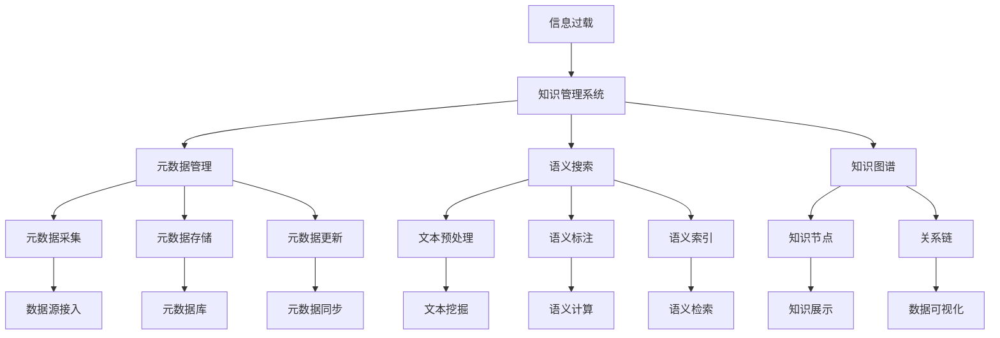

                 

# 信息过载与知识管理系统实施指南：有效组织和检索信息

在当今信息爆炸的时代，数据量呈现出指数级增长，信息过载已成为制约人们获取、处理和利用信息的主要问题。如何有效组织和检索信息，成为知识管理系统的核心任务。本文将深入探讨信息过载的挑战，并详细介绍知识管理系统的核心概念、技术原理及其实施指南，以期为各行业的知识工作者提供实用的参考。

## 1. 背景介绍

### 1.1 问题由来
随着互联网的普及和数字化的发展，信息量呈爆炸性增长。企业、政府、学术机构等组织中产生了大量文档、邮件、数据等各类信息资源，而这些资源大多未经有效组织和整合，导致了信息过载现象。信息过载不仅浪费了宝贵的资源，还影响了决策效率，限制了组织创新和发展。

### 1.2 问题核心关键点
信息过载的核心问题在于数据量大、结构复杂、内容碎片化。要解决这些问题，需要建立一套有效的知识管理系统，对信息进行自动化组织和检索。知识管理系统的目标是通过对信息资源的整合和优化，帮助用户快速找到所需信息，提升工作效率和决策质量。

### 1.3 问题研究意义
有效的知识管理系统可以极大地提升信息利用效率，帮助组织实现知识创新和业务转型。对于个人而言，知识管理系统也是提升工作效率、促进学习和自我发展的有力工具。

## 2. 核心概念与联系

### 2.1 核心概念概述
- **信息过载**：由于信息量巨大、内容杂乱，用户难以有效利用所有可用信息，导致信息使用效率低下。
- **知识管理系统(Knowledge Management System, KMS)**：利用信息技术手段，对信息资源进行采集、存储、组织、检索和应用的系统。
- **元数据(Metadata)**：描述信息资源的非内容属性，如文件格式、创建者、创建时间等，是信息组织和检索的基础。
- **语义搜索(Semantic Search)**：通过分析文本内容中的语义信息，实现对信息更精确的检索。
- **知识图谱(Knowledge Graph)**：用图形化的方式展示信息间的关联关系，帮助用户直观理解知识结构。

### 2.2 核心概念原理和架构的 Mermaid 流程图



这个流程图展示了知识管理系统的核心组件及其相互关系：

1. 信息过载通过知识管理系统进行处理。
2. 知识管理系统包括元数据管理、语义搜索和知识图谱三大模块。
3. 元数据管理涉及元数据的采集、存储和更新，是信息组织的基础。
4. 语义搜索通过文本预处理和语义标注，实现对信息的高效检索。
5. 知识图谱将信息资源以图形化的方式呈现，帮助用户理解知识结构。

## 3. 核心算法原理 & 具体操作步骤

### 3.1 算法原理概述

知识管理系统的核心算法主要涉及以下几个方面：

- **信息采集**：通过爬虫、API等方式，从不同数据源采集信息。
- **元数据管理**：对采集到的信息进行元数据提取和存储。
- **文本预处理**：对文本内容进行分词、清洗、标准化等处理，为后续的语义分析和检索做准备。
- **语义标注**：利用自然语言处理技术，对文本进行语义分析和标注。
- **语义索引**：建立基于语义的索引，实现对信息的高效检索。
- **知识图谱构建**：将信息资源和关系链以图形化方式呈现，构建知识图谱。

### 3.2 算法步骤详解

知识管理系统的主要步骤包括：

1. **需求分析**：明确知识管理系统的目标和应用场景，确定需要管理的各类信息资源。
2. **系统设计**：设计系统的架构和数据模型，确定元数据结构、语义搜索算法和知识图谱构建方法。
3. **信息采集**：通过爬虫、API等方式，自动采集各类信息资源，包括文本、图片、视频等。
4. **元数据管理**：对采集到的信息进行元数据提取和存储，包括文件的格式、大小、创建者、创建时间等。
5. **文本预处理**：对文本内容进行分词、清洗、标准化等处理，为后续的语义分析和检索做准备。
6. **语义标注**：利用自然语言处理技术，对文本进行语义分析和标注，建立语义索引。
7. **语义搜索**：根据用户查询，通过语义索引实现高效检索。
8. **知识图谱构建**：将信息资源和关系链以图形化方式呈现，构建知识图谱，提供可视化查询接口。
9. **系统部署与测试**：将系统部署到生产环境，进行测试和优化，确保系统稳定运行。

### 3.3 算法优缺点

知识管理系统的优势在于：

- **高效的信息检索**：通过语义分析和索引，可以实现对信息的精确检索。
- **自动化的元数据管理**：减少了人工标注的工作量，提高了信息管理的效率。
- **灵活的信息展示**：通过知识图谱，可以直观地展示信息间的关联关系，便于理解和应用。

同时，知识管理系统也存在以下缺点：

- **技术复杂度高**：系统涉及多种技术栈，包括自然语言处理、数据挖掘、图形化展示等。
- **数据质量依赖强**：系统的效果很大程度上取决于原始数据的准确性和完整性。
- **系统集成难度大**：知识管理系统需要与各类业务系统和应用进行深度集成，增加了实现难度。

### 3.4 算法应用领域

知识管理系统在多个领域都有广泛应用，如：

- **企业知识管理**：帮助企业实现知识资产的整理、共享和应用，提升业务效率和创新能力。
- **政府信息管理**：通过知识管理，实现政务信息的有效整合和利用，支持政策制定和决策支持。
- **学术研究管理**：对学术论文、研究成果等进行系统管理，促进学术交流和合作。
- **个人知识管理**：帮助个人整理和应用各类知识资源，提升学习和工作效率。

## 4. 数学模型和公式 & 详细讲解 & 举例说明

### 4.1 数学模型构建

知识管理系统的核心数学模型包括：

- **信息采集模型**：描述信息采集的过程和方法，如爬虫算法、API调用等。
- **元数据模型**：描述元数据的基本属性和结构，包括文件的元数据字段和数据类型。
- **文本预处理模型**：描述文本分词、清洗、标准化等预处理步骤。
- **语义标注模型**：描述自然语言处理中的分词、命名实体识别、情感分析等任务。
- **语义索引模型**：描述基于语义的信息检索算法，如TF-IDF、Word2Vec等。
- **知识图谱模型**：描述知识图谱的构建方法，如节点、边、关系链的表示。

### 4.2 公式推导过程

以**语义标注模型**为例，假设输入文本为 $x$，目标为识别出其中的命名实体 $y$，则语义标注的过程可以表示为：

$$
y = f(x, \theta)
$$

其中 $f$ 为语义标注函数，$\theta$ 为模型参数。具体的函数实现可以使用自然语言处理技术，如条件随机场（CRF）、序列标注器等。

### 4.3 案例分析与讲解

假设有一家大型企业的知识管理系统，需要管理各种文档、报告、邮件等，以支持业务运营和决策支持。具体实施步骤包括：

1. **需求分析**：明确知识管理系统的目标，确定需要管理的各类信息资源。
2. **系统设计**：设计系统的架构和数据模型，确定元数据结构、语义搜索算法和知识图谱构建方法。
3. **信息采集**：通过爬虫、API等方式，自动采集各类信息资源，包括文本、图片、视频等。
4. **元数据管理**：对采集到的信息进行元数据提取和存储，包括文件的格式、大小、创建者、创建时间等。
5. **文本预处理**：对文本内容进行分词、清洗、标准化等处理，为后续的语义分析和检索做准备。
6. **语义标注**：利用自然语言处理技术，对文本进行语义分析和标注，建立语义索引。
7. **语义搜索**：根据用户查询，通过语义索引实现高效检索。
8. **知识图谱构建**：将信息资源和关系链以图形化方式呈现，构建知识图谱，提供可视化查询接口。
9. **系统部署与测试**：将系统部署到生产环境，进行测试和优化，确保系统稳定运行。

## 5. 项目实践：代码实例和详细解释说明

### 5.1 开发环境搭建

要进行知识管理系统的开发，需要搭建相应的开发环境。以下是Python开发环境的基本配置步骤：

1. 安装Python：从官网下载并安装Python 3.x版本，推荐使用Anaconda或Miniconda。
2. 创建虚拟环境：使用conda或virtualenv创建Python虚拟环境。
3. 安装必要的Python库：安装requests、BeautifulSoup、NLTK、Scikit-learn等必要的Python库。
4. 安装知识管理系统的框架：如Hugging Face的Transformers库，用于自然语言处理。
5. 安装数据库管理系统：如MySQL或PostgreSQL，用于存储元数据和文本数据。

### 5.2 源代码详细实现

以下是一个简单的文本预处理和语义标注的Python代码实现：

```python
from transformers import pipeline
from bs4 import BeautifulSoup
import requests

# 定义文本预处理函数
def preprocess_text(text):
    soup = BeautifulSoup(text, 'html.parser')
    clean_text = soup.get_text()
    return clean_text

# 定义命名实体识别函数
def extract_entities(text):
    nlp = pipeline('ner')
    ner_results = nlp(text)
    entities = [entity['entity'] for entity in ner_results]
    return entities

# 测试预处理和标注函数
text = "<html><body>这家公司成立于1995年，位于北京海淀区，是一家高科技企业。</body></html>"
clean_text = preprocess_text(text)
entities = extract_entities(clean_text)
print(clean_text, entities)
```

### 5.3 代码解读与分析

上述代码实现了文本预处理和命名实体识别两个功能：

1. **文本预处理**：使用BeautifulSoup库对HTML文本进行解析和清洗，去除标签，提取文本内容。
2. **命名实体识别**：使用Transformers库中的命名实体识别器，对文本进行实体标注，识别出其中的命名实体。

## 6. 实际应用场景

### 6.1 企业知识管理

对于大型企业，知识管理系统的应用场景非常广泛。例如，企业文档管理系统可以通过知识管理系统实现文档的自动归档、分类和检索。企业内部的邮件系统可以通过知识管理系统进行智能分类和搜索，提高员工工作效率。此外，企业还可以利用知识管理系统对产品、项目、客户等信息进行系统管理，支持业务运营和决策支持。

### 6.2 政府信息管理

政府部门的信息管理工作涉及大量文档、报告、新闻等各类信息资源。知识管理系统可以帮助政府实现信息资源的有效整合和利用，支持政策制定和决策支持。例如，政府可以利用知识管理系统对各类政策文件进行系统管理，支持政策的持续更新和迭代。

### 6.3 学术研究管理

学术研究机构的信息管理工作包括学术论文、研究成果等各类信息资源。知识管理系统可以帮助研究机构实现知识资产的整理、共享和应用，促进学术交流和合作。例如，研究机构可以利用知识管理系统对学术论文进行系统管理，支持学术资源的开放和共享。

### 6.4 个人知识管理

个人知识管理系统的应用场景主要集中在学习和工作中。例如，个人可以利用知识管理系统整理和应用各类学习资源，提升学习效率。工作中，个人可以利用知识管理系统整理和应用各类工作文档、邮件等，提高工作效率。

## 7. 工具和资源推荐

### 7.1 学习资源推荐

为了帮助开发者系统掌握知识管理系统的理论基础和实践技巧，这里推荐一些优质的学习资源：

1. **《知识管理原理与实践》**：详细介绍了知识管理系统的基本概念、原理和实践方法。
2. **《信息检索理论与技术》**：介绍了信息检索的基本原理和算法，帮助理解语义搜索的技术细节。
3. **《Python自然语言处理》**：介绍了Python中常用的自然语言处理库和工具，帮助实现文本预处理和语义标注功能。
4. **Kaggle竞赛平台**：提供丰富的数据集和竞赛任务，可以实践和提升知识管理系统的实现能力。

### 7.2 开发工具推荐

要实现知识管理系统，需要多种工具和技术的支持。以下是几款常用的开发工具：

1. **Python**：灵活易用的编程语言，支持多种第三方库和框架，是实现知识管理系统的首选语言。
2. **BeautifulSoup**：用于HTML文本解析和清洗，帮助提取文本内容。
3. **NLTK**：自然语言处理工具包，支持文本分词、命名实体识别等任务。
4. **Scikit-learn**：机器学习库，支持数据挖掘和分类算法，可以用于构建知识图谱和进行知识推理。
5. **ElasticSearch**：分布式搜索和分析引擎，支持高效的语义搜索和信息检索。
6. **D3.js**：数据可视化工具，可以构建美观的知识图谱和可视化查询界面。

### 7.3 相关论文推荐

知识管理系统的研究涉及多个领域，以下是几篇有代表性的相关论文：

1. **《Web信息采集与处理技术》**：介绍了Web信息采集和处理的常用技术，包括爬虫算法、数据清洗等。
2. **《基于语义的文档信息检索》**：介绍了语义检索的原理和算法，帮助理解如何通过语义标注实现高效检索。
3. **《知识图谱构建与应用》**：介绍了知识图谱的构建方法和应用场景，帮助理解如何通过图形化方式展示信息间的关联关系。

## 8. 总结：未来发展趋势与挑战

### 8.1 总结

本文对知识管理系统的核心概念、技术原理及其实施指南进行了详细介绍。通过系统梳理，可以看到知识管理系统在解决信息过载问题方面的重要作用，帮助用户快速找到所需信息，提升工作效率和决策质量。未来，随着技术的不断进步，知识管理系统将进一步深化应用，为各行业的知识工作者提供更有力的支持。

### 8.2 未来发展趋势

知识管理系统的发展趋势包括以下几个方面：

1. **智能化**：未来的知识管理系统将更加智能化，通过机器学习和深度学习技术，实现对信息的自动分类、标注和检索。
2. **云化**：云平台提供了更强大的计算和存储能力，知识管理系统将更多地部署在云平台上，支持高并发和弹性伸缩。
3. **集成化**：未来的知识管理系统将与其他系统进行更深入的集成，支持跨系统信息共享和协作。
4. **个性化**：未来的知识管理系统将更加个性化，根据用户行为和偏好，提供定制化的信息服务和推荐。
5. **跨领域**：未来的知识管理系统将拓展到更多领域，支持不同行业的信息管理和应用。

### 8.3 面临的挑战

尽管知识管理系统在信息管理方面取得了显著成效，但仍面临诸多挑战：

1. **数据质量问题**：知识管理系统的效果很大程度上依赖于原始数据的准确性和完整性，数据质量问题仍需解决。
2. **技术复杂性**：知识管理系统涉及多种技术栈，技术实现难度较大，需要综合考虑数据采集、预处理、存储和检索等多个环节。
3. **隐私和安全**：知识管理系统的信息资源涉及敏感数据，如何保护用户隐私和数据安全是一个重要问题。
4. **用户体验**：知识管理系统的界面和交互设计需要更加友好和直观，提升用户的使用体验。
5. **可扩展性**：知识管理系统需要支持大规模数据处理和信息检索，可扩展性是一个重要挑战。

### 8.4 研究展望

未来，知识管理系统需要在以下方面进行深入研究：

1. **数据融合与整合**：如何有效地将各类信息资源进行融合和整合，提升知识管理的系统性和完整性。
2. **语义搜索与知识推理**：如何通过语义分析和知识推理，提升信息检索的精度和广度。
3. **隐私保护与安全**：如何在保障用户隐私和数据安全的前提下，实现知识管理系统的广泛应用。
4. **智能推荐与个性化服务**：如何通过机器学习和人工智能技术，提供更加智能化和个性化的信息服务和推荐。
5. **跨领域与跨系统集成**：如何实现知识管理系统的跨领域应用和跨系统集成，支持更大范围的信息管理和应用。

## 9. 附录：常见问题与解答

### Q1：如何确保知识管理系统的数据质量？

A: 数据质量是知识管理系统的基础，需要从以下几个方面进行保障：

1. **数据清洗**：对采集到的数据进行清洗和标准化处理，去除噪音和冗余数据。
2. **数据标注**：对关键数据进行人工标注，确保数据的准确性和完整性。
3. **数据验证**：定期对数据进行验证和审核，发现并纠正数据错误。

### Q2：知识管理系统的信息检索功能如何实现？

A: 知识管理系统的信息检索功能主要依赖于语义搜索技术，具体实现包括以下步骤：

1. **文本预处理**：对文本内容进行分词、清洗、标准化等处理。
2. **语义标注**：利用自然语言处理技术，对文本进行语义分析和标注，建立语义索引。
3. **语义检索**：根据用户查询，通过语义索引实现高效检索。

### Q3：知识管理系统的用户界面设计需要注意哪些问题？

A: 知识管理系统的用户界面设计需要注意以下几个问题：

1. **简洁直观**：用户界面需要简洁直观，方便用户快速上手和使用。
2. **功能全面**：界面需要提供全面的功能，支持信息浏览、检索、编辑和分享等操作。
3. **交互友好**：界面需要设计友好的交互方式，支持键盘和鼠标等多种操作方式。
4. **响应快速**：界面需要快速响应用户的操作，避免卡顿和延迟。

### Q4：知识管理系统如何实现跨系统集成？

A: 知识管理系统的跨系统集成主要依赖于API接口和数据共享技术，具体实现包括以下步骤：

1. **接口设计**：设计标准的API接口，支持不同系统之间的数据交换。
2. **数据共享**：通过数据共享协议，实现不同系统间的信息共享和协作。
3. **安全认证**：实现系统的安全认证和授权机制，确保数据安全和隐私保护。

### Q5：知识管理系统的可扩展性如何实现？

A: 知识管理系统的可扩展性主要依赖于分布式架构和大数据技术，具体实现包括以下步骤：

1. **分布式设计**：采用分布式架构，支持大规模数据处理和信息检索。
2. **大数据技术**：利用大数据技术，支持海量数据的存储和处理。
3. **云计算平台**：通过云计算平台，实现知识管理系统的可扩展和弹性伸缩。

---

作者：禅与计算机程序设计艺术 / Zen and the Art of Computer Programming

