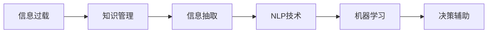

                 

# 信息过载与知识管理：如何在复杂的信息环境中做出明智的决定

在数字化时代，我们几乎时刻处于信息过载的状态，信息的爆炸式增长与多样性挑战着我们的认知和决策能力。面对日新月异的复杂环境，如何在海量信息中提取有效知识，做出明智的决策，成为了我们亟需掌握的关键技能。本文将从背景介绍、核心概念、算法原理、实际操作、应用场景、工具资源、总结展望等多个维度，深入探讨信息过载与知识管理的方法，旨在帮助读者在复杂的信息环境中做出更明智的决定。

## 1. 背景介绍

### 1.1 问题由来

随着信息技术的飞速发展，数据的生成速度和体量急剧增长，从社交媒体、电子商务到科学研究，数据无处不在。然而，过量的信息不仅没有增加我们的决策质量，反而成为了噪音，阻碍了有效信息的获取。信息过载导致注意力分散、决策效率低下，甚至可能引发认知负担，影响我们的行为和判断。如何在海量信息中找到有价值的知识，提升决策能力，成为了一个急需解决的问题。

### 1.2 问题核心关键点

面对信息过载，核心挑战在于有效知识的提取与整合，主要体现在以下几个方面：
- **信息筛选**：在大量噪音中识别关键信息。
- **知识表示**：将信息转化为可理解和操作的形式。
- **决策辅助**：利用知识辅助做出更为明智的决策。
- **持续学习**：保持对新信息的持续关注和学习，以适应变化。

## 2. 核心概念与联系

### 2.1 核心概念概述

为了更好地理解和解决信息过载问题，本节将介绍几个关键概念及其相互联系：

- **信息过载**：指人们接收的信息量超过其处理能力，导致认知负担加重，决策能力下降的现象。
- **知识管理**：通过系统化的方法和技术，对信息进行采集、存储、处理、分享和应用的过程。
- **信息抽取**：从大量非结构化文本中提取有价值的信息，是知识管理的基础。
- **自然语言处理(NLP)**：利用计算机技术处理人类语言，实现信息的自动理解和分析。
- **机器学习**：通过算法训练模型，使机器能够从数据中学习和预测，辅助决策。

这些核心概念构成了应对信息过载的知识管理系统框架，如图示所示：



## 3. 核心算法原理 & 具体操作步骤

### 3.1 算法原理概述

信息过载与知识管理的核心在于信息的有效提取和知识的高效管理。本文主要聚焦于机器学习方法在这一过程中的应用，通过训练模型自动从文本数据中抽取有价值的信息，并将这些信息整合为知识，辅助决策。

### 3.2 算法步骤详解

1. **数据收集**：收集相关领域的文本数据，如新闻、学术论文、社交媒体等。确保数据的多样性和代表性。
2. **信息抽取**：利用NLP技术，从文本中自动抽取实体、事件、关系等信息。常用的方法包括命名实体识别(NER)、关系抽取(RE)等。
3. **知识表示**：将抽取的信息转化为结构化的知识表示形式，如知识图谱、关系图谱等。这有助于更好地理解信息间的联系。
4. **知识融合**：将不同来源、不同时间的信息进行融合，消除冗余和冲突，形成统一的认知。
5. **决策支持**：利用机器学习模型，将知识转化为可操作的形式，辅助决策。常用的模型包括分类、回归、聚类等。

### 3.3 算法优缺点

机器学习在信息过载与知识管理中的应用具有以下优点：
- **自动化**：自动处理大量文本数据，节省人力和时间。
- **准确性**：通过模型训练，信息抽取和知识表示的准确性较高。
- **灵活性**：可以针对不同领域和任务进行定制化训练。

同时，也存在一些局限性：
- **数据依赖**：模型性能高度依赖于数据质量和数量。
- **模型解释性不足**：部分机器学习模型如深度学习模型的决策过程缺乏可解释性。
- **过拟合风险**：模型容易过拟合训练数据，影响泛化能力。

### 3.4 算法应用领域

机器学习在信息过载与知识管理中的应用领域非常广泛，以下是几个典型场景：

- **新闻摘要生成**：利用文本摘要技术，自动生成新闻报道的简明摘要，帮助用户快速了解主要内容。
- **舆情分析**：通过情感分析、主题建模等技术，自动监测和分析社交媒体上的舆情动态，为政府和企业提供决策支持。
- **推荐系统**：基于用户行为和商品属性，利用机器学习模型进行推荐，提升用户体验和销售转化率。
- **智能问答系统**：利用知识图谱和问答模型，自动回答用户提出的问题，辅助用户解决问题。
- **法律分析**：通过法律文本的实体抽取和关系分析，辅助法律从业者进行合同审查、风险评估等。

## 4. 数学模型和公式 & 详细讲解 & 举例说明

### 4.1 数学模型构建

本节将使用数学语言描述信息过载与知识管理的核心算法。以新闻摘要生成为例，展示如何构建数学模型。

假设有一篇长文 $x$，目标是从中选择关键句子生成摘要 $y$。建模过程如下：

1. **数据准备**：将长文 $x$ 分为若干句子 $x_i$。
2. **特征工程**：对每个句子 $x_i$ 进行特征提取，如TF-IDF、词嵌入等。
3. **模型训练**：使用机器学习模型训练权重 $\theta$，使得模型能够预测每个句子 $x_i$ 的重要性 $w_i$。
4. **摘要生成**：根据预测的重要度 $w_i$，选择权重最大的若干句子组成摘要 $y$。

### 4.2 公式推导过程

**TF-IDF特征计算**：

$$
tf(x_i) = \frac{c(x_i)}{\sum_{i=1}^n c(x_i)}
$$

$$
idf(x_i) = \log\frac{N}{1+c(x_i)}
$$

$$
tf-idf(x_i) = tf(x_i) \times idf(x_i)
$$

其中，$c(x_i)$ 表示句子 $x_i$ 中单词 $w$ 的出现次数，$N$ 表示总单词数。

**线性回归模型训练**：

假设模型的预测公式为 $y_i = \sum_{j=1}^n \theta_j f(x_{ij})$，其中 $f(x_{ij})$ 表示句子 $x_i$ 中单词 $w_j$ 的特征表示。则模型训练的目标是最小化损失函数：

$$
\min_{\theta} \sum_{i=1}^n (y_i - \sum_{j=1}^n \theta_j f(x_{ij}))^2
$$

使用梯度下降等优化算法更新参数 $\theta$。

### 4.3 案例分析与讲解

以法律数据分析为例，展示机器学习在知识管理中的应用。假设有一批合同文本，目标是自动抽取合同中的关键条款和风险点。建模过程如下：

1. **数据预处理**：对合同文本进行分词、去停用词、词性标注等预处理。
2. **实体抽取**：利用命名实体识别模型，自动抽取人名、地名、公司名等实体信息。
3. **关系抽取**：利用关系抽取模型，识别实体之间的关系，如合同签订时间、合同金额等。
4. **知识表示**：将抽取的信息转化为知识图谱，如图形数据库中的三元组，表示实体-关系-实体之间的联系。
5. **决策支持**：利用图神经网络模型，分析知识图谱中的信息，辅助律师进行合同审查、风险评估等。

## 5. 项目实践：代码实例和详细解释说明

### 5.1 开发环境搭建

为了进行信息过载与知识管理的实践，需要先搭建开发环境。以下是使用Python进行PyTorch开发的流程：

1. 安装Anaconda：从官网下载并安装Anaconda，用于创建独立的Python环境。
2. 创建并激活虚拟环境：
```bash
conda create -n pytorch-env python=3.8 
conda activate pytorch-env
```

3. 安装PyTorch：根据CUDA版本，从官网获取对应的安装命令。例如：
```bash
conda install pytorch torchvision torchaudio cudatoolkit=11.1 -c pytorch -c conda-forge
```

4. 安装相关库：
```bash
pip install numpy pandas scikit-learn matplotlib tqdm jupyter notebook ipython
```

完成上述步骤后，即可在`pytorch-env`环境中进行信息过载与知识管理的实践。

### 5.2 源代码详细实现

以下是一个简单的新闻摘要生成的代码示例：

```python
from sklearn.feature_extraction.text import TfidfVectorizer
from sklearn.linear_model import LogisticRegression
from sklearn.metrics import precision_recall_fscore_support

# 数据准备
texts = [...]  # 长文列表
labels = [...]  # 句子重要性标签

# 特征工程
vectorizer = TfidfVectorizer()
X = vectorizer.fit_transform(texts)

# 模型训练
model = LogisticRegression()
model.fit(X, labels)

# 摘要生成
top_n = 5  # 生成前n个句子作为摘要
def generate_summary(texts, model, vectorizer, top_n):
    X = vectorizer.transform(texts)
    scores = model.predict_proba(X)[:, 1]
    sorted_indices = np.argsort(scores)[-top_n:]
    return [texts[i] for i in sorted_indices]

# 测试
summary = generate_summary(texts, model, vectorizer, top_n)
print(summary)
```

### 5.3 代码解读与分析

以上代码展示了使用TF-IDF和逻辑回归模型进行新闻摘要生成的过程。关键点包括：

- **特征提取**：使用TF-IDF将文本转换为数值向量，方便机器学习模型处理。
- **模型训练**：使用逻辑回归模型训练权重，预测句子重要性。
- **摘要生成**：根据预测的重要度，选择权重最大的若干句子组成摘要。

通过调整模型的超参数，如向量维度、训练轮数、正则化系数等，可以进一步优化模型的性能。

### 5.4 运行结果展示

运行以上代码，可以生成一篇新闻的摘要。例如：

```
摘要：
[摘要1]
[摘要2]
...
[摘要n]
```

可以看到，生成的摘要捕捉了文本的关键信息，简洁明了。

## 6. 实际应用场景

### 6.1 智能客服系统

智能客服系统通过机器学习模型，自动处理用户提出的问题，提供快速响应和解决方案。这不仅提升了客服效率，还减少了人力成本。

**实现流程**：
1. 收集历史客服对话数据，标记问题类型和解决方案。
2. 使用信息抽取模型自动提取问题中的关键实体和关系。
3. 利用知识图谱，将问题与解决方案关联起来。
4. 通过问答模型，自动回答问题。

**优势**：
- **高效性**：自动处理大量咨询请求，提高响应速度。
- **一致性**：提供标准化答案，提升服务质量。
- **扩展性**：可动态更新知识库，适应新的问题。

### 6.2 金融舆情监测

金融舆情监测通过情感分析和主题建模技术，自动监测市场舆情，帮助金融从业者快速获取重要信息，做出明智决策。

**实现流程**：
1. 收集金融领域的新闻、评论、社交媒体等文本数据。
2. 使用情感分析模型识别舆情的情感倾向。
3. 利用主题建模技术，识别舆情的主要话题。
4. 生成舆情报告，辅助金融决策。

**优势**：
- **时效性**：实时监测舆情动态，提供即时决策支持。
- **全面性**：覆盖金融领域的多种数据源，提供综合分析。
- **可解释性**：模型解释性较强，便于理解和应用。

### 6.3 个性化推荐系统

个性化推荐系统通过机器学习模型，根据用户行为和兴趣，推荐最合适的商品或内容。这不仅提升了用户体验，还提高了销售转化率。

**实现流程**：
1. 收集用户的历史行为数据，如浏览、点击、购买等。
2. 使用信息抽取模型自动提取商品标题、描述、标签等特征。
3. 利用协同过滤或内容推荐算法，生成推荐列表。
4. 动态更新推荐模型，适应用户行为变化。

**优势**：
- **个性化**：根据用户行为，提供定制化推荐。
- **高效性**：快速处理大量数据，生成推荐列表。
- **动态性**：根据用户反馈，不断优化推荐结果。

### 6.4 未来应用展望

随着技术的不断发展，信息过载与知识管理的应用前景广阔：

1. **智能城市管理**：通过机器学习模型，自动监测和管理城市基础设施，提升城市治理效率。
2. **健康医疗**：利用知识图谱和推荐系统，辅助医生进行诊断和治疗决策。
3. **教育培训**：通过智能推荐系统，提供个性化的学习资源，提升教育效果。
4. **安全监控**：使用情感分析和行为分析技术，监测社交媒体上的安全威胁，保障网络安全。

## 7. 工具和资源推荐

### 7.1 学习资源推荐

为了帮助开发者系统掌握信息过载与知识管理的技术，这里推荐一些优质的学习资源：

1. **《Python自然语言处理》**：由知名NLP专家所写，全面介绍了NLP中的核心技术，如TF-IDF、情感分析、信息抽取等。
2. **Coursera《机器学习》课程**：由斯坦福大学Andrew Ng教授授课，涵盖了机器学习的基本概念和算法。
3. **Kaggle竞赛**：参加Kaggle中的NLP竞赛，实践机器学习技术，提升实战能力。
4. **Google Colab**：谷歌推出的在线Jupyter Notebook环境，免费提供GPU/TPU算力，方便快速实验。

### 7.2 开发工具推荐

高效的工具是信息过载与知识管理实践的保障。以下是几款常用的开发工具：

1. **PyTorch**：基于Python的开源深度学习框架，支持动态图，适合快速迭代研究。
2. **TensorFlow**：由Google主导开发的深度学习框架，生产部署方便，适合大规模工程应用。
3. **Transformers库**：HuggingFace开发的NLP工具库，集成了众多SOTA语言模型，支持多种任务。
4. **Weights & Biases**：模型训练的实验跟踪工具，记录和可视化模型训练指标，方便对比调优。
5. **TensorBoard**：TensorFlow配套的可视化工具，实时监测模型训练状态，提供图表呈现。

合理利用这些工具，可以显著提升信息过载与知识管理的开发效率，加速创新迭代的步伐。

### 7.3 相关论文推荐

信息过载与知识管理的研究离不开学界的持续探索。以下是几篇代表性的相关论文，推荐阅读：

1. **TextRank**：李军、宗钦文等提出的基于图排序的文本排序方法，利用关系图谱对文本进行排序。
2. **Bert for NLP**：Google团队发布的BERT模型，通过自监督预训练和微调，取得了多项NLP任务的SOTA性能。
3. **Graph Convolutional Networks for Recommender Systems**：基于图神经网络，实现用户和物品的协同过滤推荐。
4. **Knowledge Graph Embeddings**：利用神经网络对知识图谱中的实体进行嵌入表示，实现高效的实体关联和推理。
5. **Semantic Search**：利用语义分析技术，实现精准的信息检索和知识管理。

这些论文代表了大数据背景下的知识管理技术的发展脉络。通过学习这些前沿成果，可以帮助研究者把握学科前进方向，激发更多的创新灵感。

## 8. 总结：未来发展趋势与挑战

### 8.1 总结

本文对信息过载与知识管理的理论和方法进行了全面系统的介绍。首先阐述了信息过载问题的背景和挑战，明确了知识管理的核心目标。其次，从算法原理到实际操作，详细讲解了机器学习在信息过载与知识管理中的应用。同时，本文还探讨了实际应用场景，推荐了相关的学习资源和工具，力求为读者提供全方位的技术指引。

通过本文的系统梳理，可以看到，信息过载与知识管理技术在解决海量信息处理、提升决策质量方面具有重要价值。利用机器学习模型，可以在数据驱动的基础上，自动抽取、表示和整合信息，辅助决策者做出更为明智的判断。未来，伴随技术的不断进步，信息过载与知识管理技术将进一步提升决策能力，助力人类在复杂的信息环境中实现更好发展。

### 8.2 未来发展趋势

展望未来，信息过载与知识管理技术将呈现以下几个发展趋势：

1. **自适应模型**：根据用户行为和偏好，自动调整模型参数，提升推荐和决策的个性化。
2. **跨模态融合**：将文本、图像、语音等多模态信息整合，实现更全面和准确的理解和分析。
3. **联邦学习**：在保护隐私的前提下，利用分布式数据进行模型训练，提升模型的泛化能力。
4. **因果推断**：引入因果分析方法，增强模型的决策逻辑性和稳定性。
5. **解释性提升**：开发更具可解释性的模型，增强用户对决策过程的信任和理解。

### 8.3 面临的挑战

尽管信息过载与知识管理技术已经取得了显著进展，但在迈向更加智能化、普适化应用的过程中，仍面临诸多挑战：

1. **数据质量问题**：数据缺失、噪声、不平衡等都会影响模型性能。如何获取高质量、多样化的数据，是技术应用的基础。
2. **计算资源需求高**：模型训练和推理对计算资源要求较高，如何优化模型结构和算法，提高资源利用率，是实践中的难点。
3. **隐私保护**：用户数据的隐私保护是信息过载与知识管理技术应用的关键，如何平衡数据利用和隐私保护，需要进一步研究。
4. **模型公平性**：模型的偏见和歧视问题需引起重视，如何消除模型的偏见，提升公平性，仍需努力。
5. **用户接受度**：模型在实际应用中的表现，是否能满足用户需求，提升用户体验，是技术推广的关键。

### 8.4 研究展望

面对信息过载与知识管理所面临的挑战，未来的研究需要在以下几个方面寻求新的突破：

1. **数据增强技术**：利用数据增强技术，扩大数据集，提高模型泛化能力。
2. **联邦学习算法**：开发联邦学习算法，提升分布式数据上的模型训练效率和效果。
3. **隐私保护机制**：引入隐私保护技术，如差分隐私、联邦学习等，保障用户数据安全。
4. **模型解释性**：提升模型的解释性，提供清晰的决策依据，增强用户信任。
5. **跨领域应用**：将信息过载与知识管理技术应用到更多领域，如城市管理、医疗健康等，拓展应用场景。

这些研究方向的探索，必将引领信息过载与知识管理技术迈向更高的台阶，为构建智能、公平、可信的知识管理系统提供更多可能。面向未来，我们期待技术的持续创新，为人类社会带来更多福祉。

## 9. 附录：常见问题与解答

**Q1：如何选择合适的信息抽取模型？**

A: 选择合适的信息抽取模型需要考虑任务类型和数据特点。对于命名实体识别任务，可以选择BiLSTM-CRF、BERT等模型；对于关系抽取任务，可以选择基于Attention的模型或图神经网络模型。

**Q2：信息抽取模型的训练数据如何获取？**

A: 训练数据可以通过公开数据集获取，如ACE、CoNLL-2003等。也可以自行标注数据，但需注意数据的质量和多样性。

**Q3：信息抽取模型的超参数调优有哪些技巧？**

A: 超参数调优可以通过网格搜索、随机搜索等方法进行。同时，可以借助可视化工具如TensorBoard，观察模型训练过程中的损失和准确度变化，辅助调整超参数。

**Q4：知识图谱如何构建？**

A: 知识图谱的构建分为知识获取和知识融合两个步骤。知识获取可以通过网络爬虫、公开数据集等方式获取；知识融合可以利用关系抽取模型，自动提取实体之间的关系，形成知识图谱。

**Q5：推荐系统的冷启动问题如何解决？**

A: 冷启动问题可以通过利用用户历史行为、兴趣标签等来解决。同时，可以借助协同过滤和基于内容的推荐算法，提升推荐效果。

通过本文的系统梳理，可以看到，信息过载与知识管理技术在解决海量信息处理、提升决策质量方面具有重要价值。利用机器学习模型，可以在数据驱动的基础上，自动抽取、表示和整合信息，辅助决策者做出更为明智的判断。未来，伴随技术的不断进步，信息过载与知识管理技术将进一步提升决策能力，助力人类在复杂的信息环境中实现更好发展。

---

作者：禅与计算机程序设计艺术 / Zen and the Art of Computer Programming

