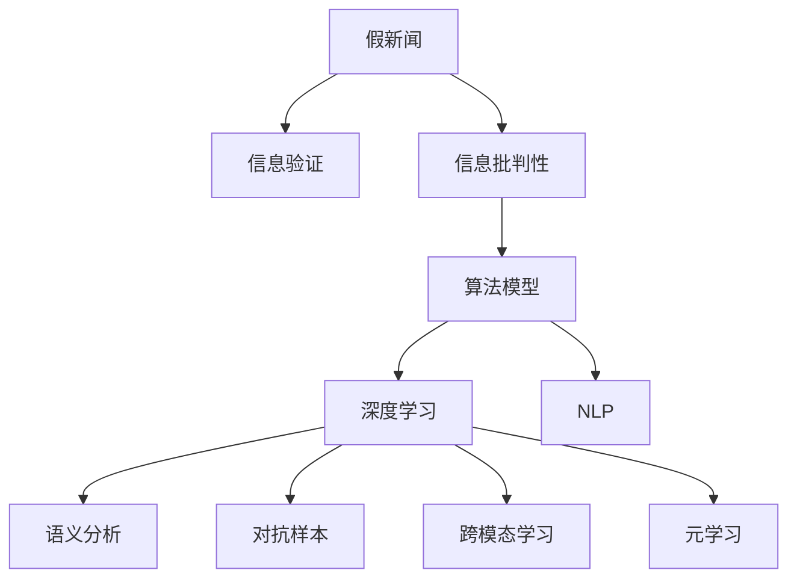

                 

# 信息验证和信息批判性思考：在假新闻和错误信息时代导航

> 关键词：假新闻，信息验证，信息批判性，算法模型，深度学习，机器学习，自然语言处理(NLP)

## 1. 背景介绍

### 1.1 问题由来
随着互联网的发展，信息传播的速度和范围急剧扩大，同时也带来了假新闻和错误信息泛滥的问题。假新闻的传播不仅误导公众，还可能造成严重社会后果。例如，COVID-19疫情期间，某些虚假信息导致公众恐慌、医疗资源错配，甚至影响政策决策。

当前，识别假新闻和错误信息的主要方法依赖人工审核和规则匹配，费时费力且效率低下。由于假新闻的文本内容可能包含复杂语义，传统的人工审核方法难以全面覆盖。而随着自然语言处理(NLP)和机器学习(ML)技术的成熟，自动化信息验证手段成为研究热点。

本文将从信息验证的算法原理、具体操作步骤、实际应用场景等角度展开探讨，帮助读者构建信息批判性思维，在假新闻和错误信息时代导航。

## 2. 核心概念与联系

### 2.1 核心概念概述

为更好地理解自动化信息验证方法，本节将介绍几个关键概念：

- **假新闻(Fake News)**：指故意编造、篡改或歪曲事实，以误导公众的信息。其形式多样，包括新闻文章、图片、视频等。
- **信息验证(Information Verification)**：指通过技术手段自动识别和验证信息的真实性，减少假新闻和错误信息的传播。
- **信息批判性(Information Literacy)**：指具备分析和评估信息质量的能力，不轻易相信未经核实的信息。
- **算法模型(Algorithmic Model)**：指基于机器学习、深度学习等技术开发的信息验证工具，如分类器、检测器等。
- **深度学习(Deep Learning)**：一种通过多层神经网络模拟人脑学习和决策的计算模型，适用于处理复杂语义任务。
- **自然语言处理(Natural Language Processing, NLP)**：涉及计算机与人类语言交互的技术，包括文本理解、生成、翻译等。
- **语义分析(Semantic Analysis)**：指通过语言模型解析文本背后的深层语义信息，如情感分析、主题建模等。
- **对抗样本(Adversarial Examples)**：指对模型进行微小的扰动，使其分类或推理出现错误，用于评估模型鲁棒性。
- **跨模态学习(Cross-Modal Learning)**：指将文本、图像、声音等多种模态的信息融合，增强模型对多维度数据的理解和判别能力。
- **元学习(Meta-Learning)**：指学习如何学习，通过很少的样本实现模型在多个任务上的快速迁移和适应。

这些概念之间的联系可以通过以下Mermaid流程图来展示：



这个流程图展示了信息验证和信息批判性思维的核心概念及其相互关系：

1. 假新闻是信息验证和批判性思维的目标。
2. 信息验证旨在通过技术手段识别和筛除假新闻，而信息批判性则是基于信息验证结果，进一步评估信息的可靠性。
3. 算法模型、深度学习、NLP等技术为信息验证提供了手段。
4. 语义分析、对抗样本、跨模态学习、元学习等方法，进一步增强了模型的效果和鲁棒性。

这些概念共同构成了自动化信息验证的技术框架，为其有效性和可靠性提供了保障。

## 3. 核心算法原理 & 具体操作步骤
### 3.1 算法原理概述

自动化信息验证的核心思想是利用机器学习算法，训练一个能够自动区分真实与虚假信息的模型。这一过程可以分为以下几步：

1. **数据收集**：收集大量标注数据，包含真实新闻和假新闻。
2. **特征提取**：将新闻文本转换成机器可处理的特征表示，如词向量、句法结构等。
3. **模型训练**：在标注数据上训练一个分类器，使其能够学习到真实与虚假信息的区别。
4. **验证与部署**：在新数据上评估模型的性能，部署到实际应用中验证。

### 3.2 算法步骤详解

基于深度学习的自动化信息验证通常包含以下详细步骤：

**Step 1: 数据预处理**
- 数据收集：从新闻网站、社交媒体、论坛等收集新闻数据。
- 数据清洗：去除噪声、无关信息，统一格式。
- 数据标注：请专家标注新闻真实性，标记为真实(True)或虚假(False)。

**Step 2: 特征提取**
- 文本表示：将新闻文本转换成向量表示，如使用Word2Vec、GloVe等词向量模型。
- 句法分析：解析新闻的句法结构，提取语义特征。
- 元数据提取：从新闻标题、作者、发布时间等信息中提取特征。
- 上下文建模：考虑新闻出现的上下文信息，如评论、转发数等。

**Step 3: 模型训练**
- 选择模型：选择适合的新闻分类模型，如卷积神经网络(CNN)、循环神经网络(RNN)、Transformer等。
- 数据划分：将数据划分为训练集、验证集和测试集。
- 模型训练：使用训练集数据训练模型，调整超参数优化模型性能。
- 模型评估：在验证集上评估模型性能，选择合适的模型。

**Step 4: 模型部署与验证**
- 模型部署：将训练好的模型部署到生产环境。
- 新数据验证：在新数据上测试模型性能，识别假新闻。
- 模型更新：根据新数据反馈，定期更新模型参数。

### 3.3 算法优缺点

自动化信息验证方法具有以下优点：
1. **高效性**：自动化方法可以快速处理大量数据，显著提高审核效率。
2. **广泛性**：可以处理多种形式的新闻内容，包括文本、图片、视频等。
3. **鲁棒性**：通过深度学习等方法，模型具备较强的泛化能力，适应新数据。
4. **可扩展性**：模型可以基于不同的特征和算法进行扩展，适应特定领域的新闻验证。

同时，该方法也存在一些局限性：
1. **高成本**：高质量标注数据的获取成本较高。
2. **数据偏差**：标注数据可能存在偏差，影响模型性能。
3. **误判风险**：模型可能存在误判，将真实信息误判为虚假。
4. **模型复杂**：深度学习等复杂模型需要较大的计算资源。
5. **可解释性**：模型的决策过程较难解释，缺乏透明度。

尽管存在这些局限性，但自动化信息验证方法在处理假新闻和错误信息方面展示了巨大的潜力，成为信息验证技术的重要方向。

### 3.4 算法应用领域

自动化信息验证方法广泛应用于新闻、社交媒体、电商等多个领域，具体包括：

- **新闻筛选与审核**：自动判断新闻真实性，避免假新闻上线。
- **社交媒体监管**：检测和删除虚假信息，维护平台秩序。
- **电商平台商品审核**：自动识别虚假商品描述和图片，防止欺诈。
- **金融新闻审核**：识别虚假财经信息，防范市场风险。
- **政府信息监测**：监控假新闻和谣言，维护社会稳定。
- **公共安全管理**：识别恐怖主义、暴力事件等威胁信息。

随着技术的不断发展，自动化信息验证将在更多领域得到应用，为社会安全和公共利益提供有力保障。

## 4. 数学模型和公式 & 详细讲解 & 举例说明
### 4.1 数学模型构建

基于深度学习的自动化信息验证模型通常采用二分类任务，将新闻分为真实(True)和虚假(False)两类。假设训练集为 $\{(x_i, y_i)\}_{i=1}^N$，其中 $x_i$ 为新闻文本，$y_i$ 为标注标签。模型的输出为新闻文本的分类概率，记为 $\hat{y}_i = f(x_i; \theta)$，其中 $f$ 为模型函数，$\theta$ 为模型参数。模型的损失函数为交叉熵损失：

$$
\mathcal{L}(\theta) = -\frac{1}{N}\sum_{i=1}^N [y_i\log \hat{y}_i + (1-y_i)\log(1-\hat{y}_i)]
$$

通过最小化损失函数，模型可以学习到文本与真实性标签之间的关系。

### 4.2 公式推导过程

以下以典型的卷积神经网络(CNN)模型为例，推导其公式和参数更新方法：

**Step 1: 特征提取**
- 将新闻文本转换成词向量表示，记为 $x \in \mathbb{R}^{n\times d}$，其中 $n$ 为句子长度，$d$ 为词向量维度。
- 使用卷积层提取局部特征，记为 $H \in \mathbb{R}^{n\times m}$，其中 $m$ 为卷积核个数。

**Step 2: 池化层**
- 使用池化层对卷积层的输出进行聚合，得到固定长度的特征表示，记为 $L \in \mathbb{R}^{1\times m}$。

**Step 3: 全连接层**
- 将池化层的输出与全连接层结合，得到模型的输出概率，记为 $\hat{y} \in \mathbb{R}$。

**Step 4: 损失函数**
- 计算损失函数，记为 $\mathcal{L}(\theta) = -\log \hat{y}$，其中 $\theta$ 为模型参数。

**Step 5: 梯度下降**
- 使用梯度下降等优化算法，最小化损失函数，更新模型参数 $\theta$。

### 4.3 案例分析与讲解

以假新闻检测为例，使用CNN模型对新闻文本进行分类。假设训练集为 $D = \{(x_i, y_i)\}_{i=1}^N$，其中 $x_i$ 为新闻文本，$y_i \in \{0,1\}$ 为标注标签，$0$ 表示真实新闻，$1$ 表示假新闻。模型输出 $\hat{y} = f(x; \theta)$，其中 $f$ 为CNN模型。假设模型损失函数为交叉熵损失：

$$
\mathcal{L}(\theta) = -\frac{1}{N}\sum_{i=1}^N [y_i\log \hat{y}_i + (1-y_i)\log(1-\hat{y}_i)]
$$

模型参数 $\theta$ 的更新公式为：

$$
\theta \leftarrow \theta - \eta \nabla_{\theta}\mathcal{L}(\theta) - \eta\lambda\theta
$$

其中 $\eta$ 为学习率，$\lambda$ 为正则化系数，$\nabla_{\theta}\mathcal{L}(\theta)$ 为损失函数对模型参数的梯度。

## 5. 项目实践：代码实例和详细解释说明
### 5.1 开发环境搭建

在进行自动化信息验证项目实践前，我们需要准备好开发环境。以下是使用Python进行PyTorch开发的环境配置流程：

1. 安装Anaconda：从官网下载并安装Anaconda，用于创建独立的Python环境。

2. 创建并激活虚拟环境：
```bash
conda create -n pytorch-env python=3.8 
conda activate pytorch-env
```

3. 安装PyTorch：根据CUDA版本，从官网获取对应的安装命令。例如：
```bash
conda install pytorch torchvision torchaudio cudatoolkit=11.1 -c pytorch -c conda-forge
```

4. 安装TensorFlow：
```bash
pip install tensorflow==2.5
```

5. 安装Keras：
```bash
pip install keras
```

6. 安装各类工具包：
```bash
pip install numpy pandas scikit-learn matplotlib tqdm jupyter notebook ipython
```

完成上述步骤后，即可在`pytorch-env`环境中开始项目实践。

### 5.2 源代码详细实现

这里我们以CNN模型为例，给出使用PyTorch进行假新闻检测的代码实现。

首先，定义模型类：

```python
import torch
import torch.nn as nn
import torch.optim as optim

class CNNModel(nn.Module):
    def __init__(self, vocab_size, emb_dim, num_class):
        super(CNNModel, self).__init__()
        self.embedding = nn.Embedding(vocab_size, emb_dim)
        self.conv1 = nn.Conv1d(emb_dim, 128, 3, padding=1)
        self.pool = nn.MaxPool1d(2, 2)
        self.fc1 = nn.Linear(128, num_class)
        
    def forward(self, x):
        x = self.embedding(x)
        x = x.permute(1, 0, 2)
        x = self.conv1(x)
        x = self.pool(x)
        x = x.contiguous().view(-1, 128)
        x = self.fc1(x)
        return x
```

然后，定义数据加载函数：

```python
from torch.utils.data import Dataset, DataLoader

class NewsDataset(Dataset):
    def __init__(self, texts, labels):
        self.texts = texts
        self.labels = labels
        
    def __len__(self):
        return len(self.texts)
    
    def __getitem__(self, item):
        return self.texts[item], self.labels[item]
        
train_dataset = NewsDataset(train_texts, train_labels)
test_dataset = NewsDataset(test_texts, test_labels)
```

接着，定义模型和优化器：

```python
model = CNNModel(vocab_size, emb_dim, num_class)
optimizer = optim.Adam(model.parameters(), lr=0.001)
```

最后，定义训练和评估函数：

```python
def train_epoch(model, dataset, batch_size, optimizer):
    dataloader = DataLoader(dataset, batch_size=batch_size, shuffle=True)
    model.train()
    epoch_loss = 0
    for batch in tqdm(dataloader, desc='Training'):
        input_ids, labels = batch
        optimizer.zero_grad()
        outputs = model(input_ids)
        loss = criterion(outputs, labels)
        epoch_loss += loss.item()
        loss.backward()
        optimizer.step()
    return epoch_loss / len(dataloader)

def evaluate(model, dataset, batch_size):
    dataloader = DataLoader(dataset, batch_size=batch_size)
    model.eval()
    preds, labels = [], []
    with torch.no_grad():
        for batch in tqdm(dataloader, desc='Evaluating'):
            input_ids, labels = batch
            outputs = model(input_ids)
            preds.append(torch.argmax(outputs, dim=1))
            labels.append(labels)
    print(classification_report(labels, preds))
```

最后，启动训练流程并在测试集上评估：

```python
epochs = 10
batch_size = 16

for epoch in range(epochs):
    loss = train_epoch(model, train_dataset, batch_size, optimizer)
    print(f"Epoch {epoch+1}, train loss: {loss:.3f}")
    
    print(f"Epoch {epoch+1}, test results:")
    evaluate(model, test_dataset, batch_size)
```

以上就是使用PyTorch对CNN模型进行假新闻检测的完整代码实现。可以看到，通过简单的配置，我们可以快速实现一个基本的假新闻检测模型。

### 5.3 代码解读与分析

让我们再详细解读一下关键代码的实现细节：

**NewsDataset类**：
- `__init__`方法：初始化文本和标签。
- `__len__`方法：返回数据集大小。
- `__getitem__`方法：获取单个样本。

**CNNModel类**：
- `__init__`方法：定义模型结构。
- `forward`方法：定义前向传播过程，包括嵌入层、卷积层、池化层和全连接层。

**train_epoch和evaluate函数**：
- 训练函数 `train_epoch`：在训练集上迭代，前向传播计算损失并反向传播更新模型参数。
- 评估函数 `evaluate`：在测试集上评估模型性能，使用sklearn的分类报告函数打印结果。

**训练流程**：
- 定义总的epoch数和batch size，开始循环迭代。
- 每个epoch内，先在训练集上训练，输出平均loss。
- 在测试集上评估，输出分类指标。
- 所有epoch结束后，在测试集上评估，给出最终测试结果。

## 6. 实际应用场景

### 6.1 新闻媒体

新闻媒体是自动化信息验证的重要应用场景之一。传统的新闻审核依赖人工审核，成本高且效率低。通过自动化信息验证技术，新闻媒体可以快速检测假新闻和错误信息，提高内容质量和公信力。

例如，某新闻媒体平台可以部署自动化信息验证系统，对用户投稿的新闻进行自动审核。系统通过分析新闻的文本内容、来源、作者等信息，使用预训练的深度学习模型判断新闻真实性，标记为真实或虚假。系统还可以结合读者反馈和专业审核，进一步提高判断的准确性。

### 6.2 社交媒体

社交媒体平台每天产生海量内容，假新闻和错误信息在平台上迅速传播。自动化信息验证技术可以在社交媒体上大规模部署，及时识别和删除虚假信息，维护平台秩序和用户信任。

例如，某社交媒体平台可以使用自动化信息验证系统对用户发布的内容进行实时检测。系统通过分析新闻的文本内容、引用来源等信息，使用预训练的深度学习模型判断新闻真实性，标记为真实或虚假。系统还可以设置举报机制，允许用户对虚假信息进行举报，进一步提高识别准确性。

### 6.3 电商网站

电商网站需要严格审核商品信息，防止假冒伪劣商品上线。自动化信息验证技术可以帮助电商网站快速检测虚假商品描述和图片，减少欺诈行为。

例如，某电商网站可以使用自动化信息验证系统对商品描述和图片进行审核。系统通过分析商品描述和图片的信息，使用预训练的深度学习模型判断商品真实性，标记为真实或虚假。系统还可以结合用户反馈和人工审核，进一步提高判断的准确性。

### 6.4 金融市场

金融市场需要及时掌握各类信息，防止虚假信息导致市场波动。自动化信息验证技术可以帮助金融市场快速检测虚假财经信息，防范市场风险。

例如，某金融市场可以使用自动化信息验证系统对财经新闻和报告进行审核。系统通过分析新闻和报告的文本内容、来源、作者等信息，使用预训练的深度学习模型判断信息真实性，标记为真实或虚假。系统还可以结合专家审核和市场反馈，进一步提高判断的准确性。

## 7. 工具和资源推荐
### 7.1 学习资源推荐

为了帮助开发者系统掌握自动化信息验证的技术基础和实践技巧，这里推荐一些优质的学习资源：

1. 《深度学习理论与实践》系列书籍：深入浅出地介绍了深度学习的基本理论和实践方法，适合入门和进阶学习。
2. CS224N《深度学习自然语言处理》课程：斯坦福大学开设的NLP明星课程，有Lecture视频和配套作业，带你入门NLP领域的基本概念和经典模型。
3. 《自然语言处理综论》书籍：由斯坦福大学NLP课程讲义整理而成，系统介绍了NLP的各种技术和应用。
4. 《机器学习实战》书籍：介绍机器学习的基本流程和技术，包括数据预处理、特征工程、模型训练等。
5. 《PyTorch实战》书籍：介绍了PyTorch的使用方法和实际应用案例，适合快速上手实践。

通过这些资源的学习实践，相信你一定能够快速掌握自动化信息验证的精髓，并用于解决实际的假新闻和错误信息问题。

### 7.2 开发工具推荐

高效的开发离不开优秀的工具支持。以下是几款用于自动化信息验证开发的常用工具：

1. PyTorch：基于Python的开源深度学习框架，灵活动态的计算图，适合快速迭代研究。
2. TensorFlow：由Google主导开发的开源深度学习框架，生产部署方便，适合大规模工程应用。
3. Keras：基于TensorFlow和Theano的高层深度学习库，易于上手和使用。
4. Weights & Biases：模型训练的实验跟踪工具，可以记录和可视化模型训练过程中的各项指标，方便对比和调优。
5. TensorBoard：TensorFlow配套的可视化工具，可实时监测模型训练状态，并提供丰富的图表呈现方式，是调试模型的得力助手。
6. Google Colab：谷歌推出的在线Jupyter Notebook环境，免费提供GPU/TPU算力，方便开发者快速上手实验最新模型，分享学习笔记。

合理利用这些工具，可以显著提升自动化信息验证任务的开发效率，加快创新迭代的步伐。

### 7.3 相关论文推荐

自动化信息验证技术的发展源于学界的持续研究。以下是几篇奠基性的相关论文，推荐阅读：

1. Fake News Detection with Deep Learning: A Survey and Taxonomy（假新闻检测综述与分类）：系统总结了假新闻检测的方法和分类，提供了全面的研究视角。
2. Detecting Online Advertisements and Fake News by Deep Neural Network（基于深度神经网络检测网络广告和假新闻）：提出了基于深度神经网络的假新闻检测方法，取得不错的效果。
3. A Systematic Review of False News Detection Methods and Techniques（假新闻检测方法综述）：总结了假新闻检测的各种技术和方法，包括文本分类、情感分析、多模态学习等。
4. Learning Transferable Representation for Fake News Detection（学习通用表示检测假新闻）：提出了一种通用的表示学习方法，提高假新闻检测的鲁棒性和泛化能力。
5. Multi-Modal Fake News Detection using Cross-Modal Attention and Multi-Task Learning（跨模态多模态假新闻检测）：提出了一种跨模态的假新闻检测方法，利用文本、图片等多模态信息，提高检测效果。
6. Meta-Learning for Fake News Detection（元学习检测假新闻）：提出了一种元学习方法，利用少量样本训练模型，实现快速迁移和适应新数据。

这些论文代表了大语言模型微调技术的发展脉络。通过学习这些前沿成果，可以帮助研究者把握学科前进方向，激发更多的创新灵感。

## 8. 总结：未来发展趋势与挑战

### 8.1 总结

本文对自动化信息验证的算法原理、操作步骤、实际应用等进行了全面系统的介绍。首先阐述了假新闻和错误信息的时代背景及其对社会的影响，明确了自动化信息验证技术的重要性和紧迫性。其次，从算法原理到实践操作，详细讲解了自动化信息验证的数学模型和具体操作步骤，给出了完整的代码实现。同时，本文还探讨了自动化信息验证在新闻媒体、社交媒体、电商网站、金融市场等领域的广泛应用，展示了其巨大的潜力和应用价值。最后，本文还推荐了相关学习资源、开发工具和研究论文，帮助读者进一步掌握自动化信息验证技术。

通过本文的系统梳理，可以看到，自动化信息验证技术在假新闻和错误信息时代具有重要意义。它能够自动化地识别和筛选假新闻，显著提高信息审核的效率和准确性。未来，随着深度学习、自然语言处理等技术的发展，自动化信息验证技术将进一步提升信息安全性和社会信任度。

### 8.2 未来发展趋势

展望未来，自动化信息验证技术将呈现以下几个发展趋势：

1. **模型复杂度提高**：随着深度学习、神经网络等技术的发展，模型复杂度将不断提高，提升信息验证的准确性和泛化能力。
2. **多模态融合**：结合文本、图像、视频等多种信息，利用跨模态学习提高信息验证的鲁棒性和全面性。
3. **元学习应用**：利用元学习方法，快速适应新任务和新数据，提高信息验证的灵活性和迁移能力。
4. **模型解释性增强**：引入可解释性技术，解释模型决策过程，增强信息验证的可信度和透明性。
5. **对抗样本研究**：研究对抗样本生成和检测技术，提高模型的鲁棒性和安全性。
6. **隐私保护措施**：引入隐私保护技术，保护用户数据和隐私，确保信息验证的合法性和合规性。
7. **实时性提升**：通过分布式计算和硬件优化，提高信息验证的实时性和效率，满足大规模部署需求。
8. **跨领域应用**：在更多领域推广信息验证技术，如法律、医疗、教育等，实现信息审核的全覆盖。

以上趋势凸显了自动化信息验证技术的广阔前景，为社会信息安全和公众信任提供了有力保障。

### 8.3 面临的挑战

尽管自动化信息验证技术已经取得了一定进展，但在实现假新闻和错误信息识别方面，仍面临诸多挑战：

1. **标注数据稀缺**：高质量标注数据的获取成本较高，难以覆盖所有领域和形式的信息。
2. **模型鲁棒性不足**：模型可能存在对抗样本鲁棒性差的问题，难以应对复杂多样的假新闻。
3. **隐私保护问题**：信息验证技术可能涉及用户隐私保护，如何在保证信息安全的前提下，保护用户隐私，是一个亟待解决的问题。
4. **解释性难题**：自动化信息验证模型缺乏可解释性，难以解释其决策过程，影响用户信任和接受度。
5. **计算资源消耗**：深度学习模型需要大量计算资源，如何优化模型结构，降低计算成本，是一个重要挑战。
6. **跨领域适应性**：模型在不同领域和任务上的泛化能力有限，如何提高模型适应性，是一个关键问题。
7. **法律法规限制**：信息验证技术需要符合相关法律法规要求，如何在合法合规的前提下，提升信息验证效果，是一个重要课题。

这些挑战需要研究者进一步探索和解决，推动自动化信息验证技术不断完善和成熟。

### 8.4 研究展望

面对自动化信息验证技术面临的挑战，未来的研究需要在以下几个方面寻求新的突破：

1. **无监督和半监督学习**：探索无监督和半监督学习技术，减少对标注数据的依赖，提高信息验证的覆盖面和效率。
2. **多模态信息融合**：结合文本、图像、视频等多种信息，利用跨模态学习提高信息验证的全面性和鲁棒性。
3. **元学习技术**：利用元学习技术，快速适应新任务和新数据，提高信息验证的灵活性和迁移能力。
4. **对抗样本生成与检测**：研究对抗样本生成和检测技术，提高模型的鲁棒性和安全性。
5. **隐私保护技术**：引入隐私保护技术，保护用户数据和隐私，确保信息验证的合法性和合规性。
6. **可解释性方法**：引入可解释性方法，解释模型决策过程，增强信息验证的可信度和透明性。
7. **分布式计算优化**：通过分布式计算和硬件优化，提高信息验证的实时性和效率，满足大规模部署需求。
8. **跨领域应用拓展**：在更多领域推广信息验证技术，如法律、医疗、教育等，实现信息审核的全覆盖。

这些研究方向将推动自动化信息验证技术的进一步发展和应用，为社会信息安全和公众信任提供更可靠的技术保障。

## 9. 附录：常见问题与解答

**Q1: 自动化信息验证技术是否会侵犯用户隐私？**

A: 自动化信息验证技术在实际应用中需要收集和处理用户数据，可能涉及用户隐私保护问题。为了保护用户隐私，需要在数据收集和处理过程中采取以下措施：
1. 匿名化处理：在数据预处理阶段，对用户数据进行匿名化处理，避免敏感信息泄露。
2. 最小化数据使用：仅使用必要的数据进行信息验证，避免过度收集和存储。
3. 用户同意：在数据收集前，获取用户同意，告知其数据使用目的和范围。
4. 数据保护措施：采用数据加密、访问控制等技术，保护用户数据的安全性。

通过这些措施，可以在保护用户隐私的前提下，实现信息验证技术的应用和推广。

**Q2: 自动化信息验证技术如何应对对抗样本攻击？**

A: 对抗样本攻击是指在输入数据中故意添加扰动，导致模型输出错误。自动化信息验证技术需要在模型设计、训练和部署等多个环节采取措施，提高模型的鲁棒性：
1. 对抗样本生成：研究对抗样本生成技术，识别和检测对抗样本，避免模型受到攻击。
2. 鲁棒性训练：在模型训练过程中，加入对抗样本，训练模型对扰动具备鲁棒性。
3. 异常检测：在部署阶段，使用异常检测技术，识别异常样本，避免模型受到攻击。
4. 多模型融合：通过多模型融合，提高模型对对抗样本的鲁棒性。
5. 解释性增强：通过可解释性方法，分析模型决策过程，解释对抗样本攻击的原因，增强模型的鲁棒性。

通过这些措施，可以在应对对抗样本攻击方面取得更好的效果，确保信息验证技术的可靠性。

**Q3: 自动化信息验证技术的可解释性如何实现？**

A: 自动化信息验证技术的可解释性通常通过以下方式实现：
1. 特征可视化：通过可视化特征表示，理解模型对输入数据的处理过程。
2. 局部解释性：在特定样本上，分析模型对每个特征的权重，理解模型决策逻辑。
3. 全局解释性：在全局上，分析模型在训练和推理过程中的表现，理解模型的整体行为。
4. 解释性模型：使用解释性较强的模型，如线性模型、决策树等，提高模型的可解释性。
5. 可解释性工具：使用可解释性工具，如SHAP、LIME等，分析模型的决策过程。

通过这些方法，可以增强自动化信息验证技术的可解释性，提高用户信任和接受度。

**Q4: 自动化信息验证技术的应用场景有哪些？**

A: 自动化信息验证技术可以应用于多个领域，如新闻媒体、社交媒体、电商网站、金融市场等。具体应用场景包括：
1. 新闻媒体：检测假新闻和错误信息，提高新闻质量。
2. 社交媒体：识别和删除虚假信息，维护平台秩序。
3. 电商网站：检测虚假商品描述和图片，减少欺诈行为。
4. 金融市场：检测虚假财经信息，防范市场风险。
5. 公共安全：识别恐怖主义、暴力事件等威胁信息，保障社会安全。
6. 教育领域：检测学术造假、抄袭等行为，维护学术诚信。
7. 医疗领域：检测虚假医疗信息，保护患者权益。

这些应用场景展示了自动化信息验证技术的广泛性和重要性，为社会各个领域提供了有力的技术支持。

**Q5: 自动化信息验证技术的未来发展方向是什么？**

A: 自动化信息验证技术的未来发展方向包括：
1. 多模态融合：结合文本、图像、视频等多种信息，提高信息验证的全面性和鲁棒性。
2. 元学习技术：利用元学习方法，快速适应新任务和新数据，提高信息验证的灵活性和迁移能力。
3. 可解释性方法：引入可解释性方法，解释模型决策过程，增强信息验证的可信度和透明性。
4. 隐私保护技术：引入隐私保护技术，保护用户数据和隐私，确保信息验证的合法性和合规性。
5. 分布式计算优化：通过分布式计算和硬件优化，提高信息验证的实时性和效率，满足大规模部署需求。
6. 跨领域应用拓展：在更多领域推广信息验证技术，如法律、医疗、教育等，实现信息审核的全覆盖。
7. 对抗样本研究：研究对抗样本生成和检测技术，提高模型的鲁棒性和安全性。
8. 模型复杂度提高：随着深度学习、神经网络等技术的发展，模型复杂度将不断提高，提升信息验证的准确性和泛化能力。

这些研究方向将推动自动化信息验证技术的进一步发展和应用，为社会信息安全和公众信任提供更可靠的技术保障。

---

作者：禅与计算机程序设计艺术 / Zen and the Art of Computer Programming

