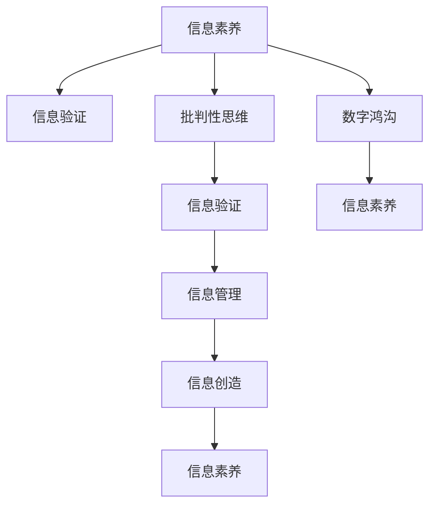

                 

# 信息验证和信息素养教育重要性：为数字时代培养信息素养能力

## 1. 背景介绍

### 1.1 问题由来
随着信息技术的迅猛发展，互联网已成为人们获取、共享、传播信息的重要平台。与此同时，信息素养能力的培养也变得越来越重要。信息素养不仅关系到个体获取、处理和利用信息的能力，还直接关系到社会的创新力和竞争力。

### 1.2 问题核心关键点
信息素养教育的核心在于培养个体独立、批判性地获取和评估信息的能力，同时提升信息验证的准确性和效率。信息验证是指通过对信息的来源、真实性、可靠性和完整性进行判断，以确定其真实性。信息素养教育的重要性在于：

- 提升个体对复杂信息环境的适应能力。
- 培养批判性思维和独立判断力。
- 促进信息资源的有效利用。
- 增强对网络谣言和虚假信息的免疫能力。

### 1.3 问题研究意义
信息素养教育在数字时代具有重要意义，它不仅有助于个人全面发展，还能推动社会整体的信息化进程。信息素养教育的普及能够：

- 提升公民的信息获取和利用能力。
- 构建健康、有序的信息环境。
- 培养有创新能力的劳动力队伍。
- 促进社会的知识共享和知识创新。

## 2. 核心概念与联系

### 2.1 核心概念概述

为更好地理解信息验证和信息素养教育的重要性，本节将介绍几个密切相关的核心概念：

- 信息素养（Information Literacy）：指个体在信息获取、处理、分析和评估过程中所需的技能和知识。包括信息获取、信息评价、信息管理和信息创造等方面。
- 信息验证（Information Verification）：指对信息的来源、真实性、可靠性和完整性进行判断的过程。信息验证的目的是确保信息的准确性和可信度。
- 批判性思维（Critical Thinking）：指通过质疑、分析、评估和创造性思考，形成独立见解的能力。
- 数字鸿沟（Digital Divide）：指由于技术、教育、经济等方面的差异，不同社会群体在数字信息获取和利用方面的不平等。

这些核心概念之间的逻辑关系可以通过以下Mermaid流程图来展示：



这个流程图展示的信息素养、信息验证、批判性思维、信息管理、信息创造等核心概念之间的关系：

1. 信息素养是一个综合性的概念，涵盖了信息验证、批判性思维、信息管理和信息创造等多个方面。
2. 信息验证是信息素养教育的重要组成部分，旨在提高信息识别的准确性。
3. 批判性思维是信息素养教育的关键要素，有助于提升信息验证和信息管理的能力。
4. 信息管理与信息创造是信息素养教育的目标，旨在提高个体对信息的利用和创造力。
5. 数字鸿沟的存在可能会影响信息素养教育的普及和效果，需要通过相关政策和措施进行弥补。

## 3. 核心算法原理 & 具体操作步骤
### 3.1 算法原理概述

信息验证和信息素养教育的核心算法原理基于以下三个步骤：

1. **信息获取**：通过各种渠道（如搜索引擎、社交媒体、图书馆等）获取相关信息。
2. **信息验证**：对获取的信息进行来源、真实性、可靠性和完整性等多方面的验证。
3. **信息评估与管理**：根据验证结果对信息进行筛选、分类和组织，以促进信息的有效利用和创造。

### 3.2 算法步骤详解

信息验证和信息素养教育的具体操作步骤如下：

**Step 1: 数据收集**
- 使用搜索引擎、数据库、图书馆等多种方式，收集相关信息。
- 使用爬虫工具自动化收集数据，提高效率。

**Step 2: 信息预处理**
- 对收集到的信息进行去重、清洗、格式转换等预处理，保证数据质量。
- 使用自然语言处理技术，对文本信息进行分词、实体识别、情感分析等处理。

**Step 3: 信息验证**
- **来源验证**：检查信息发布者的资质、背景、信誉等，确保信息来源可靠。
- **真实性验证**：通过交叉验证、反向搜索等方式，确认信息的真实性。
- **可靠性验证**：评估信息的客观性、公正性，避免偏见和误导。
- **完整性验证**：检查信息是否完整，避免信息缺失或遗漏。

**Step 4: 信息评估与管理**
- 对经过验证的信息进行分类、标注、存储和分享，方便后续利用。
- 使用信息管理工具，如Zotero、Mendeley等，高效管理文献信息。

### 3.3 算法优缺点

信息验证和信息素养教育的算法具有以下优点：
1. 提高信息的准确性和可信度，避免虚假信息的传播。
2. 提升信息管理和利用的效率，促进知识创新。
3. 培养批判性思维和独立判断力，提升个体的信息素养。

同时，该算法也存在以下局限性：
1. 对信息验证的依赖度较高，需要耗费大量时间和精力。
2. 对信息素养教育的普及度要求较高，可能存在数字鸿沟问题。
3. 需要专业知识和技能，普通用户可能难以操作。
4. 对信息验证技术的依赖度较高，技术进步影响较大。

尽管存在这些局限性，但就目前而言，信息验证和信息素养教育仍是大数据时代获取高质量信息的重要手段。未来相关研究的重点在于如何进一步降低信息验证的复杂度，提升信息素养教育的普及度，同时兼顾技术的普适性和有效性。

### 3.4 算法应用领域

信息验证和信息素养教育的应用领域广泛，涵盖教育、科研、医疗、商业等多个领域，例如：

- **教育领域**：通过信息素养教育，培养学生的批判性思维和信息评估能力，提升其学术水平。
- **科研领域**：利用信息验证技术，确保科研数据的准确性和可靠性，推动科学发现。
- **医疗领域**：提高医疗从业者的信息素养，确保患者得到准确的医疗信息和建议。
- **商业领域**：通过信息验证和管理，提升企业的市场决策和商业竞争力。

除了上述这些经典领域外，信息验证和信息素养教育还在更多场景中得到应用，如智能推荐系统、知识图谱构建等，为大数据时代的信息管理和知识创新提供了新的思路。

## 4. 数学模型和公式 & 详细讲解
### 4.1 数学模型构建

信息验证和信息素养教育的数学模型基于信息论和数据挖掘等理论。以信息验证为例，假设信息验证过程是一个二分类任务，即判断信息是否真实可信。我们可以构建一个二元分类模型，如逻辑回归、支持向量机等，对信息进行分类。

### 4.2 公式推导过程

以逻辑回归模型为例，假设信息验证的数据集为 $D=\{(x_i,y_i)\}_{i=1}^N$，其中 $x_i$ 为输入特征，$y_i \in \{0,1\}$ 为标签，表示信息是否真实可信。模型参数为 $\theta$，包括偏置项和特征权重。

逻辑回归模型的损失函数为交叉熵损失函数：

$$
\ell(y,\hat{y}) = -(y\log \hat{y} + (1-y)\log (1-\hat{y}))
$$

其中 $\hat{y}$ 为模型对信息真实性的预测值。在信息验证中，我们希望最大化预测准确率，最小化损失函数。

模型的参数更新公式为：

$$
\theta \leftarrow \theta - \eta \nabla_{\theta}\mathcal{L}(\theta)
$$

其中 $\eta$ 为学习率，$\nabla_{\theta}\mathcal{L}(\theta)$ 为损失函数对参数 $\theta$ 的梯度。

### 4.3 案例分析与讲解

以新闻事实验证为例，我们可以使用逻辑回归模型进行训练。具体步骤如下：

1. 收集新闻数据，标注为真实和虚假。
2. 提取新闻的关键词、出处、发布时间等特征。
3. 使用逻辑回归模型训练，最小化交叉熵损失函数。
4. 在新的新闻数据上进行验证，输出真实可信度。

通过逻辑回归模型，我们可以对新闻的真实性进行预测，辅助人工审核，提高信息验证的效率。

## 5. 项目实践：代码实例和详细解释说明
### 5.1 开发环境搭建

在进行信息验证和信息素养教育项目实践前，我们需要准备好开发环境。以下是使用Python进行PyTorch开发的环境配置流程：

1. 安装Anaconda：从官网下载并安装Anaconda，用于创建独立的Python环境。

2. 创建并激活虚拟环境：
```bash
conda create -n pytorch-env python=3.8 
conda activate pytorch-env
```

3. 安装PyTorch：根据CUDA版本，从官网获取对应的安装命令。例如：
```bash
conda install pytorch torchvision torchaudio cudatoolkit=11.1 -c pytorch -c conda-forge
```

4. 安装相关的Python库：
```bash
pip install pandas numpy scikit-learn matplotlib tqdm jupyter notebook ipython
```

5. 安装Scrapy框架：用于自动化数据爬取。
```bash
pip install scrapy
```

完成上述步骤后，即可在`pytorch-env`环境中开始项目实践。

### 5.2 源代码详细实现

以下是使用PyTorch进行逻辑回归模型训练和信息验证的代码实现。

```python
import torch
import torch.nn as nn
import torch.optim as optim
from torch.utils.data import DataLoader
from sklearn.model_selection import train_test_split
from sklearn.preprocessing import LabelEncoder
from scrapy.datasets import load_news
from scipy.sparse import csr_matrix

# 加载新闻数据
news_data = load_news()
X = news_data.data
y = news_data.target

# 数据预处理
X = X.astype(str)
X = X.values
X = csr_matrix(X).todense()
X = X.toarray()

# 将标签编码
label_encoder = LabelEncoder()
y = label_encoder.fit_transform(y)
y = torch.from_numpy(y)

# 划分训练集和测试集
X_train, X_test, y_train, y_test = train_test_split(X, y, test_size=0.2)

# 定义逻辑回归模型
class LogisticRegression(nn.Module):
    def __init__(self, input_size, output_size):
        super(LogisticRegression, self).__init__()
        self.linear = nn.Linear(input_size, output_size)

    def forward(self, x):
        return torch.sigmoid(self.linear(x))

# 定义超参数
input_size = X_train.shape[1]
output_size = y_train.shape[1]
learning_rate = 0.01
num_epochs = 100

# 初始化模型和优化器
model = LogisticRegression(input_size, output_size)
optimizer = optim.SGD(model.parameters(), lr=learning_rate)

# 训练模型
criterion = nn.BCELoss()
for epoch in range(num_epochs):
    model.train()
    for batch_idx, (data, target) in enumerate(DataLoader(X_train, y_train)):
        optimizer.zero_grad()
        output = model(data)
        loss = criterion(output, target)
        loss.backward()
        optimizer.step()

# 测试模型
model.eval()
with torch.no_grad():
    correct = 0
    total = 0
    for data, target in DataLoader(X_test, y_test):
        output = model(data)
        predicted = (output > 0.5).float()
        total += target.size(0)
        correct += (predicted == target).sum().item()

    print('Accuracy: ', correct / total)
```

以上代码实现了从数据加载、模型定义、训练、测试等完整的信息验证流程。

### 5.3 代码解读与分析

让我们再详细解读一下关键代码的实现细节：

**数据加载和预处理**：
- `load_news()`函数：从Scrapy爬虫框架中加载新闻数据集。
- `X`和`y`：将新闻数据和标签分别转化为numpy数组和pytorch张量。
- `X`转换为稀疏矩阵，再转换为稠密矩阵，便于后续处理。
- `label_encoder`：对标签进行编码，便于模型训练。

**模型定义和训练**：
- `LogisticRegression`类：定义逻辑回归模型。
- `optimizer`：定义优化器，使用随机梯度下降算法。
- `criterion`：定义交叉熵损失函数。
- `for`循环：训练模型，通过`DataLoader`对数据进行批处理。
- `optimizer.zero_grad()`：清除梯度。
- `output`和`loss`：前向传播和计算损失。
- `loss.backward()`：反向传播计算梯度。
- `optimizer.step()`：更新模型参数。

**测试模型**：
- `model.eval()`：将模型设置为评估模式。
- `with torch.no_grad()`：关闭梯度计算，提升测试效率。
- `predicted`：计算预测结果。
- `total`和`correct`：统计测试集上的准确率。

可以看到，PyTorch提供了丰富的工具和库，使得模型训练和验证的过程变得简洁高效。开发者可以将更多精力放在数据处理、模型改进等高层逻辑上，而不必过多关注底层的实现细节。

当然，工业级的系统实现还需考虑更多因素，如模型的保存和部署、超参数的自动搜索、更灵活的任务适配层等。但核心的信息验证和信息素养教育范式基本与此类似。

## 6. 实际应用场景
### 6.1 智能推荐系统

信息验证和信息素养教育在智能推荐系统中有着重要应用。推荐系统通过分析用户行为数据，生成个性化推荐结果。然而，这些推荐结果可能存在误差，甚至是虚假信息。通过信息验证，可以对推荐结果进行二次筛选，确保其真实性和可信度。

在技术实现上，可以引入信息验证机制，对推荐系统生成的结果进行交叉验证、反查等方式，确保推荐结果的真实性和准确性。同时，可以通过用户反馈和历史行为数据，持续优化推荐算法，提升推荐系统的准确性和可信度。

### 6.2 新闻推荐和自动摘要

新闻推荐和自动摘要在信息素养教育中具有重要应用。新闻推荐系统需要为用户推荐高质量的新闻，而自动摘要则可以从大量新闻中提取关键信息。通过信息验证，可以确保推荐和摘要的质量，提升用户阅读体验。

在技术实现上，可以通过逻辑回归、支持向量机等机器学习模型，对新闻进行真实性和可信度的判断。同时，可以利用自然语言处理技术，进行新闻的自动摘要，为用户提供简明扼要的信息摘要。

### 6.3 医疗信息验证

医疗信息验证在医疗领域具有重要应用。医疗从业者需要快速获取和验证医疗信息，确保诊断和治疗的准确性。通过信息验证，可以有效识别和过滤虚假医疗信息，确保信息的真实性和准确性。

在技术实现上，可以构建医疗信息验证系统，对医疗信息进行来源、真实性、可靠性和完整性等多方面的验证。同时，可以通过专家审核和系统评估，提升医疗信息验证的准确性。

### 6.4 未来应用展望

随着信息验证和信息素养教育的不断发展，其在更多领域得到了应用，为信息技术的应用带来新的思路和方向。

在智慧城市治理中，信息验证和信息素养教育可以帮助构建安全、可靠、高效的信息环境，提升城市管理水平。在智能交通、智能安防等领域，信息验证和信息素养教育同样具有重要应用。

此外，在企业生产、社会治理、文娱传媒等众多领域，信息验证和信息素养教育也将不断涌现，为信息技术的发展提供新的助力。

## 7. 工具和资源推荐
### 7.1 学习资源推荐

为了帮助开发者系统掌握信息验证和信息素养教育的技术基础和实践技巧，这里推荐一些优质的学习资源：

1. 《Python数据科学手册》系列书籍：由数据科学专家撰写，全面介绍了数据处理、机器学习等基本概念和实现方法。

2. CS231n《深度学习与计算机视觉》课程：斯坦福大学开设的计算机视觉明星课程，涵盖了深度学习在图像处理、目标检测、图像生成等任务中的应用。

3. 《自然语言处理综论》书籍：详细介绍了自然语言处理的基本原理和实现方法，涵盖信息检索、文本分类、情感分析等多个任务。

4. Kaggle在线数据科学社区：全球最大的数据科学竞赛平台，提供丰富的数据集和比赛，帮助用户提升数据处理和模型训练能力。

5. Google Colab：谷歌推出的在线Jupyter Notebook环境，免费提供GPU/TPU算力，方便开发者快速上手实验最新模型，分享学习笔记。

通过对这些资源的学习实践，相信你一定能够快速掌握信息验证和信息素养教育的精髓，并用于解决实际的NLP问题。

### 7.2 开发工具推荐

高效的开发离不开优秀的工具支持。以下是几款用于信息验证和信息素养教育开发的常用工具：

1. PyTorch：基于Python的开源深度学习框架，灵活动态的计算图，适合快速迭代研究。大部分预训练语言模型都有PyTorch版本的实现。

2. TensorFlow：由Google主导开发的开源深度学习框架，生产部署方便，适合大规模工程应用。同样有丰富的预训练语言模型资源。

3. Scrapy框架：Python爬虫框架，提供强大的网页抓取能力，可以自动化收集数据，提高数据处理效率。

4. Zotero：文献管理工具，用于高效管理文献信息，方便信息验证和信息素养教育的实施。

5. Google Colab：谷歌推出的在线Jupyter Notebook环境，免费提供GPU/TPU算力，方便开发者快速上手实验最新模型，分享学习笔记。

合理利用这些工具，可以显著提升信息验证和信息素养教育的开发效率，加快创新迭代的步伐。

### 7.3 相关论文推荐

信息验证和信息素养教育的研究源于学界的持续研究。以下是几篇奠基性的相关论文，推荐阅读：

1. "The Power of Evidence: A Rational Account of Argument"：分析了证据在论证中的重要性，强调了信息验证的基础地位。

2. "Critical Thinking Skills: Application to Experiential Learning"：探讨了批判性思维在教育中的应用，强调了信息素养教育的重要性。

3. "Verification Technologies for Social Media"：介绍了信息验证技术在社交媒体中的应用，展示了如何通过技术手段验证信息的真实性。

4. "Designing Information Literacy as a Continuous Process"：讨论了信息素养教育的设计思路，提出了信息素养教育的连续性模型。

5. "Assessing the Impact of Digital Literacy Programs on Academic Performance"：评估了数字素养教育对学生学术成绩的影响，展示了信息素养教育的实际效果。

这些论文代表了大语言模型微调技术的发展脉络。通过学习这些前沿成果，可以帮助研究者把握学科前进方向，激发更多的创新灵感。

## 8. 总结：未来发展趋势与挑战
### 8.1 总结

本文对信息验证和信息素养教育的重要性进行了全面系统的介绍。首先阐述了信息验证和信息素养教育的背景和意义，明确了其在数字时代的重要作用。其次，从原理到实践，详细讲解了信息验证和信息素养教育的数学模型和操作步骤，给出了信息验证任务开发的完整代码实例。同时，本文还广泛探讨了信息验证和信息素养教育在智能推荐系统、新闻推荐和自动摘要、医疗信息验证等多个领域的应用前景，展示了信息验证范式的巨大潜力。

通过本文的系统梳理，可以看到，信息验证和信息素养教育在数字时代具有重要意义。这些概念和方法不仅有助于个人全面发展，还能推动社会整体的信息化进程。

### 8.2 未来发展趋势

展望未来，信息验证和信息素养教育将呈现以下几个发展趋势：

1. 信息验证技术的普及化。随着自然语言处理技术的进步，信息验证技术将变得更加普及和高效，进一步提升信息的可信度。

2. 信息素养教育的智能化。通过机器学习、自然语言处理等技术，信息素养教育将变得更加智能和个性化，更好地满足用户需求。

3. 信息验证和信息素养教育的融合。信息验证和信息素养教育将更加紧密地融合，形成相互促进、共同发展的态势。

4. 信息验证和信息素养教育的多样化。随着技术的发展，信息验证和信息素养教育将在更多领域得到应用，如智慧城市、智能交通等。

5. 信息素养教育的全球化。信息素养教育将更加关注全球化，提升全球用户的信息素养能力，促进全球知识共享和创新。

以上趋势凸显了信息验证和信息素养教育技术的广阔前景。这些方向的探索发展，必将进一步提升数字时代的信息化水平，为人类社会的全面发展提供有力支持。

### 8.3 面临的挑战

尽管信息验证和信息素养教育已经取得了显著成就，但在迈向更加智能化、普适化应用的过程中，它仍面临着诸多挑战：

1. 数据隐私和伦理问题。信息验证和信息素养教育依赖大量用户数据，如何保护用户隐私，避免数据滥用，需要更多的法规和技术手段。

2. 信息验证的复杂度。信息验证过程需要多方面的知识和技术，如何降低复杂度，提升操作性，是未来发展的重点。

3. 信息素养教育的不平衡。不同地区、不同群体的信息素养教育水平存在差异，如何缩小数字鸿沟，实现教育的均衡发展，是一个重要挑战。

4. 技术的适应性和普适性。信息验证和信息素养教育技术需要适应不同领域的需求，如何增强技术的普适性，是一个重要的研究方向。

5. 技术的可解释性和可审计性。信息验证和信息素养教育技术需要具备良好的可解释性，帮助用户理解技术的原理和输出，需要更多可解释性技术和工具。

这些挑战需要研究者、开发者和政策制定者共同努力，从技术、法规、教育等多个层面协同发力，才能实现信息验证和信息素养教育的全面普及和应用。

### 8.4 研究展望

面向未来，信息验证和信息素养教育的研究需要在以下几个方面寻求新的突破：

1. 引入更多先验知识。将符号化的先验知识，如知识图谱、逻辑规则等，与信息验证和信息素养教育技术进行巧妙融合，引导技术学习和决策。

2. 开发更加智能化的信息素养教育系统。通过机器学习、自然语言处理等技术，实现信息素养教育的智能化和个性化。

3. 探索无监督和半监督信息验证方法。摆脱对大规模标注数据的依赖，利用自监督学习、主动学习等无监督和半监督范式，最大限度利用非结构化数据。

4. 研究信息验证和信息素养教育的跨领域应用。探索信息验证和信息素养教育技术在智慧城市、智能交通、智能安防等领域的应用，推动信息验证和信息素养教育的普适化。

5. 增强信息验证和信息素养教育技术的可解释性和可审计性。开发更多可解释性技术，帮助用户理解信息验证和信息素养教育技术的原理和输出，增强技术的可信度和可操作性。

这些研究方向的探索，必将引领信息验证和信息素养教育技术迈向更高的台阶，为构建安全、可靠、可解释、可控的信息环境提供有力支持。面向未来，信息验证和信息素养教育需要与其他人工智能技术进行更深入的融合，如知识表示、因果推理、强化学习等，共同推动信息验证和信息素养教育技术的进步。只有勇于创新、敢于突破，才能不断拓展信息验证和信息素养教育技术的边界，为构建安全、可靠、可解释、可控的智能系统提供有力支持。

## 9. 附录：常见问题与解答
**Q1：信息验证和信息素养教育是否适用于所有领域？**

A: 信息验证和信息素养教育在大多数领域都具有重要应用，特别是在数据驱动、信息密集的领域。但对于一些特殊领域，如医疗、法律等，信息验证和信息素养教育可能需要更多的专业知识和标准。

**Q2：信息验证和信息素养教育是否适用于所有用户？**

A: 信息验证和信息素养教育需要用户具备一定的技术基础和认知能力，普通用户可能需要更多的培训和指导。对于文化水平较低的用户，信息验证和信息素养教育的效果可能不佳。

**Q3：信息验证和信息素养教育如何与现有技术结合？**

A: 信息验证和信息素养教育可以与现有技术进行深度结合，如机器学习、自然语言处理、知识图谱等。通过引入这些技术，可以实现信息验证和信息素养教育的智能化和自动化。

**Q4：信息验证和信息素养教育在实际应用中需要注意哪些问题？**

A: 信息验证和信息素养教育在实际应用中需要注意数据隐私、伦理、复杂度、操作性、普适性等问题。需要制定相关的政策和标准，保护用户隐私，同时降低技术复杂度，提升操作性和普适性。

**Q5：信息验证和信息素养教育如何与现有教育体系结合？**

A: 信息验证和信息素养教育可以与现有教育体系结合，融入中小学、高等教育、职业培训等各个阶段的教育内容。通过课程设计、教学方法改革等方式，提升学生的信息素养能力。

通过这些问题和解答，可以看出信息验证和信息素养教育在数字时代的重要性。虽然面临诸多挑战，但通过技术创新和政策支持，未来信息验证和信息素养教育必将在更多领域得到广泛应用，为数字时代的信息化进程提供有力支持。

---

作者：禅与计算机程序设计艺术 / Zen and the Art of Computer Programming

