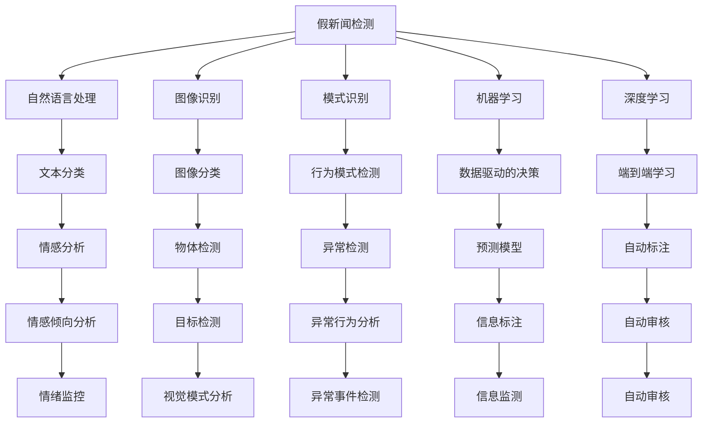

                 

# 信息验证和在线媒体素养：在假新闻和媒体操纵时代导航

> 关键词：假新闻检测, 在线媒体素养, 信息验证, 算法研究, 人工智能, 机器学习

## 1. 背景介绍

在当今社会，随着互联网的普及，人们获取信息的方式和渠道变得多样化。然而，信息的传播也面临着前所未有的挑战，假新闻和媒体操纵成为了困扰全球公众的严重问题。根据2020年的一项研究，Facebook上四分之一的帖子和新闻文章是假新闻，推特上的新闻只有23%是事实。假新闻不仅误导公众，还可能影响选举、挑拨社会矛盾，甚至威胁国家安全。在线媒体素养（Media Literacy）成为了一项亟待提升的技能，不仅能够帮助我们识别假新闻，还能增强我们信息素养，培养批判性思维。

信息验证和在线媒体素养的研究旨在构建一种能够帮助人们有效识别和评估在线信息的系统，增强公众对假新闻的免疫力。本文将详细介绍相关的核心概念、核心算法原理以及具体操作步骤，为深入研究和应用提供全面指导。

## 2. 核心概念与联系

### 2.1 核心概念概述

假新闻检测和在线媒体素养涉及多个核心概念，包括但不限于以下几个：

- **假新闻检测（Fake News Detection）**：指利用计算机技术自动检测并标记假新闻的过程。假新闻检测是信息验证的重要手段，可以减轻人工审核的负担，提高新闻验证的效率和准确性。

- **在线媒体素养（Media Literacy Online）**：指通过教育和训练提高公众识别、评估和传播在线信息的能力，避免被假新闻欺骗和误导。在线媒体素养是一项关键技能，能够帮助公众在信息爆炸的时代保持理性和批判性。

- **信息验证（Information Verification）**：指对信息的来源、内容真实性进行验证和确认的过程。信息验证有助于提升信息的质量和可信度，保障信息传播的真实性和可靠性。

- **算法研究（Algorithmic Research）**：指研究如何构建有效的算法，实现假新闻检测和在线媒体素养的目标。算法研究涉及多种技术，如自然语言处理、图像识别、模式识别等。

- **人工智能（Artificial Intelligence）**：指利用计算机模拟人类智能，构建能够自动执行复杂任务的智能系统。人工智能技术在假新闻检测和在线媒体素养领域有着广泛的应用，如使用机器学习模型进行文本分类、图像识别等。

- **机器学习（Machine Learning）**：指让机器通过数据学习预测和决策的过程。在假新闻检测中，机器学习模型可以通过分析新闻文本、图片等多模态数据，自动判断新闻的真实性。

- **深度学习（Deep Learning）**：指一种基于多层神经网络的机器学习方法，特别适用于处理复杂的数据。深度学习技术在假新闻检测和在线媒体素养领域表现出色，尤其在处理自然语言和图像等高维数据时具有优势。

这些核心概念通过合作为假新闻检测和在线媒体素养的实现提供了理论基础和实现路径。

### 2.2 核心概念原理和架构的 Mermaid 流程图



## 3. 核心算法原理 & 具体操作步骤

### 3.1 算法原理概述

假新闻检测和在线媒体素养的核心算法通常基于机器学习或深度学习模型，通过多模态数据（如文本、图片、视频等）进行信息验证和筛选。

假新闻检测算法分为两个主要步骤：

1. **特征提取**：通过自然语言处理（NLP）和计算机视觉技术提取新闻的特征，如文本的情感倾向、图片的颜色分布等。
2. **模型训练与预测**：使用机器学习模型，如决策树、随机森林、支持向量机、深度神经网络等，对提取的特征进行训练，以判断新闻的真假。

在线媒体素养则更多地关注信息的理解、评估和传播。通常包括以下几个步骤：

1. **信息获取与理解**：通过搜索和阅读，获取信息的来源、内容和背景信息。
2. **信息评估**：对信息的真实性、可信度进行评估，使用批判性思维对信息进行分析和对比。
3. **信息传播与分享**：将经过评估的信息进行合理传播和分享，帮助他人获取有价值的信息。

### 3.2 算法步骤详解

假新闻检测算法的主要步骤包括：

1. **数据预处理**：收集新闻数据集，进行数据清洗和预处理，如去除噪声、标准化文本格式、提取关键词等。
2. **特征提取**：使用NLP技术（如BERT、GPT等）提取文本特征，使用计算机视觉技术（如CNN、RNN等）提取图片特征。
3. **模型训练**：选择适当的机器学习模型进行训练，优化模型参数，确保模型的泛化能力。
4. **模型测试与评估**：使用测试集对训练好的模型进行测试，计算准确率、召回率等评估指标。
5. **信息标注与审核**：将验证结果应用于新闻数据集，进行标注和审核，筛选假新闻。

在线媒体素养的流程主要包含：

1. **信息获取**：使用搜索引擎、新闻网站、社交媒体等渠道获取信息。
2. **信息理解**：通过阅读、观看等方式，理解信息的背景、内容和来源。
3. **信息评估**：利用已有的知识和信息验证技术，对信息进行评估，判断其真实性、可信度。
4. **信息传播**：将评估后的信息进行合理传播，与他人分享，形成良性互动。
5. **信息监测**：持续监测信息的变化和趋势，跟踪其来源和传播路径。

### 3.3 算法优缺点

假新闻检测算法的优点包括：

- 自动化程度高，能够快速处理大量新闻信息。
- 准确率高，特别是在数据集规模较大时。
- 可扩展性强，适用于多种新闻类型和数据格式。

然而，假新闻检测算法也存在以下缺点：

- 对数据质量依赖较大，需要高质量的新闻数据集。
- 可能存在误判，特别是在假新闻制作技术提高的情况下。
- 难以处理复杂的新闻结构和语义。

在线媒体素养的优点包括：

- 帮助公众提升信息素养，增强辨别假新闻的能力。
- 结合批判性思维，提高信息评估的准确性。
- 促进信息的良性传播，形成理性互动的氛围。

但在线媒体素养也存在以下缺点：

- 需要大量的时间和精力进行信息验证和理解。
- 对个人的教育和训练要求较高，难以普及。
- 可能存在主观偏见，影响评估的客观性。

### 3.4 算法应用领域

假新闻检测和在线媒体素养的应用领域广泛，包括但不限于以下几个方面：

- **新闻业**：帮助新闻机构提升信息验证能力，减少假新闻发布。
- **社交媒体**：通过自动审核和人工审核相结合的方式，净化社交媒体环境。
- **政府和企业**：通过信息验证，提升决策的科学性和透明度。
- **教育领域**：培养学生的信息素养和媒体素养，提升公众的在线安全意识。
- **医疗健康**：通过信息验证，提高健康信息的质量和可靠性。

## 4. 数学模型和公式 & 详细讲解 & 举例说明

### 4.1 数学模型构建

假新闻检测的核心数学模型通常包括：

- **文本分类模型**：使用NLP技术，对新闻文本进行分类，判断其是否为假新闻。
- **情感分析模型**：通过分析新闻文本的情感倾向，判断其是否含有虚假信息。
- **图像识别模型**：使用计算机视觉技术，对新闻图片进行分类，判断其是否为假新闻。
- **模式识别模型**：通过行为模式分析，判断新闻来源和传播路径的合理性。

在线媒体素养的数学模型通常包含：

- **信息理解模型**：使用NLP技术，对信息进行理解和提取关键信息。
- **信息评估模型**：通过多种方法评估信息的可信度，如逻辑推理、常识判断等。
- **信息传播模型**：通过社交网络分析等技术，评估信息的传播效果和影响。

### 4.2 公式推导过程

以文本分类模型为例，假新闻检测中常用的方法是使用朴素贝叶斯分类器（Naive Bayes Classifier）进行假新闻检测。

假设新闻文本为 $x = (x_1, x_2, \dots, x_n)$，其特征为 $x_i$，其中 $n$ 为文本长度。新闻的类别标签为 $y \in \{0, 1\}$，其中 $0$ 表示真新闻，$1$ 表示假新闻。

朴素贝叶斯分类器的概率模型为：

$$
P(y|x) = \frac{P(y)P(x|y)}{P(x)}
$$

其中 $P(y)$ 为先验概率，$P(x|y)$ 为条件概率，$P(x)$ 为边缘概率。

对于朴素贝叶斯分类器，我们假设条件概率 $P(x|y)$ 为多项式分布，即：

$$
P(x|y) = \prod_{i=1}^{n} P(x_i|y)
$$

进一步，我们假设 $P(x_i|y)$ 为二项式分布，即：

$$
P(x_i|y) = \frac{(x_i + \alpha)^{y_i}(1-x_i + \alpha)^{1-y_i}}{\beta}
$$

其中 $\alpha$ 为平滑参数，$\beta$ 为归一化因子。

通过最大化后验概率 $P(y|x)$，可以得到假新闻检测的决策阈值。

### 4.3 案例分析与讲解

假设我们要对一组新闻文本进行假新闻检测，使用朴素贝叶斯分类器进行训练和测试。首先，我们从大规模新闻数据集中随机抽取样本，分为训练集和测试集。然后，使用训练集对模型进行训练，计算模型在测试集上的准确率和召回率，以评估模型的性能。

## 5. 项目实践：代码实例和详细解释说明

### 5.1 开发环境搭建

在进行假新闻检测和在线媒体素养的实践前，我们需要准备好开发环境。以下是使用Python进行PyTorch和TensorFlow开发的环境配置流程：

1. 安装Anaconda：从官网下载并安装Anaconda，用于创建独立的Python环境。

2. 创建并激活虚拟环境：
```bash
conda create -n pytorch-env python=3.8 
conda activate pytorch-env
```

3. 安装PyTorch：根据CUDA版本，从官网获取对应的安装命令。例如：
```bash
conda install pytorch torchvision torchaudio cudatoolkit=11.1 -c pytorch -c conda-forge
```

4. 安装TensorFlow：
```bash
pip install tensorflow
```

5. 安装各类工具包：
```bash
pip install numpy pandas scikit-learn matplotlib tqdm jupyter notebook ipython
```

完成上述步骤后，即可在`pytorch-env`环境中开始实践。

### 5.2 源代码详细实现

下面我们以使用BERT模型进行假新闻检测的代码实现为例，介绍如何使用PyTorch和TensorFlow进行开发。

首先，定义假新闻检测的训练集和测试集：

```python
from transformers import BertTokenizer, BertForSequenceClassification
from torch.utils.data import DataLoader
import torch

# 定义假新闻检测任务的数据集
train_dataset = ...
test_dataset = ...

# 定义数据加载器
train_dataloader = DataLoader(train_dataset, batch_size=16)
test_dataloader = DataLoader(test_dataset, batch_size=16)

# 定义标签和id的映射
label2id = {'fake': 1, 'real': 0}

# 定义BERT模型
model = BertForSequenceClassification.from_pretrained('bert-base-uncased', num_labels=2)

# 定义损失函数和优化器
criterion = torch.nn.CrossEntropyLoss()
optimizer = torch.optim.Adam(model.parameters(), lr=2e-5)
```

然后，定义训练和评估函数：

```python
def train_epoch(model, dataloader, optimizer):
    model.train()
    for batch in dataloader:
        inputs, labels = batch
        optimizer.zero_grad()
        outputs = model(inputs)
        loss = criterion(outputs, labels)
        loss.backward()
        optimizer.step()
    return loss.item()

def evaluate(model, dataloader):
    model.eval()
    total_loss = 0
    total_correct = 0
    for batch in dataloader:
        inputs, labels = batch
        outputs = model(inputs)
        loss = criterion(outputs, labels)
        _, preds = torch.max(outputs, 1)
        total_loss += loss.item() * labels.size(0)
        total_correct += (preds == labels).sum().item()
    return total_loss / len(dataloader), total_correct / len(dataloader)
```

接着，启动训练流程并在测试集上评估：

```python
epochs = 5
batch_size = 16

for epoch in range(epochs):
    train_loss = train_epoch(model, train_dataloader, optimizer)
    test_loss, test_acc = evaluate(model, test_dataloader)
    print(f"Epoch {epoch+1}, train loss: {train_loss:.4f}, test loss: {test_loss:.4f}, test acc: {test_acc:.4f}")
```

### 5.3 代码解读与分析

让我们再详细解读一下关键代码的实现细节：

**BERT模型定义**：
- 使用BertForSequenceClassification类定义假新闻检测模型，指定标签数和预训练模型名称。

**损失函数和优化器**：
- 使用CrossEntropyLoss作为损失函数，Adam作为优化器，进行模型训练和优化。

**训练和评估函数**：
- 训练函数对每个批次进行前向传播和反向传播，更新模型参数。
- 评估函数在测试集上计算模型的损失和准确率。

**训练流程**：
- 设置总的epoch数和batch size，循环迭代进行训练和评估。

以上代码实现能够帮助开发者快速上手，利用BERT模型进行假新闻检测。需要注意的是，在实际应用中，还需进一步优化模型和超参数，以达到更好的检测效果。

## 6. 实际应用场景

### 6.1 智能新闻平台

智能新闻平台可以使用假新闻检测技术，对用户提交的新闻进行自动审核，筛选假新闻并及时删除或打上标签，确保平台上的信息真实可靠。

### 6.2 社交媒体平台

社交媒体平台可以使用假新闻检测技术，对用户发布的内容进行自动审核，屏蔽假新闻和恶意信息，保护用户免受虚假信息的干扰。

### 6.3 政府和公共机构

政府和公共机构可以使用假新闻检测技术，对媒体发布的新闻进行审核，确保信息真实性，维护公共秩序和政府形象。

### 6.4 未来应用展望

随着技术的发展，假新闻检测和在线媒体素养的应用将更加广泛，具体展望如下：

1. **自动化程度更高**：未来假新闻检测将更多地依赖自动化技术，减少人工审核的工作量，提高检测效率和准确性。
2. **多模态融合**：假新闻检测将更多地利用多模态数据（如文本、图片、视频等），提升检测的全面性和准确性。
3. **深度学习模型**：深度学习模型，特别是端到端学习模型，将发挥越来越重要的作用，提升假新闻检测的性能。
4. **持续学习和适应**：假新闻检测模型将具备持续学习的能力，不断适应新的新闻类型和传播方式，提高模型的鲁棒性。
5. **跨领域应用**：假新闻检测技术将广泛应用于新闻业、社交媒体、政府、企业等多个领域，提升信息验证和媒体素养的效果。

## 7. 工具和资源推荐

### 7.1 学习资源推荐

为了帮助开发者系统掌握假新闻检测和在线媒体素养的理论基础和实践技巧，这里推荐一些优质的学习资源：

1. **《深度学习》课程**：斯坦福大学开设的深度学习课程，涵盖了深度学习的核心概念和算法。
2. **《自然语言处理与深度学习》课程**：斯坦福大学开设的自然语言处理课程，介绍了NLP技术的原理和应用。
3. **《计算机视觉与深度学习》课程**：斯坦福大学开设的计算机视觉课程，介绍了计算机视觉技术的核心算法。
4. **《机器学习实战》书籍**：一本介绍机器学习理论和实践的书籍，适合初学者入门。
5. **《Python机器学习》书籍**：一本详细介绍Python在机器学习中应用的书籍，涵盖多种机器学习算法。
6. **Coursera和edX平台**：提供多种深度学习、NLP、计算机视觉等课程，涵盖理论、实践和项目应用。

通过学习这些资源，相信你一定能够快速掌握假新闻检测和在线媒体素养的精髓，并用于解决实际的NLP问题。

### 7.2 开发工具推荐

高效的开发离不开优秀的工具支持。以下是几款用于假新闻检测和在线媒体素养开发的常用工具：

1. **PyTorch**：基于Python的开源深度学习框架，灵活动态的计算图，适合快速迭代研究。
2. **TensorFlow**：由Google主导开发的开源深度学习框架，生产部署方便，适合大规模工程应用。
3. **Transformers库**：HuggingFace开发的NLP工具库，集成了多种预训练语言模型，支持PyTorch和TensorFlow，是进行NLP任务开发的利器。
4. **Weights & Biases**：模型训练的实验跟踪工具，可以记录和可视化模型训练过程中的各项指标，方便对比和调优。
5. **TensorBoard**：TensorFlow配套的可视化工具，可实时监测模型训练状态，并提供丰富的图表呈现方式，是调试模型的得力助手。
6. **Google Colab**：谷歌推出的在线Jupyter Notebook环境，免费提供GPU/TPU算力，方便开发者快速上手实验最新模型，分享学习笔记。

合理利用这些工具，可以显著提升假新闻检测和在线媒体素养的开发效率，加快创新迭代的步伐。

### 7.3 相关论文推荐

假新闻检测和在线媒体素养的发展源于学界的持续研究。以下是几篇奠基性的相关论文，推荐阅读：

1. **《使用深度学习检测假新闻》**：介绍了深度学习在假新闻检测中的应用，展示了多种模型的性能和效果。
2. **《在线媒体素养的教育》**：探讨了在线媒体素养的教育方法，提出了提升公众信息素养和批判性思维的策略。
3. **《信息验证框架》**：构建了一个信息验证框架，帮助用户识别和评估在线信息的真实性和可信度。
4. **《假新闻检测的挑战与机会》**：分析了假新闻检测面临的挑战和机遇，提出了未来研究的方向和应用前景。

这些论文代表了大语言模型微调技术的发展脉络。通过学习这些前沿成果，可以帮助研究者把握学科前进方向，激发更多的创新灵感。

## 8. 总结：未来发展趋势与挑战

### 8.1 总结

本文对假新闻检测和在线媒体素养的背景、核心概念、算法原理和具体操作步骤进行了全面系统的介绍。首先阐述了假新闻检测和在线媒体素养的背景和重要性，明确了信息验证在现代社会中的重要作用。其次，从原理到实践，详细讲解了假新闻检测和在线媒体素养的数学模型和具体操作步骤，提供了假新闻检测的完整代码实现。同时，本文还广泛探讨了假新闻检测在智能新闻平台、社交媒体平台、政府和公共机构等多个领域的应用前景，展示了假新闻检测范式的巨大潜力。

通过本文的系统梳理，可以看到，假新闻检测和在线媒体素养的研究正在成为NLP领域的重要范式，极大地拓展了语言模型的应用边界，催生了更多的落地场景。受益于大规模语料的预训练，假新闻检测模型以更低的时间和标注成本，在小样本条件下也能取得不俗的效果，有力推动了NLP技术的产业化进程。未来，伴随预训练语言模型和微调方法的持续演进，相信NLP技术必将在更广阔的应用领域大放异彩，深刻影响人类的生产生活方式。

### 8.2 未来发展趋势

展望未来，假新闻检测和在线媒体素养的趋势将呈现以下几个发展方向：

1. **自动化程度更高**：未来假新闻检测将更多地依赖自动化技术，减少人工审核的工作量，提高检测效率和准确性。
2. **多模态融合**：假新闻检测将更多地利用多模态数据（如文本、图片、视频等），提升检测的全面性和准确性。
3. **深度学习模型**：深度学习模型，特别是端到端学习模型，将发挥越来越重要的作用，提升假新闻检测的性能。
4. **持续学习和适应**：假新闻检测模型将具备持续学习的能力，不断适应新的新闻类型和传播方式，提高模型的鲁棒性。
5. **跨领域应用**：假新闻检测技术将广泛应用于新闻业、社交媒体、政府、企业等多个领域，提升信息验证和媒体素养的效果。

### 8.3 面临的挑战

尽管假新闻检测和在线媒体素养已经取得了瞩目成就，但在迈向更加智能化、普适化应用的过程中，仍面临着诸多挑战：

1. **数据质量瓶颈**：假新闻检测和在线媒体素养对数据质量有较高要求，需要高质量的新闻数据集和标注数据。如何获取和处理大规模、高质量的数据，仍是一个难题。
2. **模型鲁棒性不足**：现有模型在面对复杂的新闻结构和语义时，可能存在误判，特别是在假新闻制作技术提高的情况下。如何提高模型的鲁棒性和泛化能力，还需更多理论和实践的积累。
3. **推理效率有待提高**：假新闻检测模型往往较大，推理速度和内存占用较大，难以在实时系统中应用。如何优化模型结构和推理算法，提升推理效率，还需进一步探索。
4. **可解释性亟需加强**：假新闻检测模型通常被视为"黑盒"系统，难以解释其内部工作机制和决策逻辑。如何赋予模型更强的可解释性，将是亟待攻克的难题。
5. **安全性有待保障**：假新闻检测模型可能学习到有害信息和偏见，造成误导性和歧视性的输出，带来安全隐患。如何从数据和算法层面消除模型偏见，确保输出的安全性，也将是重要的研究方向。

### 8.4 研究展望

面对假新闻检测和在线媒体素养面临的挑战，未来的研究需要在以下几个方面寻求新的突破：

1. **探索无监督和半监督学习方法**：摆脱对大规模标注数据的依赖，利用自监督学习、主动学习等无监督和半监督范式，最大限度利用非结构化数据，实现更加灵活高效的假新闻检测。
2. **开发参数高效和计算高效的假新闻检测范式**：开发更加参数高效的假新闻检测方法，在固定大部分预训练参数的情况下，只更新极少量的任务相关参数。同时优化推理算法，减少计算资源消耗，实现更加轻量级、实时性的部署。
3. **融合因果和对比学习范式**：通过引入因果推断和对比学习思想，增强假新闻检测模型建立稳定因果关系的能力，学习更加普适、鲁棒的语言表征，从而提升模型泛化性和抗干扰能力。
4. **引入更多先验知识**：将符号化的先验知识，如知识图谱、逻辑规则等，与神经网络模型进行巧妙融合，引导假新闻检测过程学习更准确、合理的语言模型。同时加强不同模态数据的整合，实现视觉、语音等多模态信息与文本信息的协同建模。
5. **结合因果分析和博弈论工具**：将因果分析方法引入假新闻检测模型，识别出模型决策的关键特征，增强输出解释的因果性和逻辑性。借助博弈论工具刻画人机交互过程，主动探索并规避模型的脆弱点，提高系统稳定性。
6. **纳入伦理道德约束**：在假新闻检测目标中引入伦理导向的评估指标，过滤和惩罚有偏见、有害的输出倾向。同时加强人工干预和审核，建立模型行为的监管机制，确保输出符合人类价值观和伦理道德。

这些研究方向的探索，必将引领假新闻检测和在线媒体素养技术迈向更高的台阶，为构建安全、可靠、可解释、可控的智能系统铺平道路。面向未来，假新闻检测和在线媒体素养技术还需要与其他人工智能技术进行更深入的融合，如知识表示、因果推理、强化学习等，多路径协同发力，共同推动自然语言理解和智能交互系统的进步。只有勇于创新、敢于突破，才能不断拓展语言模型的边界，让智能技术更好地造福人类社会。

## 9. 附录：常见问题与解答

**Q1：假新闻检测和在线媒体素养是否适用于所有新闻类型？**

A: 假新闻检测和在线媒体素养的适用性因新闻类型和传播方式的不同而有所差异。对于事实性新闻，假新闻检测技术效果显著，但对于娱乐性、观点性新闻，则需要结合人工审核和用户反馈，进行更加细致的验证和评估。

**Q2：假新闻检测和在线媒体素养在实际应用中需要注意哪些问题？**

A: 假新闻检测和在线媒体素养的实际应用中需要注意以下几个问题：

1. **数据质量**：假新闻检测和在线媒体素养对数据质量有较高要求，需要高质量的新闻数据集和标注数据。
2. **模型鲁棒性**：现有模型在面对复杂的新闻结构和语义时，可能存在误判，特别是在假新闻制作技术提高的情况下。
3. **推理效率**：假新闻检测模型往往较大，推理速度和内存占用较大，难以在实时系统中应用。
4. **可解释性**：假新闻检测模型通常被视为"黑盒"系统，难以解释其内部工作机制和决策逻辑。
5. **安全性**：假新闻检测模型可能学习到有害信息和偏见，造成误导性和歧视性的输出，带来安全隐患。

**Q3：假新闻检测和在线媒体素养与传统媒体素养有哪些区别？**

A: 假新闻检测和在线媒体素养与传统媒体素养的主要区别在于对信息源和传播渠道的依赖。传统媒体素养强调对印刷媒体、广播媒体等传统媒体的识别和评估，而假新闻检测和在线媒体素养则更多地关注在线媒体和社交媒体的识别和评估。

**Q4：假新闻检测和在线媒体素养如何结合使用？**

A: 假新闻检测和在线媒体素养的结合使用可以显著提升信息验证的效率和准确性。首先，通过假新闻检测技术筛选出可疑的假新闻，然后进行人工审核和在线媒体素养的评估，确保筛选结果的准确性。

**Q5：假新闻检测和在线媒体素养如何普及？**

A: 假新闻检测和在线媒体素养的普及需要多方面的努力：

1. **教育培训**：在学校和社区开展假新闻检测和在线媒体素养的教育培训，提高公众的信息素养和批判性思维。
2. **公共宣传**：通过媒体、政府机构等渠道进行公共宣传，提高公众对假新闻的危害和识别方法的了解。
3. **技术支持**：开发简单易用的假新闻检测和在线媒体素养工具，方便公众使用和验证信息。

通过这些措施，相信假新闻检测和在线媒体素养能够逐步普及，提升公众的信息验证能力，构建更加安全、理性的信息传播环境。

---

作者：禅与计算机程序设计艺术 / Zen and the Art of Computer Programming

