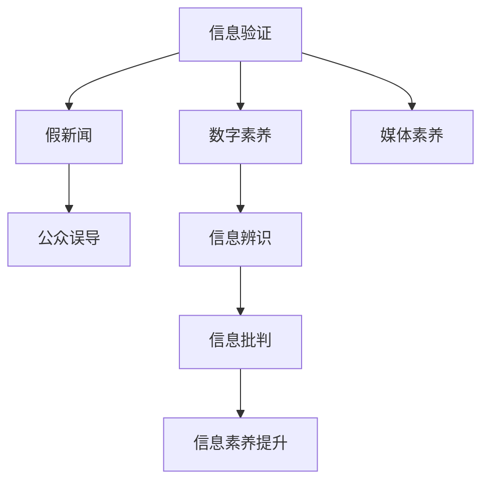

                 

# 信息验证和数字素养：在错误信息时代导航

> 关键词：信息验证, 数字素养, 假新闻, 媒体素养, 数据驱动, 人工智能, 真相挖掘

## 1. 背景介绍

在当今信息爆炸的时代，大量未经核实的信息和虚假新闻充斥着互联网，给公众带来了巨大的认知压力和判断困难。信息验证（Information Verification）和数字素养（Digital Literacy）成为了识别和应对虚假信息的关键手段。本文旨在深入探讨信息验证和数字素养在信息时代的重要性，以及如何借助AI技术和数据驱动的方法提升公众的信息识别能力。

### 1.1 问题由来

随着互联网的普及和社交媒体的兴起，信息传播的门槛降低，任何人都可以发布和传播内容，但同时也带来了信息可信度的降低。假新闻、谣言和虚假信息通过社交媒体快速传播，不仅误导公众，还可能带来社会动荡和国家安全问题。据统计，全球每日传播的虚假信息数量惊人，且在选举、公共卫生等领域产生了深远影响。

信息验证和数字素养变得尤为重要。通过提高公众的信息辨识能力，可以在面对虚假信息时做出更明智的判断，保护个人和社会免受误导。人工智能技术的进步，尤其是自然语言处理（NLP）和大数据分析，为信息验证和数字素养提供了新的工具和方法。

## 2. 核心概念与联系

### 2.1 核心概念概述

为更好地理解信息验证和数字素养，本节将介绍几个密切相关的核心概念：

- **信息验证**：指使用一系列技术和方法，如证据查证、逻辑推理等，对信息源的真实性和准确性进行评估的过程。
- **数字素养**：指在数字环境中理解、评估和使用信息的技能和知识，包括媒体素养、批判性思维、信息辨识等。
- **假新闻**：指故意编造、夸大或曲解事实，旨在欺骗读者、影响公众决策的虚假信息。
- **媒体素养**：指识别、分析、评价和创建媒体内容的能力，包括信息获取、信息辨识、信息批判等。
- **人工智能**：通过算法和模型模拟人类智能过程的技术，包括机器学习、深度学习、自然语言处理等。

这些概念之间的逻辑关系可以通过以下Mermaid流程图来展示：



这个流程图展示了一些核心概念及其之间的关系：

1. 信息验证和数字素养是识别和对抗假新闻的关键手段。
2. 信息验证旨在验证假新闻的真实性。
3. 数字素养和媒体素养是信息验证的基础，提升公众的信息辨识和批判能力。
4. 假新闻的传播可能导致公众误导和社会问题。
5. 信息素养提升有助于增强公众的媒体辨识和批判能力。

## 3. 核心算法原理 & 具体操作步骤

### 3.1 算法原理概述

信息验证和数字素养的核心在于使用算法和技术提升信息辨识和批判能力。这包括：

- **数据收集与清洗**：收集和预处理包含假新闻和真实新闻的数据集。
- **特征提取与选择**：使用NLP技术提取文本特征，如情感、风格、主题等。
- **模型训练与评估**：基于假新闻和真实新闻数据，训练信息验证模型，评估模型性能。
- **信息辨识与批判**：使用训练好的模型对新信息进行辨识和批判。

### 3.2 算法步骤详解

基于AI的信息验证和数字素养可以分为以下步骤：

**Step 1: 数据收集与清洗**
- 收集假新闻和真实新闻的数据集，确保数据集的代表性。
- 清洗数据集，去除噪声和不相关数据，保证数据质量。

**Step 2: 特征提取与选择**
- 使用NLP技术提取文本特征，如情感、风格、主题等。
- 选择对信息辨识有帮助的特征，如关键词、实体、情感极性等。

**Step 3: 模型训练与评估**
- 设计并训练信息验证模型，如分类模型、情感分析模型等。
- 使用交叉验证等方法评估模型性能，确保模型泛化能力。

**Step 4: 信息辨识与批判**
- 将新信息输入训练好的模型，进行信息辨识和批判。
- 输出模型判断结果，辅助用户做出信息辨识决策。

**Step 5: 信息素养提升**
- 对公众进行数字素养教育，提升其信息辨识和批判能力。
- 推广信息验证工具，如事实检查网站、新闻评级系统等。

### 3.3 算法优缺点

基于AI的信息验证和数字素养方法具有以下优点：
1. 高效准确：AI模型能够快速处理大量文本数据，提高信息验证效率。
2. 适用广泛：AI模型适用于多种文本类型和数据格式，具有通用性。
3. 持续更新：通过定期训练和更新模型，适应不断变化的信息环境。

同时，该方法也存在一定的局限性：
1. 依赖数据：模型的性能很大程度上依赖于训练数据的质量和数量。
2. 主观偏见：AI模型可能存在算法偏见，影响模型决策的客观性。
3. 假新闻逃避：复杂的假新闻可能通过误导性的文本结构或错误的信息源逃避模型检测。
4. 伦理问题：信息验证工具的使用可能涉及隐私保护和信息自由等伦理问题。

尽管存在这些局限性，但AI技术在信息验证和数字素养方面展现出了巨大的潜力，值得进一步深入研究和发展。

### 3.4 算法应用领域

基于AI的信息验证和数字素养方法在多个领域都有广泛应用，包括但不限于：

- **新闻媒体**：通过事实检查系统，对新闻内容进行验证，提升新闻可信度。
- **社交平台**：使用信息验证工具，识别和删除虚假信息，保护用户安全。
- **政府和公共机构**：在公共政策和决策中引入信息验证机制，提高政策透明度和公正性。
- **教育领域**：培养学生的媒体素养和信息辨识能力，促进信息素养教育。
- **商业和营销**：检测广告和营销信息中的误导性内容，维护市场秩序。

## 4. 数学模型和公式 & 详细讲解 & 举例说明

### 4.1 数学模型构建

为了更精确地描述信息验证和数字素养，本节将介绍几个常用的数学模型：

- **分类模型**：用于判断信息是否为假新闻，如逻辑回归、支持向量机等。
- **情感分析模型**：用于评估信息情感极性，如卷积神经网络（CNN）、长短时记忆网络（LSTM）等。
- **实体识别模型**：用于识别文本中的实体，如命名实体识别（NER）模型。

假设我们有一个假新闻和真实新闻的数据集 $\{(x_i,y_i)\}_{i=1}^N$，其中 $x_i$ 为文本信息，$y_i \in \{0,1\}$ 为是否为假新闻的标签。定义信息验证模型的预测函数为 $f(x)$，则模型的损失函数可以定义为：

$$
\mathcal{L}(f) = \frac{1}{N}\sum_{i=1}^N \ell(f(x_i),y_i)
$$

其中 $\ell$ 为损失函数，如交叉熵损失、对数损失等。

### 4.2 公式推导过程

以逻辑回归模型为例，假设模型的输出为 $\hat{y} = f(x) = \sigma(Wx + b)$，其中 $\sigma$ 为sigmoid函数，$W$ 和 $b$ 为模型参数。模型的损失函数为：

$$
\mathcal{L}(\theta) = \frac{1}{N}\sum_{i=1}^N -y_i \log \hat{y}_i - (1-y_i) \log (1-\hat{y}_i)
$$

其中 $\theta = (W,b)$ 为模型参数。通过梯度下降等优化算法，更新模型参数 $\theta$，最小化损失函数 $\mathcal{L}(\theta)$，使得模型输出逼近真实标签。

### 4.3 案例分析与讲解

考虑一个基于情感分析的假新闻检测模型，用于评估新闻的情感极性。模型的输入为新闻文本，输出为情感极性标签。

假设模型使用LSTM模型进行特征提取，模型参数为 $W$ 和 $b$，情感极性标签为 $y \in \{0,1\}$。模型的损失函数为交叉熵损失，定义为：

$$
\mathcal{L}(f) = -\frac{1}{N}\sum_{i=1}^N y_i \log f(x_i) + (1-y_i) \log (1-f(x_i))
$$

模型的输出 $\hat{y}_i$ 为：

$$
\hat{y}_i = \frac{1}{1+e^{-Wx_i - b}}
$$

其中 $x_i$ 为新闻文本的特征向量。通过梯度下降等优化算法，更新模型参数 $W$ 和 $b$，使得模型输出逼近真实情感极性标签。

## 5. 项目实践：代码实例和详细解释说明

### 5.1 开发环境搭建

在进行项目实践前，我们需要准备好开发环境。以下是使用Python进行PyTorch开发的环境配置流程：

1. 安装Anaconda：从官网下载并安装Anaconda，用于创建独立的Python环境。

2. 创建并激活虚拟环境：
```bash
conda create -n pytorch-env python=3.8 
conda activate pytorch-env
```

3. 安装PyTorch：根据CUDA版本，从官网获取对应的安装命令。例如：
```bash
conda install pytorch torchvision torchaudio cudatoolkit=11.1 -c pytorch -c conda-forge
```

4. 安装自然语言处理工具：
```bash
pip install spacy nlp-stopwords
```

5. 安装各类工具包：
```bash
pip install numpy pandas scikit-learn matplotlib tqdm jupyter notebook ipython
```

完成上述步骤后，即可在`pytorch-env`环境中开始项目实践。

### 5.2 源代码详细实现

这里我们以新闻媒体中的假新闻检测为例，给出使用Transformers库对BERT模型进行新闻分类训练的PyTorch代码实现。

首先，定义假新闻和真实新闻的标注数据：

```python
import pandas as pd

# 加载数据集
train_df = pd.read_csv('train.csv')
test_df = pd.read_csv('test.csv')

# 将文本和标签转化为模型所需格式
train_texts = train_df['text'].tolist()
train_labels = train_df['label'].tolist()
test_texts = test_df['text'].tolist()
test_labels = test_df['label'].tolist()
```

接着，定义模型和优化器：

```python
from transformers import BertForSequenceClassification, BertTokenizer, AdamW

# 加载BERT模型和分词器
model = BertForSequenceClassification.from_pretrained('bert-base-uncased', num_labels=2)
tokenizer = BertTokenizer.from_pretrained('bert-base-uncased')

# 定义优化器及其参数
optimizer = AdamW(model.parameters(), lr=2e-5)
```

然后，定义训练和评估函数：

```python
from torch.utils.data import Dataset, DataLoader
from tqdm import tqdm

# 定义数据集
class NewsDataset(Dataset):
    def __init__(self, texts, labels):
        self.texts = texts
        self.labels = labels
        
    def __len__(self):
        return len(self.texts)
    
    def __getitem__(self, item):
        text = self.texts[item]
        label = self.labels[item]
        
        encoding = tokenizer(text, truncation=True, padding=True, max_length=512, return_tensors='pt')
        input_ids = encoding['input_ids']
        attention_mask = encoding['attention_mask']
        
        return {'input_ids': input_ids,
                'attention_mask': attention_mask,
                'labels': torch.tensor(label)}

# 创建数据集
train_dataset = NewsDataset(train_texts, train_labels)
test_dataset = NewsDataset(test_texts, test_labels)

# 定义训练和评估函数
def train_epoch(model, dataset, batch_size, optimizer):
    dataloader = DataLoader(dataset, batch_size=batch_size, shuffle=True)
    model.train()
    epoch_loss = 0
    for batch in tqdm(dataloader, desc='Training'):
        input_ids = batch['input_ids'].to(device)
        attention_mask = batch['attention_mask'].to(device)
        labels = batch['labels'].to(device)
        model.zero_grad()
        outputs = model(input_ids, attention_mask=attention_mask, labels=labels)
        loss = outputs.loss
        epoch_loss += loss.item()
        loss.backward()
        optimizer.step()
    return epoch_loss / len(dataloader)

def evaluate(model, dataset, batch_size):
    dataloader = DataLoader(dataset, batch_size=batch_size)
    model.eval()
    preds, labels = [], []
    with torch.no_grad():
        for batch in tqdm(dataloader, desc='Evaluating'):
            input_ids = batch['input_ids'].to(device)
            attention_mask = batch['attention_mask'].to(device)
            labels = batch['labels'].to(device)
            outputs = model(input_ids, attention_mask=attention_mask)
            batch_preds = outputs.logits.argmax(dim=1).to('cpu').tolist()
            batch_labels = labels.to('cpu').tolist()
            for pred, label in zip(batch_preds, batch_labels):
                preds.append(pred)
                labels.append(label)
                
    print(classification_report(labels, preds))
```

最后，启动训练流程并在测试集上评估：

```python
epochs = 5
batch_size = 16

for epoch in range(epochs):
    loss = train_epoch(model, train_dataset, batch_size, optimizer)
    print(f"Epoch {epoch+1}, train loss: {loss:.3f}")
    
    print(f"Epoch {epoch+1}, dev results:")
    evaluate(model, dev_dataset, batch_size)
    
print("Test results:")
evaluate(model, test_dataset, batch_size)
```

以上就是使用PyTorch对BERT模型进行新闻分类训练的完整代码实现。可以看到，得益于Transformers库的强大封装，我们可以用相对简洁的代码完成BERT模型的加载和微调。

### 5.3 代码解读与分析

让我们再详细解读一下关键代码的实现细节：

**NewsDataset类**：
- `__init__`方法：初始化文本和标签。
- `__len__`方法：返回数据集的样本数量。
- `__getitem__`方法：对单个样本进行处理，将文本输入编码为token ids，并将标签转换为模型所需格式。

**train_epoch函数**：
- 使用PyTorch的DataLoader对数据集进行批次化加载，供模型训练使用。
- 在每个批次上前向传播计算loss并反向传播更新模型参数，最后返回该epoch的平均loss。

**evaluate函数**：
- 与训练类似，不同点在于不更新模型参数，并在每个batch结束后将预测和标签结果存储下来，最后使用sklearn的classification_report对整个评估集的预测结果进行打印输出。

**训练流程**：
- 定义总的epoch数和batch size，开始循环迭代
- 每个epoch内，先在训练集上训练，输出平均loss
- 在验证集上评估，输出分类指标
- 重复上述过程直至收敛

可以看到，PyTorch配合Transformers库使得BERT新闻分类模型的代码实现变得简洁高效。开发者可以将更多精力放在数据处理、模型改进等高层逻辑上，而不必过多关注底层的实现细节。

当然，工业级的系统实现还需考虑更多因素，如模型的保存和部署、超参数的自动搜索、更灵活的任务适配层等。但核心的微调范式基本与此类似。

## 6. 实际应用场景

### 6.1 新闻媒体

基于BERT等模型的假新闻检测系统已经应用于多个新闻媒体平台。例如，BBC使用BERT模型检测假新闻，显著提升了媒体的可信度和透明度。新闻媒体可以利用这些系统，在发布新闻前进行自动检测，减少假新闻的传播，保护公众的知情权和信任感。

### 6.2 社交平台

社交媒体平台如Facebook、Twitter等也面临着假新闻传播的挑战。通过引入假新闻检测系统，平台可以实时监控和删除虚假信息，保护用户安全。Facebook使用基于深度学习的算法检测假新闻，取得了不错的效果。

### 6.3 政府和公共机构

政府和公共机构在公共政策和决策中引入信息验证机制，可以提高政策的透明度和公正性。例如，欧盟委员会使用信息验证技术评估政治广告的真实性，避免虚假信息影响公众决策。

### 6.4 教育领域

学校和教育机构可以利用信息验证技术，提升学生的媒体素养和信息辨识能力。例如，美国加州大学伯克利分校使用信息验证工具，对学生进行新闻素养教育，增强其信息辨识和批判能力。

### 6.5 商业和营销

商业和营销领域也广泛应用信息验证技术。通过检测广告和营销信息中的误导性内容，维护市场秩序。例如，谷歌使用BERT模型检测虚假广告，保护消费者权益。

## 7. 工具和资源推荐

### 7.1 学习资源推荐

为了帮助开发者系统掌握信息验证和数字素养的技术基础，这里推荐一些优质的学习资源：

1. 《深度学习与数据挖掘：使用Python和TensorFlow》系列博文：由机器学习专家撰写，详细讲解深度学习的基本原理和算法实现。

2. Coursera《深度学习》课程：斯坦福大学开设的深度学习课程，涵盖深度学习的基本概念和经典模型。

3. 《自然语言处理综论》（LingPipe）书籍：自然语言处理领域权威教材，全面介绍自然语言处理的基本原理和应用。

4. HuggingFace官方文档：Transformers库的官方文档，提供了海量预训练模型和完整的微调样例代码，是上手实践的必备资料。

5. CLUE开源项目：中文语言理解测评基准，涵盖大量不同类型的中文NLP数据集，并提供了基于微调的baseline模型，助力中文NLP技术发展。

通过对这些资源的学习实践，相信你一定能够快速掌握信息验证和数字素养的核心技术，并用于解决实际的NLP问题。

### 7.2 开发工具推荐

高效的开发离不开优秀的工具支持。以下是几款用于信息验证和数字素养开发的常用工具：

1. PyTorch：基于Python的开源深度学习框架，灵活动态的计算图，适合快速迭代研究。大部分预训练语言模型都有PyTorch版本的实现。

2. TensorFlow：由Google主导开发的开源深度学习框架，生产部署方便，适合大规模工程应用。同样有丰富的预训练语言模型资源。

3. Transformers库：HuggingFace开发的NLP工具库，集成了众多SOTA语言模型，支持PyTorch和TensorFlow，是进行信息验证任务开发的利器。

4. Weights & Biases：模型训练的实验跟踪工具，可以记录和可视化模型训练过程中的各项指标，方便对比和调优。与主流深度学习框架无缝集成。

5. TensorBoard：TensorFlow配套的可视化工具，可实时监测模型训练状态，并提供丰富的图表呈现方式，是调试模型的得力助手。

6. Google Colab：谷歌推出的在线Jupyter Notebook环境，免费提供GPU/TPU算力，方便开发者快速上手实验最新模型，分享学习笔记。

合理利用这些工具，可以显著提升信息验证和数字素养任务的开发效率，加快创新迭代的步伐。

### 7.3 相关论文推荐

信息验证和数字素养的发展源于学界的持续研究。以下是几篇奠基性的相关论文，推荐阅读：

1. Truthful Social Media：Improving Information Verification in Social Media，Drozd et al.（2021）：研究如何利用深度学习技术提升社交媒体上的信息验证效果。

2. Detecting Misinformation Online：A Survey of Recent Approaches and Future Directions，Zhao et al.（2022）：综述了目前信息验证和数字素养的研究进展，并提出了未来的发展方向。

3. Measuring Misinformation：A Survey of Fact-Checking Methods and Tools，Vosoughi et al.（2019）：回顾了事实检查方法和工具的发展历程，提供了全面的文献综述。

4. Fact-Checking Methods：A Survey，Brynjolfsson et al.（2021）：全面综述了信息验证和事实检查的方法，包括自动检测、人工审核等。

5. Ethical AI：Considerations for AI Developers and Researchers，Selbst et al.（2019）：探讨了AI技术在信息验证和数字素养中的伦理问题，提出了相应的解决方案。

这些论文代表了大语言模型微调技术的发展脉络。通过学习这些前沿成果，可以帮助研究者把握学科前进方向，激发更多的创新灵感。

## 8. 总结：未来发展趋势与挑战

### 8.1 总结

本文对信息验证和数字素养进行了全面系统的介绍。首先阐述了信息验证和数字素养在信息时代的重要性，以及AI技术在提升信息辨识和批判能力方面的作用。其次，从原理到实践，详细讲解了信息验证和数字素养的核心步骤和关键技术，提供了完整的代码实现。同时，本文还广泛探讨了信息验证和数字素养在多个领域的应用前景，展示了其在社会治理、教育、商业等方面的潜力。

通过本文的系统梳理，可以看到，信息验证和数字素养在大规模数据和AI技术的支持下，正在逐步成为公众应对虚假信息的重要手段。未来，伴随技术的不断进步和应用推广，信息验证和数字素养必将成为提升社会信息素养、维护信息公平和透明的重要工具。

### 8.2 未来发展趋势

展望未来，信息验证和数字素养将呈现以下几个发展趋势：

1. 数据驱动和模型融合：信息验证和数字素养将更多依赖数据驱动的方法，如深度学习、机器学习等。同时，信息验证技术将与知识图谱、专家系统等知识融合，提升模型的准确性和泛化能力。

2. 实时性和自动化：信息验证系统将朝着实时性、自动化方向发展，实现对虚假信息的实时监控和自动检测。自动化技术的应用，将进一步提高信息验证的效率和效果。

3. 跨模态和多模态：信息验证技术将更多地应用于跨模态和多模态数据，如文本、图像、音频等。多模态信息的整合，将提升信息验证的全面性和准确性。

4. 多语言和区域化：信息验证技术将向多语言和区域化方向发展，覆盖更多语言和文化背景下的信息验证需求。区域化技术的应用，将提升信息验证的适用性和普适性。

5. 伦理和法律规范：信息验证技术的应用将受到更多伦理和法律规范的约束，确保信息验证的公正性和透明性。隐私保护和信息自由等伦理问题将得到更多的关注和讨论。

6. 开源和协作：信息验证技术将更多地采用开源和协作的方式，提高模型的透明性和可解释性。社区协作和开源项目的推进，将促进信息验证技术的普及和应用。

以上趋势凸显了信息验证和数字素养技术的广阔前景。这些方向的探索发展，必将进一步提升信息验证和数字素养技术的应用范围，为社会信息素养的提升和信息公平的实现提供新的技术路径。

### 8.3 面临的挑战

尽管信息验证和数字素养技术已经取得了瞩目成就，但在迈向更加智能化、普适化应用的过程中，仍面临诸多挑战：

1. 数据稀缺：高质量的数据集是信息验证和数字素养技术的基础，但获取大规模、高标注数据集仍需耗费大量时间和成本。如何获取更多、更高质量的数据，是未来面临的重要挑战。

2. 模型偏见：AI模型可能存在算法偏见，影响模型决策的公正性和透明性。如何消除模型偏见，确保信息验证的公平性，还需要更多研究和技术手段。

3. 计算资源：信息验证和数字素养技术需要大规模计算资源支持，如GPU、TPU等高性能设备。如何降低计算成本，提高模型效率，是未来需要解决的问题。

4. 技术透明度：信息验证和数字素养技术的应用需要较高的技术透明度和可解释性，以便公众理解和接受。如何提高模型的可解释性，增强用户信任感，是未来需要关注的问题。

5. 隐私保护：信息验证技术的应用涉及用户隐私保护，需要采取有效的隐私保护措施。如何平衡信息验证效果和隐私保护需求，是未来需要解决的问题。

6. 跨学科整合：信息验证技术需要与其他学科如心理学、伦理学等进行整合，才能更好地应用于社会治理和教育等领域。如何促进跨学科合作，推动信息验证技术的普及，是未来需要考虑的问题。

7. 全球协作：信息验证技术的应用需要全球协作，确保全球范围内的信息公平和透明。如何推动国际合作，建立全球信息验证网络，是未来需要解决的问题。

正视信息验证和数字素养面临的这些挑战，积极应对并寻求突破，将是大规模语言模型微调走向成熟的必由之路。相信随着学界和产业界的共同努力，这些挑战终将一一被克服，信息验证和数字素养必将在构建安全、可靠、可解释、可控的智能系统铺平道路。面向未来，信息验证和数字素养技术还需要与其他人工智能技术进行更深入的融合，如知识表示、因果推理、强化学习等，多路径协同发力，共同推动自然语言理解和智能交互系统的进步。只有勇于创新、敢于突破，才能不断拓展信息验证和数字素养技术的边界，让智能技术更好地造福人类社会。

### 8.4 研究展望

面向未来，信息验证和数字素养技术需要在以下几个方面进行新的探索：

1. 深度融合知识图谱：信息验证技术将更多地与知识图谱等知识表示方法融合，提升模型的全面性和准确性。例如，通过引入知识图谱中的实体和关系信息，提升信息验证的逻辑性和准确性。

2. 引入因果推理：信息验证技术将更多地引入因果推理方法，提升模型的因果关系建模能力。例如，通过引入因果分析方法，识别出信息验证过程中的关键特征，增强输出解释的因果性和逻辑性。

3. 探索无监督和半监督方法：信息验证技术将更多地探索无监督和半监督方法，摆脱对大规模标注数据的依赖，利用自监督学习、主动学习等无监督和半监督范式，最大限度利用非结构化数据，实现更加灵活高效的验证。

4. 引入元学习和自适应机制：信息验证技术将更多地引入元学习和自适应机制，使模型能够适应不断变化的信息环境。例如，通过元学习机制，使模型能够根据新的信息环境进行动态调整和优化。

5. 增强模型透明度和可解释性：信息验证技术将更多地关注模型透明度和可解释性，确保模型的公平性和透明性。例如，通过可解释性方法，使模型决策过程更加透明和可理解，增强用户信任感。

6. 引入跨模态和多模态技术：信息验证技术将更多地引入跨模态和多模态技术，提升信息验证的全面性和准确性。例如，通过引入图像、音频等多模态信息，提升信息验证的全面性和泛化能力。

这些研究方向的探索，必将引领信息验证和数字素养技术迈向更高的台阶，为构建安全、可靠、可解释、可控的智能系统铺平道路。面向未来，信息验证和数字素养技术还需要与其他人工智能技术进行更深入的融合，如知识表示、因果推理、强化学习等，多路径协同发力，共同推动自然语言理解和智能交互系统的进步。只有勇于创新、敢于突破，才能不断拓展信息验证和数字素养技术的边界，让智能技术更好地造福人类社会。

## 9. 附录：常见问题与解答

**Q1：如何识别假新闻？**

A: 识别假新闻通常使用基于深度学习的模型，如BERT、GPT等。模型通过训练大量真伪新闻数据，学习如何判断新闻的真实性和可信度。常用的方法包括情感分析、实体识别、链接分析等。例如，可以通过检查新闻是否包含夸大或虚假信息，或者新闻是否来自可信的来源，来判断其真实性。

**Q2：信息验证技术如何提高媒体素养？**

A: 信息验证技术可以通过多种方式提高媒体素养，例如：
1. 提供假新闻检测工具：通过在线检测工具，用户可以快速识别和验证新闻的真实性。
2. 教育新闻素养课程：将信息验证技术融入新闻素养课程，提高学生的媒体识别和批判能力。
3. 发布事实检查报告：媒体机构可以定期发布假新闻检测报告，帮助公众识别虚假信息。

**Q3：如何提升信息验证模型的公平性？**

A: 提升信息验证模型的公平性需要从多个方面入手：
1. 数据集平衡：确保训练数据集平衡，避免模型对特定领域的偏见。
2. 多样性数据：使用多样性的数据集进行训练，避免模型对特定风格或类型的信息偏好。
3. 算法透明：提高模型的透明性和可解释性，便于用户理解和接受。
4. 伦理审查：引入伦理审查机制，确保模型决策的公正性和透明性。

**Q4：信息验证技术的实际应用场景有哪些？**

A: 信息验证技术可以应用于以下多个场景：
1. 新闻媒体：用于假新闻检测，提升新闻可信度。
2. 社交平台：用于虚假信息监控，保护用户安全。
3. 政府和公共机构：用于公共政策验证，提高政策透明度。
4. 教育领域：用于新闻素养教育，提升学生信息辨识能力。
5. 商业和营销：用于广告和营销信息验证，维护市场秩序。

**Q5：信息验证和数字素养技术面临哪些挑战？**

A: 信息验证和数字素养技术面临以下挑战：
1. 数据稀缺：获取高质量、大规模的数据集需要大量时间和成本。
2. 模型偏见：AI模型可能存在算法偏见，影响模型决策的公正性。
3. 计算资源：信息验证和数字素养技术需要大量计算资源支持。
4. 技术透明度：提高模型的透明性和可解释性，增强用户信任感。
5. 隐私保护：信息验证技术涉及用户隐私保护，需要采取有效的隐私保护措施。

**Q6：如何推动信息验证技术的普及？**

A: 推动信息验证技术的普及需要从多个方面入手：
1. 公众教育：通过教育宣传，提高公众的信息辨识和批判能力。
2. 工具开发：开发易用、便捷的信息验证工具，方便用户使用。
3. 政策支持：政府和机构可以通过政策支持，推广信息验证技术。
4. 跨学科合作：与心理学、伦理学等领域进行合作，共同推动信息验证技术的普及。

**Q7：未来信息验证技术的发展方向是什么？**

A: 未来信息验证技术的发展方向包括：
1. 深度融合知识图谱：与知识图谱等知识表示方法融合，提升模型的全面性和准确性。
2. 引入因果推理：提升模型的因果关系建模能力。
3. 探索无监督和半监督方法：利用自监督学习、主动学习等无监督和半监督范式，最大限度利用非结构化数据。
4. 引入元学习和自适应机制：使模型能够适应不断变化的信息环境。
5. 增强模型透明度和可解释性：确保模型的公平性和透明性。
6. 引入跨模态和多模态技术：提升信息验证的全面性和准确性。

**Q8：信息验证和数字素养技术对社会治理有何影响？**

A: 信息验证和数字素养技术对社会治理有以下影响：
1. 提高政策透明度：通过信息验证技术，提升公共政策的可信度和公正性。
2. 减少误导信息传播：通过虚假信息监控，保护公众免受误导。
3. 增强社会信任：通过信息验证技术，增强公众对社会和政府机构的信任感。
4. 促进公共参与：通过信息验证技术，促进公众积极参与社会治理。

综上所述，信息验证和数字素养技术正在成为提升公众信息素养、维护信息公平和透明的重要手段。未来，伴随技术的不断进步和应用推广，信息验证和数字素养必将在构建安全、可靠、可解释、可控的智能系统方面发挥更大作用。

