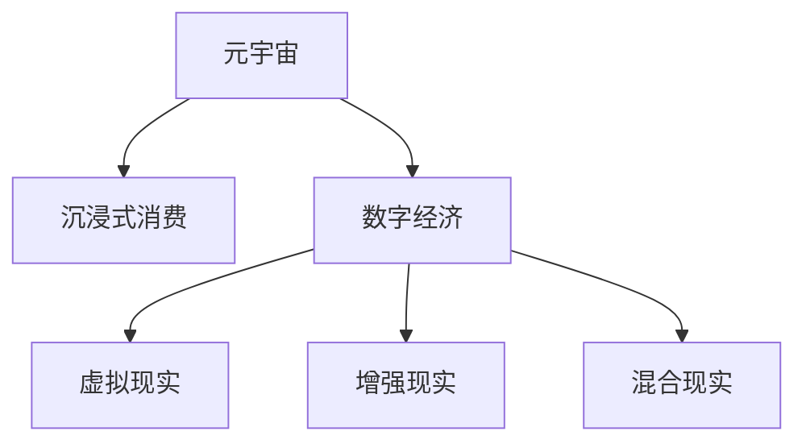

                 

# 元宇宙体验经济:沉浸式消费的新形态

> 关键词：元宇宙，沉浸式消费，数字经济，虚拟现实，虚拟资产，数字身份

## 1. 背景介绍

### 1.1 问题由来
随着技术进步和社会发展，数字经济正迅速成为全球经济增长的重要引擎。在数字化浪潮的推动下，传统消费模式正在向沉浸式、体验式、个性化方向转变。元宇宙作为当前最炙手可热的数字经济新形态，为消费模式的变革提供了全新可能。元宇宙通过构建高度逼真的虚拟空间，使消费者能够在数字世界中体验到与现实世界相媲美的沉浸式消费体验。

### 1.2 问题核心关键点
元宇宙体验经济的核心在于，通过虚拟现实(VR)、增强现实(AR)、混合现实(MR)等技术手段，构建一个高度沉浸、可交互的数字空间，消费者在其中通过虚拟身份参与各类消费活动。元宇宙经济以数字资产为支撑，以数字身份为载体，以互动体验为核心，实现了消费者与品牌、产品、服务的深度融合。

### 1.3 问题研究意义
元宇宙体验经济的研究具有重要的理论和实践意义：

1. **技术前沿探索**：推动虚拟现实、增强现实等关键技术的发展，提升用户体验。
2. **产业变革驱动**：重塑消费、营销、服务等多个领域的商业模式，带动数字经济全面升级。
3. **文化社会影响**：拓展虚拟空间与现实世界的互动，促进文化交流与碰撞，构建新型的社会生态。

## 2. 核心概念与联系

### 2.1 核心概念概述

为更好地理解元宇宙体验经济，本节将介绍几个核心概念及其之间的关系：

- **元宇宙(Metaverse)**：由多个相互连接的虚拟空间组成的数字世界，其核心特征是虚拟身份、虚拟资产、虚拟世界等。
- **沉浸式消费(Immersive Consumption)**：通过虚拟现实、增强现实等技术手段，构建高度沉浸的消费体验，提升消费者对虚拟世界的依赖度和消费频率。
- **数字经济(Digital Economy)**：以数字资产为核心，通过互联网、区块链等技术，实现经济活动的数字化和网络化。
- **虚拟现实(Virtual Reality, VR)**：通过计算机生成，模拟现实世界或幻想世界的体验，用户通过头显设备、控制器等进入虚拟空间。
- **增强现实(Augmented Reality, AR)**：在现实世界的基础上，通过计算机生成信息增强用户感知，如AR眼镜、手机App等。
- **混合现实(Mixed Reality, MR)**：结合虚拟和现实，生成虚实结合的混合体验，如MR头显、全息投影等。

这些核心概念之间的逻辑关系可以通过以下Mermaid流程图来展示：



这个流程图展示了几大核心概念及其之间的关系：

1. 元宇宙是数字经济的重要组成部分，通过虚拟现实、增强现实等技术手段，提供沉浸式消费体验。
2. 数字经济以数字资产为支撑，涵盖元宇宙、虚拟现实等多个领域。
3. 虚拟现实、增强现实、混合现实等技术，是构建元宇宙体验经济的基础。

## 3. 核心算法原理 & 具体操作步骤
### 3.1 算法原理概述

元宇宙体验经济的核心在于通过虚拟现实、增强现实等技术手段，构建高度沉浸、可交互的数字空间，使消费者在其中进行沉浸式消费。其核心算法原理包括以下几个方面：

1. **空间感知与交互**：通过传感器、摄像头等设备，捕捉用户动作和环境数据，实现用户与虚拟环境的深度交互。
2. **3D建模与渲染**：利用三维建模和实时渲染技术，生成高度逼真的虚拟场景和物品，提升用户体验。
3. **自然语言处理(NLP)**：通过语音识别、自然语言理解等技术，实现用户与虚拟环境的语言交互。
4. **人工智能(AI)**：利用机器学习、深度学习等算法，实现虚拟角色的智能行为，提升沉浸感。

### 3.2 算法步骤详解

元宇宙体验经济的构建包括以下关键步骤：

**Step 1: 数据采集与处理**
- 收集用户行为数据，如动作捕捉、位置信息等。
- 采集环境数据，如光照、声音等。
- 将数据进行预处理，如去噪、归一化等。

**Step 2: 3D建模与渲染**
- 设计虚拟空间和物品的3D模型，利用实时渲染技术，生成逼真的虚拟场景。
- 对模型进行优化，减少计算量和资源消耗。

**Step 3: 用户交互设计**
- 设计用户与虚拟环境的交互方式，如手势识别、语音命令等。
- 实现用户动作的实时反馈，提升沉浸感。

**Step 4: 自然语言处理与AI**
- 利用NLP技术，实现用户与虚拟环境的语言交互。
- 训练AI模型，使虚拟角色能够理解用户指令，执行相应操作。

**Step 5: 体验优化与迭代**
- 在实际应用中，不断收集用户反馈，优化虚拟环境设计和交互体验。
- 引入用户测试，收集用户评价和建议，进行产品迭代。

### 3.3 算法优缺点

元宇宙体验经济的构建方法具有以下优点：
1. 高度沉浸性：通过虚拟现实、增强现实等技术手段，构建高度沉浸的数字空间，提升用户体验。
2. 可交互性强：用户能够在虚拟环境中进行互动操作，增强参与感和体验深度。
3. 灵活度高：元宇宙体验经济可以根据不同应用场景，进行灵活的定制和调整。

同时，该方法也存在一定的局限性：
1. 技术复杂度高：需要整合多种技术手段，实现虚拟环境的高效渲染和实时交互。
2. 成本高：初期开发和后期维护成本较高，需要投入大量资源。
3. 用户依赖度高：用户需要适应虚拟环境的交互方式，转换思维模式，可能存在一定的使用门槛。
4. 安全性和隐私问题：虚拟环境中的数据交互，可能存在安全隐患和隐私泄露风险。

尽管存在这些局限性，但元宇宙体验经济仍是大规模数字消费体验的重要方向，具有广阔的市场前景和应用潜力。

### 3.4 算法应用领域

元宇宙体验经济已在多个领域得到应用，包括但不限于：

- **游戏娱乐**：构建虚拟游戏世界，提供高度沉浸的互动体验。
- **虚拟旅游**：虚拟旅游场景，让用户在家中即可体验全球各地的名胜古迹。
- **房地产**：虚拟房产展示，用户可自由浏览和交互，提升购房体验。
- **教育培训**：虚拟教室和实验室，提供沉浸式学习环境，提升教育效果。
- **健康医疗**：虚拟诊疗室和康复环境，提供沉浸式治疗和康复体验。
- **社交娱乐**：虚拟社交平台，提供沉浸式互动体验，满足社交需求。

## 4. 数学模型和公式 & 详细讲解  
### 4.1 数学模型构建

元宇宙体验经济涉及到虚拟空间和物品的3D建模、用户行为数据的处理、自然语言处理等多个领域。本文将以虚拟现实交互为例，介绍其数学模型和公式推导过程。

假设用户在一个虚拟空间中，通过头显设备采集其头部位置和姿态，标记为 $(x,y,z,\phi,\theta)$，其中 $(x,y,z)$ 表示位置，$(\phi,\theta)$ 表示头部朝向。假设虚拟环境中的物品位置为 $(x_0,y_0,z_0,\phi_0,\theta_0)$，物品朝向与用户头部朝向一致。

定义用户与物品的相对位置 $d$ 为：

$$
d = \sqrt{(x-x_0)^2+(y-y_0)^2+(z-z_0)^2}
$$

用户与物品之间的角度 $a$ 为：

$$
a = \arccos(\cos(\phi)\cos(\phi_0)\cos(\theta-\theta_0)+\sin(\phi)\sin(\phi_0)+\sin(\theta)\sin(\theta_0)\cos(\phi)\cos(\phi_0))
$$

用户在虚拟环境中的交互动作可以通过传感器采集并进行实时反馈。假设用户点击或触摸了虚拟物品，系统对物品进行状态更新，模型通过以下公式计算物品状态的变化：

$$
\Delta x = k \cdot a \cdot \cos(a) \cdot \cos(\phi-\phi_0)
$$

$$
\Delta y = k \cdot a \cdot \sin(a) \cdot \cos(\phi-\phi_0)
$$

$$
\Delta z = k \cdot a \cdot \sin(a) \cdot \sin(\phi-\phi_0)
$$

其中 $k$ 为反馈系数，表示用户交互动作对物品状态的影响程度。

### 4.2 公式推导过程

通过上述公式，我们实现了用户与虚拟物品的交互动作计算。具体步骤如下：

1. **计算相对位置**：根据用户和物品的坐标，计算二者之间的距离和夹角。
2. **计算交互距离**：根据夹角和反馈系数，计算用户交互动作对物品位置的影响。
3. **更新物品状态**：根据计算结果，更新虚拟物品的状态。

### 4.3 案例分析与讲解

**案例分析**：假设用户在一个虚拟商店中，通过头显设备观察一个虚拟展示柜。用户通过手势识别，点击展示柜中的某个物品，虚拟展示柜的物品位置发生变化，实现虚拟物品的交互操作。

**讲解**：
1. 通过传感器采集用户头部位置和姿态，标记为 $(x,y,z,\phi,\theta)$。
2. 虚拟展示柜的物品位置为 $(x_0,y_0,z_0,\phi_0,\theta_0)$。
3. 计算用户与物品的相对位置 $d$ 和夹角 $a$。
4. 根据用户交互动作（如手势），计算物品位置的变化 $\Delta x, \Delta y, \Delta z$。
5. 更新虚拟展示柜中物品的位置，实现用户与虚拟环境的交互。

## 5. 项目实践：代码实例和详细解释说明
### 5.1 开发环境搭建

在进行元宇宙体验经济项目开发前，我们需要准备好开发环境。以下是使用Python进行PyTorch开发的环境配置流程：

1. 安装Anaconda：从官网下载并安装Anaconda，用于创建独立的Python环境。

2. 创建并激活虚拟环境：
```bash
conda create -n pytorch-env python=3.8 
conda activate pytorch-env
```

3. 安装PyTorch：根据CUDA版本，从官网获取对应的安装命令。例如：
```bash
conda install pytorch torchvision torchaudio cudatoolkit=11.1 -c pytorch -c conda-forge
```

4. 安装PyTorch相关的工具库：
```bash
pip install torchvision opencv-python
```

完成上述步骤后，即可在`pytorch-env`环境中开始项目开发。

### 5.2 源代码详细实现

下面我们以虚拟现实游戏为例，给出使用PyTorch进行元宇宙体验经济的PyTorch代码实现。

首先，定义虚拟现实环境中的用户动作数据处理函数：

```python
import torch
import numpy as np
import pytorch3d as p3d

class VRUserActions:
    def __init__(self, user_data, feedback_coeff=1.0):
        self.user_data = user_data
        self.feedback_coeff = feedback_coeff
    
    def process_user_actions(self, user_data):
        user_data = torch.from_numpy(user_data)
        x, y, z, phi, theta = user_data[0], user_data[1], user_data[2], user_data[3], user_data[4]
        x_0, y_0, z_0, phi_0, theta_0 = virtual_item_data[0], virtual_item_data[1], virtual_item_data[2], virtual_item_data[3], virtual_item_data[4]
        d = torch.sqrt((x-x_0)**2 + (y-y_0)**2 + (z-z_0)**2)
        a = torch.acos(torch.cos(phi)*torch.cos(phi_0)*torch.cos(theta-theta_0) + torch.sin(phi)*torch.sin(phi_0) + torch.sin(theta)*torch.sin(theta_0)*torch.cos(phi)*torch.cos(phi_0))
        delta_x = self.feedback_coeff * a * torch.cos(a) * torch.cos(phi-theta_0)
        delta_y = self.feedback_coeff * a * torch.sin(a) * torch.cos(phi-theta_0)
        delta_z = self.feedback_coeff * a * torch.sin(a) * torch.sin(phi-theta_0)
        return delta_x, delta_y, delta_z
```

然后，定义虚拟环境中的物品状态更新函数：

```python
def update_item_state(virtual_item_data, delta_x, delta_y, delta_z):
    x_0, y_0, z_0, phi_0, theta_0 = virtual_item_data
    x_0 += delta_x
    y_0 += delta_y
    z_0 += delta_z
    return [x_0, y_0, z_0, phi_0, theta_0]
```

接着，定义虚拟现实环境的渲染函数：

```python
import torch3d

def render_vr_scene(virtual_scene_data, virtual_item_data):
    # 渲染虚拟场景
    # ...
    # 渲染虚拟物品
    # ...
    # 渲染虚拟用户
    # ...
```

最后，启动虚拟现实场景的运行：

```python
if __name__ == '__main__':
    user_data = np.array([user_x, user_y, user_z, user_phi, user_theta])
    virtual_item_data = np.array([item_x, item_y, item_z, item_phi, item_theta])
    user_actions = VRUserActions(user_data)
    delta_x, delta_y, delta_z = user_actions.process_user_actions(user_data)
    updated_item_data = update_item_state(virtual_item_data, delta_x, delta_y, delta_z)
    render_vr_scene(virtual_scene_data, updated_item_data)
```

以上就是使用PyTorch进行虚拟现实游戏开发的完整代码实现。可以看到，通过合理利用PyTorch的三维建模和渲染功能，我们可以轻松构建高度逼真的虚拟环境，实现用户与虚拟物品的交互操作。

### 5.3 代码解读与分析

让我们再详细解读一下关键代码的实现细节：

**VRUserActions类**：
- `__init__`方法：初始化用户数据和反馈系数。
- `process_user_actions`方法：根据用户数据和物品数据，计算用户动作对物品状态的影响。

**update_item_state函数**：
- 根据用户动作计算物品位置的变化，实现物品状态的实时更新。

**render_vr_scene函数**：
- 实现虚拟场景的渲染，包括物品和用户。
- 需要根据具体需求，使用PyTorch的三维建模和渲染工具进行实现。

**运行流程**：
- 定义用户数据和物品数据。
- 创建VRUserActions实例，计算用户动作对物品状态的影响。
- 更新物品状态，并渲染虚拟场景。

## 6. 实际应用场景
### 6.1 智能客服系统

元宇宙体验经济在智能客服系统中有着广阔的应用前景。传统的客服系统需要配备大量人力，高峰期响应速度慢，且难以实现个性化服务。而利用元宇宙技术，可以在虚拟空间中构建智能客服系统，实现24小时不间断服务，快速响应用户需求，提供个性化的虚拟客服体验。

在技术实现上，可以收集企业内部的历史客服对话记录，将其转化为虚拟客服的对话剧本，在虚拟环境中训练智能客服模型。微调后的模型能够自动理解用户意图，匹配最合适的答案模板，进行自然流畅的虚拟对话。对于用户提出的新问题，还可以实时搜索知识库，动态生成虚拟客服的回复，满足用户的多样化需求。

### 6.2 虚拟旅游

元宇宙体验经济为虚拟旅游提供了新的可能。通过构建高度逼真的虚拟旅游场景，用户可以在家中体验到与现实世界相媲美的旅游体验。

在技术实现上，可以收集全球各地的旅游数据，利用3D建模和实时渲染技术，生成逼真的虚拟旅游场景。用户可以通过虚拟导游的指引，参观虚拟博物馆、游览虚拟景点，体验虚拟风景。用户还可以在虚拟旅游环境中进行互动，如与虚拟导游对话、购买虚拟旅游纪念品等，提升用户体验。

### 6.3 房地产展示

元宇宙体验经济为房地产展示提供了新的手段。利用虚拟现实技术，用户可以在虚拟环境中浏览和交互，提升购房体验。

在技术实现上，可以收集房地产的3D模型数据，利用实时渲染技术，生成逼真的虚拟房地产展示环境。用户可以在虚拟环境中自由浏览虚拟房屋，查看虚拟房屋的内部布局和装修效果，进行虚拟参观。用户还可以与虚拟销售人员进行互动，询问问题、了解房源信息，提升购房决策的精准度。

### 6.4 未来应用展望

随着元宇宙技术的不断发展，元宇宙体验经济将具备更加广阔的应用前景，进一步推动数字经济的升级和转型。

1. **虚拟商品销售**：用户可以在虚拟环境中进行虚拟购物，体验虚拟试穿、虚拟试用等新型购物模式。
2. **虚拟教育培训**：用户可以在虚拟环境中进行虚拟课堂、虚拟实验室等，提升教育效果和学习体验。
3. **虚拟娱乐社交**：用户可以在虚拟环境中进行虚拟演唱会、虚拟体育比赛等，体验沉浸式的娱乐和社交体验。
4. **虚拟办公协作**：用户可以在虚拟环境中进行虚拟会议、虚拟协作等，提升办公效率和协作体验。
5. **虚拟旅游开发**：开发虚拟旅游平台，用户可以在虚拟环境中自由游览，提升旅游体验。

## 7. 工具和资源推荐
### 7.1 学习资源推荐

为了帮助开发者系统掌握元宇宙体验经济的技术基础和实践技巧，这里推荐一些优质的学习资源：

1. **《元宇宙：数字经济的新未来》**：全面介绍元宇宙的原理、技术实现和应用场景。
2. **《虚拟现实技术及应用》**：系统讲解虚拟现实技术的原理和应用，适合深入学习。
3. **《增强现实技术及应用》**：介绍增强现实技术的原理和应用，适合学习和实践。
4. **《混合现实技术及应用》**：讲解混合现实技术的原理和应用，适合学习和实践。
5. **《元宇宙体验经济》**：介绍元宇宙体验经济的发展现状和未来趋势。

通过对这些资源的学习实践，相信你一定能够快速掌握元宇宙体验经济的技术精髓，并用于解决实际的数字消费问题。

### 7.2 开发工具推荐

高效的开发离不开优秀的工具支持。以下是几款用于元宇宙体验经济开发的常用工具：

1. **Unity**：一款跨平台的3D游戏引擎，支持虚拟现实、增强现实等技术，广泛用于游戏开发和虚拟环境构建。
2. **Unreal Engine**：另一款跨平台的3D游戏引擎，具有强大的渲染和交互能力，适合构建高度逼真的虚拟环境。
3. **OpenXR**：开放虚拟现实标准，支持跨平台、跨设备的虚拟现实应用开发。
4. **ARKit**：苹果提供的增强现实开发框架，支持iOS和macOS平台。
5. **ARCore**：谷歌提供的增强现实开发框架，支持Android和iOS平台。
6. **WebXR**：WebXR标准，支持在Web平台上开发虚拟现实和增强现实应用。

合理利用这些工具，可以显著提升元宇宙体验经济开发的效率和质量，推动数字消费模式的全面变革。

### 7.3 相关论文推荐

元宇宙体验经济的研究源于学界的持续探索。以下是几篇奠基性的相关论文，推荐阅读：

1. **《虚拟现实：历史、现状及发展趋势》**：介绍虚拟现实技术的发展历程和应用现状。
2. **《增强现实技术综述》**：系统讲解增强现实技术的原理和应用，适合学习和实践。
3. **《混合现实技术综述》**：讲解混合现实技术的原理和应用，适合学习和实践。
4. **《元宇宙：数字经济的新未来》**：介绍元宇宙的原理、技术实现和应用场景。
5. **《虚拟商品销售与数字经济》**：分析虚拟商品销售对数字经济的影响和前景。

这些论文代表了大规模数字消费体验的研究进展，通过学习这些前沿成果，可以帮助研究者把握学科前进方向，激发更多的创新灵感。

## 8. 总结：未来发展趋势与挑战
### 8.1 总结

本文对元宇宙体验经济进行了全面系统的介绍。首先阐述了元宇宙的原理和应用场景，明确了元宇宙体验经济在数字消费模式变革中的重要地位。其次，从原理到实践，详细讲解了元宇宙体验经济的数学模型和关键算法，给出了具体的代码实现和应用实例。同时，本文还广泛探讨了元宇宙体验经济在智能客服、虚拟旅游、房地产展示等多个领域的应用前景，展示了元宇宙体验经济的广阔前景。最后，本文精选了元宇宙体验经济的学习资源、开发工具和相关论文，力求为读者提供全方位的技术指引。

通过本文的系统梳理，可以看到，元宇宙体验经济正在成为数字消费模式的重要方向，极大地拓展了数字消费体验的边界，为数字经济带来了新的增长点。未来，伴随元宇宙技术的不断进步，元宇宙体验经济必将在更多领域得到应用，推动数字消费模式向更加沉浸、个性、智能的方向发展。

### 8.2 未来发展趋势

展望未来，元宇宙体验经济将呈现以下几个发展趋势：

1. **技术融合加速**：元宇宙体验经济将与其他前沿技术，如区块链、人工智能、物联网等，进行深度融合，拓展应用场景。
2. **多模态交互增强**：元宇宙体验经济将融合视觉、听觉、触觉等多种模态的交互方式，提升用户体验。
3. **内容生态丰富**：元宇宙体验经济将产生大量的高质量内容，形成丰富的虚拟商品、服务和体验。
4. **应用场景扩展**：元宇宙体验经济将在更多领域得到应用，如教育、医疗、旅游等。
5. **商业模式创新**：元宇宙体验经济将推动传统商业模式向虚拟化和数字化方向转型。
6. **用户群体扩大**：元宇宙体验经济将吸引更多的用户群体，成为数字消费的新主流。

以上趋势凸显了元宇宙体验经济的广阔前景。这些方向的探索发展，必将进一步推动数字消费模式的变革，为数字经济带来新的增长点和创新动力。

### 8.3 面临的挑战

尽管元宇宙体验经济前景广阔，但在迈向成熟的过程中，仍面临诸多挑战：

1. **技术门槛高**：元宇宙体验经济需要整合多种前沿技术，对开发者的技术水平要求较高。
2. **成本高**：初期开发和后期维护成本较高，需要大量资金投入。
3. **用户体验差异**：不同用户对虚拟环境的需求和体验差异较大，需要差异化设计和个性化服务。
4. **安全性和隐私问题**：虚拟环境中的数据交互，可能存在安全隐患和隐私泄露风险。
5. **内容审核难度大**：虚拟内容的多样性和复杂性，增加了内容审核的难度和成本。

尽管存在这些挑战，但元宇宙体验经济的发展前景仍然乐观，相信通过持续的技术创新和应用探索，这些挑战终将逐步被克服，元宇宙体验经济必将在数字消费模式中扮演越来越重要的角色。

### 8.4 研究展望

面对元宇宙体验经济所面临的挑战，未来的研究需要在以下几个方面寻求新的突破：

1. **技术优化**：开发更加高效、稳定的虚拟现实、增强现实等技术，提升用户体验。
2. **成本控制**：通过技术创新和标准化，降低开发和维护成本，推动元宇宙体验经济的普及。
3. **用户体验提升**：设计更加个性化、互动性强的虚拟环境，提升用户粘性和满意度。
4. **内容丰富度提升**：开发高质量、多样化的虚拟内容，丰富元宇宙体验经济的应用场景。
5. **安全性和隐私保护**：建立健全的数据保护和隐私保护机制，确保用户安全。

这些研究方向的探索，必将引领元宇宙体验经济技术的发展，推动数字消费模式的全面变革。面向未来，元宇宙体验经济需要与其他前沿技术进行更深入的融合，共同推动数字消费模式的进步，为数字经济带来新的增长点。

## 9. 附录：常见问题与解答

**Q1：元宇宙体验经济是否适用于所有消费场景？**

A: 元宇宙体验经济适用于多种消费场景，特别是对沉浸式体验有较高要求的场景，如游戏娱乐、虚拟旅游、虚拟购物等。但对于一些对现实世界互动有较高要求的场景，如餐饮、零售等，元宇宙体验经济可能存在一定的局限性。

**Q2：元宇宙体验经济的技术难点有哪些？**

A: 元宇宙体验经济的技术难点主要包括以下几点：
1. 实时渲染和交互：需要高效的3D渲染和交互技术，确保用户体验。
2. 高质量内容制作：需要大量的高质量内容制作，形成丰富的虚拟商品、服务和体验。
3. 用户隐私保护：需要在数据交互和隐私保护之间找到平衡，确保用户数据安全。
4. 多模态交互设计：需要设计更加个性化、互动性强的虚拟环境，提升用户粘性和满意度。
5. 标准化和规范化：需要制定行业标准和规范，推动元宇宙体验经济的普及和发展。

**Q3：元宇宙体验经济有哪些应用前景？**

A: 元宇宙体验经济的应用前景非常广阔，主要包括以下几个方面：
1. 游戏娱乐：提供沉浸式的游戏体验，提升用户粘性和满意度。
2. 虚拟旅游：提供沉浸式的旅游体验，提升用户旅游体验。
3. 虚拟购物：提供沉浸式的购物体验，提升用户购物体验。
4. 虚拟教育培训：提供沉浸式的教育培训体验，提升教育效果和学习体验。
5. 虚拟办公协作：提供沉浸式的办公协作体验，提升办公效率和协作体验。
6. 虚拟娱乐社交：提供沉浸式的娱乐和社交体验，满足用户的多样化需求。

这些应用前景展示了元宇宙体验经济在数字消费模式中的重要地位，为数字经济带来了新的增长点。

**Q4：如何评估元宇宙体验经济的商业价值？**

A: 评估元宇宙体验经济的商业价值需要综合考虑以下几个方面：
1. 用户规模和粘性：评估用户规模和用户粘性，了解用户的实际需求和使用情况。
2. 收入模式和盈利能力：评估元宇宙体验经济的收入模式和盈利能力，了解其商业潜力和盈利前景。
3. 成本控制和效益分析：评估元宇宙体验经济的成本控制和效益分析，了解其经济效益和社会效益。
4. 用户体验和满意度：评估用户对元宇宙体验经济的满意度，了解其用户体验和市场反馈。
5. 技术进步和创新能力：评估元宇宙体验技术的发展进步和创新能力，了解其技术优势和发展前景。

通过综合考虑这些因素，可以全面评估元宇宙体验经济的商业价值，指导其发展方向和策略。

**Q5：如何保障元宇宙体验经济的安全性和隐私保护？**

A: 保障元宇宙体验经济的安全性和隐私保护需要从以下几个方面入手：
1. 数据加密和传输安全：采用加密技术和安全协议，确保数据传输的安全性和隐私保护。
2. 用户身份验证：采用多种身份验证手段，确保用户身份的真实性和合法性。
3. 内容审核机制：建立健全的内容审核机制，防止有害内容传播。
4. 隐私保护政策：制定隐私保护政策，确保用户数据的隐私保护和数据安全。
5. 法律合规和监管：遵守相关法律法规，确保元宇宙体验经济的合规性和合法性。

通过以上措施，可以有效保障元宇宙体验经济的安全性和隐私保护，提升用户信任和满意度。

---

作者：禅与计算机程序设计艺术 / Zen and the Art of Computer Programming

