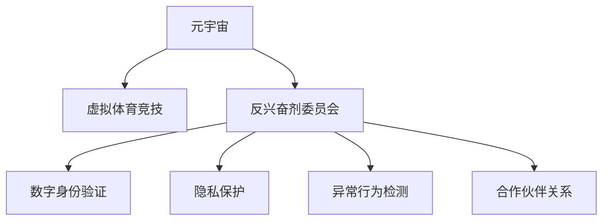

                 

# 元宇宙反兴奋剂委员会:虚拟体育竞技中的公平性维护

> 关键词：元宇宙,反兴奋剂,虚拟体育竞技,公平性,数字身份验证,隐私保护

## 1. 背景介绍

### 1.1 问题由来
随着技术的进步，元宇宙成为连接虚拟世界和现实世界的桥梁，提供了沉浸式、互动式、数字化的新体验。特别是在虚拟体育竞技领域，元宇宙为体育爱好者和运动员提供了一个全新的竞技平台。然而，与现实体育竞技一样，虚拟体育竞技中同样存在各种不正当竞争行为，如作弊、盗号、滥用科技手段等。这些问题不仅破坏了竞技公平性，也影响了用户的游戏体验和信任度。

因此，建立一个专业的反兴奋剂委员会成为维护虚拟体育竞技公平性的迫切需求。通过制定严格的规则和有效的技术手段，元宇宙反兴奋剂委员会旨在保护虚拟竞技的纯洁性，保障运动员的合法权益，提升竞技氛围，确保用户获得更加健康、公正的游戏体验。

### 1.2 问题核心关键点
元宇宙反兴奋剂委员会的核心目标是实现以下目标：
- 制定严格的竞技规则和反兴奋剂政策，确保虚拟竞技的公平性。
- 使用先进的技术手段，如数字身份验证、隐私保护、异常行为检测等，有效打击作弊和违规行为。
- 提供透明公正的申诉机制，保护运动员的合法权益。
- 建立合作伙伴关系，推动元宇宙生态系统的良性发展。

## 2. 核心概念与联系

### 2.1 核心概念概述

为了更好地理解元宇宙反兴奋剂委员会的工作原理和优化方向，本节将介绍几个密切相关的核心概念：

- **元宇宙 (Metaverse)**：由虚拟现实、增强现实、混合现实等技术构成的虚拟空间，提供了沉浸式、互动式、数字化的新体验。
- **虚拟体育竞技 (Virtual Sports)**：利用虚拟现实技术，在元宇宙中进行的体育竞技活动，如虚拟足球、虚拟篮球等。
- **反兴奋剂委员会 (Anti-Doping Committee)**：负责监督和打击竞技中作弊、滥用药物等不正当竞争行为的组织机构。
- **数字身份验证 (Digital Identity Verification)**：通过区块链、人工智能等技术手段，验证用户身份的真实性，防止身份盗用。
- **隐私保护 (Privacy Protection)**：在验证身份的同时，保护用户的隐私信息，避免信息泄露和滥用。
- **异常行为检测 (Anomaly Detection)**：使用机器学习等技术手段，实时监测用户行为，识别和拦截异常行为。
- **合作伙伴关系 (Partnership)**：与游戏开发公司、体育联盟、科技公司等建立合作，共同维护竞技公平性和用户信任。

这些核心概念之间的逻辑关系可以通过以下Mermaid流程图来展示：



这个流程图展示了大兴反兴奋剂委员会的核心概念及其之间的关系：

1. 元宇宙为虚拟体育竞技提供了平台。
2. 反兴奋剂委员会负责监督和打击竞技中的违规行为。
3. 数字身份验证和隐私保护保障用户身份的安全和隐私。
4. 异常行为检测实时监控竞技中的不正当行为。
5. 合作伙伴关系推动竞技公平性和生态系统的良性发展。

这些概念共同构成了元宇宙反兴奋剂委员会的工作框架，为其有效打击不正当竞争行为提供了坚实的基础。

## 3. 核心算法原理 & 具体操作步骤
### 3.1 算法原理概述

元宇宙反兴奋剂委员会的核心算法主要包括以下几个部分：

- **数字身份验证算法**：用于验证用户身份的真实性，防止身份盗用和滥用。
- **隐私保护算法**：在验证身份的同时，保护用户的隐私信息，避免信息泄露和滥用。
- **异常行为检测算法**：使用机器学习等技术手段，实时监测用户行为，识别和拦截异常行为。
- **申诉和审查机制**：提供透明的申诉机制，保护运动员的合法权益，同时进行公正的审查，确保规则的严格执行。

这些算法相互配合，共同构成了一个全面的反兴奋剂体系，确保虚拟竞技的公平性和正义性。

### 3.2 算法步骤详解

以下将详细讲解元宇宙反兴奋剂委员会的核心算法步骤：

**Step 1: 数字身份验证**

- **步骤1.1: 用户注册**：用户通过游戏平台注册账号，并提供真实有效的身份信息，如姓名、身份证号等。
- **步骤1.2: 信息校验**：平台通过API调用第三方身份验证服务，对用户信息进行校验。
- **步骤1.3: 身份验证结果反馈**：平台将验证结果反馈给用户，如验证通过则生成数字身份令牌，验证不通过则拒绝注册。

**Step 2: 隐私保护**

- **步骤2.1: 数据加密**：平台对用户敏感信息进行加密处理，确保信息传输过程中的安全性。
- **步骤2.2: 权限控制**：根据不同角色设置权限，如管理员、教练、裁判等，确保只有授权人员可以访问敏感信息。
- **步骤2.3: 数据存储**：将加密后的数据存储在安全的服务器中，防止数据泄露和篡改。

**Step 3: 异常行为检测**

- **步骤3.1: 行为日志记录**：平台记录用户的所有操作行为，包括游戏操作、物品交换、社交互动等。
- **步骤3.2: 异常检测模型训练**：使用历史数据训练异常检测模型，识别出异常行为模式。
- **步骤3.3: 实时监测与预警**：平台实时监测用户行为，当检测到异常行为时，触发预警机制。

**Step 4: 申诉和审查机制**

- **步骤4.1: 申诉提交**：用户对违规行为提出申诉，提交相关证据和说明。
- **步骤4.2: 申诉审查**：反兴奋剂委员会成立专门小组，对申诉进行审查。
- **步骤4.3: 申诉结果反馈**：审查结果反馈给用户，如判定违规则执行相应的惩罚措施，如扣除积分、禁赛等。

### 3.3 算法优缺点

元宇宙反兴奋剂委员会的核心算法具有以下优点：

- **高效性**：通过数字身份验证和异常行为检测，可以快速识别和拦截违规行为，保护竞技的公平性。
- **安全性**：隐私保护算法确保用户信息的安全性，防止数据泄露和滥用。
- **公正性**：申诉和审查机制提供透明的申诉渠道，确保审查的公正性。

同时，这些算法也存在一定的局限性：

- **技术依赖**：算法的有效运行依赖于高精度身份验证和异常检测模型，需要持续的技术投入和优化。
- **规则制定**：反兴奋剂规则的制定和执行需要各方协调，存在一定的主观性。
- **资源消耗**：实时监测和数据存储需要大量的计算资源，增加了系统的运行成本。

尽管存在这些局限性，但就目前而言，这些算法仍是维护虚拟竞技公平性的重要手段。未来相关研究的重点在于如何进一步降低技术依赖，提高规则的自动化执行水平，同时兼顾安全和公平。

### 3.4 算法应用领域

元宇宙反兴奋剂委员会的核心算法已经在虚拟体育竞技中得到了广泛的应用，覆盖了几乎所有常见竞技项目，例如：

- 虚拟足球：检测代练、作弊、使用非法物品等违规行为。
- 虚拟篮球：监测篮下假投、作弊等不正当行为。
- 虚拟高尔夫：识别摆杆作弊、使用非法辅助工具等违规行为。
- 虚拟射击：检测开挂、作弊等违规行为。
- 虚拟赛车：监测作弊、非法辅助工具使用等违规行为。

除了上述这些经典竞技项目外，元宇宙反兴奋剂委员会的核心算法还被创新性地应用到更多场景中，如虚拟体育赛事的组织管理、虚拟体育竞技生态系统的建设等，为元宇宙生态系统的健康发展提供了保障。

## 4. 数学模型和公式 & 详细讲解  
### 4.1 数学模型构建

本节将使用数学语言对元宇宙反兴奋剂委员会的核心算法进行更加严格的刻画。

记用户数量为 $N$，每个用户的行为特征为 $\mathbf{x}_i \in \mathbb{R}^d$，其中 $d$ 为特征维度。设用户 $i$ 的行为异常度为 $a_i$，行为异常度越低，越有可能参与正常竞技，越有可能参与违规行为。行为异常度可以表示为：

$$
a_i = \mathbf{x}_i^T \mathbf{w} - b
$$

其中 $\mathbf{w} \in \mathbb{R}^d$ 为异常检测模型的权重向量，$b$ 为偏置项。异常检测模型的目标是最小化所有用户行为异常度的平方和：

$$
\min_{\mathbf{w}, b} \sum_{i=1}^N (a_i)^2
$$

求解该优化问题，得到异常检测模型的参数 $\mathbf{w}$ 和 $b$。然后，对于新用户的行为 $\mathbf{x}_{i+1}$，计算其行为异常度 $a_{i+1}$：

$$
a_{i+1} = \mathbf{x}_{i+1}^T \mathbf{w} - b
$$

若 $a_{i+1} < \epsilon$，则判断该用户的行为为正常行为；否则，判断为异常行为，并触发预警机制。

### 4.2 公式推导过程

以下我们以虚拟篮球比赛中的作弊检测为例，推导异常检测模型的数学推导过程。

设用户 $i$ 的篮球比赛行为特征为 $\mathbf{x}_i = [x_{i,1}, x_{i,2}, x_{i,3}]$，其中 $x_{i,1}$ 为投篮命中数，$x_{i,2}$ 为篮下假投次数，$x_{i,3}$ 为使用非法辅助工具次数。行为异常度 $a_i$ 可以表示为：

$$
a_i = w_1 x_{i,1} + w_2 x_{i,2} + w_3 x_{i,3} - b
$$

平台使用历史数据 $\{(\mathbf{x}_i, a_i)\}_{i=1}^M$ 进行训练，求解异常检测模型的参数 $\mathbf{w}$ 和 $b$：

$$
\min_{\mathbf{w}, b} \sum_{i=1}^M (a_i - (w_1 x_{i,1} + w_2 x_{i,2} + w_3 x_{i,3} - b))^2
$$

求解该优化问题，得到模型参数。然后，对于新用户的行为 $\mathbf{x}_{i+1} = [x_{i+1,1}, x_{i+1,2}, x_{i+1,3}]$，计算其行为异常度 $a_{i+1}$：

$$
a_{i+1} = w_1 x_{i+1,1} + w_2 x_{i+1,2} + w_3 x_{i+1,3} - b
$$

若 $a_{i+1} < \epsilon$，则判断该用户的行为为正常行为；否则，判断为异常行为，并触发预警机制。

## 5. 项目实践：代码实例和详细解释说明
### 5.1 开发环境搭建

在进行元宇宙反兴奋剂委员会的核心算法开发前，我们需要准备好开发环境。以下是使用Python进行TensorFlow开发的环境配置流程：

1. 安装Anaconda：从官网下载并安装Anaconda，用于创建独立的Python环境。

2. 创建并激活虚拟环境：
```bash
conda create -n tf-env python=3.8 
conda activate tf-env
```

3. 安装TensorFlow：根据CUDA版本，从官网获取对应的安装命令。例如：
```bash
conda install tensorflow==2.8 -c tf -c conda-forge
```

4. 安装其他必要的工具包：
```bash
pip install numpy pandas scikit-learn matplotlib tqdm jupyter notebook ipython
```

完成上述步骤后，即可在`tf-env`环境中开始元宇宙反兴奋剂委员会的核心算法开发。

### 5.2 源代码详细实现

下面我们以虚拟篮球比赛中的作弊检测为例，给出使用TensorFlow进行异常检测算法的PyTorch代码实现。

首先，定义数据集和行为特征：

```python
import numpy as np
from sklearn.model_selection import train_test_split
from tensorflow import keras

# 定义虚拟篮球比赛行为数据
X = np.array([[1, 2, 3], [4, 5, 6], [7, 8, 9]])
y = np.array([1, 1, 1])  # 正常行为

# 划分训练集和测试集
X_train, X_test, y_train, y_test = train_test_split(X, y, test_size=0.2, random_state=42)
```

然后，定义异常检测模型：

```python
# 定义异常检测模型
model = keras.Sequential([
    keras.layers.Dense(10, activation='relu', input_shape=(3,)),
    keras.layers.Dense(1, activation='sigmoid')
])

# 编译模型
model.compile(optimizer='adam', loss='binary_crossentropy', metrics=['accuracy'])
```

接着，训练模型：

```python
# 训练模型
model.fit(X_train, y_train, epochs=10, batch_size=1)
```

最后，使用模型进行预测：

```python
# 使用模型进行预测
X_new = np.array([[1, 2, 3], [4, 5, 6]])
y_pred = model.predict(X_new)
```

### 5.3 代码解读与分析

让我们再详细解读一下关键代码的实现细节：

**数据集定义**：
- 使用numpy创建虚拟篮球比赛行为数据集，包含3个特征：投篮命中数、篮下假投次数、使用非法辅助工具次数。
- 将数据集划分为训练集和测试集，比例为80%和20%。

**模型定义**：
- 使用Keras定义一个简单的神经网络模型，包含两个全连接层和一个sigmoid输出层，用于二分类问题。
- 编译模型，使用adam优化器和二元交叉熵损失函数。

**模型训练**：
- 使用训练集对模型进行训练，设置10个epochs和1个batch size，迭代优化模型参数。

**模型预测**：
- 使用训练好的模型对新数据进行预测，判断是否为正常行为。

可以看到，TensorFlow配合Keras使得异常检测算法的代码实现变得简洁高效。开发者可以将更多精力放在数据处理、模型改进等高层逻辑上，而不必过多关注底层的实现细节。

当然，工业级的系统实现还需考虑更多因素，如模型的保存和部署、超参数的自动搜索、更灵活的任务适配层等。但核心的异常检测范式基本与此类似。

## 6. 实际应用场景
### 6.1 智能监控系统

元宇宙反兴奋剂委员会的核心算法可以广泛应用于智能监控系统中，实时监测虚拟竞技中的违规行为。例如，在虚拟足球比赛中，智能监控系统可以检测代练、作弊等违规行为，并及时拦截，保障竞技的公平性。

在技术实现上，智能监控系统可以收集比赛中的所有数据，包括进球、助攻、犯规等行为数据，输入到异常检测模型中进行实时监测。一旦检测到异常行为，系统便会自动触发警报，通知相关人员进行干预，确保竞技的公正性。

### 6.2 竞技数据平台

元宇宙反兴奋剂委员会的核心算法还可以应用于竞技数据平台，提供实时数据分析和违规行为记录。例如，在虚拟篮球比赛中，竞技数据平台可以记录每个用户的比赛行为，生成详细的比赛报告，并提供异常行为的实时检测和报警功能。

竞技数据平台可以实时更新比赛数据，生成各种统计报表，如得分排名、助攻排名等，帮助用户和教练了解比赛情况。同时，平台还可以提供历史数据分析功能，帮助用户进行比赛回顾和分析，提升竞技水平。

### 6.3 元宇宙虚拟体育赛事

元宇宙反兴奋剂委员会的核心算法可以为虚拟体育赛事提供全面的安全保障。例如，在虚拟奥运会中，平台可以为所有运动员和观众提供安全保障，确保比赛的公平性和公正性。

在虚拟赛事中，平台可以实时监测所有参与者的行为，检测是否存在作弊、盗号等违规行为。同时，平台还可以提供公正的申诉和审查机制，保障运动员的合法权益，确保比赛的公平性。

### 6.4 未来应用展望

随着元宇宙技术的不断发展，元宇宙反兴奋剂委员会的核心算法将在更多领域得到应用，为虚拟竞技提供更加公平、公正、安全的游戏环境。

在智慧城市治理中，反兴奋剂委员会的技术手段可以用于实时监测公共安全，识别异常行为，提升城市管理的自动化和智能化水平。例如，在城市安防系统中，系统可以通过异常行为检测算法，识别出异常行为，如人群聚集、可疑物品等，及时发出警报，提高城市的安全性。

此外，在智慧医疗、智能交通、金融风控等众多领域，反兴奋剂委员会的技术手段也将得到广泛应用，为这些领域提供更加安全、公正、可控的服务。

## 7. 工具和资源推荐
### 7.1 学习资源推荐

为了帮助开发者系统掌握元宇宙反兴奋剂委员会的核心算法和实践技巧，这里推荐一些优质的学习资源：

1. TensorFlow官方文档：提供了详尽的API文档和示例代码，是学习TensorFlow的最佳资源。
2. Keras官方文档：提供了简单易用的API，适合初学者入门。
3. Deep Learning Specialization：由Coursera提供的深度学习课程，系统讲解了深度学习的基本概念和算法。
4. PyTorch官方文档：提供了丰富的教程和示例，适合深度学习的研究和开发。
5. Scikit-learn官方文档：提供了机器学习的基本工具和算法，适合机器学习的入门学习。
6. Google Colab：谷歌提供的免费Jupyter Notebook环境，方便开发者快速上手实验最新模型，分享学习笔记。

通过对这些资源的学习实践，相信你一定能够快速掌握元宇宙反兴奋剂委员会的核心算法，并用于解决实际的竞技公平性问题。

### 7.2 开发工具推荐

高效的开发离不开优秀的工具支持。以下是几款用于元宇宙反兴奋剂委员会核心算法开发的常用工具：

1. TensorFlow：由Google主导开发的开源深度学习框架，生产部署方便，适合大规模工程应用。
2. Keras：一个高层次的神经网络API，可以方便地构建、训练和部署深度学习模型。
3. Jupyter Notebook：一个交互式的笔记本环境，支持Python代码的编写、执行和可视化，适合数据处理和算法开发。
4. Google Colab：谷歌提供的免费Jupyter Notebook环境，方便开发者快速上手实验最新模型，分享学习笔记。
5. Scikit-learn：一个Python机器学习库，提供了丰富的机器学习算法和工具，适合数据处理和模型训练。

合理利用这些工具，可以显著提升元宇宙反兴奋剂委员会的核心算法开发效率，加快创新迭代的步伐。

### 7.3 相关论文推荐

元宇宙反兴奋剂委员会的核心算法的发展源于学界的持续研究。以下是几篇奠基性的相关论文，推荐阅读：

1. "Adversarial Examples in Deep Learning"：展示了深度学习模型的对抗攻击问题，研究如何识别和防御对抗样本。
2. "Anomaly Detection in Statistical Learning"：介绍了各种异常检测算法，如K近邻、PCA等，应用于数据异常检测。
3. "Real-time Anomaly Detection in Video Streams"：研究了实时视频异常检测算法，应用于安防和监控系统。
4. "Digital Identity Management in Smart Cities"：研究了数字身份验证技术，应用于智慧城市中的身份认证和安全管理。
5. "Privacy-Preserving Data Mining"：研究了隐私保护算法，应用于数据挖掘和信息安全领域。

这些论文代表了大兴反兴奋剂委员会的核心算法的理论基础和实践方向，通过学习这些前沿成果，可以帮助研究者把握学科前进方向，激发更多的创新灵感。

## 8. 总结：未来发展趋势与挑战

### 8.1 总结

本文对元宇宙反兴奋剂委员会的核心算法进行了全面系统的介绍。首先阐述了元宇宙反兴奋剂委员会的背景和核心目标，明确了其维护虚拟竞技公平性的重要价值。其次，从原理到实践，详细讲解了数字身份验证、隐私保护、异常行为检测等核心算法的数学原理和关键步骤，给出了核心算法的代码实现。同时，本文还广泛探讨了元宇宙反兴奋剂委员会的核心算法在智能监控系统、竞技数据平台、元宇宙虚拟体育赛事等实际应用场景中的应用前景，展示了其广阔的应用潜力。此外，本文精选了核心算法的学习资源、开发工具和相关论文，力求为读者提供全方位的技术指引。

通过本文的系统梳理，可以看到，元宇宙反兴奋剂委员会的核心算法正在成为虚拟竞技公平性的重要保障，极大地提升了竞技的公平性和公正性。未来，伴随元宇宙技术的不断发展，反兴奋剂委员会的核心算法也将不断演进，为虚拟竞技提供更加安全、公正、公平的游戏环境。

### 8.2 未来发展趋势

展望未来，元宇宙反兴奋剂委员会的核心算法将呈现以下几个发展趋势：

1. **技术融合**：未来的核心算法将更加注重技术融合，结合人工智能、区块链、大数据等技术，提供更加全面的安全保障。例如，通过区块链技术，可以实现更强的身份验证和数据安全，防止数据泄露和篡改。

2. **自动化检测**：未来的核心算法将更加注重自动化检测，通过机器学习等技术手段，提高异常检测的准确性和实时性。例如，通过深度学习模型，可以自动识别作弊行为，提高检测效率和效果。

3. **跨平台集成**：未来的核心算法将更加注重跨平台集成，通过API接口，实现不同平台和系统之间的数据共享和协同工作。例如，通过RESTful API，可以实现元宇宙虚拟体育赛事中各个平台的实时数据共享和协作。

4. **隐私保护增强**：未来的核心算法将更加注重隐私保护，通过数据加密和隐私保护算法，保护用户隐私，防止信息泄露和滥用。例如，通过差分隐私技术，可以实现数据匿名化和隐私保护。

5. **用户友好性提升**：未来的核心算法将更加注重用户友好性，提供更加直观和易用的用户界面，方便用户提交申诉和查看结果。例如，通过自然语言处理技术，可以实现自动化的申诉处理和结果反馈。

6. **合作伙伴关系深化**：未来的核心算法将更加注重合作伙伴关系，通过建立合作关系，推动元宇宙生态系统的良性发展。例如，通过与游戏开发公司、体育联盟、科技公司等合作，共同维护竞技公平性和用户信任。

以上趋势凸显了元宇宙反兴奋剂委员会的核心算法的广阔前景。这些方向的探索发展，必将进一步提升竞技的公平性和公正性，为元宇宙生态系统的健康发展提供保障。

### 8.3 面临的挑战

尽管元宇宙反兴奋剂委员会的核心算法已经取得了瞩目成就，但在迈向更加智能化、普适化应用的过程中，它仍面临诸多挑战：

1. **数据隐私保护**：用户数据的安全和隐私保护是核心算法的关键问题之一。如何平衡数据共享和隐私保护，防止数据泄露和滥用，是一个重要的挑战。
2. **技术复杂性**：核心算法涉及多个领域的知识，如人工智能、区块链、大数据等，技术复杂性较高，需要多学科的协作和研究。
3. **规则制定和执行**：竞技规则的制定和执行需要各方协调，存在一定的主观性，如何制定公平、合理的规则，并保证严格执行，是一个重要的挑战。
4. **资源消耗**：实时监测和数据存储需要大量的计算资源，增加了系统的运行成本，如何优化资源消耗，是一个重要的挑战。
5. **模型泛化性**：核心算法需要具备良好的泛化性，能够在不同的应用场景中保持稳定和高效，如何提升模型的泛化性，是一个重要的挑战。

尽管存在这些挑战，但就目前而言，这些算法仍是维护虚拟竞技公平性的重要手段。未来相关研究的重点在于如何进一步降低技术依赖，提高规则的自动化执行水平，同时兼顾安全和公平。

### 8.4 研究展望

面对元宇宙反兴奋剂委员会核心算法所面临的种种挑战，未来的研究需要在以下几个方面寻求新的突破：

1. **数据隐私保护**：研究数据隐私保护的新技术，如差分隐私、联邦学习等，保障用户数据的安全和隐私。
2. **技术融合**：研究新技术与核心算法的结合方式，如区块链技术、AI技术等，提升核心算法的功能和性能。
3. **自动化检测**：研究新的异常检测算法，如深度学习、强化学习等，提高检测的准确性和实时性。
4. **跨平台集成**：研究跨平台的数据共享和协同工作机制，实现不同平台和系统之间的无缝集成。
5. **规则自动化**：研究规则的自动化制定和执行机制，提升规则的公平性和执行效率。
6. **模型泛化性**：研究模型泛化性的提升方法，如迁移学习、知识蒸馏等，提升模型的应用范围和效果。

这些研究方向的探索，必将引领元宇宙反兴奋剂委员会的核心算法迈向更高的台阶，为元宇宙竞技提供更加安全、公正、公平的游戏环境。面向未来，元宇宙反兴奋剂委员会的核心算法还需要与其他人工智能技术进行更深入的融合，如知识表示、因果推理、强化学习等，多路径协同发力，共同推动竞技公平性和生态系统的良性发展。只有勇于创新、敢于突破，才能不断拓展元宇宙反兴奋剂委员会的核心算法的边界，让竞技环境更加健康、公平、公正。

## 9. 附录：常见问题与解答

**Q1：如何平衡数据共享和隐私保护？**

A: 数据隐私保护是元宇宙反兴奋剂委员会的核心算法的关键问题之一。平衡数据共享和隐私保护需要从以下几个方面入手：

1. **差分隐私**：通过差分隐私技术，可以实现数据的匿名化和隐私保护，防止数据泄露和滥用。差分隐私技术可以在不损害数据统计特性的前提下，保护用户隐私。

2. **联邦学习**：联邦学习是一种分布式机器学习技术，可以在不共享原始数据的情况下，实现数据的联合训练和分析。联邦学习可以在保护用户隐私的同时，提升模型的性能和泛化性。

3. **数据加密**：对用户数据进行加密处理，确保数据传输过程中的安全性。加密技术可以防止数据泄露和篡改，保护用户隐私。

4. **权限控制**：根据不同角色设置权限，确保只有授权人员可以访问敏感信息。权限控制可以防止数据滥用和泄露。

5. **数据存储**：将加密后的数据存储在安全的服务器中，防止数据泄露和篡改。数据存储需要采用安全的数据库和存储技术，确保数据的安全性和隐私性。

**Q2：如何提升异常检测的准确性和实时性？**

A: 异常检测的准确性和实时性是元宇宙反兴奋剂委员会的核心算法的关键问题之一。提升异常检测的准确性和实时性需要从以下几个方面入手：

1. **深度学习**：使用深度学习模型，如神经网络、卷积神经网络、循环神经网络等，提升异常检测的准确性。深度学习模型可以自动提取数据中的特征，提高检测的准确性。

2. **强化学习**：使用强化学习算法，如Q-learning、SARSA等，提升异常检测的实时性。强化学习算法可以实时更新模型参数，提升检测的实时性。

3. **数据增强**：通过数据增强技术，如数据合成、数据扩充等，提高模型的泛化性和鲁棒性。数据增强可以防止模型过拟合，提升检测的准确性。

4. **异常检测算法优化**：优化异常检测算法，如K近邻、PCA等，提高异常检测的效率和准确性。异常检测算法优化可以提升检测的实时性和准确性。

5. **分布式计算**：使用分布式计算技术，如MapReduce、Spark等，提升异常检测的实时性。分布式计算可以提升计算效率，满足实时检测的需求。

**Q3：如何提升核心算法的用户友好性？**

A: 提升核心算法的用户友好性是元宇宙反兴奋剂委员会的核心算法的关键问题之一。提升用户友好性需要从以下几个方面入手：

1. **直观的用户界面**：设计直观的用户界面，方便用户提交申诉和查看结果。用户界面可以采用自然语言处理技术，实现自动化的申诉处理和结果反馈。

2. **自动化处理**：采用自动化处理技术，如机器学习、人工智能等，提升申诉处理的效率和准确性。自动化处理可以减轻人工处理的工作量，提升用户满意度。

3. **多语言支持**：提供多语言支持，方便用户使用不同语言进行申诉和操作。多语言支持可以提升用户友好性和服务质量。

4. **实时反馈**：提供实时反馈机制，及时告知用户申诉处理结果和检测结果。实时反馈可以提高用户满意度，增强用户的信任感。

5. **用户教育**：通过用户教育和技术培训，提升用户对核心算法的理解和应用能力。用户教育可以提高用户的使用效率和效果，提升用户满意度。

这些措施可以提升用户友好性，使用户更加方便地使用元宇宙反兴奋剂委员会的核心算法，提升用户的信任感和满意度。

---

作者：禅与计算机程序设计艺术 / Zen and the Art of Computer Programming

