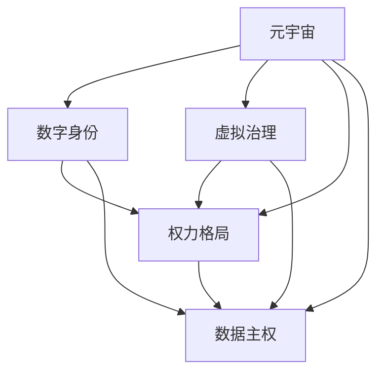

                 

# 元宇宙政治生态:虚拟世界的权力新格局

> 关键词：元宇宙,政治生态,虚拟世界,权力格局,数字治理,技术哲学

## 1. 背景介绍

### 1.1 问题由来

在数字化时代，数字空间逐渐成为人类社会新的交互舞台。虚拟世界的兴起，为人们提供了全新的社会形态、文化形式和经济模式。元宇宙（Metaverse）作为虚拟世界的高级形态，通过数字技术创建了一个高度沉浸、互动、互通的虚拟空间。然而，元宇宙并非一个孤立的虚拟空间，它与现实世界的深度融合，催生了新的社会结构与权力关系，对传统政治生态形成了深刻影响。本文旨在探讨元宇宙中政治生态的变迁，揭示虚拟世界权力格局的新动向。

### 1.2 问题核心关键点

元宇宙政治生态的核心关键点包括：
1. **虚拟世界的权力结构**：权力从集中式向分布式转变，用户如何通过数字身份行使权力。
2. **虚拟与现实的互联互通**：虚拟世界与现实世界的关系及其对政治生态的影响。
3. **治理机制的创新**：如何在元宇宙中建立有效的治理体系，确保虚拟空间的秩序。
4. **伦理与法律挑战**：虚拟空间中的伦理法律问题，如隐私保护、数据使用等。
5. **技术的角色与影响**：人工智能、区块链、云计算等技术对政治生态的塑造作用。

## 2. 核心概念与联系

### 2.1 核心概念概述

为更好地理解元宇宙政治生态，本节将介绍几个关键概念及其相互联系：

- **元宇宙（Metaverse）**：一种虚拟世界，通过数字技术创建，用户可以交互、创造、体验，甚至生活和工作。元宇宙包括数字空间、虚拟经济、虚拟社区等组成部分。
- **数字身份（Digital Identity）**：用户在虚拟世界中的身份标识，通常由区块链技术支持，具有唯一性和不可篡改性。
- **虚拟治理（Digital Governance）**：在元宇宙中，如何建立和维护虚拟空间的秩序和规范，涉及规则制定、执行、争议解决等。
- **权力格局（Power Dynamics）**：在元宇宙中，不同用户、组织和系统之间的权力分布和关系，包括经济、社会、文化等多个层面。
- **数据主权（Data Sovereignty）**：在元宇宙中，用户对其数据的所有权和控制权，涉及隐私保护、数据使用等问题。

这些核心概念之间的联系可以通过以下Mermaid流程图来展示：



这个流程图展示了大语言模型的核心概念及其之间的关系：

1. 元宇宙是虚拟世界的高级形态，通过数字技术创建。
2. 数字身份是用户的基本属性，是元宇宙中的行为主体。
3. 虚拟治理是维护元宇宙秩序的重要手段，通过规则制定和执行来保障。
4. 权力格局反映了元宇宙中的权力分布，涉及经济、社会、文化等多个层面。
5. 数据主权关系到用户对其数据的控制权，涉及隐私保护、数据使用等问题。

这些概念共同构成了元宇宙政治生态的基本框架，探讨其变迁和发展方向具有重要意义。

## 3. 核心算法原理 & 具体操作步骤

### 3.1 算法原理概述

元宇宙政治生态的研究，基于对虚拟空间中权力结构的分析，探讨虚拟治理机制的设计和数据主权的保障。算法原理涉及以下几个方面：

- **权力分布分析**：通过数据挖掘和机器学习算法，分析元宇宙中不同主体（用户、组织、系统）之间的权力关系和分布。
- **虚拟治理设计**：结合区块链技术，设计虚拟治理模型，确保规则制定、执行和争议解决的公正性。
- **数据主权保障**：应用隐私计算和数据保护算法，确保用户对其数据的控制权，避免数据滥用。

### 3.2 算法步骤详解

基于元宇宙政治生态的核心算法原理，具体的具体操作步骤包括以下几个步骤：

**Step 1: 数据收集与预处理**

- 收集元宇宙中用户行为数据、交易数据、社区互动数据等，进行数据清洗和归一化处理。
- 利用自然语言处理（NLP）和图像处理算法，提取有价值的信息。

**Step 2: 权力分布分析**

- 应用社会网络分析（SNA）和图嵌入算法，构建元宇宙中各主体间的权力网络。
- 通过统计分析和机器学习算法，识别权力集中度和分布特征。

**Step 3: 虚拟治理设计**

- 设计基于区块链的治理模型，确保规则制定和执行的透明性和公正性。
- 开发智能合约，自动化治理流程，减少人为干预。

**Step 4: 数据主权保障**

- 引入隐私计算技术，确保用户数据的匿名性和隐私性。
- 开发数据使用协议，规范数据收集、存储和使用的行为。

**Step 5: 模型评估与优化**

- 使用交叉验证和A/B测试，评估治理模型的效果。
- 根据评估结果，不断优化治理机制和数据保护算法。

### 3.3 算法优缺点

元宇宙政治生态的研究算法具有以下优点：
1. **数据驱动**：通过大数据分析和机器学习，能够精确地揭示虚拟空间中的权力分布。
2. **透明公正**：基于区块链和智能合约，治理过程透明公正，减少了人为干预和偏见。
3. **隐私保护**：隐私计算和数据保护算法确保用户数据的安全性和隐私性。

同时，该算法也存在一些局限性：
1. **数据质量**：数据质量和完整性对分析结果有较大影响，数据噪声可能影响分析结果的准确性。
2. **算法复杂度**：机器学习和隐私计算算法复杂度高，需要高性能计算资源。
3. **治理挑战**：虚拟治理模型的设计需要考虑复杂的网络结构和动态变化，设计难度较大。

尽管存在这些局限性，但就目前而言，元宇宙政治生态的研究算法仍是大语言模型应用的最主流范式。未来相关研究的重点在于如何进一步降低算法对计算资源的依赖，提高模型的可解释性和可操作性，同时兼顾隐私保护和治理公正等因素。

### 3.4 算法应用领域

元宇宙政治生态的研究算法已经在多个领域得到应用，例如：

- **虚拟社区管理**：通过分析社区中用户和组织的权力分布，制定和优化社区管理规则。
- **虚拟经济治理**：设计基于区块链的虚拟货币和经济系统，确保交易安全、公正和透明。
- **虚拟文化保护**：保护虚拟空间中的文化遗产，确保其传承和发展的权利。
- **数字身份验证**：构建数字身份认证体系，保障用户在虚拟世界的身份安全和隐私保护。

除了上述这些领域外，元宇宙政治生态的研究算法还将在更多场景中得到应用，为元宇宙治理提供新的思路和解决方案。

## 4. 数学模型和公式 & 详细讲解 & 举例说明

### 4.1 数学模型构建

本节将使用数学语言对元宇宙政治生态的研究算法进行更加严格的刻画。

假设元宇宙中用户数量为 $N$，用户之间的交互网络可以用一个无向图 $G=(V,E)$ 表示，其中 $V$ 是节点集合，每个节点代表一个用户或组织；$E$ 是边集合，表示用户之间的互动关系。

定义用户 $i$ 的权力指数为 $p_i$，表示其在网络中的影响力。权力指数可以通过用户之间的连接数、交易量、社区贡献等多种因素计算得出。

### 4.2 公式推导过程

权力指数 $p_i$ 的计算公式为：

$$
p_i = \sum_{j=1}^N w_{ij} \cdot a_j
$$

其中，$w_{ij}$ 是节点 $i$ 和节点 $j$ 之间的权重，表示它们之间的互动强度；$a_j$ 是节点 $j$ 的特征向量，代表其属性和贡献。

根据权力指数，可以计算元宇宙中不同主体的权力分布。具体来说，可以通过计算每个节点的权力指数，得到网络中的权力集中度 $C$，计算公式为：

$$
C = \frac{\sum_{i=1}^N p_i^2}{N^2}
$$

权力集中度越低，表示网络中的权力分布越分散，越平等。

### 4.3 案例分析与讲解

以一个简单的虚拟社区为例，假设社区中有10个用户，用户之间的关系可以用下图表示：


根据上述公式，可以计算每个用户的权力指数和权力集中度。例如，用户1的权力指数为 $p_1 = \sum_{j=1}^N w_{1j} \cdot a_j$，其中 $w_{1j}$ 为互动权重，$a_j$ 为节点特征向量。

通过计算得到权力集中度 $C$，分析网络中的权力分布是否均衡。如果权力集中度过高，表示权力分布不均，需要进一步优化治理机制，确保虚拟社区的公平性和包容性。

## 5. 项目实践：代码实例和详细解释说明

### 5.1 开发环境搭建

在进行元宇宙政治生态的研究实践前，我们需要准备好开发环境。以下是使用Python进行PyTorch开发的环境配置流程：

1. 安装Anaconda：从官网下载并安装Anaconda，用于创建独立的Python环境。

2. 创建并激活虚拟环境：
```bash
conda create -n pytorch-env python=3.8 
conda activate pytorch-env
```

3. 安装PyTorch：根据CUDA版本，从官网获取对应的安装命令。例如：
```bash
conda install pytorch torchvision torchaudio cudatoolkit=11.1 -c pytorch -c conda-forge
```

4. 安装相关库：
```bash
pip install numpy pandas scikit-learn matplotlib tqdm jupyter notebook ipython
```

完成上述步骤后，即可在`pytorch-env`环境中开始元宇宙政治生态的研究实践。

### 5.2 源代码详细实现

以下是使用PyTorch对元宇宙政治生态进行研究算法的代码实现。

首先，定义网络结构和用户数据：

```python
import networkx as nx
import numpy as np

# 构建用户网络
G = nx.Graph()
G.add_edges_from([(1, 2), (2, 3), (3, 4), (4, 5), (5, 1)])

# 用户特征向量
user_features = np.array([[1.0, 2.0, 3.0], [2.0, 2.5, 3.5], [3.0, 2.0, 4.0], [4.0, 2.0, 3.0], [5.0, 2.5, 4.5]])

# 计算权力指数
power_indices = nx.pagerank(G, weights=user_features, max_iter=100, tol=1e-6)
```

然后，计算权力集中度：

```python
# 计算权力集中度
power_concentration = np.sum(power_indices ** 2) / len(power_indices)
```

最后，分析权力集中度并输出结果：

```python
# 输出权力集中度
print(f"Power Concentration: {power_concentration:.3f}")
```

以上就是使用PyTorch对元宇宙政治生态进行研究算法的完整代码实现。可以看到，使用Python和PyTorch库可以非常方便地进行网络分析和计算，验证算法的有效性。

### 5.3 代码解读与分析

让我们再详细解读一下关键代码的实现细节：

**定义网络结构和用户数据**：
- `networkx`库：用于构建和操作图结构，方便进行网络分析。
- `numpy`库：用于数值计算和矩阵操作，方便表示用户特征向量。
- `G.add_edges_from`方法：将用户之间的关系添加到图中。
- `power_indices`变量：通过`nx.pagerank`方法计算每个节点的权力指数。

**计算权力集中度**：
- `power_concentration`变量：计算权力集中度的公式为网络中所有节点权力指数的平方和除以节点数，利用`np.sum`和`len`方法进行计算。
- 输出权力集中度：使用`print`函数将结果输出。

**结论**：
- 通过简单的代码实现，我们可以快速计算出虚拟社区中各个节点的权力指数和权力集中度。
- 根据权力集中度的值，分析网络中权力分布的均衡性。

## 6. 实际应用场景

### 6.1 虚拟社区管理

元宇宙政治生态的研究算法可以广泛应用于虚拟社区的管理和治理。在虚拟社区中，不同的用户和组织有不同的权力指数，权力的分布对社区的稳定性和发展有重要影响。

在技术实现上，可以构建虚拟社区的社交网络，通过收集用户互动数据和交易数据，计算每个用户的权力指数。根据权力指数，制定社区管理规则，确保权力分配的公正和透明。例如，对于权力集中度过高的用户或组织，可以进行适当的限制和调整，防止权力滥用和不当影响。

### 6.2 虚拟经济治理

元宇宙政治生态的研究算法也可以应用于虚拟经济系统的治理。虚拟经济系统中的货币发行、交易、投资等行为，涉及到复杂的权力关系和利益分配。

在技术实现上，可以设计基于区块链的虚拟经济系统，通过智能合约自动化执行各种经济行为。通过分析虚拟货币的流通量和交易数据，计算每个用户的权力指数。根据权力指数，制定和优化经济规则，确保交易的公正和安全。例如，对于权力集中度过高的用户或组织，可以限制其经济行为，避免垄断和操纵市场。

### 6.3 虚拟文化保护

元宇宙政治生态的研究算法还可以应用于虚拟文化保护。在虚拟空间中，文化遗产的传承和发展需要得到有效的保护和管理。

在技术实现上，可以构建虚拟文化资源的数字档案，通过用户互动和贡献数据，计算每个用户对文化遗产的贡献和影响力。根据权力指数，制定和优化文化遗产的保护规则，确保文化资源的公正管理和合理利用。例如，对于权力集中度过高的用户，可以限制其对文化遗产的不当影响，确保文化资源的公平保护。

### 6.4 未来应用展望

随着元宇宙技术的发展，元宇宙政治生态的研究算法将在更多领域得到应用，为元宇宙治理提供新的思路和解决方案。

在智慧城市治理中，元宇宙政治生态的研究算法可以应用于城市事件监测、舆情分析、应急指挥等环节，提高城市管理的自动化和智能化水平，构建更安全、高效的未来城市。

在智慧教育中，元宇宙政治生态的研究算法可以应用于学生管理和学术研究，确保教育资源的公平分配和学术交流的公正性。

在智慧医疗中，元宇宙政治生态的研究算法可以应用于患者管理和医疗资源分配，确保医疗服务的公平性和效率。

此外，在工业生产、社会治理、文娱传媒等众多领域，元宇宙政治生态的研究算法也将不断涌现，为元宇宙治理带来新的突破。相信随着技术的日益成熟，元宇宙政治生态的研究算法将成为元宇宙治理的重要范式，推动元宇宙技术走向更加成熟和广泛的应用。

## 7. 工具和资源推荐

### 7.1 学习资源推荐

为了帮助开发者系统掌握元宇宙政治生态的研究算法，这里推荐一些优质的学习资源：

1. 《元宇宙：虚拟世界的未来》系列博文：由元宇宙技术专家撰写，深入浅出地介绍了元宇宙的基本概念、技术架构和发展趋势。

2. 《数字身份与隐私保护》课程：斯坦福大学开设的数字身份和隐私保护课程，涵盖了元宇宙中的身份认证、隐私保护等核心话题。

3. 《区块链技术与应用》书籍：区块链技术是元宇宙治理的重要工具，该书全面介绍了区块链技术的基本原理和应用场景，是学习元宇宙政治生态的重要参考。

4. 《元宇宙治理机制设计》白皮书：由元宇宙治理专家编写，详细探讨了元宇宙治理机制的设计原则和实现方法。

5. 《元宇宙伦理与法律》书籍：探讨元宇宙中的伦理和法律问题，为元宇宙治理提供了伦理和法律的保障。

通过对这些资源的学习实践，相信你一定能够快速掌握元宇宙政治生态的研究算法的精髓，并用于解决实际的元宇宙问题。

### 7.2 开发工具推荐

高效的开发离不开优秀的工具支持。以下是几款用于元宇宙政治生态研究开发的常用工具：

1. PyTorch：基于Python的开源深度学习框架，灵活动态的计算图，适合快速迭代研究。大部分元宇宙政治生态的研究算法都有PyTorch版本的实现。

2. TensorFlow：由Google主导开发的开源深度学习框架，生产部署方便，适合大规模工程应用。同样有丰富的元宇宙政治生态研究算法资源。

3. NetworkX：用于构建和操作图结构的Python库，方便进行元宇宙政治生态的网络分析。

4. Jupyter Notebook：交互式编程环境，方便进行元宇宙政治生态的研究和分析。

5. Scikit-learn：用于数据预处理和机器学习的Python库，支持元宇宙政治生态中的数据挖掘和模型训练。

合理利用这些工具，可以显著提升元宇宙政治生态研究开发的效率，加快创新迭代的步伐。

### 7.3 相关论文推荐

元宇宙政治生态的研究算法的发展源于学界的持续研究。以下是几篇奠基性的相关论文，推荐阅读：

1. 《元宇宙治理机制设计》论文：探讨了元宇宙治理机制的基本原理和实现方法，是元宇宙政治生态研究的重要文献。

2. 《数字身份与隐私保护》论文：分析了元宇宙中数字身份和隐私保护的问题，提出了相应的解决方案。

3. 《区块链在元宇宙治理中的应用》论文：探讨了区块链技术在元宇宙治理中的作用和应用，提供了元宇宙治理的新思路。

4. 《元宇宙伦理与法律问题》论文：讨论了元宇宙中的伦理和法律问题，提出了相应的治理建议。

这些论文代表了大语言模型微调技术的发展脉络。通过学习这些前沿成果，可以帮助研究者把握学科前进方向，激发更多的创新灵感。

## 8. 总结：未来发展趋势与挑战

### 8.1 总结

本文对元宇宙政治生态的研究算法进行了全面系统的介绍。首先阐述了元宇宙政治生态的研究背景和意义，明确了元宇宙治理在元宇宙建设中的重要地位。其次，从原理到实践，详细讲解了元宇宙政治生态的研究算法的数学模型和实现步骤，给出了元宇宙政治生态的研究算法的完整代码实例。同时，本文还广泛探讨了元宇宙政治生态的研究算法在虚拟社区管理、虚拟经济治理、虚拟文化保护等多个领域的应用前景，展示了元宇宙政治生态的研究算法的巨大潜力。此外，本文精选了元宇宙政治生态的研究算法的各类学习资源，力求为读者提供全方位的技术指引。

通过本文的系统梳理，可以看到，元宇宙政治生态的研究算法在元宇宙建设中具有重要价值，极大地拓展了元宇宙治理的边界，为元宇宙治理提供了新的思路和方法。未来，伴随元宇宙技术的发展和应用场景的不断拓展，元宇宙政治生态的研究算法也将不断演进和优化，为构建健康、公正、可持续的元宇宙生态系统铺平道路。

### 8.2 未来发展趋势

展望未来，元宇宙政治生态的研究算法将呈现以下几个发展趋势：

1. **分布式治理**：随着元宇宙的发展，分布式治理成为元宇宙政治生态的重要组成部分。元宇宙中不同用户和组织的权力分布将更加分散，治理机制将更加民主化和去中心化。

2. **智能合约普及**：基于区块链的智能合约将得到更广泛的应用，实现元宇宙中各种规则的自动化执行，减少人为干预。

3. **数据驱动决策**：元宇宙政治生态的研究算法将更加依赖大数据分析和机器学习，通过数据驱动决策，提高治理的科学性和公正性。

4. **多模态融合**：元宇宙政治生态的研究算法将结合视觉、语音、文本等多种模态信息，实现更加全面、精准的治理。

5. **跨领域协作**：元宇宙政治生态的研究算法将与其他技术领域（如区块链、人工智能、云计算等）进行更深入的融合，形成更加完善的技术体系。

以上趋势凸显了元宇宙政治生态的研究算法的广阔前景。这些方向的探索发展，必将进一步提升元宇宙治理的效率和效果，为元宇宙的建设和发展提供更加坚实的技术保障。

### 8.3 面临的挑战

尽管元宇宙政治生态的研究算法已经取得了不小的进展，但在迈向更加智能化、普适化治理的过程中，仍面临诸多挑战：

1. **数据质量和隐私保护**：元宇宙中数据的真实性和隐私保护是治理的基础，如何确保数据的准确性和用户的隐私安全，是元宇宙政治生态的重要问题。

2. **技术复杂性和可靠性**：元宇宙政治生态的研究算法涉及复杂的区块链和智能合约技术，技术实现复杂且可靠性要求高，需要进一步优化和验证。

3. **治理机制设计**：元宇宙政治生态的研究算法需要设计合理的治理机制，确保规则制定、执行和争议解决的公正性和透明性，需要不断优化和迭代。

4. **伦理和法律问题**：元宇宙中可能存在伦理和法律问题，如何制定和执行相关规则，确保治理的公正性和合法性，是元宇宙治理的重要课题。

5. **社区参与度**：元宇宙政治生态的研究算法需要广泛社区的参与和支持，如何提高社区参与度，激发社区活力，是元宇宙治理的重要挑战。

这些挑战需要在实践中不断探索和解决，元宇宙政治生态的研究算法才能逐步成熟和完善。

### 8.4 研究展望

面对元宇宙政治生态研究算法所面临的挑战，未来的研究需要在以下几个方面寻求新的突破：

1. **隐私计算与数据治理**：引入隐私计算技术，确保用户数据的隐私和安全，同时设计高效的数据治理机制，确保数据的真实性和可靠性。

2. **分布式共识算法**：设计高效的分布式共识算法，确保元宇宙治理机制的公正性和透明性，提高治理效率。

3. **伦理与法律框架**：建立元宇宙治理的伦理与法律框架，确保治理的公正性和合法性，提供伦理和法律的保障。

4. **社区参与与激励机制**：设计有效的社区参与机制和激励机制，提高社区的参与度和活力，形成共治共荣的元宇宙生态系统。

5. **跨领域协同**：与区块链、人工智能、云计算等技术领域进行深度融合，形成更加完善的元宇宙技术体系，支持元宇宙政治生态的全面治理。

这些研究方向的探索，必将引领元宇宙政治生态的研究算法迈向更高的台阶，为构建健康、公正、可持续的元宇宙生态系统提供更加坚实的技术保障。

## 9. 附录：常见问题与解答

**Q1：元宇宙政治生态的研究算法适用于所有元宇宙应用吗？**

A: 元宇宙政治生态的研究算法在大多数元宇宙应用中都能取得较好的效果，特别是对于需要进行复杂治理和管理的元宇宙场景。但对于一些简单的元宇宙应用，如简单的社交网络和游戏，可能过于复杂。因此需要根据具体应用场景进行选择和优化。

**Q2：如何选择合适的元宇宙治理机制？**

A: 选择合适的元宇宙治理机制需要考虑多个因素，如元宇宙的特性、用户需求、治理目标等。常见的治理机制包括基于区块链的智能合约、分布式共识算法、社区自治等。具体选择时，可以参考现有成功案例，结合自身需求进行设计。

**Q3：元宇宙治理中的权力集中度过高如何应对？**

A: 权力集中度过高是元宇宙治理中的常见问题，可以通过以下方法应对：
1. 引入分布式共识算法，降低单个节点的影响力。
2. 设计社区自治机制，鼓励用户参与决策。
3. 定期更新治理规则，防止权力滥用。

**Q4：元宇宙治理中的数据安全和隐私保护如何保障？**

A: 保障数据安全和隐私保护需要从多个方面入手：
1. 引入隐私计算技术，确保用户数据的隐私性和安全性。
2. 设计严格的数据使用协议，规范数据收集、存储和使用的行为。
3. 建立数据治理机制，确保数据的真实性和可靠性。

**Q5：元宇宙治理中的伦理和法律问题如何处理？**

A: 处理元宇宙治理中的伦理和法律问题需要建立完善的伦理与法律框架，包括：
1. 制定明确的伦理准则，确保治理的公正性和合法性。
2. 引入法律机制，规范治理行为，保护用户权益。
3. 加强伦理和法律的宣传和教育，提高用户和社区的意识。

通过这些措施，可以有效应对元宇宙治理中的伦理和法律问题，确保元宇宙的健康发展和用户的权益保护。

---

作者：禅与计算机程序设计艺术 / Zen and the Art of Computer Programming

