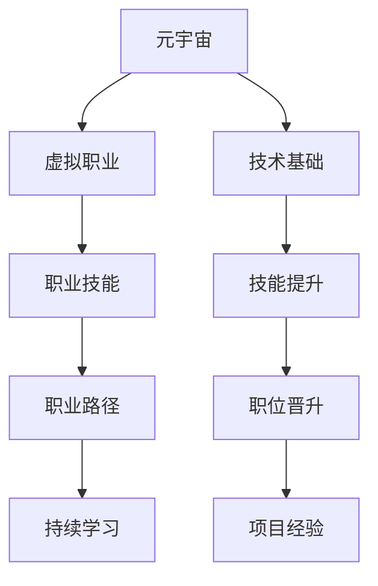

                 

# 元宇宙职业规划:虚拟世界的职业发展路径

> 关键词：元宇宙,虚拟世界,职业规划,职业技能,元宇宙职业发展,职业成长路径

## 1. 背景介绍

### 1.1 问题由来
随着技术的不断进步，元宇宙（Metaverse）的概念逐渐浮出水面，成为互联网发展的新趋势。元宇宙，这个由多个互连虚拟空间组成的虚拟世界，预计将在未来的数年内塑造全新的生活方式和经济模式。在这样的背景下，如何在这个全新的虚拟世界中找到自己的位置、规划职业发展，成为了许多人关注的热点问题。

### 1.2 问题核心关键点
元宇宙职业规划的关键在于理解元宇宙的运作机制和特点，并根据个人兴趣和技能选择适合的职业路径。具体包括：

1. **虚拟世界的理解**：元宇宙的构建基于区块链、云计算、3D建模、人工智能等多项技术，理解这些技术是基础。
2. **职业技能的选择**：根据个人兴趣和技能，选择适合的职业技能，如虚拟建筑设计师、虚拟内容创作者、虚拟世界管理等。
3. **职业发展路径的规划**：设计明确的职业成长路径，包括初级、中级、高级阶段，并根据元宇宙的发展进行适时调整。
4. **持续学习和适应**：元宇宙是一个快速变化的领域，持续学习和适应新技术和市场变化是必要的。

### 1.3 问题研究意义
元宇宙职业规划对个人和组织都具有重要意义：

1. **个人成长**：在元宇宙中找到适合自己的职业路径，提升职业满意度和幸福感。
2. **组织发展**：企业可以通过职业规划吸引和培养元宇宙领域的人才，推动企业数字化转型。
3. **社会进步**：元宇宙职业规划有助于构建更加开放、创新的社会生态，促进经济和文化的繁荣。

## 2. 核心概念与联系

### 2.1 核心概念概述

为了更好地理解元宇宙职业规划，我们先介绍几个核心概念：

- **元宇宙（Metaverse）**：由多个互连虚拟空间组成的虚拟世界，包括虚拟办公室、虚拟社区、虚拟市场等，是一个高度沉浸、交互的虚拟空间。
- **虚拟职业（Virtual Careers）**：在元宇宙中开展的职业活动，如虚拟建筑设计师、虚拟内容创作者、虚拟世界管理等。
- **职业技能（Skills）**：在元宇宙中发展职业所需的技术和能力，如3D建模、虚拟现实（VR）、区块链开发、AI训练等。
- **职业路径（Career Path）**：在元宇宙中从初级到高级的成长阶段和职业转变，包括技能提升、职位晋升、项目经验积累等。

这些概念之间相互联系，共同构成了元宇宙职业规划的基础。

### 2.2 核心概念原理和架构的 Mermaid 流程图



## 3. 核心算法原理 & 具体操作步骤

### 3.1 算法原理概述

元宇宙职业规划的算法原理基于以下几个方面：

- **技术匹配原则**：根据个人兴趣和技能，匹配适合的虚拟职业。
- **技能树模型**：构建个人技能树，映射到虚拟职业所需的技能点，指导职业成长路径。
- **职业发展路径规划**：通过技能树的拓展和积累，逐步提升职业层次。

### 3.2 算法步骤详解

#### 3.2.1 技能评估
1. **自我评估**：评估个人兴趣和技能，确定优势和需要提升的领域。
2. **技能测评工具**：使用在线测评工具，如职业技能测试、兴趣测评等，获取客观评估结果。

#### 3.2.2 技能匹配
1. **技能比对**：将个人技能与元宇宙职业所需的技能进行比对，找出匹配度高的职业方向。
2. **专家咨询**：通过职业导师或行业专家咨询，确认适合的发展路径。

#### 3.2.3 路径规划
1. **短期目标设定**：基于当前技能水平，设定短期职业目标，如掌握某项新技能、完成某个项目等。
2. **长期路径设计**：根据短期目标，设计长期职业发展路径，包括技能提升、职位晋升等。

#### 3.2.4 执行与反馈
1. **执行计划**：根据规划，制定详细执行计划，包括时间安排、资源调配等。
2. **持续反馈**：定期回顾职业发展路径，根据反馈调整计划，保持持续进步。

### 3.3 算法优缺点

#### 3.3.1 优点
- **个性化定制**：能够根据个人兴趣和技能进行个性化规划。
- **清晰路径**：提供明确的职业发展路径，减少迷茫和不确定性。
- **可操作性强**：结合实际工作需求，提供可操作的执行计划。

#### 3.3.2 缺点
- **技术更新快**：元宇宙技术快速迭代，需要持续学习和适应。
- **技能匹配难度**：职业技能多样，匹配需求较高。
- **市场变化大**：市场需求变化快，需要灵活调整职业规划。

### 3.4 算法应用领域

元宇宙职业规划的应用领域包括：

1. **虚拟建筑设计师**：设计虚拟空间、建筑和场景。
2. **虚拟内容创作者**：制作虚拟音乐、视频、故事等。
3. **虚拟世界管理**：管理虚拟社区、市场、平台等。
4. **虚拟技术开发者**：开发虚拟世界的基础设施和应用。
5. **虚拟运营人员**：管理虚拟企业的日常运营和用户互动。

这些职业在元宇宙中有广泛的发展空间和需求，规划职业发展路径具有重要意义。

## 4. 数学模型和公式 & 详细讲解 & 举例说明

### 4.1 数学模型构建

元宇宙职业规划的数学模型可以简化为以下几个维度：

- **技能维度**：包括技术技能、软技能、协作能力等。
- **职业维度**：包括初级、中级、高级职位，以及不同角色（如设计师、创作者、管理者等）。
- **时间维度**：包括短期和长期目标，以及具体的执行时间表。

### 4.2 公式推导过程

以虚拟建筑设计师为例，构建职业成长路径的数学模型：

设个人初始技能为 $S_0$，目标职位所需技能为 $S_t$，当前职位技能为 $S_1$，技能提升目标为 $S_2$。

根据技能树模型，技能提升过程可以表示为：

$$
S_2 = S_1 + \Delta S
$$

其中 $\Delta S$ 为技能提升量，取决于培训课程、项目经验等。

根据职业发展路径规划，设从当前职位 $S_1$ 提升到目标职位 $S_t$ 所需的技能提升量为 $S_{\Delta}$。

则职业成长路径的数学模型为：

$$
S_t = S_1 + \Delta S_{\Delta}
$$

其中 $S_{\Delta}$ 可以通过专家咨询或职业测评工具获得。

### 4.3 案例分析与讲解

假设一位虚拟建筑设计师希望从初级设计师晋升到高级设计师：

1. **技能评估**：评估其当前技能水平为 $S_1$，目标职位所需技能为 $S_t$。
2. **技能匹配**：确定需要提升的技能 $S_2$。
3. **路径规划**：设定短期目标为掌握某项新技能，如3D建模，长期目标为晋升为高级设计师。
4. **执行计划**：参加3D建模培训课程，参与项目实践，积累相关经验，提升技能水平。
5. **反馈调整**：定期回顾进展，根据反馈调整技能提升计划和职业发展路径。

## 5. 项目实践：代码实例和详细解释说明

### 5.1 开发环境搭建

要实现元宇宙职业规划，需要先搭建开发环境：

1. **选择开发工具**：Python 是最常用的开发工具，推荐使用 PyCharm 或 Jupyter Notebook。
2. **安装依赖库**：使用 pip 安装必要的库，如 Pandas、NumPy、Matplotlib 等。
3. **数据准备**：准备职业技能评估数据和职业路径规划数据。

### 5.2 源代码详细实现

以下是一个简化的 Python 代码示例，用于技能匹配和路径规划：

```python
import pandas as pd
import numpy as np

# 技能评估数据
skills = pd.DataFrame({
    '技能': ['3D建模', '编程', '设计理念', '协作能力'],
    '评分': [7, 6, 5, 6]
})

# 目标职位所需技能
target_skills = pd.Series(['3D建模', '编程', '设计理念', '用户体验', '项目管理'])

# 技能匹配
def skill_match(skills, target_skills):
    match_score = 0
    for skill in target_skills:
        if skill in skills['技能']:
            match_score += skills[skills['技能'] == skill]['评分'].values[0]
    return match_score

# 路径规划
def career_path(skill_match_score, target_skill_score):
    initial_skill_score = 0
    target_skill_score = 50  # 假设目标技能分数为50
    delta_skill_score = target_skill_score - skill_match_score
    
    # 技能提升目标
    target_skill_upgrade = target_skill_score - initial_skill_score
    
    return delta_skill_upgrade

# 应用示例
match_score = skill_match(skills, target_skills)
delta_skill_upgrade = career_path(match_score, target_skill_score)
print(f"技能匹配得分：{match_score}")
print(f"技能提升目标：{delta_skill_upgrade}")
```

### 5.3 代码解读与分析

上述代码实现了一个简化的技能匹配和路径规划功能：

- **技能评估数据**：定义了一个技能列表和相应的评分。
- **目标职位所需技能**：定义了一个目标技能列表。
- **技能匹配函数**：根据技能列表和目标技能列表，计算匹配得分。
- **路径规划函数**：根据匹配得分和目标技能分数，计算技能提升目标。
- **应用示例**：输入技能评估数据和目标技能分数，输出技能匹配得分和技能提升目标。

## 6. 实际应用场景

### 6.1 虚拟建筑设计师

虚拟建筑设计师在元宇宙中有广泛的应用，如设计和构建虚拟建筑、城市和社区等。

#### 实际应用示例
1. **虚拟办公空间设计**：利用BIM（建筑信息模型）技术，设计和优化虚拟办公空间，提升用户体验。
2. **虚拟住宅设计**：设计和构建虚拟住宅，提供个性化的居住体验。
3. **虚拟公共空间设计**：设计和优化虚拟公园、广场等公共空间，提升社区氛围。

### 6.2 虚拟内容创作者

虚拟内容创作为元宇宙提供了丰富多彩的文化和娱乐内容，如虚拟音乐、视频、故事等。

#### 实际应用示例
1. **虚拟音乐创作**：利用VR技术，创作虚拟音乐会、演唱会等，提供沉浸式体验。
2. **虚拟视频制作**：制作虚拟电影、电视剧等，提供高质量的视觉和听觉体验。
3. **虚拟故事创作**：创作虚拟小说、漫画等，提供互动式的阅读体验。

### 6.3 虚拟世界管理

虚拟世界管理是元宇宙的基础，负责维护虚拟社区、市场和平台等。

#### 实际应用示例
1. **虚拟社区管理**：管理虚拟社区的秩序和互动，提升用户满意度。
2. **虚拟市场管理**：管理虚拟市场交易，提供安全、可靠的商业环境。
3. **虚拟平台管理**：管理虚拟平台的运营和用户互动，提升平台活跃度。

### 6.4 未来应用展望

随着元宇宙的发展，其应用场景将不断扩展，为职业规划带来新的机遇：

1. **职业多样化**：元宇宙中涌现出更多新兴职业，如虚拟赛事策划、虚拟旅游设计师等。
2. **技能需求变化**：元宇宙的发展将推动新技能的需求，如区块链开发、AI训练等。
3. **跨界融合**：元宇宙将推动不同领域技能和职业的融合，如设计、工程、艺术等。

## 7. 工具和资源推荐

### 7.1 学习资源推荐

为了更好地学习和实践元宇宙职业规划，我们推荐以下资源：

1. **《Metaverse 技术指南》**：详细介绍了元宇宙技术基础、应用场景和开发工具。
2. **Coursera《元宇宙设计与开发》课程**：提供元宇宙设计的理论和实践课程，涵盖虚拟建筑、虚拟内容创作等。
3. **Udemy《虚拟现实与元宇宙开发》课程**：提供虚拟现实和元宇宙开发的实战教程，包括开发工具和项目实践。
4. **《Metaverse 职业指南》**：详细介绍元宇宙中的职业机会、发展路径和技能要求。
5. **LinkedIn《元宇宙职业发展》文章**：分享元宇宙领域职业发展的真实案例和经验。

### 7.2 开发工具推荐

以下是一些常用的元宇宙开发工具：

1. **Unity 3D**：最流行的3D游戏引擎，支持虚拟现实、增强现实等技术。
2. **Unreal Engine**：另一个流行的3D游戏引擎，支持高精度图形渲染。
3. **Blender**：免费的3D建模软件，支持多种格式和插件。
4. **Maya**：专业的3D建模和动画软件，功能强大，适合复杂的虚拟设计。
5. **Vuforia**：增强现实开发工具，支持图像识别、手势交互等技术。

### 7.3 相关论文推荐

以下是一些关于元宇宙职业规划的重要论文：

1. **《Metaverse 职业规划模型》**：介绍元宇宙职业规划的数学模型和方法。
2. **《虚拟设计技能评估与匹配》**：研究虚拟设计技能的评估和匹配技术。
3. **《元宇宙职业发展路径》**：探索元宇宙职业发展的路径和策略。
4. **《虚拟现实与元宇宙技术融合》**：研究虚拟现实和元宇宙技术的融合应用。
5. **《元宇宙职业技能需求分析》**：分析元宇宙领域不同职业的技能需求。

## 8. 总结：未来发展趋势与挑战

### 8.1 研究成果总结

元宇宙职业规划的算法和实践，已经在多个领域取得了初步成果：

1. **技术匹配原则**：通过匹配个人技能和虚拟职业所需技能，为职业规划提供了科学依据。
2. **技能树模型**：构建个人技能树，指导职业成长路径，具有清晰的指导作用。
3. **职业发展路径规划**：提供短期和长期的职业发展目标，帮助个人和组织制定切实可行的计划。

### 8.2 未来发展趋势

未来，元宇宙职业规划将呈现以下几个发展趋势：

1. **技术快速迭代**：元宇宙技术快速迭代，需要持续学习和适应新技术。
2. **职业多样化和融合**：元宇宙将推动更多新兴职业的产生，促进跨界融合。
3. **技能需求变化**：新技能需求不断涌现，需要持续更新和提升技能。
4. **跨平台互操作**：不同平台之间的互操作性提升，推动元宇宙的生态发展。

### 8.3 面临的挑战

尽管元宇宙职业规划已经取得了初步成果，但在发展过程中仍面临以下挑战：

1. **技术更新快**：元宇宙技术快速发展，需要持续学习和跟进。
2. **市场变化大**：市场需求变化快，需要灵活调整职业规划。
3. **技能匹配难度高**：不同职业的技能要求多样，匹配需求较高。
4. **职业发展路径不确定性**：元宇宙职业路径尚未完全明确，需要更多探索和实践。

### 8.4 研究展望

未来，元宇宙职业规划需要在以下几个方面进行探索：

1. **技术融合**：将更多技术融合到职业规划中，如区块链、AI、IoT等。
2. **职业生态构建**：构建元宇宙职业生态，推动职业发展和人才流动。
3. **跨领域合作**：与多个行业合作，推动元宇宙技术和职业发展的融合。
4. **伦理和规范**：建立元宇宙职业发展的伦理和规范，保障用户权益和数据安全。

## 9. 附录：常见问题与解答

**Q1: 如何评估自己的元宇宙职业兴趣和技能？**

A: 可以使用职业测评工具和技能测试，如在线测评、职业咨询等，获取客观评估结果。

**Q2: 如何选择适合元宇宙的职业路径？**

A: 结合自身兴趣和技能，选择匹配度高的职业路径，并参考行业专家的意见和建议。

**Q3: 如何在元宇宙中提升职业技能？**

A: 参加相关的培训课程、项目实践和认证考试，提升技能水平和实际经验。

**Q4: 如何在元宇宙中管理和规划职业生涯？**

A: 设定明确的职业目标，制定详细的执行计划，并定期回顾和调整职业规划。

---

作者：禅与计算机程序设计艺术 / Zen and the Art of Computer Programming

