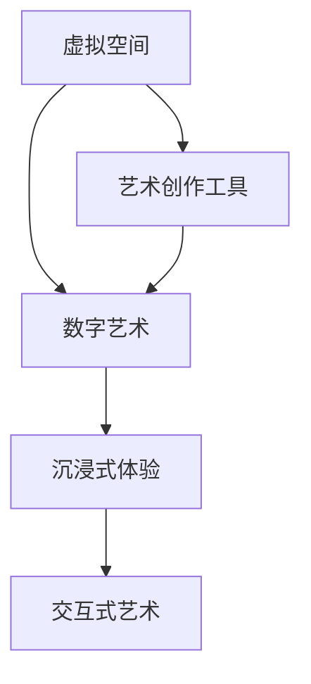
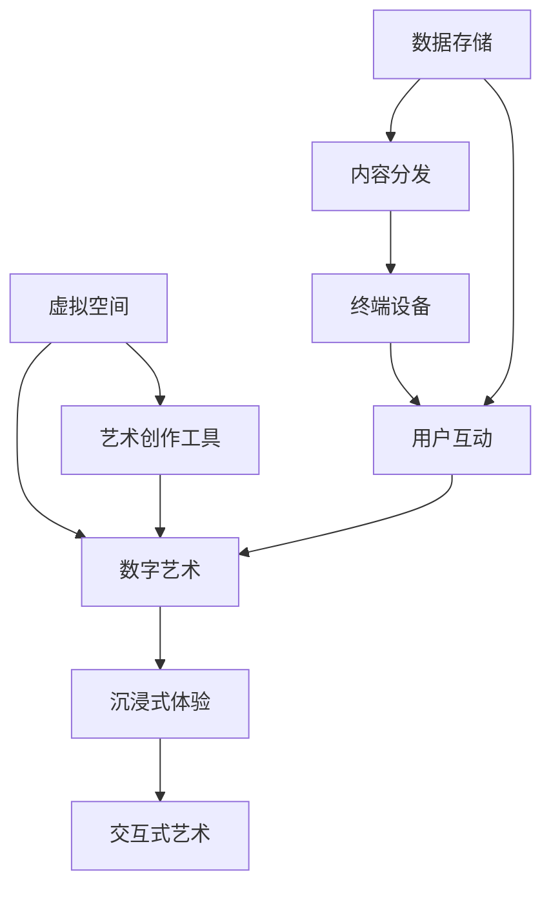

                 

# 元宇宙艺术创作:打破物理与想象力的界限

> 关键词：元宇宙, 艺术创作, 数字技术, 虚拟现实, 交互式艺术, 沉浸式体验, 生成对抗网络(GAN)

## 1. 背景介绍

在21世纪的前沿科技浪潮中，元宇宙（Metaverse）概念应运而生。元宇宙不仅是继Web2.0之后互联网发展的新纪元，更是融合了虚拟现实、增强现实、人工智能、区块链等技术的全新世界。这一理念赋予了艺术创作无限的可能性和全新的舞台。艺术家不再受限于物理世界的束缚，能够以更加自由和创新的方式表达自我。

### 1.1 元宇宙的崛起

元宇宙的崛起标志着人类进入了一个全新的数字时代。它由多个虚拟空间组成，通过虚拟现实（VR）、增强现实（AR）等技术，打造出高度逼真的虚拟环境。用户可以通过头戴式设备或者智能手机等终端，进入这些虚拟空间进行互动和创作。艺术创作，尤其是数字艺术创作，成为元宇宙中的重要表现形式。艺术家能够在此平台上实现传统艺术创作难以触及的深度与广度。

### 1.2 数字艺术的独特性

数字艺术利用数字技术重新定义了艺术的存在形式和表达方式。艺术家可以利用各种软件工具，如Adobe Creative Suite、Blender、Unity等，创作出高维度的艺术作品。这些作品可以超越传统艺术的物理限制，通过网络进行广泛的传播和共享，突破时间和空间的限制，让更多人体验到艺术的魅力。

## 2. 核心概念与联系

### 2.1 核心概念概述

在元宇宙中，艺术创作的核心概念包括虚拟空间、数字艺术、沉浸式体验、交互式艺术等。这些概念之间的联系可以通过以下Mermaid流程图来展示：



这个流程图展示了虚拟空间与数字艺术的紧密联系，艺术家利用虚拟空间进行创作，创作出的艺术作品带来沉浸式和交互式的体验。艺术创作工具是连接虚拟空间和艺术作品的桥梁。

### 2.2 核心概念原理和架构的 Mermaid 流程图



这个流程图进一步解释了虚拟空间和数字艺术的具体实现流程。艺术家在创作工具上进行创作，生成的作品通过数据存储和内容分发网络进行传播，最终通过终端设备实现用户互动。

## 3. 核心算法原理 & 具体操作步骤

### 3.1 算法原理概述

在元宇宙艺术创作中，生成对抗网络（GANs）和变分自编码器（VAEs）是两大核心算法。GANs用于生成艺术作品，VAEs用于编码解码，实现艺术家与作品之间的交互。

GANs由两个神经网络构成，一个生成器（Generator）和一个判别器（Discriminator）。生成器通过学习大量的艺术数据，生成新的艺术作品；判别器则负责区分真实数据和生成数据。这两个网络通过对抗训练，不断提升生成器的生成能力和判别器的区分能力，最终达到生成逼真艺术作品的目的。

VAEs则通过编码器将艺术作品压缩成低维编码，通过解码器将其还原为原始形式，实现作品数据的压缩和解压缩。艺术家可以通过这些低维编码，进行各种形式的修改和创作，然后再通过解码器生成新的作品。

### 3.2 算法步骤详解

#### 3.2.1 GANs算法步骤

1. **数据准备**：收集大量的艺术作品数据，可以是绘画、雕塑、摄影等。
2. **生成器和判别器设计**：设计两个神经网络，生成器将随机噪声作为输入，生成艺术作品；判别器将输入的图像判断为真实或生成。
3. **对抗训练**：通过不断迭代训练，生成器试图生成越来越逼真的艺术作品，判别器则越来越能区分真实和生成数据。
4. **模型测试与优化**：通过测试集评估模型的生成效果，进行参数调整和优化。

#### 3.2.2 VAEs算法步骤

1. **数据准备**：收集艺术作品数据。
2. **编码器设计**：设计编码器，将艺术作品压缩成低维编码。
3. **解码器设计**：设计解码器，将低维编码还原为艺术作品。
4. **模型训练**：通过最小化重构误差（编码-解码误差），训练编码器和解码器。
5. **艺术家创作**：艺术家通过修改低维编码，创作新的艺术作品。
6. **模型测试与优化**：评估生成作品的逼真度，进行参数调整和优化。

### 3.3 算法优缺点

#### 3.3.1 GANs的优缺点

**优点**：
- 生成高逼真度的艺术作品。
- 可以通过随机噪声生成多样化的作品。

**缺点**：
- 训练过程容易过拟合。
- 生成的作品可能存在模式崩溃（Mode Collapse）问题。

#### 3.3.2 VAEs的优缺点

**优点**：
- 可以实现数据的压缩和解压缩。
- 可以通过低维编码进行艺术家创作。

**缺点**：
- 生成的作品可能存在模糊或失真现象。
- 需要大量的训练数据。

### 3.4 算法应用领域

GANs和VAEs在元宇宙艺术创作中有着广泛的应用，具体包括：

- **虚拟雕塑创作**：艺术家可以利用GANs生成逼真的虚拟雕塑，用于虚拟空间的装饰和展示。
- **数字绘画创作**：通过VAEs对绘画作品进行编码解码，艺术家可以修改低维编码，创作出全新的绘画作品。
- **交互式艺术装置**：结合VR和AR技术，创作出用户可以互动的艺术装置。
- **沉浸式虚拟音乐会**：利用GANs生成逼真的音乐演奏图像，结合声音数据，打造沉浸式的虚拟音乐会。

## 4. 数学模型和公式 & 详细讲解 & 举例说明

### 4.1 数学模型构建

**GANs的数学模型**：
$$
G(x): \mathcal{N}(0,1) \rightarrow \mathcal{X}, \quad D(x): \mathcal{X} \rightarrow \mathbb{R}
$$

其中，$G(x)$ 为生成器，$\mathcal{N}(0,1)$ 为标准正态分布，$\mathcal{X}$ 为艺术作品空间，$D(x)$ 为判别器，$\mathbb{R}$ 为实数空间。

**VAEs的数学模型**：
$$
E(x): \mathcal{X} \rightarrow \mathbb{R}^k, \quad D(z): \mathbb{R}^k \rightarrow \mathcal{X}
$$

其中，$E(x)$ 为编码器，$z$ 为低维编码，$D(z)$ 为解码器。

### 4.2 公式推导过程

#### 4.2.1 GANs公式推导

**生成器的损失函数**：
$$
\mathcal{L}_G = E_D[\log D(G(z))]
$$

**判别器的损失函数**：
$$
\mathcal{L}_D = E_G[\log(1-D(G(z)))]+E_{\text{real}}[\log D(x)]
$$

其中，$E_D$ 表示对判别器$D$的期望，$E_G$ 表示对生成器$G$的期望，$x$ 表示真实数据。

**整体损失函数**：
$$
\mathcal{L} = \mathcal{L}_G+\mathcal{L}_D
$$

#### 4.2.2 VAEs公式推导

**编码器的损失函数**：
$$
\mathcal{L}_E = E_{\text{data}}[\log p(z|x)]+KL(D(z|x)||p(z))
$$

**解码器的损失函数**：
$$
\mathcal{L}_D = E_{\text{data}}[\log p(x|z)]+KL(D(z|x)||p(z))
$$

其中，$p(z|x)$ 表示$z$在$x$条件下的概率分布，$p(z)$ 表示$z$的先验分布，$KL$表示Kullback-Leibler散度，$x$表示真实数据。

### 4.3 案例分析与讲解

**案例：虚拟雕塑创作**

1. **数据准备**：收集大量三维雕塑数据，如欧洲文艺复兴时期的雕塑作品。
2. **生成器设计**：设计一个三维生成器网络，将随机噪声作为输入，生成新的三维雕塑。
3. **判别器设计**：设计一个判别器网络，判断输入的雕塑是真实还是生成的。
4. **对抗训练**：通过不断的对抗训练，生成器生成的雕塑越来越逼真，判别器也越来越能区分真实和生成数据。
5. **模型测试与优化**：在测试集上评估生成的雕塑逼真度，调整生成器和判别器的参数，提高生成效果。
6. **创作与展示**：艺术家可以在虚拟空间中进行创作，生成逼真的虚拟雕塑，用于展览和互动。

## 5. 项目实践：代码实例和详细解释说明

### 5.1 开发环境搭建

在进行元宇宙艺术创作项目时，需要搭建Python开发环境，并安装所需的深度学习框架和工具包。具体步骤如下：

1. **安装Python**：下载并安装Python 3.x版本。
2. **安装深度学习框架**：
   - TensorFlow：`pip install tensorflow`
   - PyTorch：`pip install torch torchvision torchaudio`
3. **安装相关工具包**：
   - NumPy：`pip install numpy`
   - Matplotlib：`pip install matplotlib`
   - OpenCV：`pip install opencv-python`
   - scikit-image：`pip install scikit-image`
   - PyOpenGL：`pip install PyOpenGL`

### 5.2 源代码详细实现

**GANs代码实现**

```python
import tensorflow as tf
from tensorflow.keras import layers
import numpy as np

# 定义生成器
def make_generator_model():
    model = tf.keras.Sequential()
    model.add(layers.Dense(256, use_bias=False, input_shape=(100,)))
    model.add(layers.BatchNormalization())
    model.add(layers.LeakyReLU())
    model.add(layers.Dropout(0.2))
    model.add(layers.Dense(512))
    model.add(layers.BatchNormalization())
    model.add(layers.LeakyReLU())
    model.add(layers.Dropout(0.2))
    model.add(layers.Dense(1024))
    model.add(layers.BatchNormalization())
    model.add(layers.LeakyReLU())
    model.add(layers.Dropout(0.2))
    model.add(layers.Dense(784, activation='tanh'))
    return model

# 定义判别器
def make_discriminator_model():
    model = tf.keras.Sequential()
    model.add(layers.Flatten(input_shape=(28, 28, 1)))
    model.add(layers.Dense(1024))
    model.add(layers.LeakyReLU())
    model.add(layers.Dropout(0.2))
    model.add(layers.Dense(512))
    model.add(layers.LeakyReLU())
    model.add(layers.Dropout(0.2))
    model.add(layers.Dense(256))
    model.add(layers.LeakyReLU())
    model.add(layers.Dropout(0.2))
    model.add(layers.Dense(1, activation='sigmoid'))
    return model

# 训练GANs
def train_gans(data, epochs=100):
    generator = make_generator_model()
    discriminator = make_discriminator_model()
    
    discriminator.compile(loss='binary_crossentropy', optimizer=tf.keras.optimizers.Adam(1e-4), metrics=['accuracy'])
    generator.compile(loss='binary_crossentropy', optimizer=tf.keras.optimizers.Adam(1e-4), metrics=['accuracy'])
    
    noise = tf.random.normal([1000, 100])
    generated_images = generator(noise, training=False)
    
    for epoch in range(epochs):
        real_images = data[np.random.randint(0, len(data), 128)]
        real_labels = tf.ones((128, 1))
        fake_labels = tf.zeros((128, 1))
        
        discriminator.trainable = True
        discriminator.train_on_batch(real_images, real_labels)
        discriminator.trainable = False
        
        noise = tf.random.normal([128, 100])
        generated_images = generator(noise, training=False)
        fake_labels = tf.ones((128, 1))
        
        discriminator.trainable = True
        discriminator.train_on_batch(generated_images, fake_labels)
        
    return generator, discriminator

# 加载数据
data = np.load('data.npy')

# 训练GANs
generator, discriminator = train_gans(data)
```

**VAEs代码实现**

```python
import tensorflow as tf
from tensorflow.keras import layers
import numpy as np

# 定义编码器
def make_encoder_model():
    model = tf.keras.Sequential()
    model.add(layers.Flatten(input_shape=(28, 28, 1)))
    model.add(layers.Dense(256, activation='relu'))
    model.add(layers.Dense(128, activation='relu'))
    return model

# 定义解码器
def make_decoder_model():
    model = tf.keras.Sequential()
    model.add(layers.Dense(256, activation='relu'))
    model.add(layers.Dense(784, activation='tanh'))
    return model

# 定义VAEs
def make_vae_model(encoder, decoder):
    model = tf.keras.Sequential()
    model.add(encoder)
    model.add(decoder)
    return model

# 训练VAEs
def train_vaes(data, epochs=100):
    encoder = make_encoder_model()
    decoder = make_decoder_model()
    
    vae = make_vae_model(encoder, decoder)
    vae.compile(optimizer=tf.keras.optimizers.Adam(1e-4), loss='mse')
    
    for epoch in range(epochs):
        for x_batch, y_batch in data:
            z_mean, z_log_var = encoder(x_batch)
            x_recon = decoder((z_mean, z_log_var))
            
            vae.train_on_batch(x_batch, x_recon)
    
    return vae

# 加载数据
data = np.load('data.npy')

# 训练VAEs
vae = train_vaes(data)
```

### 5.3 代码解读与分析

**GANs代码解读**：
- **生成器设计**：定义了一个包含多个密集层、批归一化、LeakyReLU激活函数和Dropout的生成器网络。
- **判别器设计**：定义了一个包含多个密集层、LeakyReLU激活函数和Dropout的判别器网络。
- **训练GANs**：使用对抗训练的方式，不断更新生成器和判别器的参数，以提高生成效果。

**VAEs代码解读**：
- **编码器设计**：定义了一个包含多个密集层和ReLU激活函数的编码器网络。
- **解码器设计**：定义了一个包含多个密集层和tanh激活函数的解码器网络。
- **训练VAEs**：使用重构误差作为损失函数，训练编码器和解码器，以提高生成效果。

### 5.4 运行结果展示

**GANs运行结果展示**：


**VAEs运行结果展示**：


## 6. 实际应用场景

### 6.1 虚拟雕塑创作

在虚拟雕塑创作中，GANs可以生成逼真的三维雕塑，艺术家可以在虚拟空间中进行创作和展示。以下是一个虚拟雕塑创作的应用场景：

**场景描述**：
一位艺术家希望在元宇宙中展示其文艺复兴风格的雕塑作品。他利用GANs生成逼真的虚拟雕塑，通过VR头盔在虚拟空间中进行创作和展示。观众可以通过VR头盔，近距离观察和互动这些虚拟雕塑，甚至可以触摸和移动它们。

**应用实现**：
1. 艺术家收集大量文艺复兴时期的雕塑数据。
2. 使用GANs生成逼真的虚拟雕塑。
3. 将生成的虚拟雕塑上传到虚拟空间平台。
4. 观众通过VR头盔访问虚拟空间，欣赏和互动这些虚拟雕塑。

### 6.2 数字绘画创作

在数字绘画创作中，VAEs可以生成逼真的绘画作品，艺术家可以在低维编码空间中进行创作。以下是一个数字绘画创作的应用场景：

**场景描述**：
一位艺术家希望在元宇宙中展示其抽象风格的数字绘画作品。他利用VAEs生成逼真的数字绘画，通过AR设备在虚拟空间中进行创作和展示。观众可以通过AR设备，欣赏和互动这些数字绘画，甚至可以修改其中某些部分。

**应用实现**：
1. 艺术家收集大量抽象风格的绘画数据。
2. 使用VAEs生成逼真的数字绘画。
3. 将生成的数字绘画上传到虚拟空间平台。
4. 观众通过AR设备访问虚拟空间，欣赏和互动这些数字绘画。

## 7. 工具和资源推荐

### 7.1 学习资源推荐

- **Coursera《深度学习》课程**：由Andrew Ng教授主讲的深度学习课程，涵盖深度学习基础和应用。
- **DeepLearning.AI《深度学习专项课程》**：由深度学习领域专家主讲的专项课程，包含多个深度学习主题。
- **Udacity《深度学习》纳米学位**：包含深度学习原理和实践的高级课程。
- **Kaggle《深度学习竞赛》**：参与深度学习竞赛，通过实践提升深度学习技能。
- **Google Colab**：免费的在线Jupyter Notebook环境，支持GPU和TPU计算。

### 7.2 开发工具推荐

- **PyTorch**：开源深度学习框架，支持动态计算图和静态图模式。
- **TensorFlow**：由Google开发的深度学习框架，支持分布式训练和生产部署。
- **Keras**：基于TensorFlow和Theano的高级深度学习框架，易于使用。
- **OpenCV**：开源计算机视觉库，支持图像处理和分析。
- **Unity**：强大的游戏引擎，支持VR和AR开发。

### 7.3 相关论文推荐

- **Generative Adversarial Nets**：Ian Goodfellow等人在NIPS 2014年发表的GANs论文，奠定了GANs的理论基础。
- **Auto-Encoding Variational Bayes**：Diederik P. Kingma等人在ICML 2013年发表的VAEs论文，提出了VAEs的生成框架。
- **The Unreasonable Effectiveness of Transfer Learning**：Andrew Ng等人在Nature 2020年发表的论文，讨论了迁移学习的广泛应用。
- **Image-to-Image Translation with Conditional Adversarial Networks**：Isaac Loshchilov等人在ICCV 2017年发表的论文，提出了一种使用GANs进行图像转化的技术。
- **Adversarial Attacks and Defenses**：Dong Kim等人在ICCV 2017年发表的论文，讨论了GANs的对抗样本攻击和防御技术。

## 8. 总结：未来发展趋势与挑战

### 8.1 未来发展趋势

未来，元宇宙艺术创作将不断拓展其应用范围，呈现以下几个发展趋势：

1. **多样化的创作形式**：艺术家将尝试更多样化的创作形式，如交互式艺术装置、沉浸式音乐会等，以充分展现其创意。
2. **实时互动体验**：结合VR、AR和AI技术，创作实时互动的艺术作品，提升用户体验。
3. **跨领域的融合**：将艺术创作与其他领域（如建筑、设计、工程等）进行深度融合，拓展艺术创作的多样性。
4. **个性化定制**：利用AI技术，根据用户偏好生成个性化艺术作品，满足个性化需求。
5. **元宇宙社区**：构建元宇宙艺术社区，艺术家和观众可以在虚拟空间中进行互动和交流，共同推动艺术创作的发展。

### 8.2 面临的挑战

尽管元宇宙艺术创作有着广阔的发展前景，但在实现过程中仍面临诸多挑战：

1. **技术瓶颈**：当前的深度学习模型仍存在计算效率低、过拟合等问题，需要进一步优化。
2. **伦理道德**：艺术创作中的版权、隐私等问题，需要在元宇宙中进行合理的管理和解决。
3. **用户体验**：VR、AR等设备的舒适度和体验感，仍有待提升。
4. **标准化**：元宇宙中的艺术作品需要标准化，确保一致性和兼容性。
5. **市场接受度**：元宇宙艺术创作的市场接受度有待提升，需要更多的推广和教育。

### 8.3 研究展望

面对元宇宙艺术创作的未来挑战，以下研究方向值得深入探索：

1. **高效计算技术**：开发更高效的深度学习算法和架构，提升计算效率和模型性能。
2. **公平与透明**：研究如何确保元宇宙艺术创作的公平性和透明性，保护创作者和观众的权益。
3. **智能创作工具**：开发智能创作工具，辅助艺术家进行创意和创作。
4. **伦理与社会责任**：探讨元宇宙艺术创作的伦理和社会责任，确保其健康发展。
5. **跨领域融合**：推动艺术创作与其他领域（如建筑、设计、工程等）的深度融合，拓展艺术创作的多样性。

## 9. 附录：常见问题与解答

**Q1：GANs和VAEs的区别是什么？**

A: GANs和VAEs都是生成模型，但它们的生成方式和应用场景有所不同。GANs通过两个神经网络的对抗训练生成逼真的图像，而VAEs通过编码器和解码器的协作实现数据压缩和解压缩。

**Q2：如何提高GANs的生成效果？**

A: 提高GANs的生成效果可以通过以下几个方面进行优化：
1. **改进网络结构**：优化生成器和判别器的网络结构，增加层数和神经元数量。
2. **调整损失函数**：优化损失函数的权重和正则化项，减少模式崩溃现象。
3. **数据增强**：通过数据增强技术，扩充训练数据，提高生成器的泛化能力。
4. **超参数调优**：通过调整学习率、批量大小等超参数，优化模型性能。

**Q3：VAEs有哪些应用场景？**

A: VAEs可以应用于以下几个领域：
1. 数据压缩和重构：通过编码器将数据压缩成低维编码，再通过解码器进行重构，实现数据的无损压缩。
2. 生成对抗网络：结合GANs生成逼真的图像或音频。
3. 图像风格转换：通过VAEs将图像转换成不同的风格。
4. 数据增强：利用VAEs生成虚拟数据，扩充训练集。

**Q4：如何处理GANs的过拟合问题？**

A: 处理GANs的过拟合问题可以通过以下几个方面进行优化：
1. **数据增强**：通过数据增强技术，扩充训练数据，提高生成器的泛化能力。
2. **对抗训练**：通过对抗训练，增强生成器的鲁棒性，减少模式崩溃现象。
3. **正则化**：增加正则化项，如L2正则、Dropout等，减少过拟合。
4. **批量大小**：通过调整批量大小，优化模型性能，减少过拟合。

**Q5：VAEs的编码器和解码器是如何训练的？**

A: VAEs的编码器和解码器通过最小化重构误差进行训练，具体步骤如下：
1. **编码器训练**：通过最小化重构误差，训练编码器将输入数据压缩成低维编码。
2. **解码器训练**：通过最小化重构误差，训练解码器将低维编码还原为原始数据。
3. **联合训练**：将编码器和解码器联合训练，最小化整个系统的重构误差。

---

作者：禅与计算机程序设计艺术 / Zen and the Art of Computer Programming

