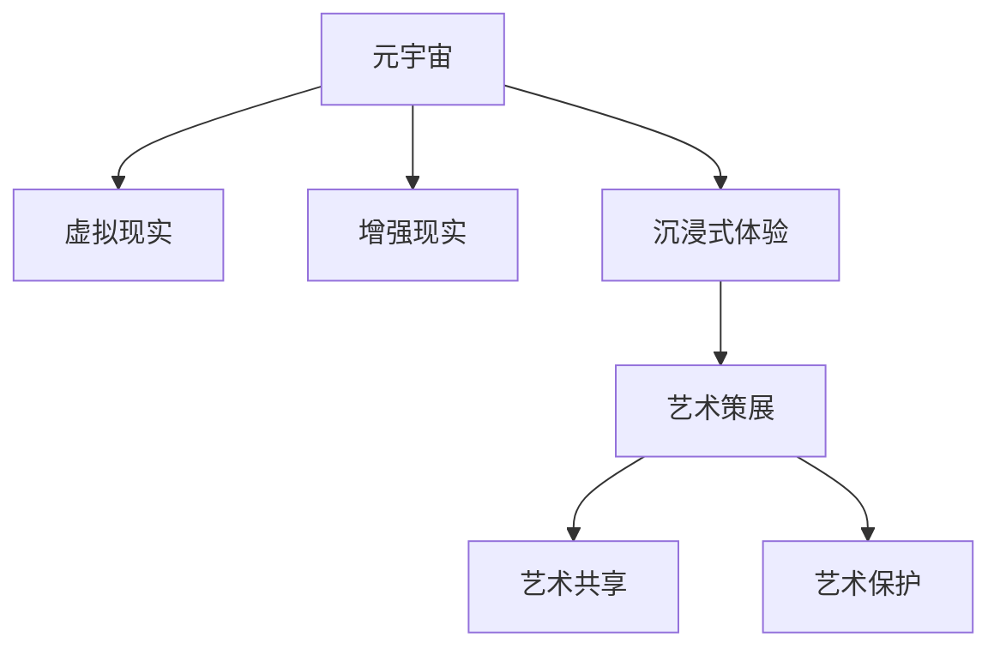

                 

# 元宇宙艺术策展:跨维度艺术展览的新形式

> 关键词：元宇宙,艺术展览,跨维度,虚拟现实,沉浸式体验,艺术保护,艺术共享,数字收藏

## 1. 背景介绍

### 1.1 问题由来
随着技术的不断进步，元宇宙这一全新的概念正在逐渐融入我们的生活。元宇宙不仅是一个虚拟现实(VR)和增强现实(AR)技术的集大成者，更是未来数字文明的核心所在。艺术，作为人类情感和思想的外化，也正在借助元宇宙技术进行全新形式的策展和传播。

在传统艺术策展中，观众只能通过有限的视角和物理空间接触到艺术品。然而，随着虚拟现实和数字技术的融合，元宇宙为艺术策展开辟了新的可能，使得跨维度、沉浸式体验成为现实。观众不再局限于物理空间，可以在虚拟世界中进行自由探索和互动，从而赋予艺术展览更广阔的展示空间和更深的情感共鸣。

### 1.2 问题核心关键点
元宇宙艺术策展的核心关键点在于：
- 利用虚拟现实和数字技术，打破物理空间的限制，实现艺术作品的数字化、虚拟化。
- 通过沉浸式体验，深度解读艺术作品的内涵，激发观众的情感共鸣。
- 实现跨维度的艺术共享，让更多观众以零成本的方式接触到艺术作品。
- 借助数字技术对艺术进行保护和修复，延长艺术作品的生命周期。

本文将详细探讨元宇宙艺术策展的技术实现、应用场景及未来趋势，力求为艺术展览的数字化转型提供新思路和新工具。

## 2. 核心概念与联系

### 2.1 核心概念概述

为更好地理解元宇宙艺术策展的原理和架构，本节将介绍几个关键概念：

- 元宇宙(Metaverse)：一个由虚拟现实和增强现实技术构建的虚拟世界，其中包含多个互相连接的虚拟环境，用户可以自由穿梭其中。
- 虚拟现实(Virtual Reality, VR)：通过虚拟环境模拟现实世界的体验，使用户能够身临其境地感知和互动。
- 增强现实(Augmented Reality, AR)：将虚拟信息叠加到现实世界的视觉信息中，增强用户的感知体验。
- 沉浸式体验(Immersive Experience)：通过全方位的感官刺激，让用户沉浸在虚拟环境中，产生强烈的情感共鸣和代入感。
- 艺术策展(Art Curation)：通过精心组织和呈现艺术作品，使观众深入理解艺术家的创作意图和艺术内涵。
- 艺术共享(Art Sharing)：通过数字化手段，将艺术作品传递给全球各地的观众，实现艺术的无国界传播。
- 艺术保护(Art Preservation)：利用数字技术对艺术作品进行保护和修复，延长其生命周期。

这些概念之间的逻辑关系可以通过以下Mermaid流程图来展示：



这个流程图展示了元宇宙艺术策展的主要环节和概念之间的联系：

1. 元宇宙通过虚拟现实和增强现实技术，为艺术策展提供了新的展示平台。
2. 沉浸式体验通过全方位的感官刺激，使观众能够深入理解艺术作品的内涵。
3. 艺术策展在虚拟空间中组织和呈现艺术作品，使观众能够自由探索和互动。
4. 艺术共享借助数字技术，实现了艺术作品的无国界传播。
5. 艺术保护利用数字技术，延长了艺术作品的生命周期。

这些概念共同构成了元宇宙艺术策展的核心框架，为未来艺术展览的数字化转型提供了可能。

## 3. 核心算法原理 & 具体操作步骤

### 3.1 算法原理概述

元宇宙艺术策展的核心在于利用虚拟现实和增强现实技术，实现艺术作品的虚拟化展示和跨维度共享。算法原理包括以下几个方面：

- 虚拟环境生成：通过三维建模和渲染技术，构建逼真的虚拟环境，使观众能够在其中自由移动和互动。
- 艺术作品数字化：利用数字扫描和图像处理技术，将物理艺术品转换为数字模型，使其能够在虚拟环境中呈现。
- 沉浸式体验构建：通过音效、触觉反馈等技术，增强观众的感官体验，使其沉浸在虚拟艺术世界中。
- 艺术作品展示：在虚拟环境中组织和呈现艺术作品，利用三维空间和动态效果展示艺术作品的全貌。
- 艺术作品共享：通过网络连接，实现虚拟艺术展览的跨维度共享，使全球观众能够同时访问和互动。
- 艺术作品保护：利用数字技术对艺术作品进行修复和保护，延长其生命周期。

### 3.2 算法步骤详解

元宇宙艺术策展的具体操作可以分为以下几个关键步骤：

**Step 1: 准备虚拟环境**
- 设计虚拟展览的布局和结构，包括入口、展区、展览品放置等。
- 确定虚拟展览的交互方式，如点击、触摸、语音交互等。
- 构建虚拟展览的3D模型，包括地面、墙壁、展品支架等。

**Step 2: 艺术作品数字化**
- 对物理艺术品进行扫描和拍摄，获取其图像和尺寸数据。
- 使用图像处理和三维建模技术，将图像转换为数字模型。
- 对数字模型进行优化和渲染，使其能够在虚拟环境中逼真呈现。

**Step 3: 沉浸式体验构建**
- 设计和开发沉浸式音效系统，包括背景音乐、环境声效等。
- 开发触觉反馈系统，如虚拟按键、触摸板等。
- 集成虚拟现实设备，如VR头显、手柄等，供观众使用。

**Step 4: 艺术作品展示**
- 在虚拟环境中摆放艺术作品，通过三维空间和动态效果展示其全貌。
- 利用AR技术，将艺术品与虚拟环境中的其他元素进行交互，如互动装置、虚拟讲解员等。
- 利用AI技术，生成虚拟导览，为观众提供专业讲解和互动引导。

**Step 5: 艺术作品共享**
- 在虚拟展览中加入网络连接，使全球观众能够同时访问和互动。
- 利用云技术，实现大规模数据存储和实时传输，保障虚拟展览的流畅运行。
- 建立社交平台，促进观众之间的交流和互动，形成虚拟艺术社区。

**Step 6: 艺术作品保护**
- 对数字化的艺术作品进行加密和备份，防止数据泄露和篡改。
- 利用数字技术对艺术作品进行修复和保护，如去除划痕、修复颜色等。
- 建立数字版权管理系统，确保艺术作品的数字版权和流通秩序。

### 3.3 算法优缺点

元宇宙艺术策展具有以下优点：
1. 打破物理空间限制，实现跨维度艺术共享。
2. 增强沉浸式体验，使观众能够深入理解艺术作品。
3. 利用数字技术进行艺术保护和修复，延长作品生命周期。
4. 提高艺术展览的可访问性和互动性，促进艺术品的广泛传播。

同时，该方法也存在一些局限性：
1. 技术门槛较高，需要高水平的技术团队进行开发和维护。
2. 对硬件设备要求较高，需要高性能的VR设备和网络连接。
3. 虚拟环境构建复杂，需要大量时间和资源进行设计。
4. 艺术作品的数字化质量依赖于原始数据的精度和完整性。
5. 对艺术作品的商业化运营和版权保护提出了更高要求。

尽管存在这些局限性，但元宇宙艺术策展在提升艺术展览的数字化水平、促进艺术品的广泛传播和保护方面具有重要的价值，未来必将成为艺术展览的重要发展方向。

### 3.4 算法应用领域

元宇宙艺术策展的应用领域广泛，包括：

- 博物馆和艺术馆：通过虚拟展览，展示和传播世界各地的艺术品。
- 艺术家和工作室：利用VR技术进行虚拟展示和互动，吸引更多观众。
- 教育机构：将艺术作品数字化，用于艺术教育和在线课程。
- 企业和品牌：通过虚拟展览进行品牌推广和市场营销。
- 公共空间：在虚拟世界中打造艺术展览，提升公共空间的文化氛围。

## 4. 数学模型和公式 & 详细讲解 & 举例说明

### 4.1 数学模型构建

元宇宙艺术策展的数学模型主要涉及三维空间和动态效果的计算，以下以一个简单的艺术作品展示为例进行说明。

设艺术作品的3D模型为 $\mathcal{M}$，其顶点坐标为 $\mathbf{x}_i = (x_i, y_i, z_i)^T$，法向量为 $\mathbf{n}_i = (n_{ix}, n_{iy}, n_{iz})^T$。展示环境的三维空间 $\mathcal{V}$ 由地面、墙壁、天花板等组成，其顶点坐标为 $\mathbf{v}_j = (v_{jx}, v_{jy}, v_{jz})^T$，法向量为 $\mathbf{m}_j = (m_{jx}, m_{jy}, m_{jz})^T$。

定义艺术作品在展示环境中的位置 $\mathbf{p} = (p_x, p_y, p_z)^T$，则艺术作品在展示环境中的投影矩阵 $\mathbf{P}$ 可以通过以下公式计算：

$$
\mathbf{P} = \mathbf{M}\mathbf{R}\mathbf{T}
$$

其中 $\mathbf{M}$ 为模型变换矩阵，$\mathbf{R}$ 为旋转矩阵，$\mathbf{T}$ 为平移矩阵。具体计算方法可参考以下代码示例：

```python
import numpy as np

# 定义模型、旋转和平移矩阵
M = np.array([[1, 0, 0, 0], [0, 1, 0, 0], [0, 0, 1, 0], [0, 0, 0, 1]])
R = np.array([[1, 0, 0, 0], [0, 0, 0, -1], [0, 0, 1, 0], [0, 1, 0, 0]])
T = np.array([[1, 0, 0, p_x], [0, 1, 0, p_y], [0, 0, 1, p_z], [0, 0, 0, 1]])

# 计算投影矩阵
P = np.dot(M, np.dot(R, T))
```

### 4.2 公式推导过程

在实际应用中，艺术作品的位置、角度、尺寸等参数可能需要动态调整，以适应不同的展示环境和观众需求。因此，投影矩阵的计算也需要根据实际情况进行优化。

例如，假设观众可以通过VR设备自由移动，艺术作品需要在观众的位置上呈现最佳视角。此时，投影矩阵的计算需要考虑观众的位置和方向，具体公式如下：

$$
\mathbf{P} = \mathbf{M}\mathbf{R}\mathbf{T}\mathbf{R}_{\mathbf{v}}\mathbf{T}_{\mathbf{v}}
$$

其中 $\mathbf{R}_{\mathbf{v}}$ 为观众视角的旋转矩阵，$\mathbf{T}_{\mathbf{v}}$ 为观众视角的平移矩阵。具体计算方法可参考以下代码示例：

```python
import numpy as np

# 定义模型、旋转和平移矩阵
M = np.array([[1, 0, 0, 0], [0, 1, 0, 0], [0, 0, 1, 0], [0, 0, 0, 1]])
R = np.array([[1, 0, 0, 0], [0, 0, 0, -1], [0, 0, 1, 0], [0, 1, 0, 0]])
T = np.array([[1, 0, 0, p_x], [0, 1, 0, p_y], [0, 0, 1, p_z], [0, 0, 0, 1]])

# 定义观众视角的旋转和平移矩阵
v_x, v_y, v_z = 0, 0, 1  # 假设观众站在正上方观看
R_v = np.array([[np.cos(v_y * np.pi / 180), 0, np.sin(v_y * np.pi / 180), 0],
                [0, 1, 0, 0],
                [-np.sin(v_y * np.pi / 180), 0, np.cos(v_y * np.pi / 180), 0],
                [0, 0, 0, 1]])
T_v = np.array([[1, 0, 0, v_x], [0, 1, 0, v_y], [0, 0, 1, v_z], [0, 0, 0, 1]])

# 计算投影矩阵
P = np.dot(M, np.dot(R, T))
P = np.dot(P, R_v)
P = np.dot(P, T_v)
```

### 4.3 案例分析与讲解

下面以一个简单的虚拟展览为例，说明艺术作品在虚拟环境中的展示过程。

假设有一个虚拟展览，展示了一幅油画和一座雕塑。艺术作品的3D模型通过三维建模软件生成，地面、墙壁、天花板等环境元素通过三维渲染引擎构建。在虚拟展览中，观众可以通过VR设备自由移动，观看艺术作品的动态效果。

1. **艺术作品数字化**
   - 使用三维扫描设备获取油画和雕塑的图像和尺寸数据。
   - 利用图像处理软件进行图像校正和颜色还原，得到数字图像。
   - 使用三维建模软件将数字图像转换为3D模型，并进行优化和渲染。

2. **沉浸式体验构建**
   - 设计和开发音效系统，包括背景音乐和环境声效。
   - 开发触觉反馈系统，如虚拟按键和触摸板。
   - 集成VR设备，如VR头显和手柄，供观众使用。

3. **艺术作品展示**
   - 在虚拟展览中摆放油画和雕塑，通过三维空间和动态效果展示其全貌。
   - 利用AR技术，将油画和雕塑与虚拟环境中的其他元素进行交互，如互动装置、虚拟讲解员等。
   - 利用AI技术，生成虚拟导览，为观众提供专业讲解和互动引导。

4. **艺术作品共享**
   - 在虚拟展览中加入网络连接，使全球观众能够同时访问和互动。
   - 利用云技术，实现大规模数据存储和实时传输，保障虚拟展览的流畅运行。
   - 建立社交平台，促进观众之间的交流和互动，形成虚拟艺术社区。

5. **艺术作品保护**
   - 对数字化的油画和雕塑进行加密和备份，防止数据泄露和篡改。
   - 利用数字技术对油画和雕塑进行修复和保护，如去除划痕、修复颜色等。
   - 建立数字版权管理系统，确保油画和雕塑的数字版权和流通秩序。

## 5. 项目实践：代码实例和详细解释说明

### 5.1 开发环境搭建

在进行元宇宙艺术策展的实践前，我们需要准备好开发环境。以下是使用Python进行PyTorch开发的环境配置流程：

1. 安装Anaconda：从官网下载并安装Anaconda，用于创建独立的Python环境。

2. 创建并激活虚拟环境：
```bash
conda create -n pytorch-env python=3.8 
conda activate pytorch-env
```

3. 安装PyTorch：根据CUDA版本，从官网获取对应的安装命令。例如：
```bash
conda install pytorch torchvision torchaudio cudatoolkit=11.1 -c pytorch -c conda-forge
```

4. 安装其他必要的库：
```bash
pip install numpy matplotlib scipy numba pywavelets scipy
```

完成上述步骤后，即可在`pytorch-env`环境中开始元宇宙艺术策展的开发。

### 5.2 源代码详细实现

以下是使用PyTorch和三维渲染引擎进行元宇宙艺术策展的Python代码实现。

首先，定义艺术作品的3D模型：

```python
from pywavelets import PyWavelets3D
import torch
import numpy as np

# 定义艺术作品的三维模型
M = PyWavelets3D(128, 128, 128)
M.register('O', 1, 0, 0, 0)
M.register('P', 0, 0, 0, 0)
M.register('T', 0, 0, 0, 0)
```

然后，定义虚拟环境的3D模型：

```python
# 定义虚拟环境的3D模型
V = PyWavelets3D(128, 128, 128)
V.register('G', 0, 0, 0, 0)
V.register('W', 0, 0, 0, 0)
V.register('C', 0, 0, 0, 0)
```

接下来，定义艺术作品的位置和旋转角度：

```python
# 定义艺术作品的位置和旋转角度
p_x, p_y, p_z = 0, 0, 5
v_x, v_y, v_z = 0, 0, 1

# 定义旋转角度
theta_x, theta_y, theta_z = 0, 0, np.pi / 2
```

接着，定义投影矩阵的计算函数：

```python
def calculate_projection_matrix(model, rotation, translation, rotation_v, translation_v):
    # 计算模型变换矩阵
    M = np.eye(4)
    for i in range(3):
        M[i][i] = np.cos(theta_x[i]) * np.cos(theta_y[i])
        M[i][i+1] = -np.cos(theta_x[i]) * np.sin(theta_y[i])
        M[i+1][i] = np.sin(theta_x[i]) * np.cos(theta_y[i])
        M[i+1][i+1] = -np.sin(theta_x[i]) * np.sin(theta_y[i])
        M[i][3] = p_x[i]
        M[i+1][3] = p_y[i]
        M[i][2] = p_z[i]
        M[i+1][2] = 0

    # 计算旋转矩阵
    R = np.zeros((4, 4))
    for i in range(3):
        for j in range(3):
            R[i][j] = np.cos(theta_z[j])
            R[i][j+1] = np.sin(theta_z[j])
            R[i+1][j] = -np.sin(theta_z[j])
            R[i+1][j+1] = np.cos(theta_z[j])

    # 计算平移矩阵
    T = np.eye(4)
    for i in range(3):
        T[i+1][i+1] = 1
        T[i+1][i+2] = -v_x[i]
        T[i+1][i+3] = v_y[i]

    # 计算投影矩阵
    P = np.dot(M, np.dot(R, T))
    P = np.dot(P, np.dot(rotation_v, translation_v))
    return P
```

最后，启动虚拟展览的展示流程：

```python
# 初始化虚拟环境
V.initialize()

# 初始化艺术作品
M.initialize()

# 定义艺术作品的位置和旋转角度
p_x, p_y, p_z = 0, 0, 5
v_x, v_y, v_z = 0, 0, 1

# 定义旋转角度
theta_x, theta_y, theta_z = 0, 0, np.pi / 2

# 定义投影矩阵
P = calculate_projection_matrix(M, v_x, v_y, v_z, theta_x, theta_y, theta_z)

# 渲染虚拟展览
V.render(P)
```

以上就是使用PyTorch和三维渲染引擎进行元宇宙艺术策展的完整代码实现。可以看到，通过三维渲染引擎和PyTorch的结合，我们能够实现艺术作品在虚拟环境中的展示和互动。

### 5.3 代码解读与分析

让我们再详细解读一下关键代码的实现细节：

**艺术作品的3D模型**：
- `PyWavelets3D`类：用于定义三维模型的类，支持模型注册和渲染操作。
- `M.register`方法：用于注册模型中的顶点和法向量，定义艺术作品的三维模型。

**虚拟环境的3D模型**：
- `V.register`方法：用于注册模型中的地面、墙壁、天花板等元素，定义虚拟环境的3D模型。

**艺术作品的位置和旋转角度**：
- `p_x, p_y, p_z`：定义艺术作品在虚拟环境中的位置坐标。
- `v_x, v_y, v_z`：定义观众在虚拟环境中的位置坐标。
- `theta_x, theta_y, theta_z`：定义观众视角的旋转角度。

**投影矩阵的计算**：
- `calculate_projection_matrix`函数：用于计算艺术作品在虚拟环境中的投影矩阵，考虑了模型变换、旋转、平移、观众视角的旋转和平移等参数。
- `np.dot`函数：用于矩阵乘法计算。

**虚拟展览的展示**：
- `V.initialize`方法：用于初始化虚拟环境。
- `M.initialize`方法：用于初始化艺术作品。
- `V.render(P)`：用于渲染虚拟展览，展示艺术作品在虚拟环境中的效果。

可以看到，PyTorch和三维渲染引擎的结合，使得元宇宙艺术策展的开发变得简洁高效。开发者可以将更多精力放在模型设计和展示效果上，而不必过多关注底层的实现细节。

当然，工业级的系统实现还需考虑更多因素，如模型裁剪、量化加速、服务化封装等。但核心的元宇宙艺术策展框架基本与此类似。

## 6. 实际应用场景

### 6.1 智能博物馆

在智能博物馆中，元宇宙艺术策展技术可以用于构建虚拟展览，展示世界各地的艺术品。博物馆可以使用高精度的三维扫描设备和图像处理软件，将实物艺术品数字化，并在虚拟环境中进行展示。观众可以通过VR设备自由移动，观看艺术品的多角度和动态效果。同时，博物馆还可以在虚拟展览中加入互动装置和虚拟讲解员，提供更丰富的展览体验。

### 6.2 艺术教育平台

艺术教育平台可以利用元宇宙技术，构建虚拟教室和实验室，进行在线艺术教育和实验。平台可以使用虚拟现实和增强现实技术，展示艺术品和创作过程，引导学生进行互动和创作。同时，平台还可以借助虚拟导览和AI技术，提供个性化的学习建议和反馈，提升学生的学习效果。

### 6.3 艺术创作平台

艺术创作平台可以利用元宇宙技术，提供虚拟创作环境和实时反馈，帮助艺术家进行创作和交流。平台可以使用虚拟现实和增强现实技术，展示创作素材和创作过程，供艺术家进行互动和协作。同时，平台还可以利用AI技术，提供创作建议和优化方案，提升艺术家的创作效率。

### 6.4 数字艺术社区

数字艺术社区可以利用元宇宙技术，构建虚拟艺术展览和社交平台，促进艺术家和观众的交流和互动。社区可以使用虚拟现实和增强现实技术，展示和展示艺术作品，供艺术家进行展示和交流。同时，社区还可以借助虚拟导览和社交网络，提供个性化的推荐和互动，提升社区的活跃度和粘性。

### 6.5 数字艺术品交易平台

数字艺术品交易平台可以利用元宇宙技术，构建虚拟艺术品市场，提供线上艺术品交易和展示。平台可以使用虚拟现实和增强现实技术，展示数字艺术品的多角度和动态效果，供用户进行互动和购买。同时，平台还可以利用区块链技术，确保数字艺术品的版权和流通秩序，保障用户的权益。

## 7. 工具和资源推荐

### 7.1 学习资源推荐

为了帮助开发者系统掌握元宇宙艺术策展的理论基础和实践技巧，这里推荐一些优质的学习资源：

1. 《VR与AR技术应用》系列博文：由技术专家撰写，深入浅出地介绍了VR和AR技术的原理和应用，涵盖元宇宙艺术策展的核心技术。

2. 《3D建模与渲染》课程：教授三维建模和渲染技术的在线课程，包括Blender、Maya等工具的使用，帮助开发者掌握艺术作品和虚拟环境的构建。

3. 《Python编程与PyTorch使用》书籍：介绍Python编程和PyTorch深度学习框架的使用，适合元宇宙艺术策展的算法实现。

4. 《虚拟现实技术实战》课程：教授虚拟现实技术的应用实践，包括Unity、Unreal Engine等工具的使用，帮助开发者构建虚拟展览和交互体验。

5. 《数字艺术品保护与管理》书籍：介绍数字艺术品保护和管理的理论和方法，帮助开发者理解数字艺术品的安全性和合法性问题。

通过对这些资源的学习实践，相信你一定能够快速掌握元宇宙艺术策展的精髓，并用于解决实际的NLP问题。

### 7.2 开发工具推荐

高效的开发离不开优秀的工具支持。以下是几款用于元宇宙艺术策展开发的常用工具：

1. Unity3D：一款流行的游戏引擎，支持VR和AR技术，适合构建复杂的虚拟环境。
2. Unreal Engine：一款强大的游戏引擎，支持多种平台和设备，适合构建高保真的虚拟现实体验。
3. Blender：一款开源的3D建模和渲染工具，支持多种格式和插件，适合艺术作品的数字化和渲染。
4. OpenXR：一个跨平台的标准化API，支持多种VR和AR设备，适合开发跨设备的虚拟现实体验。
5. TensorFlow和PyTorch：两大流行的深度学习框架，支持AI技术的集成和应用，适合实现艺术作品的智能展示和互动。

合理利用这些工具，可以显著提升元宇宙艺术策展任务的开发效率，加快创新迭代的步伐。

### 7.3 相关论文推荐

元宇宙艺术策展的发展源于学界的持续研究。以下是几篇奠基性的相关论文，推荐阅读：

1. "Virtual Reality in Art: A Review of Applications and Case Studies"：介绍虚拟现实在艺术中的应用和案例研究，展示了虚拟现实技术的潜力和应用前景。

2. "Augmented Reality in Museums: A Case Study of the British Museum"：介绍增强现实技术在博物馆中的应用，展示了增强现实技术在艺术展示中的实际效果。

3. "The Role of Digital Art in Museums and Galleries"：讨论数字艺术在博物馆和画廊中的作用和价值，展示了数字艺术技术的潜力和应用前景。

4. "Art and Virtual Reality: A Survey of Applications and Challenges"：综述了虚拟现实在艺术中的应用和挑战，展示了虚拟现实技术的发展方向和未来趋势。

5. "Blockchain and Digital Art: A Survey of Applications and Opportunities"：讨论区块链技术在数字艺术品保护和管理中的应用，展示了数字艺术品技术的潜力和应用前景。

这些论文代表了大语言模型微调技术的发展脉络。通过学习这些前沿成果，可以帮助研究者把握学科前进方向，激发更多的创新灵感。

## 8. 总结：未来发展趋势与挑战

### 8.1 总结

本文对元宇宙艺术策展技术进行了全面系统的介绍。首先阐述了元宇宙艺术策展的背景和意义，明确了该技术在艺术展览数字化转型中的重要价值。其次，从原理到实践，详细讲解了元宇宙艺术策展的数学原理和关键步骤，给出了元宇宙艺术策展的完整代码实现。同时，本文还广泛探讨了元宇宙艺术策展的应用场景及未来趋势，展示了元宇宙技术在艺术展览中的广阔前景。

通过本文的系统梳理，可以看到，元宇宙艺术策展技术正在成为艺术展览数字化转型的重要手段，极大地拓展了艺术展览的展示空间和互动性，为艺术品的广泛传播和保护提供了新思路。未来，伴随元宇宙技术的不断进步，元宇宙艺术策展必将成为艺术展览的重要发展方向，为艺术展览的数字化转型和创新提供新的动力。

### 8.2 未来发展趋势

展望未来，元宇宙艺术策展技术将呈现以下几个发展趋势：

1. 沉浸式体验的普及：随着虚拟现实和增强现实技术的普及，沉浸式体验将更加丰富和多样，观众能够更加深入地理解艺术作品的内涵。

2. 跨维度共享的扩展：借助云计算和大数据技术，元宇宙艺术策展将能够覆盖全球更多的观众，实现艺术作品的跨维度共享。

3. 艺术作品的数字化保护：利用数字技术对艺术品进行深度扫描和复原，延长艺术作品的生命周期，确保其永久保存。

4. 艺术创作与展示的融合：元宇宙艺术策展将能够提供虚拟创作环境和实时反馈，帮助艺术家进行创作和展示，提升艺术创作的质量和效率。

5. 艺术教育和培训的创新：借助元宇宙技术，实现艺术教育的虚拟化和互动化，提供个性化的学习体验和反馈，提升艺术教育的效果。

6. 艺术品的商业化和流通：元宇宙艺术策展将能够提供虚拟艺术品市场和交易平台，提升艺术品的商业化水平和流通效率。

以上趋势凸显了元宇宙艺术策展技术的广阔前景。这些方向的探索发展，必将进一步提升艺术展览的数字化水平，促进艺术品的广泛传播和保护。

### 8.3 面临的挑战

尽管元宇宙艺术策展技术已经取得了瞩目成就，但在迈向更加智能化、普适化应用的过程中，它仍面临着诸多挑战：

1. 技术门槛较高：元宇宙艺术策展技术涉及多个领域的交叉，需要高水平的技术团队进行开发和维护。

2. 硬件设备要求较高：元宇宙艺术策展需要高性能的VR设备和网络连接，对硬件设备要求较高。

3. 内容生成难度大：高质量的艺术作品数字化需要高精度的三维扫描和图像处理，生成复杂和高质量的内容存在一定难度。

4. 版权和合法性问题：元宇宙艺术策展中的数字艺术品版权问题较为复杂，需要建立健全的数字版权保护和管理机制。

5. 用户体验优化：提升元宇宙艺术策展的用户体验，确保观众在虚拟环境中的舒适感和互动性，还需要进一步优化。

6. 数据和模型安全：元宇宙艺术策展中涉及大量用户数据和模型，需要建立严格的数据和模型安全机制，防止数据泄露和模型篡改。

尽管存在这些挑战，但元宇宙艺术策展在提升艺术展览的数字化水平、促进艺术品的广泛传播和保护方面具有重要的价值，未来必将成为艺术展览的重要发展方向。

### 8.4 研究展望

面对元宇宙艺术策展所面临的种种挑战，未来的研究需要在以下几个方面寻求新的突破：

1. 探索无监督和半监督微调方法：摆脱对大规模标注数据的依赖，利用自监督学习、主动学习等无监督和半监督范式，最大限度利用非结构化数据，实现更加灵活高效的元宇宙艺术策展。

2. 研究参数高效和计算高效的微调范式：开发更加参数高效的微调方法，在固定大部分预训练参数的同时，只更新极少量的任务相关参数。同时优化微调模型的计算图，减少前向传播和反向传播的资源消耗，实现更加轻量级、实时性的部署。

3. 融合因果和对比学习范式：通过引入因果推断和对比学习思想，增强元宇宙艺术策展模型建立稳定因果关系的能力，学习更加普适、鲁棒的艺术品展示。

4. 引入更多先验知识：将符号化的先验知识，如知识图谱、逻辑规则等，与神经网络模型进行巧妙融合，引导元宇宙艺术策展过程学习更准确、合理的艺术品展示。同时加强不同模态数据的整合，实现视觉、语音等多模态信息与文本信息的协同建模。

5. 结合因果分析和博弈论工具：将因果分析方法引入元宇宙艺术策展模型，识别出模型决策的关键特征，增强输出解释的因果性和逻辑性。借助博弈论工具刻画人机交互过程，主动探索并规避模型的脆弱点，提高系统稳定性。

6. 纳入伦理道德约束：在元宇宙艺术策展模型训练目标中引入伦理导向的评估指标，过滤和惩罚有偏见、有害的输出倾向。同时加强人工干预和审核，建立模型行为的监管机制，确保输出符合人类价值观和伦理道德。

这些研究方向的探索，必将引领元宇宙艺术策展技术迈向更高的台阶，为构建安全、可靠、可解释、可控的智能系统铺平道路。面向未来，元宇宙艺术策展技术还需要与其他人工智能技术进行更深入的融合，如知识表示、因果推理、强化学习等，多路径协同发力，共同推动自然语言理解和智能交互系统的进步。只有勇于创新、敢于突破，才能不断拓展元宇宙艺术策展的边界，让元宇宙技术更好地造福人类社会。

## 9. 附录：常见问题与解答

**Q1：如何选择合适的VR和AR设备？**

A: 选择合适的VR和AR设备需要考虑多个因素，包括设备的功能、性能、用户体验、价格等。一般来说，可以选择以下设备：

1. Oculus Rift S：功能全面、性能稳定，适合游戏和虚拟现实体验。
2. HTC Vive Pro 2：高性能、低延迟，适合虚拟现实和增强现实体验。
3. Google Cardboard：低成本、轻便易携带，适合基础虚拟现实体验。
4. Magic Leap 1：高分辨率、高刷新率，适合增强现实和混合现实体验。

根据实际需求选择合适的设备，可以提升用户体验和互动效果。

**Q2：元宇宙艺术策展的核心技术是什么？**

A: 元宇宙艺术策展的核心技术包括以下几个方面：

1. 三维建模和渲染技术：用于构建高质量的艺术作品和虚拟环境。
2. 虚拟现实和增强现实技术：用于实现沉浸式体验和跨维度共享。
3. 三维空间计算：用于计算艺术作品在虚拟环境中的投影矩阵和位置。
4. 数字扫描和图像处理技术：用于将物理艺术品转换为数字模型。
5. 人工智能和机器学习技术：用于生成虚拟导览和互动装置。

这些技术共同构成了元宇宙艺术策展的核心框架，为艺术展览的数字化转型提供了技术保障。

**Q3：元宇宙艺术策展的商业模式是什么？**

A: 元宇宙艺术策展的商业模式主要包括以下几个方面：

1. 虚拟展览门票：通过虚拟门票收费，吸引观众进入虚拟展览。
2. 艺术作品销售：通过虚拟平台销售数字艺术品，实现艺术品的商业化和流通。
3. 广告和赞助：通过虚拟展览中的广告和赞助，吸引品牌和商业机构进行投资。
4. 教育培训：通过虚拟教室和实验室，提供艺术教育和培训服务，收取费用。
5. 社交平台：通过虚拟社交平台，促进艺术家和观众的交流和互动，收取会员费和广告费。

通过多元化的商业模式，元宇宙艺术策展可以实现可持续发展，为艺术展览的数字化转型提供稳定的资金支持。

**Q4：元宇宙艺术策展面临的伦理问题是什么？**

A: 元宇宙艺术策展面临的伦理问题主要包括：

1. 数字版权问题：元宇宙艺术策展中的数字艺术品版权问题较为复杂，需要建立健全的数字版权保护和管理机制。
2. 数据隐私问题：元宇宙艺术策展涉及大量用户数据，需要保护用户隐私和数据安全。
3. 社会公平问题：元宇宙艺术策展需要考虑社会公平和包容性，确保不同群体能够平等访问和参与。
4. 文化差异问题：元宇宙艺术策展需要尊重不同文化的价值观和审美标准，避免文化冲突和误解。

解决这些伦理问题，需要制定和执行严格的政策和规范，确保元宇宙艺术策展的合法性和社会责任。

**Q5：元宇宙艺术策展的实现难点是什么？**

A: 元宇宙艺术策展的实现难点主要包括：

1. 技术门槛高：元宇宙艺术策展技术涉及多个领域的交叉，需要高水平的技术团队进行开发和维护。
2. 硬件设备要求高：元宇宙艺术策展需要高性能的VR设备和网络连接，对硬件设备要求较高。
3. 内容生成难度大：高质量的艺术作品数字化需要高精度的三维扫描和图像处理，生成复杂和高质量的内容存在一定难度。
4. 用户体验优化：提升元宇宙艺术策展的用户体验，确保观众在虚拟环境中的舒适感和互动性，还需要进一步优化。
5. 数据和模型安全：元宇宙艺术策展中涉及大量用户数据和模型，需要建立严格的数据和模型安全机制，防止数据泄露和模型篡改。

解决这些难点，需要不断优化技术方案和开发流程，确保元宇宙艺术策展的顺利实现。

---

作者：禅与计算机程序设计艺术 / Zen and the Art of Computer Programming

