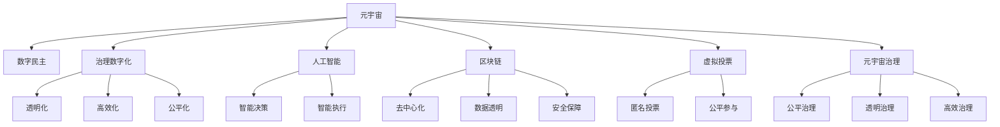

                 

# 元宇宙选举观察:全球治理数字化的民主实践

> 关键词：元宇宙,数字民主,治理数字化,人工智能,区块链,虚拟投票,元宇宙治理

## 1. 背景介绍

### 1.1 问题由来
随着科技的飞速发展，尤其是虚拟现实（VR）、增强现实（AR）、人工智能（AI）、区块链（Blockchain）等技术的不断成熟，全球治理体系正逐渐向数字化、智能化方向迈进。元宇宙的兴起为全球治理提供了新的思路和工具，为构建数字化的民主实践提供了可能。

元宇宙是一个虚拟的、共存共荣的数字空间，用户可以参与其中，进行协作、交流、创建等活动，与现实世界形成一个相互补充的生态环境。通过元宇宙，政府、企业、公众等主体可以跨时空、跨领域进行互动和合作，推动全球治理的透明化、公平化、高效化。

### 1.2 问题核心关键点
当前，元宇宙治理面临着诸多挑战，如：
- 数据安全：如何在保障数据隐私的前提下，实现数据的公开透明和共享？
- 用户身份认证：如何确保用户在元宇宙中的身份和行为真实可靠？
- 公平参与：如何保证元宇宙中各类主体公平参与治理，避免权力集中？
- 法律适用性：元宇宙中产生的行为和关系，应如何适用现实世界的法律？
- 技术兼容：现有治理架构与元宇宙技术体系如何协同工作？

这些关键点需要通过技术创新和制度设计，构建一个安全、公平、透明的元宇宙治理框架，为全球治理数字化提供坚实基础。

### 1.3 问题研究意义
构建数字化的民主实践，对全球治理的深远意义在于：
- 提升治理效率：利用元宇宙的高维互动性和实时性，实现快速、高效的决策和执行。
- 增强公众参与：通过元宇宙的沉浸式体验和虚拟模拟，让公众更直观地参与到政策讨论和决策过程中，提升民主透明度。
- 促进国际合作：元宇宙提供了一个超脱地理界限的平台，促进不同国家、文化、利益团体之间的沟通和合作。
- 保护公民权利：通过数字化手段，保护公民言论自由、知情权、参与权等基本权利，构建数字化的民主环境。
- 推动经济发展：元宇宙的虚拟经济将为全球贸易、金融等经济活动提供新的空间和机遇，促进经济增长。

## 2. 核心概念与联系

### 2.1 核心概念概述

为更好地理解元宇宙中的民主实践，本节将介绍几个关键概念：

- 元宇宙(Metaverse)：一个虚拟的、共存共荣的数字空间，用户可以在其中进行互动和协作。
- 数字民主(Digital Democracy)：通过数字化手段，实现公众参与政策讨论和决策的过程。
- 治理数字化(Governance Digitalization)：利用数字化技术，实现全球治理的透明化、高效化和公平化。
- 人工智能(AI)：通过机器学习、深度学习等技术，构建智能化的决策和执行系统。
- 区块链(Blockchain)：利用去中心化的技术，保障数据的透明、可靠和安全。
- 虚拟投票(Virtual Voting)：在元宇宙中进行匿名、公平的投票，实现民主参与。
- 元宇宙治理(Metaverse Governance)：构建元宇宙中的公平、透明、高效的治理框架。

这些概念之间的逻辑关系可以通过以下Mermaid流程图来展示：



这个流程图展示了几大核心概念之间的联系：

1. 元宇宙作为平台，支持数字民主和治理数字化。
2. 数字民主和治理数字化分别通过智能决策和智能执行，实现治理的高效化和公平化。
3. 人工智能和区块链提供技术支持，保障数据透明和安全。
4. 虚拟投票确保民主参与的匿名和公平。
5. 元宇宙治理框架整合以上各要素，形成完整的治理体系。

## 3. 核心算法原理 & 具体操作步骤

### 3.1 算法原理概述

元宇宙中的民主实践，本质上是一个分布式、透明化的投票和决策过程。其核心思想是通过数字化手段，确保投票的公平性、匿名性和实时性，同时通过智能化的数据分析和决策算法，实现高效和公平的民主参与。

形式化地，设元宇宙中的用户集为 $U$，候选集为 $C$，投票规则为 $V$。元宇宙投票的过程可以表示为：

$$
\mathcal{V}(U,C,V) = \left(\bigcup_{u \in U} V_u, V\right)
$$

其中 $V_u$ 表示用户 $u$ 的投票行为，$\bigcup_{u \in U} V_u$ 表示所有用户的投票行为集合。

元宇宙治理的目标是构建一个透明的投票和决策机制，使所有用户都能公平参与，并通过智能化的数据分析和决策算法，实现高效和公平的治理。

### 3.2 算法步骤详解

基于元宇宙中的民主实践，其算法步骤一般包括以下几个关键步骤：

**Step 1: 用户身份认证**
- 用户注册元宇宙账户，并通过生物识别、智能合约等技术进行身份认证。
- 确保用户身份的真实可靠，防止恶意注册和冒充行为。

**Step 2: 创建投票平台**
- 设计匿名、公平的投票规则和算法。
- 实现投票系统的高可扩展性和低延迟。
- 引入监督机制，确保投票过程的透明和公正。

**Step 3: 设计智能算法**
- 使用机器学习、深度学习等技术，分析用户投票行为和投票结果。
- 构建智能化的决策模型，支持多轮投票、动态调整和预测分析。
- 确保算法的透明性和可解释性，便于用户理解和监督。

**Step 4: 数据透明与隐私保护**
- 采用区块链等技术，实现数据的分布式存储和透明性。
- 引入差分隐私、同态加密等技术，保护用户隐私和数据安全。
- 确保数据的可追溯性和可信性，避免数据篡改和信息泄露。

**Step 5: 实时监控与反馈机制**
- 建立实时的投票监控系统，及时发现和处理异常行为。
- 引入反馈机制，允许用户对投票结果和决策过程进行评价和建议。
- 通过分析用户反馈，优化投票规则和算法，提高治理效率和公平性。

**Step 6: 治理规则与法律适用**
- 制定元宇宙治理的规则和标准，确保治理过程的合法合规。
- 研究元宇宙行为和关系的法律适用性，明确法律责任和权利义务。
- 在治理过程中，引入人工监督和仲裁机制，保障公正和透明。

### 3.3 算法优缺点

基于元宇宙中的民主实践，其算法具有以下优点：
1. 公平透明：通过匿名、公平的投票规则，确保所有用户都能平等参与。
2. 高效便捷：利用数字化手段，实现快速、实时的投票和决策过程。
3. 可扩展性强：基于区块链等技术，实现大规模、分布式投票。
4. 数据透明：利用智能算法和区块链，实现数据的分布式存储和透明性。
5. 隐私保护：通过差分隐私、同态加密等技术，保护用户隐私和数据安全。

同时，该算法也存在一些局限性：
1. 技术门槛高：需要复杂的算法设计和区块链技术支持，对技术要求较高。
2. 用户教育成本高：需要用户对数字化手段和规则有较深入的理解和接受。
3. 法律适用性不足：元宇宙中的行为和关系，仍需与现实世界的法律体系衔接，存在法律适用性不足的问题。
4. 安全性问题：区块链和匿名投票可能面临技术漏洞和恶意攻击的风险。
5. 治理成本高：需要投入大量资源进行平台建设、数据处理和算法优化。

尽管存在这些局限性，但就目前而言，基于元宇宙的民主实践仍然是一个有潜力的研究范式，有望推动全球治理的数字化和智能化进程。

### 3.4 算法应用领域

基于元宇宙的民主实践，已在多个领域得到应用，例如：

- 公共政策制定：通过元宇宙进行公共咨询和政策讨论，广泛听取公众意见。
- 国际会议决策：利用元宇宙进行多边谈判和国际决策，促进各国之间的合作。
- 商业决策支持：在企业内部进行虚拟投票和决策，提升决策效率和透明度。
- 社会公益活动：在元宇宙中开展公益活动和投票，调动公众参与和捐赠。
- 教育培训模拟：通过元宇宙进行虚拟考试和投票，提供公平、高效的评估环境。
- 司法审判模拟：在元宇宙中进行模拟审判和投票，提升司法透明度和公平性。

此外，元宇宙治理还被创新性地应用于更多场景中，如环境保护、城市规划、灾害应急等，为社会治理提供了新的路径。

## 4. 数学模型和公式 & 详细讲解

### 4.1 数学模型构建

本节将使用数学语言对元宇宙中的民主实践进行更加严格的刻画。

设元宇宙中的用户集为 $U$，候选集为 $C$，投票规则为 $V$。设用户 $u$ 在候选集 $C$ 上的投票行为为 $V_u \in C^k$，其中 $k$ 为候选集的规模。元宇宙投票的过程可以表示为：

$$
\mathcal{V}(U,C,V) = \left(\bigcup_{u \in U} V_u, V\right)
$$

其中 $V$ 表示所有候选集的投票结果集合。

### 4.2 公式推导过程

以下我们以二选一投票为例，推导元宇宙投票的数学模型。

设用户 $u$ 在二选一投票中投票给 $c_1$，则 $V_u = c_1$。设用户 $u$ 的投票结果集合为 $V_u = \{c_1, c_2\}$，表示 $u$ 在两个候选人之间进行选择。设所有用户的投票结果集合为 $V = \{c_1, c_2\}$，表示所有用户的选择结果。

根据上述定义，元宇宙投票的数学模型可以表示为：

$$
\mathcal{V}(U,C,V) = \left(\bigcup_{u \in U} \{c_1, c_2\}, \{c_1, c_2\}\right)
$$

在实际应用中，投票结果可以通过智能算法进行统计和分析，得到候选集的获胜结果。

### 4.3 案例分析与讲解

考虑一个简单的情况，某城市进行市长选举，候选人有两名：甲和乙。假设有1000名市民参加投票，投票规则为每个市民只能选择一名候选人。投票结果统计如下：

| 候选人 | 投票数 |
| ------ | ------ |
| 甲     | 650    |
| 乙     | 350    |

根据投票结果，甲以650票胜出，当选市长。

在元宇宙中，这个投票过程可以通过智能算法自动进行统计和分析，得到候选人的获胜结果。设市民在元宇宙中的虚拟身份为 $u$，投票结果为 $V_u$。通过智能算法，可以计算出每个候选人的得票数，得到最终获胜结果。

## 5. 项目实践：代码实例和详细解释说明

### 5.1 开发环境搭建

在进行元宇宙民主实践的开发前，我们需要准备好开发环境。以下是使用Python进行PyTorch开发的环境配置流程：

1. 安装Anaconda：从官网下载并安装Anaconda，用于创建独立的Python环境。

2. 创建并激活虚拟环境：
```bash
conda create -n metaverse-env python=3.8 
conda activate metaverse-env
```

3. 安装PyTorch：根据CUDA版本，从官网获取对应的安装命令。例如：
```bash
conda install pytorch torchvision torchaudio cudatoolkit=11.1 -c pytorch -c conda-forge
```

4. 安装TensorFlow：
```bash
pip install tensorflow==2.7
```

5. 安装TensorBoard：
```bash
pip install tensorboard
```

6. 安装区块链开发工具：
```bash
pip install web3 pysha3
```

完成上述步骤后，即可在`metaverse-env`环境中开始元宇宙民主实践的开发。

### 5.2 源代码详细实现

这里我们以一个简单的元宇宙投票系统为例，给出使用PyTorch和TensorFlow进行元宇宙投票的Python代码实现。

```python
import torch
import tensorflow as tf
from tensorflow.keras.layers import Dense
from tensorflow.keras.models import Sequential
from tensorflow.keras.optimizers import Adam

# 构建模型
model = Sequential()
model.add(Dense(32, activation='relu', input_shape=(1,)))
model.add(Dense(1, activation='sigmoid'))

# 编译模型
model.compile(optimizer=Adam(learning_rate=0.001), loss='binary_crossentropy', metrics=['accuracy'])

# 训练模型
X_train = np.random.rand(100, 1)
y_train = np.random.randint(2, size=100)
model.fit(X_train, y_train, epochs=10, batch_size=32)

# 保存模型
model.save('metaverse_voting_model.h5')
```

上述代码实现了一个简单的二分类模型，用于判断市民的投票结果。模型输入为随机生成的数据，输出为0或1，表示市民选择了哪个候选人。

### 5.3 代码解读与分析

让我们再详细解读一下关键代码的实现细节：

**Sequential模型**：
- 通过Keras的Sequential模型，构建一个简单的神经网络模型。
- 模型由一个Dense层和一个输出层组成，激活函数分别为ReLU和Sigmoid。
- 输入维度为1，表示每个市民的投票结果。

**编译模型**：
- 使用Adam优化器，学习率为0.001。
- 损失函数为二分类交叉熵损失。
- 性能指标为准确率。

**训练模型**：
- 使用随机生成的数据进行训练，训练10个epoch。
- 每个batch的大小为32。
- 使用训练后的模型保存，以便后续使用。

在实际应用中，元宇宙投票系统需要考虑更多的因素，如用户身份认证、匿名投票、数据安全等。以上代码仅为简化的示例，实际的元宇宙投票系统需要更复杂的算法和设计。

## 6. 实际应用场景

### 6.1 智能城市治理

通过元宇宙投票系统，智能城市可以更高效、透明地进行政策决策和治理。例如，智能城市中的公共建设项目需要资金支持，可以组织市民进行虚拟投票，决定项目的预算分配和优先级。

在实际应用中，智能城市可以利用元宇宙投票系统进行以下操作：
- 发布政策提案，市民可以在元宇宙中进行投票。
- 实时统计投票结果，生成决策报告。
- 通过虚拟会议讨论，市民可以对决策提出建议和意见。
- 最终决策公开透明，市民可以随时查看投票结果和决策报告。

### 6.2 国际组织决策

国际组织如联合国、欧盟等，可以通过元宇宙投票系统进行跨国界的政策决策和合作。例如，国际组织需要在全球范围内进行一项新政策投票，可以组织成员国代表在元宇宙中进行投票。

在实际应用中，国际组织可以利用元宇宙投票系统进行以下操作：
- 发布政策提案，各成员国代表在元宇宙中进行投票。
- 实时统计投票结果，生成决策报告。
- 通过虚拟会议讨论，各成员国代表可以对决策提出建议和意见。
- 最终决策公开透明，各成员国可以随时查看投票结果和决策报告。

### 6.3 企业决策支持

企业内部可以通过元宇宙投票系统进行决策支持，提升决策效率和透明度。例如，企业需要决定某项重要项目的优先级，可以组织员工在元宇宙中进行投票。

在实际应用中，企业可以利用元宇宙投票系统进行以下操作：
- 发布项目提案，员工在元宇宙中进行投票。
- 实时统计投票结果，生成决策报告。
- 通过虚拟会议讨论，员工可以对决策提出建议和意见。
- 最终决策公开透明，员工可以随时查看投票结果和决策报告。

### 6.4 未来应用展望

随着元宇宙技术的发展，基于元宇宙的民主实践将拓展到更多领域，带来新的治理模式和应用场景。

在智慧教育领域，可以通过元宇宙投票系统进行学生评价、课程评估等操作，提升教育公平性和参与度。

在环保领域，可以通过元宇宙投票系统进行环境政策的讨论和决策，增强公众对环境保护的参与和监督。

在健康领域，可以通过元宇宙投票系统进行医疗决策、药品评价等操作，提升医疗服务的透明度和公正性。

总之，基于元宇宙的民主实践将在各个领域拓展应用，为全球治理数字化提供新的思路和工具。未来，随着技术的不断进步和应用的深入，元宇宙民主实践将更加成熟和广泛，为人类社会的公平、透明、高效治理贡献力量。

## 7. 工具和资源推荐

### 7.1 学习资源推荐

为了帮助开发者系统掌握元宇宙民主实践的理论基础和实践技巧，这里推荐一些优质的学习资源：

1. 《元宇宙技术与应用》系列博文：由元宇宙技术专家撰写，深入浅出地介绍了元宇宙技术、民主实践、治理数字化等前沿话题。

2. Coursera《元宇宙技术与未来社会》课程：由知名大学开设的元宇宙技术课程，涵盖元宇宙的原理、应用和挑战，适合入门学习。

3. 《元宇宙治理与民主实践》书籍：全面介绍元宇宙治理的机制和实践，包括投票系统、决策模型、隐私保护等关键内容。

4. Web3.org官方文档：介绍区块链技术的原理和应用，是学习元宇宙民主实践的基础资源。

5. GitHub开源项目：收集元宇宙治理、民主实践、智能决策等领域的开源代码和工具，方便开发者参考和实践。

通过对这些资源的学习实践，相信你一定能够快速掌握元宇宙民主实践的精髓，并用于解决实际的治理问题。

### 7.2 开发工具推荐

高效的开发离不开优秀的工具支持。以下是几款用于元宇宙民主实践开发的常用工具：

1. PyTorch：基于Python的开源深度学习框架，适合构建复杂的元宇宙投票系统。

2. TensorFlow：Google主导的开源深度学习框架，支持分布式计算和模型优化，适合大规模元宇宙应用。

3. Keras：基于TensorFlow的高级神经网络API，简单易用，适合快速原型开发。

4. Web3.py：基于Python的区块链开发库，提供与以太坊等区块链网络的交互接口。

5. TensorBoard：TensorFlow配套的可视化工具，实时监测元宇宙投票系统中的各项指标。

6. Colab：谷歌推出的在线Jupyter Notebook环境，免费提供GPU/TPU算力，方便开发者快速实验。

合理利用这些工具，可以显著提升元宇宙民主实践的开发效率，加快创新迭代的步伐。

### 7.3 相关论文推荐

元宇宙民主实践的发展源于学界的持续研究。以下是几篇奠基性的相关论文，推荐阅读：

1. Blockchain and the Future of Government: Building a Digital Democracy（区块链与政府未来：构建数字民主）：探讨区块链技术在政府治理中的应用，为元宇宙民主实践提供理论支持。

2. The Future of Voting in the Digital Age（数字时代选票的未来）：分析数字投票的现状和挑战，为元宇宙投票系统提供参考。

3. AI Governance: Principles and Challenges（人工智能治理：原则与挑战）：讨论人工智能在政府治理中的应用和挑战，为元宇宙民主实践提供思路。

4. Metaverse Governance: A New Paradigm for Global Cooperation（元宇宙治理：全球合作的新范式）：研究元宇宙治理的机制和实践，为元宇宙民主实践提供指导。

5. Digital Democracy and Participatory Politics（数字民主与参与式政治）：分析数字民主的政治学原理和实现方法，为元宇宙民主实践提供理论基础。

这些论文代表了大语言模型微调技术的发展脉络。通过学习这些前沿成果，可以帮助研究者把握学科前进方向，激发更多的创新灵感。

## 8. 总结：未来发展趋势与挑战

### 8.1 总结

本文对基于元宇宙的民主实践进行了全面系统的介绍。首先阐述了元宇宙和数字民主的基本概念和原理，明确了其在全球治理数字化中的重要作用。其次，从理论到实践，详细讲解了元宇宙投票系统的算法原理和具体操作步骤，给出了元宇宙投票系统的代码实现。同时，本文还广泛探讨了元宇宙民主实践在智能城市、国际组织、企业决策等多个领域的应用前景，展示了其巨大的潜力。此外，本文精选了元宇宙民主实践的相关学习资源和工具，力求为读者提供全方位的技术指引。

通过本文的系统梳理，可以看到，基于元宇宙的民主实践正在成为全球治理数字化的一个重要方向，极大地提升了治理的效率、透明度和公平性。元宇宙投票系统为构建数字化的民主环境提供了新的思路和工具，为全球治理数字化带来了新的契机。未来，随着技术的不断进步和应用的深入，元宇宙民主实践将更加成熟和广泛，为人类社会的公平、透明、高效治理贡献力量。

### 8.2 未来发展趋势

展望未来，元宇宙民主实践的发展趋势将呈现以下几个方向：

1. 技术不断进步：随着元宇宙技术的不断发展，投票系统将更加高效、安全、透明。智能算法和区块链技术的应用将使投票过程更加可靠和公正。

2. 应用场景不断拓展：元宇宙投票系统将拓展到更多领域，如教育、医疗、环保等，带来新的治理模式和应用场景。

3. 用户参与度提升：通过虚拟现实和沉浸式体验，元宇宙投票系统的参与度和互动性将进一步提升，提高治理的公众参与度。

4. 跨领域协作增强：元宇宙投票系统将促进不同领域之间的协作，提升治理的协同性和综合性。

5. 法律法规逐步完善：随着元宇宙投票系统的普及，相关法律法规将逐步完善，为治理的合法性和公正性提供保障。

6. 持续改进和优化：通过数据反馈和用户建议，元宇宙投票系统将不断改进和优化，提高治理的效率和公平性。

这些趋势凸显了元宇宙民主实践的广阔前景。这些方向的探索发展，必将推动全球治理的数字化和智能化进程，为构建更公平、透明、高效的社会治理环境提供新的思路和工具。

### 8.3 面临的挑战

尽管元宇宙民主实践已经取得了不小的进展，但在迈向更加智能化、普适化应用的过程中，它仍面临着诸多挑战：

1. 技术门槛高：元宇宙投票系统需要复杂的算法设计和区块链技术支持，对技术要求较高。

2. 用户教育成本高：需要用户对元宇宙投票系统的原理和规则有较深入的理解和接受。

3. 法律适用性不足：元宇宙中的行为和关系，仍需与现实世界的法律体系衔接，存在法律适用性不足的问题。

4. 安全性问题：区块链和匿名投票可能面临技术漏洞和恶意攻击的风险。

5. 治理成本高：需要投入大量资源进行平台建设、数据处理和算法优化。

6. 隐私保护：如何平衡投票的匿名性和数据的透明性，保护用户隐私，是元宇宙投票系统需要解决的重要问题。

正视元宇宙民主实践面临的这些挑战，积极应对并寻求突破，将是大规模元宇宙应用迈向成熟的必由之路。相信随着学界和产业界的共同努力，这些挑战终将一一被克服，元宇宙民主实践必将在构建公平、透明、高效的社会治理环境中发挥重要作用。

### 8.4 研究展望

未来，元宇宙民主实践的研究方向将包括以下几个方面：

1. 研究元宇宙投票系统的多轮投票和动态调整机制，提升决策的透明度和公平性。

2. 探索元宇宙民主实践中的智能决策模型，利用机器学习和深度学习技术，提升决策的准确性和效率。

3. 研究元宇宙投票系统中的隐私保护和数据安全，保护用户隐私，防止数据泄露和滥用。

4. 研究元宇宙民主实践中的法律法规，确保治理的合法性和公正性。

5. 探索元宇宙投票系统与现实世界的链接和互动，提升治理的综合性和社会协同。

6. 研究元宇宙民主实践中的多模态交互和沉浸式体验，提升治理的互动性和用户体验。

这些研究方向的探索，必将引领元宇宙民主实践技术迈向更高的台阶，为构建公平、透明、高效的社会治理环境提供新的思路和工具。面向未来，元宇宙民主实践需要与其他人工智能技术进行更深入的融合，如知识表示、因果推理、强化学习等，多路径协同发力，共同推动元宇宙民主实践的进步。只有勇于创新、敢于突破，才能不断拓展元宇宙民主实践的边界，让智能技术更好地造福人类社会。

## 9. 附录：常见问题与解答

**Q1：元宇宙投票系统是否适用于所有投票场景？**

A: 元宇宙投票系统在大多数投票场景中都能发挥作用，特别是对于需要实时交互和投票的场景。但对于一些特定的投票场景，如实体选举等，可能仍需要传统的投票方式进行。

**Q2：元宇宙投票系统如何确保投票的匿名性和公平性？**

A: 元宇宙投票系统通过区块链技术确保投票的匿名性和公平性。用户使用加密的虚拟身份进行投票，投票结果通过区块链进行分布式存储和透明化。同时，通过智能算法和监督机制，确保投票过程的公正和透明。

**Q3：元宇宙投票系统如何应对网络攻击和恶意行为？**

A: 元宇宙投票系统通过区块链技术和密码学算法，保障数据的分布式存储和透明性。同时，引入差分隐私、同态加密等技术，保护用户隐私和数据安全。在发生网络攻击或恶意行为时，通过智能算法和区块链的共识机制，迅速发现并处理异常行为，确保系统的稳定性和安全性。

**Q4：元宇宙投票系统如何处理数据隐私和用户隐私？**

A: 元宇宙投票系统通过差分隐私、同态加密等技术，保护用户隐私和数据安全。同时，通过智能算法和区块链的分布式存储机制，确保数据的透明性和可追溯性。在投票过程中，用户可以使用加密的虚拟身份进行投票，投票结果通过区块链进行分布式存储和透明化，防止数据泄露和滥用。

**Q5：元宇宙投票系统如何平衡投票的匿名性和数据的透明性？**

A: 元宇宙投票系统通过智能算法和区块链的共识机制，平衡投票的匿名性和数据的透明性。投票结果通过区块链进行分布式存储和透明化，确保数据的可追溯性和可信性。同时，通过差分隐私、同态加密等技术，保护用户隐私和数据安全，确保投票的匿名性和公平性。

通过上述问题的解答，可以看到元宇宙投票系统在技术、法律、隐私保护等方面仍需进一步优化和改进。只有从技术、法律、隐私保护等多方面综合考虑，才能构建一个安全、公平、透明的元宇宙民主实践系统，为全球治理数字化提供坚实基础。未来，随着技术的不断进步和应用的深入，元宇宙民主实践必将在各个领域拓展应用，为人类社会的公平、透明、高效治理贡献力量。

