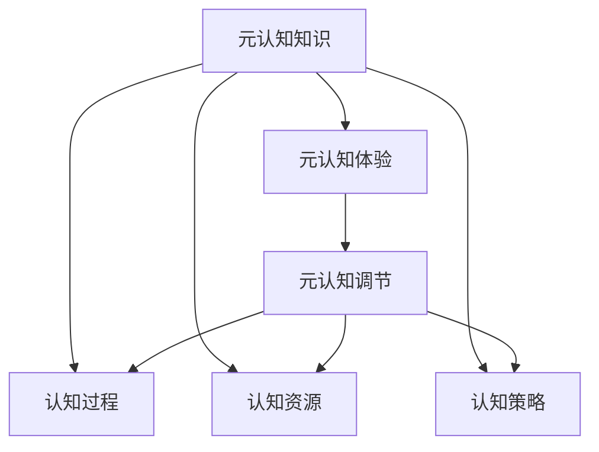

                 

# 元认知：提升学习效率的关键

## 1. 背景介绍

### 1.1 问题由来
在快速发展的现代信息技术时代，人工智能、机器学习等先进技术的应用越来越广泛。为了跟上技术发展的步伐，个人和组织需要不断学习和更新知识，以便更好地理解和应用这些技术。然而，在知识和技能快速更新的今天，如何高效地学习成为一大挑战。元认知（Metacognition）作为一种认知能力，能够帮助学习者了解自己的认知过程和知识状态，从而更有针对性地选择学习策略，提升学习效率。

### 1.2 问题核心关键点
元认知的核心在于反思和自我调节学习过程，通过自我监控、自我评估和自我调节，帮助学习者更好地管理学习过程，优化学习策略。在学习过程中，元认知能力强的学习者可以更有效地识别和解决学习障碍，提高学习效果，促进知识的内化。

### 1.3 问题研究意义
研究元认知对于提升学习效率具有重要意义：
1. **目标明确**：通过反思和自我评估，学习者能够明确学习目标，制定更有效的学习计划。
2. **策略优化**：元认知能力强的学习者能够灵活调整学习策略，提高学习效率。
3. **效果提升**：通过自我监控和调节，学习者能够及时发现并解决问题，提升学习成果。
4. **终身学习**：元认知能力能够帮助学习者不断自我更新，适应变化多端的学习环境。
5. **情感调节**：学习者在面临挑战时，元认知能力能帮助其保持积极心态，增强学习动力。

## 2. 核心概念与联系

### 2.1 核心概念概述
元认知是一个复杂的认知过程，包括三个主要组成部分：
1. **元认知知识**：关于自己的认知过程、认知资源和认知策略的知识。
2. **元认知体验**：在学习过程中产生的认知活动体验，如注意、记忆、理解等。
3. **元认知调节**：根据元认知体验和元认知知识，对认知过程进行调整，以实现更好的学习效果。

### 2.2 核心概念原理和架构的 Mermaid 流程图



这个流程图展示了元认知的三大组成部分及其相互关系：
1. **元认知知识**：基于对认知过程、资源和策略的了解，学习者能够选择最适合自己的学习方式。
2. **元认知体验**：在学习过程中，学习者通过反思和自我评估，获得对当前学习状态和效果的经验。
3. **元认知调节**：根据元认知体验和元认知知识，学习者动态调整学习策略，实现最佳学习效果。

## 3. 核心算法原理 & 具体操作步骤

### 3.1 算法原理概述

元认知学习策略的核心是自我监控和自我调节。学习者通过不断反思和评估自己的学习过程，及时发现问题并进行调整，以达到更好的学习效果。这种方法可以应用于各种学习情境，如在线学习、自主学习、协作学习等。

### 3.2 算法步骤详解

**Step 1: 确定学习目标**
- 明确学习目标，了解学习内容。
- 确定学习的优先级和重要性。
- 制定学习计划，安排学习时间。

**Step 2: 选择学习策略**
- 根据学习目标和自身情况，选择最合适的学习策略。
- 例如：利用视频学习、阅读书籍、参加研讨会等。
- 定期评估学习策略的有效性，及时调整。

**Step 3: 自我监控学习过程**
- 记录学习过程中的关键事件，如学习时间、学习方法、学习效果等。
- 使用工具和应用，如时间管理软件、笔记应用等，帮助记录和反思。

**Step 4: 自我评估学习效果**
- 定期进行自我评估，如通过小测验、完成作业等，评估学习成果。
- 分析评估结果，找出学习中的问题和不足。

**Step 5: 自我调节学习策略**
- 根据自我评估的结果，调整学习策略。
- 增加或减少某些学习活动的时间，改进学习方法。
- 保持积极心态，增强学习动力。

### 3.3 算法优缺点

元认知学习策略的优势在于其灵活性和个性化，能够根据个人学习特点和环境变化进行调整，从而提高学习效率。缺点则在于需要学习者具备一定的自我反思和调节能力，初始阶段可能需要较长的适应期。

### 3.4 算法应用领域

元认知学习策略可以广泛应用于各种学习场景：
1. **在线教育**：学生和教师可以通过元认知策略进行自我评估和调节，优化在线学习体验。
2. **自主学习**：学习者可以自主安排学习计划，通过反思和评估调整学习策略。
3. **团队学习**：团队成员可以通过共同反思和评估，提高团队协作和学习效率。
4. **企业培训**：员工可以通过自我监控和评估，提升培训效果和职业能力。

## 4. 数学模型和公式 & 详细讲解 & 举例说明

### 4.1 数学模型构建

元认知学习策略的数学模型可以通过学习曲线和评估指标来构建。以考试成绩为例，假设学习者从第$t$天开始学习，每天学习时间固定，学习效率和理解度随时间递增，则学习效果$E(t)$可以表示为：

$$
E(t) = \alpha t + \beta t^2 + \gamma
$$

其中，$\alpha$为每日学习效率，$\beta$为学习效率递减率，$\gamma$为初始理解度。

### 4.2 公式推导过程

根据学习曲线，我们可以推导出每日学习效率和理解度的变化规律：
- 学习效率$E(t)$随时间$t$的变化率为：$\frac{dE}{dt} = \alpha + 2\beta t$
- 理解度$U(t)$随时间$t$的变化率为：$\frac{dU}{dt} = \delta \cdot E(t)$，其中$\delta$为每日理解度增长率。

通过以上公式，我们可以计算出在任意时间点的学习效果和理解度，进而评估学习策略的有效性。

### 4.3 案例分析与讲解

假设一个学生每天学习3小时，学习效率$\alpha=0.5$，学习效率递减率$\beta=-0.1$，初始理解度$\gamma=50$。我们需要通过元认知策略调整学习策略，以获得更好的学习效果。

**初始阶段（第1-5天）**：
- 学习效果$E(t) = 0.5t - 0.1t^2 + 50$
- 理解度$U(t) = 0.05 \cdot (0.5t - 0.1t^2 + 50)$

**调整策略（第6-10天）**：
- 发现学习效果不佳，调整学习时间，增加每日学习时间至4小时。
- 学习效率$\alpha' = 0.6$，学习效率递减率$\beta' = -0.1$。
- 学习效果$E'(t) = 0.6t - 0.1t^2 + 50$
- 理解度$U'(t) = 0.06 \cdot (0.6t - 0.1t^2 + 50)$

通过调整学习策略，学生能够在第10天后的学习效果和理解度显著提升。

## 5. 项目实践：代码实例和详细解释说明

### 5.1 开发环境搭建

为了进行元认知学习策略的实践，我们需要搭建一个简单的学习管理系统（LMS），支持在线学习、自我评估和调整学习策略等功能。以下是一个基于Python和Flask框架的LMS开发环境搭建流程：

1. 安装Python和Flask。
2. 安装SQL数据库（如SQLite、MySQL等），用于存储学习记录和评估结果。
3. 安装Flask框架及相关扩展（如Flask-Login、Flask-WTF等），用于用户认证和管理。
4. 安装必要的学习资源，如视频教程、阅读材料等。

### 5.2 源代码详细实现

以下是一个简单的元认知学习管理系统，包括用户登录、学习记录、自我评估和策略调整等功能：

```python
from flask import Flask, render_template, redirect, request
from flask_sqlalchemy import SQLAlchemy

app = Flask(__name__)
app.config['SQLALCHEMY_DATABASE_URI'] = 'sqlite:///user_data.db'
db = SQLAlchemy(app)

class User(db.Model):
    id = db.Column(db.Integer, primary_key=True)
    username = db.Column(db.String(100), unique=True, nullable=False)
    password = db.Column(db.String(100), nullable=False)
    email = db.Column(db.String(100), unique=True, nullable=False)

@app.route('/')
def index():
    return render_template('index.html')

@app.route('/login', methods=['GET', 'POST'])
def login():
    if request.method == 'POST':
        username = request.form['username']
        password = request.form['password']
        user = User.query.filter_by(username=username, password=password).first()
        if user:
            return redirect('/')
        else:
            return render_template('login.html', error='Invalid username or password')
    else:
        return render_template('login.html')

@app.route('/study', methods=['GET', 'POST'])
def study():
    if request.method == 'POST':
        user_id = session['user_id']
        study_time = request.form['study_time']
        learning_strategy = request.form['learning_strategy']
        # 存储学习记录到数据库
        db.session.commit()
        return redirect('/')
    else:
        return render_template('study.html')

@app.route('/evaluate', methods=['GET', 'POST'])
def evaluate():
    if request.method == 'POST':
        user_id = session['user_id']
        score = request.form['score']
        # 存储评估结果到数据库
        db.session.commit()
        return redirect('/')
    else:
        return render_template('evaluate.html')

@app.route('/adjust', methods=['GET', 'POST'])
def adjust():
    if request.method == 'POST':
        user_id = session['user_id']
        new_strategy = request.form['new_strategy']
        # 更新学习策略
        db.session.commit()
        return redirect('/')
    else:
        return render_template('adjust.html')

if __name__ == '__main__':
    app.run(debug=True)
```

### 5.3 代码解读与分析

这个简单的LMS实现包括以下关键部分：
- **用户认证和管理**：使用SQL数据库存储用户信息，通过Flask-Login实现用户认证。
- **学习记录**：记录用户的学习时间、学习策略等，存储到SQL数据库中。
- **自我评估**：用户完成学习任务后，可以通过自我评估功能记录成绩，存储到数据库中。
- **策略调整**：根据自我评估结果，用户可以选择新的学习策略，存储到数据库中。

## 6. 实际应用场景

### 6.1 在线教育

在线教育平台可以通过元认知策略，帮助学生自我监控和评估学习过程，提升学习效率。例如，学生可以通过在线平台查看自己的学习记录和成绩，根据评估结果调整学习策略。

**实际应用**：
- **自我监控**：学生记录每日学习时间和内容，平台提供学习曲线图。
- **自我评估**：学生完成课程测试，平台提供详细的评估报告，指出优点和不足。
- **策略调整**：根据评估结果，学生可以选择新的学习策略，如增加视频学习时间，改善学习环境等。

### 6.2 自主学习

自主学习者可以利用元认知策略进行自我管理和调节，提高学习效果。例如，学习者可以使用时间管理应用记录学习时间和效率，通过自我评估和调整策略，逐步提升学习效率。

**实际应用**：
- **时间管理**：学习者使用时间管理工具记录每日学习时间，平台提供详细分析报告。
- **自我评估**：学习者完成学习任务后进行自我评估，平台提供评估报告和改进建议。
- **策略调整**：学习者根据评估结果，调整学习策略，如改变学习方法、优化学习环境等。

### 6.3 企业培训

企业可以通过元认知策略，帮助员工提升培训效果和职业能力。例如，员工可以利用平台进行自我评估和调整学习策略，提高培训效率和效果。

**实际应用**：
- **学习跟踪**：员工记录培训过程中的学习记录和成绩，平台提供详细的学习曲线图。
- **自我评估**：员工完成培训测试，平台提供详细的评估报告，指出优点和不足。
- **策略调整**：员工根据评估结果，选择新的学习策略，如增加学习时间、改进学习方法等。

### 6.4 未来应用展望

未来，元认知学习策略将广泛应用于各种学习场景，提升学习效率和效果。以下是一些未来的发展方向：
1. **个性化学习**：通过元认知策略，个性化推荐适合的学习内容和策略，提升学习效果。
2. **智能辅导**：结合人工智能技术，提供智能学习建议和指导，帮助学习者克服学习障碍。
3. **跨平台协作**：不同平台的学习数据无缝整合，支持多设备、多场景下的学习管理和评估。
4. **跨学科整合**：不同学科的学习数据整合，提供综合性学习报告和改进建议。
5. **终身学习**：建立终身学习档案，记录学习轨迹和评估结果，支持持续学习和自我更新。

## 7. 工具和资源推荐

### 7.1 学习资源推荐

为了帮助开发者系统掌握元认知学习策略的理论基础和实践技巧，这里推荐一些优质的学习资源：

1. **《元认知学习手册》**：详细介绍了元认知学习的基本概念、策略和方法，适合初学者学习。
2. **Coursera《元认知学习》课程**：由教育专家授课，涵盖元认知学习的理论和实践，适合深入学习。
3. **edX《元认知学习与评估》课程**：由心理学家和教育学家授课，深入浅出地介绍元认知学习策略。
4. **Wolfram Alpha**：提供元认知学习相关的数学模型和公式推导，适合进行理论研究和应用开发。
5. **Google Scholar**：查找元认知学习相关的论文和文献，了解最新研究进展。

### 7.2 开发工具推荐

为了更好地支持元认知学习策略的开发和应用，这里推荐一些常用的开发工具：

1. **Python**：Python语言简洁高效，广泛应用于数据科学、机器学习等领域，适合开发学习管理系统。
2. **Flask**：Flask框架轻量级、灵活，支持Web开发，适合搭建学习管理系统。
3. **SQLAlchemy**：SQLAlchemy是一个流行的SQL工具包，支持多种数据库操作，适合存储学习记录和评估结果。
4. **Jupyter Notebook**：支持多种编程语言和数据科学库，适合进行数据分析和模型开发。
5. **GitHub**：GitHub提供代码托管和协作功能，适合团队开发和项目管理。

### 7.3 相关论文推荐

元认知学习策略的研究源于心理学和教育学的长期积累。以下是几篇奠基性的相关论文，推荐阅读：

1. **《元认知知识：一种新的认知学习理论》**：探讨了元认知知识的定义和结构，为元认知学习提供了理论基础。
2. **《元认知学习策略对学生学业成绩的影响》**：通过实证研究，展示了元认知学习策略对学生学业成绩的显著影响。
3. **《基于元认知学习的个性化推荐系统》**：介绍了元认知学习策略在个性化推荐中的应用，展示了其对学习效率的提升。
4. **《智能学习系统中的元认知建模》**：讨论了智能学习系统如何利用元认知策略进行自我监控和评估，提升学习效果。
5. **《元认知学习与人工智能的融合》**：探讨了元认知学习与人工智能技术的结合，展示了其在教育和培训中的应用前景。

通过对这些资源的学习实践，相信你一定能够系统掌握元认知学习策略的理论基础和实践技巧，并将其应用于各种学习场景中。

## 8. 总结：未来发展趋势与挑战

### 8.1 总结

本文对元认知学习策略进行了全面系统的介绍。首先阐述了元认知学习策略的背景和意义，明确了元认知策略在提升学习效率方面的独特价值。其次，从原理到实践，详细讲解了元认知学习策略的数学模型和操作步骤，给出了具体的代码实现和运行结果展示。同时，本文还探讨了元认知学习策略在多个领域的应用前景，展示了其广泛的适用性和潜力。最后，本文精选了元认知学习策略的学习资源和开发工具，力求为读者提供全方位的技术指引。

通过本文的系统梳理，可以看到，元认知学习策略正在成为提升学习效率的重要手段，其跨领域的应用前景广阔。随着元认知学习策略的不断演进，相信能够更好地适应变化多端的学习环境，促进终身学习，提升教育质量，推动人类社会的持续发展。

### 8.2 未来发展趋势

展望未来，元认知学习策略将呈现以下几个发展趋势：
1. **个性化学习**：结合人工智能和大数据分析，提供个性化的学习建议和策略。
2. **智能辅导**：利用机器学习和自然语言处理技术，提供智能学习建议和指导。
3. **跨平台协作**：支持多设备、多场景下的学习管理和评估，提高学习效率。
4. **终身学习**：建立终身学习档案，记录学习轨迹和评估结果，支持持续学习和自我更新。
5. **多学科整合**：不同学科的学习数据整合，提供综合性学习报告和改进建议。

### 8.3 面临的挑战

尽管元认知学习策略已经取得了显著的成果，但在实践中仍面临一些挑战：
1. **数据隐私**：学习者的学习数据涉及个人隐私，如何保护数据隐私和安全性是一个重要问题。
2. **技术复杂性**：元认知学习策略的实现需要结合多种技术手段，包括数据分析、机器学习等，技术复杂性较高。
3. **用户接受度**：部分用户可能对使用元认知学习策略持怀疑态度，如何提升用户接受度是关键。
4. **跨学科融合**：元认知学习策略在不同学科的应用需要考虑学科特性和知识背景，融合难度较大。

### 8.4 研究展望

未来，元认知学习策略需要在以下方面进行深入研究：
1. **数据隐私保护**：研究如何在保护用户隐私的前提下，提供有效的元认知学习服务。
2. **技术自动化**：通过自动化和智能化手段，简化元认知学习策略的实现流程。
3. **用户接受度提升**：通过用户体验设计，提升用户对元认知学习策略的接受度和使用效果。
4. **跨学科融合**：结合不同学科的知识和技能，开发更加综合的元认知学习策略。

## 9. 附录：常见问题与解答

**Q1：元认知学习策略是否适用于所有学习场景？**

A: 元认知学习策略适用于多种学习场景，如在线教育、自主学习、企业培训等。然而，对于一些特定的学习任务，可能需要结合具体情境进行调整。

**Q2：如何选择合适的学习策略？**

A: 选择合适的学习策略需要考虑多种因素，如学习目标、学习风格、时间安排等。可以通过自我反思和评估，逐步找到最适合自己的学习策略。

**Q3：元认知学习策略是否需要持续调整？**

A: 是的，元认知学习策略需要根据学习者的实际情况和环境变化进行持续调整，以保持最佳学习效果。

**Q4：元认知学习策略能否与其他技术结合？**

A: 可以。元认知学习策略可以与其他技术手段结合，如人工智能、大数据分析等，提升学习效率和效果。

**Q5：元认知学习策略的实施需要多少资源？**

A: 元认知学习策略的实施需要一定的技术支持，如学习管理系统、数据分析工具等。不过，这些资源可以通过开源工具和在线服务获取，成本相对较低。

---

作者：禅与计算机程序设计艺术 / Zen and the Art of Computer Programming

