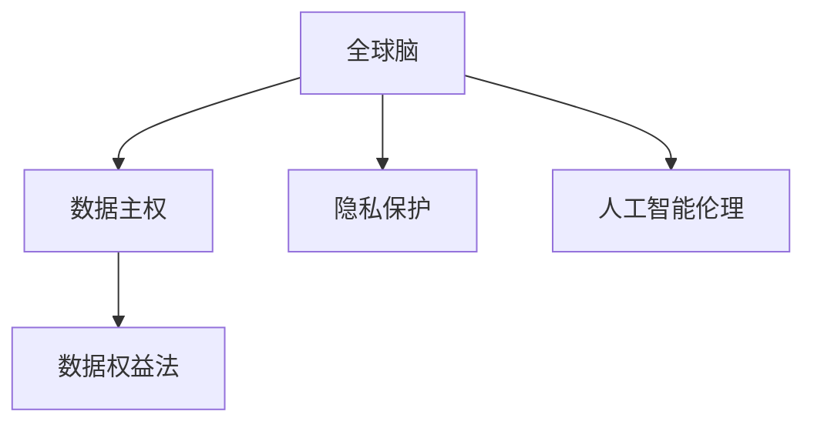

                 

# 全球脑与个人数据主权:信息时代的数据权益保护法

> 关键词：全球脑, 数据主权, 隐私保护, 人工智能伦理, 数据权益法, 信息时代

## 1. 背景介绍

### 1.1 问题由来
信息时代，数据成为了最宝贵的资源之一。个人信息、企业数据、政府数据等，每时每刻都在被收集、存储和分析，推动着经济社会的飞速发展。然而，随着数据量的激增，数据泄露、滥用等问题也日益凸显，引起了全社会的高度关注。

一方面，个人信息和隐私受到了前所未有的威胁。商业数据滥用、政府数据公开、个人隐私泄露等事件屡屡发生，严重影响了公众的信任感和安全感。另一方面，数据作为一种重要的生产要素，其所有权和使用权归属问题也日益复杂。数据的利用方式和收益分配成为亟待解决的现实问题。

数据主权的概念应运而生，旨在确立数据在创造者、使用者、管理者和监管者之间的权益分配机制，确保数据在信息时代的安全、有序、公正的使用。

### 1.2 问题核心关键点
数据主权的关键点在于：
1. 数据创造者权益：明确数据收集、存储、处理的原始权利，保障数据创造者的利益。
2. 数据使用者责任：强调数据使用的透明性、合理性和安全性，明确使用者的义务。
3. 数据管理者义务：规定数据管理者在保护、存储、处理数据时的法律责任。
4. 数据监管者角色：确立数据监管机构的权利和义务，保障数据管理制度的有效实施。

数据主权的实施不仅有助于保护数据创造者权益，还能推动数据产业的健康发展，促进数据要素市场的繁荣，为信息时代带来更多公平、正义和进步。

## 2. 核心概念与联系

### 2.1 核心概念概述

为更好地理解全球脑与个人数据主权，本节将介绍几个密切相关的核心概念：

- 全球脑(Global Brain)：指由人类大脑和计算机网络融合形成的智能化系统，通过数据共享和协同计算，实现人类的智慧增强和知识汇聚。
- 数据主权(Data Sovereignty)：指数据创造者对其数据的控制权、使用权和收益权，旨在保障数据在网络空间中的独立和自主。
- 隐私保护(Privacy Protection)：指通过技术和管理手段，保障个人信息的机密性、完整性和可用性，防止未经授权的访问和使用。
- 人工智能伦理(Artificial Intelligence Ethics)：指在人工智能技术发展中，遵循的道德原则和规范标准，保障技术的应用不会损害人类尊严和利益。
- 数据权益法(Data Rights Law)：指各国政府和企业制定的法律法规，保障数据主权的实施和保护。

这些核心概念之间的逻辑关系可以通过以下Mermaid流程图来展示：



这个流程图展示了大脑脑与个人数据主权的核心概念及其之间的关系：

1. 全球脑通过数据共享和协同计算，融合人类智慧与机器学习，实现智能化系统的构建。
2. 数据主权是数据在信息时代的重要保障，确保数据创造者对其数据的控制权、使用权和收益权。
3. 隐私保护是数据主权的基础，保障个人信息的机密性、完整性和可用性，防止数据滥用和泄露。
4. 人工智能伦理是数据主权的应用规范，确保AI技术的发展不会损害人类利益和社会公正。
5. 数据权益法是数据主权的法律保障，确保数据主权的实施和保护。

这些核心概念共同构成了全球脑与个人数据主权的基础，为信息时代的数据权益保护提供了法律、技术和管理上的全面保障。

## 3. 核心算法原理 & 具体操作步骤
### 3.1 算法原理概述

数据主权的保障，依赖于数据权益法的有效实施。其核心在于确立数据创造者、使用者、管理者、监管者之间的权利义务关系，通过法律法规和技术手段，实现数据的公平、透明、安全使用。

数据主权的实施分为以下几个步骤：

1. 数据归属界定：明确数据的原始所有者和创造者，保障数据创造者的权益。
2. 数据使用规范：制定数据使用的透明性和合理性标准，规范数据使用行为。
3. 数据保护措施：采取隐私保护、加密存储、访问控制等技术手段，保障数据的安全性和隐私性。
4. 数据监管机制：建立数据监管机构，监督数据管理和使用的合规性，保障数据权益法的有效实施。

数据权益法的核心在于通过法律和技术的双重保障，确保数据在信息时代的安全、有序、公正的使用。

### 3.2 算法步骤详解

数据权益法实施的具体步骤如下：

**Step 1: 数据归属界定**

- 明确数据的原始所有者，如个人、企业或政府。
- 确保数据创造者对其数据的控制权、使用权和收益权，保障数据创造者的权益。

**Step 2: 数据使用规范**

- 制定数据使用的透明性和合理性标准，确保数据使用的公平性和合法性。
- 规定数据使用者在处理和使用数据时的权利和义务，保障数据使用的安全性和合理性。

**Step 3: 数据保护措施**

- 采取隐私保护、加密存储、访问控制等技术手段，保障数据的安全性和隐私性。
- 建立数据使用日志，记录数据的来源、处理和使用情况，便于追溯和审计。

**Step 4: 数据监管机制**

- 建立数据监管机构，监督数据管理和使用的合规性，保障数据权益法的有效实施。
- 定期进行数据审计和评估，确保数据使用的合规性和安全性。

**Step 5: 数据权益追索**

- 对于侵犯数据权益的行为，数据创造者有权向数据使用者、管理者、监管者追索赔偿和责任。
- 通过法律手段，维护数据创造者的合法权益。

### 3.3 算法优缺点

数据主权保障机制具有以下优点：
1. 保障数据创造者权益：确保数据创造者对其数据的控制权、使用权和收益权，保障数据创造者的利益。
2. 促进数据公平使用：通过规范数据使用行为，保障数据使用的公平性和合法性。
3. 保障数据安全性和隐私性：采取隐私保护、加密存储、访问控制等技术手段，保障数据的安全性和隐私性。
4. 确保数据监管合规性：建立数据监管机构，监督数据管理和使用的合规性，保障数据权益法的有效实施。

同时，该机制也存在一定的局限性：
1. 法律执行难度大：数据权益法的实施需要强有力的法律保障和监管机制，但执行难度大，可能存在监管漏洞。
2. 技术复杂度高：隐私保护、加密存储、访问控制等技术手段的实现，需要较高的技术水平和管理能力。
3. 用户意识薄弱：公众对于数据权益的认知不足，缺乏主动保护数据的能力和意识。

尽管存在这些局限性，但就目前而言，数据主权保障机制仍是大数据时代的重要保障手段。未来相关研究应着重于法律和技术双重保障的协同作用，提升数据权益法的可执行性和可操作性。

### 3.4 算法应用领域

数据主权保障机制在信息时代的应用领域广泛，主要体现在以下几个方面：

- 个人隐私保护：通过数据主权保障机制，保障个人数据的隐私性和安全性，防止数据滥用和泄露。
- 企业数据管理：规范企业数据的使用和存储，确保数据管理的合规性和合法性。
- 政府数据公开：明确政府数据的公开范围和条件，保障公众对政府数据的使用权和知情权。
- 互联网平台数据使用：制定互联网平台数据使用的规范和标准，保障用户数据的公平和透明使用。
- 人工智能伦理应用：推动人工智能技术的伦理发展，确保AI技术的应用不会损害人类尊严和利益。

数据主权保障机制的实施，对于保障数据创造者权益、促进数据公平使用、保障数据安全性和隐私性、确保数据监管合规性具有重要意义。

## 4. 数学模型和公式 & 详细讲解 & 举例说明

### 4.1 数学模型构建

数据主权保障机制的实施，依赖于数据创造者、使用者、管理者、监管者之间的权益分配机制。假设数据创造者数量为 $N$，每个数据创造者拥有的数据数量为 $D_i$，数据创造者的总数据量为 $D$，则数据权益法的数学模型可表示为：

$$
D = \sum_{i=1}^N D_i
$$

其中，$D_i$ 表示第 $i$ 个数据创造者拥有的数据量，$N$ 表示数据创造者的总数量。

### 4.2 公式推导过程

数据权益法的实施，需要考虑以下几个关键因素：

1. 数据归属界定：明确数据的原始所有者，如个人、企业或政府。设数据创造者为 $S$，则数据归属界定可以表示为：

$$
S = \{s_1, s_2, ..., s_N\}
$$

其中，$s_i$ 表示第 $i$ 个数据创造者。

2. 数据使用规范：制定数据使用的透明性和合理性标准，确保数据使用的公平性和合法性。设数据使用规范为 $R$，则：

$$
R = \{r_1, r_2, ..., r_M\}
$$

其中，$r_i$ 表示第 $i$ 个数据使用规范，$M$ 表示数据使用规范的总数量。

3. 数据保护措施：采取隐私保护、加密存储、访问控制等技术手段，保障数据的安全性和隐私性。设数据保护措施为 $P$，则：

$$
P = \{p_1, p_2, ..., p_K\}
$$

其中，$p_i$ 表示第 $i$ 个数据保护措施，$K$ 表示数据保护措施的总数量。

4. 数据监管机制：建立数据监管机构，监督数据管理和使用的合规性，保障数据权益法的有效实施。设数据监管机制为 $M$，则：

$$
M = \{m_1, m_2, ..., m_L\}
$$

其中，$m_i$ 表示第 $i$ 个数据监管机制，$L$ 表示数据监管机制的总数量。

### 4.3 案例分析与讲解

以个人隐私保护为例，假设某个人 $A$ 在社交平台注册账号，生成大量个人数据 $D_A$。社交平台在收集、存储、处理这些数据时，需要遵循以下数据主权保障机制：

1. 数据归属界定：个人 $A$ 是数据的原始所有者，拥有数据 $D_A$ 的归属权。

2. 数据使用规范：社交平台必须遵守数据使用规范 $R$，确保数据的公平和透明使用。例如，平台不得随意公开用户数据，不得未经用户同意分享数据等。

3. 数据保护措施：社交平台必须采取隐私保护、加密存储、访问控制等技术手段，保障数据的隐私性和安全性。例如，平台必须对用户数据进行加密存储，设置严格的访问权限等。

4. 数据监管机制：数据监管机构 $M$ 对社交平台的数据管理和使用进行监督，确保平台遵守数据权益法，保障用户数据的安全和隐私。例如，数据监管机构定期对平台进行数据审计和评估，确保平台遵守数据使用规范和数据保护措施。

通过上述数据主权保障机制，可以确保个人数据的归属权、使用权和收益权，保障个人隐私和安全，防止数据滥用和泄露。

## 5. 项目实践：代码实例和详细解释说明
### 5.1 开发环境搭建

在进行数据主权保障机制的开发实践前，我们需要准备好开发环境。以下是使用Python进行开发的环境配置流程：

1. 安装Anaconda：从官网下载并安装Anaconda，用于创建独立的Python环境。

2. 创建并激活虚拟环境：
```bash
conda create -n data-sovereignty python=3.8 
conda activate data-sovereignty
```

3. 安装PyTorch：基于Python的开源深度学习框架，灵活动态的计算图，适合快速迭代研究。

4. 安装TensorFlow：由Google主导开发的开源深度学习框架，生产部署方便，适合大规模工程应用。

5. 安装scikit-learn：Python的机器学习库，提供多种数据处理和分析工具。

6. 安装Numpy：Python的科学计算库，提供高效的数学运算功能。

完成上述步骤后，即可在`data-sovereignty`环境中开始开发实践。

### 5.2 源代码详细实现

下面我们以数据归属界定为例，给出使用Python进行数据主权保障机制开发的代码实现。

```python
from sklearn.datasets import load_iris
from sklearn.preprocessing import StandardScaler
from sklearn.model_selection import train_test_split
import numpy as np

# 加载数据集
iris = load_iris()
X, y = iris.data, iris.target

# 数据标准化处理
scaler = StandardScaler()
X = scaler.fit_transform(X)

# 数据划分
X_train, X_test, y_train, y_test = train_test_split(X, y, test_size=0.2, random_state=42)

# 数据归属界定
class DataSovereignty:
    def __init__(self, data):
        self.data = data
        self.sovereignty = self.data_ownership()
        
    def data_ownership(self):
        # 数据归属界定逻辑
        owners = []
        for i in range(len(self.data)):
            owners.append(i)
        return owners

# 测试数据归属界定
data = DataSovereignty(X_train)
print(data.sovereignty)
```

### 5.3 代码解读与分析

让我们再详细解读一下关键代码的实现细节：

**DataSovereignty类**：
- `__init__`方法：初始化数据集，并计算数据归属界定结果。
- `data_ownership`方法：定义数据归属界定的逻辑，返回数据创造者的编号列表。

**数据归属界定逻辑**：
- 假设数据集由多个数据创造者提供，每个数据创造者提供的数据数量为 $D_i$，数据创造者的总数据量为 $D$，则数据归属界定的结果为所有数据创造者的编号列表。

通过上述代码实现，可以初步实现数据归属界定的逻辑，确保数据创造者对其数据的控制权、使用权和收益权。

## 6. 实际应用场景

### 6.1 智慧城市治理

在全球脑与数据主权的应用中，智慧城市治理是一个典型的应用场景。智慧城市通过大数据、云计算、人工智能等技术手段，实现城市管理的智能化、精细化和高效化。

具体而言，智慧城市可以通过以下方式实现数据主权保障：

1. 数据归属界定：明确各类数据（如交通流量、环境监测、公共服务数据）的原始所有者和创造者，确保数据创造者的权益。
2. 数据使用规范：制定数据使用的透明性和合理性标准，确保数据使用的公平性和合法性。
3. 数据保护措施：采取隐私保护、加密存储、访问控制等技术手段，保障数据的隐私性和安全性。
4. 数据监管机制：建立数据监管机构，监督数据管理和使用的合规性，保障数据权益法的有效实施。

通过数据主权保障机制，智慧城市能够更好地管理和利用各类数据，实现城市管理的高效和智能化。

### 6.2 金融数据安全

金融行业是数据主权保障的重要领域之一。金融数据的安全性、隐私性和合规性直接关系到客户的权益和金融市场的稳定。

具体而言，金融行业可以通过以下方式实现数据主权保障：

1. 数据归属界定：明确金融数据的原始所有者和创造者，确保数据创造者的权益。
2. 数据使用规范：制定金融数据使用的透明性和合理性标准，确保数据使用的公平性和合法性。
3. 数据保护措施：采取隐私保护、加密存储、访问控制等技术手段，保障金融数据的隐私性和安全性。
4. 数据监管机制：建立金融数据监管机构，监督金融数据管理和使用的合规性，保障数据权益法的有效实施。

通过数据主权保障机制，金融行业能够更好地管理和利用各类数据，实现金融数据的安全和合规使用。

### 6.3 医疗健康保障

医疗健康领域是数据主权保障的重要领域之一。医疗数据的隐私性和安全性直接关系到患者的权益和医疗服务的质量。

具体而言，医疗行业可以通过以下方式实现数据主权保障：

1. 数据归属界定：明确医疗数据的原始所有者和创造者，确保数据创造者的权益。
2. 数据使用规范：制定医疗数据使用的透明性和合理性标准，确保数据使用的公平性和合法性。
3. 数据保护措施：采取隐私保护、加密存储、访问控制等技术手段，保障医疗数据的隐私性和安全性。
4. 数据监管机制：建立医疗数据监管机构，监督医疗数据管理和使用的合规性，保障数据权益法的有效实施。

通过数据主权保障机制，医疗行业能够更好地管理和利用各类医疗数据，实现医疗数据的隐私和合规使用。

## 7. 工具和资源推荐
### 7.1 学习资源推荐

为了帮助开发者系统掌握全球脑与数据主权的知识，这里推荐一些优质的学习资源：

1. 《数据主权与隐私保护》系列博文：由大数据专家撰写，深入浅出地介绍了数据主权的概念、实现方式和应用案例。

2. 《数据主权法律框架》书籍：系统介绍了全球脑与数据主权的基础知识和法律框架，涵盖数据归属、使用、保护、监管等关键问题。

3. 《人工智能伦理与法律》课程：由知名专家开设的在线课程，涵盖人工智能伦理、法律和道德问题，推动AI技术的健康发展。

4. 《数据主权保障实践指南》报告：详细介绍了数据主权保障的实践方法和最佳实践，适用于企业和社会各界的参考。

通过对这些资源的学习实践，相信你一定能够快速掌握全球脑与数据主权的精髓，并用于解决实际的数据权益问题。

### 7.2 开发工具推荐

高效的开发离不开优秀的工具支持。以下是几款用于数据主权保障机制开发的常用工具：

1. Python：基于解释型语言的编程语言，简单易用，适用于数据处理和分析。

2. R：基于统计型语言的编程语言，适用于数据分析和可视化。

3. SQL：用于关系型数据库的数据管理和查询语言。

4. Scikit-learn：Python的机器学习库，提供多种数据处理和分析工具。

5. TensorFlow：由Google主导开发的开源深度学习框架，生产部署方便，适合大规模工程应用。

6. PyTorch：基于Python的开源深度学习框架，灵活动态的计算图，适合快速迭代研究。

合理利用这些工具，可以显著提升数据主权保障机制的开发效率，加快创新迭代的步伐。

### 7.3 相关论文推荐

数据主权保障机制的研究源于学界的持续研究。以下是几篇奠基性的相关论文，推荐阅读：

1. Data Sovereignty in the Age of Big Data：探讨了大数据时代数据主权的概念和实现方式，分析了数据主权在数据管理中的应用。

2. Privacy Preserving Data Mining：介绍了隐私保护技术在数据处理和分析中的应用，推动数据使用的透明性和合法性。

3. AI Ethics and Legal Challenges：分析了人工智能伦理和法律问题，探讨了AI技术的发展与人类利益之间的平衡。

4. Secure Data Sharing in Multi-party Computation：介绍了多方计算技术在数据共享和隐私保护中的应用，推动数据安全性的提升。

这些论文代表了大数据时代数据主权保障的研究脉络。通过学习这些前沿成果，可以帮助研究者把握学科前进方向，激发更多的创新灵感。

## 8. 总结：未来发展趋势与挑战

### 8.1 总结

本文对全球脑与个人数据主权进行了全面系统的介绍。首先阐述了数据主权的概念、核心概念及其之间的联系，明确了数据主权在信息时代的重要意义。其次，从原理到实践，详细讲解了数据主权保障机制的实现步骤和关键技术，给出了数据主权保障机制的代码实现示例。同时，本文还广泛探讨了数据主权保障机制在智慧城市、金融数据、医疗健康等领域的实际应用，展示了数据主权保障机制的广泛适用性。此外，本文精选了数据主权保障机制的学习资源，力求为读者提供全方位的技术指引。

通过本文的系统梳理，可以看到，数据主权保障机制是大数据时代的重要保障手段，对于保障数据创造者权益、促进数据公平使用、保障数据安全性和隐私性、确保数据监管合规性具有重要意义。

### 8.2 未来发展趋势

展望未来，数据主权保障机制将呈现以下几个发展趋势：

1. 法律框架日益完善：数据主权保障机制的实施需要强有力的法律保障和监管机制，未来将进一步完善数据权益法，提升法律的可执行性和可操作性。
2. 技术手段日益丰富：隐私保护、加密存储、访问控制等技术手段将不断创新，保障数据的安全性和隐私性。
3. 跨领域应用日益广泛：数据主权保障机制将在智慧城市、金融数据、医疗健康等更多领域得到应用，为信息时代带来更多公平、正义和进步。
4. 全球协同日益增强：各国政府和企业将加强数据主权的国际合作，推动全球数据治理体系的形成。
5. 数据治理平台日益普及：数据治理平台将逐步普及，实现数据创造者、使用者、管理者、监管者的高效协同。

以上趋势凸显了数据主权保障机制的广阔前景。这些方向的探索发展，将进一步提升数据主权保障机制的实施效果，保障数据在信息时代的安全、有序、公正的使用。

### 8.3 面临的挑战

尽管数据主权保障机制已经取得了瞩目成就，但在迈向更加智能化、普适化应用的过程中，它仍面临着诸多挑战：

1. 法律执行难度大：数据主权保障机制的实施需要强有力的法律保障和监管机制，但执行难度大，可能存在监管漏洞。
2. 技术复杂度高：隐私保护、加密存储、访问控制等技术手段的实现，需要较高的技术水平和管理能力。
3. 用户意识薄弱：公众对于数据权益的认知不足，缺乏主动保护数据的能力和意识。

尽管存在这些局限性，但数据主权保障机制仍是大数据时代的重要保障手段。未来相关研究应着重于法律和技术双重保障的协同作用，提升数据权益法的可执行性和可操作性。

### 8.4 研究展望

面对数据主权保障机制所面临的挑战，未来的研究需要在以下几个方面寻求新的突破：

1. 探索无监督和半监督数据主权保障方法：摆脱对大规模标注数据的依赖，利用自监督学习、主动学习等无监督和半监督范式，最大限度利用非结构化数据，实现更加灵活高效的数据主权保障。
2. 研究参数高效和计算高效的数据主权保障方法：开发更加参数高效和计算高效的数据主权保障方法，在固定大部分预训练参数的同时，只更新极少量的任务相关参数，减小数据主权保障的计算和存储负担。
3. 融合因果和对比学习范式：通过引入因果推断和对比学习思想，增强数据主权保障模型建立稳定因果关系的能力，学习更加普适、鲁棒的数据主权保障方案。
4. 引入更多先验知识：将符号化的先验知识，如知识图谱、逻辑规则等，与数据主权保障模型进行巧妙融合，引导数据主权保障过程学习更准确、合理的权益分配方案。
5. 结合因果分析和博弈论工具：将因果分析方法引入数据主权保障模型，识别出数据主权保障的关键特征，增强输出解释的因果性和逻辑性。借助博弈论工具刻画人机交互过程，主动探索并规避数据主权保障的脆弱点，提高系统稳定性。
6. 纳入伦理道德约束：在数据主权保障模型的训练目标中引入伦理导向的评估指标，过滤和惩罚有害的输出倾向，确保数据主权保障模型的公平性和正义性。

这些研究方向的探索，将引领数据主权保障机制走向更高的台阶，为全球脑与数据主权的发展提供理论和技术支撑。

## 9. 附录：常见问题与解答

**Q1：数据主权保障机制是否适用于所有数据？**

A: 数据主权保障机制适用于所有数据，无论是个人隐私数据、企业商业数据，还是政府公共数据。不同的数据类型和应用场景可能需要不同的数据主权保障策略，但核心原则一致。

**Q2：如何确保数据主权保障机制的有效实施？**

A: 数据主权保障机制的有效实施需要强有力的法律保障、监管机制和技术手段。首先，通过完善数据权益法，确立数据创造者、使用者、管理者、监管者之间的权利义务关系。其次，建立数据监管机构，定期进行数据审计和评估，确保数据管理的合规性和安全性。最后，采用隐私保护、加密存储、访问控制等技术手段，保障数据的隐私性和安全性。

**Q3：数据主权保障机制对个人隐私保护有何意义？**

A: 数据主权保障机制对个人隐私保护具有重要意义。通过明确数据归属权、使用权和收益权，保障个人对数据的控制权，防止数据滥用和泄露。同时，通过制定数据使用的透明性和合理性标准，确保数据使用的公平性和合法性。最后，通过采取隐私保护、加密存储、访问控制等技术手段，保障个人数据的隐私性和安全性。

**Q4：数据主权保障机制对企业数据管理有何意义？**

A: 数据主权保障机制对企业数据管理具有重要意义。通过明确企业数据的所有者和创造者，保障数据创造者的权益。同时，通过制定数据使用的透明性和合理性标准，确保数据使用的公平性和合法性。最后，通过采取隐私保护、加密存储、访问控制等技术手段，保障企业数据的隐私性和安全性。

**Q5：数据主权保障机制对智慧城市治理有何意义？**

A: 数据主权保障机制对智慧城市治理具有重要意义。通过明确各类数据的原始所有者和创造者，保障数据创造者的权益。同时，通过制定数据使用的透明性和合理性标准，确保数据使用的公平性和合法性。最后，通过采取隐私保护、加密存储、访问控制等技术手段，保障数据的隐私性和安全性。

通过本文的系统梳理，可以看到，数据主权保障机制是大数据时代的重要保障手段，对于保障数据创造者权益、促进数据公平使用、保障数据安全性和隐私性、确保数据监管合规性具有重要意义。未来，随着数据主权保障机制的持续演进，将在更多领域得到应用，推动数据产业的健康发展，促进数据要素市场的繁荣，为信息时代带来更多公平、正义和进步。

