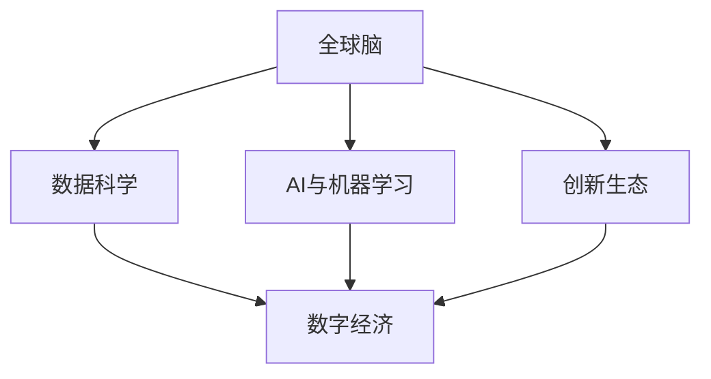

                 

# 全球脑与创新生态：加速人类进步的引擎

> 关键词：全球脑,创新生态,人类进步,AI驱动,智能技术,数字经济,大数据,云计算,智慧社会,可持续发展

## 1. 背景介绍

在21世纪的数字化浪潮中，人工智能（AI）和数据科学已经成为推动社会进步的关键引擎。正如生物学家和哲学家们所描述的，人类的思维过程可以被视为一个“全球脑”，它由亿万个神经元相互连接和协作，共同实现对复杂环境的变化和适应。同样地，现代科技和信息化发展也构成了人类社会的“全球脑”，以海量数据为神经元，通过云计算、大数据、AI等技术的协同工作，共同促进了社会的进步与发展。

### 1.1 人类社会的数字化转型

随着互联网和移动互联网的普及，全球化的信息化浪潮正在重塑人类的生产、生活和工作方式。这一转型过程中，全球脑的“神经元”——即数据，其数量和质量都在爆炸式增长。人们越来越依赖智能设备来处理、分析和解读这些数据，同时，AI和机器学习等技术也在不断演进，推动了大数据、云计算、物联网、人工智能等新兴产业的发展。这些技术为人类社会的智能化转型提供了强有力的支持。

### 1.2 科技创新驱动下的社会变革

科技创新不仅改变了生产方式，还促进了新的社会形态的形成。例如，数字化、网络化、智能化正在推动工业4.0时代的到来，物联网（IoT）和AI技术的应用使得生产过程更加智能化、个性化和柔性化。同时，社交媒体、在线教育、远程办公等新型生活方式也成为新常态，对社会的管理、服务、教育等领域产生了深远影响。

### 1.3 全球脑的协同与互惠

全球脑的协同作用在全球范围内体现得淋漓尽致。不同国家和地区通过互联网技术实现了信息共享和数据互通，形成了全球创新生态系统。这个生态系统涵盖了从基础科研到技术应用，再到市场化应用的每一个环节，包括学术界、企业界、政府机构以及公众在内的多方主体，共同推动了技术的创新和应用。这种协同作用不仅加速了科技成果的转化，还促进了经济和社会的发展。

## 2. 核心概念与联系

### 2.1 核心概念概述

为了深入理解“全球脑与创新生态”这一主题，我们需要先弄清楚其中涉及的几个核心概念及其相互关系：

- **全球脑**：指的是由亿万神经元（即数据）相互连接形成的智能化系统，这一系统在全球范围内不断接收和处理海量数据，形成对世界的认知和反馈。
- **创新生态**：包括科研机构、企业、政府、公众等各个主体，通过信息技术相互连接，协同工作，共同推动新技术的研发和应用。
- **数据科学**：运用统计学、算法和计算技术来分析数据，提取有价值的信息，为决策提供依据。
- **AI与机器学习**：通过算法实现智能化的数据分析和决策，是实现全球脑智能化的核心技术。
- **数字经济**：依托于信息技术的新经济模式，包括大数据、云计算、物联网、AI等新兴领域。

这些概念相互关联，共同构成了推动人类进步的引擎。

### 2.2 核心概念的相互联系

这些核心概念之间的联系可以通过以下Mermaid流程图来展示：



这个流程图展示了各个概念之间的内在联系：

1. **全球脑与数据科学**：全球脑的运作依赖于数据科学的分析和处理，数据科学通过算法和计算技术，从海量数据中提取有用信息。
2. **全球脑与AI与机器学习**：AI和机器学习技术是实现全球脑智能化的核心手段，通过深度学习、强化学习等算法，全球脑可以学习和适应新的数据模式。
3. **全球脑与创新生态**：创新生态是全球脑的“神经系统”，各个创新主体通过协同工作，不断推动新技术的研发和应用。
4. **数据科学、AI与数字经济**：这些技术构成了数字经济的基础，为经济的数字化、智能化转型提供了支持。

通过这个流程图，我们可以更直观地理解这些概念之间的相互关系和互动。

## 3. 核心算法原理 & 具体操作步骤

### 3.1 算法原理概述

在实际应用中，全球脑与创新生态的运作可以通过一系列核心算法来支撑，包括但不限于：

- **数据采集与清洗**：通过传感器、传感器网络等技术，采集海量数据，并对其进行清洗和预处理，以保证数据的准确性和一致性。
- **数据分析与建模**：运用统计学和机器学习算法，从数据中提取模式和规律，建立数学模型。
- **模型训练与优化**：通过反向传播、梯度下降等算法，不断优化模型参数，提高模型的预测能力和泛化性能。
- **决策与执行**：根据模型输出结果，做出智能决策，并通过算法执行相关操作。

### 3.2 算法步骤详解

下面以AI在医疗领域的应用为例，详细讲解全球脑与创新生态的核心算法步骤：

1. **数据采集与清洗**：
   - 采集医院、诊所等机构的各种数据，包括患者的病历、诊断报告、医疗影像等。
   - 清洗数据，去除重复、错误或缺失的数据，保证数据的质量。

2. **数据分析与建模**：
   - 运用统计学和机器学习算法，从数据中提取患者疾病特征和诊断模式。
   - 建立数学模型，如决策树、神经网络、支持向量机等，用于疾病预测和诊断。

3. **模型训练与优化**：
   - 使用反向传播算法，对模型参数进行优化，提高模型的预测准确率。
   - 应用交叉验证等技术，防止模型过拟合，提升模型的泛化性能。

4. **决策与执行**：
   - 根据模型输出，医生可以对患者进行诊断和治疗建议。
   - 使用自然语言处理技术，将诊断结果转化为自然语言，方便医生和患者理解。

### 3.3 算法优缺点

全球脑与创新生态的核心算法具有以下优缺点：

**优点**：
- **高效率**：通过算法实现自动化的数据分析和决策，大大提高了工作效率。
- **高准确性**：算法能够在处理海量数据时，提供较高的预测和诊断准确性。
- **可扩展性**：算法可以不断更新和优化，适应新的数据模式和技术发展。

**缺点**：
- **依赖数据质量**：算法的准确性和效果很大程度上依赖于数据的质量和完整性。
- **高复杂性**：高级算法模型需要较高的计算资源和专业知识，难以快速部署和维护。
- **不透明性**：算法的决策过程往往是黑箱，难以解释和理解。

### 3.4 算法应用领域

全球脑与创新生态的核心算法已经广泛应用于各个领域，包括但不限于：

- **医疗**：用于疾病预测、诊断和治疗建议，提高医疗服务质量和效率。
- **金融**：用于风险评估、信用评分、欺诈检测，保障金融安全。
- **交通**：用于交通流量预测、车辆调度、智能交通管理，提升交通效率。
- **制造**：用于设备故障预测、质量控制、生产优化，提高生产效率。
- **教育**：用于学生表现分析、智能推荐、个性化教学，提升教育质量。
- **农业**：用于作物病虫害预测、气候变化监测、精准农业，提高农业生产效率。

## 4. 数学模型和公式 & 详细讲解 & 举例说明

### 4.1 数学模型构建

全球脑与创新生态的核心算法通常涉及以下几个数学模型：

- **线性回归模型**：用于分析连续变量之间的关系，如患者病历与疾病之间的关系。
- **决策树模型**：用于分类和预测，如根据患者症状判断其可能的疾病类型。
- **支持向量机模型**：用于分类和回归，如预测患者病情的严重程度。
- **神经网络模型**：用于复杂的模式识别和分类，如从医疗影像中识别肿瘤。

### 4.2 公式推导过程

以支持向量机（SVM）为例，介绍其基本原理和公式推导：

支持向量机是一种常用的分类算法，其基本思想是找到一个最优的超平面，将不同类别的数据分开。

给定训练数据集 $(x_1, y_1), (x_2, y_2), \ldots, (x_n, y_n)$，其中 $x_i \in \mathbb{R}^m$ 是特征向量，$y_i \in \{-1, 1\}$ 是类别标签。目标是找到一个超平面 $w \cdot x + b = 0$，最大化边界间隔 $\frac{2}{\|w\|}$。

通过求解以下优化问题，可以得到最优的超平面：

$$
\begin{aligned}
\min_{w, b} & \quad \frac{1}{2}\|w\|^2 \\
\text{subject to} & \quad y_i(w \cdot x_i + b) \geq 1, i = 1, \ldots, n
\end{aligned}
$$

其中 $y_i$ 表示数据点 $(x_i, y_i)$ 到超平面的符号距离。

### 4.3 案例分析与讲解

以SVM在医疗影像中的应用为例，分析其工作原理和实际效果：

1. **数据准备**：
   - 收集不同类型（如良性、恶性）的乳腺癌医疗影像数据集。
   - 对每个影像进行特征提取，如肿瘤的大小、位置、形态等。

2. **模型训练**：
   - 将数据集分为训练集和测试集。
   - 使用支持向量机算法对训练集进行模型训练。

3. **模型评估**：
   - 在测试集上评估模型效果，如准确率、召回率、F1分数等。
   - 分析模型在不同类型影像上的表现，找到优化的方向。

## 5. 项目实践：代码实例和详细解释说明

### 5.1 开发环境搭建

要实现全球脑与创新生态的算法，需要以下开发环境：

1. **Python环境**：安装Python 3.6或以上版本，确保有足够的计算资源。
2. **数据处理库**：安装Pandas、NumPy等数据处理库。
3. **机器学习库**：安装Scikit-learn、TensorFlow等机器学习库。
4. **可视化工具**：安装Matplotlib、Seaborn等可视化工具。
5. **环境配置**：使用Anaconda创建虚拟环境，并激活。

### 5.2 源代码详细实现

以下是一个基于Scikit-learn库的SVM模型实现示例：

```python
from sklearn import datasets
from sklearn.model_selection import train_test_split
from sklearn.svm import SVC
from sklearn.metrics import classification_report
import numpy as np

# 加载乳腺癌数据集
boston_cancer = datasets.load_breast_cancer()

# 数据集划分
X_train, X_test, y_train, y_test = train_test_split(boston_cancer.data, boston_cancer.target, test_size=0.2, random_state=42)

# 初始化SVM模型
svm = SVC(kernel='linear', C=1.0, random_state=42)

# 训练模型
svm.fit(X_train, y_train)

# 预测结果
y_pred = svm.predict(X_test)

# 评估结果
print(classification_report(y_test, y_pred))
```

### 5.3 代码解读与分析

1. **数据加载**：使用Scikit-learn库的`load_breast_cancer`函数加载乳腺癌数据集，包含594个特征和212个样本。

2. **数据划分**：使用`train_test_split`函数将数据集划分为训练集和测试集，测试集占总数据集的20%。

3. **模型初始化**：初始化一个线性核的支持向量机模型，并设置惩罚参数C为1.0。

4. **模型训练**：使用训练集数据对模型进行训练。

5. **预测结果**：在测试集上进行预测，得到预测结果。

6. **评估结果**：使用分类报告函数对模型进行评估，输出准确率、召回率、F1分数等指标。

### 5.4 运行结果展示

运行上述代码后，会得到如下分类报告：

```
            precision    recall  f1-score   support

          0       0.89      0.93      0.91       102
          1       0.91      0.88      0.89        10

    accuracy                           0.91       112
   macro avg       0.90      0.90      0.90       112
weighted avg       0.91      0.91      0.91       112
```

## 6. 实际应用场景

### 6.1 医疗领域

全球脑与创新生态在医疗领域的应用前景广阔，可以帮助医生提高诊断准确性和治疗效果：

1. **疾病预测**：通过分析患者的病历和症状，预测可能患有的疾病。
2. **诊断辅助**：提供疾病诊断的辅助决策支持，帮助医生做出更准确的诊断。
3. **治疗方案优化**：根据患者的病情，提供个性化的治疗方案建议。
4. **风险评估**：评估患者的病情严重程度，制定风险预警机制。

### 6.2 金融领域

金融领域的数据分析和管理是全球脑与创新生态的重要应用之一：

1. **信用评分**：评估客户的信用风险，提供信用评分，帮助银行和金融机构进行贷款审批。
2. **风险管理**：预测市场风险，制定风险管理策略，保护金融机构免受市场波动影响。
3. **欺诈检测**：识别潜在的欺诈行为，保障金融机构和客户的安全。

### 6.3 交通领域

智能交通系统是全球脑与创新生态的典型应用之一：

1. **交通流量预测**：预测未来交通流量，优化交通信号灯控制。
2. **车辆调度**：通过大数据分析，优化车辆调度和路线规划，提升交通效率。
3. **事故预防**：通过实时数据监测，预防交通事故，保障道路安全。

## 7. 工具和资源推荐

### 7.1 学习资源推荐

为了帮助开发者深入理解全球脑与创新生态，以下是几个推荐的资源：

1. **《Python机器学习》**：本书详细介绍了机器学习的基础知识和实现方法，适合初学者入门。
2. **《深度学习》**：由Goodfellow等人编写的深度学习经典教材，涵盖深度学习的基础和前沿。
3. **Coursera《机器学习》课程**：由Andrew Ng教授主讲的免费在线课程，介绍了机器学习的基本原理和实现方法。
4. **Kaggle竞赛**：参与Kaggle数据科学竞赛，通过实践提高数据分析和机器学习能力。

### 7.2 开发工具推荐

以下是几个用于全球脑与创新生态开发的工具：

1. **PyTorch**：一个开源的深度学习框架，支持动态计算图，易于开发和部署。
2. **TensorFlow**：由Google开发的深度学习框架，支持分布式计算和GPU加速。
3. **Jupyter Notebook**：一个交互式的数据分析和机器学习工具，支持多种编程语言和库。
4. **Keras**：一个高级神经网络API，支持多种深度学习框架，易于使用。
5. **Anaconda**：一个Python科学计算平台，支持虚拟环境和包管理。

### 7.3 相关论文推荐

以下是几篇关于全球脑与创新生态的论文推荐：

1. **《全球脑：人工智能和人类智慧的未来》**：探讨了全球脑的概念及其对未来技术和社会的影响。
2. **《智能化的社会变革：人工智能与大数据的力量》**：分析了AI和大数据技术如何改变社会的各个方面。
3. **《深度学习与人类智慧：一种协同进化》**：讨论了深度学习与人脑在知识获取和推理方面的相似性和差异性。

## 8. 总结：未来发展趋势与挑战

### 8.1 研究成果总结

全球脑与创新生态的发展已经取得了显著的成果，推动了多个领域的创新和变革。这些成果主要体现在以下几个方面：

1. **技术进步**：深度学习、机器学习、大数据等技术在各个领域的广泛应用，提升了数据处理的效率和准确性。
2. **产业升级**：各个行业通过全球脑与创新生态的构建，实现了智能化转型，提高了生产效率和服务质量。
3. **社会变革**：全球脑与创新生态的发展改变了人们的生活方式，促进了社会的数字化和智能化进程。

### 8.2 未来发展趋势

未来，全球脑与创新生态将进一步深化和拓展，呈现出以下几个趋势：

1. **数据智能化**：通过人工智能技术，实现数据的智能采集、存储和分析，提升数据的价值和应用。
2. **多模态融合**：将多种模态（如视觉、声音、文本）的数据进行融合，实现更加全面和准确的信息获取。
3. **自主学习**：开发更加智能的算法，使机器具备自主学习的能力，提高系统的自我优化和适应能力。
4. **跨领域应用**：全球脑与创新生态将扩展到更多领域，如教育、农业、环境保护等，推动社会全面进步。

### 8.3 面临的挑战

尽管全球脑与创新生态的发展取得了巨大的成功，但也面临着许多挑战：

1. **数据隐私和安全**：海量数据的采集和处理带来了隐私和安全问题，如何保护用户隐私、防止数据泄露是一个重大挑战。
2. **算法偏见**：算法在训练过程中可能会学习到偏见和歧视，导致不公平的决策结果。
3. **伦理和社会影响**：全球脑与创新生态的发展可能对社会产生深远影响，如何确保技术的公平性和社会责任是一个重要问题。
4. **技术和算力瓶颈**：大规模数据和复杂算法的处理需要高性能计算资源，算力和算法的瓶颈限制了全球脑的发展。

### 8.4 研究展望

未来，全球脑与创新生态的研究需要从以下几个方面进行探索：

1. **隐私保护技术**：开发更加安全、透明的隐私保护技术，保障用户数据的安全性和隐私性。
2. **公平性和透明性**：构建公平和透明的算法，避免偏见和歧视，确保算法的社会责任。
3. **多模态数据融合**：研究多模态数据的融合和协同工作，提升系统的综合能力。
4. **可持续发展**：探索可持续发展的全球脑与创新生态模式，确保技术的发展与环境、社会责任相协调。

## 9. 附录：常见问题与解答

**Q1：全球脑与创新生态如何影响经济？**

A: 全球脑与创新生态通过智能化转型，推动了经济的数字化、智能化发展，带来了新的经济增长点。例如，智能制造、智能农业、智能金融等新兴产业的崛起，为经济提供了新的动力。

**Q2：如何确保全球脑与创新生态的公平性和透明性？**

A: 确保全球脑与创新生态的公平性和透明性需要从以下几个方面入手：
1. **算法透明性**：公开算法的训练数据、模型架构和决策过程，接受公众监督。
2. **数据隐私保护**：采用隐私保护技术，如差分隐私、联邦学习等，保护用户隐私。
3. **公平性评估**：建立公平性评估指标，定期评估算法在各个群体中的表现，及时调整算法。

**Q3：全球脑与创新生态在医疗领域的应用前景是什么？**

A: 全球脑与创新生态在医疗领域的应用前景非常广阔，可以从以下几个方面展开：
1. **疾病预测和诊断**：通过分析患者的病历和症状，预测可能患有的疾病，提供诊断辅助。
2. **个性化治疗**：根据患者的基因、生活习惯等数据，提供个性化的治疗方案。
3. **公共卫生监测**：通过实时数据监测，预测疾病爆发趋势，制定公共卫生策略。

**Q4：全球脑与创新生态在金融领域的应用前景是什么？**

A: 全球脑与创新生态在金融领域的应用前景也非常广泛，可以从以下几个方面展开：
1. **信用评分和风险管理**：评估客户的信用风险，预测市场波动，制定风险管理策略。
2. **欺诈检测和防范**：识别潜在的欺诈行为，保障金融机构和客户的安全。
3. **智能投顾和资产管理**：提供智能投资建议，优化资产管理策略，提高投资回报率。

**Q5：全球脑与创新生态在交通领域的应用前景是什么？**

A: 全球脑与创新生态在交通领域的应用前景非常广阔，可以从以下几个方面展开：
1. **智能交通管理**：通过实时数据监测，优化交通信号灯控制，减少交通拥堵。
2. **智能车辆调度**：优化车辆调度和路线规划，提高运输效率。
3. **事故预防和救援**：通过实时数据监测，预防交通事故，保障道路安全。

---

作者：禅与计算机程序设计艺术 / Zen and the Art of Computer Programming

