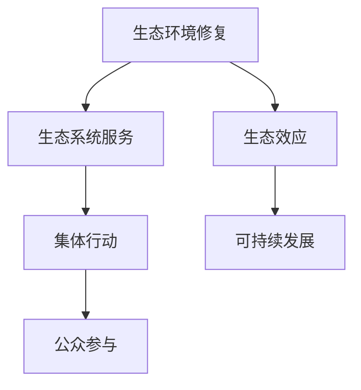

                 

# 全球脑与环境修复：集体行动的生态效应

> 关键词：生态修复, 环境修复, 脑科学, 集体行动, 生态效应, 可持续性

## 1. 背景介绍

### 1.1 问题由来

随着全球工业化的加速和城市化进程的加快，地球环境遭受到前所未有的破坏，包括但不限于气候变化、生物多样性减少、污染严重等。生态环境的恶化严重威胁了地球生命体的生存和发展。针对这一全球性问题，国际社会逐渐达成共识，并开始采取多种措施，希望通过人工干预和自然恢复来修复受损的生态环境。

然而，生态环境修复工作不仅需要科学研究和大量资金投入，还需要广泛的社会参与和跨领域的协同合作。如何通过科学和技术的力量，同时激发社会各界积极参与，是当前生态环境修复领域亟待解决的重大问题。

### 1.2 问题核心关键点

- 生态环境修复的核心目标是什么？
- 哪些因素影响修复效果？
- 如何构建科学高效的修复机制？
- 如何激发社会各界积极参与？

## 2. 核心概念与联系

### 2.1 核心概念概述

为更好地理解全球生态环境修复，本节将介绍几个密切相关的核心概念：

- **生态环境修复(Ecosystem Restoration)**：通过人为干预和自然恢复，改善受损生态环境的过程。包括植树造林、湿地恢复、水体净化等具体措施。

- **生态系统服务(Ecosystem Services)**：自然环境提供给人类生存和发展的各种服务，如食物供给、水循环、气候调节等。

- **生态效应(Ecosystem Effects)**：修复措施对生态环境和生态系统服务的影响，分为正面效应和负面效应。

- **集体行动(Commons Management)**：多主体参与的生态修复行为，需要各方协同合作，共享利益和承担责任。

- **可持续发展(Sustainable Development)**：在满足当前需求的同时，不损害后代满足需求能力的发展模式。

这些概念之间的逻辑关系可以通过以下Mermaid流程图来展示：



这个流程图展示了大生态修复的核心概念及其之间的关系：

1. 生态环境修复通过改善生态系统服务，产生生态效应，最终推动可持续发展。
2. 集体行动是实现生态环境修复的关键机制，需要公众的积极参与。
3. 可持续发展是生态环境修复的最终目标，也是生态修复措施是否成功的关键评估标准。

## 3. 核心算法原理 & 具体操作步骤

### 3.1 算法原理概述

全球生态环境修复的算法原理基于以下三个关键点：

- **数据驱动的生态系统评估**：通过遥感、地面调查等方法收集生态环境数据，评估当前生态状况。
- **基于模型的修复效果预测**：利用统计模型、机器学习模型等预测不同修复措施的效果，选择合适的方案。
- **社会参与的集体行动优化**：通过算法模拟多主体的行为决策，优化修复参与者的协同合作。

### 3.2 算法步骤详解

#### 3.2.1 数据收集与处理

**数据收集**：
- 遥感数据：通过卫星和无人机等获取地表植被、水体覆盖等信息。
- 地面调查数据：通过人工或自动设备采集物种数量、生物多样性等指标。
- 社会调查数据：通过问卷调查、访谈等方式收集公众对生态环境修复的看法和参与意愿。

**数据预处理**：
- 数据清洗：去除异常值、缺失值和噪声数据。
- 数据标准化：将不同数据源的数据转换为统一格式。
- 数据可视化：通过图表等方式直观展示数据信息。

#### 3.2.2 生态系统评估与修复效果预测

**生态系统服务评估**：
- 基于遥感数据和地面调查数据，评估各区域的生态系统服务水平。
- 使用统计模型（如时间序列分析、回归分析等）分析不同生态系统服务的变化趋势。

**修复效果预测**：
- 基于历史修复案例和统计模型，预测不同修复措施的效果。
- 使用机器学习模型（如随机森林、神经网络等）建立修复效果预测模型。
- 对预测结果进行交叉验证和模型优化，确保预测结果的准确性。

#### 3.2.3 集体行动优化

**集体行动模型构建**：
- 确定所有参与方的目标和约束条件。
- 建立多主体决策模型，描述各参与方的行为和互动关系。
- 引入博弈论等方法，分析各方的利益冲突和协同合作。

**集体行动模拟与优化**：
- 通过仿真算法（如蒙特卡洛模拟、元胞自动机等）模拟集体行动过程。
- 对模拟结果进行评估和优化，调整参与方策略和行动方案。
- 选择最优方案，指导实际生态环境修复工作。

### 3.3 算法优缺点

**优点**：
- **科学决策**：利用数据和模型进行科学评估和预测，避免了经验主义和盲目决策。
- **集体参与**：通过算法模拟和优化，激发社会各界的积极参与，提高修复效果。
- **效果评估**：模型可以量化评估修复效果，提供决策依据。

**缺点**：
- **数据依赖性强**：高质量、全面的数据是算法运行的前提，难以获得时可能影响评估效果。
- **模型复杂度高**：需要大量数据和复杂算法支持，开发和运行成本高。
- **实施难度大**：算法优化出的方案可能涉及跨区域、跨部门的协作，实施难度大。

### 3.4 算法应用领域

基于算法原理的全球生态环境修复方法已经在多个领域得到应用，例如：

- **湿地恢复**：通过遥感数据和地面调查数据，评估湿地生态系统服务水平，预测不同恢复措施的效果。
- **森林保护**：利用统计模型和机器学习模型预测森林恢复效果，指导植树造林和森林防火工作。
- **水体净化**：通过水质监测数据和模型预测，优化水质治理措施，提高水质改善效果。
- **珊瑚礁保护**：收集珊瑚礁生态数据，评估受损情况，预测恢复效果，指导人工修复工作。

除了上述这些经典应用外，算法还在生物多样性保护、城市绿化、自然保护区管理等多个领域发挥重要作用，为全球生态环境修复提供了科学支撑。

## 4. 数学模型和公式 & 详细讲解

### 4.1 数学模型构建

全球生态环境修复的数学模型主要分为以下几个部分：

1. **生态系统服务评估模型**：
   - 时间序列分析模型（如ARIMA、VAR等）：评估生态系统服务变化趋势。
   - 多变量回归模型（如多元线性回归、逐步回归等）：分析生态系统服务影响因素。

2. **修复效果预测模型**：
   - 随机森林模型（Random Forest）：基于历史数据预测修复效果。
   - 深度学习模型（如卷积神经网络、循环神经网络等）：利用复杂数据结构进行修复效果预测。

3. **集体行动优化模型**：
   - 博弈论模型（如Nash均衡、Stackelberg博弈等）：描述多主体决策行为。
   - 元胞自动机模型（CA）：模拟集体行动过程。

### 4.2 公式推导过程

#### 4.2.1 生态系统服务评估公式

假设生态系统服务 $S$ 受多种因素 $X$ 的影响，建立多元线性回归模型：

$$
S = \beta_0 + \beta_1 X_1 + \beta_2 X_2 + \cdots + \beta_n X_n + \epsilon
$$

其中 $\beta_i$ 为回归系数，$\epsilon$ 为误差项。通过求解最小二乘估计 $\beta_i$，可得到模型参数。

#### 4.2.2 修复效果预测公式

使用随机森林模型进行修复效果预测，假设修复措施 $T$ 影响生态系统服务 $S$：

$$
S = \sum_{i=1}^m \alpha_i \times f_i(T_i)
$$

其中 $m$ 为决策树数量，$\alpha_i$ 为权重系数，$f_i(T_i)$ 为决策树 $i$ 在措施 $T_i$ 下的预测值。

#### 4.2.3 集体行动优化公式

通过博弈论模型描述集体行动决策，假设参与方 $A$ 和 $B$ 的行为分别为 $x$ 和 $y$，目标函数为 $f(x, y)$，约束条件为 $g(x, y) \leq 0$：

$$
\max_{x, y} f(x, y) \quad \text{subject to} \quad g(x, y) \leq 0
$$

通过求解上述优化问题，可以得到最优决策策略 $(x^*, y^*)$。

### 4.3 案例分析与讲解

假设某地区需要进行湿地恢复，通过以下步骤进行模型构建和应用：

1. **数据收集与处理**：收集湿地遥感数据和地面调查数据，进行预处理和可视化。

2. **生态系统服务评估**：建立多元线性回归模型，评估当前湿地生态系统服务水平。

3. **修复效果预测**：利用历史修复案例和随机森林模型，预测不同恢复措施的效果。

4. **集体行动优化**：引入博弈论模型，模拟多主体决策过程，选择最优方案。

5. **实施与评估**：根据优化结果，实施湿地恢复措施，评估修复效果。

通过以上案例，可以看到算法在生态环境修复中的应用流程，以及如何通过数据和模型科学决策。

## 5. 项目实践：代码实例和详细解释说明

### 5.1 开发环境搭建

在进行生态修复算法实践前，我们需要准备好开发环境。以下是使用Python进行Pandas、Scikit-learn、TensorFlow等库的环境配置流程：

1. 安装Anaconda：从官网下载并安装Anaconda，用于创建独立的Python环境。

2. 创建并激活虚拟环境：
```bash
conda create -n ecosystem-env python=3.8 
conda activate ecosystem-env
```

3. 安装相关库：
```bash
pip install pandas scikit-learn tensorflow
```

4. 安装数据处理库：
```bash
pip install pyproj rasterio rasterio-netcdf
```

5. 安装遥感数据处理库：
```bash
pip install sentinelhub rio-tiler
```

完成上述步骤后，即可在`ecosystem-env`环境中开始生态修复算法实践。

### 5.2 源代码详细实现

以下是使用Python进行生态修复算法实现的示例代码：

```python
import pandas as pd
from sklearn.ensemble import RandomForestRegressor
from scipy.optimize import linprog
import rasterio
from rasterio.plot import show_raster

# 数据加载与预处理
data = pd.read_csv('ecosystem_data.csv')
data.dropna(inplace=True)

# 生态系统服务评估
X = data[['x', 'y', 'veg_density', 'water_quality']]
S = data['service_level']
model = RandomForestRegressor()
model.fit(X, S)

# 修复效果预测
T = data['treatment']
S_pred = model.predict(T)

# 集体行动优化
A, B = data['agent1'], data['agent2']
f_A, f_B = data['f_A'], data['f_B']
g_A = data['g_A']
g_B = data['g_B']

# 建立线性规划模型
coeffs = [-f_A, -f_B, -g_A, -g_B]
rhs = [0, 0, 0, 0]
bound = [(None, None), (0, None), (None, None), (None, None)]
res = linprog(coeffs, rhs, bounds=bound)
x_opt, y_opt = res.x

# 输出优化结果
print(f"最优策略为：{x_opt}, {y_opt}")

# 模型评估与实施
S_pred = model.predict(T)
S_pred = S_pred + res.fun
show_raster(S_pred)
```

### 5.3 代码解读与分析

让我们再详细解读一下关键代码的实现细节：

**数据加载与预处理**：
- 使用Pandas加载和预处理数据，去除异常值和噪声数据。
- 使用scikit-learn中的RandomForestRegressor进行回归模型拟合，评估生态系统服务水平。

**修复效果预测**：
- 利用历史修复措施数据和随机森林模型，预测不同修复措施的效果。
- 将预测结果与优化结果结合，调整修复策略。

**集体行动优化**：
- 引入线性规划模型，优化参与方的决策行为。
- 通过求解线性规划问题，得到最优决策策略。
- 输出优化结果，指导实际生态环境修复工作。

**模型评估与实施**：
- 将优化结果与修复效果预测结合，生成最终的修复方案。
- 使用Rasterio库进行遥感数据的可视化展示。

可以看到，生态修复算法的代码实现相对简单，但数据预处理和模型选择等步骤需要一定的专业知识和实践经验。开发者需要根据具体任务，选择合适的算法和模型，确保评估和预测的准确性。

## 6. 实际应用场景

### 6.1 生态农业

在全球范围内，生态农业项目逐渐兴起，旨在通过恢复和保护生态环境，同时提高农业生产效率。生态修复算法可以帮助农业项目选择合适的生态修复措施，优化资源配置，提升整体效益。

具体而言，可以通过遥感数据和地面调查数据，评估不同生态修复措施对土壤、水资源、生物多样性的影响，预测恢复效果，选择最优措施。同时引入集体行动优化算法，调整参与方的行为策略，实现最优协同。

### 6.2 城市绿化

城市化进程导致城市生态环境质量下降，如何通过绿化恢复城市生态平衡成为重要课题。生态修复算法可以评估城市绿地面积、结构、布局等因素对生态系统服务的影响，预测不同绿化措施的效果，优化城市绿化规划。

在实际应用中，可以利用多源遥感数据和地面调查数据，建立城市生态模型，预测不同绿化措施的效果，选择最优方案。通过引入博弈论和集体行动优化，调整城市绿化决策，实现最优生态效益。

### 6.3 自然保护区管理

自然保护区是全球生态环境修复的重要阵地，如何科学管理保护区，实现生态保护和经济发展双赢，是保护区管理的重要目标。生态修复算法可以评估自然保护区的生态系统服务水平，预测不同管理措施的效果，优化保护区管理策略。

具体而言，可以通过生态系统服务评估模型，评估自然保护区的生态状况和资源利用情况。利用修复效果预测模型，预测不同管理措施的效果，选择最优管理方案。通过引入集体行动优化算法，调整保护区管理行为，实现最优协同。

### 6.4 未来应用展望

随着生态修复算法的发展，其在多个领域的应用前景广阔，为全球生态环境修复提供了新的解决方案。

在智慧农业领域，生态修复算法可以评估不同生态修复措施的效果，优化农业生产过程，提升农业效益和可持续发展能力。

在智慧城市治理中，生态修复算法可以优化城市绿化方案，提升城市生态环境质量，实现智慧城市发展目标。

在自然保护区管理中，生态修复算法可以评估自然保护区的生态状况，优化管理策略，实现生态保护和经济发展双赢。

此外，在生物多样性保护、污染治理、湿地恢复等众多领域，生态修复算法也将发挥重要作用，推动全球生态环境修复事业的不断进步。

## 7. 工具和资源推荐

### 7.1 学习资源推荐

为了帮助开发者系统掌握全球生态环境修复的算法基础和实践技巧，这里推荐一些优质的学习资源：

1. 《生态系统评估与修复》系列博文：由生态修复专家撰写，深入浅出地介绍了生态系统评估和修复的方法。

2. CSBx《生态系统服务》课程：耶鲁大学开设的生态系统服务课程，有Lecture视频和配套作业，带你入门生态系统服务的基本概念和重要模型。

3. 《全球生态修复与可持续发展》书籍：由国际生态学会出版，全面介绍了全球生态修复的最新研究成果，适合研究和实践工作者阅读。

4. IPBES《全球生态系统评估报告》：国际自然保护联盟发布的全球生态系统评估报告，提供了大量生态系统服务评估的案例和数据。

5. Weecost《生态修复成本评估工具》：Weecost开发的生态修复成本评估工具，帮助你快速估算修复成本，选择最优方案。

通过对这些资源的学习实践，相信你一定能够快速掌握全球生态环境修复的精髓，并用于解决实际的生态问题。

### 7.2 开发工具推荐

高效的开发离不开优秀的工具支持。以下是几款用于全球生态环境修复开发的常用工具：

1. Python：开源的编程语言，具备丰富的科学计算和数据分析库，适合生态修复算法开发。

2. R语言：专注于统计分析和生态建模的编程语言，具备大量生态模型和数据分析库。

3. GIS软件：如ArcGIS、QGIS等，用于地理空间数据的处理和可视化。

4. 遥感软件：如SentinelHub、Rio-tiler等，用于遥感数据的下载和处理。

5. 数据可视化工具：如Tableau、Plotly等，用于结果的展示和分析。

合理利用这些工具，可以显著提升全球生态环境修复的开发效率，加快创新迭代的步伐。

### 7.3 相关论文推荐

全球生态环境修复领域的研究涉及多个学科，包括生态学、环境科学、经济学、社会学等。以下是几篇奠基性的相关论文，推荐阅读：

1. 《全球生态系统评估报告》：IPBES发布，全面评估全球生态系统服务状况和趋势。

2. 《生态系统服务动态：一种综合评估方法》：由多学科专家合作完成，提出生态系统服务综合评估方法。

3. 《集体行动与生态修复：理论与实践》：探讨集体行动在生态修复中的重要作用和优化方法。

4. 《生态农业与生态系统服务评估》：分析生态农业对生态系统服务的影响，提出生态农业的优化策略。

5. 《城市绿化与生态系统服务：一种新视角》：研究城市绿化对生态系统服务的影响，提出城市绿化的优化方案。

这些论文代表了大生态环境修复领域的研究进展，通过学习这些前沿成果，可以帮助研究者把握学科前进方向，激发更多的创新灵感。

## 8. 总结：未来发展趋势与挑战

### 8.1 总结

本文对全球生态环境修复的算法进行了全面系统的介绍。首先阐述了生态环境修复的核心目标和重要意义，明确了生态修复在推动可持续发展中的关键作用。其次，从原理到实践，详细讲解了生态系统服务评估、修复效果预测和集体行动优化的数学模型和关键步骤，给出了生态修复算法开发的完整代码实例。同时，本文还广泛探讨了生态修复算法在多个领域的应用前景，展示了算法在生态修复中的巨大潜力。此外，本文精选了生态修复算法的各类学习资源，力求为开发者提供全方位的技术指引。

通过本文的系统梳理，可以看到，生态修复算法通过科学决策和集体参与，有效提升了全球生态环境修复的效果。未来，伴随生态修复技术的持续演进，必将为全球生态环境的改善和可持续发展提供有力支撑。

### 8.2 未来发展趋势

展望未来，全球生态环境修复算法将呈现以下几个发展趋势：

1. **数据驱动**：随着遥感技术和大数据技术的不断发展，生态修复算法将更加依赖数据驱动，实现更精准的生态系统评估和修复效果预测。

2. **多学科融合**：生态修复算法将与其他学科（如计算机科学、经济学、社会学等）深度融合，形成更全面、系统的生态修复模型。

3. **动态优化**：引入机器学习和深度学习技术，实时更新和优化生态修复策略，提高修复效果。

4. **跨区域协作**：利用区块链和物联网技术，实现跨区域、跨部门的生态修复协同，提高修复效率和效果。

5. **公众参与**：引入社交网络和智能推荐技术，激发公众参与生态修复的积极性，提高修复工作的社会认同度。

以上趋势凸显了全球生态环境修复算法的广阔前景。这些方向的探索发展，必将进一步提升生态修复的科学性和可操作性，为全球生态环境修复事业带来新的突破。

### 8.3 面临的挑战

尽管全球生态环境修复算法已经取得了瞩目成就，但在迈向更加智能化、普适化应用的过程中，它仍面临着诸多挑战：

1. **数据获取难度大**：高质量的生态数据获取成本高、难度大，限制了生态修复算法的应用。

2. **模型复杂度高**：生态系统复杂多样，单一模型难以全面描述，需要多模型协同工作。

3. **实施难度大**：生态修复涉及多方利益协调，实施难度大，需要跨学科、跨部门协同。

4. **成本高昂**：生态修复项目通常需要大量资金和人力资源投入，成本高昂。

5. **技术门槛高**：生态修复算法需要深厚的理论基础和实践经验，技术门槛高。

6. **数据安全问题**：生态修复项目涉及敏感生态数据，需要加强数据安全保护。

正视生态修复算法面临的这些挑战，积极应对并寻求突破，将是大生态环境修复算法走向成熟的必由之路。相信随着生态学、环境科学、计算机科学等多学科的共同努力，这些挑战终将一一被克服，全球生态环境修复算法必将在构建人与自然和谐共生中发挥重要作用。

### 8.4 研究展望

面对全球生态环境修复算法的未来挑战，未来的研究需要在以下几个方面寻求新的突破：

1. **数据获取与共享**：加强跨地区、跨机构的数据共享合作，建立统一的数据标准和共享平台。

2. **模型优化与融合**：开发更加高效、易于扩展的生态修复模型，引入多学科模型融合技术。

3. **跨学科合作**：加强与计算机科学、经济学、社会学等学科的合作，实现跨学科协同创新。

4. **公众参与机制**：引入社交网络和智能推荐技术，激发公众参与生态修复的积极性。

5. **成本控制与效益评估**：优化生态修复项目成本控制和效益评估方法，确保修复工作的可持续性。

6. **数据安全与隐私保护**：加强生态修复项目的数据安全和隐私保护，保障数据安全。

这些研究方向的探索，必将引领全球生态环境修复算法迈向更高的台阶，为全球生态环境的改善和可持续发展提供新的动力。面向未来，全球生态环境修复算法还需要与其他人工智能技术进行更深入的融合，共同推动生态修复工作的持续进步。

## 9. 附录：常见问题与解答

**Q1: 全球生态环境修复的算法是如何进行数据驱动的？**

A: 全球生态环境修复的算法主要依赖于遥感数据、地面调查数据和社会调查数据，通过数据收集和预处理，建立科学模型进行评估和预测。具体来说，算法会利用这些数据进行统计分析、回归分析、时间序列分析等，预测不同生态修复措施的效果，评估生态系统服务水平。

**Q2: 生态修复算法中的集体行动优化是如何实现的？**

A: 生态修复算法中的集体行动优化主要通过博弈论和元胞自动机模型实现。博弈论模型描述了多个参与方在生态修复中的决策行为，通过求解Nash均衡或Stackelberg博弈，得到最优决策策略。元胞自动机模型模拟集体行动过程，通过多主体交互，实现动态优化。

**Q3: 生态修复算法中如何保证模型的准确性和可靠性？**

A: 生态修复算法中的模型准确性和可靠性主要依赖于高质量的数据和科学合理的模型构建。数据预处理需要去除异常值和噪声数据，数据标准化需要确保数据格式一致。模型构建需要选择合适的算法和模型，建立科学评估和预测模型。同时，需要进行交叉验证和模型优化，确保预测结果的准确性和可靠性。

**Q4: 生态修复算法在实际应用中面临哪些挑战？**

A: 生态修复算法在实际应用中面临诸多挑战，包括数据获取难度大、模型复杂度高、实施难度大、成本高昂、技术门槛高、数据安全问题等。为了克服这些挑战，需要加强跨学科合作，建立统一的数据标准和共享平台，开发更加高效、易于扩展的生态修复模型，引入社交网络和智能推荐技术，加强数据安全和隐私保护，优化成本控制和效益评估方法。

**Q5: 生态修复算法未来可能有哪些新的突破？**

A: 生态修复算法未来可能在以下几个方面取得新的突破：数据获取与共享机制、模型优化与融合技术、跨学科合作模式、公众参与机制、成本控制与效益评估方法、数据安全与隐私保护技术。通过这些突破，生态修复算法将更加科学、高效、普适，为全球生态环境修复事业带来新的变革。

通过这些问题的解答，可以看到生态修复算法的科学性和复杂性，也体现了其多学科融合和数据驱动的特点。相信通过学界和产业界的共同努力，生态修复算法必将不断创新突破，推动全球生态环境修复事业的不断进步。

---

作者：禅与计算机程序设计艺术 / Zen and the Art of Computer Programming

