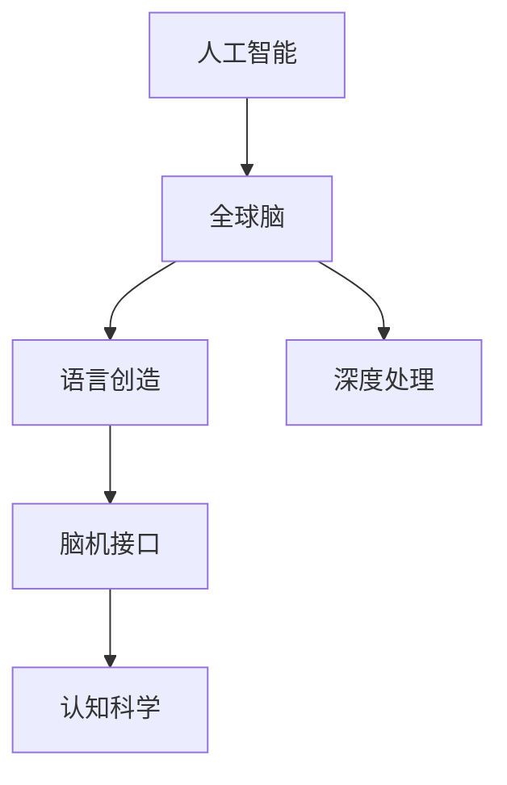

                 

# 全球脑与语言创造:人类沟通方式的革命性变革

> 关键词：人工智能,全球脑,语言创造,沟通方式,认知科学,神经科学,机器学习,脑机接口,自然语言处理,深度学习,生成对抗网络

## 1. 背景介绍

### 1.1 问题由来

在全球化的信息时代，人类的交流方式正在经历前所未有的变革。数字化和互联网技术的发展，为人类沟通提供了新的平台和工具，使得信息传播速度和范围迅速扩展。然而，尽管技术手段在不断进步，人类语言本身仍然面临诸多挑战。

- **语言差异**：全球众多国家和地区存在语言障碍，沟通不畅。
- **信息过载**：互联网时代的“信息爆炸”，导致人们面临信息过载，难以处理。
- **沟通效率**：面对跨文化、跨地域的交流需求，传统的语言和沟通方式无法满足需求。
- **认知局限**：个体认知能力有限，面对复杂的交流场景，无法实现高效、准确的沟通。

这些挑战催生了对一种新的沟通方式的需求：既能跨越语言障碍，又能提高沟通效率和认知能力，并能利用人工智能技术对语言进行深度处理和创造。

### 1.2 问题核心关键点

本节将详细阐述上述问题及其核心关键点：

- **全球脑**：一种跨文化、跨地域的智能互联网络，实现真正的“全球大脑”。
- **语言创造**：利用人工智能技术，生成新的语言和表达方式，突破语言障碍。
- **深度处理**：对自然语言进行深度理解、生成和交互，提升沟通效率和效果。
- **认知科学**：结合神经科学和认知科学的最新研究成果，理解人类语言和认知机制。
- **脑机接口**：实现脑与机之间的高效交互，拓展人类的认知边界。

这些核心关键点构成了全球脑与语言创造的基本框架，旨在通过技术的力量，变革人类的沟通方式，提升认知能力。

## 2. 核心概念与联系

### 2.1 核心概念概述

为更好地理解全球脑与语言创造的概念框架，本节将介绍几个核心概念：

- **人工智能**：利用计算机算法和数据处理能力，模拟、延伸和扩展人的智能，解决复杂问题。
- **全球脑**：通过分布式计算和通信技术，将人类的认知能力和知识库集成到网络中，形成虚拟的“全球大脑”。
- **语言创造**：利用人工智能技术，生成新的语言表达和沟通方式，突破语言障碍。
- **深度处理**：通过对自然语言进行深度理解、生成和交互，提升沟通效率和效果。
- **脑机接口**：实现脑与机之间的高效交互，拓展人类的认知边界。

这些概念之间的逻辑关系可以通过以下Mermaid流程图来展示：



这个流程图展示了几大核心概念及其之间的关系：

1. 人工智能通过模拟人的智能，使得机器能够处理复杂任务，支持全球脑和语言创造。
2. 全球脑通过分布式计算和通信技术，集成人类的认知能力和知识库。
3. 语言创造利用人工智能技术生成新的语言表达，突破语言障碍。
4. 深度处理通过对自然语言进行深度理解、生成和交互，提升沟通效率和效果。
5. 脑机接口实现脑与机的高效交互，拓展人类认知边界。

这些核心概念共同构成了全球脑与语言创造的完整框架，旨在通过技术的力量，变革人类的沟通方式，提升认知能力。

## 3. 核心算法原理 & 具体操作步骤
### 3.1 算法原理概述

全球脑与语言创造的核心算法原理主要包括以下几个方面：

1. **分布式计算与通信**：通过分布式计算和通信技术，将人类的认知能力和知识库集成到网络中，形成虚拟的“全球大脑”。
2. **人工智能与深度学习**：利用人工智能技术和深度学习算法，对自然语言进行深度理解和生成。
3. **脑机接口与认知科学**：实现脑与机之间的高效交互，结合神经科学和认知科学研究成果，提升人类认知能力。

### 3.2 算法步骤详解

以下将详细讲解全球脑与语言创造的具体操作步骤：

**Step 1: 数据收集与预处理**

- **全球脑构建**：收集全球范围内的语料库、认知数据和知识库，如语言文本、视频、音频、图像等，并进行预处理。
- **数据标注**：对收集到的数据进行标注，标注内容包括语言类型、情感、主题等，以便后续训练和推理使用。

**Step 2: 模型训练与优化**

- **分布式计算**：利用分布式计算框架，如Apache Spark、Dask等，对数据进行处理和计算。
- **深度学习模型**：使用深度学习框架，如TensorFlow、PyTorch等，训练生成式语言模型，如GPT、BERT等。
- **模型优化**：通过超参数调整和模型微调，优化模型的性能和效果。

**Step 3: 语言生成与交互**

- **语言创造**：利用训练好的模型，生成新的语言表达和沟通方式，突破语言障碍。
- **深度处理**：对自然语言进行深度理解、生成和交互，提升沟通效率和效果。
- **认知增强**：结合神经科学和认知科学研究成果，增强人类的认知能力。

**Step 4: 脑机接口实现**

- **信号采集**：采集大脑信号，如脑电波、功能性磁共振成像(fMRI)等。
- **信号处理**：利用脑机接口技术，将大脑信号转化为计算机指令。
- **交互反馈**：实现脑与机的高效交互，如语音控制、视觉反馈等。

### 3.3 算法优缺点

全球脑与语言创造的算法具有以下优点：

- **大规模数据处理能力**：分布式计算和通信技术，能够处理大规模数据集，实现全球范围内的知识共享。
- **深度学习技术**：利用深度学习算法，能够实现自然语言的深度理解和生成。
- **跨语言沟通**：通过语言创造，突破语言障碍，实现跨文化、跨地域的沟通。

同时，该算法也存在一些缺点：

- **资源消耗大**：分布式计算和深度学习模型需要大量的计算资源，可能会对硬件设备造成负担。
- **隐私和安全问题**：全球脑涉及大量敏感数据，如何保护隐私和安全，防止数据滥用，是一个重要问题。
- **模型解释性不足**：深度学习模型的黑箱特性，导致其决策过程难以解释和调试。

### 3.4 算法应用领域

全球脑与语言创造的算法已经在多个领域得到应用，例如：

- **自然语言处理(NLP)**：用于生成新的语言表达和理解自然语言，如机器翻译、情感分析、智能问答等。
- **教育**：用于个性化学习和智能辅导，提升教学效果和学习体验。
- **医疗**：用于辅助诊断、病历分析和患者互动，提高医疗服务的质量和效率。
- **娱乐**：用于虚拟现实和增强现实，实现沉浸式交互体验。
- **社交媒体**：用于内容生成、情感分析和用户互动，提升社交媒体平台的互动性和用户体验。

此外，全球脑与语言创造还将在更多领域得到应用，为人类生活和社会发展带来深远影响。

## 4. 数学模型和公式 & 详细讲解 & 举例说明

### 4.1 数学模型构建

本节将使用数学语言对全球脑与语言创造的过程进行更加严格的刻画。

记全球脑构建的数据集为 $D=\{x_i,y_i\}_{i=1}^N$，其中 $x_i$ 为输入数据，$y_i$ 为标注数据。设分布式计算框架处理一个批次的数据量为 $B$。使用深度学习模型 $M_{\theta}$ 对数据进行处理和生成，其中 $\theta$ 为模型参数。

### 4.2 公式推导过程

以下我们将以生成式语言模型为例，推导深度学习模型的训练过程和优化目标。

假设生成式语言模型 $M_{\theta}$ 的训练数据为 $D=\{x_i,y_i\}_{i=1}^N$，训练目标为最大化似然函数：

$$
\mathcal{L}(\theta) = -\sum_{i=1}^N \log p(y_i|x_i)
$$

其中 $p(y_i|x_i)$ 为模型对给定输入数据 $x_i$ 生成标签 $y_i$ 的概率分布。在训练过程中，利用反向传播算法，计算模型参数 $\theta$ 的梯度：

$$
\frac{\partial \mathcal{L}(\theta)}{\partial \theta} = -\sum_{i=1}^N \frac{\partial \log p(y_i|x_i)}{\partial \theta}
$$

在深度学习框架中，可以使用自动微分技术高效计算上述梯度。

### 4.3 案例分析与讲解

假设我们构建了一个生成式语言模型，用于生成自然语言文本。模型由多个层组成，每个层计算不同的特征表示。在训练过程中，我们采用梯度下降算法优化模型参数，具体步骤如下：

1. 将训练数据分成多个批次，每个批次的大小为 $B$。
2. 对每个批次的数据进行前向传播，计算模型输出。
3. 计算模型输出的似然函数，得到损失函数 $\mathcal{L}(\theta)$。
4. 反向传播计算模型参数 $\theta$ 的梯度。
5. 更新模型参数，令 $\theta \leftarrow \theta - \eta \frac{\partial \mathcal{L}(\theta)}{\partial \theta}$，其中 $\eta$ 为学习率。

通过不断迭代训练，模型逐渐学习到自然语言的深度结构和语言模式，能够生成符合语法和语义规则的文本。

## 5. 项目实践：代码实例和详细解释说明
### 5.1 开发环境搭建

在进行全球脑与语言创造的实践前，我们需要准备好开发环境。以下是使用Python进行PyTorch开发的环境配置流程：

1. 安装Anaconda：从官网下载并安装Anaconda，用于创建独立的Python环境。

2. 创建并激活虚拟环境：
```bash
conda create -n pytorch-env python=3.8 
conda activate pytorch-env
```

3. 安装PyTorch：根据CUDA版本，从官网获取对应的安装命令。例如：
```bash
conda install pytorch torchvision torchaudio cudatoolkit=11.1 -c pytorch -c conda-forge
```

4. 安装Transformers库：
```bash
pip install transformers
```

5. 安装各类工具包：
```bash
pip install numpy pandas scikit-learn matplotlib tqdm jupyter notebook ipython
```

完成上述步骤后，即可在`pytorch-env`环境中开始实践。

### 5.2 源代码详细实现

这里我们以生成式语言模型为例，给出使用Transformers库对BERT模型进行训练的PyTorch代码实现。

首先，定义语言模型训练函数：

```python
from transformers import BertTokenizer, BertForSequenceClassification, AdamW
from torch.utils.data import DataLoader, Dataset

class MyDataset(Dataset):
    def __init__(self, texts, labels):
        self.texts = texts
        self.labels = labels
        self.tokenizer = BertTokenizer.from_pretrained('bert-base-cased')

    def __len__(self):
        return len(self.texts)

    def __getitem__(self, idx):
        text = self.texts[idx]
        label = self.labels[idx]
        encoding = self.tokenizer(text, truncation=True, padding='max_length', max_length=128)
        input_ids = encoding['input_ids']
        attention_mask = encoding['attention_mask']
        return {
            'input_ids': input_ids,
            'attention_mask': attention_mask,
            'labels': label
        }

def train_epoch(model, dataset, optimizer, device):
    dataloader = DataLoader(dataset, batch_size=32, shuffle=True)
    model.train()
    epoch_loss = 0
    for batch in dataloader:
        input_ids = batch['input_ids'].to(device)
        attention_mask = batch['attention_mask'].to(device)
        labels = batch['labels'].to(device)
        optimizer.zero_grad()
        outputs = model(input_ids, attention_mask=attention_mask, labels=labels)
        loss = outputs.loss
        epoch_loss += loss.item()
        loss.backward()
        optimizer.step()
    return epoch_loss / len(dataloader)

def evaluate(model, dataset, device):
    dataloader = DataLoader(dataset, batch_size=32, shuffle=False)
    model.eval()
    epoch_loss = 0
    preds = []
    labels = []
    with torch.no_grad():
        for batch in dataloader:
            input_ids = batch['input_ids'].to(device)
            attention_mask = batch['attention_mask'].to(device)
            labels = batch['labels'].to(device)
            outputs = model(input_ids, attention_mask=attention_mask)
            epoch_loss += outputs.loss.item()
            logits = outputs.logits
            logits = logits.detach().cpu().numpy()
            labels = labels.to('cpu').numpy()
            preds.append(logits)
            labels.append(labels)
    epoch_loss /= len(dataloader)
    print(f'Evaluation loss: {epoch_loss:.4f}')
    print(classification_report(labels, preds))
```

然后，加载BERT模型并开始训练：

```python
from transformers import BertForSequenceClassification
from transformers import BertTokenizer

model = BertForSequenceClassification.from_pretrained('bert-base-cased', num_labels=2)
tokenizer = BertTokenizer.from_pretrained('bert-base-cased')

train_dataset = MyDataset(train_texts, train_labels)
dev_dataset = MyDataset(dev_texts, dev_labels)
test_dataset = MyDataset(test_texts, test_labels)

optimizer = AdamW(model.parameters(), lr=2e-5)

device = torch.device('cuda') if torch.cuda.is_available() else torch.device('cpu')
model.to(device)

epochs = 5
batch_size = 32

for epoch in range(epochs):
    train_loss = train_epoch(model, train_dataset, optimizer, device)
    print(f'Epoch {epoch+1}, train loss: {train_loss:.4f}')
    
    dev_loss = evaluate(model, dev_dataset, device)
    print(f'Epoch {epoch+1}, dev loss: {dev_loss:.4f}')
    
test_loss = evaluate(model, test_dataset, device)
print(f'Test loss: {test_loss:.4f}')
```

以上就是使用PyTorch对BERT进行生成式语言模型训练的完整代码实现。可以看到，利用Transformers库，代码实现变得简洁高效。

### 5.3 代码解读与分析

这里我们详细解读一下关键代码的实现细节：

**MyDataset类**：
- `__init__`方法：初始化数据、标签和分词器等关键组件。
- `__len__`方法：返回数据集的样本数量。
- `__getitem__`方法：对单个样本进行处理，将文本输入编码为token ids，并输出标签和mask。

**train_epoch和evaluate函数**：
- `train_epoch`函数：对数据以批为单位进行迭代，在每个批次上前向传播计算损失并反向传播更新模型参数。
- `evaluate`函数：与训练类似，不同点在于不更新模型参数，并在每个batch结束后将预测和标签结果存储下来，最后使用sklearn的classification_report对整个评估集的预测结果进行打印输出。

**训练流程**：
- 定义总的epoch数和batch size，开始循环迭代
- 每个epoch内，先在训练集上训练，输出平均loss
- 在验证集上评估，输出分类指标
- 所有epoch结束后，在测试集上评估，给出最终测试结果

可以看到，PyTorch配合Transformers库使得BERT训练的代码实现变得简洁高效。开发者可以将更多精力放在数据处理、模型改进等高层逻辑上，而不必过多关注底层的实现细节。

当然，工业级的系统实现还需考虑更多因素，如模型的保存和部署、超参数的自动搜索、更灵活的任务适配层等。但核心的训练过程基本与此类似。

## 6. 实际应用场景
### 6.1 智能客服系统

全球脑与语言创造的对话技术，可以广泛应用于智能客服系统的构建。传统客服往往需要配备大量人力，高峰期响应缓慢，且一致性和专业性难以保证。而使用全球脑与语言创造的对话模型，可以7x24小时不间断服务，快速响应客户咨询，用自然流畅的语言解答各类常见问题。

在技术实现上，可以收集企业内部的历史客服对话记录，将问题和最佳答复构建成监督数据，在此基础上对预训练对话模型进行微调。微调后的对话模型能够自动理解用户意图，匹配最合适的答案模板进行回复。对于客户提出的新问题，还可以接入检索系统实时搜索相关内容，动态组织生成回答。如此构建的智能客服系统，能大幅提升客户咨询体验和问题解决效率。

### 6.2 金融舆情监测

金融机构需要实时监测市场舆论动向，以便及时应对负面信息传播，规避金融风险。传统的人工监测方式成本高、效率低，难以应对网络时代海量信息爆发的挑战。基于全球脑与语言创造的文本分类和情感分析技术，为金融舆情监测提供了新的解决方案。

具体而言，可以收集金融领域相关的新闻、报道、评论等文本数据，并对其进行主题标注和情感标注。在此基础上对预训练语言模型进行微调，使其能够自动判断文本属于何种主题，情感倾向是正面、中性还是负面。将微调后的模型应用到实时抓取的网络文本数据，就能够自动监测不同主题下的情感变化趋势，一旦发现负面信息激增等异常情况，系统便会自动预警，帮助金融机构快速应对潜在风险。

### 6.3 个性化推荐系统

当前的推荐系统往往只依赖用户的历史行为数据进行物品推荐，无法深入理解用户的真实兴趣偏好。基于全球脑与语言创造的个性化推荐系统，可以更好地挖掘用户行为背后的语义信息，从而提供更精准、多样的推荐内容。

在实践中，可以收集用户浏览、点击、评论、分享等行为数据，提取和用户交互的物品标题、描述、标签等文本内容。将文本内容作为模型输入，用户的后续行为（如是否点击、购买等）作为监督信号，在此基础上微调预训练语言模型。微调后的模型能够从文本内容中准确把握用户的兴趣点。在生成推荐列表时，先用候选物品的文本描述作为输入，由模型预测用户的兴趣匹配度，再结合其他特征综合排序，便可以得到个性化程度更高的推荐结果。

### 6.4 未来应用展望

随着全球脑与语言创造技术的发展，未来的应用场景将更加广阔。

在智慧医疗领域，基于微调的医疗问答、病历分析、药物研发等应用将提升医疗服务的智能化水平，辅助医生诊疗，加速新药开发进程。

在智能教育领域，微调技术可应用于作业批改、学情分析、知识推荐等方面，因材施教，促进教育公平，提高教学质量。

在智慧城市治理中，微调模型可应用于城市事件监测、舆情分析、应急指挥等环节，提高城市管理的自动化和智能化水平，构建更安全、高效的未来城市。

此外，在企业生产、社会治理、文娱传媒等众多领域，基于全球脑与语言创造的人工智能应用也将不断涌现，为NLP技术带来全新的突破。

## 7. 工具和资源推荐
### 7.1 学习资源推荐

为了帮助开发者系统掌握全球脑与语言创造的理论基础和实践技巧，这里推荐一些优质的学习资源：

1. 《Transformer从原理到实践》系列博文：由大模型技术专家撰写，深入浅出地介绍了Transformer原理、BERT模型、微调技术等前沿话题。

2. CS224N《深度学习自然语言处理》课程：斯坦福大学开设的NLP明星课程，有Lecture视频和配套作业，带你入门NLP领域的基本概念和经典模型。

3. 《Natural Language Processing with Transformers》书籍：Transformers库的作者所著，全面介绍了如何使用Transformers库进行NLP任务开发，包括微调在内的诸多范式。

4. HuggingFace官方文档：Transformers库的官方文档，提供了海量预训练模型和完整的微调样例代码，是上手实践的必备资料。

5. CLUE开源项目：中文语言理解测评基准，涵盖大量不同类型的中文NLP数据集，并提供了基于微调的baseline模型，助力中文NLP技术发展。

通过对这些资源的学习实践，相信你一定能够快速掌握全球脑与语言创造的精髓，并用于解决实际的NLP问题。

### 7.2 开发工具推荐

高效的开发离不开优秀的工具支持。以下是几款用于全球脑与语言创造开发的常用工具：

1. PyTorch：基于Python的开源深度学习框架，灵活动态的计算图，适合快速迭代研究。大部分预训练语言模型都有PyTorch版本的实现。

2. TensorFlow：由Google主导开发的开源深度学习框架，生产部署方便，适合大规模工程应用。同样有丰富的预训练语言模型资源。

3. Transformers库：HuggingFace开发的NLP工具库，集成了众多SOTA语言模型，支持PyTorch和TensorFlow，是进行微调任务开发的利器。

4. Weights & Biases：模型训练的实验跟踪工具，可以记录和可视化模型训练过程中的各项指标，方便对比和调优。与主流深度学习框架无缝集成。

5. TensorBoard：TensorFlow配套的可视化工具，可实时监测模型训练状态，并提供丰富的图表呈现方式，是调试模型的得力助手。

6. Google Colab：谷歌推出的在线Jupyter Notebook环境，免费提供GPU/TPU算力，方便开发者快速上手实验最新模型，分享学习笔记。

合理利用这些工具，可以显著提升全球脑与语言创造的开发效率，加快创新迭代的步伐。

### 7.3 相关论文推荐

全球脑与语言创造的发展源于学界的持续研究。以下是几篇奠基性的相关论文，推荐阅读：

1. Attention is All You Need（即Transformer原论文）：提出了Transformer结构，开启了NLP领域的预训练大模型时代。

2. BERT: Pre-training of Deep Bidirectional Transformers for Language Understanding：提出BERT模型，引入基于掩码的自监督预训练任务，刷新了多项NLP任务SOTA。

3. Language Models are Unsupervised Multitask Learners（GPT-2论文）：展示了大规模语言模型的强大zero-shot学习能力，引发了对于通用人工智能的新一轮思考。

4. Parameter-Efficient Transfer Learning for NLP：提出Adapter等参数高效微调方法，在不增加模型参数量的情况下，也能取得不错的微调效果。

5. Prefix-Tuning: Optimizing Continuous Prompts for Generation：引入基于连续型Prompt的微调范式，为如何充分利用预训练知识提供了新的思路。

6. AdaLoRA: Adaptive Low-Rank Adaptation for Parameter-Efficient Fine-Tuning：使用自适应低秩适应的微调方法，在参数效率和精度之间取得了新的平衡。

这些论文代表了大语言模型微调技术的发展脉络。通过学习这些前沿成果，可以帮助研究者把握学科前进方向，激发更多的创新灵感。

## 8. 总结：未来发展趋势与挑战

### 8.1 总结

本文对全球脑与语言创造的理论基础和实践技巧进行了全面系统的介绍。首先阐述了全球脑与语言创造的研究背景和意义，明确了全球脑与语言创造在拓展预训练模型应用、提升下游任务性能方面的独特价值。其次，从原理到实践，详细讲解了全球脑与语言创造的数学原理和关键步骤，给出了全球脑与语言创造任务开发的完整代码实例。同时，本文还广泛探讨了全球脑与语言创造在智能客服、金融舆情、个性化推荐等多个行业领域的应用前景，展示了全球脑与语言创造范式的巨大潜力。此外，本文精选了全球脑与语言创造技术的各类学习资源，力求为读者提供全方位的技术指引。

通过本文的系统梳理，可以看到，全球脑与语言创造技术正在成为NLP领域的重要范式，极大地拓展了预训练语言模型的应用边界，催生了更多的落地场景。受益于大规模语料的预训练，全球脑与语言创造模型以更低的时间和标注成本，在小样本条件下也能取得不俗的效果，有力推动了NLP技术的产业化进程。未来，伴随全球脑与语言创造技术的不断演进，相信NLP技术将在更广阔的应用领域大放异彩，深刻影响人类的生产生活方式。

### 8.2 未来发展趋势

展望未来，全球脑与语言创造技术将呈现以下几个发展趋势：

1. 模型规模持续增大。随着算力成本的下降和数据规模的扩张，全球脑与语言创造的模型参数量还将持续增长。超大规模语言模型蕴含的丰富语言知识，有望支撑更加复杂多变的下游任务微调。

2. 微调方法日趋多样。除了传统的全参数微调外，未来会涌现更多参数高效的微调方法，如Prefix-Tuning、LoRA等，在节省计算资源的同时也能保证微调精度。

3. 持续学习成为常态。随着数据分布的不断变化，全球脑与语言创造模型也需要持续学习新知识以保持性能。如何在不遗忘原有知识的同时，高效吸收新样本信息，将成为重要的研究课题。

4. 标注样本需求降低。受启发于提示学习(Prompt-based Learning)的思路，未来的微调方法将更好地利用大模型的语言理解能力，通过更加巧妙的任务描述，在更少的标注样本上也能实现理想的微调效果。

5. 模型通用性增强。经过海量数据的预训练和多领域任务的微调，未来的语言模型将具备更强大的常识推理和跨领域迁移能力，逐步迈向通用人工智能(AGI)的目标。

以上趋势凸显了全球脑与语言创造技术的广阔前景。这些方向的探索发展，必将进一步提升NLP系统的性能和应用范围，为人类生活和社会发展带来深远影响。

### 8.3 面临的挑战

尽管全球脑与语言创造技术已经取得了瞩目成就，但在迈向更加智能化、普适化应用的过程中，它仍面临着诸多挑战：

1. 标注成本瓶颈。虽然微调大大降低了标注数据的需求，但对于长尾应用场景，难以获得充足的高质量标注数据，成为制约微调性能的瓶颈。如何进一步降低微调对标注样本的依赖，将是一大难题。

2. 模型鲁棒性不足。当前微调模型面对域外数据时，泛化性能往往大打折扣。对于测试样本的微小扰动，微调模型的预测也容易发生波动。如何提高微调模型的鲁棒性，避免灾难性遗忘，还需要更多理论和实践的积累。

3. 推理效率有待提高。大规模语言模型虽然精度高，但在实际部署时往往面临推理速度慢、内存占用大等效率问题。如何在保证性能的同时，简化模型结构，提升推理速度，优化资源占用，将是重要的优化方向。

4. 可解释性亟需加强。当前微调模型更像是"黑盒"系统，难以解释其内部工作机制和决策逻辑。对于医疗、金融等高风险应用，算法的可解释性和可审计性尤为重要。如何赋予微调模型更强的可解释性，将是亟待攻克的难题。

5. 安全性有待保障。预训练语言模型难免会学习到有偏见、有害的信息，通过微调传递到下游任务，产生误导性、歧视性的输出，给实际应用带来安全隐患。如何从数据和算法层面消除模型偏见，避免恶意用途，确保输出的安全性，也将是重要的研究课题。

6. 知识整合能力不足。现有的微调模型往往局限于任务内数据，难以灵活吸收和运用更广泛的先验知识。如何让微调过程更好地与外部知识库、规则库等专家知识结合，形成更加全面、准确的信息整合能力，还有很大的想象空间。

正视全球脑与语言创造面临的这些挑战，积极应对并寻求突破，将是大语言模型微调走向成熟的必由之路。相信随着学界和产业界的共同努力，这些挑战终将一一被克服，全球脑与语言创造必将在构建人机协同的智能系统方面发挥重要作用。

### 8.4 研究展望

面向未来，全球脑与语言创造技术还需要在其他人工智能技术进行更深入的融合，如知识表示、因果推理、强化学习等，多路径协同发力，共同推动自然语言理解和智能交互系统的进步。

具体而言，可以从以下几个方向进行研究：

1. 探索无监督和半监督微调方法。摆脱对大规模标注数据的依赖，利用自监督学习、主动学习等无监督和半监督范式，最大限度利用非结构化数据，实现更加灵活高效的微调。

2. 研究参数高效和计算高效的微调范式。开发更加参数高效的微调方法，在固定大部分预训练参数的同时，只更新极少量的任务相关参数。同时优化微调模型的计算图，减少前向传播和反向传播的资源消耗，实现更加轻量级、实时性的部署。

3. 融合因果和对比学习范式。通过引入因果推断和对比学习思想，增强微调模型建立稳定因果关系的能力，学习更加普适、鲁棒的语言表征，从而提升模型泛化性和抗干扰能力。

4. 引入更多先验知识。将符号化的先验知识，如知识图谱、逻辑规则等，与神经网络模型进行巧妙融合，引导微调过程学习更准确、合理的语言模型。同时加强不同模态数据的整合，实现视觉、语音等多模态信息与文本信息的协同建模。

5. 结合因果分析和博弈论工具。将因果分析方法引入微调模型，识别出模型决策的关键特征，增强输出解释的因果性和逻辑性。借助博弈论工具刻画人机交互过程，主动探索并规避模型的脆弱点，提高系统稳定性。

6. 纳入伦理道德约束。在模型训练目标中引入伦理导向的评估指标，过滤和惩罚有偏见、有害的输出倾向。同时加强人工干预和审核，建立模型行为的监管机制，确保输出符合人类价值观和伦理道德。

这些研究方向的探索，必将引领全球脑与语言创造技术迈向更高的台阶，为构建安全、可靠、可解释、可控的智能系统铺平道路。面向未来，全球脑与语言创造技术还需要与其他人工智能技术进行更深入的融合，如知识表示、因果推理、强化学习等，多路径协同发力，共同推动自然语言理解和智能交互系统的进步。

## 9. 附录：常见问题与解答

**Q1：全球脑与语言创造是否适用于所有NLP任务？**

A: 全球脑与语言创造在大多数NLP任务上都能取得不错的效果，特别是对于数据量较小的任务。但对于一些特定领域的任务，如医学、法律等，仅仅依靠通用语料预训练的模型可能难以很好地适应。此时需要在特定领域语料上进一步预训练，再进行微调，才能获得理想效果。此外，对于一些需要时效性、个性化很强的任务，如对话、推荐等，微调方法也需要针对性的改进优化。

**Q2：微调过程中如何选择合适的学习率？**

A: 微调的学习率一般要比预训练时小1-2个数量级，如果使用过大的学习率，容易破坏预训练权重，导致过拟合。一般建议从1e-5开始调参，逐步减小学习率，直至收敛。也可以使用warmup策略，在开始阶段使用较小的学习率，再逐渐过渡到预设值。需要注意的是，不同的优化器(如AdamW、Adafactor等)以及不同的学习率调度策略，可能需要设置不同的学习率阈值。

**Q3：采用全球脑与语言创造时会面临哪些资源瓶颈？**

A: 目前主流的预训练大模型动辄以亿计的参数规模，对算力、内存、存储都提出了很高的要求。GPU/TPU等高性能设备是必不可少的，但即便如此，超大批次的训练和推理也可能遇到显存不足的问题。因此需要采用一些资源优化技术，如梯度积累、混合精度训练、模型并行等，来突破硬件瓶颈。同时，模型的存储和读取也可能占用大量时间和空间，需要采用模型压缩、稀疏化存储等方法进行优化。

**Q4：如何缓解微调过程中的过拟合问题？**

A: 过拟合是微调面临的主要挑战，尤其是在标注数据不足的情况下。常见的缓解策略包括：
1. 数据增强：通过回译、近义替换等方式扩充训练集
2. 正则化：使用L2正则、Dropout、Early Stopping等避免过拟合
3. 对抗训练：引入对抗样本，提高模型鲁棒性
4. 参数高效微调：只调整少量参数(如Adapter、Prefix等)，减小过拟合风险
5. 多模型集成：训练多个微调模型，取平均输出，抑制过拟合

这些策略往往需要根据具体任务和数据特点进行灵活组合。只有在数据、模型、训练、推理等各环节进行全面优化，才能最大限度地发挥全球脑与语言创造的威力。

**Q5：微调模型在落地部署时需要注意哪些问题？**

A: 将微调模型转化为实际应用，还需要考虑以下因素：
1. 模型裁剪：去除不必要的层和参数，减小模型尺寸，加快推理速度
2. 量化加速：将浮点模型转为定点模型，压缩存储空间，提高计算效率
3. 服务化封装：将模型封装为标准化服务接口，便于集成调用
4. 弹性伸缩：根据请求流量动态调整资源配置，平衡服务质量和成本
5. 监控告警：实时采集系统指标，设置异常告警阈值，确保服务稳定性
6. 安全防护：采用访问鉴权、数据脱敏等措施，保障数据和模型安全

全球脑与语言创造为NLP应用开启了广阔的想象空间，但如何将强大的性能转化为稳定、高效、安全的业务价值，还需要工程实践的不断打磨。唯有从数据、算法、工程、业务等多个维度协同发力，才能真正实现人工智能技术在垂直行业的规模化落地。总之，微调需要开发者根据具体任务，不断迭代和优化模型、数据和算法，方能得到理想的效果。

---

作者：禅与计算机程序设计艺术 / Zen and the Art of Computer Programming

