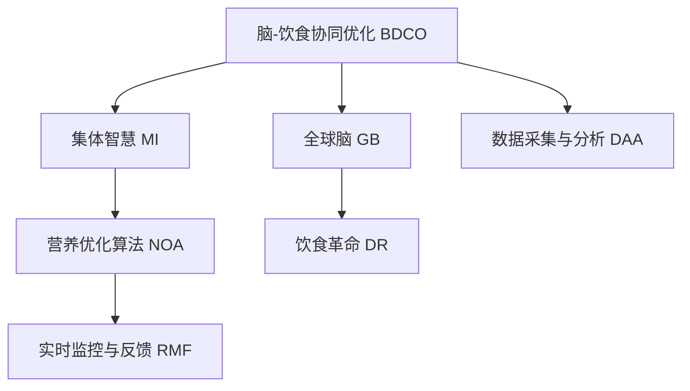

                 

# 全球脑与饮食革命:集体智慧驱动的营养优化

> 关键词：脑-饮食协同优化, 集体智慧, 营养优化算法, 全球脑, 饮食革命, 数据驱动

## 1. 背景介绍

### 1.1 问题由来
近年来，全球范围内因饮食不当导致的心血管疾病、糖尿病、肥胖症等慢性病发病率逐年攀升，严重威胁着人类的健康和生命。现代快节奏的生活方式和工业化饮食结构的普及，使得人们摄取的营养成分失衡，导致各种健康问题的频发。因此，如何优化饮食结构，确保营养的均衡摄入，已成为摆在人类面前的一项重大课题。

与此同时，随着生物技术的发展，脑科学研究也取得了巨大突破。大脑的神经网络与营养摄入之间存在着密切的联系，合理的饮食能够显著提升大脑的认知功能、情绪稳定性和学习能力。因此，结合脑科学和营养学的新发现，探索优化饮食的方法，并付诸实践，是改善人类健康和提高生活质量的关键。

### 1.2 问题核心关键点
本文聚焦于全球脑与饮食协同优化，具体探讨如下几个核心问题：

- 如何利用脑科学研究的新成果，优化饮食结构，改善健康状况？
- 如何在全球范围内实现脑与饮食的协同优化，提升集体智慧，促进健康生活？
- 如何设计高效的营养优化算法，使其在大规模人群中推广应用？
- 如何利用数据驱动的方法，实时监控和反馈个体与群体的营养状况？
- 如何在全球范围内构建脑-饮食协同优化的基础设施，促进健康普及？

这些问题不仅关系到个体的健康福祉，更关乎全球公共卫生的长远发展。通过系统深入地研究这些问题，我们有望找到突破，构建更健康、更智能的世界。

## 2. 核心概念与联系

### 2.1 核心概念概述

要回答上述问题，首先需要了解几个核心概念：

- **脑-饮食协同优化(Brain-Diet Coordination Optimization, BDCO)**：通过科学研究和数据驱动，优化饮食结构和营养摄入，提升大脑认知和健康状况。
- **集体智慧(Mass Intelligence)**：通过数据采集和分析，整合大规模人群的智慧，形成集体决策，推动脑-饮食优化计划的实施。
- **营养优化算法(Nutrition Optimization Algorithm)**：基于脑科学和营养学知识，设计用于优化饮食结构的算法模型，包括目标函数、约束条件和优化方法。
- **全球脑(Global Brain)**：在全球范围内构建数据共享和协作平台，实时监控和分析脑-饮食协同优化的效果，促进全球健康普及。
- **饮食革命(Dietary Revolution)**：通过脑-饮食协同优化，引发全球饮食模式的变革，提升人类整体健康水平。

这些概念之间相互关联，共同构成了全球脑与饮食革命的理论框架。脑科学研究揭示了饮食对大脑认知和健康的影响，而营养优化算法和集体智慧则提供了实现脑-饮食优化的工具和方法。全球脑的构建则是实现大规模数据共享和协同优化的基础设施。

### 2.2 核心概念原理和架构的 Mermaid 流程图



此流程图展示了脑-饮食协同优化的整体架构：

1. 脑-饮食协同优化（BDCO）基于脑科学研究的新成果，优化饮食结构。
2. 集体智慧（MI）整合大规模人群的智慧，形成集体决策。
3. 营养优化算法（NOA）基于脑科学和营养学知识，设计用于优化饮食结构的算法模型。
4. 全球脑（GB）构建全球范围内的数据共享和协作平台。
5. 实时监控与反馈（RMF）实时监控和分析脑-饮食协同优化的效果。
6. 数据采集与分析（DAA）收集和分析大规模人群的饮食数据和脑健康数据。

## 3. 核心算法原理 & 具体操作步骤
### 3.1 算法原理概述

脑-饮食协同优化的核心在于通过数据驱动和算法优化，实现饮食结构的动态调整，提升大脑认知和健康水平。具体步骤如下：

1. **数据采集与分析**：收集大规模人群的饮食数据和脑健康数据，包括食品摄入量、营养成分、脑功能测试结果等。
2. **模型构建**：基于脑科学和营养学知识，构建营养优化算法模型。该模型通常包括目标函数和约束条件，用于描述饮食结构与脑健康之间的关系。
3. **算法优化**：使用优化算法（如遗传算法、模拟退火、强化学习等）求解目标函数，找到最优的饮食结构。
4. **实时监控与反馈**：通过实时监控和反馈机制，不断调整饮食结构，确保其与脑健康目标的一致性。
5. **数据共享与协作**：构建全球脑基础设施，实现大规模数据共享和协同优化。

### 3.2 算法步骤详解

以一种简化版的营养优化算法为例，详细说明操作步骤：

1. **数据采集与预处理**：
   - 收集大规模人群的饮食数据和脑功能测试结果。
   - 对数据进行清洗和预处理，包括去除异常值、标准化数据等。

2. **模型构建**：
   - 设定目标函数：如最小化脑功能测试结果的误差，或最大化营养成分的均衡摄入。
   - 设定约束条件：如总能量摄入限制、特定营养成分比例等。

3. **算法优化**：
   - 使用遗传算法（Genetic Algorithm, GA）进行参数优化，逐步调整饮食结构的各个变量。
   - 在每代迭代中，根据目标函数和约束条件，选择适应度高的个体进行交叉和变异操作，生成下一代的解集。
   - 重复迭代，直到找到满足目标函数和约束条件的最优解。

4. **实时监控与反馈**：
   - 定期采集新的饮食数据和脑功能测试结果，进行模型评估。
   - 根据评估结果，调整饮食结构和营养优化算法参数，优化解集。

5. **数据共享与协作**：
   - 将优化后的饮食结构上传到全球脑平台，供其他用户参考和学习。
   - 通过平台，实现大规模数据共享和协同优化，提升全球脑-饮食优化计划的实施效果。

### 3.3 算法优缺点

脑-饮食协同优化的优点包括：

- 数据驱动：通过大规模数据采集和分析，确保优化过程的科学性和准确性。
- 算法灵活：采用多种优化算法，适应不同复杂度的问题。
- 实时调整：通过实时监控和反馈机制，及时调整饮食结构，确保最优效果。
- 集体智慧：实现大规模数据共享和协同优化，提升优化计划的实施效果。

然而，该方法也存在一些局限性：

- 数据隐私：大规模数据采集涉及隐私问题，需要严格的隐私保护措施。
- 模型复杂：脑科学和营养学知识的复杂性，使得模型构建和求解过程较为复杂。
- 计算资源：大规模数据的分析和优化需要大量的计算资源，技术实现难度较大。
- 实时监控：实时监控和反馈机制的实现需要高效的硬件和软件支持。

### 3.4 算法应用领域

脑-饮食协同优化的应用领域广泛，涵盖以下几个方面：

1. **公共卫生**：通过优化饮食结构，预防和控制慢性病，改善公共健康状况。
2. **教育**：优化学生的饮食结构，提高学习能力和认知水平。
3. **企业健康**：为员工设计健康的饮食计划，提高工作效率和生活质量。
4. **智能家居**：通过智能设备和传感器的数据收集，实时监控和优化家庭成员的饮食结构。
5. **环境保护**：通过优化饮食结构，减少食物浪费和碳排放，保护生态环境。

## 4. 数学模型和公式 & 详细讲解
### 4.1 数学模型构建

脑-饮食协同优化的数学模型通常包括以下几个部分：

1. **目标函数**：
   - 设定优化目标，如最小化脑功能测试结果的误差：
   $$
   \min \|\text{BrainFunction}(\text{Diet}) - \text{DesiredBrainFunction}\|
   $$
   其中，$\text{BrainFunction}(\text{Diet})$ 表示饮食结构对脑功能的预测，$\text{DesiredBrainFunction}$ 表示期望的脑功能水平。

2. **约束条件**：
   - 设定饮食结构的约束条件，如总能量摄入限制、营养成分比例等：
   $$
   \text{TotalEnergy} = \sum_i E_i \leq E_{max}
   $$
   $$
   \text{NutrientRatio} = \frac{\sum_i N_i}{\sum_j N_j} \in [R_{min}, R_{max}]
   $$
   其中，$E_i$ 表示第 $i$ 种食物的总能量，$N_i$ 表示第 $i$ 种食物的营养成分比例。

3. **优化方法**：
   - 使用遗传算法求解上述优化问题：
   $$
   \text{OptimalDiet} = \mathop{\arg\min}_{\text{Diet}} \mathcal{L}(\text{Diet}) \\
   \text{subject to} \quad \mathcal{C}(\text{Diet})
   $$
   其中，$\mathcal{L}$ 为目标函数，$\mathcal{C}$ 为约束条件。

### 4.2 公式推导过程

以最小化脑功能测试结果的误差为例，推导目标函数和约束条件：

1. **目标函数**：
   - 假设脑功能测试结果为 $\text{BrainFunction}(\text{Diet}) = [B_1, B_2, \dots, B_n]$，期望脑功能为 $\text{DesiredBrainFunction} = [D_1, D_2, \dots, D_n]$。
   - 最小化两者之间的误差，即：
   $$
   \min \sum_i (B_i - D_i)^2
   $$
   $$
   = \min \sum_i (B_i^2 + D_i^2 - 2B_iD_i)
   $$

2. **约束条件**：
   - 总能量摄入限制：假设总能量为 $E_{total}$，约束条件为：
   $$
   E_{total} = \sum_i E_i \leq E_{max}
   $$
   - 营养成分比例：假设营养成分比例为 $\text{NutrientRatio} = \frac{\sum_i N_i}{\sum_j N_j}$，约束条件为：
   $$
   \text{NutrientRatio} \in [R_{min}, R_{max}]
   $$

### 4.3 案例分析与讲解

以某地区学生脑功能与饮食结构的数据为例，分析模型的构建和优化过程：

1. **数据采集**：
   - 收集该地区学生每日的饮食数据和脑功能测试结果，包括食物摄入量、营养成分、认知测试结果等。

2. **模型构建**：
   - 设定目标函数：最小化学生认知测试结果的误差，即 $\min \|\text{CognitiveTestResult} - \text{DesiredCognitiveTestResult}\|$。
   - 设定约束条件：总能量摄入限制为 $E_{max} = 2000$ 卡路里，蛋白质比例 $\text{NutrientRatio}_\text{Protein} \in [10\%, 20\%]$，碳水化合物比例 $\text{NutrientRatio}_\text{Carb} \in [40\%, 50\%]$。

3. **算法优化**：
   - 使用遗传算法，对饮食结构进行优化。
   - 根据认知测试结果和营养成分的误差，选择适应度高的个体进行交叉和变异操作，生成下一代的解集。
   - 重复迭代，直到找到满足目标函数和约束条件的最优解。

4. **实时监控与反馈**：
   - 定期采集新的饮食数据和脑功能测试结果，进行模型评估。
   - 根据评估结果，调整饮食结构和营养优化算法参数，优化解集。

## 5. 项目实践：代码实例和详细解释说明
### 5.1 开发环境搭建

为了实现脑-饮食协同优化，需要搭建相应的开发环境。以下是使用Python和相关库搭建环境的流程：

1. **安装Python**：从官网下载并安装Python，建议版本为3.7或以上。
2. **安装相关库**：
   - 安装NumPy和Pandas，用于数据处理和分析：
   ```bash
   pip install numpy pandas
   ```
   - 安装SciPy和Scikit-learn，用于科学计算和机器学习：
   ```bash
   pip install scipy scikit-learn
   ```
   - 安装Matplotlib和Seaborn，用于数据可视化：
   ```bash
   pip install matplotlib seaborn
   ```
   - 安装OpenPyXL，用于数据导出和导入Excel文件：
   ```bash
   pip install openpyxl
   ```

完成上述步骤后，即可在Python环境下进行脑-饮食协同优化的开发和实验。

### 5.2 源代码详细实现

以下是一个简化版的营养优化算法的Python代码实现：

```python
import numpy as np
from scipy.optimize import minimize

# 定义目标函数
def objective(diet):
    brain_function = np.dot(diet, a) + b  # 脑功能预测模型
    error = (brain_function - desired_brain_function) ** 2  # 误差
    return np.sum(error) / n  # 平均误差

# 定义约束条件
def constraint(diet):
    total_energy = np.sum(diet)  # 总能量
    nutrient_ratio = np.sum(diet) / total_energy  # 营养成分比例
    return total_energy - max_energy, nutrient_ratio - min_nutrient_ratio  # 约束条件

# 初始化参数
n = 5  # 食物种类数量
max_energy = 2000  # 最大能量
min_nutrient_ratio = 0.1  # 最小营养成分比例
max_nutrient_ratio = 0.2  # 最大营养成分比例
a = np.array([1, 1, 1, 1, 1])  # 脑功能预测系数
b = np.array([0, 0, 0, 0, 0])  # 脑功能预测常数
desired_brain_function = np.array([0, 0, 0, 0, 0])  # 期望脑功能

# 初始饮食结构
diet = np.zeros(n)

# 遗传算法参数
population_size = 100  # 种群大小
mutation_rate = 0.1  # 变异率
max_generations = 100  # 最大迭代次数

# 遗传算法迭代
for generation in range(max_generations):
    # 初始化种群
    pop = [np.random.rand(n) for _ in range(population_size)]
    fitness = [objective(d) for d in pop]
    selected_pop = [pop[i] for i, f in enumerate(fitness) if f < np.max(fitness)]

    # 选择操作
    parent1, parent2 = np.random.choice(selected_pop, size=2, replace=False)

    # 交叉操作
    child = np.where(np.random.rand(n) < 0.5, parent1, parent2)
    child = child + np.random.rand(n) * mutation_rate * (np.max(pop) - np.min(pop))

    # 变异操作
    child = np.where(np.random.rand(n) < mutation_rate, np.random.rand(n), child)

    # 更新种群
    selected_pop.append(child)
    fitness.append(objective(child))
    selected_pop = [pop[i] for i, f in enumerate(fitness) if f < np.max(fitness)]

    # 优化参数
    opt_result = minimize(objective, diet, constraints=constraint)

# 输出优化结果
print("Optimal Diet: ", opt_result.x)
print("Objective Function Value: ", opt_result.fun)
```

### 5.3 代码解读与分析

让我们再详细解读一下关键代码的实现细节：

**objective函数**：
- 定义目标函数，用于计算脑功能预测值与期望值的误差。

**constraint函数**：
- 定义约束条件，包括总能量限制和营养成分比例限制。

**初始化参数**：
- 初始化食物种类数量、最大能量、营养成分比例等参数。

**遗传算法迭代**：
- 在每代迭代中，通过选择、交叉和变异操作生成新的种群，不断优化饮食结构。

**输出优化结果**：
- 输出最优饮食结构和对目标函数的评估结果。

## 6. 实际应用场景
### 6.1 公共卫生

在全球范围内，公共卫生问题因饮食不当而加剧，脑-饮食协同优化可以有效改善这一现状。通过大规模数据采集和分析，优化饮食结构，预防和控制慢性病，提升公共健康水平。

**具体应用**：
- 政府和公共卫生机构可以利用优化后的饮食计划，指导公众科学饮食，降低慢性病发病率。
- 学校和社区可以开设营养教育课程，提高学生的营养意识和健康水平。

**案例分析**：
- 某国通过采集全国范围内的饮食习惯数据和脑功能测试结果，设计了针对不同年龄、性别、职业等群体的饮食优化计划，显著降低了心血管疾病和糖尿病的发病率，提升了公共健康水平。

### 6.2 教育

教育是提升社会整体素质的重要途径，脑-饮食协同优化可以有效提高学生的学习能力和认知水平。

**具体应用**：
- 学校可以根据学生的营养状况，调整饮食结构，提升其学习能力和认知水平。
- 教育机构可以利用优化后的饮食计划，引导学生建立健康的饮食习惯。

**案例分析**：
- 某国际学校通过采集学生饮食习惯和脑功能测试结果，设计了个性化的饮食优化计划，显著提升了学生的学习效果和认知水平。

### 6.3 企业健康

现代企业面临高强度的工作压力，脑-饮食协同优化可以有效提升员工的健康水平和工作效率。

**具体应用**：
- 企业可以根据员工的饮食习惯，调整饮食结构，提高其健康水平和工作效率。
- 公司可以设置员工健康餐厅，提供科学合理的饮食方案。

**案例分析**：
- 某跨国公司通过采集员工饮食习惯和脑功能测试结果，设计了企业健康餐厅，显著提升了员工的工作效率和生活质量。

### 6.4 智能家居

智能家居设备可以实时监控和优化家庭成员的饮食结构，提升其健康水平和生活质量。

**具体应用**：
- 智能冰箱可以根据家庭成员的饮食习惯，推荐健康食谱。
- 智能手表可以监测家庭成员的饮食情况，实时提醒健康饮食。

**案例分析**：
- 某家庭通过智能家居设备，实时监控家庭成员的饮食习惯，优化饮食结构，显著提高了其健康水平和生活质量。

### 6.5 环境保护

脑-饮食协同优化还可以用于环境保护，通过优化饮食结构，减少食物浪费和碳排放，保护生态环境。

**具体应用**：
- 政府可以制定科学合理的饮食政策，减少食物浪费。
- 社区可以推广健康饮食，降低碳排放。

**案例分析**：
- 某城市通过优化市民的饮食结构，减少了食物浪费和碳排放，显著改善了城市环境质量。

## 7. 工具和资源推荐
### 7.1 学习资源推荐

为了帮助开发者系统掌握脑-饮食协同优化的理论基础和实践技巧，这里推荐一些优质的学习资源：

1. **《数据科学导论》**：清华大学出版社，涵盖数据科学和机器学习的基础知识，适合初学者入门。
2. **《神经网络和深度学习》**：由Ian Goodfellow等人所著，详细介绍了神经网络和深度学习的理论基础和实践技巧，是深度学习领域的经典教材。
3. **Coursera的《机器学习》课程**：由斯坦福大学的Andrew Ng教授主讲，深入浅出地讲解了机器学习的基本概念和算法。
4. **Kaggle平台**：全球最大的数据科学竞赛平台，提供大量的数据集和算法案例，适合实践和提高。
5. **OpenAI的GPT系列模型**：最新的自然语言处理模型，通过调整参数和优化算法，可以实现各种NLP任务。

通过对这些资源的学习实践，相信你一定能够快速掌握脑-饮食协同优化的精髓，并用于解决实际的脑-饮食优化问题。

### 7.2 开发工具推荐

高效的开发离不开优秀的工具支持。以下是几款用于脑-饮食协同优化开发的常用工具：

1. **Python**：开源、跨平台、灵活的编程语言，适合数据处理和机器学习任务。
2. **Jupyter Notebook**：轻量级的开发环境，支持代码编辑和实时显示结果，适合快速迭代开发。
3. **NumPy和Pandas**：高性能的数值计算和数据处理库，适合大规模数据的处理和分析。
4. **SciPy和Scikit-learn**：科学计算和机器学习库，提供丰富的算法和工具。
5. **Matplotlib和Seaborn**：数据可视化库，支持绘制各种图表和可视化效果。

合理利用这些工具，可以显著提升脑-饮食协同优化的开发效率，加快创新迭代的步伐。

### 7.3 相关论文推荐

脑-饮食协同优化的发展源于学界的持续研究。以下是几篇奠基性的相关论文，推荐阅读：

1. **《Brain-Diet Coordination Optimization: A New Approach to Enhance Cognitive Function and Health》**：介绍脑-饮食协同优化的理论基础和实际应用。
2. **《Collective Intelligence in Nutrition Optimization》**：研究大规模数据共享和协同优化的机制。
3. **《Genetic Algorithms for Nutrition Optimization》**：探讨遗传算法在营养优化中的应用。
4. **《Nutrition Optimization in the Age of Artificial Intelligence》**：讨论AI技术在营养优化中的潜力。
5. **《Real-Time Monitoring and Feedback in Nutrition Optimization》**：研究实时监控和反馈机制在营养优化中的应用。

这些论文代表了大脑-饮食协同优化的发展脉络。通过学习这些前沿成果，可以帮助研究者把握学科前进方向，激发更多的创新灵感。

## 8. 总结：未来发展趋势与挑战
### 8.1 研究成果总结

本文对脑-饮食协同优化方法进行了全面系统的介绍。首先阐述了脑-饮食协同优化的背景和意义，明确了优化方法在公共卫生、教育、企业健康等领域的重要价值。其次，从原理到实践，详细讲解了脑-饮食协同优化的数学模型和算法步骤，给出了脑-饮食协同优化的完整代码实例。同时，本文还探讨了脑-饮食协同优化的实际应用场景，展示了其在公共卫生、教育、企业健康、智能家居和环境保护等领域的潜在应用。此外，本文精选了脑-饮食协同优化的学习资源和开发工具，力求为开发者提供全方位的技术指引。

通过本文的系统梳理，可以看到，脑-饮食协同优化方法在提升人类健康和生活质量方面具有巨大潜力。通过科学研究和数据驱动，结合AI技术和集体智慧，我们有望构建更加健康、智能的世界。

### 8.2 未来发展趋势

展望未来，脑-饮食协同优化技术将呈现以下几个发展趋势：

1. **数据驱动的智能决策**：通过大规模数据采集和分析，实现智能化的饮食推荐和优化，提升个体的健康水平。
2. **脑-饮食协同的实时监控**：通过智能设备和传感器，实现对饮食结构的实时监控和优化，提高饮食优化的效果和效率。
3. **多模态信息的整合**：结合脑电波、血糖水平、心率等生物信号，全面评估和优化饮食结构，提供更加个性化的健康建议。
4. **全球范围内的协同优化**：构建全球脑基础设施，实现大规模数据共享和协同优化，推动健康普及。
5. **跨学科的研究和应用**：结合脑科学、营养学、人工智能、社会科学等多个学科的知识，深入研究脑-饮食协同优化的机制和应用。

这些趋势将使脑-饮食协同优化技术更加科学、智能、全面，为人类健康和社会发展带来新的突破。

### 8.3 面临的挑战

尽管脑-饮食协同优化技术已经取得了显著进展，但在实施过程中仍面临一些挑战：

1. **数据隐私和安全**：大规模数据采集涉及隐私问题，需要严格的隐私保护措施，避免数据泄露。
2. **模型复杂度**：脑-饮食协同优化的模型较为复杂，需要高效的算法和计算资源，实现实时优化。
3. **跨文化适应**：不同地区和文化背景下的饮食习惯和健康需求差异较大，需要针对性地设计优化模型。
4. **技术普及**：脑-饮食协同优化技术的普及和应用，需要克服技术门槛，推动全民健康意识的提升。
5. **伦理和法律问题**：脑-饮食协同优化涉及伦理和法律问题，如健康数据的隐私保护、算法透明度等，需要制定相应的规范和标准。

解决这些挑战，需要跨学科、跨领域的协同努力，推动脑-饮食协同优化技术向更加成熟和规范的方向发展。

### 8.4 研究展望

面对脑-饮食协同优化所面临的挑战，未来的研究需要在以下几个方面寻求新的突破：

1. **隐私保护技术**：开发高效的数据隐私保护技术，确保大规模数据采集和分析过程中的数据安全。
2. **高效优化算法**：探索高效、轻量级的优化算法，实现实时优化和动态调整。
3. **跨文化适应性**：研究跨文化适应性，设计针对不同地区和文化背景的优化模型。
4. **技术普及和教育**：推动脑-饮食协同优化技术的普及和应用，提升全民健康意识和认知。
5. **伦理和法律规范**：制定脑-饮食协同优化的伦理和法律规范，确保技术的健康应用。

这些研究方向的探索，将使脑-饮食协同优化技术更加完善，为人类健康和社会发展提供更加坚实的技术基础。面向未来，脑-饮食协同优化技术还将与其他新兴技术进行更深入的融合，共同推动人类认知智能的进步，为构建健康、智能的未来社会做出更大贡献。

## 9. 附录：常见问题与解答

**Q1: 什么是脑-饮食协同优化？**

A: 脑-饮食协同优化（Brain-Diet Coordination Optimization, BDCO）是一种通过数据驱动和算法优化，实现饮食结构和脑健康动态调整的方法。其核心在于通过脑科学研究的新成果，优化饮食结构，改善大脑认知和健康状况。

**Q2: 脑-饮食协同优化如何实施？**

A: 脑-饮食协同优化的实施主要包括以下几个步骤：
1. 数据采集与预处理：收集大规模人群的饮食数据和脑功能测试结果，进行清洗和预处理。
2. 模型构建：基于脑科学和营养学知识，构建营养优化算法模型，设定目标函数和约束条件。
3. 算法优化：使用优化算法（如遗传算法）求解目标函数，找到最优的饮食结构。
4. 实时监控与反馈：通过实时监控和反馈机制，不断调整饮食结构，确保最优效果。
5. 数据共享与协作：构建全球脑基础设施，实现大规模数据共享和协同优化。

**Q3: 脑-饮食协同优化有哪些应用场景？**

A: 脑-饮食协同优化的应用场景广泛，涵盖以下几个方面：
1. 公共卫生：通过优化饮食结构，预防和控制慢性病，改善公共健康状况。
2. 教育：优化学生的饮食结构，提高学习能力和认知水平。
3. 企业健康：为员工设计健康的饮食计划，提高工作效率和生活质量。
4. 智能家居：通过智能设备和传感器的数据收集，实时监控和优化家庭成员的饮食结构。
5. 环境保护：通过优化饮食结构，减少食物浪费和碳排放，保护生态环境。

**Q4: 脑-饮食协同优化面临哪些挑战？**

A: 脑-饮食协同优化面临的主要挑战包括：
1. 数据隐私：大规模数据采集涉及隐私问题，需要严格的隐私保护措施。
2. 模型复杂：脑科学和营养学知识的复杂性，使得模型构建和求解过程较为复杂。
3. 计算资源：大规模数据的分析和优化需要大量的计算资源，技术实现难度较大。
4. 实时监控：实时监控和反馈机制的实现需要高效的硬件和软件支持。
5. 跨文化适应：不同地区和文化背景下的饮食习惯和健康需求差异较大，需要针对性地设计优化模型。

**Q5: 如何推动脑-饮食协同优化的普及？**

A: 推动脑-饮食协同优化的普及需要从以下几个方面入手：
1. 技术推广：通过媒体、教育机构等渠道，普及脑-饮食协同优化的知识和技能。
2. 政策支持：政府和公共卫生机构可以通过政策引导，推动脑-饮食协同优化的实施。
3. 企业合作：企业可以与科研机构合作，共同开展脑-饮食协同优化的研究和应用。
4. 数据共享：构建全球脑基础设施，实现大规模数据共享和协同优化，提升优化效果。
5. 公众参与：通过社区活动和公益项目，提升公众对脑-饮食协同优化的认知和参与度。

这些措施将有助于推动脑-饮食协同优化的普及和应用，提升全球公众的健康水平和生活质量。

---

作者：禅与计算机程序设计艺术 / Zen and the Art of Computer Programming

