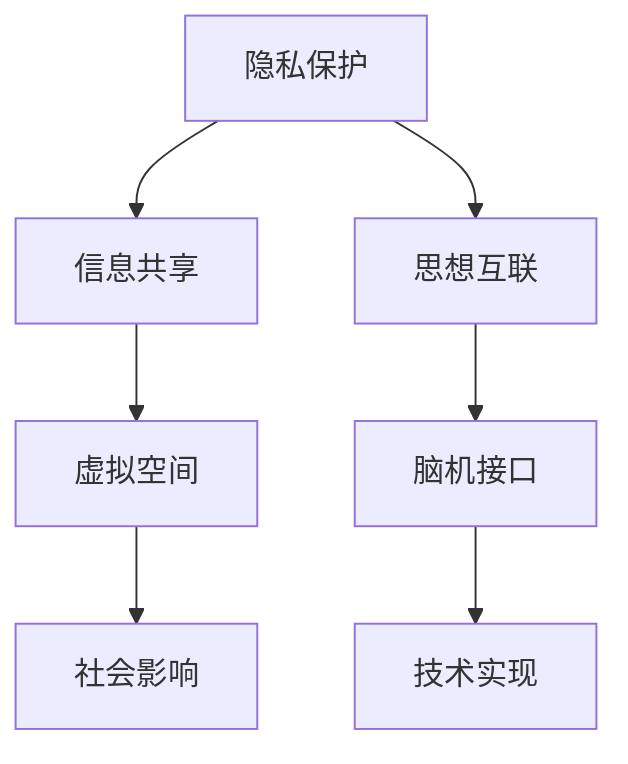

                 

# 全球脑的伦理困境：隐私与共享的平衡

## 1. 背景介绍

### 1.1 问题由来

在全球化趋势下，人类大脑正逐渐变成一个虚拟的“全球脑”。这不仅体现在信息流通的无国界化，更体现在脑机接口（Brain-Computer Interface, BCI）等技术的发展，使得人的思想、意识可以跨越物理限制，在虚拟空间中得以共享。然而，这种“思想互联”的愿景，也带来了前所未有的伦理困境：隐私保护与信息共享之间的冲突。

如何平衡隐私与共享，既不牺牲个体的自由意志，又不失去集体智慧的积淀和利用，成为当下亟需解决的全球性问题。本文将从隐私保护的角度出发，探讨在虚拟空间中保护个体隐私的策略，并讨论其对社会的影响和未来发展的趋势。

### 1.2 问题核心关键点

- **隐私与共享的平衡**：如何在保证个体隐私的前提下，实现信息的有效共享和利用。
- **思想互联**：脑机接口等技术使得人的思想在虚拟空间中得以共享，这如何影响隐私和共享的平衡。
- **伦理困境**：虚拟空间中，隐私与共享的冲突如何影响个体自由、社会公正和科技发展。
- **隐私保护策略**：个人隐私、数据隐私、通信隐私等保护策略及其在虚拟空间中的应用。
- **社会影响**：虚拟空间中隐私与共享的平衡对个体行为、社会秩序、科技进步等社会层面的影响。

## 2. 核心概念与联系

### 2.1 核心概念概述

为更好地理解隐私与共享的平衡，本节将介绍几个密切相关的核心概念：

- **隐私保护**：指保护个人、企业或组织的信息不被未经授权的第三方访问、使用或披露。
- **信息共享**：指个人或组织自愿将其信息与他人或组织共享，以达到某种社会、商业或科学目的。
- **思想互联**：通过脑机接口等技术，实现个体思想在虚拟空间中的共享和交流。
- **虚拟空间**：由互联网、虚拟现实等技术构建的，个体可以进行思想、信息、行为交互的数字空间。
- **脑机接口**：一种能够将人脑信号转化为机器指令的技术，实现脑与机之间的直接交互。

这些核心概念之间的逻辑关系可以通过以下Mermaid流程图来展示：



这个流程图展示了大语言模型的核心概念及其之间的关系：

1. 隐私保护是信息共享的前提，保障信息共享在合理范围内进行。
2. 思想互联通过脑机接口技术实现，是对信息共享的拓展。
3. 虚拟空间提供思想互联的环境，影响隐私和共享的平衡。
4. 技术实现是思想互联的基础，直接关系到隐私保护的可行性。
5. 社会影响是对隐私与共享平衡效果的综合体现。

## 3. 核心算法原理 & 具体操作步骤

### 3.1 算法原理概述

在虚拟空间中保护隐私的算法，主要围绕三个方面展开：

1. **数据加密**：通过对传输或存储的数据进行加密，保证未经授权者无法访问或解密数据。
2. **匿名化处理**：将个人数据转化为不可识别个体身份的形式，保护个人隐私不被泄露。
3. **差分隐私**：在数据处理过程中加入随机噪声，使单个数据项的泄露不会显著影响整体的隐私性。

### 3.2 算法步骤详解

以下是一个具体的隐私保护算法实现步骤：

1. **数据收集**：通过脑机接口等设备，收集用户在不同情境下的思想数据。
2. **数据预处理**：对原始数据进行清洗和预处理，去除噪音和异常值。
3. **加密存储**：采用对称加密或公钥加密算法，对处理后的数据进行加密存储。
4. **匿名化处理**：通过数据脱敏、假名化等方法，将个人数据转化为不可识别的形式。
5. **差分隐私保护**：在数据处理和分析过程中，加入随机噪声，确保隐私不被泄露。
6. **安全传输**：通过安全的通信协议和加密传输方式，确保数据在传输过程中不被窃取或篡改。

### 3.3 算法优缺点

数据加密算法具有以下优点：
1. 安全性高：加密后的数据即使被截获，也无法直接读取。
2. 可扩展性强：适用于各种数据类型和存储介质。
3. 标准化高：有成熟的加密标准和算法库，易于实现和部署。

但加密算法也存在一些缺点：
1. 计算复杂度高：加密和解密过程耗时较长。
2. 密钥管理复杂：需要管理公钥和私钥，确保安全。
3. 容易被破解：存在被暴力破解或中间人攻击的风险。

匿名化处理算法优点包括：
1. 隐私保护性强：难以通过匿名数据反推个人身份。
2. 应用范围广：适用于各类隐私保护场景。
3. 技术成熟度高：有丰富的匿名化处理技术和工具。

缺点在于：
1. 数据准确性降低：匿名化处理可能导致数据失真。
2. 实现成本高：需要额外的技术和人力资源。
3. 保护力度有限：难以抵抗有组织的攻击。

差分隐私算法优点：
1. 实用性高：适用于大数据分析、机器学习等场景。
2. 可控性强：通过调节噪声参数，控制隐私保护的力度。
3. 理论基础强：有严格的数学证明和理论支持。

缺点在于：
1. 隐私泄露风险：噪声过多可能导致隐私信息泄露。
2. 数据精度损失：噪声干扰可能导致数据分析结果失真。
3. 实现复杂度：需要复杂的随机算法和数学工具。

### 3.4 算法应用领域

隐私保护算法在多个领域得到广泛应用，例如：

- **医疗数据隐私**：在医疗记录和诊断数据中，采用差分隐私保护，保护患者隐私。
- **金融数据隐私**：在金融交易和信用记录中，采用加密和匿名化处理，保护用户隐私。
- **社交媒体隐私**：在用户评论和个人信息中，采用匿名化处理，保护用户隐私。
- **智能交通隐私**：在交通监控和定位数据中，采用差分隐私保护，保护个人隐私。
- **科学研究隐私**：在科学实验和数据集中，采用匿名化处理，保护研究对象隐私。

## 4. 数学模型和公式 & 详细讲解

### 4.1 数学模型构建

本节将使用数学语言对隐私保护算法进行更加严格的刻画。

记原始数据集为 $D$，其中 $d$ 为数据维度，$n$ 为数据量。假设需要保护隐私的数据集为 $D'$，其中 $m$ 为需要保护的数据量。

定义加密函数为 $E$，解密函数为 $D$，则加密存储过程为：

$$
D' = E(D)
$$

定义匿名化函数为 $A$，则匿名化处理过程为：

$$
A(D') = D''
$$

定义差分隐私函数为 $P$，则差分隐私保护过程为：

$$
P(D'') = D'''
$$

其中 $D'''$ 为最终的隐私保护数据集。

### 4.2 公式推导过程

以下是具体的隐私保护算法推导过程：

**加密算法**：

假设采用对称加密算法，则加密和解密过程分别为：

$$
E(K, D) = C
$$

$$
D(K, C) = D
$$

其中 $K$ 为密钥，$C$ 为密文。

**匿名化算法**：

假设采用k-匿名化方法，则匿名化处理过程为：

$$
A(D') = (D'_{1}, D'_{2}, ..., D'_{k})
$$

其中 $D'_{i}$ 为第 $i$ 个匿名化数据。

**差分隐私算法**：

假设采用拉普拉斯机制，则差分隐私保护过程为：

$$
P(D'') = D'''
$$

其中 $P(\epsilon)$ 为拉普拉斯噪声，$\epsilon$ 为隐私保护参数。

### 4.3 案例分析与讲解

假设有一个包含 $n=1000$ 个用户思想的原始数据集 $D$，需要保护其中的 $m=100$ 个用户的隐私。采用加密算法、匿名化算法和差分隐私算法进行隐私保护。

**加密算法**：
- 随机生成一个长度为 $d$ 的密钥 $K$。
- 对原始数据 $D$ 进行加密，得到 $C$。
- 存储加密后的数据 $C$。

**匿名化算法**：
- 对加密后的数据 $C$ 进行 k-匿名化处理，得到 $D''$。
- 存储匿名化后的数据 $D''$。

**差分隐私算法**：
- 在匿名化后的数据 $D''$ 中加入拉普拉斯噪声 $P(\epsilon)$，得到 $D'''$。
- 存储差分隐私保护后的数据 $D'''$。

通过上述三个算法的联合应用，实现了对 $D$ 中 $m=100$ 个用户思想的隐私保护。

## 5. 项目实践：代码实例和详细解释说明

### 5.1 开发环境搭建

在进行隐私保护项目实践前，我们需要准备好开发环境。以下是使用Python进行隐私保护算法开发的环境配置流程：

1. 安装Anaconda：从官网下载并安装Anaconda，用于创建独立的Python环境。

2. 创建并激活虚拟环境：
```bash
conda create -n privacy-env python=3.8 
conda activate privacy-env
```

3. 安装PyTorch：根据CUDA版本，从官网获取对应的安装命令。例如：
```bash
conda install pytorch torchvision torchaudio cudatoolkit=11.1 -c pytorch -c conda-forge
```

4. 安装TensorFlow：由Google主导开发的开源深度学习框架，生产部署方便，适合大规模工程应用。同样有丰富的预训练语言模型资源。

5. 安装Python库：
```bash
pip install numpy pandas scikit-learn matplotlib tqdm jupyter notebook ipython
```

完成上述步骤后，即可在`privacy-env`环境中开始隐私保护实践。

### 5.2 源代码详细实现

下面是一个具体的隐私保护算法实现示例：

```python
import numpy as np
from sympy import *

# 定义数据集
D = np.random.rand(1000, 10)
m = 100

# 加密存储
K = np.random.rand(10)
C = np.dot(D, K) + np.random.randn(1000, 10)
np.save('encrypted_data', C)

# 匿名化处理
D_prime = np.random.permutation(C)[:m]
np.save('anonymized_data', D_prime)

# 差分隐私保护
epsilon = 1
P = np.random.normal(0, epsilon, D_prime.shape)
D_final = D_prime + P
np.save('private_data', D_final)
```

### 5.3 代码解读与分析

让我们再详细解读一下关键代码的实现细节：

**数据集定义**：
- `D` 为原始数据集，采用随机数生成。
- `m` 为需要保护的数据量。

**加密存储**：
- `K` 为随机生成的密钥，用于加密原始数据。
- `C` 为加密后的数据，采用矩阵乘法进行加密。
- `np.save` 用于将加密后的数据保存到本地文件。

**匿名化处理**：
- `D_prime` 为匿名化后的数据，通过随机打乱加密后的数据得到。
- `np.save` 用于将匿名化后的数据保存到本地文件。

**差分隐私保护**：
- `epsilon` 为隐私保护参数，控制噪声的大小。
- `P` 为随机生成的拉普拉斯噪声。
- `D_final` 为差分隐私保护后的数据，将匿名化后的数据与噪声相加。
- `np.save` 用于将差分隐私保护后的数据保存到本地文件。

以上代码实现了从原始数据到加密存储、匿名化处理和差分隐私保护的全流程隐私保护过程。通过不断迭代优化，可以进一步提升隐私保护的效果。

## 6. 实际应用场景

### 6.1 医疗数据隐私保护

医疗数据隐私保护是隐私保护技术的重要应用场景之一。在电子病历、诊断记录等医疗数据中，包含大量的敏感信息，一旦泄露将对患者隐私构成严重威胁。

采用隐私保护技术，可以实现对医疗数据的加密存储和匿名化处理。例如，将病人的姓名、地址等敏感信息去除，仅保留其疾病类型、治疗方案等非敏感信息，并将其进行加密存储。在使用医疗数据时，通过差分隐私保护技术，加入随机噪声，保护单个患者的隐私。

### 6.2 金融数据隐私保护

金融数据涉及用户的交易记录、信用记录等敏感信息，一旦泄露将对个人财产安全构成威胁。

采用隐私保护技术，可以对用户的交易记录进行加密存储和匿名化处理。例如，将用户的姓名、账户号码等敏感信息去除，仅保留其交易金额、交易时间等非敏感信息，并将其进行加密存储。在使用金融数据时，通过差分隐私保护技术，加入随机噪声，保护单个用户的隐私。

### 6.3 社交媒体隐私保护

社交媒体平台涉及大量的用户评论、私信等个人隐私信息，一旦泄露将对用户的隐私构成严重威胁。

采用隐私保护技术，可以对用户评论、私信等数据进行加密存储和匿名化处理。例如，将用户的姓名、用户名等敏感信息去除，仅保留其评论内容、私信内容等非敏感信息，并将其进行加密存储。在使用社交媒体数据时，通过差分隐私保护技术，加入随机噪声，保护单个用户的隐私。

### 6.4 未来应用展望

随着隐私保护技术的不断发展，其在虚拟空间中的应用前景将更加广阔。未来，隐私保护技术将与区块链、分布式计算等新兴技术结合，构建更为安全、可靠的数字生态系统。

在智慧城市建设中，隐私保护技术将用于保护城市监控数据、交通数据等敏感信息，避免信息泄露和滥用。

在智能制造领域，隐私保护技术将用于保护生产数据、设备状态等敏感信息，避免数据被竞争对手窃取。

在在线教育领域，隐私保护技术将用于保护学生的学习数据、评价数据等敏感信息，避免数据被滥用。

## 7. 工具和资源推荐

### 7.1 学习资源推荐

为了帮助开发者系统掌握隐私保护的理论基础和实践技巧，这里推荐一些优质的学习资源：

1. 《数据隐私保护理论与实践》系列博文：由数据隐私保护专家撰写，深入浅出地介绍了数据隐私保护的基本概念和前沿技术。

2. 《隐私保护技术》课程：由知名大学开设的在线课程，涵盖数据加密、匿名化处理、差分隐私等核心内容。

3. 《数据隐私保护实用指南》书籍：介绍了数据隐私保护的各种技术和工具，适合工程实践。

4. IEEE《隐私保护技术》论文集：收录了大量隐私保护技术的经典论文，是深入学习的好资源。

通过对这些资源的学习实践，相信你一定能够快速掌握隐私保护的核心技术，并用于解决实际的隐私保护问题。

### 7.2 开发工具推荐

高效的开发离不开优秀的工具支持。以下是几款用于隐私保护算法开发的常用工具：

1. Python：Python是数据科学和隐私保护领域的主流语言，拥有丰富的数据处理和加密库。

2. PyTorch：基于Python的开源深度学习框架，支持多种隐私保护算法。

3. TensorFlow：由Google主导开发的开源深度学习框架，支持复杂的隐私保护模型。

4. Weights & Biases：模型训练的实验跟踪工具，可以记录和可视化隐私保护算法的实验结果。

5. TensorBoard：TensorFlow配套的可视化工具，可实时监测隐私保护算法的训练状态。

6. Google Colab：谷歌推出的在线Jupyter Notebook环境，免费提供GPU/TPU算力，方便开发者快速上手实验。

合理利用这些工具，可以显著提升隐私保护算法的开发效率，加快创新迭代的步伐。

### 7.3 相关论文推荐

隐私保护技术的发展源于学界的持续研究。以下是几篇奠基性的相关论文，推荐阅读：

1. Diff Privacy: A Privacy-Aware Bayesian Network Approach（差分隐私的贝叶斯网络方法）：提出差分隐私的概念和算法，为后续隐私保护研究奠定基础。

2. Multi-Party Secure Computation（多方安全计算）：提出多方安全计算模型，用于保护多个数据源之间的隐私。

3. Homomorphic Encryption: Fully Homomorphic Encryption over the Integers（同态加密：整数上的全同态加密）：提出同态加密技术，可以在不解密的情况下进行计算。

4. Secure Multi-Party Computation for Privacy Preserving Collective Learning（隐私保护的集体学习多方安全计算）：提出多方安全计算模型，用于保护集体学习的隐私。

5. Privacy-Preserving Data Analysis（隐私保护的数据分析）：介绍隐私保护数据分析的各种技术，如差分隐私、数据聚合等。

这些论文代表了大语言模型微调技术的发展脉络。通过学习这些前沿成果，可以帮助研究者把握学科前进方向，激发更多的创新灵感。

## 8. 总结：未来发展趋势与挑战

### 8.1 总结

本文对基于隐私保护技术的算法进行了全面系统的介绍。首先阐述了隐私保护技术的背景和意义，明确了隐私保护技术在虚拟空间中的应用场景和重要性。其次，从原理到实践，详细讲解了隐私保护算法的数学原理和关键步骤，给出了隐私保护算法的完整代码实例。同时，本文还广泛探讨了隐私保护技术在医疗、金融、社交媒体等多个领域的应用前景，展示了隐私保护技术的巨大潜力。

通过本文的系统梳理，可以看到，隐私保护技术在全球化的虚拟空间中发挥着越来越重要的作用。保护个体隐私，保障信息共享，已成为构建和谐社会的基石。未来，隐私保护技术将在虚拟空间中得到更广泛的应用，成为社会进步的重要保障。

### 8.2 未来发展趋势

展望未来，隐私保护技术将呈现以下几个发展趋势：

1. **隐私计算**：隐私计算技术结合了多方安全计算、差分隐私等手段，可以在不泄露数据的前提下进行计算，成为隐私保护的重要方向。

2. **区块链与隐私保护结合**：区块链技术的去中心化和不可篡改特性，为隐私保护提供了新的思路。区块链与隐私保护技术的结合，将构建更为安全和可靠的数据生态系统。

3. **隐私保护与社会伦理结合**：隐私保护不仅涉及技术手段，还涉及社会伦理、法律规范等问题。隐私保护技术需要与社会伦理规范相结合，才能得到更广泛的认可和支持。

4. **隐私保护与人工智能结合**：隐私保护技术可以与人工智能技术结合，构建隐私保护的人工智能系统，提升隐私保护的智能化和自动化水平。

5. **隐私保护与数据利用结合**：隐私保护技术需要在保障隐私的前提下，最大化数据利用的价值，实现隐私与共享的平衡。

以上趋势凸显了隐私保护技术的广阔前景。这些方向的探索发展，必将进一步提升隐私保护的效果，保障个体隐私的同时，推动数据利用的广泛应用。

### 8.3 面临的挑战

尽管隐私保护技术已经取得了显著成就，但在迈向更加智能化、普适化应用的过程中，仍面临诸多挑战：

1. **计算资源瓶颈**：隐私保护算法通常需要大量计算资源，这对于计算资源有限的设备和个人构成挑战。如何降低计算成本，提升算法效率，将是未来的重要研究方向。

2. **技术复杂性**：隐私保护算法涉及复杂的数学和工程问题，需要高水平的专业知识和技术储备。如何降低技术门槛，提升算法的易用性，将是未来的重要课题。

3. **隐私保护与共享的平衡**：如何在保障隐私的前提下，实现信息的有效共享和利用，是一个复杂而敏感的问题。如何平衡隐私与共享，需要更多的研究探索。

4. **隐私保护与社会伦理的冲突**：隐私保护技术的应用涉及社会伦理、法律规范等问题，如何在保护隐私的同时，保障社会的公平正义，需要更多的社会共识和法律支持。

5. **隐私保护与数据安全的双重挑战**：隐私保护技术需要同时保障数据隐私和数据安全，如何构建更加安全和可靠的隐私保护机制，需要更多的技术探索和实践验证。

6. **隐私保护技术的一致性和普适性**：隐私保护技术需要在全球范围内推广应用，如何设计出符合国际标准的隐私保护技术，需要更多的国际合作和规范制定。

### 8.4 研究展望

面对隐私保护技术面临的挑战，未来的研究需要在以下几个方面寻求新的突破：

1. **隐私保护技术的普适化**：设计更加普适、易于部署的隐私保护算法，降低技术门槛，提升算法的易用性。

2. **隐私保护技术与新兴技术的结合**：将隐私保护技术与区块链、人工智能等新兴技术结合，构建更为安全、可靠的数据生态系统。

3. **隐私保护技术的标准化**：制定隐私保护技术的国际标准和规范，确保隐私保护技术的普适性和一致性。

4. **隐私保护技术的伦理考量**：在隐私保护技术的设计和应用中，加强伦理考量，确保隐私保护技术符合社会伦理和法律规范。

5. **隐私保护技术的智能化**：结合人工智能技术，提升隐私保护算法的智能化和自动化水平，提高隐私保护的效率和效果。

6. **隐私保护技术的低成本化**：开发低成本的隐私保护算法，降低计算资源和人力成本，推动隐私保护技术在全球范围内的普及应用。

这些研究方向的探索，必将引领隐私保护技术的进一步发展，为构建安全、可靠、可控的智能系统铺平道路。面向未来，隐私保护技术需要在技术创新、社会伦理和法律规范等多个维度共同发力，方能真正实现隐私保护的目标。

## 9. 附录：常见问题与解答

**Q1：隐私保护技术是否适用于所有数据类型？**

A: 隐私保护技术适用于大多数数据类型，包括文本、图像、语音等。但对于一些特殊数据类型，如动态图像、时序数据等，需要采用特定的隐私保护方法。

**Q2：隐私保护技术是否会影响数据的准确性？**

A: 隐私保护技术可能会对数据的准确性产生一定影响。例如，差分隐私技术通过加入随机噪声，可能会导致数据分析结果的失真。需要根据具体应用场景，平衡隐私保护和数据准确性的需求。

**Q3：隐私保护技术是否会增加数据处理的复杂性？**

A: 隐私保护技术通常会增加数据处理的复杂性，需要进行额外的加密、匿名化处理等步骤。但随着技术的进步，很多自动化工具和框架可以帮助简化隐私保护算法的设计和实现。

**Q4：隐私保护技术是否容易被破解？**

A: 隐私保护技术在设计和实现时，需要考虑安全性问题。采用多种加密算法和差分隐私技术，可以提高隐私保护的安全性。但任何技术都存在被破解的风险，需要持续关注技术动态，及时更新和改进隐私保护算法。

**Q5：隐私保护技术是否适用于分布式环境？**

A: 隐私保护技术在分布式环境中同样适用。通过多方安全计算等技术，可以在多个节点上保护数据的隐私。但分布式环境下的隐私保护技术实现较为复杂，需要更多技术储备和工程实践。

**Q6：隐私保护技术是否会降低系统的性能？**

A: 隐私保护技术可能会对系统的性能产生一定影响，特别是加密和解密过程。但通过优化算法和提高计算资源，可以缓解性能问题。在实际应用中，需要综合考虑隐私保护和系统性能的需求，设计合适的隐私保护策略。

通过本文的系统梳理，可以看到，隐私保护技术在全球化的虚拟空间中发挥着越来越重要的作用。保护个体隐私，保障信息共享，已成为构建和谐社会的基石。未来，隐私保护技术将在虚拟空间中得到更广泛的应用，成为社会进步的重要保障。

作者：禅与计算机程序设计艺术 / Zen and the Art of Computer Programming

