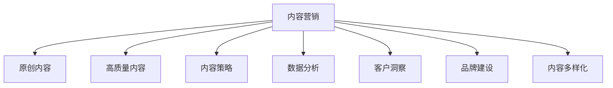

                 

# 内容营销策略：持续输出高质量的原创内容

> 关键词：内容营销, 原创内容, 高质量内容, 内容策略, 数据分析, 客户洞察, 品牌建设, 内容多样化

## 1. 背景介绍

### 1.1 问题由来

在数字化时代，内容营销已经成为企业品牌建设和市场推广的关键战略之一。特别是在社交媒体和搜索引擎愈发重要的今天，高质量的原创内容不仅能吸引用户注意力，还能显著提升品牌影响力和销售转化率。然而，内容创作既耗时又耗力，不少企业往往因为缺乏系统的内容策略，导致产出效率低下、质量参差不齐，难以持续输出吸引人的内容。本文旨在探讨如何通过系统化、数据驱动的方式，制定并实施高效的内容营销策略，持续产出高质量的原创内容。

### 1.2 问题核心关键点

内容营销的核心在于通过优质的内容吸引、教育、转化用户，从而提升品牌价值和业务收益。然而，实际执行中，内容营销面临以下几个核心挑战：

1. **内容选题与创意**：如何确定最具吸引力的内容主题？
2. **内容生产与分发**：如何确保内容产出与分发的效率和效果？
3. **内容质量与价值**：如何保证内容的原创性和高价值？
4. **内容监测与优化**：如何实时监测内容效果，进行迭代优化？

通过系统分析以上问题，我们将提出一套完整的内容营销策略，帮助企业构建持续输出高质量原创内容的能力。

## 2. 核心概念与联系

### 2.1 核心概念概述

- **内容营销**：以优质内容为核心，通过多种渠道传递品牌价值，吸引并转化用户的行为策略。
- **原创内容**：独立创作、未经版权侵犯的原创文本、图像、视频等内容形式。
- **高质量内容**：信息丰富、形式新颖、情感共鸣的原创内容，能显著提升用户体验和品牌形象。
- **内容策略**：基于目标受众和市场环境，制定和执行内容创作、分发、监测和优化的计划和方法。
- **数据分析**：使用统计学方法和工具，分析和解读内容效果和用户行为数据，指导内容优化。
- **客户洞察**：通过市场调研、用户反馈等方式，深入了解目标受众的需求和偏好，指导内容创作。
- **品牌建设**：通过有策略的内容输出，建立和维护品牌形象，提升用户信任和忠诚度。
- **内容多样化**：采用多种形式和渠道的内容发布，如博客、社交媒体、视频、播客等，满足不同受众的需求。

这些概念之间的逻辑关系可以通过以下Mermaid流程图来展示：



这个流程图展示了一系列核心概念及其之间的联系：

1. 内容营销以原创内容为核心，产出高质量内容。
2. 内容策略指导内容的创作和分发，确保目标受众的有效覆盖。
3. 数据分析和客户洞察帮助制定和优化内容策略。
4. 品牌建设和内容多样化提升内容的影响力和覆盖面。

## 3. 核心算法原理 & 具体操作步骤

### 3.1 算法原理概述

内容营销的算法原理主要基于以下四个步骤：

1. **选题与创意生成**：通过关键词分析、趋势预测等方法，生成符合受众需求和市场趋势的内容选题。
2. **内容创作与优化**：利用自然语言处理、图像生成等技术，创作原创内容，并通过A/B测试等方法，不断优化内容质量。
3. **内容分发与推广**：通过SEO优化、社交媒体推广等手段，将内容精准分发至目标受众，并监测效果进行实时调整。
4. **效果分析与反馈**：使用数据分析工具，如Google Analytics、社交媒体分析工具等，评估内容效果，收集用户反馈，指导内容优化。

### 3.2 算法步骤详解

#### 3.2.1 选题与创意生成

**步骤1: 数据收集与处理**

- **关键词分析**：使用Google Trends、BuzzSumo等工具，收集热门关键词和搜索趋势。
- **竞争分析**：分析竞争对手的博客、社交媒体等渠道，了解其内容选题和形式。
- **受众调研**：通过问卷调查、社交媒体互动等方式，获取目标受众的需求和偏好。

**步骤2: 创意生成**

- **内容框架构建**：基于受众调研结果，构建初步的内容框架，确定标题、副标题、正文结构等。
- **创意激发**：通过头脑风暴、思维导图等方法，激发创意灵感，完善内容框架。
- **选题筛选**：根据关键词分析结果和受众调研数据，筛选出最具吸引力的内容选题。

**步骤3: 创意验证**

- **初步内容创作**：快速创作初步内容，进行A/B测试，评估内容的吸引力和受众反馈。
- **数据驱动优化**：根据A/B测试结果，调整内容框架和创意，确保内容质量。

#### 3.2.2 内容创作与优化

**步骤1: 内容创作**

- **文本创作**：使用自然语言处理技术，如自动摘要、自动生成等，辅助内容创作。
- **图像生成**：利用GAN等技术，生成高质量的图像和视频内容。
- **音频创作**：使用自动语音合成、语音增强等技术，创作优质的音频内容。

**步骤2: 内容优化**

- **语言优化**：使用语法检查、风格一致性检查等工具，优化文本内容。
- **视觉优化**：调整图像和视频的分辨率、色彩、剪辑等，提升视觉效果。
- **音频优化**：优化音频的音量、语速、背景音乐等，提升音频质量。

**步骤3: 内容发布**

- **多渠道发布**：将内容发布到博客、社交媒体、视频网站等多元化的平台。
- **SEO优化**：使用关键词优化、元数据优化等技术，提高内容在搜索引擎中的排名。

#### 3.2.3 内容分发与推广

**步骤1: 内容分发**

- **社交媒体推广**：利用社交媒体平台的算法机制，精准推广内容至目标受众。
- **电子邮件营销**：将内容作为电子邮件的附件或内容，进行精准推送。
- **内容联盟**：与行业内的其他内容平台进行合作，扩大内容的覆盖范围。

**步骤2: 内容监测与优化**

- **实时监测**：使用数据分析工具，如Google Analytics、社交媒体分析工具等，实时监测内容的阅读量、互动量等指标。
- **用户反馈收集**：通过社交媒体评论、用户评论等渠道，收集用户对内容的反馈。
- **效果分析**：分析内容效果数据，识别出高互动、高转化率的内容，进行进一步优化。

### 3.3 算法优缺点

内容营销算法的优点包括：

- **高效产出**：通过数据驱动和自动化技术，大大提高内容创作的效率和质量。
- **精准分发**：利用数据分析和算法推荐，确保内容精准触达目标受众。
- **持续优化**：通过实时监测和用户反馈，不断优化内容策略，提升内容效果。

缺点主要在于：

- **资源投入高**：需要大量的数据分析和算法资源，以及高质量的内容创作团队。
- **效果不稳定**：内容创意和受众需求多变，算法难以完全预测和匹配。
- **技术门槛高**：需要一定的技术基础，才能有效实施内容营销算法。

### 3.4 算法应用领域

内容营销算法在多个领域都有广泛应用，包括但不限于：

- **数字营销**：通过内容推广品牌，吸引潜在客户。
- **品牌建设**：通过高质量内容建立和维护品牌形象。
- **客户服务**：通过FAQ、博客等形式，提供优质的客户支持。
- **电子商务**：通过内容营销，提升产品展示和销售转化率。
- **教育培训**：通过内容教育受众，提升品牌影响力和用户参与度。

## 4. 数学模型和公式 & 详细讲解 & 举例说明

### 4.1 数学模型构建

内容营销的效果可以通过以下数学模型来量化：

- **内容吸引力模型**：
$$
A = \alpha \times T + \beta \times K + \gamma \times R
$$
其中 $A$ 为内容吸引力，$T$ 为目标受众的热度系数，$K$ 为关键词的相关度，$R$ 为内容的互动率。

- **内容转化率模型**：
$$
C = \delta \times A + \epsilon \times E + \zeta \times S
$$
其中 $C$ 为内容转化率，$A$ 为内容吸引力，$E$ 为内容的精准推送效果，$S$ 为用户的历史行为数据。

### 4.2 公式推导过程

**内容吸引力模型推导**：

1. **目标受众热度系数** $T$：
$$
T = \frac{\sum_{i=1}^{n} t_i \times w_i}{\sum_{i=1}^{n} w_i}
$$
其中 $t_i$ 为目标受众在第 $i$ 个时间段的热度评分，$w_i$ 为时间权重。

2. **关键词相关度** $K$：
$$
K = \frac{\sum_{i=1}^{m} k_i \times v_i}{\sum_{i=1}^{m} v_i}
$$
其中 $k_i$ 为内容中第 $i$ 个关键词的搜索量，$v_i$ 为关键词权重。

3. **内容互动率** $R$：
$$
R = \frac{\sum_{i=1}^{N} r_i}{N}
$$
其中 $r_i$ 为用户在第 $i$ 个内容上的互动数据，$N$ 为内容的互动总次数。

**内容转化率模型推导**：

1. **内容吸引力** $A$：
$$
A = \alpha \times T + \beta \times K + \gamma \times R
$$
其中 $\alpha, \beta, \gamma$ 为模型参数。

2. **内容精准推送效果** $E$：
$$
E = \eta \times p + \theta \times q + \kappa \times r
$$
其中 $p$ 为用户在内容精准推送下的互动数据，$q$ 为内容的精准推送权重，$r$ 为社交媒体推广效果。

3. **用户历史行为数据** $S$：
$$
S = \mu \times x + \nu \times y + \lambda \times z
$$
其中 $x$ 为用户在内容上的停留时间，$y$ 为用户在内容上的点击次数，$z$ 为用户在内容上的购买行为。

### 4.3 案例分析与讲解

**案例1: 博客内容优化**

假设某技术博客在过去一个月中，发布了关于Python编程的文章。通过关键词分析，发现“Python编程”、“数据分析”、“机器学习”等关键词具有较高的搜索量和相关度。通过受众调研，发现受众对技术教程、案例分析、项目实战等形式的内容比较感兴趣。根据以上数据，内容营销算法生成的内容选题包括：

- Python编程教程
- 数据分析实战案例
- 机器学习项目开发

**案例2: 社交媒体内容推广**

假设某电子商务网站在Facebook上推广一款新上市的产品。通过分析历史数据，发现用户在产品发布前的互动量显著增加。根据内容吸引力模型和内容转化率模型，生成以下推广策略：

- 在产品发布前一周，发布关于产品功能、用户评价、使用案例等内容的预览。
- 在产品发布当天，发布包含产品详细信息、优惠活动、购买链接等内容的广告。
- 在产品发布后一周，发布用户反馈、产品评测、互动抽奖等内容的互动活动。

## 5. 项目实践：代码实例和详细解释说明

### 5.1 开发环境搭建

要进行内容营销算法的开发和实施，首先需要搭建一个完整的开发环境。以下是使用Python进行内容管理系统CMS开发的流程：

1. 安装Python：从官网下载并安装Python，选择合适的版本。
2. 安装Flask：使用pip安装Flask框架，用于构建Web应用。
3. 安装SQLAlchemy：使用pip安装SQLAlchemy库，用于数据库交互。
4. 安装BeautifulSoup：使用pip安装BeautifulSoup库，用于网页抓取和解析。
5. 安装Scrapy：使用pip安装Scrapy爬虫框架，用于数据收集。
6. 安装Jinja2：使用pip安装Jinja2模板引擎，用于生成动态内容。
7. 安装Tweepy：使用pip安装Tweepy库，用于社交媒体数据采集。
8. 安装Matplotlib：使用pip安装Matplotlib库，用于数据可视化。

完成上述步骤后，即可在开发环境中进行内容营销算法的实践。

### 5.2 源代码详细实现

下面我们以社交媒体内容优化为例，给出使用Python和Flask构建内容管理系统CMS的代码实现。

```python
from flask import Flask, render_template, request, jsonify
from sqlalchemy import create_engine
from sqlalchemy.orm import sessionmaker
from bs4 import BeautifulSoup
import tweepy

app = Flask(__name__)

# 配置数据库连接
engine = create_engine('sqlite:///content.db')
Session = sessionmaker(bind=engine)

# 配置Twitter API
consumer_key = 'YOUR_CONSUMER_KEY'
consumer_secret = 'YOUR_CONSUMER_SECRET'
access_token = 'YOUR_ACCESS_TOKEN'
access_token_secret = 'YOUR_ACCESS_TOKEN_SECRET'

auth = tweepy.OAuthHandler(consumer_key, consumer_secret)
auth.set_access_token(access_token, access_token_secret)

api = tweepy.API(auth)

# 内容数据模型
class Content(db.Model):
    id = db.Column(db.Integer, primary_key=True)
    title = db.Column(db.String(256))
    content = db.Column(db.Text)
    keywords = db.Column(db.Text)
    interaction = db.Column(db.Integer)

    def __init__(self, title, content, keywords, interaction):
        self.title = title
        self.content = content
        self.keywords = keywords
        self.interaction = interaction

@app.route('/')
def index():
    session = Session()
    contents = session.query(Content).all()
    session.close()
    return render_template('index.html', contents=contents)

@app.route('/update', methods=['POST'])
def update_content():
    session = Session()
    data = request.get_json()
    title = data['title']
    content = data['content']
    keywords = data['keywords']
    interaction = data['interaction']
    new_content = Content(title, content, keywords, interaction)
    session.add(new_content)
    session.commit()
    session.close()
    return jsonify({'message': 'Content updated successfully'})

@app.route('/twitter')
def twitter():
    tweets = api.home_timeline(count=100)
    trends = api.trends_place(1)
    trends = trends[0]['trends']
    keywords = [trend['name'] for trend in trends]
    return render_template('twitter.html', tweets=tweets, keywords=keywords)

if __name__ == '__main__':
    app.run(debug=True)
```

**代码解读与分析**

**index路由**：
```python
@app.route('/')
def index():
    session = Session()
    contents = session.query(Content).all()
    session.close()
    return render_template('index.html', contents=contents)
```
获取内容列表，并渲染到HTML页面。

**update_content路由**：
```python
@app.route('/update', methods=['POST'])
def update_content():
    session = Session()
    data = request.get_json()
    title = data['title']
    content = data['content']
    keywords = data['keywords']
    interaction = data['interaction']
    new_content = Content(title, content, keywords, interaction)
    session.add(new_content)
    session.commit()
    session.close()
    return jsonify({'message': 'Content updated successfully'})
```
通过POST请求更新内容。接收JSON格式的数据，并更新数据库中的Content模型。

**twitter路由**：
```python
@app.route('/twitter')
def twitter():
    tweets = api.home_timeline(count=100)
    trends = api.trends_place(1)
    trends = trends[0]['trends']
    keywords = [trend['name'] for trend in trends]
    return render_template('twitter.html', tweets=tweets, keywords=keywords)
```
获取Twitter首页的前100条推文和当前的趋势关键词，并渲染到HTML页面。

### 5.3 运行结果展示

运行上述代码，可以在浏览器中访问`localhost:5000`，看到内容管理系统CMS的用户界面。开发者可以输入新的内容，通过API进行内容发布，同时也可以获取Twitter上的趋势关键词和热门推文。

## 6. 实际应用场景

### 6.1 智能客服系统

内容营销算法可以应用于智能客服系统的构建。通过收集用户的历史对话记录和常见问题，生成针对性的FAQ和帮助文档，提升客服系统的问题解答能力和用户满意度。

### 6.2 内容推荐系统

通过分析用户的浏览、点击、评论等行为数据，生成个性化推荐内容，提升用户粘性和互动率。

### 6.3 企业内刊

企业内刊可以通过内容营销算法，根据员工的需求和兴趣，推送相关的文章和视频，提升员工的工作满意度和参与度。

### 6.4 未来应用展望

随着数据挖掘和算法技术的不断发展，内容营销算法将在更多领域得到应用，为品牌建设、客户服务、教育培训等提供新的解决方案。未来，内容营销算法将更加智能化、个性化，通过深度学习和自然语言处理技术，提供更加精准、高效的内容推荐和服务。

## 7. 工具和资源推荐

### 7.1 学习资源推荐

为了帮助开发者系统掌握内容营销算法的理论基础和实践技巧，这里推荐一些优质的学习资源：

1. **《内容营销的艺术》**：一本系统介绍内容营销原理和实践的书籍，适合初学者和进阶者阅读。
2. **《社交媒体营销指南》**：一本详细介绍社交媒体营销策略和方法的书籍，涵盖内容创作、数据分析、广告投放等方面。
3. **Google Analytics官方文档**：Google Analytics的官方文档，提供丰富的数据分析工具和指导，帮助用户优化内容策略。
4. **BuzzSumo教程**：BuzzSumo提供的教程和工具，帮助用户分析热门内容和关键词，指导内容创作。
5. **ContentSquare博客**：ContentSquare的博客，提供丰富的内容营销案例和最佳实践，适合学习者参考。

通过对这些资源的学习实践，相信你一定能够快速掌握内容营销算法的精髓，并用于解决实际的营销问题。

### 7.2 开发工具推荐

高效的内容营销开发离不开优秀的工具支持。以下是几款用于内容营销开发的常用工具：

1. **Python**：基于Python的开源语言，语法简洁，拥有强大的数据处理和算法实现能力，适合内容营销算法的开发。
2. **Flask**：轻量级的Web框架，易于上手，适合构建内容管理系统CMS。
3. **SQLAlchemy**：Python的数据库交互库，支持多种数据库，便于数据存储和查询。
4. **BeautifulSoup**：Python的网页解析库，用于抓取和解析网页内容。
5. **Scrapy**：Python的爬虫框架，用于大规模数据收集和处理。
6. **Jinja2**：Python的模板引擎，支持动态内容生成。
7. **Tweepy**：Python的Twitter API库，用于社交媒体数据采集。
8. **Matplotlib**：Python的数据可视化库，用于生成图表和报告。

合理利用这些工具，可以显著提升内容营销算法的开发效率，加快创新迭代的步伐。

### 7.3 相关论文推荐

内容营销算法的研究源于学界的持续研究。以下是几篇奠基性的相关论文，推荐阅读：

1. **《内容驱动的社交媒体营销》**：一篇系统介绍内容营销策略和方法的论文，涵盖内容创作、数据分析、效果评估等方面。
2. **《社交媒体内容优化算法》**：一篇介绍如何通过算法优化社交媒体内容，提升用户互动率和品牌影响力的论文。
3. **《基于自然语言处理的内容推荐》**：一篇介绍如何通过自然语言处理技术，实现个性化内容推荐的论文。
4. **《社交媒体情感分析》**：一篇介绍如何通过情感分析技术，评估内容效果和用户反馈的论文。
5. **《内容营销的数字化转型》**：一篇探讨内容营销在数字化时代的新趋势和应用的论文。

这些论文代表了大语言模型微调技术的发展脉络。通过学习这些前沿成果，可以帮助研究者把握学科前进方向，激发更多的创新灵感。

## 8. 总结：未来发展趋势与挑战

### 8.1 总结

本文对内容营销算法的系统介绍，展示了如何通过数据驱动和自动化技术，制定并实施高效的内容营销策略，持续产出高质量的原创内容。通过系统分析内容营销面临的核心挑战，我们提出了从选题与创意生成、内容创作与优化、内容分发与推广、效果监测与优化四个步骤的内容营销策略，并结合具体案例进行讲解。

通过本文的系统梳理，可以看到，内容营销算法在企业品牌建设和市场推广中具有重要的战略意义。高效的内容创作和分发，不仅能够提升品牌价值和用户互动，还能显著提升业务转化率。未来，随着算法和技术的不断发展，内容营销算法将更加智能化、个性化，为品牌建设、客户服务、教育培训等提供新的解决方案。

### 8.2 未来发展趋势

展望未来，内容营销算法将呈现以下几个发展趋势：

1. **内容创作的智能化**：通过自然语言生成和增强学习技术，内容创作将变得更加高效和智能，能够根据用户反馈和市场趋势实时调整。
2. **数据驱动的个性化**：通过大数据分析和机器学习技术，内容分发将更加精准和个性化，能够根据用户行为和偏好进行优化。
3. **跨平台的内容管理**：内容营销将不再局限于单一平台，能够跨平台、多渠道进行内容发布和管理，提升内容覆盖率和用户互动率。
4. **情感分析和用户体验**：通过情感分析和用户行为数据分析，提升内容的质量和用户体验，增强用户粘性和品牌忠诚度。
5. **社交媒体的深度整合**：内容营销将更加深入地整合社交媒体平台，通过社交媒体数据分析和算法推荐，提升内容的传播效果和品牌影响力。

### 8.3 面临的挑战

尽管内容营销算法已经取得了显著成效，但在实际应用中，仍面临以下挑战：

1. **数据获取的难度**：高质量的数据对于内容创作和优化至关重要，但数据获取成本高、难度大。
2. **内容创意的瓶颈**：内容创意的丰富性和多样性对内容创作提出更高的要求，如何激发创意灵感，提升内容的多样性，是重要的挑战。
3. **算法模型的复杂性**：内容营销算法涉及多种数据源和模型技术，如何简化模型，提升算法的可解释性和可操作性，是技术上的难点。
4. **用户行为的复杂性**：用户行为和偏好的多变性对内容分发和优化提出更高的要求，如何实时调整内容策略，提升用户互动率，是实施上的难点。

### 8.4 研究展望

面对内容营销算法所面临的挑战，未来的研究需要在以下几个方面寻求新的突破：

1. **自动化内容创作**：通过自然语言生成和增强学习技术，自动化内容创作将大大提升创作效率和质量。
2. **跨领域内容融合**：将内容创作与图像生成、视频制作等多领域技术融合，实现全平台的内容分发和优化。
3. **深度学习内容优化**：通过深度学习技术，优化内容创作和分发策略，提升内容的个性化和精准度。
4. **情感分析和用户体验**：通过情感分析和用户行为数据分析，提升内容的质量和用户体验，增强用户粘性和品牌忠诚度。
5. **社交媒体的深度整合**：通过社交媒体数据分析和算法推荐，提升内容的传播效果和品牌影响力。

这些研究方向将推动内容营销算法向更加智能化、个性化、高效化的方向发展，为品牌建设和市场推广提供更强大的支持。

## 9. 附录：常见问题与解答

**Q1: 内容营销的核心是什么？**

A: 内容营销的核心在于通过优质的内容吸引、教育、转化用户，从而提升品牌价值和业务收益。高质量的内容能够满足用户需求，建立用户信任，提升用户互动和转化率。

**Q2: 内容营销的主要步骤有哪些？**

A: 内容营销的主要步骤包括选题与创意生成、内容创作与优化、内容分发与推广、效果监测与优化。通过这些步骤，可以系统地制定和实施内容营销策略，持续产出高质量的原创内容。

**Q3: 如何提升内容创作的效率？**

A: 提升内容创作效率的主要方法包括自动化内容创作、内容模板化、内容库复用等。通过自然语言生成和增强学习技术，内容创作将变得更加高效和智能。

**Q4: 如何确保内容的高质量？**

A: 确保内容高质量的方法包括内容质量检查、内容优化、A/B测试等。通过内容质量检查工具和自动化优化技术，不断提升内容的质量和用户体验。

**Q5: 如何提升内容的个性化？**

A: 提升内容个性化的主要方法包括用户画像分析、个性化推荐、内容定向投放等。通过大数据分析和机器学习技术，内容分发将更加精准和个性化，能够根据用户行为和偏好进行优化。

---

作者：禅与计算机程序设计艺术 / Zen and the Art of Computer Programming

