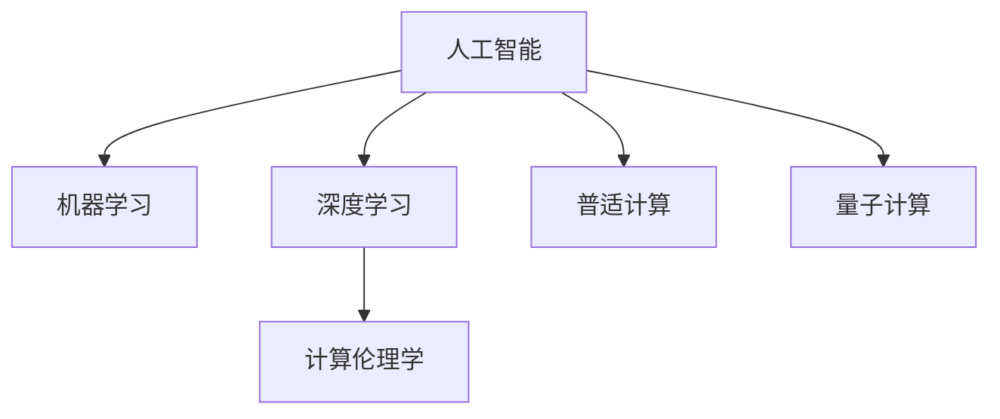

                 

# 创造更美好的世界：人类计算的终极目标

## 1. 背景介绍

### 1.1 问题由来
近年来，随着计算机技术的飞速发展，人类计算已经进入了一个全新的时代。从智能手机到物联网，从云计算到量子计算，计算机技术正在以惊人的速度改变着我们的生活方式。然而，尽管计算机技术的进步带来了许多便利，但这也引发了一系列新的问题和挑战。如何通过计算技术，让世界变得更加美好，成为我们这一代计算工作者面临的终极挑战。

### 1.2 问题核心关键点
人类计算的终极目标，不仅仅是提升计算效率和性能，更在于通过计算技术解决人类面临的种种问题。这其中涉及的关键点包括：
1. **环境保护**：如何利用计算技术，保护地球环境，减少碳排放，实现可持续发展。
2. **社会公平**：如何通过计算技术，促进社会公平，缩小贫富差距，改善民生。
3. **医疗健康**：如何利用计算技术，提高医疗服务水平，延长人类寿命，提升生活质量。
4. **教育普及**：如何通过计算技术，提供公平、高质量的教育资源，促进知识普及，培养创新人才。
5. **安全保障**：如何利用计算技术，保障国家安全、个人隐私，维护社会稳定。

这些关键点涉及多个领域，包括环境科学、社会科学、医学、教育、网络安全等。本文将围绕这些关键点，探讨人类计算的终极目标及其在各个领域的应用。

## 2. 核心概念与联系

### 2.1 核心概念概述

为更好地理解人类计算的终极目标及其应用，本节将介绍几个密切相关的核心概念：

- **人工智能(AI)**：利用计算技术模拟人类智能过程，解决复杂问题的能力。
- **机器学习(ML)**：让机器通过大量数据训练，自我学习，提高决策和预测准确性的技术。
- **深度学习(Deep Learning)**：通过多层次的神经网络结构，从大量数据中提取高级特征，实现复杂模式识别的技术。
- **计算伦理学**：研究计算机技术对人类社会的影响，如何通过技术实现公平、公正、透明的计算决策。
- **普适计算(Ubiquitous Computing)**：将计算技术与日常生活的各个方面结合，实现无处不在的计算服务。
- **量子计算**：利用量子物理原理，实现计算速度的指数级提升，解决复杂计算问题。

这些核心概念之间的逻辑关系可以通过以下Mermaid流程图来展示：



这个流程图展示了一系列紧密相关的核心概念及其之间的关系：

1. 人工智能是实现人类计算的总体目标，包括机器学习、深度学习等具体技术。
2. 机器学习和深度学习是实现人工智能的主要手段，通过大量数据训练，提升模型的预测和决策能力。
3. 计算伦理学是确保人工智能技术公正、透明、可控的重要保障，避免技术滥用。
4. 普适计算是人工智能应用的广泛推广，使计算无处不在。
5. 量子计算是未来计算技术的重要方向，有望解决当前技术无法处理的复杂问题。

这些概念共同构成了人类计算的总体框架，为我们实现美好世界提供了方向。

## 3. 核心算法原理 & 具体操作步骤
### 3.1 算法原理概述

人类计算的终极目标，是通过计算技术解决人类面临的种种问题。这一过程通常包括数据收集、数据处理、模型训练、模型应用等多个步骤。

以环境保护为例，其核心算法流程如下：

1. **数据收集**：通过卫星遥感、传感器、移动设备等技术，收集环境相关的各种数据。
2. **数据处理**：利用大数据技术，对收集到的数据进行清洗、分析、建模，提取有价值的信息。
3. **模型训练**：利用机器学习算法，建立环境变化预测模型，通过历史数据训练模型。
4. **模型应用**：将训练好的模型应用于实际场景，进行环境变化的预测和决策支持。

这一过程需要多学科的协同合作，包括环境科学、计算机科学、统计学等。

### 3.2 算法步骤详解

以环境保护为例，具体的算法步骤包括：

1. **数据采集**：通过卫星遥感技术，收集全球范围内的气候数据、森林覆盖、水资源分布等。
2. **数据清洗**：利用大数据技术，清洗数据，去除异常值、缺失值，保证数据质量。
3. **特征提取**：通过分析技术，提取有价值的环境特征，如温度、湿度、降雨量等。
4. **模型训练**：利用机器学习算法，建立环境变化预测模型，如时间序列模型、神经网络模型等。
5. **模型评估**：利用历史数据对模型进行评估，验证模型的预测准确性和稳定性。
6. **模型应用**：将训练好的模型应用于实际场景，如预测未来气候变化、森林火灾风险等。

### 3.3 算法优缺点

人类计算的目标是解决人类面临的实际问题，其算法优缺点如下：

优点：
1. **解决实际问题**：通过计算技术，解决环境污染、资源短缺等人类面临的实际问题。
2. **跨学科协作**：需要多学科的协同合作，汇聚各领域的技术和知识。
3. **数据驱动决策**：利用大量数据训练模型，提高决策的科学性和准确性。

缺点：
1. **数据获取难度大**：需要收集大量高质量的数据，数据获取难度较大。
2. **计算资源需求高**：大数据和深度学习模型的计算需求高，需要高性能计算资源。
3. **模型复杂度高**：计算模型的复杂度高，容易陷入局部最优。
4. **模型可解释性差**：计算模型的决策过程难以解释，难以进行人工干预。

尽管存在这些缺点，但通过不断优化算法和技术，人类计算的终极目标是可以实现的。

### 3.4 算法应用领域

人类计算的终极目标不仅限于环境保护，还可以应用于多个领域，例如：

1. **医疗健康**：利用计算技术，提高疾病诊断、治疗和预防的准确性，改善人类健康水平。
2. **教育普及**：利用计算技术，提供公平、高质量的教育资源，促进知识普及，培养创新人才。
3. **社会公平**：利用计算技术，促进社会公平，缩小贫富差距，改善民生。
4. **网络安全**：利用计算技术，保障网络安全，防止信息泄露和网络攻击。

这些领域的应用，展示了人类计算的广阔前景和巨大潜力。

## 4. 数学模型和公式 & 详细讲解 & 举例说明
### 4.1 数学模型构建

为了更好地理解人类计算的算法原理，本节将给出具体的数学模型构建过程。

以环境变化预测为例，数学模型构建过程如下：

1. **数据集定义**：设环境数据集为 $D=\{(x_i,y_i)\}_{i=1}^N$，其中 $x_i$ 为环境特征，$y_i$ 为环境变化标签。
2. **模型选择**：选择时间序列模型或神经网络模型作为预测模型。
3. **损失函数定义**：定义损失函数 $\ell$，衡量模型预测值与真实标签之间的差异。
4. **优化算法选择**：选择优化算法，如梯度下降算法，最小化损失函数。
5. **模型训练**：利用历史数据对模型进行训练，最小化损失函数。
6. **模型评估**：利用测试数据对模型进行评估，验证模型的预测准确性。

以时间序列模型为例，具体数学模型如下：

$$
\min_{\theta} \frac{1}{N} \sum_{i=1}^N (\hat{y}_i - y_i)^2
$$

其中 $\theta$ 为模型参数，$\hat{y}_i$ 为模型预测值，$y_i$ 为真实标签。

### 4.2 公式推导过程

以时间序列模型为例，推导其预测公式如下：

1. **数据集定义**：设环境数据集为 $D=\{(x_i,y_i)\}_{i=1}^N$，其中 $x_i$ 为环境特征，$y_i$ 为环境变化标签。
2. **模型选择**：选择自回归移动平均模型(ARMA)，其中 $y_i = \alpha y_{i-1} + \beta x_i + \varepsilon_i$，其中 $\alpha, \beta$ 为模型参数，$\varepsilon_i$ 为误差项。
3. **损失函数定义**：定义均方误差损失函数 $\ell(y_i,\hat{y}_i) = (y_i - \hat{y}_i)^2$。
4. **优化算法选择**：选择梯度下降算法，最小化均方误差损失函数。
5. **模型训练**：利用历史数据对模型进行训练，最小化损失函数。
6. **模型评估**：利用测试数据对模型进行评估，验证模型的预测准确性。

推导如下：

$$
\min_{\theta} \frac{1}{N} \sum_{i=1}^N (y_i - \alpha y_{i-1} - \beta x_i)^2
$$

通过求解上述优化问题，可以得到模型参数 $\theta$，从而实现环境变化的预测。

### 4.3 案例分析与讲解

以医疗健康领域为例，利用计算技术，可以实现疾病诊断和治疗的优化。具体步骤如下：

1. **数据收集**：收集患者的病历、基因信息、生活方式等数据。
2. **数据处理**：利用大数据技术，清洗数据，提取有价值的信息。
3. **特征提取**：通过分析技术，提取有价值的医疗特征，如基因变异、药物反应等。
4. **模型训练**：利用机器学习算法，建立疾病预测模型，如分类器、回归模型等。
5. **模型应用**：将训练好的模型应用于实际场景，进行疾病预测和治疗方案推荐。

## 5. 项目实践：代码实例和详细解释说明
### 5.1 开发环境搭建

在进行人类计算实践前，我们需要准备好开发环境。以下是使用Python进行Scikit-Learn开发的环境配置流程：

1. 安装Anaconda：从官网下载并安装Anaconda，用于创建独立的Python环境。

2. 创建并激活虚拟环境：
```bash
conda create -n scikit-learn-env python=3.8 
conda activate scikit-learn-env
```

3. 安装Scikit-Learn：
```bash
pip install scikit-learn
```

4. 安装各类工具包：
```bash
pip install numpy pandas scikit-learn matplotlib tqdm jupyter notebook ipython
```

完成上述步骤后，即可在`scikit-learn-env`环境中开始实践。

### 5.2 源代码详细实现

下面我们以医疗健康领域的疾病预测为例，给出使用Scikit-Learn进行模型训练的PyTorch代码实现。

首先，定义数据处理函数：

```python
import pandas as pd
from sklearn.model_selection import train_test_split
from sklearn.preprocessing import StandardScaler

def preprocess_data(data_path):
    data = pd.read_csv(data_path)
    features = data.drop('label', axis=1)
    labels = data['label']
    features, labels = train_test_split(features, labels, test_size=0.2, random_state=42)
    scaler = StandardScaler()
    features = scaler.fit_transform(features)
    return features, labels
```

然后，定义模型训练函数：

```python
from sklearn.ensemble import RandomForestClassifier
from sklearn.metrics import accuracy_score

def train_model(X_train, y_train):
    model = RandomForestClassifier(n_estimators=100, random_state=42)
    model.fit(X_train, y_train)
    y_pred = model.predict(X_train)
    acc = accuracy_score(y_train, y_pred)
    return acc
```

接着，定义模型评估函数：

```python
def evaluate_model(X_test, y_test):
    y_pred = model.predict(X_test)
    acc = accuracy_score(y_test, y_pred)
    return acc
```

最后，启动训练流程并在测试集上评估：

```python
X_train, X_test, y_train, y_test = preprocess_data('data.csv')
acc_train = train_model(X_train, y_train)
acc_test = evaluate_model(X_test, y_test)
print(f"Training Accuracy: {acc_train:.2f}%, Testing Accuracy: {acc_test:.2f}%")
```

以上就是使用Scikit-Learn进行疾病预测的完整代码实现。可以看到，通过简单的Python代码，即可实现数据预处理、模型训练和模型评估，展示了大规模数据集处理和模型训练的便捷性。

### 5.3 代码解读与分析

让我们再详细解读一下关键代码的实现细节：

**preprocess_data函数**：
- 从CSV文件中读取数据，将特征和标签分离。
- 将数据划分为训练集和测试集。
- 对特征进行标准化处理。
- 返回处理后的特征和标签。

**train_model函数**：
- 定义随机森林模型，设置参数。
- 使用训练数据对模型进行拟合。
- 预测训练集上的标签，并计算准确率。
- 返回训练准确率。

**evaluate_model函数**：
- 使用训练好的模型，预测测试集上的标签。
- 计算测试集上的准确率。
- 返回测试准确率。

**训练流程**：
- 调用preprocess_data函数，获取训练集和测试集。
- 调用train_model函数，训练模型，并记录训练准确率。
- 调用evaluate_model函数，评估模型，并记录测试准确率。
- 输出训练和测试准确率。

可以看到，Scikit-Learn提供的高级API和工具，使得数据预处理和模型训练变得非常简单高效。开发者可以专注于算法的设计和优化，而不必过多关注底层的实现细节。

当然，工业级的系统实现还需考虑更多因素，如模型的保存和部署、超参数的自动搜索、更灵活的模型训练接口等。但核心的算法实现基本与此类似。

## 6. 实际应用场景
### 6.1 智能医疗系统

基于计算技术的智能医疗系统，可以为患者提供更加精准、便捷的医疗服务。传统医疗模式往往依赖于医生个人的经验和技术水平，而智能医疗系统可以通过计算技术，实现疾病的自动诊断、治疗方案推荐和疾病预测，提高医疗服务的质量和效率。

在技术实现上，可以收集大量的医疗数据，包括病历、基因信息、生活方式等，利用机器学习算法，训练出疾病预测模型。模型可以在输入患者数据后，自动预测疾病风险，并提供个性化的治疗方案。此外，智能医疗系统还可以接入电子病历系统，实时监测患者的健康状况，进行预警和干预。

### 6.2 智慧城市治理

智慧城市治理需要实时采集和分析大量的城市数据，如交通流量、环境质量、居民行为等。计算技术可以实时处理这些数据，实现城市管理的智能化和高效化。

具体而言，智慧城市治理可以包括以下几个方面：
1. 交通管理：通过实时监测交通流量，优化交通信号灯控制，减少交通拥堵。
2. 环境监测：利用传感器技术，实时监测环境质量，如空气质量、噪音水平等，预测环境变化趋势。
3. 公共安全：通过视频监控和数据分析，预测和预防公共安全事件，如火灾、犯罪等。
4. 城市规划：通过数据分析，优化城市资源配置，如城市绿化、垃圾处理等。

通过计算技术，智慧城市治理可以实现更加智能、高效、可靠的城市管理。

### 6.3 金融风险预测

金融领域面临诸多风险，如市场波动、信用风险、欺诈等。计算技术可以通过数据挖掘和机器学习，预测和识别这些风险，帮助金融机构进行风险管理。

具体而言，金融风险预测可以包括以下几个方面：
1. 市场波动预测：通过分析历史数据，预测股票、债券等金融产品的价格波动。
2. 信用风险评估：利用机器学习模型，评估借款人的信用风险，预测违约概率。
3. 欺诈检测：通过分析交易数据，检测异常交易行为，识别欺诈风险。
4. 合规监测：通过分析交易数据，监测金融产品的合规性，预防违法行为。

通过计算技术，金融机构可以更加精准地识别和控制风险，保障金融系统的稳定和安全。

### 6.4 未来应用展望

随着计算技术的不断发展，人类计算的终极目标将不断拓展。未来，计算技术将在更多领域得到应用，为社会发展和人类福祉带来新的机遇：

1. **环境保护**：利用计算技术，实现气候变化预测、资源优化、污染治理等，促进可持续发展。
2. **社会公平**：通过计算技术，改善教育、医疗、住房等公共服务，缩小贫富差距。
3. **医疗健康**：利用计算技术，实现疾病预测、治疗优化、健康管理等，提升人类健康水平。
4. **教育普及**：利用计算技术，提供个性化教育、知识普及、创新人才培养等，促进社会进步。
5. **网络安全**：通过计算技术，实现网络攻击预警、数据隐私保护、网络安全监控等，保障信息安全。

这些应用将为人类社会带来更多的福祉和进步。

## 7. 工具和资源推荐
### 7.1 学习资源推荐

为了帮助开发者系统掌握人类计算的原理和应用，这里推荐一些优质的学习资源：

1. **《人工智能：一种现代方法》**：人工智能领域的经典教材，系统介绍了人工智能的原理、算法和应用。
2. **Coursera《机器学习》课程**：斯坦福大学开设的机器学习课程，涵盖了机器学习的基本概念和算法。
3. **Udacity《深度学习》纳米学位**：Udacity提供的深度学习课程，深入浅出地介绍了深度学习的基本原理和应用。
4. **Google AI Blog**：Google AI团队的博客，介绍了最新的AI研究进展和技术应用。
5. **Kaggle竞赛**：Kaggle提供的各类数据科学和机器学习竞赛，提供了丰富的实践机会。

通过对这些资源的学习实践，相信你一定能够快速掌握人类计算的精髓，并用于解决实际的AI问题。

### 7.2 开发工具推荐

高效的开发离不开优秀的工具支持。以下是几款用于人类计算开发的常用工具：

1. **Scikit-Learn**：Python的机器学习库，提供了丰富的算法和工具，方便数据处理和模型训练。
2. **TensorFlow**：Google主导的深度学习框架，支持分布式计算，适合大规模模型训练和推理。
3. **PyTorch**：Facebook主导的深度学习框架，支持动态计算图，适合研究和实验。
4. **Jupyter Notebook**：开源的交互式编程环境，方便数据探索和算法实验。
5. **AWS SageMaker**：Amazon提供的云服务平台，支持大规模数据处理和模型训练，适合工业应用。

合理利用这些工具，可以显著提升人类计算的开发效率，加快创新迭代的步伐。

### 7.3 相关论文推荐

人类计算的研究源于学界的持续研究。以下是几篇奠基性的相关论文，推荐阅读：

1. **《Deep Learning》**：深度学习领域的经典教材，系统介绍了深度学习的基本原理和应用。
2. **《Natural Language Processing with Python》**：Python NLP领域的经典教材，介绍了NLP的基本概念和应用。
3. **《Human and Machine Intelligence: Bridging the Gap》**：关于人类计算的综述论文，介绍了人类计算的基本概念和应用。
4. **《Superintelligence: Paths, Dangers, Strategies》**：关于超级智能的书籍，探讨了计算技术对人类社会的影响。

这些论文代表了大计算技术的发展脉络。通过学习这些前沿成果，可以帮助研究者把握学科前进方向，激发更多的创新灵感。

## 8. 总结：未来发展趋势与挑战
### 8.1 总结

本文对人类计算的终极目标及其在多个领域的应用进行了全面系统的介绍。首先阐述了人类计算的总体目标，明确了其在环境保护、社会公平、医疗健康等领域的应用价值。其次，从原理到实践，详细讲解了人类计算的数学模型和算法实现，给出了具体的代码实例。同时，本文还广泛探讨了人类计算在多个行业领域的应用前景，展示了计算技术带来的广阔前景。此外，本文精选了人类计算技术的各类学习资源，力求为读者提供全方位的技术指引。

通过本文的系统梳理，可以看到，人类计算的终极目标是解决人类面临的种种问题，其应用领域广泛，潜力巨大。通过计算技术，我们能够更加智能、高效地管理社会、改善环境、提升人类福祉。然而，实现这一目标也面临着诸多挑战，需要多学科的协同合作，不断优化算法和技术，方能实现美好世界的愿景。

### 8.2 未来发展趋势

展望未来，人类计算的终极目标将不断拓展。计算技术将在更多领域得到应用，为社会发展和人类福祉带来新的机遇：

1. **技术普及**：随着计算技术的不断普及，更多人能够利用计算技术解决实际问题，提高生活质量。
2. **应用创新**：计算技术将推动更多领域的创新，如智能交通、智能制造、智能物流等，提升社会效率。
3. **可持续发展**：计算技术将促进可持续发展，如能源优化、环境治理等，实现绿色发展。
4. **公平公正**：计算技术将促进社会公平，缩小贫富差距，改善民生。
5. **知识普及**：计算技术将促进知识的普及和传播，提升全社会的文化素质。

这些趋势展示了人类计算的广阔前景和巨大潜力。

### 8.3 面临的挑战

尽管人类计算的终极目标已经明确，但在实现过程中仍面临诸多挑战：

1. **数据获取难度**：计算技术需要大量的高质量数据，数据获取难度大。
2. **计算资源需求高**：大规模数据集和复杂模型的计算需求高，需要高性能计算资源。
3. **模型复杂度高**：计算模型的复杂度高，容易陷入局部最优。
4. **模型可解释性差**：计算模型的决策过程难以解释，难以进行人工干预。
5. **伦理和安全问题**：计算技术的滥用可能导致隐私泄露和伦理问题，需要建立相关监管机制。

尽管存在这些挑战，但通过不断优化算法和技术，人类计算的终极目标是可以实现的。

### 8.4 研究展望

未来的研究需要在以下几个方面寻求新的突破：

1. **无监督学习**：探索无监督学习范式，降低对标注数据的依赖，最大化利用数据。
2. **跨领域知识融合**：将不同领域的知识进行融合，提升计算技术的泛化能力和适用性。
3. **可解释性**：研究计算技术的可解释性，确保模型决策过程透明、可控。
4. **伦理和安全**：建立计算技术的伦理和安全约束，确保技术应用的公正性和安全性。

这些研究方向的探索，必将引领人类计算技术迈向更高的台阶，为构建安全、可靠、可解释、可控的智能系统铺平道路。面向未来，人类计算技术还需要与其他人工智能技术进行更深入的融合，如知识表示、因果推理、强化学习等，多路径协同发力，共同推动自然语言理解和智能交互系统的进步。只有勇于创新、敢于突破，才能不断拓展计算技术的边界，让智能技术更好地造福人类社会。

## 9. 附录：常见问题与解答
----------------------------------------------------------------
> 关键词：


