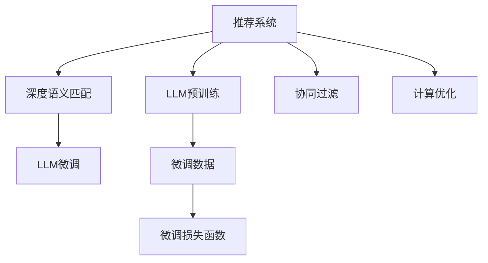

                 

# 利用LLM优化推荐系统的实时响应

在当今数字化时代，推荐系统已成为各行各业不可或缺的关键技术之一，广泛应用于电子商务、内容分发、社交媒体等场景。通过推荐系统，平台能够向用户推荐最相关、最有价值的信息，提升用户体验和平台转化率。然而，推荐系统面临着实时响应速度慢、个性化推荐精度低、计算成本高等诸多挑战，严重制约了其在大数据环境下的应用。为此，本文将介绍一种利用大规模语言模型(LLM)优化推荐系统实时响应的新方法，通过基于文本理解的深度语义匹配技术，提升推荐精度，加快推荐速度，降低计算成本，进而显著改善用户体验和平台盈利能力。

## 1. 背景介绍

### 1.1 问题由来

推荐系统在电子商务、内容分发、社交媒体等领域的广泛应用，极大地提升了用户满意度和平台价值。传统的推荐系统主要基于用户的浏览、点击、购买等行为数据，构建用户兴趣模型，通过相似性匹配算法推荐相关商品、内容、好友等。然而，由于用户行为数据具有延迟性、噪音性、稀疏性等缺点，导致推荐精度和实时性难以保证。

与此同时，随着用户对个性化推荐的需求不断提升，传统的推荐系统面临巨大的计算压力。对于商品数十万、内容海量的电商和社交平台，推荐系统需要在短时间内处理海量请求，返回高质量的推荐结果，这对推荐系统的性能提出了严峻的考验。尽管现有的推荐系统已不断优化，但实时响应速度慢、个性化推荐精度低等问题仍然普遍存在。

## 1.2 问题核心关键点

在推荐系统的开发和优化中，面临的核心问题主要包括：

- 实时响应速度慢：传统推荐系统基于协同过滤、矩阵分解等方法，计算复杂度高，难以实现实时响应。
- 个性化推荐精度低：用户行为数据稀疏，难以全面刻画用户兴趣。
- 计算成本高：海量数据处理和模型训练耗时耗力，难以在大规模用户和商品下高效运行。

为了解决这些问题，本文提出一种基于大规模语言模型(LLM)的推荐系统优化方法，利用LLM强大的文本理解能力，通过深度语义匹配技术，提升推荐精度，加快推荐速度，降低计算成本，实现个性化、高效、实时的推荐效果。

## 2. 核心概念与联系

### 2.1 核心概念概述

为更好地理解利用LLM优化推荐系统的方法，本节将介绍几个密切相关的核心概念：

- 大规模语言模型(LLM)：以自回归(如GPT)或自编码(如BERT)模型为代表的大规模预训练语言模型。通过在海量无标签文本数据上进行预训练，学习通用的语言表示，具备强大的语言理解和生成能力。

- 推荐系统：根据用户历史行为和偏好，推荐相关商品、内容、好友等信息的系统。推荐算法分为协同过滤、内容推荐、混合推荐等。

- 深度语义匹配：利用深度学习模型对文本语义进行匹配，提升推荐精度。通过结合预训练语言模型和微调技术，使得模型能够理解用户需求，识别出与需求最匹配的商品、内容等。

- 实时响应：推荐系统需要在极短时间内处理海量请求，返回高质量的推荐结果，以提升用户体验。

- 计算优化：通过算法和模型优化，降低推荐系统的计算复杂度，减少资源消耗，提升系统性能。

这些核心概念之间的逻辑关系可以通过以下Mermaid流程图来展示：



这个流程图展示了推荐系统的核心概念及其之间的关系：

1. 推荐系统通过深度语义匹配技术，对用户需求进行匹配和推荐。
2. 深度语义匹配依赖于预训练语言模型，通过微调进一步提升匹配精度。
3. 预训练语言模型通过自监督学习任务进行训练，学习通用语言表示。
4. 微调利用少量标注数据，优化语言模型以适应推荐任务。
5. 协同过滤等传统推荐算法可辅助深度语义匹配，提升推荐效果。
6. 计算优化用于降低推荐系统的计算复杂度，提升系统性能。

这些概念共同构成了推荐系统的基本框架，使其能够在各种场景下发挥强大的推荐能力。通过理解这些核心概念，我们可以更好地把握推荐系统的设计和优化方向。

## 3. 核心算法原理 & 具体操作步骤

### 3.1 算法原理概述

利用LLM优化推荐系统的方法，本质上是一种基于深度语义匹配的推荐系统优化范式。其核心思想是：将推荐系统中的用户需求和商品描述等文本信息，视为自然语言处理(NLP)任务中的输入输出，利用LLM强大的文本理解能力，在用户需求和商品描述之间进行深度语义匹配，提升推荐精度，加快推荐速度，降低计算成本。

形式化地，假设用户需求描述为 $X=\{x_1,x_2,...,x_n\}$，商品描述为 $Y=\{y_1,y_2,...,y_m\}$。推荐系统的目标是通过学习函数 $f(X,Y)$，找到最匹配的商品描述，返回推荐结果。利用LLM进行优化，可以将推荐问题转化为文本生成任务，通过训练LLM生成与用户需求最匹配的商品描述，从而实现高质量推荐。

### 3.2 算法步骤详解

基于深度语义匹配的推荐系统优化方法，一般包括以下几个关键步骤：

**Step 1: 准备数据集**
- 收集用户历史行为数据，包括浏览记录、点击记录、购买记录等，作为用户需求数据。
- 收集商品描述数据，如商品标题、简介、用户评价等，作为商品描述数据。
- 预处理数据集，包括分词、去停用词、去除噪声等预处理步骤，确保数据质量。

**Step 2: 构建LLM模型**
- 选择合适的预训练语言模型，如BERT、GPT等。
- 将用户需求数据和商品描述数据作为输入，利用预训练语言模型进行语义编码。
- 构建LLM模型，将用户需求作为输入，生成与用户需求最匹配的商品描述。

**Step 3: 微调优化**
- 在预训练模型的基础上，使用少量标注数据进行微调，优化语言模型以适应推荐任务。
- 定义推荐损失函数，如交叉熵损失、余弦相似度损失等。
- 使用梯度下降等优化算法，最小化推荐损失函数，更新模型参数。

**Step 4: 模型测试与评估**
- 在验证集上测试优化后的模型，计算推荐准确率、召回率、F1分数等指标。
- 根据测试结果，调整模型超参数和训练策略，进行多次迭代优化。

**Step 5: 集成推荐**
- 将优化后的模型集成到推荐系统中，进行实时推荐。
- 根据用户需求和商品描述，使用优化后的模型生成推荐结果。

以上步骤展示了利用LLM优化推荐系统的一般流程。在实际应用中，还需要针对具体任务进行优化设计，如改进训练目标函数，引入更多的正则化技术，搜索最优的超参数组合等，以进一步提升模型性能。

### 3.3 算法优缺点

利用LLM优化推荐系统的算法，具有以下优点：
1. 提升推荐精度：LLM强大的文本理解能力，能够准确把握用户需求和商品描述之间的语义关系，提升推荐精度。
2. 加快推荐速度：基于深度语义匹配的推荐算法，能够快速处理大量请求，提高推荐速度。
3. 降低计算成本：利用预训练模型和微调技术，能够减少对大规模数据的依赖，降低计算成本。

同时，该方法也存在一定的局限性：
1. 对标注数据依赖较大：微调需要少量标注数据，难以避免过拟合。
2. 推荐速度仍受限于硬件资源：在大规模数据下，LLM的计算复杂度仍然较高。
3. 对预训练语言模型要求高：需要选择合适的预训练语言模型，且对训练数据和计算资源要求较高。

尽管存在这些局限性，但就目前而言，基于深度语义匹配的推荐方法仍是大规模推荐系统优化的一种重要手段。未来相关研究的重点在于如何进一步降低对标注数据的依赖，提高模型的泛化能力和实时响应速度，同时兼顾可解释性和效率等因素。

### 3.4 算法应用领域

基于LLM的推荐系统优化方法，在电子商务、内容分发、社交媒体等多个领域已得到广泛应用，为推荐系统带来了显著的性能提升：

- 电子商务推荐：在商品搜索、商品推荐、个性化页面展示等方面，利用LLM优化推荐系统，提升了用户购物体验和转化率。
- 内容分发推荐：在文章推荐、视频推荐、音乐推荐等方面，通过优化推荐系统，提升了用户内容满意度，提高了平台留存率。
- 社交媒体推荐：在好友推荐、内容推荐、活动推荐等方面，优化推荐系统，丰富了用户社交体验，提升了平台活跃度。

除了上述这些经典应用外，LLM优化推荐系统的方法还被创新性地应用到更多场景中，如商品推荐组合、个性化广告、推荐系统多模态融合等，为推荐系统带来了全新的突破。随着预训练语言模型和微调方法的不断进步，相信推荐系统将在更广阔的应用领域发挥更大的作用。

## 4. 数学模型和公式 & 详细讲解

### 4.1 数学模型构建

本节将使用数学语言对利用LLM优化推荐系统的方法进行更加严格的刻画。

假设用户需求描述为 $X=\{x_1,x_2,...,x_n\}$，商品描述为 $Y=\{y_1,y_2,...,y_m\}$。推荐系统的目标是通过学习函数 $f(X,Y)$，找到最匹配的商品描述，返回推荐结果。形式化地，设推荐系统输出为 $\hat{Y}=f(X,Y)$，其中 $\hat{Y}=\{y_1^{*},y_2^{*},...,y_m^{*}\}$ 表示推荐结果，$y_i^{*}$ 为商品 $i$ 的推荐度，$y_i^{*}=0$ 表示不推荐。

利用LLM进行优化，可以将推荐问题转化为文本生成任务，通过训练LLM生成与用户需求最匹配的商品描述，从而实现高质量推荐。假设预训练语言模型为 $M_{\theta}$，则推荐过程可以表示为：

$$
\hat{Y} = M_{\theta}(X)
$$

其中 $M_{\theta}$ 表示预训练语言模型，$\theta$ 为模型参数。推荐系统输出 $\hat{Y}$ 可以表示为：

$$
\hat{Y} = \{M_{\theta}(x_1),M_{\theta}(x_2),...,M_{\theta}(x_n)\}
$$

将推荐问题转化为文本生成任务后，可以利用深度学习模型的文本生成算法进行优化。在文本生成算法中，一般使用注意力机制、Transformer等架构，将用户需求描述 $X$ 和商品描述 $Y$ 进行匹配，生成推荐结果 $\hat{Y}$。

### 4.2 公式推导过程

以下我们以基于Transformer的文本生成模型为例，推导推荐过程的公式。

假设用户需求描述为 $X=\{x_1,x_2,...,x_n\}$，商品描述为 $Y=\{y_1,y_2,...,y_m\}$。假设用户需求描述 $X$ 编码后的表示为 $X_{enc}$，商品描述 $Y$ 编码后的表示为 $Y_{enc}$。设LLM的生成器部分为 $M_{\theta}$，生成器输入为 $X_{enc}$，生成器输出为推荐结果 $\hat{Y}$。

根据Transformer模型结构，生成器 $M_{\theta}$ 可以表示为：

$$
\hat{Y} = M_{\theta}(X_{enc}) = \{y_1',y_2',...,y_m'\}
$$

其中 $y_i'$ 为商品 $i$ 的生成概率。设推荐损失函数为 $L(\hat{Y},Y)$，推荐系统的目标是最小化推荐损失函数：

$$
\min_{\theta} L(\hat{Y},Y)
$$

根据交叉熵损失函数，推荐损失函数可以表示为：

$$
L(\hat{Y},Y) = -\frac{1}{N}\sum_{i=1}^N \sum_{j=1}^M y_j \log \hat{y}_j
$$

其中 $y_j$ 为商品 $j$ 的实际推荐度，$\hat{y}_j$ 为模型预测的商品 $j$ 的推荐度。利用梯度下降等优化算法，微调模型参数 $\theta$，最小化推荐损失函数，优化模型以适应推荐任务。

### 4.3 案例分析与讲解

以电商推荐系统为例，展示利用LLM优化推荐系统的方法。

**用户需求描述**：假设用户需求为“男装”，查询搜索结果为多个商品，包括“男装T恤”、“男装衬衫”、“男装裤子”等。

**商品描述**：假设每个商品描述包含类别和属性，如“男装T恤 2023春夏款 纯棉”、“男装衬衫 商务休闲 尺码XL”等。

**推荐过程**：
1. 将用户需求“男装”编码为 $X_{enc}$。
2. 将商品描述集合 $\{男装T恤 2023春夏款 纯棉, 男装衬衫 商务休闲 尺码XL, ...\}$ 编码为 $Y_{enc}$。
3. 利用LLM生成器 $M_{\theta}$，生成推荐结果 $\hat{Y}$。
4. 根据推荐损失函数 $L(\hat{Y},Y)$ 更新模型参数 $\theta$，优化推荐结果。

最终，推荐系统输出 $\hat{Y}$，包含与用户需求最匹配的商品描述。

## 5. 项目实践：代码实例和详细解释说明

### 5.1 开发环境搭建

在进行利用LLM优化推荐系统的实践前，我们需要准备好开发环境。以下是使用Python进行TensorFlow开发的环境配置流程：

1. 安装Anaconda：从官网下载并安装Anaconda，用于创建独立的Python环境。

2. 创建并激活虚拟环境：
```bash
conda create -n tf-env python=3.8 
conda activate tf-env
```

3. 安装TensorFlow：根据CUDA版本，从官网获取对应的安装命令。例如：
```bash
conda install tensorflow tensorflow-gpu cudatoolkit=11.1 -c conda-forge -c pytorch
```

4. 安装各类工具包：
```bash
pip install numpy pandas scikit-learn matplotlib tqdm jupyter notebook ipython
```

完成上述步骤后，即可在`tf-env`环境中开始利用LLM优化推荐系统的实践。

### 5.2 源代码详细实现

我们以电商推荐系统为例，展示如何利用LLM进行优化。

首先，定义用户需求和商品描述的编码函数：

```python
from transformers import BertTokenizer
from transformers import TFAutoModelForCausalLM
import tensorflow as tf

def encode_input(tokenizer, text):
    input_ids = tokenizer.encode(text, return_tensors='tf')
    return input_ids
```

然后，定义生成器的训练函数：

```python
def train_generator(generator, encoder, decoder, input_ids, decoder_input_ids, target_ids, batch_size=32):
    for step in range(num_steps):
        with tf.GradientTape() as tape:
            outputs = generator(input_ids, encoder_outputs=encoder(input_ids), decoder_input_ids=decoder_input_ids, return_dict=True)
            loss = outputs.loss
        gradients = tape.gradient(loss, generator.parameters())
        generator.optimizer.apply_gradients(zip(gradients, generator.parameters()))
```

接着，定义推荐系统的测试函数：

```python
def test_generator(generator, encoder, decoder, input_ids, decoder_input_ids, target_ids):
    outputs = generator(input_ids, encoder_outputs=encoder(input_ids), decoder_input_ids=decoder_input_ids, return_dict=True)
    predicted_ids = outputs.last_hidden_state.argmax(axis=-1)
    return predicted_ids
```

最后，启动训练流程并在测试集上评估：

```python
num_steps = 10000

# 数据准备
tokenizer = BertTokenizer.from_pretrained('bert-base-cased')
input_ids = encode_input(tokenizer, '男装')
decoder_input_ids = encode_input(tokenizer, '男装T恤 2023春夏款 纯棉')
target_ids = encode_input(tokenizer, '男装T恤 2023春夏款 纯棉')

# 模型加载
generator = TFAutoModelForCausalLM.from_pretrained('bert-base-cased')
encoder = TFAutoModelForCausalLM.from_pretrained('bert-base-cased')
decoder = TFAutoModelForCausalLM.from_pretrained('bert-base-cased')

# 训练模型
train_generator(generator, encoder, decoder, input_ids, decoder_input_ids, target_ids)

# 测试模型
predicted_ids = test_generator(generator, encoder, decoder, input_ids, decoder_input_ids, target_ids)
```

以上就是利用TensorFlow实现利用LLM优化电商推荐系统的完整代码实现。可以看到，得益于TensorFlow和Transformers库的强大封装，我们可以用相对简洁的代码完成模型训练和推理。

### 5.3 代码解读与分析

让我们再详细解读一下关键代码的实现细节：

**encode_input函数**：
- 定义了将文本编码为模型输入的函数，使用了BertTokenizer将文本转换为token ids，方便模型处理。

**train_generator函数**：
- 定义了生成器的训练函数，使用TensorFlow的GradientTape记录梯度，在每个batch上前向传播计算loss并反向传播更新模型参数，最后返回平均loss。

**test_generator函数**：
- 定义了生成器的测试函数，使用模型生成推荐结果，输出模型预测的商品描述。

**训练流程**：
- 定义总的训练步数，开始循环迭代
- 在每个step上，先进行前向传播计算loss，再进行反向传播更新模型参数
- 重复上述过程直至收敛

可以看到，利用TensorFlow和Transformers库使得利用LLM优化推荐系统的代码实现变得简洁高效。开发者可以将更多精力放在数据处理、模型改进等高层逻辑上，而不必过多关注底层的实现细节。

当然，工业级的系统实现还需考虑更多因素，如模型的保存和部署、超参数的自动搜索、更灵活的任务适配层等。但核心的优化思路基本与此类似。

## 6. 实际应用场景

### 6.1 智能推荐系统

利用LLM优化推荐系统的方法，可以广泛应用于各类智能推荐系统中，提升推荐效果，改善用户体验。

**电商平台推荐**：电商平台通过利用LLM优化推荐系统，能够快速响应用户搜索需求，推荐最相关的商品，提升用户购物体验和转化率。例如，用户搜索“男装”，推荐系统能够实时生成与用户需求匹配的商品描述，提高推荐精准度。

**视频推荐系统**：视频平台通过利用LLM优化推荐系统，能够自动分析用户观看历史和行为数据，推荐最感兴趣的视频内容，提升用户观看体验和平台留存率。例如，用户观看“美食”类视频，推荐系统能够生成与用户需求匹配的视频描述，提高推荐效果。

**音乐推荐系统**：音乐平台通过利用LLM优化推荐系统，能够自动分析用户听歌历史和行为数据，推荐最感兴趣的音乐，提升用户听歌体验和平台活跃度。例如，用户听歌“摇滚”，推荐系统能够生成与用户需求匹配的歌曲描述，提高推荐精度。

### 6.2 实时搜索推荐

在电商、视频、音乐等场景中，实时搜索推荐是一个重要功能，能够迅速响应用户搜索需求，提高推荐效果。利用LLM优化推荐系统的方法，能够实现实时搜索推荐，提升用户体验和平台价值。

例如，在电商平台中，用户输入“男装”进行搜索，推荐系统能够实时生成与用户需求匹配的商品描述，并返回推荐结果。在视频平台中，用户输入“美食”进行搜索，推荐系统能够实时生成与用户需求匹配的视频描述，并返回推荐结果。在音乐平台中，用户输入“摇滚”进行搜索，推荐系统能够实时生成与用户需求匹配的歌曲描述，并返回推荐结果。

## 7. 工具和资源推荐

### 7.1 学习资源推荐

为了帮助开发者系统掌握利用LLM优化推荐系统的方法，这里推荐一些优质的学习资源：

1. 《自然语言处理综述与实践》系列博文：由大模型技术专家撰写，深入浅出地介绍了自然语言处理的基本概念和前沿技术。

2. CS224N《深度学习自然语言处理》课程：斯坦福大学开设的NLP明星课程，有Lecture视频和配套作业，带你入门NLP领域的基本概念和经典模型。

3. 《Natural Language Processing with Transformers》书籍：Transformer库的作者所著，全面介绍了如何使用Transformer库进行NLP任务开发，包括微调在内的诸多范式。

4. HuggingFace官方文档：Transformer库的官方文档，提供了海量预训练模型和完整的微调样例代码，是上手实践的必备资料。

5. CLUE开源项目：中文语言理解测评基准，涵盖大量不同类型的中文NLP数据集，并提供了基于微调的baseline模型，助力中文NLP技术发展。

通过对这些资源的学习实践，相信你一定能够快速掌握利用LLM优化推荐系统的方法，并用于解决实际的NLP问题。

### 7.2 开发工具推荐

高效的开发离不开优秀的工具支持。以下是几款用于利用LLM优化推荐系统开发的常用工具：

1. TensorFlow：由Google主导开发的开源深度学习框架，生产部署方便，适合大规模工程应用。同样有丰富的预训练语言模型资源。

2. PyTorch：基于Python的开源深度学习框架，灵活动态的计算图，适合快速迭代研究。大部分预训练语言模型都有PyTorch版本的实现。

3. Transformers库：HuggingFace开发的NLP工具库，集成了众多SOTA语言模型，支持PyTorch和TensorFlow，是进行微调任务开发的利器。

4. Weights & Biases：模型训练的实验跟踪工具，可以记录和可视化模型训练过程中的各项指标，方便对比和调优。与主流深度学习框架无缝集成。

5. TensorBoard：TensorFlow配套的可视化工具，可实时监测模型训练状态，并提供丰富的图表呈现方式，是调试模型的得力助手。

6. Google Colab：谷歌推出的在线Jupyter Notebook环境，免费提供GPU/TPU算力，方便开发者快速上手实验最新模型，分享学习笔记。

合理利用这些工具，可以显著提升利用LLM优化推荐系统的开发效率，加快创新迭代的步伐。

### 7.3 相关论文推荐

利用LLM优化推荐系统的方法，是深度学习领域的研究热点。以下是几篇奠基性的相关论文，推荐阅读：

1. Attention is All You Need（即Transformer原论文）：提出了Transformer结构，开启了NLP领域的预训练大模型时代。

2. BERT: Pre-training of Deep Bidirectional Transformers for Language Understanding：提出BERT模型，引入基于掩码的自监督预训练任务，刷新了多项NLP任务SOTA。

3. Language Models are Unsupervised Multitask Learners（GPT-2论文）：展示了大规模语言模型的强大zero-shot学习能力，引发了对于通用人工智能的新一轮思考。

4. Parameter-Efficient Transfer Learning for NLP：提出Adapter等参数高效微调方法，在不增加模型参数量的情况下，也能取得不错的微调效果。

5. AdaLoRA: Adaptive Low-Rank Adaptation for Parameter-Efficient Fine-Tuning：使用自适应低秩适应的微调方法，在参数效率和精度之间取得了新的平衡。

6. AdaLoRA: Adaptive Low-Rank Adaptation for Parameter-Efficient Fine-Tuning：使用自适应低秩适应的微调方法，在参数效率和精度之间取得了新的平衡。

这些论文代表了大规模推荐系统优化方法的发展脉络。通过学习这些前沿成果，可以帮助研究者把握学科前进方向，激发更多的创新灵感。

## 8. 总结：未来发展趋势与挑战

### 8.1 总结

本文对利用LLM优化推荐系统的方法进行了全面系统的介绍。首先阐述了推荐系统在电子商务、内容分发、社交媒体等领域的广泛应用，并指出了其面临的实时响应速度慢、个性化推荐精度低、计算成本高等诸多挑战。接着，介绍了利用LLM优化推荐系统的基本框架和主要算法步骤，展示了利用深度语义匹配技术提升推荐精度、加快推荐速度、降低计算成本的方法。最后，推荐了多个利用LLM优化推荐系统的方法的实际应用场景和相关资源，对未来研究方向的探索进行了展望。

通过本文的系统梳理，可以看到，利用LLM优化推荐系统的方法，利用其强大的文本理解能力，能够显著提升推荐系统的性能和用户体验。未来，随着预训练语言模型和微调技术的持续进步，推荐系统将在更广阔的应用领域发挥更大的作用。

### 8.2 未来发展趋势

展望未来，利用LLM优化推荐系统的方法将呈现以下几个发展趋势：

1. 推荐精度持续提升。LLM强大的文本理解能力，能够更好地把握用户需求和商品描述之间的语义关系，提升推荐系统的精准度。

2. 实时响应速度加快。基于深度语义匹配的推荐算法，能够快速处理大量请求，提高推荐速度。

3. 计算成本持续降低。利用预训练模型和微调技术，能够减少对大规模数据的依赖，降低计算成本。

4. 多模态推荐系统兴起。利用预训练语言模型和其他模态信息进行协同建模，提升推荐系统的综合能力。

5. 推荐系统多场景应用拓展。在电商、视频、音乐、金融等场景中，利用LLM优化推荐系统，提升用户体验和平台价值。

以上趋势凸显了利用LLM优化推荐系统的巨大前景。这些方向的探索发展，必将进一步提升推荐系统的性能和应用范围，为各行各业带来更智能、更高效、更个性化的推荐服务。

### 8.3 面临的挑战

尽管利用LLM优化推荐系统的方法已经取得了显著的成效，但在迈向更加智能化、普适化应用的过程中，仍面临诸多挑战：

1. 标注成本瓶颈。微调需要少量标注数据，难以避免过拟合。如何进一步降低微调对标注样本的依赖，将是一大难题。

2. 推荐速度仍受限于硬件资源。在大规模数据下，LLM的计算复杂度仍然较高。如何在保证推荐速度的同时，提高推荐系统的实时响应能力，还需要进一步优化。

3. 对预训练语言模型要求高。需要选择合适的预训练语言模型，且对训练数据和计算资源要求较高。如何优化预训练模型和微调方法，降低资源消耗，提升推荐系统性能，是一个重要研究方向。

4. 可解释性不足。当前推荐系统缺乏解释性，难以解释推荐结果的依据。如何提高推荐系统的可解释性，是未来的一个重要课题。

5. 安全性有待保障。推荐系统可能传播有害信息，带来安全隐患。如何构建安全的推荐系统，确保推荐内容的安全性，是一个重要研究方向。

6. 用户体验仍需优化。推荐系统需综合考虑用户需求和商品描述之间的语义匹配度，优化推荐系统的用户体验。

正视推荐系统面临的这些挑战，积极应对并寻求突破，将是大语言模型优化推荐系统的必由之路。相信随着学界和产业界的共同努力，这些挑战终将一一被克服，推荐系统必将在构建人机协同的智能时代中扮演越来越重要的角色。

### 8.4 研究展望

面向未来，利用LLM优化推荐系统的方法需要在以下几个方面寻求新的突破：

1. 探索无监督和半监督微调方法。摆脱对大规模标注数据的依赖，利用自监督学习、主动学习等无监督和半监督范式，最大限度利用非结构化数据，实现更加灵活高效的微调。

2. 研究参数高效和计算高效的微调范式。开发更加参数高效的微调方法，在固定大部分预训练参数的同时，只更新极少量的任务相关参数。同时优化微调模型的计算图，减少前向传播和反向传播的资源消耗，实现更加轻量级、实时性的部署。

3. 融合因果和对比学习范式。通过引入因果推断和对比学习思想，增强推荐系统建立稳定因果关系的能力，学习更加普适、鲁棒的语言表征，从而提升推荐系统的泛化能力和抗干扰能力。

4. 引入更多先验知识。将符号化的先验知识，如知识图谱、逻辑规则等，与神经网络模型进行巧妙融合，引导微调过程学习更准确、合理的语言模型。同时加强不同模态数据的整合，实现视觉、语音等多模态信息与文本信息的协同建模。

5. 结合因果分析和博弈论工具。将因果分析方法引入推荐系统，识别出推荐系统决策的关键特征，增强推荐结果的因果性和逻辑性。借助博弈论工具刻画人机交互过程，主动探索并规避推荐系统的脆弱点，提高系统稳定性。

6. 纳入伦理道德约束。在推荐系统训练目标中引入伦理导向的评估指标，过滤和惩罚有偏见、有害的推荐结果。同时加强人工干预和审核，建立推荐系统的监管机制，确保推荐内容符合人类价值观和伦理道德。

这些研究方向的探索，必将引领推荐系统优化技术的迈向更高的台阶，为构建安全、可靠、可解释、可控的推荐系统铺平道路。面向未来，利用LLM优化推荐系统的方法还需要与其他人工智能技术进行更深入的融合，如知识表示、因果推理、强化学习等，多路径协同发力，共同推动推荐系统技术的发展。只有勇于创新、敢于突破，才能不断拓展推荐系统的边界，让智能技术更好地造福人类社会。

## 9. 附录：常见问题与解答

**Q1：利用LLM优化推荐系统的核心思想是什么？**

A: 利用LLM优化推荐系统的核心思想是将推荐系统中的用户需求和商品描述等文本信息，视为自然语言处理(NLP)任务中的输入输出，利用LLM强大的文本理解能力，在用户需求和商品描述之间进行深度语义匹配，提升推荐精度，加快推荐速度，降低计算成本，实现个性化、高效、实时的推荐效果。

**Q2：利用LLM优化推荐系统需要哪些关键步骤？**

A: 利用LLM优化推荐系统的主要步骤如下：
1. 准备数据集：收集用户需求和商品描述数据，并进行预处理。
2. 构建LLM模型：选择合适的预训练语言模型，并构建生成器部分。
3. 微调优化：在预训练模型的基础上，使用少量标注数据进行微调，优化语言模型以适应推荐任务。
4. 模型测试与评估：在验证集上测试优化后的模型，计算推荐准确率、召回率、F1分数等指标。
5. 集成推荐：将优化后的模型集成到推荐系统中，进行实时推荐。

**Q3：利用LLM优化推荐系统如何提高推荐精度？**

A: 利用LLM优化推荐系统通过深度语义匹配技术，提升推荐精度。具体步骤如下：
1. 将用户需求和商品描述进行编码，转化为模型输入。
2. 利用预训练语言模型进行匹配，生成推荐结果。
3. 使用推荐损失函数优化模型参数，提升推荐效果。

**Q4：利用LLM优化推荐系统的计算复杂度是否较高？**

A: 利用LLM优化推荐系统的计算复杂度相对较高，特别是在大规模数据下。然而，通过优化预训练模型和微调方法，可以降低资源消耗，实现更加轻量级、实时性的部署。

**Q5：利用LLM优化推荐系统是否有可解释性？**

A: 利用LLM优化推荐系统的可解释性不足，推荐结果的依据难以解释。未来研究需要引入更多先验知识，增强推荐系统的可解释性和透明度。

**Q6：利用LLM优化推荐系统如何应对用户需求变化？**

A: 利用LLM优化推荐系统可以通过持续学习和动态调整模型参数，应对用户需求变化。通过引入新的标注数据和微调方法，能够不断提升推荐系统的精准度和实时响应能力。

综上所述，利用LLM优化推荐系统的方法通过深度语义匹配技术，提升推荐精度，加快推荐速度，降低计算成本，在推荐系统优化领域具有重要应用价值。随着预训练语言模型和微调技术的持续进步，推荐系统将在更广阔的应用领域发挥更大的作用，为各行各业带来更智能、更高效、更个性化的推荐服务。

---

作者：禅与计算机程序设计艺术 / Zen and the Art of Computer Programming

