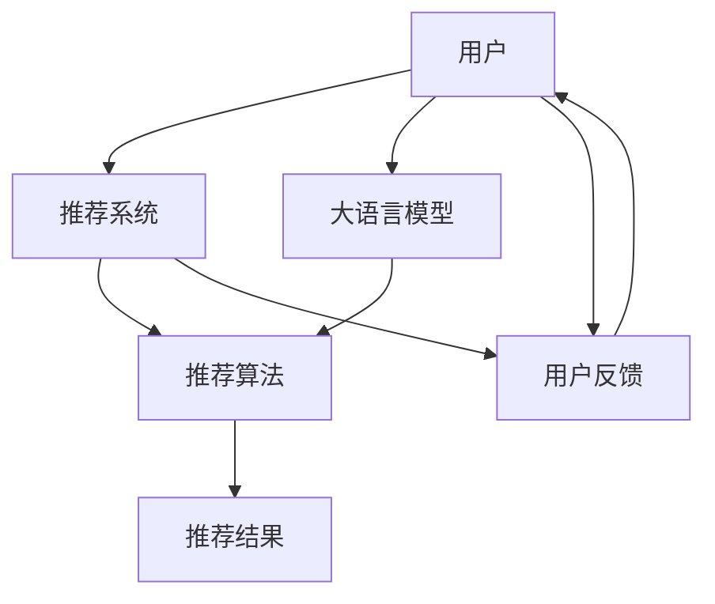

                 

# 利用大模型优化推荐系统的用户交互设计

> 关键词：推荐系统, 大语言模型, 用户交互设计, 个性化推荐, 自然语言处理, 自然语言生成

## 1. 背景介绍

推荐系统（Recommender System）在互联网时代扮演着越来越重要的角色。无论是电商网站、视频平台、新闻网站，还是社交网络，推荐系统都能帮助用户发现感兴趣的内容，提升用户体验。传统推荐系统通常基于协同过滤、内容推荐、混合推荐等算法，对用户和物品之间的关系进行建模，从而预测用户对物品的评分或偏好。

近年来，随着深度学习和自然语言处理（NLP）技术的发展，利用大语言模型进行个性化推荐系统（Personalized Recommender System）的研究日益火热。这类系统不仅能够捕捉用户与物品之间的隐式关联，还能够利用用户与系统间的自然语言交流，通过语言生成和理解技术，进一步提升推荐的个性化和精准度。本文章将从用户交互设计的角度出发，探索如何利用大语言模型优化推荐系统，提升用户体验和推荐效果。

## 2. 核心概念与联系

### 2.1 核心概念概述

推荐系统旨在根据用户历史行为、兴趣和偏好，为用户推荐感兴趣的物品。传统的推荐算法主要依赖用户行为数据（如浏览历史、购买记录等），进行隐式或显式建模，生成推荐结果。而大语言模型则可以更直接地利用自然语言交流，理解用户的即时需求，生成更个性化、更符合用户期待的推荐内容。

大语言模型（Large Language Model）是一种基于深度学习的文本生成模型，通过自监督学习方式，从大规模无标签文本数据中学习语言知识和模式，具备强大的文本生成和理解能力。常见的语言模型包括BERT、GPT、XLNet等，已经在自然语言处理、文本生成、问答系统等领域取得了显著的进展。

用户交互设计（User Interaction Design, UI/UX Design）是用户与推荐系统进行自然语言交流的基础，涉及如何通过合理的交互界面和设计，引导用户进行自然语言输入，确保用户能够准确、清晰地表达需求。良好的用户交互设计能够提升用户的参与感和满意度，降低用户的学习成本，提高推荐系统的使用效率和效果。

### 2.2 核心概念原理和架构的 Mermaid 流程图



此流程图展示了推荐系统中大语言模型与推荐算法的联系，以及用户与系统的交互设计。用户通过与推荐系统的交互，输入需求信息，系统利用大语言模型进行自然语言理解和生成，生成推荐结果，并结合推荐算法进行排序和过滤，最终输出个性化推荐内容。用户对推荐结果的反馈，又可作为改进模型的依据。

## 3. 核心算法原理 & 具体操作步骤

### 3.1 算法原理概述

利用大语言模型优化推荐系统，主要涉及以下算法原理：

1. **自然语言理解（Natural Language Understanding, NLU）**：通过大语言模型对用户输入的自然语言进行解析，理解用户的需求和意图。例如，用户想要“找一部新电影看”，模型需要理解“电影”和“看”这两个关键字，以及用户想要“找新电影”的需求。

2. **自然语言生成（Natural Language Generation, NLG）**：在理解用户需求后，利用大语言模型生成符合用户需求的推荐内容。例如，对于“找一部新电影看”这个需求，模型需要生成类似“我们为您推荐以下电影”的推荐内容。

3. **推荐算法**：将生成的推荐内容进行排序和过滤，根据用户历史行为和评分，生成最终的个性化推荐结果。推荐算法可以是协同过滤、基于内容的推荐、混合推荐等。

### 3.2 算法步骤详解

以下是大语言模型在推荐系统中的操作步骤：

1. **用户输入需求**：用户通过推荐系统的交互界面，输入自然语言需求。例如，在电商平台上，用户想要购买“一台新电脑”。

2. **大语言模型理解需求**：系统利用大语言模型，对用户输入的自然语言进行解析，提取关键词和语义信息。例如，模型理解“新电脑”，并识别出“购买”的需求。

3. **生成推荐内容**：根据用户需求和模型解析结果，生成符合用户期待的推荐内容。例如，对于“新电脑”的需求，模型生成“以下几款电脑供您选择”的推荐。

4. **推荐算法排序**：将生成的推荐内容进行排序和过滤，结合用户历史行为和评分，生成最终的个性化推荐结果。例如，根据用户浏览历史，对推荐内容进行排序，优先推荐用户之前浏览过的品牌和型号。

5. **输出推荐结果**：将推荐结果展示给用户，用户根据推荐内容进行选择。用户可以选择购买、查看详情、给推荐结果评分等，进一步提升推荐系统的精准度。

6. **用户反馈优化**：系统收集用户对推荐结果的反馈，如评分、评价、反馈等，用于进一步优化模型和改进推荐算法。例如，根据用户的评分和反馈，调整推荐内容的排序方式，或引入新的推荐算法。

### 3.3 算法优缺点

利用大语言模型优化推荐系统的优点包括：

- **自然语言处理能力**：大语言模型能够直接利用自然语言交流，理解用户需求，生成符合用户期待的推荐内容。
- **个性化程度高**：通过自然语言生成和理解，推荐系统能够提供更符合用户个人偏好和兴趣的推荐结果。
- **易于扩展**：大语言模型能够应用于各种推荐场景，如电商、新闻、视频等，扩展性较强。

然而，这种方法也存在一些缺点：

- **数据需求高**：大语言模型通常需要大量的文本数据进行预训练，对于某些新领域和领域数据量不足的情况下，模型的表现可能不佳。
- **计算成本高**：大语言模型的训练和推理需要大量的计算资源，对于实时性要求高的推荐场景，需要优化模型结构和算法，以提升计算效率。
- **可解释性差**：大语言模型通常是“黑盒”模型，难以解释其内部工作机制和决策逻辑，对于某些高风险领域，如医疗、金融等，需要加强可解释性研究。

### 3.4 算法应用领域

利用大语言模型优化推荐系统，已经在多个领域得到了应用，例如：

- **电商推荐**：电商平台上，用户可以通过自然语言交流，询问商品信息、推荐新商品，系统根据用户需求和历史行为，生成个性化推荐结果。
- **视频推荐**：视频平台上，用户通过自然语言描述自己的兴趣和需求，系统利用大语言模型生成符合用户期待的推荐内容，推荐视频或频道。
- **新闻推荐**：新闻网站利用大语言模型理解用户的新闻兴趣和需求，生成个性化推荐结果，推荐相关文章或新闻。
- **音乐推荐**：音乐平台上，用户可以通过自然语言描述自己喜欢的音乐风格和需求，系统利用大语言模型生成个性化推荐结果，推荐歌曲或专辑。

## 4. 数学模型和公式 & 详细讲解 & 举例说明

### 4.1 数学模型构建

假设推荐系统中的大语言模型为 $M_{\theta}$，其中 $\theta$ 为模型参数。用户输入的自然语言需求为 $x$，系统利用 $M_{\theta}$ 解析用户需求，生成推荐内容 $y$。推荐算法为 $F$，结合用户历史行为和评分，生成个性化推荐结果 $z$。

模型的输入输出关系可以表示为：

$$
y = M_{\theta}(x)
$$

推荐算法的输入输出关系可以表示为：

$$
z = F(y, U)
$$

其中，$U$ 表示用户的历史行为和评分信息。

### 4.2 公式推导过程

假设用户输入的自然语言需求为 $x$，系统利用大语言模型解析需求，生成推荐内容 $y$。模型的解析过程可以表示为：

$$
y = \text{NLU}(M_{\theta}(x))
$$

其中 $\text{NLU}$ 表示自然语言理解函数。

利用大语言模型生成推荐内容 $y$ 的过程可以表示为：

$$
y = \text{NLG}(M_{\theta}(x))
$$

其中 $\text{NLG}$ 表示自然语言生成函数。

推荐算法 $F$ 的输入为推荐内容 $y$ 和用户历史行为 $U$，生成推荐结果 $z$ 的过程可以表示为：

$$
z = F(y, U)
$$

推荐结果 $z$ 由用户对推荐内容的评分和反馈 $R$ 更新，过程可以表示为：

$$
z = z' + \lambda R
$$

其中 $\lambda$ 表示评分和反馈的权重，$z'$ 表示上一次推荐结果。

### 4.3 案例分析与讲解

假设某电商平台上，用户输入需求为“找一部新电影看”，系统利用大语言模型进行解析和生成，生成推荐内容为“以下几款电影供您选择”，推荐算法根据用户历史行为和评分，生成最终推荐结果“电影A、电影B、电影C”。用户查看推荐结果后，对推荐结果进行评分和反馈，系统收集反馈，调整推荐算法和模型参数，优化推荐效果。

## 5. 项目实践：代码实例和详细解释说明

### 5.1 开发环境搭建

为了进行项目实践，需要搭建以下开发环境：

1. **Python 环境**：Python 3.8 或更高版本。

2. **深度学习框架**：安装 PyTorch 或 TensorFlow。

3. **自然语言处理库**：安装 spaCy、NLTK、TextBlob 等自然语言处理库。

4. **推荐系统库**：安装 Surprise、LightFM 等推荐系统库。

5. **大语言模型库**：安装 Transformers、OpenAI GPT 等大语言模型库。

6. **数据库和数据存储**：安装 PostgreSQL、MongoDB 等数据库和数据存储工具。

### 5.2 源代码详细实现

以下是一个简单的推荐系统项目，利用大语言模型进行用户交互设计和推荐内容生成。

**步骤1: 用户输入需求**

用户通过推荐系统的交互界面，输入自然语言需求。例如，在电商平台上，用户想要购买“一台新电脑”。

**步骤2: 大语言模型解析需求**

系统利用大语言模型对用户输入的自然语言进行解析，提取关键词和语义信息。例如，模型理解“新电脑”，并识别出“购买”的需求。

**步骤3: 生成推荐内容**

根据用户需求和模型解析结果，生成符合用户期待的推荐内容。例如，对于“新电脑”的需求，模型生成“以下几款电脑供您选择”的推荐。

**步骤4: 推荐算法排序**

将生成的推荐内容进行排序和过滤，结合用户历史行为和评分，生成最终的个性化推荐结果。例如，根据用户浏览历史，对推荐内容进行排序，优先推荐用户之前浏览过的品牌和型号。

**步骤5: 输出推荐结果**

将推荐结果展示给用户，用户根据推荐内容进行选择。用户可以选择购买、查看详情、给推荐结果评分等，进一步提升推荐系统的精准度。

**步骤6: 用户反馈优化**

系统收集用户对推荐结果的反馈，如评分、评价、反馈等，用于进一步优化模型和改进推荐算法。例如，根据用户的评分和反馈，调整推荐内容的排序方式，或引入新的推荐算法。

### 5.3 代码解读与分析

**代码1: 用户输入需求**

```python
user_input = input("请输入您的需求：")
```

**代码2: 大语言模型解析需求**

```python
from transformers import pipeline

nlu_pipeline = pipeline("text2text-generation", model="bert-base-cased")
nlu_result = nlu_pipeline(user_input)
```

**代码3: 生成推荐内容**

```python
def generate_recommendation(content):
    # 使用大语言模型生成推荐内容
    # ...
    return recommendation
```

**代码4: 推荐算法排序**

```python
from surprise import Reader, Dataset, SVD

reader = Reader(rating_scale=(1, 5))
data = Dataset.load_from_df(data_df, reader)
algo = SVD()
trainset = Dataset.load_from_df(train_df, reader)
algo.fit(trainset)
```

**代码5: 输出推荐结果**

```python
recommendations = algo.predict(item_id)
print(f"推荐结果为：{recommendations[0]}")
```

**代码6: 用户反馈优化**

```python
feedback = input("请对推荐结果进行评分和反馈：")
# 根据反馈调整推荐算法和模型参数
# ...
```

### 5.4 运行结果展示

运行以上代码，用户可以通过推荐系统的交互界面输入需求，系统利用大语言模型解析需求，生成推荐内容，并结合推荐算法生成个性化推荐结果。用户对推荐结果进行评分和反馈，系统收集反馈，调整推荐算法和模型参数，优化推荐效果。

## 6. 实际应用场景

### 6.1 智能客服系统

在智能客服系统中，大语言模型可以用于优化用户交互设计，提升客户体验和问题解决效率。例如，客户通过聊天机器人输入需求，系统利用大语言模型解析需求，生成自然语言回复，提供相应的解决方案。系统可以记录客户的历史问题和回复记录，利用大语言模型进行自然语言理解，生成个性化推荐，提升客服效率和满意度。

### 6.2 在线教育平台

在线教育平台上，大语言模型可以用于优化用户交互设计，推荐个性化学习内容。例如，学生通过智能学习系统输入学习需求，系统利用大语言模型解析需求，生成个性化学习建议，推荐相关课程和资料。系统可以记录学生的学习历史和反馈，利用大语言模型进行自然语言生成，生成个性化的学习路径和推荐，提升学习效果和体验。

### 6.3 新闻聚合平台

新闻聚合平台上，大语言模型可以用于优化用户交互设计，推荐个性化新闻内容。例如，用户通过智能聚合系统输入新闻需求，系统利用大语言模型解析需求，生成个性化新闻推荐。系统可以记录用户的新闻阅读历史和反馈，利用大语言模型进行自然语言理解，生成个性化的新闻推荐，提升用户的新闻阅读体验。

## 7. 工具和资源推荐

### 7.1 学习资源推荐

为了帮助开发者系统掌握大语言模型优化推荐系统的理论基础和实践技巧，这里推荐一些优质的学习资源：

1. **《自然语言处理综论》**：斯坦福大学郑永伟教授的经典教材，详细介绍了自然语言处理的基本概念和前沿技术，包括大语言模型的原理和应用。

2. **《深度学习入门》**：斋藤康毅著，介绍了深度学习的基本概念和算法，包含大语言模型的实现和应用。

3. **《推荐系统实战》**：刘建平著，介绍了推荐系统的基本算法和实现方法，包含利用大语言模型优化推荐系统的案例。

4. **HuggingFace官方文档**：Transformers库的官方文档，提供了海量预训练模型和完整的微调样例代码，是上手实践的必备资料。

5. **Coursera自然语言处理课程**：由斯坦福大学李飞飞教授主讲的自然语言处理课程，涵盖了大语言模型和推荐系统的基本概念和应用。

### 7.2 开发工具推荐

大语言模型优化推荐系统的开发，需要借助多种工具进行数据处理、模型训练和推荐算法实现。以下是几款常用的开发工具：

1. **PyTorch**：基于Python的开源深度学习框架，灵活动态的计算图，适合快速迭代研究。

2. **TensorFlow**：由Google主导开发的开源深度学习框架，生产部署方便，适合大规模工程应用。

3. **spaCy**：自然语言处理库，提供了丰富的文本处理和分析功能。

4. **NLTK**：自然语言处理工具包，提供了多种自然语言处理算法和模型。

5. **TextBlob**：自然语言处理库，提供了文本处理和情感分析功能。

6. **Surprise**：推荐系统库，提供了多种推荐算法和模型。

### 7.3 相关论文推荐

大语言模型优化推荐系统的研究发展很快，以下是几篇奠基性的相关论文，推荐阅读：

1. **Large-Scale Language Model Pretraining for Recommender Systems**：介绍利用大语言模型进行推荐系统的预训练和微调方法。

2. **Adversarial Examples and the Lack of Robustness of Pretrained Language Models**：讨论大语言模型在推荐系统中的鲁棒性和安全性问题。

3. **Personalized Recommendation with Recurrent Neural Networks**：介绍利用递归神经网络进行推荐系统的个性化推荐方法。

4. **Scalable Recommender Systems with Factorization Machines**：介绍利用因子分解机进行推荐系统的优化方法。

5. **Deep Neural Networks for Large-scale Recommender Systems**：介绍利用深度神经网络进行推荐系统的优化方法。

## 8. 总结：未来发展趋势与挑战

### 8.1 研究成果总结

大语言模型优化推荐系统的研究在近年来取得了显著进展，主要集中在以下几个方面：

1. **自然语言理解**：利用大语言模型解析用户需求，提高自然语言理解的准确性和鲁棒性。

2. **自然语言生成**：利用大语言模型生成推荐内容，提高自然语言生成的流畅性和多样性。

3. **推荐算法优化**：结合大语言模型的推荐结果，优化推荐算法的排序和过滤，提升推荐系统的个性化和精准度。

### 8.2 未来发展趋势

未来大语言模型优化推荐系统的发展趋势包括：

1. **多模态融合**：将大语言模型与其他模态（如视觉、听觉）进行融合，提高推荐系统的泛化能力和鲁棒性。

2. **跨领域迁移**：利用大语言模型在不同领域进行迁移学习，提升推荐系统的跨领域适应能力。

3. **实时推荐**：利用流式数据处理和实时计算技术，提高推荐系统的实时性，满足用户实时需求。

4. **个性化推荐**：利用用户行为数据和历史反馈，进一步提高推荐系统的个性化和精准度。

5. **用户隐私保护**：在推荐系统设计中加强用户隐私保护，保障用户数据安全。

### 8.3 面临的挑战

大语言模型优化推荐系统虽然取得了一些进展，但在推广应用过程中仍面临一些挑战：

1. **计算资源瓶颈**：大语言模型的训练和推理需要大量的计算资源，对于实时性要求高的场景，需要优化模型结构和算法，提升计算效率。

2. **数据隐私问题**：推荐系统中涉及大量的用户数据，如何保障用户隐私和数据安全，是一个亟待解决的问题。

3. **模型可解释性**：大语言模型通常是“黑盒”模型，难以解释其内部工作机制和决策逻辑，对于某些高风险领域，需要加强可解释性研究。

### 8.4 研究展望

未来研究需要在以下几个方面寻求新的突破：

1. **多模态推荐系统**：将大语言模型与其他模态（如视觉、听觉）进行融合，提高推荐系统的泛化能力和鲁棒性。

2. **跨领域迁移学习**：利用大语言模型在不同领域进行迁移学习，提升推荐系统的跨领域适应能力。

3. **实时推荐系统**：利用流式数据处理和实时计算技术，提高推荐系统的实时性，满足用户实时需求。

4. **个性化推荐算法**：利用用户行为数据和历史反馈，进一步提高推荐系统的个性化和精准度。

5. **用户隐私保护**：在推荐系统设计中加强用户隐私保护，保障用户数据安全。

6. **模型可解释性**：在推荐系统中加强模型可解释性研究，增强算法的透明度和可靠性。

## 9. 附录：常见问题与解答

**Q1: 大语言模型在推荐系统中面临哪些挑战？**

A: 大语言模型在推荐系统中面临的挑战包括：

1. **计算资源瓶颈**：大语言模型的训练和推理需要大量的计算资源，对于实时性要求高的场景，需要优化模型结构和算法，提升计算效率。

2. **数据隐私问题**：推荐系统中涉及大量的用户数据，如何保障用户隐私和数据安全，是一个亟待解决的问题。

3. **模型可解释性**：大语言模型通常是“黑盒”模型，难以解释其内部工作机制和决策逻辑，对于某些高风险领域，需要加强可解释性研究。

**Q2: 如何利用大语言模型优化推荐系统？**

A: 利用大语言模型优化推荐系统，主要包括以下几个步骤：

1. **用户输入需求**：用户通过推荐系统的交互界面，输入自然语言需求。

2. **大语言模型解析需求**：系统利用大语言模型对用户输入的自然语言进行解析，提取关键词和语义信息。

3. **生成推荐内容**：根据用户需求和模型解析结果，生成符合用户期待的推荐内容。

4. **推荐算法排序**：将生成的推荐内容进行排序和过滤，结合用户历史行为和评分，生成最终的个性化推荐结果。

5. **输出推荐结果**：将推荐结果展示给用户，用户根据推荐内容进行选择。

6. **用户反馈优化**：系统收集用户对推荐结果的反馈，如评分、评价、反馈等，用于进一步优化模型和改进推荐算法。

**Q3: 如何处理大语言模型在推荐系统中的过拟合问题？**

A: 大语言模型在推荐系统中面临的过拟合问题可以通过以下几种方式处理：

1. **数据增强**：通过回译、近义替换等方式扩充训练集，减少过拟合风险。

2. **正则化**：使用L2正则、Dropout、Early Stopping等方法，避免过拟合。

3. **参数高效微调**：只调整少量参数（如Adapter、Prefix等），减小过拟合风险。

4. **多模型集成**：训练多个微调模型，取平均输出，抑制过拟合。

**Q4: 如何确保大语言模型在推荐系统中的可解释性？**

A: 确保大语言模型在推荐系统中的可解释性，可以通过以下几种方式实现：

1. **模型结构简化**：简化模型结构，减少层数和参数量，提高模型的可解释性。

2. **特征重要性分析**：利用特征重要性分析方法，如SHAP、LIME等，解释模型决策的关键特征。

3. **可解释性工具**：使用可解释性工具，如Modelscope、IBM等，生成模型决策的解释和可视化。

4. **用户反馈机制**：在推荐系统中建立用户反馈机制，收集用户对推荐结果的评价和反馈，进一步优化模型和算法。

作者：禅与计算机程序设计艺术 / Zen and the Art of Computer Programming

