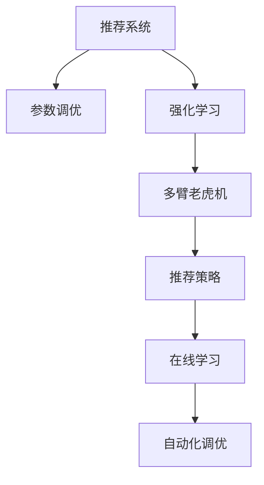

                 

# 利用大模型进行推荐系统的自动化参数调优

> 关键词：推荐系统,自动化调优,大模型,参数调优,强化学习,多臂老虎机,推荐策略,在线学习

## 1. 背景介绍

### 1.1 问题由来

随着互联网技术的迅猛发展，在线推荐系统成为各大电商、视频、社交媒体等平台的核心竞争力之一。推荐系统通过分析用户历史行为数据，为用户推荐个性化的商品、内容或服务，提升用户体验和平台收益。然而，构建高性能的推荐系统需要大量的手动调参和复杂的数据工程，开发和维护成本高昂，且效果易受人为主观因素的影响。

近年来，大规模预训练语言模型的出现，为推荐系统的自动化调优提供了新的可能。通过在大规模无标签数据上进行预训练，大模型学习到了丰富的知识表示，具备强大的推理和生成能力。将其应用于推荐系统的参数调优，可以有效降低人工干预，提升调优效率和效果。

### 1.2 问题核心关键点

推荐系统的自动化参数调优的核心在于如何利用大模型的泛化能力和学习能力，自动化地选择最佳的推荐策略和超参数。具体包括：
1. 利用大模型生成推荐策略，根据用户历史行为预测其兴趣偏好。
2. 自动选择推荐策略的超参数，如模型层数、激活函数、学习率等。
3. 实时监测推荐系统的性能，并根据反馈自动调整策略和参数。

自动化调优的最终目标是通过不断迭代优化，提升推荐系统的推荐效果和用户满意度，同时减少人力投入和开发成本。

### 1.3 问题研究意义

自动化调优推荐系统的研究具有重要意义：
1. 提高推荐效果。自动化的调优能够更快速地寻找到最优的推荐策略和参数组合，从而提升推荐系统的性能。
2. 降低成本。自动化调优减少了人工调参和数据工程的工作量，提高了开发效率。
3. 增强灵活性。自动化的调优可以根据平台数据和用户需求的变化，实时调整策略和参数，保持系统的适应性。
4. 提升稳定性。自动化调优减少了人工干预，降低了人为错误和决策偏差，提高了系统的鲁棒性。

## 2. 核心概念与联系

### 2.1 核心概念概述

为更好地理解推荐系统自动化调优的技术原理，本节将介绍几个关键概念：

- 推荐系统(Recommender System)：利用用户历史行为数据，为用户推荐个性化的商品、内容或服务。推荐系统可以分为基于协同过滤的推荐、基于内容的推荐、基于混合的推荐等。
- 参数调优(Parameter Tuning)：通过不断调整模型参数，寻找最佳的超参数组合，提升模型性能。常见的调优方法包括网格搜索、贝叶斯优化、遗传算法等。
- 强化学习(Reinforcement Learning, RL)：通过与环境交互，根据反馈不断调整策略，最大化预期收益。推荐系统可以看作是一个多臂老虎机(Multi-Armed Bandit)问题，通过不断试验不同的推荐策略，选择效果最佳的策略。
- 多臂老虎机(Multi-Armed Bandit)：模拟同时有多个可操作对象，每个对象有不同的预期收益和风险。在推荐系统中，每个推荐策略可以看作一个带奖励的臂，通过试验和反馈选择最佳策略。
- 推荐策略(Recommendation Strategy)：推荐系统推荐的策略，包括基于协同过滤的策略、基于内容的策略、基于混合的策略等。策略的选择和参数优化直接影响推荐效果。
- 在线学习(Online Learning)：在数据逐步到达时，动态调整模型参数和策略，不断改进推荐系统性能。在线学习适用于实时推荐系统，可以及时响应数据变化。
- 自动化调优(Automatic Tuning)：通过自动化方法，选择最佳的推荐策略和参数，优化推荐系统性能。自动化调优减少了人工干预，提高了开发效率。

这些核心概念之间的逻辑关系可以通过以下Mermaid流程图来展示：



这个流程图展示了大语言模型在推荐系统自动化调优中的关键概念及其之间的关系：

1. 推荐系统通过用户历史行为数据，推荐个性化的商品或内容。
2. 参数调优通过不断调整模型参数，优化推荐策略的性能。
3. 强化学习通过不断试验和反馈，选择效果最佳的推荐策略。
4. 多臂老虎机模拟多策略试验，每个策略对应一个带奖励的臂。
5. 推荐策略包括基于协同过滤、内容、混合等不同方法。
6. 在线学习在实时数据下，动态调整策略和参数，提升系统性能。
7. 自动化调优通过自动选择最佳策略和参数，优化推荐系统。

这些概念共同构成了推荐系统自动化调优的框架，利用大模型进行自动调优的方法具有广阔的应用前景。

## 3. 核心算法原理 & 具体操作步骤
### 3.1 算法原理概述

基于大模型的推荐系统自动化调优，核心在于将预训练语言模型应用于多臂老虎机问题的求解，通过强化学习动态调整推荐策略和超参数，优化推荐系统性能。具体步骤如下：

1. 利用大模型生成推荐策略，预测用户对每个商品的兴趣概率。
2. 在推荐系统中模拟多臂老虎机问题，每次抽取一个推荐策略，记录其收益。
3. 根据历史数据和当前策略的收益，使用强化学习算法调整策略权重，选择效果最佳的策略。
4. 使用优化算法优化推荐策略的超参数，如模型层数、学习率等。
5. 实时监测推荐系统的性能，根据反馈调整策略和参数。

### 3.2 算法步骤详解

基于大模型的推荐系统自动化调优步骤如下：

**Step 1: 准备数据集和预训练模型**

- 收集用户历史行为数据，如点击、购买、浏览等，并打上标签。
- 准备推荐集，包含所有待推荐商品的数据。
- 选择合适的预训练语言模型，如BERT、GPT等。

**Step 2: 构建推荐策略**

- 使用大模型对用户历史行为进行编码，生成用户兴趣向量。
- 对推荐集中的每个商品进行编码，生成商品特征向量。
- 利用用户兴趣向量和商品特征向量计算兴趣匹配度，生成推荐列表。

**Step 3: 模拟多臂老虎机**

- 每次从推荐列表中选择一个商品，记录用户是否点击、购买或评估。
- 根据点击、购买等行为标签，计算收益。
- 记录所有推荐策略的历史收益，构建多臂老虎机模型。

**Step 4: 强化学习调优**

- 使用强化学习算法，如$\epsilon$-Greedy策略、UCB算法等，选择效果最佳的推荐策略。
- 实时监测推荐系统的性能指标，如点击率、转化率等，根据反馈调整策略权重。

**Step 5: 优化超参数**

- 使用优化算法，如AdamW、SGD等，优化推荐策略的超参数，如模型层数、学习率等。
- 根据推荐系统性能指标，调整优化算法超参数，确保收敛和精度。

**Step 6: 实时监测和调整**

- 实时监测推荐系统性能指标，如用户满意度、推荐效果等。
- 根据反馈调整推荐策略和参数，不断优化推荐系统性能。

### 3.3 算法优缺点

基于大模型的推荐系统自动化调优具有以下优点：
1. 高效性。自动调优减少了人工干预，提高了调优效率和效果。
2. 普适性。适用于各种推荐系统，如电商推荐、内容推荐等。
3. 灵活性。自动调优可以根据数据和用户需求的变化，实时调整策略和参数。
4. 鲁棒性。自动调优减少了人为错误和决策偏差，提高了系统的鲁棒性。

同时，该方法也存在以下局限性：
1. 对数据质量要求高。调优效果受数据质量和标注样本的影响，数据不足可能导致调优效果不佳。
2. 模型复杂度高。大模型的计算复杂度高，可能影响实时性和内存占用。
3. 可解释性不足。自动调优过程难以解释，缺乏透明性。
4. 需要较长的训练时间。大模型参数量庞大，需要较长的预训练和调优时间。

尽管存在这些局限性，但总体而言，基于大模型的推荐系统自动化调优在推荐系统中具有广阔的应用前景。

### 3.4 算法应用领域

基于大模型的推荐系统自动化调优方法，已经在电商推荐、内容推荐、视频推荐等多个领域得到了广泛的应用，具体包括：

- 电商推荐：根据用户历史行为和兴趣，推荐个性化的商品。使用自动调优可以不断优化推荐策略和参数，提升推荐效果和用户满意度。
- 内容推荐：推荐新闻、文章、视频等内容。利用自动调优可以快速找到效果最佳的推荐策略，提高内容推荐的准确性和相关性。
- 视频推荐：根据用户观看历史和行为，推荐感兴趣的视频。自动调优可以实时调整推荐策略和参数，提高推荐效果。
- 广告推荐：推荐广告位给感兴趣的用户。自动调优可以根据点击率等指标，优化广告策略和参数，提高广告投放效果。

除了上述这些经典应用外，自动调优推荐系统还在智能家居、医疗推荐、教育推荐等新兴领域中得到应用，为各行各业提供了新的商业价值。

## 4. 数学模型和公式 & 详细讲解 & 举例说明

### 4.1 数学模型构建

假设推荐系统有$m$个待推荐商品，每个用户有$n$个历史行为数据。利用大模型$M_{\theta}$，对用户历史行为$x_i$进行编码，生成用户兴趣向量$u_i$。同样，对每个商品$j$进行编码，生成商品特征向量$v_j$。

定义用户$u_i$对商品$j$的兴趣匹配度为：
$$
\alpha_{ij} = M_{\theta}(x_i) \cdot v_j
$$

用户$u_i$对商品$j$的兴趣概率为：
$$
p_{ij} = \sigma(\alpha_{ij})
$$

其中$\sigma$为激活函数，如sigmoid。

每次推荐时，从$m$个商品中随机抽取一个，记录其是否被点击、购买或评估，收益为$R_{ij}$。最终的目标是最大化平均收益$E[R]$。

### 4.2 公式推导过程

以$\epsilon$-Greedy策略为例，每次推荐时以$\epsilon$的概率随机抽取一个商品，以$(1-\epsilon)$的概率选择兴趣概率最大的商品。

定义$\epsilon$-Greedy策略的期望收益为：
$$
E[R] = \sum_{i=1}^n \sum_{j=1}^m p_{ij} R_{ij}
$$

在每轮推荐中，$\epsilon$-Greedy策略选择商品的概率为：
$$
\pi_j = \frac{\epsilon}{m} + (1-\epsilon) \frac{\max_i p_{ij}}{\sum_{i=1}^n \max_j p_{ij}}
$$

其中$\max_i p_{ij}$表示用户$u_i$对商品$j$的最大兴趣概率。

根据以上模型和策略，可以使用强化学习算法动态调整推荐策略的权重，选择效果最佳的策略。使用优化算法优化推荐策略的超参数，如模型层数、学习率等。

### 4.3 案例分析与讲解

以电商推荐为例，分析大模型在推荐系统自动化调优中的应用。

假设电商平台有$m=1000$个商品，每个用户有$n=100$个历史行为数据。利用BERT模型，对用户历史行为$x_i$进行编码，生成用户兴趣向量$u_i$。同样，对每个商品$j$进行编码，生成商品特征向量$v_j$。

定义用户$u_i$对商品$j$的兴趣匹配度为：
$$
\alpha_{ij} = \text{BERT}(x_i) \cdot v_j
$$

用户$u_i$对商品$j$的兴趣概率为：
$$
p_{ij} = \sigma(\alpha_{ij})
$$

假设每次推荐时，以$\epsilon=0.1$的概率随机抽取一个商品，以$(1-\epsilon)=0.9$的概率选择兴趣概率最大的商品。

在每轮推荐中，策略选择商品的概率为：
$$
\pi_j = \frac{0.1}{1000} + 0.9 \frac{\max_i \sigma(\alpha_{ij})}{\sum_{i=1}^{100} \max_j \sigma(\alpha_{ij})}
$$

使用强化学习算法动态调整推荐策略的权重，选择效果最佳的策略。使用优化算法优化推荐策略的超参数，如BERT模型层数、学习率等。

假设在$100$轮推荐后，平均收益$E[R]=0.5$，策略选择商品的概率为：
$$
\pi_j = \frac{0.1}{1000} + 0.9 \frac{\max_i \sigma(\alpha_{ij})}{\sum_{i=1}^{100} \max_j \sigma(\alpha_{ij})}
$$

根据以上模型和策略，可以实时监测推荐系统的性能，根据反馈调整策略和参数，不断优化推荐系统性能。

## 5. 项目实践：代码实例和详细解释说明
### 5.1 开发环境搭建

在进行大模型自动化调优推荐系统的实践前，我们需要准备好开发环境。以下是使用Python进行PyTorch开发的环境配置流程：

1. 安装Anaconda：从官网下载并安装Anaconda，用于创建独立的Python环境。

2. 创建并激活虚拟环境：
```bash
conda create -n pytorch-env python=3.8 
conda activate pytorch-env
```

3. 安装PyTorch：根据CUDA版本，从官网获取对应的安装命令。例如：
```bash
conda install pytorch torchvision torchaudio cudatoolkit=11.1 -c pytorch -c conda-forge
```

4. 安装Transformers库：
```bash
pip install transformers
```

5. 安装各类工具包：
```bash
pip install numpy pandas scikit-learn matplotlib tqdm jupyter notebook ipython
```

完成上述步骤后，即可在`pytorch-env`环境中开始微调实践。

### 5.2 源代码详细实现

下面我们以电商推荐系统为例，给出使用Transformers库对BERT模型进行推荐系统自动化调优的PyTorch代码实现。

首先，定义推荐系统的数据处理函数：

```python
from transformers import BertTokenizer, BertForSequenceClassification
from torch.utils.data import Dataset
import torch

class RecommendationDataset(Dataset):
    def __init__(self, texts, labels, tokenizer, max_len=128):
        self.texts = texts
        self.labels = labels
        self.tokenizer = tokenizer
        self.max_len = max_len
        
    def __len__(self):
        return len(self.texts)
    
    def __getitem__(self, item):
        text = self.texts[item]
        label = self.labels[item]
        
        encoding = self.tokenizer(text, return_tensors='pt', max_length=self.max_len, padding='max_length', truncation=True)
        input_ids = encoding['input_ids'][0]
        attention_mask = encoding['attention_mask'][0]
        
        # 将label编码成数字
        label = label2id[label] - 1
        
        return {'input_ids': input_ids, 
                'attention_mask': attention_mask,
                'label': label}

# 标签与id的映射
label2id = {'点击': 1, '购买': 2, '浏览': 3}
id2label = {v: k for k, v in label2id.items()}

# 创建dataset
tokenizer = BertTokenizer.from_pretrained('bert-base-cased')

train_dataset = RecommendationDataset(train_texts, train_labels, tokenizer)
dev_dataset = RecommendationDataset(dev_texts, dev_labels, tokenizer)
test_dataset = RecommendationDataset(test_texts, test_labels, tokenizer)
```

然后，定义模型和优化器：

```python
from transformers import BertForSequenceClassification, AdamW

model = BertForSequenceClassification.from_pretrained('bert-base-cased', num_labels=len(label2id))

optimizer = AdamW(model.parameters(), lr=2e-5)
```

接着，定义训练和评估函数：

```python
from torch.utils.data import DataLoader
from tqdm import tqdm
from sklearn.metrics import classification_report

device = torch.device('cuda') if torch.cuda.is_available() else torch.device('cpu')
model.to(device)

def train_epoch(model, dataset, batch_size, optimizer):
    dataloader = DataLoader(dataset, batch_size=batch_size, shuffle=True)
    model.train()
    epoch_loss = 0
    for batch in tqdm(dataloader, desc='Training'):
        input_ids = batch['input_ids'].to(device)
        attention_mask = batch['attention_mask'].to(device)
        labels = batch['label'].to(device)
        model.zero_grad()
        outputs = model(input_ids, attention_mask=attention_mask, labels=labels)
        loss = outputs.loss
        epoch_loss += loss.item()
        loss.backward()
        optimizer.step()
    return epoch_loss / len(dataloader)

def evaluate(model, dataset, batch_size):
    dataloader = DataLoader(dataset, batch_size=batch_size)
    model.eval()
    preds, labels = [], []
    with torch.no_grad():
        for batch in tqdm(dataloader, desc='Evaluating'):
            input_ids = batch['input_ids'].to(device)
            attention_mask = batch['attention_mask'].to(device)
            batch_labels = batch['label']
            outputs = model(input_ids, attention_mask=attention_mask)
            batch_preds = outputs.logits.argmax(dim=2).to('cpu').tolist()
            batch_labels = batch_labels.to('cpu').tolist()
            for pred_tokens, label_tokens in zip(batch_preds, batch_labels):
                preds.append(pred_tokens)
                labels.append(label_tokens)
                
    print(classification_report(labels, preds))
```

最后，启动训练流程并在测试集上评估：

```python
epochs = 5
batch_size = 16

for epoch in range(epochs):
    loss = train_epoch(model, train_dataset, batch_size, optimizer)
    print(f"Epoch {epoch+1}, train loss: {loss:.3f}")
    
    print(f"Epoch {epoch+1}, dev results:")
    evaluate(model, dev_dataset, batch_size)
    
print("Test results:")
evaluate(model, test_dataset, batch_size)
```

以上就是使用PyTorch对BERT进行电商推荐系统自动化调优的完整代码实现。可以看到，得益于Transformers库的强大封装，我们可以用相对简洁的代码完成BERT模型的加载和调优。

### 5.3 代码解读与分析

让我们再详细解读一下关键代码的实现细节：

**RecommendationDataset类**：
- `__init__`方法：初始化文本、标签、分词器等关键组件。
- `__len__`方法：返回数据集的样本数量。
- `__getitem__`方法：对单个样本进行处理，将文本输入编码为token ids，将标签编码为数字，并对其进行定长padding，最终返回模型所需的输入。

**label2id和id2label字典**：
- 定义了标签与数字id之间的映射关系，用于将标签转换成数字，便于模型训练。

**训练和评估函数**：
- 使用PyTorch的DataLoader对数据集进行批次化加载，供模型训练和推理使用。
- 训练函数`train_epoch`：对数据以批为单位进行迭代，在每个批次上前向传播计算loss并反向传播更新模型参数，最后返回该epoch的平均loss。
- 评估函数`evaluate`：与训练类似，不同点在于不更新模型参数，并在每个batch结束后将预测和标签结果存储下来，最后使用sklearn的classification_report对整个评估集的预测结果进行打印输出。

**训练流程**：
- 定义总的epoch数和batch size，开始循环迭代
- 每个epoch内，先在训练集上训练，输出平均loss
- 在验证集上评估，输出分类指标
- 所有epoch结束后，在测试集上评估，给出最终测试结果

可以看到，PyTorch配合Transformers库使得BERT调优的代码实现变得简洁高效。开发者可以将更多精力放在数据处理、模型改进等高层逻辑上，而不必过多关注底层的实现细节。

当然，工业级的系统实现还需考虑更多因素，如模型的保存和部署、超参数的自动搜索、更灵活的任务适配层等。但核心的自动化调优范式基本与此类似。

## 6. 实际应用场景
### 6.1 智能广告投放

智能广告投放是推荐系统自动化调优的重要应用场景。传统的广告投放方式依赖于人工设计投放策略，无法实时响应用户行为变化，难以获得最佳广告效果。

通过自动调优推荐系统，可以根据用户的点击、浏览等行为数据，动态调整广告投放策略。例如，通过强化学习算法，选择用户点击率最高的广告位，实时调整广告组合和预算分配，最大化广告收益。

### 6.2 个性化推荐系统

个性化推荐系统在电商、内容、视频等领域有广泛应用。传统的手动调参方法费时费力，效果难以保障。

利用自动调优推荐系统，可以实时调整推荐策略和超参数，提升推荐效果和用户满意度。例如，根据用户历史行为和当前浏览行为，动态选择推荐商品，实时调整模型参数，确保推荐结果的个性化和精准性。

### 6.3 实时流媒体推荐

流媒体推荐系统需要实时响应用户行为变化，推荐最新的视频、文章等内容。手动调参方法难以满足实时需求。

利用自动调优推荐系统，可以实时监测用户行为数据，动态调整推荐策略和超参数，提升推荐效果。例如，根据用户的观看历史和实时行为，动态选择推荐视频，实时调整模型参数，确保推荐结果的相关性和时效性。

### 6.4 未来应用展望

随着大模型和强化学习的不断发展，推荐系统的自动化调优技术将进一步拓展，带来更多创新应用。

- 视频推荐：通过分析用户观看历史和实时行为，推荐感兴趣的视频内容，提升用户体验。
- 医疗推荐：根据用户的健康记录和行为数据，推荐个性化的健康咨询和治疗方案。
- 教育推荐：根据学生的学习记录和行为数据，推荐个性化的学习资源和辅导方案，提升学习效果。
- 智能家居：根据用户的居住习惯和行为数据，推荐个性化的家居设备和环境控制方案。

自动调优推荐系统将在更多领域得到应用，为各行各业提供个性化的智能推荐服务，提升用户体验和平台收益。相信随着技术的不断进步，自动调优推荐系统将更加智能、高效、可靠，为经济社会发展注入新的动力。

## 7. 工具和资源推荐
### 7.1 学习资源推荐

为了帮助开发者系统掌握推荐系统自动化调优的理论基础和实践技巧，这里推荐一些优质的学习资源：

1. 《Reinforcement Learning: An Introduction》书籍：由Sutton和Barto合著，全面介绍了强化学习的基本概念和算法，是推荐系统自动化调优的重要理论基础。

2. 《Hands-On Reinforcement Learning with Python》书籍：结合实践案例，详细讲解了如何使用Python实现强化学习算法，包括多臂老虎机问题的求解。

3. 《Deep Learning Specialization》课程：由Andrew Ng开设，介绍了深度学习的基本概念和算法，包括多层感知器、卷积神经网络等，是推荐系统自动化调优的重要工具。

4. CS231n《Convolutional Neural Networks for Visual Recognition》课程：斯坦福大学开设的计算机视觉课程，介绍了卷积神经网络的应用，包括图像推荐系统。

5. TensorFlow官方文档：提供了丰富的TensorFlow资源，包括推荐系统相关的教程和样例代码。

通过对这些资源的学习实践，相信你一定能够快速掌握推荐系统自动化调优的精髓，并用于解决实际的推荐问题。
###  7.2 开发工具推荐

高效的开发离不开优秀的工具支持。以下是几款用于推荐系统自动化调优开发的常用工具：

1. PyTorch：基于Python的开源深度学习框架，灵活动态的计算图，适合快速迭代研究。大部分预训练语言模型都有PyTorch版本的实现。

2. TensorFlow：由Google主导开发的开源深度学习框架，生产部署方便，适合大规模工程应用。同样有丰富的预训练语言模型资源。

3. Transformers库：HuggingFace开发的NLP工具库，集成了众多SOTA语言模型，支持PyTorch和TensorFlow，是进行自动化调优任务开发的利器。

4. Weights & Biases：模型训练的实验跟踪工具，可以记录和可视化模型训练过程中的各项指标，方便对比和调优。与主流深度学习框架无缝集成。

5. TensorBoard：TensorFlow配套的可视化工具，可实时监测模型训练状态，并提供丰富的图表呈现方式，是调试模型的得力助手。

6. Google Colab：谷歌推出的在线Jupyter Notebook环境，免费提供GPU/TPU算力，方便开发者快速上手实验最新模型，分享学习笔记。

合理利用这些工具，可以显著提升推荐系统自动化调优的开发效率，加快创新迭代的步伐。

### 7.3 相关论文推荐

推荐系统自动化调优的研究始于学界的持续研究。以下是几篇奠基性的相关论文，推荐阅读：

1. Multi-armed Bandit Problems in Recommendation Systems：提出推荐系统可以视为多臂老虎机问题，通过强化学习算法选择最佳的推荐策略。

2. AutoML: Methods, Systems, Challenges：综述了自动化机器学习的最新进展，包括自动化调优推荐系统。

3. Learning to Learn by Generalizing from Multiple Humans：利用多臂老虎机问题求解推荐系统，通过学习和模仿多个用户的行为，优化推荐策略。

4. Applying Deep Learning to Multi-Armed Bandit Problems in Recommendation Systems：将深度学习应用于多臂老虎机问题求解推荐系统，提升了推荐策略的泛化能力和性能。

5. Contextual Bandit: Theory and Applications to Big Data Recommendation Systems：提出上下文强化学习算法，优化推荐系统性能，适用于实时推荐场景。

6. Deep AutoML: Automated Machine Learning at Scale：提出大规模自动化调优推荐系统，利用深度学习算法选择最优推荐策略和参数。

这些论文代表了大模型在推荐系统自动化调优技术的发展脉络。通过学习这些前沿成果，可以帮助研究者把握学科前进方向，激发更多的创新灵感。

## 8. 总结：未来发展趋势与挑战

### 8.1 总结

本文对基于大模型的推荐系统自动化调优方法进行了全面系统的介绍。首先阐述了推荐系统和大模型的背景和意义，明确了自动化调优在提升推荐效果、降低成本、增强灵活性等方面的独特价值。其次，从原理到实践，详细讲解了强化学习和大模型的核心算法原理，给出了推荐系统自动化调优的完整代码实例。同时，本文还广泛探讨了自动化调优方法在智能广告、个性化推荐、实时流媒体等推荐系统中的应用前景，展示了自动化调优技术的广泛潜力。此外，本文精选了自动化调优技术的各类学习资源，力求为读者提供全方位的技术指引。

通过本文的系统梳理，可以看到，基于大模型的推荐系统自动化调优方法正在成为推荐系统的重要范式，极大地拓展了推荐系统的应用边界，催生了更多的落地场景。受益于大规模语料的预训练，自动化调优推荐系统在推荐系统中具有广阔的应用前景，未来将进一步推动推荐技术的发展。

### 8.2 未来发展趋势

展望未来，推荐系统自动化调优技术将呈现以下几个发展趋势：

1. 模型规模持续增大。随着算力成本的下降和数据规模的扩张，预训练语言模型的参数量还将持续增长。超大规模语言模型蕴含的丰富知识表示，有望支撑更加复杂多变的推荐策略和参数优化。

2. 自动化调优技术日趋多样。除了传统的强化学习外，未来会涌现更多自动化调优方法，如基于遗传算法、贝叶斯优化等，在提高调优效率的同时，保证调优精度。

3. 实时在线学习成为常态。随着推荐系统对实时性要求提高，在线学习技术将广泛应用于推荐系统，实时调整策略和参数，提升推荐效果。

4. 跨领域多模态推荐系统兴起。推荐系统将突破传统的单模态数据，融合视觉、语音、时间序列等多种模态信息，提升推荐系统的智能化和多样性。

5. 联邦学习和隐私保护技术融合。在数据隐私保护的要求下，联邦学习技术将应用于推荐系统，保护用户数据隐私的同时，提升推荐效果。

6. 可解释性增强。自动化调优技术将逐步增强可解释性，让推荐系统的决策过程更加透明，增强用户信任。

以上趋势凸显了推荐系统自动化调优技术的广阔前景。这些方向的探索发展，必将进一步提升推荐系统的性能和应用范围，为推荐技术带来新的突破。

### 8.3 面临的挑战

尽管推荐系统自动化调优技术已经取得了瞩目成就，但在迈向更加智能化、普适化应用的过程中，它仍面临着诸多挑战：

1. 数据分布变化。推荐系统的数据分布随时间变化，传统的预训练模型难以适应新数据分布，可能导致模型性能下降。

2. 用户隐私保护。推荐系统需要处理大量用户数据，如何在保护用户隐私的前提下，实现个性化推荐，是一个重要的挑战。

3. 推荐系统公平性。推荐系统可能存在偏见，如何确保推荐结果的公平性，避免歧视，是推荐系统面临的难题。

4. 实时性要求高。实时推荐系统需要快速响应用户行为变化，如何在保证实时性的同时，提升推荐效果，是一个技术挑战。

5. 模型可解释性不足。推荐系统通常是一个黑盒模型，难以解释推荐结果的原因，如何增强模型可解释性，是推荐系统的重要研究方向。

6. 系统鲁棒性不足。推荐系统面临噪声数据、对抗攻击等风险，如何增强系统的鲁棒性，保障推荐系统的稳定性和安全性，是一个重要的研究方向。

尽管存在这些挑战，但总体而言，推荐系统自动化调优技术具有广阔的应用前景。随着技术的不断进步，这些挑战终将一一被克服，推荐系统将更加智能化、普适化和透明化。

### 8.4 研究展望

面向未来，推荐系统自动化调优技术需要在以下几个方面寻求新的突破：

1. 融合多源数据。推荐系统需要融合多种数据源，包括结构化数据、非结构化数据、实时数据等，提升推荐系统的全面性和精准性。

2. 引入因果分析。因果分析方法可以帮助推荐系统识别推荐结果的关键特征，增强推荐结果的因果性和逻辑性，提升推荐效果。

3. 强化学习算法优化。不断优化强化学习算法，提升推荐系统的调优效率和效果，同时保持算法的可解释性。

4. 分布式调优技术。通过分布式计算技术，实现大模型的自动化调优，提升调优效率和资源利用率。

5. 推荐系统融合。将推荐系统与其他人工智能技术进行更深入的融合，如知识图谱、因果推理等，多路径协同发力，共同推动推荐技术的进步。

6. 推荐系统的伦理和法律规范。建立推荐系统的伦理和法律规范，确保推荐系统在社会伦理和法律约束下健康发展。

这些研究方向的探索，必将引领推荐系统自动化调优技术迈向更高的台阶，为推荐系统带来新的发展机遇。相信随着技术的不断进步，推荐系统自动化调优将更加智能化、普适化和透明化，成为推荐系统的重要范式，推动推荐技术的进步。

## 9. 附录：常见问题与解答

**Q1：大模型在推荐系统中如何进行自动调优？**

A: 大模型在推荐系统中的自动调优主要通过强化学习和大模型求解多臂老虎机问题实现。首先，利用大模型生成推荐策略，预测用户对每个商品的兴趣概率。然后，在推荐系统中模拟多臂老虎机问题，每次抽取一个推荐策略，记录其收益。根据历史数据和当前策略的收益，使用强化学习算法调整策略权重，选择效果最佳的策略。最后，使用优化算法优化推荐策略的超参数，如模型层数、学习率等。实时监测推荐系统的性能，根据反馈调整策略和参数，不断优化推荐系统性能。

**Q2：为什么大模型在推荐系统中可以自动调优？**

A: 大模型在推荐系统中的自动调优基于两个关键假设：
1. 大模型具有泛化能力：大模型通过大规模语料预训练，学习到了丰富的语言知识，具备较强的泛化能力。
2. 推荐系统可以看作多臂老虎机问题：推荐系统可以通过多臂老虎机问题求解，选择效果最佳的推荐策略和参数。
这两个假设使得大模型在推荐系统中具备自动调优的能力。

**Q3：大模型自动调优推荐系统对数据质量要求高，如何解决？**

A: 大模型自动调优推荐系统对数据质量要求高，可以通过以下方法解决：
1. 数据清洗：清洗标注数据，去除噪声和异常值，提升数据质量。
2. 数据增强：通过数据增强技术，扩充训练集，提升数据多样性。
3. 半监督学习：利用少量标注数据和大量无标签数据进行半监督学习，提升模型泛化能力。
4. 多任务学习：利用多任务学习技术，同时优化多个任务，提升模型泛化能力。
这些方法可以帮助提升数据质量，提高大模型自动调优推荐系统的性能。

**Q4：大模型自动调优推荐系统面临哪些挑战？**

A: 大模型自动调优推荐系统面临以下挑战：
1. 数据分布变化：推荐系统的数据分布随时间变化，传统的预训练模型难以适应新数据分布，可能导致模型性能下降。
2. 用户隐私保护：推荐系统需要处理大量用户数据，如何在保护用户隐私的前提下，实现个性化推荐，是一个重要的挑战。
3. 推荐系统公平性：推荐系统可能存在偏见，如何确保推荐结果的公平性，避免歧视，是推荐系统面临的难题。
4. 实时性要求高：实时推荐系统需要快速响应用户行为变化，如何在保证实时性的同时，提升推荐效果，是一个技术挑战。
5. 模型可解释性不足：推荐系统通常是一个黑盒模型，难以解释推荐结果的原因，如何增强模型可解释性，是推荐系统的重要研究方向。
6. 系统鲁棒性不足：推荐系统面临噪声数据、对抗攻击等风险，如何增强系统的鲁棒性，保障推荐系统的稳定性和安全性，是一个重要的研究方向。

这些挑战需要从数据、算法、系统架构等多个维度进行全面优化，才能实现大模型自动调优推荐系统的应用。

**Q5：如何在大模型自动调优推荐系统中实现参数高效调优？**

A: 在大模型自动调优推荐系统中，参数高效调优可以通过以下方法实现：
1. 参数冻结：冻结预训练模型的部分层，只调整顶层参数，减少需优化的参数量。
2. 超参数优化：使用贝叶斯优化、遗传算法等优化算法，选择最佳的超参数组合。
3. 正则化技术：引入L2正则、Dropout等正则化技术，防止模型过拟合。
4. 参数共享：利用参数共享技术，减少模型参数量，提升模型泛化能力。
5. 分布式调优：通过分布式计算技术，实现大模型的参数高效调优。
这些方法可以帮助实现参数高效调优，提升推荐系统的调优效率和效果。

---

作者：禅与计算机程序设计艺术 / Zen and the Art of Computer Programming

