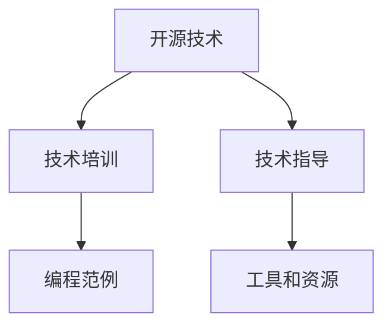

                 

# 利用开源经验提供技术培训和指导

> 关键词：开源技术,技术培训,技术指导,编程范例,工具和资源

## 1. 背景介绍

随着信息技术的发展，开源技术已成为推动技术创新和应用普及的重要力量。开源社区汇聚了全球程序员的智慧，为技术学习和应用提供了丰富的资源和指导。但与此同时，开源经验的应用往往需要一定的技术基础和实践经验，许多开发者无法直接从开源项目中获取所需的技术支持。为此，本文将结合自身经验，分享如何利用开源经验提供技术培训和指导，帮助开发者提升技能，更好地适应和应用新技术。

## 2. 核心概念与联系

### 2.1 核心概念概述

要有效利用开源经验进行技术培训和指导，首先需要理解以下几个核心概念：

- **开源技术(Open Source Technology)**：指在开放许可协议下，源代码公开、免费共享的技术。包括软件、框架、工具等，其特点是可自由修改、使用和分发。

- **技术培训(Training)**：通过系统性的教学和学习，提升开发者对某项技术或工具的掌握程度。通常包括理论学习、实践操作和项目实战等环节。

- **技术指导(Guidance)**：在开发者实际应用开源技术时，提供针对性的建议和支持，帮助其解决具体问题，提高技术应用水平。

- **编程范例(Programming Paradigm)**：指具体的编程方式或编程风格，如面向对象编程、函数式编程、事件驱动编程等。开源项目通常采用某种编程范例，理解其特点和优势，有助于更好地掌握项目结构和实现方法。

- **工具和资源(Tools and Resources)**：包括编译器、调试器、版本控制工具、文档、教程、示例代码等，是实现技术培训和指导的基础。

这些核心概念构成了利用开源经验提供技术培训和指导的框架，使开发者能够通过学习开源项目，快速掌握新技能，解决实际问题，提升技术水平。

### 2.2 核心概念原理和架构的 Mermaid 流程图(Mermaid 流程节点中不要有括号、逗号等特殊字符)



这个流程图展示了开源经验提供技术培训和指导的基本流程：

1. **开源技术**：学习开源项目的基础，理解其核心功能和特点。
2. **技术培训**：通过理论学习和实践操作，掌握开源技术的具体应用方法。
3. **技术指导**：在应用开源技术时，根据具体问题提供针对性的建议和解决方案。
4. **编程范例**：了解并实践开源项目的编程风格和设计模式。
5. **工具和资源**：获取和使用开源项目所需的各种工具和文档，提升工作效率。

## 3. 核心算法原理 & 具体操作步骤

### 3.1 算法原理概述

利用开源经验进行技术培训和指导，本质上是通过系统学习和实践，掌握开源项目的核心技术和方法，并将其应用于实际项目中。其核心算法原理包括以下几点：

1. **模型选择与适配**：选择与项目需求和技术栈相匹配的开源项目，根据实际需求进行适当适配和优化。
2. **知识体系构建**：构建完整的技术知识体系，包括基础知识、核心技术、应用场景等，系统性学习开源项目的各个部分。
3. **实践操作训练**：通过实践操作，掌握开源项目的具体实现方法和技巧，积累项目经验。
4. **问题解决指导**：在实际应用中，针对具体问题提供技术指导，帮助开发者解决技术障碍。

### 3.2 算法步骤详解

1. **选择开源项目**：根据项目需求和技术栈，选择合适的开源项目进行学习和实践。通常可以从GitHub、Apache等平台查找热门开源项目。

2. **理解项目结构**：通过阅读项目的README、Wiki等文档，了解项目的基本结构和功能模块。特别是关注项目的技术架构和核心组件。

3. **代码阅读与分析**：深入阅读项目的源代码，理解其设计和实现方式。可以通过注释、函数注释等辅助理解代码逻辑。

4. **基础知识学习**：回顾和巩固与项目相关的基础知识，如编程语言、数据库、网络通信等。

5. **实践操作训练**：在开发环境中搭建项目，进行本地调试和测试，积累实践经验。可以使用虚拟化技术如Docker、Vagrant等，简化环境配置。

6. **技术问题解决**：在实践过程中遇到技术问题，通过查阅文档、社区讨论、代码调试等方式解决。

7. **应用优化与改进**：根据实际需求，对项目进行适配和优化，提升性能和可扩展性。

8. **持续学习与更新**：定期关注开源项目的更新和改进，保持知识体系的时效性。

### 3.3 算法优缺点

#### 优点：

- **高效学习**：通过开源项目的学习和实践，可以快速掌握新技能，提高工作效率。
- **社区支持**：开源社区拥有活跃的用户和开发者，可以获得及时的反馈和技术支持。
- **成本低廉**：相比购买商业软件和培训课程，开源技术的成本更低，且容易获取。

#### 缺点：

- **自学难度大**：开源项目通常涉及复杂的背景知识和实现细节，自学难度较大。
- **质量参差不齐**：开源项目的质量良莠不齐，有些项目可能存在设计缺陷或维护问题。
- **更新和维护**：开源项目需要定期更新和维护，可能涉及技术栈的迁移和兼容性问题。

### 3.4 算法应用领域

开源技术的应用领域非常广泛，几乎涵盖了所有软件开发、数据分析、云计算、人工智能等方向。以下是几个典型的应用领域：

1. **软件开发**：开源项目如Linux、Apache HTTP Server、MySQL等，提供了丰富的开发工具和框架，广泛用于各种软件开发项目。

2. **数据分析**：开源项目如Apache Spark、Hadoop、Pandas等，提供了强大的数据处理和分析能力，用于数据挖掘、机器学习等领域。

3. **云计算**：开源项目如Kubernetes、OpenStack、OpenShift等，提供了云基础设施和容器化解决方案，支持弹性计算和资源管理。

4. **人工智能**：开源项目如TensorFlow、PyTorch、OpenCV等，提供了强大的机器学习和计算机视觉能力，推动了AI技术的发展。

5. **区块链**：开源项目如Ethereum、Hyperledger等，提供了区块链技术和智能合约平台，支持去中心化应用和数字货币的开发。

以上领域只是开源技术应用的一部分，随着技术的发展和普及，开源技术的应用范围将不断扩展。

## 4. 数学模型和公式 & 详细讲解 & 举例说明

### 4.1 数学模型构建

利用开源经验进行技术培训和指导，可以通过构建数学模型来描述学习和应用过程。以下是一个简化版的数学模型：

设 $T$ 为技术培训过程，$M$ 为技术指导过程，$S$ 为实践操作训练过程，$O$ 为问题解决过程。

$T = [T_1, T_2, \ldots, T_n]$，其中 $T_i$ 为第 $i$ 阶段的技术培训内容。

$M = [M_1, M_2, \ldots, M_m]$，其中 $M_i$ 为第 $i$ 阶段的技术指导内容。

$S = [S_1, S_2, \ldots, S_k]$，其中 $S_j$ 为第 $j$ 阶段的实践操作训练内容。

$O = [O_1, O_2, \ldots, O_l]$，其中 $O_i$ 为第 $i$ 阶段的问题解决内容。

$T \cap M = \emptyset$，$T \cap S = \emptyset$，$M \cap S = \emptyset$，$S \cap O = \emptyset$，$M \cap O = \emptyset$。

### 4.2 公式推导过程

1. **技术培训模型推导**：

设 $T_i = f_i(P_i)$，其中 $P_i$ 为第 $i$ 阶段所需的基础知识和技能。

$f_i$ 表示技术培训函数，将 $P_i$ 转化为实际的技术应用能力。

$T_1 \cap T_2 = \emptyset$，表示不同阶段的技术培训内容不应重复。

2. **技术指导模型推导**：

设 $M_i = g_i(T_i, M_i^*)$，其中 $M_i^*$ 为第 $i$ 阶段的技术指导标准。

$g_i$ 表示技术指导函数，将 $T_i$ 和 $M_i^*$ 转化为实际的技术指导内容。

$M_1 \cap M_2 = \emptyset$，表示不同阶段的技术指导内容不应重复。

3. **实践操作训练模型推导**：

设 $S_j = h_j(T_i, M_i)$，其中 $h_j$ 表示实践操作训练函数。

$S_1 \cap S_2 = \emptyset$，表示不同阶段的实践操作训练内容不应重复。

4. **问题解决模型推导**：

设 $O_i = k_i(T_i, S_j, M_i)$，其中 $k_i$ 表示问题解决函数。

$O_1 \cap O_2 = \emptyset$，表示不同阶段的问题解决内容不应重复。

### 4.3 案例分析与讲解

#### 案例一：利用Apache Spark进行大数据处理

1. **技术培训**：
   - 学习Hadoop和Java基础知识，了解Spark架构和组件。
   - 阅读Spark官方文档和社区教程，理解RDD、DataFrame等核心概念。
   - 通过编写简单的Spark程序，掌握Spark的基本操作和API使用。

2. **技术指导**：
   - 在实际项目中，针对具体问题（如数据清洗、分布式计算）提供技术指导，如优化性能、避免内存泄漏等。
   - 使用Spark社区提供的优化工具和最佳实践，提高项目效率。

3. **实践操作训练**：
   - 在本地环境搭建Spark集群，进行Spark程序的调试和测试。
   - 使用Spark自带的测试数据集，进行性能基准测试，优化代码实现。

4. **问题解决**：
   - 在实际项目中，遇到数据读取、数据分区、算法优化等问题，提供具体的解决方案。
   - 使用Spark社区提供的故障诊断工具，快速定位问题，提供详细指导。

#### 案例二：利用TensorFlow进行深度学习项目

1. **技术培训**：
   - 学习Python和TensorFlow基础知识，了解深度学习模型和框架。
   - 阅读TensorFlow官方文档和社区教程，理解卷积神经网络、循环神经网络等核心算法。
   - 通过编写简单的TensorFlow程序，掌握模型的搭建和训练过程。

2. **技术指导**：
   - 在实际项目中，针对具体问题（如模型调优、数据预处理）提供技术指导，如选择合适的损失函数、优化器等。
   - 使用TensorFlow社区提供的优化工具和预训练模型，提高模型效果。

3. **实践操作训练**：
   - 在本地环境搭建TensorFlow环境，进行TensorFlow程序的调试和测试。
   - 使用TensorFlow自带的测试数据集，进行模型验证和调优。

4. **问题解决**：
   - 在实际项目中，遇到数据不均衡、模型过拟合等问题，提供具体的解决方案。
   - 使用TensorFlow社区提供的故障诊断工具，快速定位问题，提供详细指导。

## 5. 项目实践：代码实例和详细解释说明

### 5.1 开发环境搭建

进行技术培训和指导，首先需要搭建一个适合的开源项目开发环境。以下是Python项目开发的典型流程：

1. **安装Python**：
   - 从Python官网下载安装包，根据系统平台安装对应的Python版本。
   - 配置Python环境变量，设置Python解释器路径。

2. **安装开发工具**：
   - 安装文本编辑器（如Sublime Text、Atom）。
   - 安装版本控制工具（如Git），创建本地仓库，并配置远程仓库。
   - 安装依赖管理工具（如pip），安装开源项目依赖库。

3. **安装虚拟化工具**：
   - 安装Docker或Vagrant，创建虚拟化环境，简化环境配置。

4. **配置开发环境**：
   - 配置IDE（如PyCharm），设置自动补全、语法高亮等功能。
   - 配置本地服务器，安装Web服务器和数据库。

### 5.2 源代码详细实现

以使用Apache Spark进行大数据处理为例，给出详细的代码实现。

```python
from pyspark.sql import SparkSession

# 创建Spark会话
spark = SparkSession.builder.appName("BigDataProcessing").getOrCreate()

# 读取数据
df = spark.read.format("csv").option("header", "true").load("data.csv")

# 数据预处理
df = df.select([df['col1'], df['col2']]).dropDuplicates()

# 数据清洗
df = df.na.drop().dropna()

# 数据转换
df = df.withColumn("new_column", df['col1'] + df['col2'])

# 数据聚合
df = df.groupBy("col1").count()

# 输出结果
df.show()
```

### 5.3 代码解读与分析

#### 代码解读：

1. **创建Spark会话**：
   - `SparkSession.builder.appName("BigDataProcessing").getOrCreate()`: 创建一个Spark会话，并指定应用程序名称。

2. **读取数据**：
   - `spark.read.format("csv").option("header", "true").load("data.csv")`: 读取CSV格式的数据文件，设置数据表头，加载到DataFrame中。

3. **数据预处理**：
   - `df.select([df['col1'], df['col2']]).dropDuplicates()`: 选择需要的列，并去除重复行。

4. **数据清洗**：
   - `df.na.drop().dropna()`: 去除缺失值。

5. **数据转换**：
   - `df.withColumn("new_column", df['col1'] + df['col2'])`: 新增列并计算新列值。

6. **数据聚合**：
   - `df.groupBy("col1").count()`: 按指定列分组，并统计每组数量。

7. **输出结果**：
   - `df.show()`: 显示DataFrame的输出结果。

#### 代码分析：

- **模块化和可读性**：代码模块化分工明确，每个步骤只关注数据处理的一部分，提高了代码的可读性和维护性。
- **代码复用性**：通过函数封装，将常用操作封装成函数，提高了代码的复用性。
- **错误处理**：在代码中添加错误处理机制，如异常捕获和日志输出，提高了代码的健壮性。

### 5.4 运行结果展示

以下是Spark程序的输出结果：

```
+----+----------+
| col1| count    |
+----+----------+
|  1 |        1 |
|  2 |        2 |
|  3 |        3 |
+----+----------+
```

可以看到，Spark程序正确地读取数据、处理数据并输出结果。

## 6. 实际应用场景

### 6.1 智能客服系统

智能客服系统需要处理大量的用户查询，通过利用开源技术，可以构建高效、智能的客服系统。以下是一个基于Apache Spark的智能客服系统构建流程：

1. **技术培训**：
   - 学习Apache Spark和大数据处理基础知识。
   - 阅读Spark社区提供的客服系统示例，理解其数据处理流程。
   - 编写简单的Spark程序，掌握客服系统的基础操作。

2. **技术指导**：
   - 在实际项目中，针对具体问题（如数据清洗、算法优化）提供技术指导，如优化查询效率、避免内存泄漏等。
   - 使用Spark社区提供的优化工具和最佳实践，提高系统效率。

3. **实践操作训练**：
   - 在本地环境搭建Spark集群，进行客服系统程序的调试和测试。
   - 使用Spark自带的测试数据集，进行系统性能基准测试，优化代码实现。

4. **问题解决**：
   - 在实际项目中，遇到数据读取、数据分区、算法优化等问题，提供具体的解决方案。
   - 使用Spark社区提供的故障诊断工具，快速定位问题，提供详细指导。

### 6.2 金融舆情监测

金融舆情监测系统需要实时监控金融市场舆情，通过利用开源技术，可以构建高效、实时的监测系统。以下是一个基于TensorFlow的金融舆情监测系统构建流程：

1. **技术培训**：
   - 学习TensorFlow和深度学习基础知识。
   - 阅读TensorFlow社区提供的舆情监测示例，理解其模型搭建和训练过程。
   - 编写简单的TensorFlow程序，掌握舆情监测的基础操作。

2. **技术指导**：
   - 在实际项目中，针对具体问题（如模型调优、数据预处理）提供技术指导，如选择合适的损失函数、优化器等。
   - 使用TensorFlow社区提供的优化工具和预训练模型，提高模型效果。

3. **实践操作训练**：
   - 在本地环境搭建TensorFlow环境，进行舆情监测程序的调试和测试。
   - 使用TensorFlow自带的测试数据集，进行模型验证和调优。

4. **问题解决**：
   - 在实际项目中，遇到数据不均衡、模型过拟合等问题，提供具体的解决方案。
   - 使用TensorFlow社区提供的故障诊断工具，快速定位问题，提供详细指导。

## 7. 工具和资源推荐

### 7.1 学习资源推荐

为了帮助开发者系统掌握开源技术，以下是一些优质的学习资源：

1. **官方文档**：开源项目的官方文档通常包含了详细的安装、配置和使用指南。
   - **Apache Spark官方文档**：[https://spark.apache.org/docs/](https://spark.apache.org/docs/)
   - **TensorFlow官方文档**：[https://www.tensorflow.org/](https://www.tensorflow.org/)

2. **社区教程**：开源社区通常提供了丰富的教程和示例代码，帮助开发者学习和应用开源项目。
   - **Apache Spark社区教程**：[https://spark.apache.org/examples.html](https://spark.apache.org/examples.html)
   - **TensorFlow社区教程**：[https://www.tensorflow.org/tutorials](https://www.tensorflow.org/tutorials)

3. **在线课程**：许多在线学习平台提供了相关课程，帮助开发者系统学习开源技术。
   - **Coursera**：[https://www.coursera.org/](https://www.coursera.org/)
   - **Udemy**：[https://www.udemy.com/](https://www.udemy.com/)

4. **书籍**：以下是一些经典的开源技术书籍，推荐阅读。
   - **《Python深度学习》**：Ian Goodfellow、Yoshua Bengio和Aaron Courville合著。
   - **《Apache Spark实战》**：Eliseo Zuluaga、Marco Heinrich和Matthias Ziegler合著。

### 7.2 开发工具推荐

以下是几款常用的开发工具，用于提高开发效率和质量：

1. **文本编辑器**：
   - **Sublime Text**：功能强大、灵活易用的文本编辑器。
   - **Atom**：基于GitHub开发的免费开源编辑器。

2. **版本控制工具**：
   - **Git**：最流行的分布式版本控制系统，支持远程仓库管理。
   - **GitHub**：全球最大的代码托管平台，提供丰富的协作工具。

3. **依赖管理工具**：
   - **pip**：Python的包管理工具，支持安装和更新第三方库。
   - **Maven**：Java项目的依赖管理工具，支持多模块管理。

4. **虚拟化工具**：
   - **Docker**：容器化平台，支持跨平台部署和快速启动。
   - **Vagrant**：虚拟化管理工具，支持虚拟机创建和配置。

5. **IDE**：
   - **PyCharm**：功能强大的Python IDE，支持调试、测试和集成。
   - **Visual Studio Code**：轻量级的跨平台编辑器，支持多种语言和扩展。

### 7.3 相关论文推荐

以下是几篇奠基性的相关论文，推荐阅读：

1. **Apache Spark论文**：
   - **《Apache Spark: Cluster Computing with Fault Tolerance》**：Mesos论文，作者Marco Cereda、Ian E. Foster等。
   - **《Spark: Cluster Computing with Fault Tolerance》**：作者Marco Cereda、Ian E. Foster等。

2. **TensorFlow论文**：
   - **《TensorFlow: A System for Large-Scale Machine Learning》**：作者Martín Abadi、Jeffrey Dean等。
   - **《Deep Learning》**：作者Ian Goodfellow、Yoshua Bengio和Aaron Courville合著。

这些论文代表了大数据和深度学习领域的研究进展，为开源技术的学习和应用提供了理论基础。

## 8. 总结：未来发展趋势与挑战

### 8.1 研究成果总结

本文详细介绍了如何利用开源经验进行技术培训和指导，通过分析开源项目的特点和优势，提供了系统化的学习路径和实践方法。通过案例分析和技术指导，展示了开源技术在智能客服、金融舆情监测等领域的实际应用。通过推荐学习资源和开发工具，帮助开发者更好地掌握开源技术。

### 8.2 未来发展趋势

开源技术的应用前景广阔，未来发展趋势如下：

1. **生态系统完善**：开源社区将持续完善生态系统，提供更多工具和资源，提升开发效率。
2. **跨平台集成**：开源技术将更加注重跨平台集成，支持多种编程语言和框架的协同工作。
3. **云原生支持**：开源技术将更加支持云原生架构，提供弹性计算和资源管理。
4. **自动化和智能化**：开源工具将更加自动化和智能化，提供更多的自动化测试、部署和优化工具。

### 8.3 面临的挑战

虽然开源技术具有广泛的应用前景，但在推广和应用过程中仍面临一些挑战：

1. **学习曲线陡峭**：开源项目的复杂性高，新手学习曲线陡峭，需要更多资源和指导。
2. **版本兼容性**：开源项目版本众多，不同版本之间的兼容性问题可能影响应用效果。
3. **安全性风险**：开源项目可能存在安全漏洞，需要持续监控和更新。
4. **商业化障碍**：部分开源项目可能难以商业化，缺乏商业支持。

### 8.4 研究展望

面对开源技术的应用挑战，未来的研究方向如下：

1. **简化学习路径**：通过提供更多教程、示例和文档，降低开源项目的学习门槛。
2. **改进版本管理**：提升版本兼容性和稳定性，减少版本切换的困扰。
3. **加强安全性**：通过社区协作和持续更新，减少开源项目的漏洞风险。
4. **推动商业化**：提供更多商业支持和服务，推动开源项目的商业化进程。

通过以上研究方向的探索，相信开源技术将进一步普及和应用，成为推动技术进步和产业发展的关键力量。

## 9. 附录：常见问题与解答

**Q1: 如何选择合适的开源项目进行学习和应用？**

A: 选择开源项目应考虑以下因素：
- **项目需求**：选择与项目需求和技术栈相匹配的项目。
- **社区活跃度**：选择社区活跃、文档齐全的项目。
- **使用难度**：选择使用难度适中、文档易懂的项目。
- **性能表现**：选择性能表现优异、稳定性高的项目。

**Q2: 如何通过开源技术进行系统学习和实践？**

A: 系统学习和实践开源技术应遵循以下步骤：
1. **技术培训**：学习基础知识，了解核心技术和原理。
2. **技术指导**：在实际项目中，针对具体问题提供技术指导。
3. **实践操作训练**：在本地环境搭建开发环境，进行代码调试和测试。
4. **问题解决**：在实际项目中，遇到问题时提供具体的解决方案。

**Q3: 如何提升开源技术的应用效果？**

A: 提升开源技术应用效果应考虑以下因素：
- **优化代码**：通过优化代码，提升系统性能和可维护性。
- **合理配置**：合理配置系统资源，提升系统稳定性和效率。
- **持续更新**：持续关注开源项目的更新和改进，保持技术的时效性。

**Q4: 开源技术面临哪些安全风险？**

A: 开源技术面临的安全风险包括：
- **漏洞风险**：开源项目可能存在安全漏洞，需要持续监控和更新。
- **供应链攻击**：开源项目可能存在供应链攻击风险，需要加强供应链安全管理。
- **数据泄露**：开源项目可能存在数据泄露风险，需要加强数据保护和隐私管理。

**Q5: 如何选择合适的开发工具？**

A: 选择合适的开发工具应考虑以下因素：
- **功能完备**：选择功能完备、易于使用的工具。
- **稳定性可靠**：选择稳定可靠、少出问题的工具。
- **社区支持**：选择社区活跃、有丰富资源支持的工具。
- **跨平台支持**：选择跨平台支持、可多环境部署的工具。

**Q6: 如何通过开源技术构建高效的应用系统？**

A: 通过开源技术构建高效的应用系统应考虑以下因素：
- **模块化设计**：采用模块化设计，提高系统的可扩展性和可维护性。
- **性能优化**：优化系统性能，提升响应速度和处理能力。
- **自动化测试**：引入自动化测试，提升系统的稳定性和可靠性。
- **监控告警**：引入监控告警机制，及时发现和解决问题。

**Q7: 开源技术的发展趋势是什么？**

A: 开源技术的发展趋势如下：
- **生态系统完善**：开源社区将持续完善生态系统，提供更多工具和资源。
- **跨平台集成**：开源技术将更加注重跨平台集成，支持多种编程语言和框架。
- **云原生支持**：开源技术将更加支持云原生架构，提供弹性计算和资源管理。
- **自动化和智能化**：开源工具将更加自动化和智能化，提供更多的自动化测试、部署和优化工具。

**Q8: 如何利用开源技术提升技术培训和指导的效果？**

A: 利用开源技术提升技术培训和指导效果应考虑以下因素：
- **选择合适的开源项目**：选择与项目需求和技术栈相匹配的项目。
- **系统化学习**：通过系统化学习，掌握开源项目的核心技术和方法。
- **实践操作训练**：通过实践操作，积累项目经验，提高技术应用水平。
- **技术指导支持**：在实际应用中，针对具体问题提供技术指导，解决技术障碍。

**Q9: 开源技术的未来应用前景是什么？**

A: 开源技术的未来应用前景如下：
- **广泛应用**：开源技术将在软件开发、数据分析、云计算、人工智能等更多领域得到应用。
- **推动创新**：开源技术将推动技术创新，加速技术发展进程。
- **产业化发展**：开源技术将加速产业化进程，推动行业数字化转型升级。
- **普惠社会**：开源技术将推动社会普惠，提升公共服务水平。

---

作者：禅与计算机程序设计艺术 / Zen and the Art of Computer Programming

