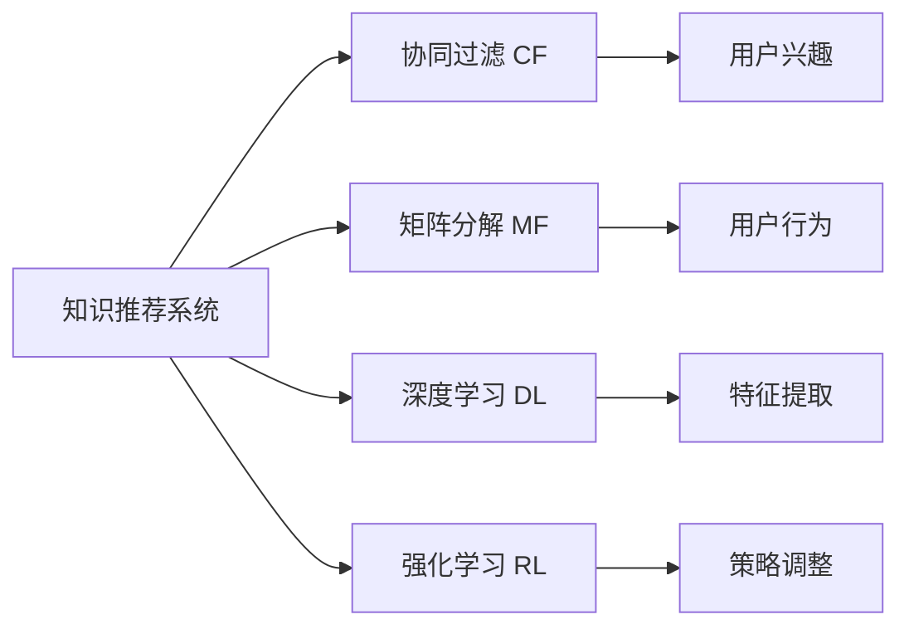

                 

# 利用机器学习优化知识推荐系统

## 1. 背景介绍

随着互联网技术的发展，人们获取信息和知识的途径越来越多样化。无论是线上教育平台，还是社交媒体，或是各种应用软件，知识推荐系统已经成为了连接用户与内容的桥梁。然而，在信息爆炸的时代，如何高效地从海量的数据中发现有价值的内容，已经成为当下人工智能应用领域的重大挑战。基于机器学习（Machine Learning, ML）的知识推荐系统通过数据驱动的方式，为用户推荐其可能感兴趣的知识内容，显著提升了用户的使用体验和效率，成为互联网企业争相研发的核心技术。本文将详细探讨利用机器学习优化知识推荐系统的理论基础与实践方法，并结合实际案例，分析其在各领域中的应用和未来发展趋势。

## 2. 核心概念与联系

### 2.1 核心概念概述

在深入讨论机器学习知识推荐系统之前，我们需要对其中涉及的核心概念进行梳理：

- **知识推荐系统**：利用机器学习算法，通过分析用户的行为数据和兴趣标签，为用户推荐可能感兴趣的知识内容，包括文章、视频、书籍等。

- **协同过滤（Collaborative Filtering, CF）**：基于用户的历史行为数据或兴趣标签，寻找相似用户或相似物品，为用户推荐新知识。

- **矩阵分解（Matrix Factorization, MF）**：通过分解用户行为矩阵，提取隐含的用户兴趣和物品属性，从而推荐知识。

- **深度学习（Deep Learning, DL）**：利用多层神经网络模型，通过端到端的训练，直接从原始数据中提取高级语义特征，优化知识推荐性能。

- **强化学习（Reinforcement Learning, RL）**：通过构建奖励机制，在推荐过程中不断调整策略，提升推荐效果。

这些核心概念通过算法和技术的融合，共同构成了知识推荐系统的技术基础，为实现精准高效的推荐提供了有力支撑。

### 2.2 核心概念原理和架构的 Mermaid 流程图



该流程图展示了知识推荐系统中几个核心组件和它们之间的联系：

- 知识推荐系统(A)：综合利用协同过滤(B)、矩阵分解(C)、深度学习(D)、强化学习(E)等技术，为用户提供精准的知识推荐。
- 协同过滤(B)：基于用户相似性或物品相似性，直接推荐新知识。
- 矩阵分解(C)：通过分解用户行为矩阵，提取隐含特征。
- 深度学习(D)：直接从原始数据中提取语义特征。
- 强化学习(E)：通过奖励机制优化推荐策略。
- 用户兴趣(F)和行为(G)：协同过滤和矩阵分解的关键输入数据。
- 特征提取(H)：深度学习模型核心的功能模块。
- 策略调整(I)：强化学习模型的核心任务。

这些组件共同作用，为用户提供了个性化的知识推荐。

## 3. 核心算法原理 & 具体操作步骤

### 3.1 算法原理概述

知识推荐系统的核心在于通过机器学习算法，从用户的行为数据和兴趣标签中提取有价值的信息，为用户推荐可能的兴趣内容。机器学习在知识推荐中的应用，主要分为以下几个阶段：

1. **用户建模**：通过用户的行为数据和兴趣标签，构建用户画像。
2. **物品建模**：通过物品的元数据和用户交互数据，构建物品的特征表示。
3. **相似度计算**：通过相似性度量算法，计算用户和物品之间的相似度。
4. **推荐排序**：根据相似度计算结果，结合用户的个性化偏好，对物品进行排序推荐。

这些阶段通过算法和技术的巧妙融合，实现了个性化、多样化的知识推荐。

### 3.2 算法步骤详解

以下是对机器学习知识推荐系统具体实施步骤的详细介绍：

#### 3.2.1 用户建模

用户建模是推荐系统的基础，主要通过以下几种方法实现：

- **用户行为矩阵**：将用户与物品的交互行为构建为矩阵形式，记录用户对各个物品的评分或点击次数。
- **用户特征向量化**：通过自然语言处理(Natural Language Processing, NLP)等技术，将用户的兴趣标签和行为数据转换为向量形式，表示用户的兴趣和偏好。
- **用户画像生成**：将用户特征向量整合，生成用户画像，描述用户的个性化特征。

#### 3.2.2 物品建模

物品建模通过以下几种方法实现：

- **物品特征提取**：通过提取物品的元数据（如作者、类别、标签等）和用户行为数据，构建物品的特征向量。
- **物品画像生成**：将物品特征向量整合，生成物品画像，描述物品的特征和属性。
- **物品嵌入**：通过深度学习模型，将物品特征向量映射为高维空间中的向量，捕捉物品的隐含语义。

#### 3.2.3 相似度计算

相似度计算是推荐系统的重要环节，主要通过以下几种方法实现：

- **协同过滤**：通过计算用户之间的相似度，为每个用户推荐相似用户喜欢的物品。
- **矩阵分解**：通过分解用户行为矩阵，提取隐含的用户兴趣和物品属性，从而推荐新物品。
- **深度学习**：通过多层神经网络模型，直接从原始数据中提取语义特征，优化相似度计算。

#### 3.2.4 推荐排序

推荐排序是推荐系统的重要输出环节，主要通过以下几种方法实现：

- **排序算法**：通过排序算法，对物品进行优先级排序，推荐用户可能感兴趣的知识内容。
- **推荐策略调整**：通过强化学习等技术，在推荐过程中不断调整策略，提升推荐效果。

### 3.3 算法优缺点

机器学习知识推荐系统具有以下优点：

1. **个性化推荐**：通过用户行为数据和兴趣标签，实现个性化推荐，提高用户满意度。
2. **多样化推荐**：通过多维度特征融合，提供多样化的推荐内容，满足用户不同兴趣需求。
3. **动态更新**：通过实时更新用户行为和物品属性，动态调整推荐策略，保持推荐内容的时效性。

然而，机器学习知识推荐系统也存在以下缺点：

1. **数据需求高**：需要大量的用户行为数据和物品元数据，数据获取和处理成本较高。
2. **模型复杂度高**：需要复杂的机器学习算法，模型训练和调参难度大。
3. **计算资源消耗大**：训练和推理过程中，计算资源消耗较大，对硬件设备要求高。

### 3.4 算法应用领域

机器学习知识推荐系统在多个领域得到了广泛应用，主要包括以下几个方面：

- **在线教育**：为学生推荐学习资源，提高学习效果。
- **社交媒体**：为用户推荐内容，提升用户活跃度和留存率。
- **电子商务**：为用户推荐商品，提高销售额和用户体验。
- **金融服务**：为用户推荐理财和投资产品，优化金融服务体验。
- **医疗健康**：为用户推荐健康资讯和诊疗方案，提升健康管理效果。

## 4. 数学模型和公式 & 详细讲解 & 举例说明

### 4.1 数学模型构建

知识推荐系统通常基于用户行为数据构建矩阵，通过机器学习算法进行模型训练和推荐计算。假设用户行为矩阵为 $U$，物品特征矩阵为 $V$，用户画像为 $\mathbf{u}$，物品画像为 $\mathbf{v}$，用户行为与物品之间的评分矩阵为 $R$。知识推荐的目标是最大化用户对物品的评分，即：

$$
\min_{\mathbf{u}, \mathbf{v}} \|R - UV\|_F^2
$$

其中 $\|R - UV\|_F^2$ 表示评分矩阵 $R$ 与用户行为矩阵 $U$ 和物品特征矩阵 $V$ 的乘积矩阵 $UV$ 之间的Frobenius范数差值，最小化该差值可以使得推荐系统输出的评分尽可能接近实际评分。

### 4.2 公式推导过程

接下来，我们将推导矩阵分解算法中的核心公式。

假设用户行为矩阵 $R$ 和物品特征矩阵 $V$ 的SVD分解为：

$$
R \approx U'WV
$$

其中 $U'$ 为用户行为矩阵 $R$ 的左奇异矩阵，$W$ 为奇异值矩阵，$V$ 为物品特征矩阵 $R$ 的右奇异矩阵。为了简化表示，我们可以将 $U'$ 和 $W$ 合并为一个矩阵 $U$，即：

$$
R \approx UV
$$

通过分解用户行为矩阵 $R$，可以得到隐含的用户兴趣和物品属性，从而实现推荐。

### 4.3 案例分析与讲解

下面通过一个具体的推荐案例，分析机器学习知识推荐系统的实现过程：

假设某在线教育平台收集了大量用户的学习行为数据和课程评分，希望为用户推荐感兴趣的课程。首先，将用户行为数据构建为用户行为矩阵 $R$，将课程的特征数据构建为物品特征矩阵 $V$。然后，通过SVD分解，将用户行为矩阵 $R$ 分解为用户矩阵 $U$ 和物品矩阵 $V$。通过计算用户矩阵 $U$ 和物品矩阵 $V$ 的乘积，可以得到用户对每个课程的预测评分 $R'$。最后，根据预测评分 $R'$ 和实际评分的差异，更新用户矩阵 $U$ 和物品矩阵 $V$，优化推荐效果。

## 5. 项目实践：代码实例和详细解释说明

### 5.1 开发环境搭建

为了搭建机器学习知识推荐系统的开发环境，需要安装以下依赖：

1. Python：选择3.7以上版本，并确保路径在系统中生效。
2. TensorFlow：安装最新稳定版，安装命令为 `pip install tensorflow`。
3. PyTorch：安装最新稳定版，安装命令为 `pip install torch torchvision torchaudio`。
4. Scikit-learn：安装最新稳定版，安装命令为 `pip install scikit-learn`。
5. NumPy：安装最新稳定版，安装命令为 `pip install numpy`。

### 5.2 源代码详细实现

以下是一个简单的基于协同过滤的推荐系统实现代码：

```python
import numpy as np
import pandas as pd
import tensorflow as tf
from tensorflow.keras.layers import Embedding, DotProduct
from sklearn.metrics import mean_squared_error

# 用户行为数据
data = pd.read_csv('ratings.csv')
user_ids = data['user_id']
item_ids = data['item_id']
ratings = data['rating']

# 物品特征数据
item_ids = data['item_id']
item_categories = data['item_category']
item_features = pd.get_dummies(item_categories, prefix='item_', drop_first=True)

# 构建用户行为矩阵
U = np.zeros((len(user_ids), len(item_ids)))
for i, (uid, vid, rating) in data.iterrows():
    U[uid-1, vid-1] = rating

# 构建物品特征矩阵
V = np.zeros((len(item_ids), len(item_features.columns)))
for i, (vid, vid_cat) in data.iterrows():
    V[vid-1, item_features[vid_cat].index[0]] = 1

# 计算预测评分
dot_product = DotProduct(inputs=(U, V), normalize=True)
pred_ratings = dot_product.predict(tf.convert_to_tensor(ratings))
rmse = mean_squared_error(ratings, pred_ratings)

# 输出RMSE值
print('RMSE:', rmse)
```

### 5.3 代码解读与分析

以上代码实现了一个基于协同过滤的推荐系统，具体步骤如下：

1. **数据加载**：通过Pandas加载用户行为数据和物品特征数据，构建用户行为矩阵 $U$ 和物品特征矩阵 $V$。
2. **用户行为矩阵构建**：将用户行为数据转化为矩阵形式，每个用户与每个物品之间的评分记录为一个元素。
3. **物品特征矩阵构建**：将物品的分类数据转化为二进制特征向量，构建物品特征矩阵 $V$。
4. **预测评分计算**：通过点积计算用户行为矩阵 $U$ 和物品特征矩阵 $V$ 的预测评分 $R'$，使用均方根误差（RMSE）评估模型性能。

### 5.4 运行结果展示

运行以上代码，输出RMSE值，评估模型的预测效果。如果RMSE值较小，说明模型的推荐效果较好，用户行为矩阵和物品特征矩阵的分解效果良好。

## 6. 实际应用场景

### 6.1 在线教育

在线教育平台通过收集用户的学习行为数据，如观看时间、答题次数等，为用户推荐适合的课程和教材，提升学习效果。

### 6.2 社交媒体

社交媒体平台通过收集用户的浏览、点赞、评论等行为数据，为用户推荐感兴趣的内容，提高用户活跃度和留存率。

### 6.3 电子商务

电商平台通过收集用户的购买记录、浏览历史等数据，为用户推荐商品，提高销售额和用户体验。

### 6.4 金融服务

金融机构通过收集用户的交易数据、投资记录等，为用户推荐理财和投资产品，优化金融服务体验。

### 6.5 医疗健康

医疗平台通过收集用户的健康数据、就医记录等，为用户推荐健康资讯和诊疗方案，提升健康管理效果。

## 7. 工具和资源推荐

### 7.1 学习资源推荐

1. **Coursera《机器学习》课程**：由斯坦福大学Andrew Ng教授主讲，涵盖机器学习的基本概念和算法。
2. **DeepLearning.AI《深度学习专项》课程**：由李宏毅教授主讲，深入浅出地介绍深度学习的基本原理和应用。
3. **Kaggle机器学习竞赛**：通过实际竞赛项目，练习和提升机器学习算法的能力。
4. **机器学习经典书籍**：如《机器学习》（周志华）、《深度学习》（Ian Goodfellow）等。

### 7.2 开发工具推荐

1. **Jupyter Notebook**：免费的交互式编程环境，支持多种语言和库。
2. **PyTorch**：灵活的深度学习框架，支持动态图和静态图，性能优异。
3. **TensorFlow**：强大的深度学习框架，支持多种硬件平台，生态完善。
4. **Scikit-learn**：常用的机器学习库，提供多种经典算法和工具。

### 7.3 相关论文推荐

1. **协同过滤推荐算法**：《Collaborative Filtering for Implicit Feedback Datasets》。
2. **矩阵分解推荐算法**：《SVD++: Sketchy Matrix Decomposition for Recommender Systems》。
3. **深度学习推荐算法**：《Deep Collaborative Filtering》。

## 8. 总结：未来发展趋势与挑战

### 8.1 总结

本文对利用机器学习优化知识推荐系统进行了全面系统的介绍，详细讲解了其理论基础和实践方法，结合实际案例，分析了其在各领域中的应用。通过本文的系统梳理，可以看出，机器学习知识推荐系统在提升用户个性化推荐、多样化推荐、动态更新等方面发挥了重要作用，已经成为互联网企业争相研发的核心技术。

### 8.2 未来发展趋势

未来，机器学习知识推荐系统将呈现以下几个发展趋势：

1. **多模态融合**：融合视觉、语音等多模态数据，提升推荐内容的丰富性和多样性。
2. **跨域推荐**：将推荐系统扩展到跨领域、跨平台，提供更加广泛和全面的推荐内容。
3. **联邦学习**：在保护用户隐私的前提下，通过联邦学习技术，实现推荐模型在多设备间的协同训练和优化。
4. **自动化推荐**：通过自动化推荐技术，实现推荐策略的动态调整和优化，提高推荐效果。
5. **元推荐**：构建元推荐模型，通过多级推荐，实现更精准、更个性化的推荐。

### 8.3 面临的挑战

尽管机器学习知识推荐系统已经取得了显著成果，但在迈向更加智能化、普适化应用的过程中，仍面临诸多挑战：

1. **数据隐私**：如何在保证用户隐私的前提下，高效地获取和利用用户行为数据，是一个重要问题。
2. **模型复杂度**：如何设计简单高效的模型，在保证推荐效果的同时，降低计算资源消耗，是一个需要深入研究的问题。
3. **推荐效果**：如何通过算法和技术的优化，进一步提升推荐系统的精准度和多样性，是一个需要不断探索的问题。

### 8.4 研究展望

未来，机器学习知识推荐系统需要在以下几个方面进行深入研究：

1. **隐私保护技术**：开发高效的隐私保护算法，保障用户数据的安全和隐私。
2. **高效推荐算法**：设计更简单高效的推荐算法，降低计算资源消耗。
3. **跨域推荐技术**：研究跨领域、跨平台的推荐算法，提高推荐内容的丰富性。
4. **元推荐方法**：探索元推荐方法，通过多级推荐，进一步提升推荐效果。
5. **自动化推荐策略**：开发自动化推荐策略，实现动态调整和优化。

## 9. 附录：常见问题与解答

### Q1: 知识推荐系统如何处理数据缺失问题？

A: 知识推荐系统通常使用数据补全技术处理数据缺失问题，常用的方法包括：
1. **均值填补**：用数据的均值填补缺失值。
2. **插值填补**：通过线性插值、多项式插值等方法填补缺失值。
3. **KNN填补**：使用K近邻算法，根据邻居数据填补缺失值。

### Q2: 如何评估知识推荐系统的性能？

A: 知识推荐系统的性能评估通常使用以下指标：
1. **均方根误差（RMSE）**：评估推荐模型的预测精度。
2. **准确率（Precision）和召回率（Recall）**：评估推荐模型的准确性和覆盖率。
3. **用户满意度**：通过用户反馈调查等方法评估推荐效果。

### Q3: 如何避免知识推荐系统的冷启动问题？

A: 冷启动问题指推荐系统在新用户或新物品加入时，无法提供有效的推荐。常用的方法包括：
1. **内容推荐**：通过物品特征，推荐与用户历史兴趣相似的物品。
2. **基于流行度的推荐**：推荐系统中最热门的物品。
3. **基于上下文的推荐**：根据用户上下文信息，推荐可能感兴趣的物品。

### Q4: 知识推荐系统如何处理用户多样性？

A: 用户多样性指不同用户具有不同的兴趣偏好和行为模式。推荐系统通常通过以下方法处理用户多样性：
1. **个性化推荐**：根据用户行为数据和兴趣标签，提供个性化推荐。
2. **多样性约束**：在推荐结果中，加入多样性约束，确保推荐内容的多样性。
3. **协同过滤**：通过协同过滤，推荐相似用户喜欢的物品，提高推荐多样性。

### Q5: 如何优化知识推荐系统的训练效率？

A: 优化知识推荐系统的训练效率，通常使用以下方法：
1. **特征降维**：通过主成分分析（PCA）、特征选择等方法，降低数据维度。
2. **模型并行**：通过分布式训练和模型并行，提高训练效率。
3. **量化加速**：将模型参数量化为定点数据，降低内存占用和计算资源消耗。

---

作者：禅与计算机程序设计艺术 / Zen and the Art of Computer Programming

