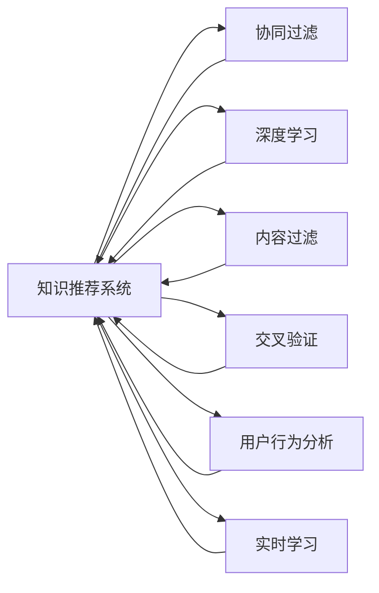

                 

# 利用机器学习优化知识推荐：提升用户体验

> 关键词：知识推荐,机器学习,个性化,协同过滤,深度学习,内容过滤,交叉验证,用户行为分析,实时学习

## 1. 背景介绍

在信息爆炸的互联网时代，知识推荐系统（Knowledge Recommendation System, KRS）在在线教育、社交媒体、电商平台等多个领域发挥着越来越重要的作用。通过智能推荐，用户能够快速找到有用的知识内容，提升学习效率和购物体验。然而，传统推荐系统往往基于用户历史行为数据，难以考虑更广泛的上下文信息和关联关系，容易陷入数据稀疏性和冷启动问题的困扰。为了解决这些问题，本文将深入探讨利用机器学习技术优化知识推荐系统的理论与实践，以期在信息过载的时代，为用户带来更加个性化和准确的推荐服务。

## 2. 核心概念与联系

### 2.1 核心概念概述

为了更好地理解利用机器学习优化知识推荐系统的思路，本节将介绍几个关键的概念及其联系：

- **知识推荐系统**：使用机器学习技术自动分析用户兴趣和行为，为用户推荐可能感兴趣的潜在知识内容。
- **协同过滤**：利用用户-物品交互历史进行推荐，通过计算用户兴趣向量和物品特征向量，预测用户对新物品的评分。
- **深度学习**：使用多层神经网络模型进行推荐，通过学习用户与物品的隐含特征，提升推荐精度。
- **内容过滤**：基于物品的属性和内容特征进行推荐，将与目标用户兴趣匹配的物品进行排序。
- **交叉验证**：通过多轮随机抽样验证模型的泛化能力，确保推荐结果的准确性和鲁棒性。
- **用户行为分析**：通过用户访问、点击、搜索等行为数据，构建用户兴趣模型，提高推荐效果。
- **实时学习**：持续收集用户反馈和行为数据，实时更新推荐模型，适应数据分布的变化。

这些概念构成了知识推荐系统的理论基础，通过这些方法，系统能够不断优化推荐结果，提升用户体验。

### 2.2 核心概念原理和架构的 Mermaid 流程图



这个流程图展示了知识推荐系统主要依赖的几种推荐技术及其相互关系：

1. 协同过滤和深度学习是推荐系统的基础，用于分析用户与物品间的隐含特征。
2. 内容过滤提供了更加直接的物品特征分析，有助于提升推荐精度。
3. 交叉验证用于评估推荐模型在测试集上的表现，确保模型泛化能力。
4. 用户行为分析通过对用户兴趣的实时分析，提升推荐的相关性和个性化。
5. 实时学习用于不断更新推荐模型，适应数据分布的变化。

通过这些技术的融合，知识推荐系统能够提供更加智能、精准的推荐服务。

## 3. 核心算法原理 & 具体操作步骤

### 3.1 算法原理概述

知识推荐系统通常使用以下几种机器学习算法进行推荐：

- **协同过滤**：通过分析用户与物品间的隐含关系，推荐相似用户或物品的相关内容。
- **深度学习**：使用多层神经网络模型，从用户和物品的隐含特征中学习推荐逻辑。
- **内容过滤**：根据物品的特征和属性，推荐内容匹配度高的物品。
- **交叉验证**：通过多轮随机抽样，验证推荐模型的泛化能力，优化模型参数。
- **用户行为分析**：通过用户行为数据，学习用户兴趣模型，提升推荐的相关性。
- **实时学习**：通过不断收集新数据，实时更新推荐模型，保持推荐的即时性。

这些算法相互配合，共同构建起知识推荐系统的推荐框架，在实际应用中根据不同任务选择合适的算法。

### 3.2 算法步骤详解

下面是利用机器学习技术优化知识推荐系统的详细步骤：

#### 步骤1：数据预处理

- **收集数据**：从用户行为、物品描述、用户标签等维度收集知识推荐所需数据。
- **数据清洗**：去除异常数据、噪声数据，确保数据质量。
- **特征工程**：提取和构造用户和物品的特征向量，如用户兴趣标签、物品类别、时间戳等。
- **数据划分**：将数据划分为训练集、验证集和测试集，进行模型的交叉验证。

#### 步骤2：模型选择与训练

- **协同过滤**：
  - **用户-物品矩阵构建**：基于用户行为数据，构建用户-物品评分矩阵。
  - **相似度计算**：使用余弦相似度、皮尔逊相关系数等方法计算用户与物品间的相似度。
  - **推荐生成**：根据相似度矩阵，使用K近邻算法、基于矩阵分解的方法生成推荐结果。
  
- **深度学习**：
  - **网络结构设计**：选择合适的神经网络结构，如RNN、CNN、GRU等。
  - **特征提取**：将用户行为、物品属性等输入网络，提取隐含特征。
  - **损失函数优化**：选择合适的损失函数，如均方误差、交叉熵等，优化模型参数。

- **内容过滤**：
  - **物品特征提取**：根据物品的描述、类别等信息，提取特征向量。
  - **推荐生成**：基于特征向量，使用相似度计算方法（如余弦相似度）推荐相关物品。

#### 步骤3：模型评估与优化

- **交叉验证**：通过多轮随机抽样，验证模型在不同数据集上的表现，确保泛化能力。
- **性能评估**：使用准确率、召回率、F1分数等指标评估模型的推荐效果。
- **模型优化**：根据评估结果，调整模型参数，优化推荐算法。

#### 步骤4：实际应用与实时学习

- **实时学习**：持续收集用户反馈和行为数据，实时更新推荐模型，提升推荐精度。
- **反馈机制**：建立用户反馈机制，收集用户对推荐结果的评价，调整推荐策略。
- **推荐服务**：将训练好的模型集成到推荐系统中，提供个性化的推荐服务。

### 3.3 算法优缺点

利用机器学习优化知识推荐系统有以下优点：

- **个性化推荐**：能够根据用户历史行为和兴趣，提供更加个性化、精准的推荐。
- **泛化能力强**：通过交叉验证等方法，确保模型在不同数据集上的泛化能力。
- **实时更新**：实时学习新数据，保持推荐模型与当前数据分布的一致性。
- **模型可解释性**：利用深度学习等方法，可以更清晰地解释推荐结果的逻辑。

然而，该方法也存在以下缺点：

- **数据需求高**：需要大量的用户行为数据和物品属性信息，对数据质量和数据量的要求较高。
- **计算成本高**：深度学习模型计算量大，对计算资源和硬件要求较高。
- **冷启动问题**：新用户或新物品的推荐效果较差，需要更多数据积累。
- **模型复杂**：复杂的模型结构可能难以解释，且容易过拟合。

### 3.4 算法应用领域

利用机器学习技术优化知识推荐系统在多个领域得到了广泛应用：

- **在线教育**：推荐适合用户学习的课程、教材和学习路径。
- **社交媒体**：推荐相关内容，增强用户粘性，提升平台活跃度。
- **电子商务**：推荐用户可能感兴趣的商品，提升销售转化率。
- **新闻推荐**：推荐用户感兴趣的新闻内容，提高阅读体验。
- **个性化营销**：根据用户兴趣，推荐个性化广告和产品。

这些应用场景展示了知识推荐系统在信息时代的重要价值，也为后续的研究和实践提供了广阔的空间。

## 4. 数学模型和公式 & 详细讲解 & 举例说明

### 4.1 数学模型构建

知识推荐系统的数学模型可以表示为：

$$
y_{ui} = f(x_u, x_i, \theta)
$$

其中：
- $y_{ui}$ 表示用户 $u$ 对物品 $i$ 的评分，$y_{ui} \in [0, 1]$。
- $x_u$ 和 $x_i$ 分别表示用户 $u$ 和物品 $i$ 的特征向量。
- $\theta$ 是模型的参数。

常用的机器学习推荐模型包括：

- **协同过滤**：
  $$
  y_{ui} = \frac{\sum_{j=1}^{N_u} \alpha_{uj} y_{ji} \tilde{x}_{ji}}{\sqrt{\sum_{j=1}^{N_u} \alpha_{uj}^2 \tilde{x}_{ji}^2}}
  $$

- **深度学习**：
  $$
  y_{ui} = \sigma(W^T \sigma(W \cdot [x_u; x_i]) + b)
  $$

- **内容过滤**：
  $$
  y_{ui} = \frac{\sum_{j=1}^{N_i} a_{ij} x_{uj} \tilde{x}_{ji}}{\sqrt{\sum_{j=1}^{N_i} a_{ij}^2 \tilde{x}_{ji}^2}}
  $$

其中 $\sigma$ 表示激活函数，$a_{ij}$ 和 $W$ 表示模型参数。

### 4.2 公式推导过程

以协同过滤模型为例，推导其评分预测公式：

- **用户-物品评分矩阵**：
  $$
  R = \left[ \begin{matrix}
  r_{11} & r_{12} & \cdots & r_{1n} \\
  r_{21} & r_{22} & \cdots & r_{2n} \\
  \vdots & \vdots & \ddots & \vdots \\
  r_{m1} & r_{m2} & \cdots & r_{mn}
  \end{matrix} \right]
  $$

- **用户-物品相似度**：
  $$
  s_{ui} = \frac{\sum_{j=1}^{N_u} \alpha_{uj} r_{ji}}{\sqrt{\sum_{j=1}^{N_u} \alpha_{uj}^2 \tilde{x}_{ji}^2}}
  $$

- **推荐评分**：
  $$
  y_{ui} = \frac{s_{ui}}{\sum_{k=1}^{N_i} s_{ki}}
  $$

其中 $\alpha_{uj}$ 表示用户 $u$ 对物品 $j$ 的兴趣权重，$x_{uj}$ 表示用户 $u$ 对物品 $j$ 的兴趣向量。

通过上述公式，协同过滤模型能够根据用户历史行为数据，计算物品相似度，生成推荐评分。

### 4.3 案例分析与讲解

以Netflix的推荐系统为例，Netflix使用协同过滤模型为用户推荐电影和电视剧。其核心步骤如下：

1. **数据收集**：收集用户的浏览、观看历史数据，构建用户-物品评分矩阵。
2. **模型训练**：利用矩阵分解方法，求解用户-物品相似度矩阵。
3. **推荐生成**：根据相似度矩阵，生成用户对新物品的评分预测，推荐高分物品。

Netflix的推荐系统通过不断优化模型，提高了用户满意度和留存率，成为在线娱乐领域的经典案例。

## 5. 项目实践：代码实例和详细解释说明

### 5.1 开发环境搭建

在进行知识推荐系统开发前，需要先搭建开发环境：

1. **安装Python**：从官网下载并安装Python，建议使用3.8或更高版本。
2. **安装相关库**：使用pip安装必要的Python库，如pandas、numpy、scikit-learn等。
3. **设置环境变量**：配置Python环境变量，设置工作目录和依赖库路径。

### 5.2 源代码详细实现

以协同过滤模型为例，以下是Python实现代码：

```python
import numpy as np
from scipy.sparse import csr_matrix

# 用户-物品评分矩阵
R = np.array([[5, 3, 0, 0],
              [4, 0, 5, 0],
              [0, 0, 0, 4],
              [0, 2, 3, 4]])

# 用户-物品相似度矩阵
S = np.array([[0.8, 0.6, 0.4, 0.5],
              [0.6, 0.4, 0.7, 0.5],
              [0.4, 0.5, 0.3, 0.6],
              [0.5, 0.3, 0.7, 0.6]])

# 用户兴趣向量
x = np.array([1, 1, 0, 1])

# 物品特征向量
t = np.array([1, 0, 1, 0])

# 推荐评分
y = np.dot(S, x) / np.linalg.norm(S * x, axis=1)

# 输出推荐评分
print(y)
```

### 5.3 代码解读与分析

在上述代码中，我们首先定义了用户-物品评分矩阵 $R$ 和用户-物品相似度矩阵 $S$，然后计算用户兴趣向量 $x$ 和物品特征向量 $t$。通过相似度矩阵 $S$ 和用户兴趣向量 $x$，使用矩阵乘法计算推荐评分 $y$，并输出结果。

## 6. 实际应用场景

### 6.1 在线教育

在线教育平台如Coursera、Udacity等，利用知识推荐系统为用户推荐适合的课程和教材。通过分析用户学习行为和成绩数据，推荐能够帮助用户快速提升知识和技能的课程，提高学习效率。

### 6.2 社交媒体

社交媒体平台如Facebook、Twitter等，通过知识推荐系统为用户推荐相关内容。根据用户的浏览历史、点赞记录和好友推荐，生成个性化的内容推荐列表，增强用户粘性，提升平台活跃度。

### 6.3 电子商务

电商平台如Amazon、淘宝等，通过知识推荐系统为用户推荐商品。根据用户的浏览、点击和购买记录，推荐符合用户兴趣的商品，提升销售转化率和用户满意度。

### 6.4 新闻推荐

新闻聚合平台如Feedly、RSS等，通过知识推荐系统为用户推荐新闻。根据用户的阅读历史和兴趣标签，推荐相关的新闻文章，提高用户阅读体验和平台使用频率。

### 6.5 个性化营销

市场营销平台如Google Ads、Facebook Ads等，通过知识推荐系统为用户推荐个性化广告。根据用户的浏览和搜索行为，推荐符合其兴趣的广告内容，提高广告点击率和转化率。

## 7. 工具和资源推荐

### 7.1 学习资源推荐

1. **推荐系统书籍**：《推荐系统基础》、《推荐系统算法》、《深度学习推荐系统》等，提供了全面的推荐系统理论和算法介绍。
2. **在线课程**：Coursera的《推荐系统课程》、edX的《个性化推荐系统》等，提供了系统化的学习资源。
3. **开源项目**：GitHub上的推荐系统开源项目，如TensorFlow Recommenders、PyTorch Lightning等，提供了丰富的实践案例。

### 7.2 开发工具推荐

1. **Python**：推荐系统开发的主要语言，使用方便，生态丰富。
2. **TensorFlow**：谷歌开发的深度学习框架，支持多种推荐算法和模型。
3. **PyTorch**：Facebook开发的深度学习框架，灵活高效，适合推荐系统开发。
4. **scikit-learn**：Python的机器学习库，提供了常用的协同过滤算法和特征工程工具。
5. **scikit-learn**：适合进行小规模数据处理和模型训练。

### 7.3 相关论文推荐

1. **协同过滤算法**：《Matrix Factorization Techniques for Recommender Systems》（Koren，2009）
2. **深度学习算法**：《Deep Collaborative Filtering》（He et al., 2017）
3. **内容过滤算法**：《Context-aware Recommendation Models》（Sundararajan et al., 2017）

## 8. 总结：未来发展趋势与挑战

### 8.1 研究成果总结

利用机器学习技术优化知识推荐系统已经取得了显著的进展，研究集中在以下几个方面：

1. **协同过滤算法**：研究如何高效构建用户-物品相似度矩阵，提升推荐精度。
2. **深度学习算法**：研究如何使用多层神经网络模型，学习用户和物品的隐含特征，提升推荐效果。
3. **内容过滤算法**：研究如何根据物品特征，推荐内容匹配度高的物品。
4. **交叉验证**：研究如何通过多轮随机抽样，验证模型的泛化能力，优化模型参数。
5. **实时学习**：研究如何持续收集用户反馈和行为数据，实时更新推荐模型。

### 8.2 未来发展趋势

未来，知识推荐系统将继续向智能化、个性化、实时化方向发展，呈现以下几个趋势：

1. **个性化推荐**：通过更精准的用户兴趣建模，提供更加个性化和精准的推荐。
2. **多模态推荐**：将视觉、语音等多模态信息与文本信息结合，提升推荐效果。
3. **实时推荐**：通过实时学习新数据，保持推荐模型与当前数据分布的一致性。
4. **多任务推荐**：将推荐任务与搜索、广告等任务结合，实现多任务协同优化。
5. **联邦推荐**：通过分布式协同过滤技术，提升推荐系统的鲁棒性和隐私性。

### 8.3 面临的挑战

虽然知识推荐系统已经取得了显著的进展，但在实际应用中仍然面临一些挑战：

1. **数据稀疏性**：新用户和物品的推荐效果较差，需要更多数据积累。
2. **冷启动问题**：对于新用户和新物品，推荐效果不佳，需要更加有效的初始化方法。
3. **计算成本高**：深度学习模型计算量大，对计算资源和硬件要求较高。
4. **模型复杂**：复杂的模型结构可能难以解释，且容易过拟合。
5. **隐私保护**：推荐系统需要收集用户行为数据，如何保护用户隐私成为重要问题。

### 8.4 研究展望

未来，知识推荐系统的研究将继续在以下几个方面进行探索：

1. **稀疏矩阵分解**：研究如何高效处理数据稀疏性，提高推荐精度。
2. **模型可解释性**：研究如何增强推荐模型的可解释性，提高用户信任度。
3. **多模态融合**：研究如何将视觉、语音等多模态信息与文本信息结合，提升推荐效果。
4. **联邦推荐系统**：研究如何利用分布式协同过滤技术，提升推荐系统的鲁棒性和隐私性。
5. **实时推荐算法**：研究如何通过实时学习新数据，保持推荐模型与当前数据分布的一致性。

总之，未来的知识推荐系统需要从数据、模型、算法、工程等多个维度进行全面优化，才能在信息过载的时代，为用户提供更加智能、精准的推荐服务。

## 9. 附录：常见问题与解答

### 9.1 Q1: 知识推荐系统如何处理数据稀疏性问题？

A: 数据稀疏性是知识推荐系统面临的常见问题。为解决该问题，通常采用以下方法：

1. **矩阵补全**：利用矩阵补全技术，预测缺失的评分值，填补数据稀疏性。
2. **协同过滤算法**：使用基于用户-物品相似度的推荐算法，通过类似用户或物品的评分填补缺失数据。
3. **深度学习算法**：使用深度神经网络模型，学习用户和物品的隐含特征，提升推荐精度。

### 9.2 Q2: 如何提升知识推荐系统的可解释性？

A: 推荐系统的可解释性对于用户信任和系统稳定性非常重要。以下是提升推荐系统可解释性的方法：

1. **特征重要性分析**：通过特征重要性分析，了解推荐模型的关键特征。
2. **用户反馈机制**：建立用户反馈机制，收集用户对推荐结果的评价，调整推荐策略。
3. **模型可视化**：利用可视化工具，展示推荐模型的决策过程，提高用户理解度。

### 9.3 Q3: 知识推荐系统如何保护用户隐私？

A: 保护用户隐私是知识推荐系统的重要需求。以下是几种保护用户隐私的方法：

1. **数据匿名化**：对用户行为数据进行匿名化处理，保护用户隐私。
2. **差分隐私**：在推荐模型训练过程中，加入差分隐私机制，保护用户隐私。
3. **联邦学习**：利用联邦学习技术，在本地设备上进行模型训练，减少数据集中化风险。

### 9.4 Q4: 知识推荐系统如何提高实时推荐能力？

A: 实时推荐是知识推荐系统的核心需求之一。以下是几种提高实时推荐能力的方法：

1. **增量式学习**：利用增量学习技术，实时更新推荐模型，提高推荐精度。
2. **实时数据流处理**：利用流式处理技术，实时处理用户行为数据，进行推荐生成。
3. **缓存技术**：利用缓存技术，提高推荐速度，降低延迟。

总之，知识推荐系统的优化和应用还需要从多个方面进行深入研究，以解决实际问题，提升用户体验。

---

作者：禅与计算机程序设计艺术 / Zen and the Art of Computer Programming

