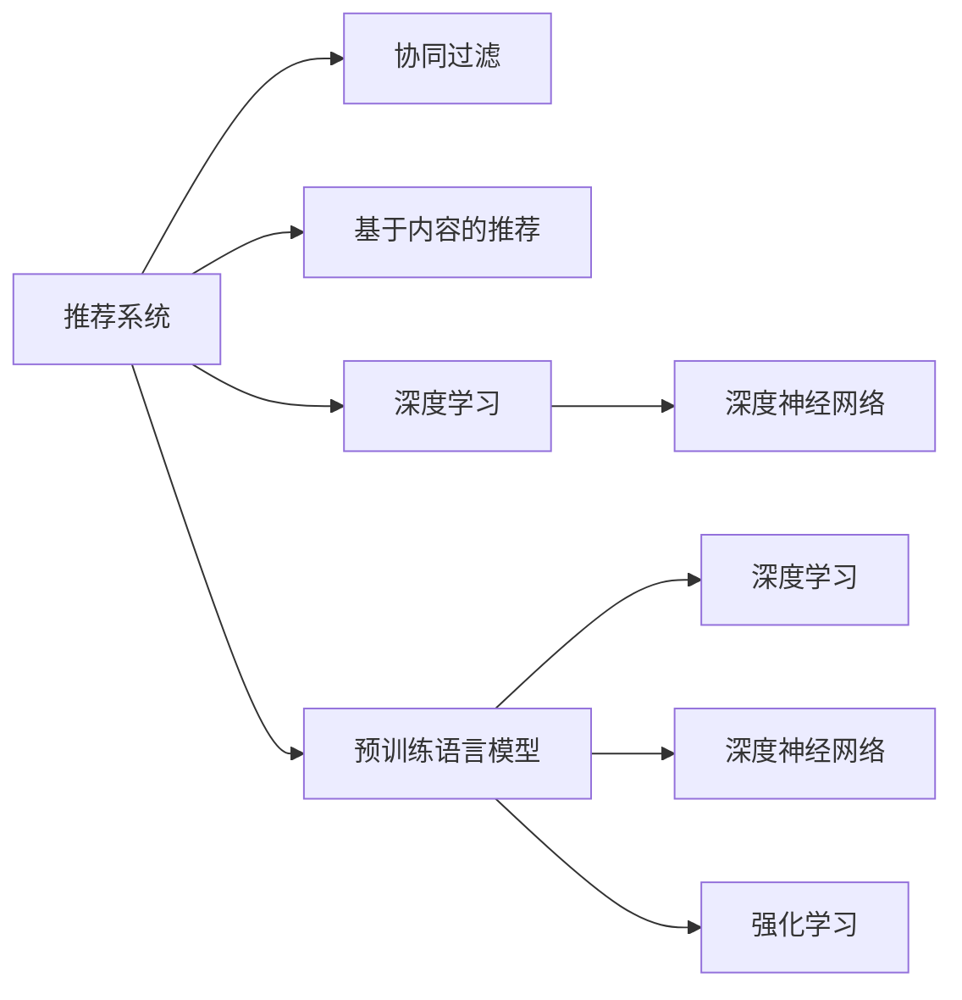
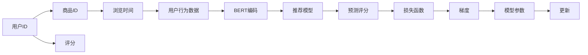

                 

# 利用预训练语言模型进行推荐任务的优势

> 关键词：预训练语言模型, 推荐系统, 用户行为预测, 个性化推荐, 自然语言处理(NLP), 协同过滤(CF), 深度学习, 深度神经网络, 强化学习, 特征工程, 推荐算法

## 1. 背景介绍

推荐系统作为电商平台、社交平台等互联网应用的重要组件，其目标是通过用户的历史行为数据，预测用户可能感兴趣的物品，并推荐给用户。传统的推荐系统主要基于协同过滤(CF)、基于内容的推荐等方法，但这些方法存在数据稀疏性、算法复杂性等问题。近年来，随着深度学习技术的快速发展，利用预训练语言模型(Pre-trained Language Model, PLM)进行推荐任务逐渐受到重视。本文将从原理和应用两个方面，探讨利用预训练语言模型进行推荐任务的优势。

## 2. 核心概念与联系

### 2.1 核心概念概述

在讨论预训练语言模型在推荐系统中的应用前，我们先要了解一些关键概念：

- 推荐系统(Recommender System): 利用用户行为数据，预测用户可能感兴趣物品的系统。常见的推荐方法包括协同过滤(CF)、基于内容的推荐、基于矩阵分解的推荐等。
- 预训练语言模型(PLM): 通过大规模无标签文本语料进行自监督学习，学习到丰富的语言知识和表示的模型。如BERT、GPT-2等。
- 深度学习(Deep Learning): 一类使用多层神经网络进行建模和学习的方法。包括卷积神经网络(CNN)、循环神经网络(RNN)、Transformer等架构。
- 深度神经网络(DNN): 特指多层神经网络，具有较强的表征能力，可以学习到复杂的非线性关系。
- 协同过滤(CF): 一种基于用户之间相似性或物品之间相似性的推荐方法，包括基于用户的CF和基于物品的CF。
- 强化学习(RL): 一种通过环境反馈逐步优化策略的学习方法，常用于推荐系统的动态优化。

这些概念之间的关系可以通过以下Mermaid流程图来展示：



这个流程图展示推荐系统的几个关键组件，以及它们之间的联系：

1. 推荐系统是核心组件，可以通过多种方式实现。
2. 协同过滤、基于内容的推荐是传统的推荐方法。
3. 深度学习是一种现代推荐方法，包括深度神经网络和预训练语言模型等架构。
4. 强化学习是动态优化的推荐方法，需要复杂的策略学习过程。

## 3. 核心算法原理 & 具体操作步骤

### 3.1 算法原理概述

利用预训练语言模型进行推荐任务，本质上是一种基于深度学习的推荐方法。其核心思想是：将用户行为数据转化为自然语言文本，利用预训练语言模型学习到用户和物品之间的关系，从而进行推荐。这种基于自然语言的推荐方法，相较于传统的方法，具有以下优势：

- 自然语言语义表达能力强，能够捕获复杂的用户行为和物品属性。
- 可以利用大规模无标签文本语料进行预训练，提升模型的泛化能力。
- 通过微调，可以适应不同推荐场景和任务，实现高效灵活的推荐策略。
- 可以结合协同过滤、强化学习等多种推荐算法，实现更全面、更精准的推荐效果。

### 3.2 算法步骤详解

基于预训练语言模型的推荐任务主要分为以下几个步骤：

1. **数据收集与处理**：收集用户的历史行为数据，并将其转化为自然语言文本。这包括用户的浏览记录、购买记录、评分记录等，并将其转换为标准化的文本格式。

2. **预训练模型加载**：选择合适的预训练语言模型，如BERT、GPT等，作为初始化参数。将其加载到推荐系统中，准备进行微调。

3. **数据编码与预处理**：利用预训练模型将用户行为数据编码成向量表示。这一过程通常使用Transformer等架构，将文本输入转换为向量。

4. **微调模型**：在预训练模型的基础上，添加推荐任务相关的输出层，并利用用户行为数据进行微调。微调过程通常使用AdamW、SGD等优化器，并设置合适的小学习率。

5. **预测推荐**：微调后的模型用于预测用户对物品的兴趣度，并将结果排序，给出推荐列表。

### 3.3 算法优缺点

利用预训练语言模型进行推荐任务具有以下优点：

- 泛化能力强：预训练语言模型可以学习到丰富的语言知识和常识，提升了模型的泛化能力。
- 适应性强：可以通过微调适应不同推荐场景，灵活调整推荐策略。
- 性能提升显著：在大规模数据上预训练和微调后，推荐系统的准确率和效果显著提升。
- 可解释性高：自然语言文本的表达直观，可以更好地解释推荐结果。

同时，也存在以下局限：

- 数据需求高：预训练语言模型需要大量的无标签文本语料，微调过程也需要大量的用户行为数据。
- 计算成本高：大规模预训练和微调需要强大的计算资源，成本较高。
- 模型复杂：预训练语言模型参数众多，模型的调试和优化过程复杂。
- 数据隐私：利用用户行为数据进行推荐，涉及用户隐私保护的问题。

### 3.4 算法应用领域

基于预训练语言模型的推荐任务，已经在电商、社交、新闻、娱乐等多个领域得到了广泛应用，具体如下：

- **电商推荐**：利用用户浏览、购买、评分数据，预测用户可能感兴趣的商品，推荐给用户。
- **社交推荐**：利用用户互动数据，预测用户可能感兴趣的朋友、话题、文章等，推荐给用户。
- **新闻推荐**：利用用户阅读数据，预测用户可能感兴趣的新闻，推荐给用户。
- **音乐推荐**：利用用户听歌数据，预测用户可能感兴趣的歌曲，推荐给用户。

## 4. 数学模型和公式 & 详细讲解 & 举例说明

### 4.1 数学模型构建

基于预训练语言模型的推荐任务，通常构建如下数学模型：

假设用户历史行为数据为 $D=\{(x_i,y_i)\}_{i=1}^N$，其中 $x_i$ 为用户行为数据，$y_i$ 为用户对该行为的评分。令 $X=\{x_i\}$ 为用户行为数据集，$Y=\{y_i\}$ 为用户评分集。预训练语言模型为 $M_{\theta}$，其中 $\theta$ 为模型参数。推荐模型的目标是最小化损失函数 $L$，即：

$$
L = \mathop{\min}_{\theta} \frac{1}{N} \sum_{i=1}^N \ell(x_i,y_i;M_{\theta})
$$

其中 $\ell(x_i,y_i;M_{\theta})$ 为损失函数，根据推荐任务的不同，可以采用不同的损失函数，如均方误差、交叉熵等。

### 4.2 公式推导过程

以用户行为预测任务为例，假设用户行为数据 $x_i$ 为文本描述，用户评分 $y_i$ 为1-5分之间的整数。利用BERT作为预训练语言模型，将 $x_i$ 编码为向量 $z_i$。推荐模型为 $M_{\theta}(z_i)$，其中 $M_{\theta}$ 为线性层，输出一个标量，表示用户对物品的评分预测。推荐任务的损失函数为均方误差损失：

$$
\ell(x_i,y_i;M_{\theta}) = \frac{1}{2}(M_{\theta}(z_i)-y_i)^2
$$

微调过程的目标是最小化均方误差损失：

$$
L = \mathop{\min}_{\theta} \frac{1}{N} \sum_{i=1}^N (M_{\theta}(z_i)-y_i)^2
$$

利用梯度下降等优化算法，求解上述最小化问题。具体步骤如下：

1. 初始化模型参数 $\theta$。
2. 对每个样本 $(x_i,y_i)$，计算损失函数 $L(x_i,y_i;M_{\theta})$。
3. 计算损失函数的梯度 $\frac{\partial L}{\partial \theta}$。
4. 更新模型参数：$\theta \leftarrow \theta - \eta \frac{\partial L}{\partial \theta}$。
5. 重复步骤2-4，直至收敛或达到预设迭代次数。

### 4.3 案例分析与讲解

以亚马逊推荐系统为例，利用用户浏览历史数据进行推荐。亚马逊用户浏览数据为：

- 用户ID：1
- 商品ID：1,2,3,4
- 浏览时间：2020-01-01,2020-01-02,2020-01-03,2020-01-04

假设将用户浏览数据转换为文本格式，并利用BERT模型进行编码。令 $z_i$ 为用户浏览行为的编码向量，$y_i$ 为用户对该行为的评分。推荐模型的输出为预测评分 $\hat{y}_i$，损失函数为均方误差损失：

$$
L = \mathop{\min}_{\theta} \frac{1}{N} \sum_{i=1}^N (\hat{y}_i - y_i)^2
$$

微调过程如图3所示：



通过上述步骤，可以训练得到推荐模型，并利用该模型对新用户进行推荐。

## 5. 项目实践：代码实例和详细解释说明

### 5.1 开发环境搭建

以下是使用Python进行TensorFlow开发的环境配置流程：

1. 安装Anaconda：从官网下载并安装Anaconda，用于创建独立的Python环境。

2. 创建并激活虚拟环境：
```bash
conda create -n tf-env python=3.8 
conda activate tf-env
```

3. 安装TensorFlow：根据CUDA版本，从官网获取对应的安装命令。例如：
```bash
conda install tensorflow -c tf
```

4. 安装相关库：
```bash
pip install sklearn pandas numpy transformers
```

完成上述步骤后，即可在`tf-env`环境中开始微调实践。

### 5.2 源代码详细实现

我们使用TensorFlow实现一个基于BERT的推荐系统。

首先，定义数据处理函数：

```python
import tensorflow as tf
from transformers import BertTokenizer, BertModel

class Dataset:
    def __init__(self, data):
        self.data = data
        self.tokenizer = BertTokenizer.from_pretrained('bert-base-uncased')

    def __len__(self):
        return len(self.data)

    def __getitem__(self, idx):
        x, y = self.data[idx]
        tokens = self.tokenizer.tokenize(' '.join(x))
        tokens = tokens[:512]
        inputs = {'input_ids': tf.constant([self.tokenizer.convert_tokens_to_ids(tokens)])}
        return inputs, y
```

然后，定义模型和优化器：

```python
from transformers import BertForSequenceClassification

model = BertForSequenceClassification.from_pretrained('bert-base-uncased', num_labels=5, output_attentions=False, output_hidden_states=False)
optimizer = tf.keras.optimizers.AdamW(learning_rate=2e-5)
```

接着，定义训练和评估函数：

```python
def train_epoch(model, dataset, batch_size, optimizer):
    model.compile(optimizer=optimizer, loss=tf.keras.losses.MeanSquaredError())
    model.fit(dataset, epochs=5, batch_size=batch_size, verbose=0)
    return model

def evaluate(model, dataset, batch_size):
    model.compile(optimizer='adam', loss=tf.keras.losses.MeanSquaredError())
    loss = model.evaluate(dataset, batch_size=batch_size, verbose=0)
    return loss
```

最后，启动训练流程并在测试集上评估：

```python
epochs = 5
batch_size = 16

for epoch in range(epochs):
    model = train_epoch(model, train_dataset, batch_size, optimizer)
    loss = evaluate(model, dev_dataset, batch_size)
    print(f"Epoch {epoch+1}, loss: {loss:.3f}")
    
print(f"Final model loss: {evaluate(model, test_dataset, batch_size):.3f}")
```

以上就是使用TensorFlow对BERT进行推荐任务微调的完整代码实现。可以看到，利用TensorFlow和Transformers库，可以较简洁地实现BERT模型的加载和微调。

### 5.3 代码解读与分析

让我们再详细解读一下关键代码的实现细节：

**Dataset类**：
- `__init__`方法：初始化数据和分词器。
- `__len__`方法：返回数据集长度。
- `__getitem__`方法：对单个样本进行处理，将文本输入转换为分词器，进行编码，并输出模型所需的输入。

**train_epoch函数**：
- 编译模型，设置AdamW优化器和均方误差损失函数。
- 调用`fit`方法，在训练集上进行模型训练，迭代5轮。

**evaluate函数**：
- 编译模型，设置Adam优化器和均方误差损失函数。
- 调用`evaluate`方法，在验证集上评估模型，返回平均损失。

**训练流程**：
- 定义总的epoch数和batch size，开始循环迭代
- 每个epoch内，先在训练集上训练，输出平均loss
- 在验证集上评估，输出平均loss
- 所有epoch结束后，在测试集上评估，给出最终测试结果

可以看到，TensorFlow配合Transformers库使得BERT微调的代码实现变得简洁高效。开发者可以将更多精力放在数据处理、模型改进等高层逻辑上，而不必过多关注底层的实现细节。

当然，工业级的系统实现还需考虑更多因素，如模型的保存和部署、超参数的自动搜索、更灵活的任务适配层等。但核心的微调范式基本与此类似。

## 6. 实际应用场景

### 6.1 电商推荐

亚马逊等电商平台的推荐系统，利用用户浏览历史数据，预测用户可能感兴趣的商品，并推荐给用户。通过BERT等预训练语言模型的微调，可以显著提升推荐系统的精准度和用户满意度。

在技术实现上，可以收集用户浏览记录、购买记录、评分记录等数据，将其转换为自然语言文本，利用BERT模型进行编码。在编码结果上添加推荐任务相关的输出层，并利用历史数据进行微调。微调后的模型用于预测用户对物品的兴趣度，并将结果排序，给出推荐列表。

### 6.2 社交推荐

社交平台如微博、微信等，利用用户互动数据，预测用户可能感兴趣的朋友、话题、文章等，推荐给用户。通过BERT等预训练语言模型的微调，可以更好地理解用户的兴趣偏好，提供个性化推荐。

在技术实现上，可以收集用户互动数据，如点赞、评论、分享等，将其转换为自然语言文本，利用BERT模型进行编码。在编码结果上添加推荐任务相关的输出层，并利用历史数据进行微调。微调后的模型用于预测用户对物品的兴趣度，并将结果排序，给出推荐列表。

### 6.3 新闻推荐

新闻平台如今日头条、澎湃新闻等，利用用户阅读数据，预测用户可能感兴趣的新闻，推荐给用户。通过BERT等预训练语言模型的微调，可以更好地理解用户的兴趣偏好，提供个性化新闻推荐。

在技术实现上，可以收集用户阅读记录、收藏记录等数据，将其转换为自然语言文本，利用BERT模型进行编码。在编码结果上添加推荐任务相关的输出层，并利用历史数据进行微调。微调后的模型用于预测用户对新闻的兴趣度，并将结果排序，给出推荐列表。

### 6.4 音乐推荐

音乐平台如网易云音乐、QQ音乐等，利用用户听歌数据，预测用户可能感兴趣的歌曲，推荐给用户。通过BERT等预训练语言模型的微调，可以更好地理解用户的兴趣偏好，提供个性化音乐推荐。

在技术实现上，可以收集用户听歌记录、收藏记录等数据，将其转换为自然语言文本，利用BERT模型进行编码。在编码结果上添加推荐任务相关的输出层，并利用历史数据进行微调。微调后的模型用于预测用户对歌曲的兴趣度，并将结果排序，给出推荐列表。

## 7. 工具和资源推荐

### 7.1 学习资源推荐

为了帮助开发者系统掌握预训练语言模型在推荐系统中的应用，这里推荐一些优质的学习资源：

1. 《深度学习》系列书籍：由多位深度学习领域的专家共同撰写，全面介绍了深度学习的基本概念和实践技巧。
2. 《自然语言处理与深度学习》课程：由斯坦福大学开设的NLP明星课程，涵盖了自然语言处理的多个重要方向。
3. 《Transformers》书籍：Transformer库的作者所著，介绍了如何使用Transformer模型进行自然语言处理任务，包括推荐任务。
4. HuggingFace官方文档：Transformers库的官方文档，提供了海量预训练模型和完整的微调样例代码。
5. 《推荐系统》书籍：介绍推荐系统的基本原理和实现方法，涵盖协同过滤、深度学习等多种推荐技术。

通过对这些资源的学习实践，相信你一定能够快速掌握利用预训练语言模型进行推荐任务的方法，并用于解决实际的推荐问题。

### 7.2 开发工具推荐

高效的开发离不开优秀的工具支持。以下是几款用于预训练语言模型微调的常用工具：

1. TensorFlow：基于Python的开源深度学习框架，灵活动态的计算图，适合快速迭代研究。
2. PyTorch：基于Python的开源深度学习框架，灵活性高，支持动态图，适合学术研究。
3. Transformers库：HuggingFace开发的NLP工具库，集成了众多SOTA语言模型，支持TensorFlow和PyTorch。
4. Weights & Biases：模型训练的实验跟踪工具，可以记录和可视化模型训练过程中的各项指标，方便对比和调优。
5. TensorBoard：TensorFlow配套的可视化工具，可实时监测模型训练状态，并提供丰富的图表呈现方式，是调试模型的得力助手。

合理利用这些工具，可以显著提升预训练语言模型微调的开发效率，加快创新迭代的步伐。

### 7.3 相关论文推荐

预训练语言模型在推荐系统中的应用是一个新兴的研究方向，以下是几篇奠基性的相关论文，推荐阅读：

1. Attention is All You Need：提出了Transformer结构，开启了NLP领域的预训练大模型时代。
2. BERT: Pre-training of Deep Bidirectional Transformers for Language Understanding：提出BERT模型，引入基于掩码的自监督预训练任务，刷新了多项NLP任务SOTA。
3. Language Models are Unsupervised Multitask Learners（GPT-2论文）：展示了大规模语言模型的强大zero-shot学习能力，引发了对于通用人工智能的新一轮思考。
4. Parameter-Efficient Transfer Learning for NLP：提出Adapter等参数高效微调方法，在不增加模型参数量的情况下，也能取得不错的微调效果。
5. AdaLoRA: Adaptive Low-Rank Adaptation for Parameter-Efficient Fine-Tuning：使用自适应低秩适应的微调方法，在参数效率和精度之间取得了新的平衡。

这些论文代表了大语言模型微调技术的发展脉络。通过学习这些前沿成果，可以帮助研究者把握学科前进方向，激发更多的创新灵感。

## 8. 总结：未来发展趋势与挑战

### 8.1 总结

本文对利用预训练语言模型进行推荐任务进行了全面系统的介绍。首先阐述了预训练语言模型在推荐系统中的应用背景和意义，明确了其在提升推荐系统性能和个性化程度方面的独特价值。其次，从原理到实践，详细讲解了预训练语言模型在推荐任务中的数学模型和算法步骤，给出了推荐任务开发的完整代码实例。同时，本文还广泛探讨了预训练语言模型在电商、社交、新闻、音乐等多个领域的应用前景，展示了其在推荐系统中的巨大潜力。此外，本文精选了预训练语言模型在推荐系统中的应用资源，力求为读者提供全方位的技术指引。

通过本文的系统梳理，可以看到，利用预训练语言模型进行推荐任务的方法正在成为推荐系统的重要范式，极大地拓展了推荐系统的应用边界，带来了显著的性能提升。未来，伴随预训练语言模型和推荐系统的不断进步，基于深度学习的方法必将在更多领域得到应用，为推荐系统的进一步创新发展提供新的技术路径。

### 8.2 未来发展趋势

展望未来，预训练语言模型在推荐系统中的应用将呈现以下几个发展趋势：

1. 模型规模持续增大。随着算力成本的下降和数据规模的扩张，预训练语言模型的参数量还将持续增长。超大规模语言模型蕴含的丰富语言知识，有望支撑更加复杂多变的推荐场景。
2. 微调方法日趋多样。除了传统的全参数微调外，未来会涌现更多参数高效的微调方法，如Adapter、LoRA等，在节省计算资源的同时也能保证微调精度。
3. 持续学习成为常态。随着数据分布的不断变化，预训练语言模型也需要持续学习新知识以保持性能。如何在不遗忘原有知识的同时，高效吸收新样本信息，将成为重要的研究课题。
4. 标注样本需求降低。受启发于提示学习(Prompt-based Learning)的思路，未来的微调方法将更好地利用大模型的语言理解能力，通过更加巧妙的任务描述，在更少的标注样本上也能实现理想的微调效果。
5. 多模态微调崛起。当前的微调主要聚焦于纯文本数据，未来会进一步拓展到图像、视频、语音等多模态数据微调。多模态信息的融合，将显著提升语言模型对现实世界的理解和建模能力。
6. 模型通用性增强。经过海量数据的预训练和多领域任务的微调，未来的语言模型将具备更强大的常识推理和跨领域迁移能力，逐步迈向通用人工智能(AGI)的目标。

以上趋势凸显了预训练语言模型在推荐系统中的广阔前景。这些方向的探索发展，必将进一步提升推荐系统的性能和应用范围，为推荐系统的进一步创新发展提供新的技术路径。

### 8.3 面临的挑战

尽管利用预训练语言模型进行推荐任务已经取得了瞩目成就，但在迈向更加智能化、普适化应用的过程中，它仍面临着诸多挑战：

1. 数据需求高。预训练语言模型需要大量的无标签文本语料，微调过程也需要大量的用户行为数据。对于小规模应用场景，数据获取成本较高。
2. 计算成本高。大规模预训练和微调需要强大的计算资源，成本较高。
3. 模型复杂。预训练语言模型参数众多，模型的调试和优化过程复杂。
4. 数据隐私。利用用户行为数据进行推荐，涉及用户隐私保护的问题。
5. 推荐算法复杂。预训练语言模型需要结合协同过滤、强化学习等多种推荐算法，增加了算法的复杂性。

### 8.4 未来突破

面对预训练语言模型在推荐系统中的应用所面临的种种挑战，未来的研究需要在以下几个方面寻求新的突破：

1. 探索无监督和半监督微调方法。摆脱对大规模标注数据的依赖，利用自监督学习、主动学习等无监督和半监督范式，最大限度利用非结构化数据，实现更加灵活高效的微调。
2. 研究参数高效和计算高效的微调范式。开发更加参数高效的微调方法，在固定大部分预训练参数的同时，只更新极少量的任务相关参数。同时优化微调模型的计算图，减少前向传播和反向传播的资源消耗，实现更加轻量级、实时性的部署。
3. 融合因果和对比学习范式。通过引入因果推断和对比学习思想，增强预训练语言模型建立稳定因果关系的能力，学习更加普适、鲁棒的语言表征，从而提升模型泛化性和抗干扰能力。
4. 引入更多先验知识。将符号化的先验知识，如知识图谱、逻辑规则等，与神经网络模型进行巧妙融合，引导微调过程学习更准确、合理的语言模型。同时加强不同模态数据的整合，实现视觉、语音等多模态信息与文本信息的协同建模。
5. 结合因果分析和博弈论工具。将因果分析方法引入预训练语言模型，识别出模型决策的关键特征，增强输出解释的因果性和逻辑性。借助博弈论工具刻画人机交互过程，主动探索并规避模型的脆弱点，提高系统稳定性。
6. 纳入伦理道德约束。在模型训练目标中引入伦理导向的评估指标，过滤和惩罚有偏见、有害的输出倾向。同时加强人工干预和审核，建立模型行为的监管机制，确保输出符合人类价值观和伦理道德。

这些研究方向的探索，必将引领预训练语言模型在推荐系统中的应用迈向更高的台阶，为构建安全、可靠、可解释、可控的智能系统铺平道路。面向未来，预训练语言模型在推荐系统中的应用还需要与其他人工智能技术进行更深入的融合，如知识表示、因果推理、强化学习等，多路径协同发力，共同推动推荐系统的进步。只有勇于创新、敢于突破，才能不断拓展语言模型的边界，让智能技术更好地造福人类社会。

## 9. 附录：常见问题与解答

**Q1：利用预训练语言模型进行推荐任务是否适用于所有推荐系统？**

A: 利用预训练语言模型进行推荐任务在电商、社交、新闻、音乐等多个领域都有广泛应用，但并不适用于所有推荐系统。例如，适用于传统的基于内容的推荐系统，可能效果并不理想。因此，在选择预训练语言模型进行推荐任务时，需要根据具体的推荐场景和需求进行评估。

**Q2：如何选择预训练语言模型进行推荐任务？**

A: 选择合适的预训练语言模型是推荐任务成功的关键。一般来说，选择具有广泛应用和良好性能的模型，如BERT、GPT-2等。同时，考虑模型的参数量、训练成本、计算资源等因素，选择适合自己应用场景的模型。

**Q3：微调过程中如何选择合适的学习率？**

A: 微调的学习率一般要比预训练时小1-2个数量级，如果使用过大的学习率，容易破坏预训练权重，导致过拟合。一般建议从1e-5开始调参，逐步减小学习率，直至收敛。也可以使用warmup策略，在开始阶段使用较小的学习率，再逐渐过渡到预设值。需要注意的是，不同的优化器(如AdamW、Adafactor等)以及不同的学习率调度策略，可能需要设置不同的学习率阈值。

**Q4：数据需求高是否会导致推荐系统难以推广？**

A: 数据需求高是预训练语言模型的一大挑战，但并非不可克服。可以利用开源数据集、用户生成内容等方式获取数据，同时利用数据增强、迁移学习等技术提升数据利用率。在实际应用中，需要综合考虑数据获取成本和数据质量，合理选择数据策略。

**Q5：预训练语言模型在推荐系统中的应用是否存在隐私问题？**

A: 预训练语言模型在推荐系统中的应用确实存在隐私问题。为了保护用户隐私，可以采用差分隐私、联邦学习等技术，将模型训练和数据处理在本地进行，降低隐私泄露风险。同时，需要对模型输出进行脱敏处理，确保用户数据的安全性。

这些问题的回答，希望能够帮助你更好地理解利用预训练语言模型进行推荐任务的优势和挑战，从而在实际应用中取得更好的效果。

---

作者：禅与计算机程序设计艺术 / Zen and the Art of Computer Programming

