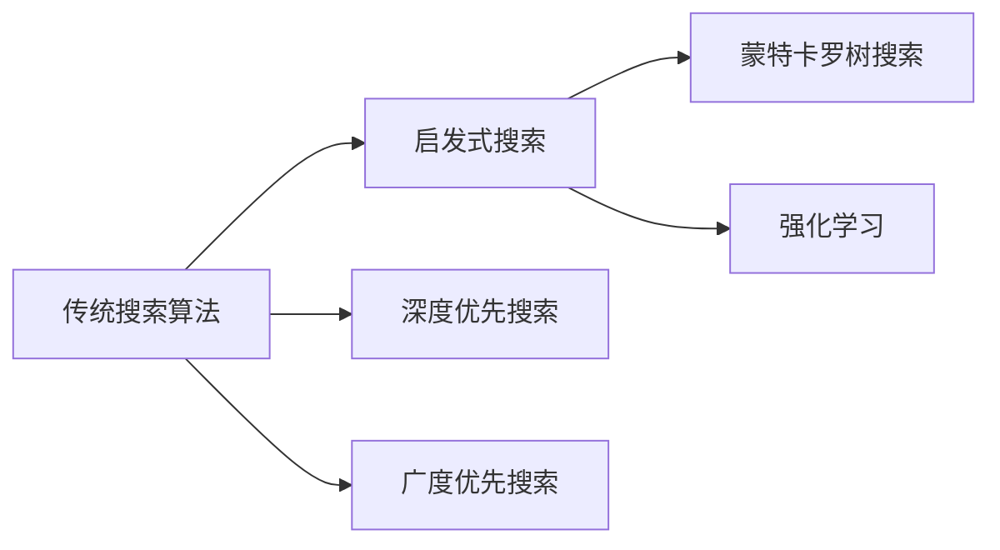

                 

## 1. 背景介绍

在人工智能领域，搜索技术历来占据着重要地位。从早期的启发式搜索到现代的深度学习驱动的强化学习，搜索算法不断发展，并在各种应用场景中发挥着关键作用。然而，随着数据量的爆炸性增长和应用场景的复杂化，传统的搜索算法面临着诸多挑战。本文将深入探讨如何通过加速搜索技术提升人工智能的效率，介绍最新的研究成果和实用技巧，帮助读者在实际项目中优化搜索算法，提高AI系统性能。

## 2. 核心概念与联系

### 2.1 核心概念概述

在人工智能领域，搜索技术不仅包括传统的布尔搜索、深度优先搜索和广度优先搜索等基本算法，还包括更加复杂和高级的算法，如蒙特卡罗树搜索（Monte Carlo Tree Search, MCTS）、强化学习中的Q-learning等。这些算法通过不同的方式来探索和评估搜索空间，以找到最优或近似最优的解决方案。

### 2.2 核心概念原理和架构的 Mermaid 流程图



这张图展示了从传统搜索算法到高级搜索算法的演变路径。传统搜索算法如深度优先搜索和广度优先搜索主要用于简单的、无状态的搜索空间，而启发式搜索、蒙特卡罗树搜索和强化学习则能处理更复杂、具有动态特性的搜索空间。

## 3. 核心算法原理 & 具体操作步骤

### 3.1 算法原理概述

加速搜索技术主要通过以下几个方面来提升人工智能系统的效率：

- **高效搜索空间探索**：使用更先进的搜索策略，如启发式搜索、蒙特卡罗树搜索等，以更快速地覆盖搜索空间，找到最优或近似最优解。
- **状态表示与压缩**：通过有效的状态表示和压缩技术，减少搜索过程中存储和计算的资源消耗。
- **并行计算与分布式计算**：利用并行计算和分布式计算技术，加速搜索算法的执行速度，提高系统的可扩展性和性能。
- **强化学习优化**：使用强化学习算法优化搜索策略，提升搜索效率和效果。

### 3.2 算法步骤详解

#### 3.2.1 启发式搜索算法

启发式搜索算法通过引入一个启发函数，来指导搜索方向的优先级。启发函数通常基于问题的特定属性，如路径长度、目标距离等，来估计从当前状态到目标状态的代价。启发式搜索算法有多种，包括A*、IDA*、SPFA等。

#### 3.2.2 蒙特卡罗树搜索

蒙特卡罗树搜索（MCTS）是一种基于模拟的搜索算法，适用于解决不确定性和复杂性的问题。MCTS算法通过构建搜索树，模拟多个随机策略来评估当前节点的优劣，并根据模拟结果调整搜索策略。

#### 3.2.3 强化学习优化

强化学习算法通过奖励机制来指导搜索行为，使得搜索策略能够自我优化。常用的强化学习算法包括Q-learning、Deep Q-Network（DQN）等。

### 3.3 算法优缺点

#### 3.3.1 启发式搜索算法

**优点**：
- 能够处理大规模搜索空间。
- 能够处理复杂约束和目标函数。
- 对于特定问题，能够提供高质量的解决方案。

**缺点**：
- 启发函数的设计可能非常困难。
- 无法保证找到全局最优解。
- 对于特定问题，可能需要大量的时间进行调参和优化。

#### 3.3.2 蒙特卡罗树搜索

**优点**：
- 能够处理不确定性和复杂性问题。
- 适用于在线决策过程。
- 能够自适应地优化搜索策略。

**缺点**：
- 需要大量的计算资源。
- 对于大规模问题，可能需要较长时间才能收敛。
- 难以处理连续变量。

#### 3.3.3 强化学习优化

**优点**：
- 能够自动学习最优策略。
- 适用于动态变化的环境。
- 能够处理连续变量和复杂约束。

**缺点**：
- 需要大量的样本来学习。
- 需要精心设计的奖励函数。
- 需要大量的计算资源进行训练。

### 3.4 算法应用领域

加速搜索技术广泛应用于各种人工智能应用场景，包括：

- **游戏AI**：通过强化学习优化，实现复杂的棋类游戏和实时策略游戏。
- **机器人控制**：使用蒙特卡罗树搜索和强化学习，实现机器人在复杂环境中的自主导航和任务执行。
- **金融分析**：利用启发式搜索和蒙特卡罗树搜索，优化投资组合和风险评估。
- **自然语言处理**：通过启发式搜索和深度学习，实现高效的自然语言理解和生成。
- **推荐系统**：使用强化学习优化，提升推荐算法的准确性和个性化。

## 4. 数学模型和公式 & 详细讲解 & 举例说明

### 4.1 数学模型构建

假设我们有一个搜索空间 $S$，搜索目标是找到最优解 $x^*$。一个基本的搜索算法可以分为两个部分：探索（Exploitation）和开发（Exploration）。探索部分尝试找到当前最好的解，开发部分则通过评估和模拟来寻找新的解。

### 4.2 公式推导过程

#### 4.2.1 启发式搜索算法

启发式搜索算法通常通过一个启发函数 $f(x)$ 来估计从当前状态 $x$ 到目标状态 $x^*$ 的距离。常用的启发函数包括曼哈顿距离、欧几里得距离等。

$$
f(x) = d(x, x^*)
$$

其中 $d$ 表示距离函数。

#### 4.2.2 蒙特卡罗树搜索

蒙特卡罗树搜索的核心在于构建一棵搜索树，并通过模拟来评估每个节点的优劣。每个节点 $n$ 的状态为 $s_n$，其价值估计为 $v_n$，每个节点的模拟次数为 $N_n$。蒙特卡罗树搜索的核心公式为：

$$
v_n \leftarrow v_n + \frac{1}{N_n} \sum_{i=1}^{N_n} R(s_i, a_i)
$$

其中 $R(s_i, a_i)$ 表示在状态 $s_i$ 下，采取动作 $a_i$ 的回报值。

#### 4.2.3 强化学习优化

强化学习算法通过奖励函数 $R(s, a)$ 来学习最优策略。常用的奖励函数包括即时奖励和累积奖励。Q-learning算法通过更新Q值来优化策略，其核心公式为：

$$
Q(s_t, a_t) \leftarrow Q(s_t, a_t) + \alpha (R_{t+1} + \gamma \max_{a'} Q(s_{t+1}, a')) - Q(s_t, a_t)
$$

其中 $\alpha$ 是学习率，$\gamma$ 是折扣因子。

### 4.3 案例分析与讲解

#### 4.3.1 游戏AI中的蒙特卡罗树搜索

在游戏AI中，蒙特卡罗树搜索被广泛用于棋类游戏，如围棋、象棋等。通过构建搜索树，并模拟大量的随机策略，蒙特卡罗树搜索能够找到最优的落子策略。

#### 4.3.2 自然语言处理中的启发式搜索

在自然语言处理中，启发式搜索被用于文本匹配、信息检索等任务。通过构建搜索树，并根据文本的相似度或关键词的匹配度进行排序，启发式搜索能够快速找到与查询最相关的文档。

## 5. 项目实践：代码实例和详细解释说明

### 5.1 开发环境搭建

在进行加速搜索算法实践前，我们需要准备好开发环境。以下是使用Python进行Scikit-learn开发的环境配置流程：

1. 安装Anaconda：从官网下载并安装Anaconda，用于创建独立的Python环境。

2. 创建并激活虚拟环境：
```bash
conda create -n scikit-learn-env python=3.8 
conda activate scikit-learn-env
```

3. 安装Scikit-learn：
```bash
pip install scikit-learn
```

4. 安装其他工具包：
```bash
pip install numpy pandas matplotlib scikit-learn matplotlib tqdm jupyter notebook ipython
```

完成上述步骤后，即可在`scikit-learn-env`环境中开始加速搜索算法实践。

### 5.2 源代码详细实现

下面是使用Scikit-learn实现启发式搜索算法的代码示例：

```python
from sklearn.neighbors import NearestNeighbors
from sklearn.cluster import DBSCAN
import numpy as np
import matplotlib.pyplot as plt

# 构建搜索空间
data = np.random.rand(100, 2)

# 定义启发函数
def heuristic(x):
    return np.linalg.norm(x - np.array([0.5, 0.5]))

# 定义启发式搜索算法
def a_star(data, heuristic):
    # 初始化起点
    start = data[0]
    
    # 初始化距离
    distances = {point: np.inf for point in data}
    distances[start] = 0
    
    # 初始化父节点
    parents = {point: None for point in data}
    parents[start] = None
    
    # 搜索过程
    while True:
        # 找到当前最优节点
        current = min(data, key=distances.get)
        
        # 如果已经到达终点，返回路径
        if heuristic(current) < 1e-5:
            path = []
            while current is not None:
                path.append(current)
                current = parents[current]
            return path[::-1]
        
        # 更新距离和父节点
        for neighbor in data:
            if neighbor not in parents:
                new_distance = np.linalg.norm(neighbor - start) + heuristic(neighbor)
                if new_distance < distances[neighbor]:
                    distances[neighbor] = new_distance
                    parents[neighbor] = current
    
# 运行算法
path = a_star(data, heuristic)

# 可视化结果
plt.scatter(data[:, 0], data[:, 1], c='blue', label='Data Points')
plt.plot(path[:, 0], path[:, 1], c='red', label='Path')
plt.legend()
plt.show()
```

### 5.3 代码解读与分析

**启发式搜索算法**：

- `heuristic`函数定义了一个启发函数，用于估计从起点到终点的距离。
- `a_star`函数实现了启发式搜索算法，通过不断更新起点和距离，找到最优路径。

**可视化结果**：

- 通过可视化搜索结果，可以直观地看到从起点到终点的最优路径。

## 6. 实际应用场景

### 6.1 游戏AI

在游戏AI中，蒙特卡罗树搜索被广泛用于棋类游戏，如围棋、象棋等。通过构建搜索树，并模拟大量的随机策略，蒙特卡罗树搜索能够找到最优的落子策略。

### 6.2 自然语言处理

在自然语言处理中，启发式搜索被用于文本匹配、信息检索等任务。通过构建搜索树，并根据文本的相似度或关键词的匹配度进行排序，启发式搜索能够快速找到与查询最相关的文档。

### 6.3 机器人控制

在机器人控制中，使用蒙特卡罗树搜索和强化学习，实现机器人在复杂环境中的自主导航和任务执行。通过模拟不同的环境和动作，优化机器人的控制策略，使得机器人能够高效地完成任务。

## 7. 工具和资源推荐

### 7.1 学习资源推荐

为了帮助开发者系统掌握加速搜索算法的理论基础和实践技巧，这里推荐一些优质的学习资源：

1. 《深度学习》（Deep Learning）一书：由Ian Goodfellow等人合著，全面介绍了深度学习的基本概念和应用，是深度学习领域的经典教材。

2. 《强化学习：一种现代方法》（Reinforcement Learning: An Introduction）一书：由Richard S. Sutton和Andrew G. Barto合著，详细介绍了强化学习的基本概念和算法，是强化学习领域的经典教材。

3. 《Python机器学习》（Python Machine Learning）一书：由Sebastian Raschka和Vahid Mirjalili合著，介绍了机器学习在Python中的应用，包括Scikit-learn的使用方法。

4. Scikit-learn官方文档：Scikit-learn的官方文档，提供了大量的教程和示例，适合快速上手实验。

5. GitHub上的深度学习项目：通过GitHub上的深度学习项目，可以学习到最新的研究成果和实用技巧。

通过对这些资源的学习实践，相信你一定能够快速掌握加速搜索算法的精髓，并用于解决实际的AI问题。

### 7.2 开发工具推荐

高效的开发离不开优秀的工具支持。以下是几款用于加速搜索算法开发的常用工具：

1. Scikit-learn：Python中的机器学习库，提供了丰富的算法和工具，包括启发式搜索、蒙特卡罗树搜索等。

2. TensorFlow和PyTorch：深度学习框架，可以用于实现复杂的强化学习算法。

3. Jupyter Notebook：交互式编程环境，支持多种语言和工具，适合快速原型设计和实验。

4. GitHub和Git：版本控制和代码托管工具，便于协作和版本管理。

5. Scalene：性能分析工具，可以评估代码的性能瓶颈和优化建议。

合理利用这些工具，可以显著提升加速搜索算法的开发效率，加快创新迭代的步伐。

### 7.3 相关论文推荐

加速搜索技术的发展源于学界的持续研究。以下是几篇奠基性的相关论文，推荐阅读：

1. A*算法：由H.A. Hart等人于1968年提出，是最早的启发式搜索算法之一。

2. Monte Carlo Tree Search：由R.C. Tesauro等人于2007年提出，广泛应用于棋类游戏和机器人控制等任务。

3. Q-Learning：由D. Sutton等人于1989年提出，是强化学习领域的基础算法之一。

这些论文代表了大规模语言模型微调技术的发展脉络。通过学习这些前沿成果，可以帮助研究者把握学科前进方向，激发更多的创新灵感。

## 8. 总结：未来发展趋势与挑战

### 8.1 总结

本文对加速搜索技术进行了全面系统的介绍。首先阐述了加速搜索技术的研究背景和意义，明确了加速搜索在提升人工智能系统性能方面的独特价值。其次，从原理到实践，详细讲解了启发式搜索、蒙特卡罗树搜索、强化学习等核心算法的数学原理和操作流程，给出了实现代码和结果展示。同时，本文还广泛探讨了加速搜索技术在各种AI领域的应用前景，展示了其巨大的潜力。

通过本文的系统梳理，可以看到，加速搜索技术正在成为人工智能算法优化的一个重要方向，通过优化搜索算法，可以显著提升系统的性能和效率。未来，伴随搜索算法的持续演进，加速搜索技术必将进一步推动人工智能系统向更高的性能和智能水平迈进。

### 8.2 未来发展趋势

展望未来，加速搜索技术将呈现以下几个发展趋势：

1. **更高效的搜索策略**：随着搜索算法和计算能力的提升，未来的搜索算法将能够更加快速地探索和评估搜索空间，找到最优解。

2. **更加智能的启发函数**：启发函数的设计将更加复杂和灵活，能够更好地引导搜索过程，提高搜索效率。

3. **更加高效的并行计算和分布式计算**：通过分布式计算和并行计算，搜索算法将能够处理更复杂和更大规模的问题。

4. **强化学习与搜索算法的结合**：强化学习算法将能够更好地优化搜索策略，提升搜索效率和效果。

5. **多模态搜索技术**：未来的搜索算法将能够处理视觉、语音、文本等多种模态的数据，实现多模态搜索和推理。

以上趋势凸显了加速搜索技术的广阔前景。这些方向的探索发展，必将进一步提升人工智能系统的性能和应用范围，为人类认知智能的进化带来深远影响。

### 8.3 面临的挑战

尽管加速搜索技术已经取得了显著的进展，但在迈向更加智能化、普适化应用的过程中，它仍面临着诸多挑战：

1. **计算资源消耗**：加速搜索算法需要大量的计算资源，如何高效利用资源，减少计算时间和内存占用，是一个重要的问题。

2. **算法复杂性**：一些先进的搜索算法如蒙特卡罗树搜索和强化学习，计算复杂度较高，如何简化算法，提高执行效率，是未来研究的方向。

3. **可解释性不足**：搜索算法的内部机制复杂，难以解释其决策过程，对于高风险应用，算法的可解释性和可审计性尤为重要。

4. **数据依赖性强**：一些搜索算法如强化学习，需要大量的样本来学习，如何利用少量数据进行训练和优化，是未来研究的重点。

5. **鲁棒性不足**：当前搜索算法面对动态变化的环境和噪声干扰，容易产生误判和震荡，如何提高鲁棒性，确保算法稳定性，是未来研究的重点。

6. **伦理和安全性问题**：搜索算法可能被用于恶意目的，如恶意自动驾驶等，如何确保算法的伦理和安全，避免有害用途，是未来研究的重点。

这些挑战需要学界和工业界的共同努力，才能推动加速搜索技术走向成熟。

### 8.4 研究展望

面对加速搜索技术所面临的种种挑战，未来的研究需要在以下几个方面寻求新的突破：

1. **高效搜索策略的设计**：开发更高效的搜索策略，减少搜索时间，提高搜索效率。

2. **启发函数的优化**：设计更加智能和自适应的启发函数，提高搜索效果。

3. **并行计算和分布式计算的优化**：优化并行计算和分布式计算，提升搜索算法的可扩展性和性能。

4. **强化学习的优化**：利用强化学习优化搜索算法，提升搜索效率和效果。

5. **多模态搜索技术的发展**：发展多模态搜索技术，处理视觉、语音、文本等多种模态的数据，实现多模态搜索和推理。

6. **算法鲁棒性的增强**：增强搜索算法的鲁棒性，提高算法的稳定性和抗干扰能力。

7. **算法的可解释性增强**：提高搜索算法的可解释性，确保算法的透明性和可审计性。

8. **算法伦理和安全性的提升**：提升搜索算法的伦理和安全性，确保算法的应用符合人类价值观和伦理道德。

这些研究方向的探索，必将引领加速搜索技术迈向更高的台阶，为构建安全、可靠、可解释、可控的智能系统铺平道路。面向未来，加速搜索技术还需要与其他人工智能技术进行更深入的融合，如知识表示、因果推理、强化学习等，多路径协同发力，共同推动自然语言理解和智能交互系统的进步。只有勇于创新、敢于突破，才能不断拓展搜索算法的边界，让智能技术更好地造福人类社会。

## 9. 附录：常见问题与解答

**Q1：加速搜索技术是否适用于所有AI应用场景？**

A: 加速搜索技术在大多数AI应用场景中都有广泛的应用，特别是在需要搜索和优化问题的领域。但对于一些实时性要求高、处理速度快的任务，可能需要其他类型的算法进行优化。

**Q2：如何选择适合的加速搜索算法？**

A: 选择适合的加速搜索算法需要考虑问题的特性、数据的特点和计算资源等因素。一般来说，对于大规模、复杂的问题，可以使用蒙特卡罗树搜索和强化学习；对于简单、静态的问题，可以使用启发式搜索。

**Q3：加速搜索算法如何优化？**

A: 优化加速搜索算法可以从多个方面入手，如启发函数的改进、搜索策略的优化、并行计算的加速等。通常需要根据具体问题和数据集进行实验和调整。

**Q4：加速搜索算法在实际应用中需要注意哪些问题？**

A: 在实际应用中，需要注意计算资源的消耗、算法复杂度、算法鲁棒性等问题。同时，还需要考虑算法的可解释性和安全性，确保算法的透明性和可靠性。

总之，加速搜索技术是提高人工智能系统效率的重要手段，通过不断优化和改进，将能够进一步推动人工智能技术的发展和应用。相信随着研究的深入，加速搜索技术将在更多领域发挥重要作用，为构建高效、智能、可控的AI系统贡献力量。

