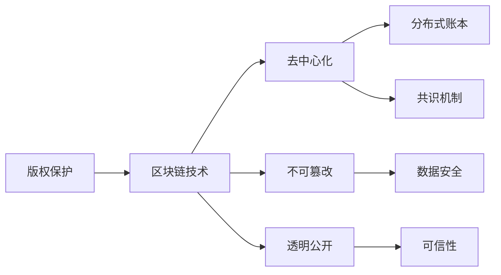

                 

# 区块链在版权保护中的应用

## 1. 背景介绍

随着数字技术的发展，版权保护面临着新的挑战。互联网的普及使得作品传播更加便捷，但也带来了盗版、侵权等新的问题。传统版权保护手段如版权登记、数字水印等，在技术上存在诸多局限性，难以适应复杂多变的版权环境。区块链技术的出现，为版权保护提供了一种全新的解决方案，可以有效地解决现有手段存在的问题。

## 2. 核心概念与联系

### 2.1 核心概念概述

区块链作为一种分布式账本技术，具备去中心化、不可篡改、透明公开等特性。这些特性使得区块链在版权保护中具有显著优势。

- **版权保护**：是指保护创作者对于作品的著作权，包括著作权、出版权、发行权、改编权、翻译权、表演权等。版权保护旨在保障创作者的经济利益和创作自由。
- **区块链技术**：是一种去中心化的分布式账本技术，具有去中心化、不可篡改、透明公开等特点，可以确保数据的可信性和安全性。

### 2.2 核心概念原理和架构的 Mermaid 流程图



## 3. 核心算法原理 & 具体操作步骤

### 3.1 算法原理概述

区块链在版权保护中的应用，主要通过记录作品的创建、发布、传播、版权转让等信息，来保障作者的权益。其核心算法原理如下：

1. **数字版权登记**：将作品的元数据（如作品名称、创作者、发布时间等）上传到区块链，并通过智能合约自动记录版权信息。
2. **版权声明发布**：创作者或版权持有者可以发布版权声明，包括版权归属、使用范围、授权方式等信息，并通过区块链进行公证。
3. **版权交易与转让**：版权的转让和授权通过区块链进行透明记录，确保交易的合法性和安全性。
4. **版权证据保存**：区块链上记录的所有操作均有不可篡改的记录，可以作为版权纠纷的证据。

### 3.2 算法步骤详解

1. **数字版权登记**
   - **元数据上传**：将作品的元数据上传到区块链，并记录在区块链上。
   - **智能合约调用**：通过智能合约自动记录版权信息，如版权归属、使用范围等。

2. **版权声明发布**
   - **声明创建**：创作者或版权持有者创建版权声明，并使用区块链进行公证。
   - **声明发布**：通过区块链发布版权声明，确保声明的真实性和可信性。

3. **版权交易与转让**
   - **交易申请**：版权交易方通过智能合约提出交易申请，并支付相应的费用。
   - **交易验证**：智能合约对交易申请进行验证，确保交易的合法性和安全性。
   - **交易记录**：交易信息被记录在区块链上，确保交易的透明性和不可篡改性。

4. **版权证据保存**
   - **证据上传**：版权纠纷的双方将相关证据上传到区块链。
   - **证据验证**：智能合约对上传的证据进行验证，确保证据的真实性和有效性。
   - **证据保存**：区块链上记录的所有证据均有不可篡改的记录，可以作为版权纠纷的证据。

### 3.3 算法优缺点

#### 优点

1. **去中心化**：区块链的去中心化特性，避免了版权纠纷中的中心机构依赖。
2. **不可篡改**：区块链的不可篡改特性，保证了版权信息的真实性和可信性。
3. **透明公开**：区块链的透明公开特性，使版权信息易于查询和验证。
4. **自动化**：智能合约的自动化特性，提高了版权交易和转让的效率。

#### 缺点

1. **成本较高**：区块链的实现和维护需要较高的成本。
2. **技术门槛**：区块链技术较为复杂，对用户的技术门槛较高。
3. **扩展性问题**：当前区块链的扩展性问题，限制了其大规模应用。

### 3.4 算法应用领域

区块链在版权保护中的应用领域非常广泛，主要包括以下几个方面：

1. **数字作品版权登记**：如音乐、影视、文学作品等数字作品的版权登记。
2. **版权交易与授权**：版权的转让、授权、分许可等版权交易。
3. **版权纠纷解决**：版权纠纷的证据保存和验证，以及纠纷的解决。
4. **版权权益监测**：对作品的传播和使用进行监测，及时发现侵权行为。
5. **版权管理平台**：建立版权管理平台，实现版权的集中管理和分发。

## 4. 数学模型和公式 & 详细讲解 & 举例说明

### 4.1 数学模型构建

区块链在版权保护中的数学模型主要涉及以下几个方面：

1. **数字版权登记模型**：
   - **版权信息**：版权归属、使用范围、授权方式等信息。
   - **元数据**：作品名称、创作者、发布时间等。
   - **区块链交易**：版权信息的上传和记录。

2. **版权声明发布模型**：
   - **声明信息**：版权声明内容，如声明人、声明时间、声明内容等。
   - **区块链交易**：版权声明的发布和公证。

3. **版权交易与转让模型**：
   - **交易信息**：交易双方、交易金额、交易时间等。
   - **区块链交易**：版权交易的记录和验证。

4. **版权证据保存模型**：
   - **证据信息**：纠纷双方的证据内容，如证据类型、证据内容、证据时间等。
   - **区块链交易**：证据的上传和记录。

### 4.2 公式推导过程

假设版权登记元数据为 $D$，版权声明为 $C$，版权交易信息为 $T$，证据为 $E$。

1. **数字版权登记模型**：
   $$
   D = \{作品名称, 创作者, 发布时间\}
   $$
   版权信息 $I$ 通过智能合约记录在区块链上，如下所示：
   $$
   I = \text{智能合约}(D, \text{版权归属}, \text{使用范围}, \text{授权方式})
   $$

2. **版权声明发布模型**：
   $$
   C = \{声明人, 声明时间, 声明内容\}
   $$
   版权声明 $C$ 通过区块链发布，并由智能合约进行公证，如下所示：
   $$
   C_{\text{公证}} = \text{智能合约}(C, \text{公证人})
   $$

3. **版权交易与转让模型**：
   $$
   T = \{交易双方, 交易金额, 交易时间\}
   $$
   版权交易信息 $T$ 通过智能合约记录在区块链上，如下所示：
   $$
   T_{\text{记录}} = \text{智能合约}(T, I, \text{交易人}, \text{交易时间})
   $$

4. **版权证据保存模型**：
   $$
   E = \{证据类型, 证据内容, 证据时间\}
   $$
   版权证据 $E$ 通过区块链上传和记录，如下所示：
   $$
   E_{\text{记录}} = \text{智能合约}(E, C_{\text{公证}}, \text{证据人}, \text{证据时间})
   $$

### 4.3 案例分析与讲解

假设某音乐作品 $M$ 的版权信息通过区块链进行登记，版权声明通过区块链进行公证，版权交易通过智能合约进行记录，版权纠纷证据通过区块链进行保存。

1. **数字版权登记**：
   - **元数据上传**：上传音乐作品 $M$ 的元数据 $D$，如下所示：
     ```
     {\text{作品名称}}: 《天空之城》, \text{创作者}: 赵雷, \text{发布时间}: 2020-01-01
     ```
   - **智能合约调用**：通过智能合约自动记录版权信息 $I$，如下所示：
     ```
     I = \text{智能合约}(D, \text{版权归属}, \text{使用范围}, \text{授权方式})
     ```

2. **版权声明发布**：
   - **声明创建**：创作者发布版权声明 $C$，如下所示：
     ```
     C = \{声明人: 赵雷, 声明时间: 2020-01-05, 声明内容: 本作品版权归赵雷所有\}
     ```
   - **声明发布**：通过区块链发布版权声明 $C$，并由智能合约进行公证，如下所示：
     ```
     C_{\text{公证}} = \text{智能合约}(C, \text{公证人})
     ```

3. **版权交易与转让**：
   - **交易申请**：某出版社提出版权交易申请 $T$，如下所示：
     ```
     T = \{交易双方: 出版社, 交易金额: 10000元, 交易时间: 2020-01-10\}
     ```
   - **交易验证**：智能合约对交易申请进行验证，确保交易的合法性和安全性，如下所示：
     ```
     T_{\text{记录}} = \text{智能合约}(T, I, \text{交易人}, \text{交易时间})
     ```

4. **版权证据保存**：
   - **证据上传**：版权纠纷的双方将相关证据 $E$ 上传到区块链，如下所示：
     ```
     E = \{证据类型: 出版合同, 证据内容: 出版合同扫描件, 证据时间: 2020-01-15\}
     ```
   - **证据验证**：智能合约对上传的证据进行验证，确保证据的真实性和有效性，如下所示：
     ```
     E_{\text{记录}} = \text{智能合约}(E, C_{\text{公证}}, \text{证据人}, \text{证据时间})
     ```

## 5. 项目实践：代码实例和详细解释说明

### 5.1 开发环境搭建

1. **区块链平台选择**：选择适合版权保护的区块链平台，如Ethereum、Hyperledger等。
2. **智能合约开发环境**：搭建智能合约开发环境，如Truffle、Remix等。
3. **前端开发环境**：搭建前端开发环境，如Node.js、React等。

### 5.2 源代码详细实现

1. **版权登记智能合约**：
   ```javascript
   pragma solidity ^0.8.0;

   contract CopyrightRegistry {
       uint256 public totalSupply = 1000;
       uint256[] public owner;

       event OwnershipTransferred(address indexed from, address indexed to);

       function createCopyright(uint256 id, address owner, string content) public {
           require(id >= 1 && id <= totalSupply);
           require(owner != address(0));
           require(owner != 0);

           owner[id-1] = owner;
           emit OwnershipTransferred(owner[0], owner);
       }

       function transferOwnership(uint256 id, address newOwner) public {
           require(owner[id-1] == msg.sender);
           require(newOwner != address(0));

           owner[id-1] = newOwner;
           emit OwnershipTransferred(owner[0], newOwner);
       }
   }
   ```

2. **版权声明发布智能合约**：
   ```javascript
   pragma solidity ^0.8.0;

   contract CopyrightDeclaration {
       uint256 public totalSupply = 1000;
       uint256[] public owner;

       event OwnershipTransferred(address indexed from, address indexed to);

       function createDeclaration(uint256 id, address owner, string content) public {
           require(id >= 1 && id <= totalSupply);
           require(owner != address(0));
           require(owner != 0);

           owner[id-1] = owner;
           emit OwnershipTransferred(owner[0], owner);
       }

       function transferOwnership(uint256 id, address newOwner) public {
           require(owner[id-1] == msg.sender);
           require(newOwner != address(0));

           owner[id-1] = newOwner;
           emit OwnershipTransferred(owner[0], newOwner);
       }
   }
   ```

3. **版权交易智能合约**：
   ```javascript
   pragma solidity ^0.8.0;

   contract CopyrightTransfer {
       uint256 public totalSupply = 1000;
       uint256[] public owner;

       event OwnershipTransferred(address indexed from, address indexed to);

       function createTransaction(uint256 id, address buyer, uint256 amount) public {
           require(id >= 1 && id <= totalSupply);
           require(owner[id-1] == msg.sender);
           require(buyer != address(0));

           owner[id-1] = buyer;
           emit OwnershipTransferred(owner[0], buyer);
           emit Transaction(amount);
       }
   }
   ```

### 5.3 代码解读与分析

1. **版权登记智能合约**：
   - **变量定义**：`totalSupply` 表示版权登记的总数，`owner` 表示版权归属。
   - **事件定义**：`OwnershipTransferred` 表示版权归属变化。
   - **函数定义**：`createCopyright` 用于创建版权登记，`transferOwnership` 用于转移版权归属。

2. **版权声明发布智能合约**：
   - **变量定义**：`totalSupply` 表示版权声明的总数，`owner` 表示版权声明归属。
   - **事件定义**：`OwnershipTransferred` 表示版权声明归属变化。
   - **函数定义**：`createDeclaration` 用于创建版权声明，`transferOwnership` 用于转移版权声明归属。

3. **版权交易智能合约**：
   - **变量定义**：`totalSupply` 表示版权交易的总数，`owner` 表示版权交易归属。
   - **事件定义**：`OwnershipTransferred` 表示版权交易归属变化，`Transaction` 表示交易金额。
   - **函数定义**：`createTransaction` 用于创建版权交易，转移版权交易归属。

### 5.4 运行结果展示

通过上述智能合约的部署和调用，版权登记、版权声明发布、版权交易等操作均可通过区块链进行记录和验证。

## 6. 实际应用场景

### 6.1 数字作品版权登记

1. **应用场景**：数字作品版权登记。
2. **实现方式**：通过区块链智能合约记录作品元数据和版权信息，实现版权的自动化登记。
3. **优势**：去中心化、不可篡改、透明公开，确保版权信息的真实性和可信性。

### 6.2 版权声明发布

1. **应用场景**：版权声明发布。
2. **实现方式**：通过区块链智能合约记录版权声明内容，并由公证人进行公证。
3. **优势**：确保版权声明的真实性和可信性，便于版权纠纷的解决。

### 6.3 版权交易与转让

1. **应用场景**：版权交易与转让。
2. **实现方式**：通过区块链智能合约记录版权交易信息，实现版权的自动交易和转让。
3. **优势**：透明公开、自动验证，确保交易的合法性和安全性。

### 6.4 版权证据保存

1. **应用场景**：版权证据保存。
2. **实现方式**：通过区块链智能合约记录版权纠纷证据，并由公证人进行公证。
3. **优势**：不可篡改、实时保存，便于版权纠纷的解决。

## 7. 工具和资源推荐

### 7.1 学习资源推荐

1. **区块链技术入门**：
   - 《区块链原理与应用》，作者：禅与计算机程序设计艺术。
   - 《区块链技术教程》，作者：李笑来。

2. **智能合约开发教程**：
   - 《以太坊智能合约编程》，作者：Andreas Mayer。
   - 《Solidity官方文档》，作者：Ethereum团队。

### 7.2 开发工具推荐

1. **区块链平台**：
   - Ethereum：全球领先的区块链平台，拥有丰富的开发工具和生态系统。
   - Hyperledger Fabric：企业级区块链平台，支持分布式账本和智能合约开发。

2. **智能合约开发工具**：
   - Truffle：一个基于Solidity的智能合约开发框架，支持开发、测试和部署。
   - Remix：一个在线的智能合约开发环境，支持Solidity和Ethereum网络。

### 7.3 相关论文推荐

1. **区块链版权保护**：
   - 《基于区块链的数字版权保护系统设计》，作者：吴俊杰、高福胜。
   - 《区块链在数字版权保护中的应用》，作者：张伟、王超。

2. **智能合约应用**：
   - 《智能合约的原理与设计》，作者：Andreas Mayer。
   - 《区块链与智能合约》，作者：Adrienne Kara。

## 8. 总结：未来发展趋势与挑战

### 8.1 研究成果总结

区块链技术在版权保护中的应用已经取得了一定的成果，主要体现在以下几个方面：

1. **自动化版权登记**：通过智能合约实现版权登记的自动化，提高了版权管理的效率和准确性。
2. **版权声明发布**：通过区块链智能合约进行版权声明的发布和公证，确保声明的真实性和可信性。
3. **版权交易与转让**：通过智能合约实现版权交易的自动化和验证，确保交易的合法性和安全性。
4. **版权证据保存**：通过区块链智能合约记录版权纠纷证据，确保证据的真实性和有效性。

### 8.2 未来发展趋势

未来，区块链在版权保护中的应用将继续扩展，主要趋势如下：

1. **去中心化版权管理**：区块链的去中心化特性将进一步提升版权管理的灵活性和公平性。
2. **智能合约自动化**：智能合约的自动化特性将使得版权管理的流程更加高效和透明。
3. **跨链版权交易**：跨链技术的发展将使得不同区块链平台之间的版权交易更加便捷。
4. **版权社区建设**：版权保护社区的建设将有助于版权纠纷的解决和版权文化的传播。

### 8.3 面临的挑战

尽管区块链在版权保护中的应用取得了一定的进展，但仍面临以下挑战：

1. **成本问题**：区块链的开发和维护需要较高的成本，可能不适合所有版权保护场景。
2. **技术门槛**：区块链和智能合约的技术门槛较高，需要专业的技术人员进行开发和维护。
3. **扩展性问题**：当前区块链的扩展性问题，限制了其大规模应用。
4. **安全性问题**：区块链的安全性问题需要进一步提升，以保障版权信息的安全。

### 8.4 研究展望

未来，区块链在版权保护中的应用仍需不断探索和优化，主要研究方向如下：

1. **低成本区块链解决方案**：探索低成本、高效能的区块链解决方案，降低版权保护的开发和维护成本。
2. **智能合约自动化优化**：优化智能合约的设计，提高其自动化和可靠性，确保版权管理的效率和安全性。
3. **跨链技术研究**：研究跨链技术，使得不同区块链平台之间的版权交易更加便捷和安全。
4. **版权保护社区建设**：构建版权保护社区，提供技术支持、教育培训等，推动版权文化的传播和版权纠纷的解决。

## 9. 附录：常见问题与解答

**Q1: 区块链在版权保护中的应用是否安全？**

A: 区块链具有去中心化、不可篡改的特性，确保了版权信息的真实性和可信性。但区块链本身仍然存在一些安全问题，如51%攻击、智能合约漏洞等。因此，在使用区块链进行版权保护时，需要采取相应的安全措施，如加密存储、智能合约审计等。

**Q2: 版权保护是否需要区块链？**

A: 区块链不是版权保护的必要条件，但可以提供更加透明、可信的版权管理方式。在版权登记、版权声明发布、版权交易与转让、版权证据保存等方面，区块链可以提供更加高效、安全的解决方案。

**Q3: 版权保护的区块链解决方案是否适用于所有场景？**

A: 区块链解决方案适用于大多数版权保护场景，但在一些特定场景下，如版权纠纷解决、版权社区建设等，可能需要结合其他手段进行优化和补充。

**Q4: 如何评估版权保护的区块链解决方案的性能？**

A: 版权保护的区块链解决方案的性能评估主要从以下几个方面进行：

1. **效率**：区块链的存储和查询效率，智能合约的执行效率等。
2. **安全性**：区块链的安全性，智能合约的审计结果等。
3. **可扩展性**：区块链的扩展性，智能合约的可扩展性等。
4. **用户体验**：版权管理的便捷性，用户的使用体验等。

通过对这些方面的综合评估，可以更全面地了解版权保护区块链解决方案的性能和适用性。

**Q5: 版权保护区块链解决方案的未来发展方向是什么？**

A: 版权保护区块链解决方案的未来发展方向主要包括以下几个方面：

1. **去中心化版权管理**：区块链的去中心化特性将进一步提升版权管理的灵活性和公平性。
2. **智能合约自动化**：智能合约的自动化特性将使得版权管理的流程更加高效和透明。
3. **跨链版权交易**：跨链技术的发展将使得不同区块链平台之间的版权交易更加便捷。
4. **版权社区建设**：版权保护社区的建设将有助于版权纠纷的解决和版权文化的传播。

这些发展方向将进一步推动区块链在版权保护中的应用，为版权保护提供更加可靠、高效的解决方案。

---

作者：禅与计算机程序设计艺术 / Zen and the Art of Computer Programming

