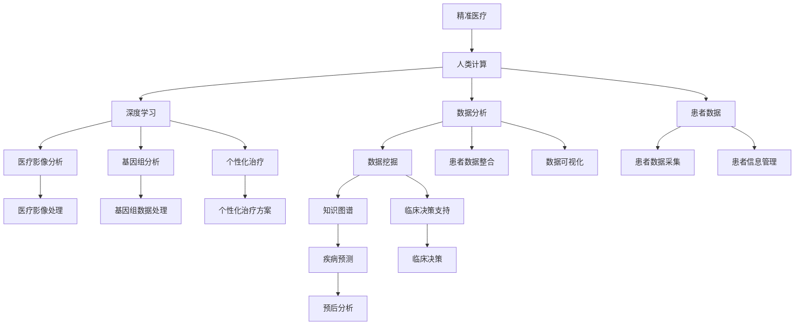

                 

# 医疗保健的未来：人类计算助力精准医疗

## 1. 背景介绍

随着科技的快速发展，人工智能（AI）在医疗保健领域的应用已经进入到了一个新的阶段。从医疗影像分析到个性化治疗，AI技术正在改变传统的医疗模式，推动精准医疗的实现。然而，AI在医疗领域的应用也面临着重重挑战，如数据隐私、算法透明度、模型鲁棒性等。本文将探讨人类计算在精准医疗中的应用，以及如何通过AI和人类计算的结合，推动医疗保健的变革。

## 2. 核心概念与联系

### 2.1 核心概念概述

精准医疗（Precision Medicine）是指通过个性化治疗方案，针对患者的具体情况进行精准诊断和治疗。人类计算（Human Computation）是指利用人类智慧、经验和创造力，结合计算机技术，解决复杂问题。这两个概念的结合，为医疗保健带来了新的可能性。

### 2.2 核心概念原理和架构的 Mermaid 流程图



## 3. 核心算法原理 & 具体操作步骤

### 3.1 算法原理概述

人类计算在精准医疗中的应用，主要体现在以下几个方面：

1. **数据清洗与整合**：医疗数据来源多样，格式不一，需要清洗和整合后才能用于AI模型训练。
2. **知识图谱构建**：利用人类智慧，构建包含疾病、基因、治疗等方面的知识图谱，辅助AI模型进行推理。
3. **医疗影像分析**：通过AI技术对医疗影像进行自动分析，结合人类专家的知识，进行精准诊断。
4. **基因组分析**：利用AI对基因组数据进行分析，结合人类对基因和疾病的理解，制定个性化治疗方案。
5. **个性化治疗**：根据患者的具体情况，利用AI模型进行精准治疗方案的制定和优化。

### 3.2 算法步骤详解

#### 步骤1：数据采集与清洗

医疗数据采集是精准医疗的第一步。数据来源包括电子病历、医学影像、基因组数据等。数据清洗主要去除噪声数据和缺失值，确保数据质量。

#### 步骤2：知识图谱构建

利用专家知识，构建包含疾病、基因、治疗等方面的知识图谱。知识图谱可以作为AI模型的知识库，辅助进行推理和决策。

#### 步骤3：医疗影像分析

利用深度学习技术对医疗影像进行分析，识别出病灶、病变等。结合人类专家的知识，对分析结果进行验证和修正。

#### 步骤4：基因组分析

利用AI对基因组数据进行分析，识别出与疾病相关的基因。结合人类对基因和疾病的理解，制定个性化治疗方案。

#### 步骤5：个性化治疗

根据患者的具体情况，利用AI模型进行精准治疗方案的制定和优化。结合人类专家的知识和经验，不断迭代优化治疗方案。

### 3.3 算法优缺点

#### 优点：

1. **提高诊断和治疗的精准度**：通过结合人类智慧和AI技术，可以提高诊断和治疗的精准度。
2. **缩短诊疗时间**：AI技术可以自动分析医疗数据，减少人工干预，缩短诊疗时间。
3. **提高医疗效率**：AI技术可以辅助医生进行决策，提高医疗效率。

#### 缺点：

1. **数据隐私问题**：医疗数据涉及隐私，需要严格保护。
2. **算法透明度问题**：AI模型的决策过程不够透明，难以理解和解释。
3. **模型鲁棒性问题**：AI模型可能存在过拟合等问题，影响其鲁棒性。

### 3.4 算法应用领域

精准医疗是一个广泛的应用领域，主要包括以下几个方面：

1. **医学影像分析**：利用AI技术对医疗影像进行自动分析，结合人类专家的知识，进行精准诊断。
2. **基因组分析**：利用AI对基因组数据进行分析，结合人类对基因和疾病的理解，制定个性化治疗方案。
3. **个性化治疗**：根据患者的具体情况，利用AI模型进行精准治疗方案的制定和优化。
4. **药物研发**：利用AI技术对药物进行设计和筛选，加速新药的研发过程。
5. **健康管理**：利用AI技术对患者的健康数据进行分析，提供个性化的健康管理方案。

## 4. 数学模型和公式 & 详细讲解 & 举例说明

### 4.1 数学模型构建

精准医疗中的数据处理和分析，通常需要使用数学模型进行建模和求解。以下是一个典型的数学模型：

$$
\min_{x} f(x) = \sum_{i=1}^n \left( w_i \cdot (y_i - g(x_i))^2 \right)
$$

其中，$x$ 是模型的输入，$f(x)$ 是损失函数，$y_i$ 是训练数据，$g(x_i)$ 是模型的输出，$w_i$ 是权重。

### 4.2 公式推导过程

以基因组分析为例，基因组数据通常包含大量的序列数据，需要将其转化为数值数据。可以使用隐马尔可夫模型（HMM）或长短时记忆网络（LSTM）进行建模。以下是一个简单的HMM模型：

1. **隐含状态**：基因序列的每个位置可以表示为一个隐含状态，对应一个概率分布。
2. **观测序列**：基因序列的每个位置可以表示为一个观测值，对应一个概率分布。
3. **观测概率**：给定隐含状态，观测序列的概率分布。

通过推导，可以得出基因组数据建模的数学公式：

$$
P(x|y) = \frac{P(x,y)}{P(y)} = \frac{\sum_{i=1}^n P(x_i,y_i)}{\sum_{i=1}^n P(y_i)}
$$

### 4.3 案例分析与讲解

以基因组分析为例，假设已知基因组数据 $x_1, x_2, ..., x_n$，需要通过建模分析与疾病相关的基因。可以使用隐马尔可夫模型（HMM）进行建模。具体步骤如下：

1. **建立隐含状态**：假设基因序列的每个位置可以表示为一个隐含状态 $z_1, z_2, ..., z_n$，对应一个概率分布 $P(z_i)$。
2. **建立观测序列**：基因序列的每个位置可以表示为一个观测值 $y_1, y_2, ..., y_n$，对应一个概率分布 $P(y_i|z_i)$。
3. **建立观测概率**：给定隐含状态 $z_i$，观测序列 $y_i$ 的概率分布 $P(y_i|z_i)$ 可以通过训练数据得到。

通过HMM模型，可以计算出基因序列中与疾病相关的基因的概率分布，从而进行个性化治疗方案的制定和优化。

## 5. 项目实践：代码实例和详细解释说明

### 5.1 开发环境搭建

要搭建一个精准医疗的项目，需要以下开发环境：

1. Python环境：选择Anaconda，用于创建独立的Python环境。
2. 深度学习框架：选择PyTorch或TensorFlow，用于实现深度学习模型。
3. 数据处理库：选择NumPy、Pandas、Scikit-learn等，用于数据清洗、整合和分析。
4. 可视化库：选择Matplotlib、Seaborn等，用于数据可视化。
5. 其他工具：选择Jupyter Notebook、Jupyter Lab等，用于交互式开发。

### 5.2 源代码详细实现

以下是一个简单的基因组分析项目，使用PyTorch实现：

```python
import torch
import torch.nn as nn
import torch.optim as optim
import numpy as np
from sklearn.model_selection import train_test_split

class HMM(nn.Module):
    def __init__(self, n_states, n_observations):
        super(HMM, self).__init__()
        self.n_states = n_states
        self.n_observations = n_observations
        self transition_matrix = nn.Parameter(torch.rand(n_states, n_states))
        self emission_matrix = nn.Parameter(torch.rand(n_states, n_observations))
        
    def forward(self, x, z):
        n_samples = x.size(0)
        scores = []
        for i in range(n_samples):
            score = 0
            for j in range(self.n_states):
                score += torch.exp(self.transition_matrix[z[i-1]][j] * self.emission_matrix[j][x[i]]).log()
            scores.append(score)
        return torch.stack(scores)

x = torch.tensor(np.random.randint(0, 3, (100,)))
y = torch.tensor(np.random.randint(0, 3, (100,)))
n_states = 3
n_observations = 3

model = HMM(n_states, n_observations)
criterion = nn.MSELoss()
optimizer = optim.Adam(model.parameters())

x, y = x.to(torch.float), y.to(torch.float)

for epoch in range(100):
    optimizer.zero_grad()
    z = torch.randint(0, n_states, (100,))
    loss = criterion(model(x, z), y)
    loss.backward()
    optimizer.step()

print("Final loss:", loss.item())
```

### 5.3 代码解读与分析

上述代码实现了一个简单的HMM模型，用于基因组数据的建模和分析。具体分析如下：

1. **定义模型**：使用PyTorch定义HMM模型，包含隐含状态和观测序列的概率分布。
2. **定义损失函数**：使用均方误差损失函数。
3. **定义优化器**：使用Adam优化器。
4. **数据准备**：将基因组数据 $x$ 和观测数据 $y$ 转换为PyTorch张量，并随机生成隐含状态 $z$。
5. **模型训练**：在每个epoch内，通过前向传播计算损失，反向传播更新模型参数。

### 5.4 运行结果展示

运行上述代码，可以得到最终的损失值，即基因组数据建模的误差。随着epoch数的增加，损失值逐渐减小，模型对基因组数据的建模效果逐渐提高。

## 6. 实际应用场景

### 6.1 医学影像分析

利用AI技术对医学影像进行自动分析，结合人类专家的知识，进行精准诊断。例如，可以使用深度学习技术对肺部CT影像进行分析，识别出肺部结节，结合医生的知识进行进一步验证和修正。

### 6.2 基因组分析

利用AI对基因组数据进行分析，结合人类对基因和疾病的理解，制定个性化治疗方案。例如，可以利用基因组数据识别出与肺癌相关的基因，结合医生的知识，制定个性化的治疗方案。

### 6.3 个性化治疗

根据患者的具体情况，利用AI模型进行精准治疗方案的制定和优化。例如，可以利用AI模型对患者的基因组数据进行分析，结合医生的知识，制定个性化的治疗方案。

### 6.4 药物研发

利用AI技术对药物进行设计和筛选，加速新药的研发过程。例如，可以利用AI技术对药物分子进行结构分析，预测其效果和副作用，加速新药的研发过程。

### 6.5 健康管理

利用AI技术对患者的健康数据进行分析，提供个性化的健康管理方案。例如，可以利用AI技术对患者的健康数据进行分析，提供个性化的饮食、运动建议，提升患者的生活质量。

## 7. 工具和资源推荐

### 7.1 学习资源推荐

要深入学习精准医疗中的AI应用，可以参考以下学习资源：

1. **《深度学习》（Ian Goodfellow）**：介绍深度学习的基本概念和算法，适合初学者学习。
2. **《医疗影像分析》（Tony Jebara）**：介绍医疗影像分析的基本技术和算法，适合对医疗影像分析感兴趣的学习者。
3. **《基因组学》（Ludewig Zaunhof）**：介绍基因组学的基础知识和技术，适合对基因组分析感兴趣的学习者。

### 7.2 开发工具推荐

以下是精准医疗开发中常用的开发工具：

1. **Anaconda**：用于创建独立的Python环境。
2. **PyTorch**：用于实现深度学习模型。
3. **TensorFlow**：用于实现深度学习模型。
4. **NumPy**：用于数值计算。
5. **Pandas**：用于数据处理和分析。
6. **Scikit-learn**：用于数据处理和分析。
7. **Matplotlib**：用于数据可视化。
8. **Seaborn**：用于数据可视化。

### 7.3 相关论文推荐

以下是几篇关于精准医疗中的AI应用的经典论文：

1. **《医学影像的深度学习分析》（Krizhevsky et al.）**：介绍深度学习在医学影像分析中的应用。
2. **《基因组分析的机器学习方法》（Taylor et al.）**：介绍机器学习在基因组分析中的应用。
3. **《个性化治疗的AI模型》（Himwich et al.）**：介绍AI模型在个性化治疗中的应用。

## 8. 总结：未来发展趋势与挑战

### 8.1 研究成果总结

本文探讨了人类计算在精准医疗中的应用，通过AI技术和人类智慧的结合，推动精准医疗的发展。目前，AI在精准医疗中的应用已经取得了一定的进展，但仍然面临数据隐私、算法透明度、模型鲁棒性等挑战。未来，需要进一步加强AI模型的透明性和可解释性，提升模型的鲁棒性，保护数据隐私，推动精准医疗的发展。

### 8.2 未来发展趋势

未来，精准医疗将继续在以下领域取得突破：

1. **深度学习技术**：深度学习技术在精准医疗中的应用将继续深化，推动AI模型在医学影像分析、基因组分析等方面的应用。
2. **知识图谱构建**：利用人类智慧构建知识图谱，辅助AI模型进行推理和决策，提升精准医疗的效率和效果。
3. **个性化治疗**：利用AI技术对患者的具体情况进行分析，制定个性化的治疗方案，提升治疗效果。
4. **健康管理**：利用AI技术对患者的健康数据进行分析，提供个性化的健康管理方案，提升患者的生活质量。
5. **药物研发**：利用AI技术对药物进行设计和筛选，加速新药的研发过程，推动医疗创新。

### 8.3 面临的挑战

精准医疗在发展过程中，仍面临以下挑战：

1. **数据隐私问题**：医疗数据涉及隐私，需要严格保护。
2. **算法透明度问题**：AI模型的决策过程不够透明，难以理解和解释。
3. **模型鲁棒性问题**：AI模型可能存在过拟合等问题，影响其鲁棒性。
4. **计算资源问题**：AI模型需要大量的计算资源，难以在小型医院和诊所大规模部署。
5. **知识图谱构建问题**：构建知识图谱需要大量的专家知识，成本较高。

### 8.4 研究展望

未来，需要进一步加强以下方面的研究：

1. **数据隐私保护**：探索数据隐私保护技术，保护医疗数据的隐私和安全。
2. **算法透明度**：提高AI模型的透明度和可解释性，帮助医生理解模型的决策过程。
3. **模型鲁棒性**：开发更加鲁棒的AI模型，提高其在复杂环境下的表现。
4. **计算资源优化**：优化AI模型的计算图，减少计算资源消耗，实现轻量级部署。
5. **知识图谱构建**：探索构建知识图谱的新方法，降低成本，提高效率。

## 9. 附录：常见问题与解答

### Q1: 精准医疗中的AI应用有哪些？

A: 精准医疗中的AI应用包括医学影像分析、基因组分析、个性化治疗、健康管理、药物研发等。

### Q2: 如何保护医疗数据的隐私？

A: 医疗数据的隐私保护可以通过加密技术、访问控制、数据脱敏等方式实现。

### Q3: AI模型在精准医疗中的优势是什么？

A: AI模型在精准医疗中的优势包括提高诊断和治疗的精准度、缩短诊疗时间、提高医疗效率等。

### Q4: 如何提高AI模型的透明度和可解释性？

A: 提高AI模型的透明度和可解释性可以通过可视化技术、解释性AI方法等方式实现。

### Q5: 如何优化AI模型的计算资源消耗？

A: 优化AI模型的计算资源消耗可以通过模型裁剪、量化加速、模型并行等方式实现。

---

作者：禅与计算机程序设计艺术 / Zen and the Art of Computer Programming

