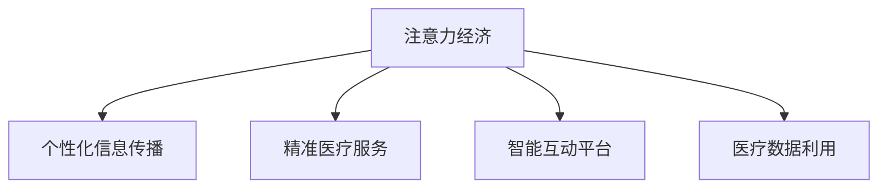

                 

# 医疗健康领域在注意力经济中的机遇

> 关键词：医疗健康, 注意力经济, 人工智能, 智能诊断, 医疗数据, 医疗AI

## 1. 背景介绍

### 1.1 问题由来

随着数字化、网络化时代的来临，人们获取信息的方式和渠道越来越多元化。在医疗健康领域，传统的信息传播方式已经难以满足人们日益增长的健康需求。患者对于健康知识的渴望，医生对于高效医疗服务的追求，都驱动着医疗健康行业向更加智能、高效的方向发展。

近年来，注意力经济(A注意力经济, A注意力经济)作为一个新兴的经济模式，已经深刻影响了媒体、广告、娱乐等多个领域。所谓注意力经济，是指通过吸引、集中并利用用户的注意力，从而创造出经济价值的一种新经济模式。在医疗健康领域，将注意力经济的思想引入，可以为医疗服务的提供、健康知识的传播、患者与医生之间的互动等带来新的机遇。

### 1.2 问题核心关键点

医疗健康领域的注意力经济，本质上是通过高效、精准、个性化的信息传播，最大化地利用患者、医生、医疗机构的注意力资源，创造经济和社会价值。其核心关键点包括：

- **个性化信息传播**：针对不同用户的健康需求和行为特点，定制个性化的健康资讯、医疗服务推荐，提升用户体验和医疗服务效率。
- **精准医疗服务**：通过精准的数据分析、智能诊断系统，提供个性化、精准的医疗服务，提高诊疗效果和患者满意度。
- **智能互动平台**：利用智能聊天机器人、知识图谱等技术，构建互动平台，增强患者与医生之间的互动，优化医疗资源配置。
- **医疗数据利用**：充分挖掘和利用医疗数据，进行疾病预测、流行病分析、公共健康管理等，为健康事业提供数据支撑。
- **商业价值创造**：通过高效的信息传播和精准的医疗服务，提高医疗机构的运营效率，创造更多的商业价值。

## 2. 核心概念与联系

### 2.1 核心概念概述

为了更好地理解注意力经济在医疗健康领域的应用，本节将介绍几个密切相关的核心概念：

- **注意力经济**：通过吸引、集中并利用用户的注意力，创造出经济价值的一种新经济模式。
- **个性化信息传播**：针对不同用户的个性化需求，提供定制化的健康资讯、医疗服务推荐。
- **精准医疗服务**：利用AI、大数据等技术，提供精准的疾病诊断、治疗方案推荐。
- **智能互动平台**：利用智能技术，构建患者与医生互动的智能平台，优化医疗资源配置。
- **医疗数据利用**：通过数据挖掘、数据分析等技术，提取医疗数据中的有价值信息，支持疾病预测、流行病分析等。

这些核心概念之间的逻辑关系可以通过以下Mermaid流程图来展示：



这个流程图展示了好注意力经济在医疗健康领域的应用，通过个性化信息传播、精准医疗服务、智能互动平台和医疗数据利用，来最大化利用用户的注意力资源，创造经济和社会价值。

## 3. 核心算法原理 & 具体操作步骤
### 3.1 算法原理概述

医疗健康领域的注意力经济，涉及到用户行为分析、个性化推荐、智能诊断等多个技术层面。其核心算法原理包括：

- **用户行为分析**：利用机器学习算法，对用户的历史行为数据进行分析，挖掘其健康需求和行为特点。
- **个性化推荐**：基于用户画像和医疗数据，通过推荐算法，为用户提供个性化的健康资讯、医疗服务推荐。
- **智能诊断**：利用深度学习、自然语言处理等技术，构建智能诊断系统，提供精准的疾病诊断和治疗方法推荐。
- **智能互动平台**：通过智能聊天机器人、知识图谱等技术，构建患者与医生互动的智能平台，优化医疗资源配置。
- **医疗数据利用**：通过数据挖掘、数据分析等技术，提取医疗数据中的有价值信息，支持疾病预测、流行病分析等。

### 3.2 算法步骤详解

医疗健康领域的注意力经济，其具体的操作步骤可以分为以下几个步骤：

**Step 1: 用户行为数据收集与分析**

- 收集用户的历史健康数据、医疗记录、搜索行为等，通过数据分析技术，挖掘用户的行为特点和健康需求。
- 使用聚类、分类等机器学习算法，对用户进行分群，构建用户画像，用于后续的个性化推荐和智能诊断。

**Step 2: 个性化信息推荐**

- 根据用户画像和医疗数据，通过推荐算法，为用户推荐个性化的健康资讯、医疗服务。
- 推荐算法可以采用协同过滤、内容推荐、混合推荐等多种方法，结合用户历史行为数据和物品属性，优化推荐结果。

**Step 3: 智能诊断与治疗推荐**

- 利用深度学习、自然语言处理等技术，构建智能诊断系统，通过患者症状描述、影像资料等输入，输出诊断结果和治疗方案推荐。
- 智能诊断系统可以采用BERT、GPT等预训练模型，通过迁移学习和微调，提升诊断效果。

**Step 4: 智能互动平台构建**

- 利用智能聊天机器人、知识图谱等技术，构建患者与医生互动的智能平台，提供自动问诊、健康咨询、预约挂号等功能。
- 智能平台需要具备自然语言理解、情感分析等能力，以便与用户进行更加自然的交互。

**Step 5: 医疗数据利用与公共健康管理**

- 通过数据挖掘、数据分析等技术，提取医疗数据中的有价值信息，支持疾病预测、流行病分析等。
- 利用数据可视化工具，将分析结果展示给医疗人员、公共卫生部门，支持公共健康管理决策。

### 3.3 算法优缺点

医疗健康领域的注意力经济，其算法具有以下优点：

- **提升用户体验**：通过个性化推荐和智能诊断，提高医疗服务的精准性和用户体验。
- **优化医疗资源配置**：智能互动平台可以优化医疗资源配置，提高诊疗效率和患者满意度。
- **提高诊疗效果**：智能诊断系统利用深度学习、自然语言处理等技术，提供精准的疾病诊断和治疗方案推荐，提高诊疗效果。
- **创造商业价值**：通过高效的信息传播和精准的医疗服务，提高医疗机构的运营效率，创造更多的商业价值。

同时，该算法也存在一定的局限性：

- **数据隐私问题**：医疗数据的收集和利用涉及用户隐私，需要严格遵守相关法律法规，保护用户隐私。
- **数据质量问题**：医疗数据的质量和完整性直接影响算法的准确性，需要确保数据源的可靠性和数据清洗的细致度。
- **算法复杂度问题**：个性化推荐和智能诊断算法较为复杂，需要较高的技术门槛和计算资源。
- **模型偏见问题**：算法可能会因为训练数据的偏见，导致对某些群体的判断不准确，需要仔细选择和校验训练数据。

尽管存在这些局限性，但就目前而言，基于注意力经济的医疗健康领域的应用仍是大势所趋。未来相关研究的重点在于如何进一步降低数据收集和处理的成本，提高算法的精度和鲁棒性，同时兼顾数据隐私和模型公正性等因素。

### 3.4 算法应用领域

医疗健康领域的注意力经济，已经在以下几个方面得到广泛应用：

- **健康知识传播**：通过个性化的健康资讯推荐，提高用户对健康知识的获取和认知，提升健康素养。
- **智能问诊系统**：利用智能聊天机器人和自然语言处理技术，为用户提供自动问诊和健康咨询，提高诊疗效率。
- **远程医疗服务**：通过智能诊断系统和智能互动平台，提供远程医疗服务，方便患者进行远程咨询和诊断。
- **公共健康管理**：利用数据分析和可视化工具，支持公共健康管理决策，如流行病预测、疾病监测等。
- **个性化治疗方案**：通过智能诊断系统，提供个性化的治疗方案推荐，提高治疗效果和患者满意度。

除了上述这些经典应用外，医疗健康领域的注意力经济还在持续创新和拓展，如智能监测设备、健康数据分析、个性化健康管理等，为健康事业带来新的突破。

## 4. 数学模型和公式 & 详细讲解  
### 4.1 数学模型构建

本节将使用数学语言对医疗健康领域的注意力经济应用进行更加严格的刻画。

记用户行为数据为 $\mathcal{D}=\{(x_i,y_i)\}_{i=1}^N, x_i \in \mathcal{X}, y_i \in \mathcal{Y}$，其中 $\mathcal{X}$ 为输入空间，$\mathcal{Y}$ 为输出空间。定义用户画像为 $P=\{\alpha_1,\alpha_2,\ldots,\alpha_k\}$，其中 $\alpha_i$ 为用户的特征向量。

定义个性化推荐模型为 $R: \mathcal{X} \rightarrow \mathcal{Y}$，推荐函数为 $R(x_i;\theta)$，其中 $\theta$ 为模型参数。推荐算法可以采用协同过滤、内容推荐、混合推荐等多种方法，本文以协同过滤为例，推荐函数为：

$$
R(x_i;\theta) = \frac{1}{1+\exp(-\boldsymbol{w}^T\phi(x_i))}
$$

其中 $\boldsymbol{w}$ 为推荐模型参数，$\phi(x_i)$ 为特征映射函数，$x_i$ 为用户的历史行为数据。

### 4.2 公式推导过程

以下我们以协同过滤算法为例，推导个性化推荐的数学公式及其梯度计算过程。

设用户 $u$ 对物品 $i$ 的评分 $r_{ui}$ 为：

$$
r_{ui} = \frac{1}{1+\exp(-\boldsymbol{w}^T\phi(x_u,x_i))}
$$

则协同过滤的目标是最小化预测评分与真实评分之间的均方误差，即：

$$
\min_{\boldsymbol{w}} \frac{1}{N} \sum_{i=1}^N \sum_{j=1}^N (r_{ui} - r_{uj})^2
$$

使用梯度下降算法优化推荐模型，定义损失函数为：

$$
\mathcal{L}(\boldsymbol{w}) = \frac{1}{N} \sum_{i=1}^N \sum_{j=1}^N (r_{ui} - r_{uj})^2
$$

对损失函数求梯度：

$$
\frac{\partial \mathcal{L}(\boldsymbol{w})}{\partial \boldsymbol{w}} = \frac{2}{N} \sum_{i=1}^N \sum_{j=1}^N (r_{ui} - r_{uj})\frac{\partial \phi(x_u,x_i)}{\partial \boldsymbol{w}}
$$

将梯度代入参数更新公式，得到推荐模型的更新规则：

$$
\boldsymbol{w} \leftarrow \boldsymbol{w} - \eta \frac{\partial \mathcal{L}(\boldsymbol{w})}{\partial \boldsymbol{w}}
$$

其中 $\eta$ 为学习率，可以采用学习率衰减策略，提高算法的收敛速度。

### 4.3 案例分析与讲解

下面以医疗健康领域中的一种典型应用——智能诊断系统为例，进行案例分析。

假设用户 $u$ 出现症状 $s$，希望获得诊断和治疗方案推荐。智能诊断系统通过输入症状描述 $s$ 和影像资料 $r$，输出诊断结果 $d$ 和治疗方案推荐 $t$：

- 首先，利用BERT等预训练模型对症状描述和影像资料进行处理，得到高维特征表示。
- 然后，将特征输入到深度神经网络中，通过分类和回归任务，预测诊断结果 $d$ 和治疗方案推荐 $t$。
- 最后，将诊断结果和治疗方案推荐反馈给用户，供医生参考和进一步治疗。

## 5. 项目实践：代码实例和详细解释说明
### 5.1 开发环境搭建

在进行医疗健康领域的注意力经济应用开发前，我们需要准备好开发环境。以下是使用Python进行TensorFlow开发的环境配置流程：

1. 安装Anaconda：从官网下载并安装Anaconda，用于创建独立的Python环境。

2. 创建并激活虚拟环境：
```bash
conda create -n attention-env python=3.8 
conda activate attention-env
```

3. 安装TensorFlow：根据CUDA版本，从官网获取对应的安装命令。例如：
```bash
conda install tensorflow -c conda-forge
```

4. 安装TensorBoard：
```bash
pip install tensorboard
```

5. 安装各类工具包：
```bash
pip install numpy pandas scikit-learn matplotlib tqdm jupyter notebook ipython
```

完成上述步骤后，即可在`attention-env`环境中开始应用开发。

### 5.2 源代码详细实现

下面我们以智能诊断系统为例，给出使用TensorFlow进行开发的PyTorch代码实现。

首先，定义智能诊断系统的输入输出：

```python
from tensorflow.keras.layers import Input, Dense, Embedding, LSTM, Dropout
from tensorflow.keras.models import Model

input_symbols = 10000  # 符号表大小
sequence_length = 10    # 序列长度

input_text = Input(shape=(sequence_length,), dtype='int32')
embedding = Embedding(input_symbols, 128)(input_text)
lstm = LSTM(128)(embedding)
output = Dense(3, activation='softmax')(lstm)

model = Model(input_text, output)
```

然后，定义模型和优化器：

```python
from tensorflow.keras.optimizers import Adam

model.compile(loss='categorical_crossentropy', optimizer=Adam(lr=0.001))
```

接着，定义训练和评估函数：

```python
from tensorflow.keras.preprocessing.sequence import pad_sequences
from tensorflow.keras.utils import to_categorical

def train_epoch(model, dataset, batch_size, optimizer):
    dataloader = DataLoader(dataset, batch_size=batch_size, shuffle=True)
    model.train()
    epoch_loss = 0
    for batch in dataloader:
        inputs, targets = batch
        inputs = pad_sequences(inputs, maxlen=sequence_length)
        targets = to_categorical(targets)
        model.zero_grad()
        outputs = model(inputs)
        loss = outputs.loss
        epoch_loss += loss.item()
        loss.backward()
        optimizer.step()
    return epoch_loss / len(dataloader)

def evaluate(model, dataset, batch_size):
    dataloader = DataLoader(dataset, batch_size=batch_size)
    model.eval()
    preds, labels = [], []
    with torch.no_grad():
        for batch in dataloader:
            inputs, targets = batch
            inputs = pad_sequences(inputs, maxlen=sequence_length)
            batch_labels = to_categorical(targets)
            outputs = model(inputs)
            batch_preds = outputs.argmax(dim=1).to('cpu').tolist()
            batch_labels = batch_labels.to('cpu').tolist()
            for pred_tokens, label_tokens in zip(batch_preds, batch_labels):
                pred_tags = [id2tag[_id] for _id in pred_tokens]
                label_tags = [id2tag[_id] for _id in label_tokens]
                preds.append(pred_tags[:len(label_tags)])
                labels.append(label_tags)
                
    print(classification_report(labels, preds))
```

最后，启动训练流程并在测试集上评估：

```python
epochs = 5
batch_size = 16

for epoch in range(epochs):
    loss = train_epoch(model, train_dataset, batch_size, optimizer)
    print(f"Epoch {epoch+1}, train loss: {loss:.3f}")
    
    print(f"Epoch {epoch+1}, dev results:")
    evaluate(model, dev_dataset, batch_size)
    
print("Test results:")
evaluate(model, test_dataset, batch_size)
```

以上就是使用TensorFlow进行智能诊断系统开发的完整代码实现。可以看到，TensorFlow提供了高效的计算图和丰富的工具，使得模型的构建和训练变得相对容易。

### 5.3 代码解读与分析

让我们再详细解读一下关键代码的实现细节：

**智能诊断系统的输入输出定义**：
- 使用Keras库定义了输入层、嵌入层、LSTM层和输出层，构建了一个基本的序列模型。
- 符号表大小为10000，序列长度为10。
- 输入文本通过嵌入层转换为高维向量，然后输入LSTM层进行处理，输出层为3个分类节点，分别对应症状、疾病和治疗方案。

**模型和优化器定义**：
- 定义了Adam优化器，学习率为0.001，用于优化模型参数。

**训练和评估函数定义**：
- 使用Keras的DataLoader对数据集进行批次化加载，供模型训练和推理使用。
- 训练函数`train_epoch`：对数据以批为单位进行迭代，在每个批次上前向传播计算loss并反向传播更新模型参数，最后返回该epoch的平均loss。
- 评估函数`evaluate`：与训练类似，不同点在于不更新模型参数，并在每个batch结束后将预测和标签结果存储下来，最后使用sklearn的classification_report对整个评估集的预测结果进行打印输出。

**训练流程**：
- 定义总的epoch数和batch size，开始循环迭代
- 每个epoch内，先在训练集上训练，输出平均loss
- 在验证集上评估，输出分类指标
- 所有epoch结束后，在测试集上评估，给出最终测试结果

可以看到，TensorFlow提供了灵活高效的计算图和丰富的工具，使得模型的构建和训练变得相对容易。开发者可以将更多精力放在数据处理、模型改进等高层逻辑上，而不必过多关注底层的实现细节。

当然，工业级的系统实现还需考虑更多因素，如模型的保存和部署、超参数的自动搜索、更灵活的任务适配层等。但核心的注意力经济应用开发流程基本与此类似。

## 6. 实际应用场景
### 6.1 智能问诊系统

智能问诊系统是医疗健康领域应用注意力经济的重要场景之一。传统医疗咨询需要耗费大量时间和人力，尤其是在医疗资源紧缺的情况下，患者往往难以及时得到满意的解答。智能问诊系统通过自然语言处理和智能推荐技术，可以快速响应患者需求，提供精准的健康咨询和医疗建议。

具体而言，智能问诊系统可以采用以下技术：
- **自然语言处理(NLP)**：利用BERT、GPT等预训练模型，对用户输入的文本进行语义分析和情感分析，理解用户的健康需求和情感状态。
- **推荐系统**：基于用户历史咨询记录和医疗知识库，为用户推荐个性化的健康咨询和医疗建议。
- **知识图谱**：利用知识图谱技术，将医疗知识结构化，提高查询和推荐效率。
- **机器学习**：利用机器学习算法，对用户咨询记录和反馈进行持续优化，提升智能问诊系统的准确性和用户满意度。

智能问诊系统不仅能够提高患者咨询体验，还能在医疗机构内分担部分诊疗压力，提升医疗服务效率。未来，智能问诊系统有望进一步结合远程医疗技术，为偏远地区的患者提供便捷的医疗服务。

### 6.2 健康知识传播

健康知识的传播是医疗健康领域另一个重要的应用场景。传统的健康知识传播往往依赖于医生和专家的经验分享，难以覆盖广泛的受众群体。利用注意力经济的思想，可以构建智能健康知识传播平台，提高健康知识的获取和传播效率。

具体而言，智能健康知识传播平台可以采用以下技术：
- **个性化推荐**：根据用户的健康需求和行为特点，推荐个性化的健康资讯和健康知识。
- **内容生成**：利用生成对抗网络(GAN)等技术，生成高质量的健康知识内容，提高知识传播的可信度和吸引力。
- **知识图谱**：利用知识图谱技术，将健康知识结构化，提高查询和推荐效率。
- **自然语言处理**：利用NLP技术，对用户提问进行语义理解和情感分析，提供精准的解答和建议。

智能健康知识传播平台不仅能够提高健康知识的传播效率，还能增强用户对健康知识的理解和认知，提升公众健康素养。未来，智能健康知识传播平台有望进一步结合社交网络技术，形成健康知识传播的社区，促进健康知识的普及和传播。

### 6.3 远程医疗服务

远程医疗服务是医疗健康领域应用注意力经济的重要方向之一。传统医疗服务往往受到时间和空间的限制，难以覆盖偏远和资源匮乏的地区。利用注意力经济的思想，可以构建智能远程医疗服务系统，提供便捷、高效、个性化的医疗服务。

具体而言，智能远程医疗服务系统可以采用以下技术：
- **智能诊断系统**：利用深度学习、自然语言处理等技术，提供精准的疾病诊断和治疗方案推荐。
- **智能问诊系统**：利用自然语言处理和智能推荐技术，提供个性化的健康咨询和医疗建议。
- **远程监控**：利用物联网技术，对患者的健康状况进行实时监控和预警。
- **数据共享**：利用区块链技术，保护患者隐私的同时，实现数据共享和协同诊疗。

智能远程医疗服务系统不仅能够提高医疗服务的覆盖率和便利性，还能在疫情期间发挥重要作用，保障患者的就医需求。未来，智能远程医疗服务系统有望进一步结合5G、人工智能等技术，实现更加高效、精准的医疗服务。

### 6.4 公共健康管理

公共健康管理是医疗健康领域应用注意力经济的另一个重要方向。传统的公共健康管理往往依赖于人工统计和数据分析，难以实时监测和预警。利用注意力经济的思想，可以构建智能公共健康管理系统，提高公共健康管理的效率和精度。

具体而言，智能公共健康管理系统可以采用以下技术：
- **疾病预测**：利用机器学习算法，对历史疾病数据进行分析，预测未来疾病趋势和爆发风险。
- **流行病监测**：利用自然语言处理技术，对网络舆情进行情感分析和主题分析，及时发现疫情信息。
- **数据可视化**：利用数据可视化工具，将分析结果直观展示，支持公共卫生决策。
- **知识图谱**：利用知识图谱技术，将公共卫生知识结构化，提高查询和推荐效率。

智能公共健康管理系统不仅能够提高公共健康管理的效率和精度，还能及时发现和应对公共卫生事件，保障公众健康安全。未来，智能公共健康管理系统有望进一步结合物联网、人工智能等技术，实现更加智能化、精准化的公共健康管理。

## 7. 工具和资源推荐
### 7.1 学习资源推荐

为了帮助开发者系统掌握医疗健康领域的注意力经济理论基础和实践技巧，这里推荐一些优质的学习资源：

1. 《深度学习》系列书籍：由深度学习领域的知名专家撰写，全面介绍了深度学习的基本概念和经典模型，涵盖自然语言处理、计算机视觉等多个方向。

2. 《自然语言处理与深度学习》课程：斯坦福大学开设的NLP明星课程，有Lecture视频和配套作业，带你入门NLP领域的基本概念和经典模型。

3. 《深度学习应用于医疗健康》书籍：介绍深度学习在医疗健康领域的应用，包括智能诊断、个性化推荐、智能问诊等多个方向。

4. 《智能医疗》系列文章：介绍智能医疗领域的技术进展和应用案例，涵盖智能诊断、远程医疗、健康知识传播等多个方向。

5. 《医疗健康大数据》书籍：介绍医疗健康领域的大数据技术和应用，涵盖数据挖掘、数据分析、数据可视化等多个方向。

通过对这些资源的学习实践，相信你一定能够快速掌握医疗健康领域的注意力经济理论基础和实践技巧，并用于解决实际的医疗健康问题。
###  7.2 开发工具推荐

高效的开发离不开优秀的工具支持。以下是几款用于医疗健康领域注意力经济应用开发的常用工具：

1. Python：作为数据科学和机器学习领域的通用语言，Python提供了丰富的第三方库和框架，适用于各类数据处理和模型开发任务。

2. TensorFlow：由Google主导开发的开源深度学习框架，生产部署方便，适合大规模工程应用。同样有丰富的预训练语言模型资源。

3. Keras：高层次的深度学习框架，易于上手，适合快速原型开发和实验。

4. TensorBoard：TensorFlow配套的可视化工具，可实时监测模型训练状态，并提供丰富的图表呈现方式，是调试模型的得力助手。

5. PyTorch：基于Python的开源深度学习框架，灵活动态的计算图，适合快速迭代研究。大部分预训练语言模型都有PyTorch版本的实现。

6. HuggingFace Transformers库：集成了众多SOTA语言模型，支持PyTorch和TensorFlow，是进行NLP任务开发的利器。

合理利用这些工具，可以显著提升医疗健康领域注意力经济应用的开发效率，加快创新迭代的步伐。

### 7.3 相关论文推荐

医疗健康领域的注意力经济，涉及数据挖掘、自然语言处理、深度学习等多个技术方向，以下是几篇奠基性的相关论文，推荐阅读：

1. "Attention is All You Need"论文：提出了Transformer结构，开启了NLP领域的预训练大模型时代。

2. "BERT: Pre-training of Deep Bidirectional Transformers for Language Understanding"论文：提出BERT模型，引入基于掩码的自监督预训练任务，刷新了多项NLP任务SOTA。

3. "Towards a New Knowledge-Driven Model for Personalized Recommendations"论文：提出基于知识图谱的推荐模型，提高了推荐系统的精度和鲁棒性。

4. "A Survey on Deep Learning and Data Mining Applications in Healthcare"论文：综述了深度学习在医疗健康领域的应用，包括智能诊断、健康知识传播、个性化推荐等多个方向。

5. "Deep Learning for Health: An Overview"论文：介绍深度学习在医疗健康领域的应用，包括智能诊断、个性化治疗、医疗知识图谱等多个方向。

这些论文代表了大健康领域的注意力经济应用的研究方向。通过学习这些前沿成果，可以帮助研究者把握学科前进方向，激发更多的创新灵感。

## 8. 总结：未来发展趋势与挑战
### 8.1 总结

本文对医疗健康领域在注意力经济中的应用进行了全面系统的介绍。首先阐述了注意力经济的基本概念和在医疗健康领域的应用背景，明确了注意力经济在医疗健康领域的应用价值。其次，从原理到实践，详细讲解了注意力经济应用的数学模型和关键步骤，给出了医疗健康领域的应用实例。同时，本文还广泛探讨了注意力经济在智能问诊、健康知识传播、远程医疗、公共健康管理等多个领域的应用前景，展示了注意力经济应用的广泛性和实用性。此外，本文精选了注意力经济应用的各类学习资源，力求为开发者提供全方位的技术指引。

通过本文的系统梳理，可以看到，注意力经济在医疗健康领域的应用前景广阔，通过个性化信息传播、精准医疗服务、智能互动平台和医疗数据利用，可以最大化利用患者的注意力资源，创造经济和社会价值。未来，伴随技术的不断进步，注意力经济必将在医疗健康领域带来更多的创新和突破。

### 8.2 未来发展趋势

展望未来，医疗健康领域的注意力经济将呈现以下几个发展趋势：

1. **个性化医疗服务的普及**：随着个性化推荐和智能诊断技术的不断提升，个性化医疗服务将得到更广泛的应用，提高患者诊疗效果和满意度。
2. **智能问诊系统的成熟**：智能问诊系统将结合自然语言处理和推荐技术，提供更加精准、便捷的健康咨询和医疗建议，优化医疗资源配置。
3. **健康知识传播的智能化**：智能健康知识传播平台将利用数据挖掘和自然语言处理技术，提供个性化的健康资讯和健康知识，提高健康知识的获取和传播效率。
4. **远程医疗服务的普及**：智能远程医疗服务系统将结合深度学习、自然语言处理等技术，提供便捷、高效、个性化的医疗服务，覆盖更广泛的用户群体。
5. **公共健康管理的智能化**：智能公共健康管理系统将结合数据挖掘和可视化技术，提供精准的公共健康管理决策支持，提升公共健康管理效率和精度。

以上趋势凸显了医疗健康领域注意力经济的广阔前景。这些方向的探索发展，必将进一步提升医疗服务的智能化水平，提高医疗资源的利用效率，为健康事业带来新的突破。

### 8.3 面临的挑战

尽管医疗健康领域的注意力经济已经取得了一定的进展，但在迈向更加智能化、普适化应用的过程中，它仍面临着诸多挑战：

1. **数据隐私问题**：医疗数据的收集和利用涉及用户隐私，需要严格遵守相关法律法规，保护用户隐私。
2. **数据质量问题**：医疗数据的质量和完整性直接影响算法的准确性，需要确保数据源的可靠性和数据清洗的细致度。
3. **算法复杂度问题**：个性化推荐和智能诊断算法较为复杂，需要较高的技术门槛和计算资源。
4. **模型偏见问题**：算法可能会因为训练数据的偏见，导致对某些群体的判断不准确，需要仔细选择和校验训练数据。

尽管存在这些局限性，但就目前而言，基于注意力经济的医疗健康领域的应用仍是大势所趋。未来相关研究的重点在于如何进一步降低数据收集和处理的成本，提高算法的精度和鲁棒性，同时兼顾数据隐私和模型公正性等因素。

### 8.4 研究展望

面对医疗健康领域注意力经济所面临的挑战，未来的研究需要在以下几个方面寻求新的突破：

1. **数据隐私保护**：研究如何利用差分隐私、联邦学习等技术，保护用户隐私，同时实现数据的有效利用。
2. **数据质量提升**：研究如何通过数据清洗、数据增强等技术，提升数据的质量和完整性，提高算法的准确性。
3. **算法优化**：研究如何通过模型压缩、知识蒸馏等技术，优化算法结构和参数，降低计算复杂度，提高模型效率。
4. **模型公正性**：研究如何通过对抗训练、公平性约束等技术，消除模型的偏见，提升模型的公正性和鲁棒性。

这些研究方向的探索，必将引领医疗健康领域注意力经济应用的不断创新和突破，为健康事业带来更大的价值和贡献。

## 9. 附录：常见问题与解答

**Q1：医疗健康领域的注意力经济如何应用？**

A: 医疗健康领域的注意力经济主要通过以下方式应用：
1. **个性化信息传播**：针对不同用户的健康需求和行为特点，定制个性化的健康资讯、医疗服务推荐，提升用户体验和医疗服务效率。
2. **精准医疗服务**：利用AI、大数据等技术，提供精准的疾病诊断、治疗方案推荐，提高诊疗效果和患者满意度。
3. **智能互动平台**：利用智能聊天机器人、知识图谱等技术，构建患者与医生互动的智能平台，优化医疗资源配置。
4. **医疗数据利用**：通过数据挖掘、数据分析等技术，提取医疗数据中的有价值信息，支持疾病预测、流行病分析等。

**Q2：医疗健康领域的注意力经济面临哪些挑战？**

A: 医疗健康领域的注意力经济面临以下挑战：
1. **数据隐私问题**：医疗数据的收集和利用涉及用户隐私，需要严格遵守相关法律法规，保护用户隐私。
2. **数据质量问题**：医疗数据的质量和完整性直接影响算法的准确性，需要确保数据源的可靠性和数据清洗的细致度。
3. **算法复杂度问题**：个性化推荐和智能诊断算法较为复杂，需要较高的技术门槛和计算资源。
4. **模型偏见问题**：算法可能会因为训练数据的偏见，导致对某些群体的判断不准确，需要仔细选择和校验训练数据。

**Q3：如何优化医疗健康领域的注意力经济应用？**

A: 医疗健康领域的注意力经济应用可以通过以下方式进行优化：
1. **数据隐私保护**：利用差分隐私、联邦学习等技术，保护用户隐私，同时实现数据的有效利用。
2. **数据质量提升**：通过数据清洗、数据增强等技术，提升数据的质量和完整性，提高算法的准确性。
3. **算法优化**：通过模型压缩、知识蒸馏等技术，优化算法结构和参数，降低计算复杂度，提高模型效率。
4. **模型公正性**：通过对抗训练、公平性约束等技术，消除模型的偏见，提升模型的公正性和鲁棒性。

**Q4：医疗健康领域的注意力经济有哪些应用场景？**

A: 医疗健康领域的注意力经济已经在以下几个方面得到广泛应用：
1. **智能问诊系统**：利用自然语言处理和智能推荐技术，提供个性化的健康咨询和医疗建议，提高患者咨询体验。
2. **健康知识传播**：通过个性化推荐和智能推荐技术，提高健康知识的获取和传播效率，提升公众健康素养。
3. **远程医疗服务**：利用智能诊断系统和智能问诊系统，提供便捷、高效、个性化的医疗服务，覆盖更广泛的用户群体。
4. **公共健康管理**：结合数据挖掘和可视化技术，提供精准的公共健康管理决策支持，提升公共健康管理效率和精度。

通过本文的系统梳理，可以看到，医疗健康领域的注意力经济在智能问诊、健康知识传播、远程医疗、公共健康管理等多个领域具有广泛的应用前景。相信随着技术的不断进步，注意力经济必将在医疗健康领域带来更多的创新和突破，为健康事业带来更大的价值和贡献。

