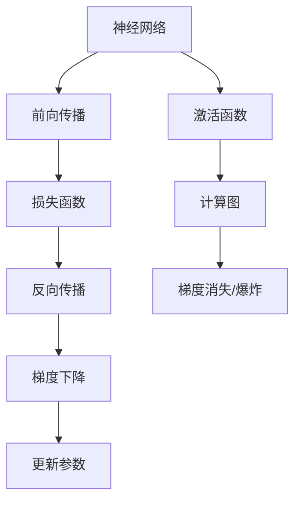

                 

# 反向传播算法详解：深度学习的核心

> 关键词：反向传播,深度学习,梯度下降,神经网络,误差反向传播,计算图,优化算法,神经网络,机器学习,深度学习框架

## 1. 背景介绍

### 1.1 问题由来
深度学习，作为一种强大的机器学习范式，自2012年AlexNet在ImageNet图像分类挑战赛中获胜以来，得到了广泛的应用和发展。深度学习的核心在于通过多层神经网络模型，学习和提取数据的复杂特征，从而进行有效的分类、回归等任务。然而，神经网络模型参数众多，训练过程复杂，如何高效地更新模型参数，成为了一个关键问题。

为此，反向传播算法（Backpropagation）应运而生。它是一种基于梯度下降法的优化算法，能够有效地计算网络各层参数的梯度，更新模型参数，从而使得模型在给定任务上取得最优性能。反向传播算法是深度学习中最基础和核心的算法之一，也是理解深度学习机制的关键。

### 1.2 问题核心关键点
反向传播算法的基本思想是通过误差反向传播来计算模型参数的梯度。其核心步骤如下：
1. 计算预测输出与真实标签的误差（损失函数）。
2. 自上而下计算每层误差对模型参数的梯度（链式法则）。
3. 使用梯度下降法（或其他优化算法）更新模型参数。

为了更好地理解反向传播算法，我们需要对神经网络的结构、损失函数、梯度计算等核心概念进行深入的探讨。

## 2. 核心概念与联系

### 2.1 核心概念概述

为更好地理解反向传播算法，本节将介绍几个密切相关的核心概念：

- 神经网络（Neural Network）：由多层神经元组成的计算图，通过前向传播计算预测输出，通过反向传播计算梯度。
- 损失函数（Loss Function）：用于衡量模型预测输出与真实标签的差异，常见的损失函数包括均方误差（MSE）、交叉熵（Cross-Entropy）等。
- 梯度下降（Gradient Descent）：一种基于梯度信息的优化算法，通过迭代更新参数使得损失函数最小化。
- 计算图（Computation Graph）：神经网络模型的计算流程，可以高效地进行梯度计算。
- 激活函数（Activation Function）：神经元非线性变换函数，常见的激活函数有sigmoid、ReLU等。
- 反向传播（Backpropagation）：通过误差反向传播计算参数梯度，更新模型参数的算法。
- 梯度消失和爆炸（Vanishing and Exploding Gradients）：深层网络中常见的梯度计算问题，导致模型训练困难。

这些核心概念之间的逻辑关系可以通过以下Mermaid流程图来展示：



这个流程图展示了大模型微调的几个核心概念及其之间的关系：

1. 神经网络通过前向传播计算预测输出。
2. 通过损失函数计算预测输出与真实标签的误差。
3. 使用反向传播算法计算每层误差对模型参数的梯度。
4. 使用梯度下降法根据梯度更新模型参数。
5. 神经网络中的激活函数提供非线性变换。
6. 计算图描述神经网络中的计算流程。
7. 反向传播过程中可能会遭遇梯度消失或爆炸的问题。

这些概念共同构成了神经网络的计算流程和训练机制，使得深度学习模型能够通过反向传播算法进行高效优化。

## 3. 核心算法原理 & 具体操作步骤
### 3.1 算法原理概述

反向传播算法的核心思想是通过误差反向传播来计算模型参数的梯度。具体而言，假设有输入数据 $x$，目标标签 $y$，神经网络模型 $f_{\theta}$，其中 $\theta$ 为模型参数。模型的前向传播过程如下：

$$
y_{\text{pred}}=f_{\theta}(x)
$$

其中 $y_{\text{pred}}$ 为模型预测的输出。我们通过损失函数 $L$ 计算预测输出与真实标签之间的误差：

$$
L = L(y_{\text{pred}}, y)
$$

常见的损失函数包括均方误差（MSE）、交叉熵（Cross-Entropy）等。

反向传播算法的目标是最小化损失函数 $L$，即求参数 $\theta$ 的最小值。为了实现这一目标，我们使用梯度下降法（或其他优化算法）进行参数更新，其数学表达形式如下：

$$
\theta = \theta - \alpha \nabla_{\theta}L
$$

其中 $\alpha$ 为学习率，$\nabla_{\theta}L$ 为损失函数对参数 $\theta$ 的梯度，可通过反向传播算法计算得到。

### 3.2 算法步骤详解

反向传播算法的具体操作步骤如下：

**Step 1: 计算预测输出**
根据输入数据 $x$ 和模型参数 $\theta$，通过神经网络的前向传播过程，计算得到模型预测的输出 $y_{\text{pred}}=f_{\theta}(x)$。

**Step 2: 计算误差**
使用损失函数 $L$ 计算模型预测输出 $y_{\text{pred}}$ 与真实标签 $y$ 之间的误差。

**Step 3: 计算梯度**
使用反向传播算法计算每层误差对模型参数的梯度。

**Step 4: 更新参数**
使用梯度下降法根据计算得到的梯度，更新模型参数。

### 3.3 算法优缺点

反向传播算法具有以下优点：
1. 高效性：通过误差反向传播，一次前向传播即可计算出所有参数的梯度，计算量小，效率高。
2. 泛化性强：适用于多种类型的神经网络结构，如全连接、卷积、循环等。
3. 易于实现：现代深度学习框架（如PyTorch、TensorFlow等）都内置了反向传播算法，方便使用。

然而，反向传播算法也存在以下局限性：
1. 对初始参数敏感：如果初始参数选择不当，模型可能会陷入局部最优，难以收敛。
2. 梯度消失和爆炸：深层网络中常见的梯度计算问题，导致模型训练困难。
3. 依赖大量数据：反向传播算法需要大量的标注数据进行训练，数据获取成本较高。
4. 计算资源需求高：反向传播算法需要占用大量的计算资源，对于大型模型尤其明显。

尽管存在这些局限性，但反向传播算法仍然是深度学习中最基础和核心的算法之一。未来相关研究的方向包括如何提高模型的初始化方法，减少梯度消失和爆炸问题，以及如何优化算法以降低计算资源需求。

### 3.4 算法应用领域

反向传播算法在深度学习中得到了广泛的应用，涵盖了几乎所有类型的深度学习任务，例如：

- 图像分类：如ImageNet、CIFAR等数据集上的分类任务。
- 物体检测：如YOLO、Faster R-CNN等检测任务。
- 自然语言处理：如语言模型、机器翻译、文本分类等。
- 语音识别：如端到端（End-to-End）语音识别任务。
- 自动驾驶：如车辆路径规划、障碍物识别等。

除了上述这些经典任务外，反向传播算法还被创新性地应用到更多场景中，如强化学习、生成对抗网络（GAN）等，为深度学习技术带来了全新的突破。

## 4. 数学模型和公式 & 详细讲解  
### 4.1 数学模型构建

本节将使用数学语言对反向传播算法的计算流程进行更加严格的刻画。

记神经网络模型为 $f_{\theta}(x):\mathcal{X} \rightarrow \mathcal{Y}$，其中 $\mathcal{X}$ 为输入空间，$\mathcal{Y}$ 为输出空间，$\theta$ 为模型参数。假设模型的损失函数为 $L(y_{\text{pred}}, y)$，则反向传播算法的目标是求模型参数 $\theta$ 的最小值，即求解如下优化问题：

$$
\theta^* = \mathop{\arg\min}_{\theta} L(y_{\text{pred}}, y)
$$

其中 $y_{\text{pred}}=f_{\theta}(x)$。

### 4.2 公式推导过程

以下我们以单层神经网络为例，推导反向传播算法的数学推导过程。

假设输入数据 $x$ 为二维向量，神经网络模型为单层感知机，包含 $n$ 个神经元，激活函数为 $g$，则模型的计算过程如下：

$$
z = W^Tx + b
$$

$$
a = g(z)
$$

$$
y_{\text{pred}} = a
$$

其中 $W$ 为权重矩阵，$b$ 为偏置向量，$g$ 为激活函数。

模型的损失函数为交叉熵损失，即：

$$
L(y_{\text{pred}}, y) = -\frac{1}{N}\sum_{i=1}^N y_i\log y_{\text{pred}}^i + (1-y_i)\log(1-y_{\text{pred}}^i)
$$

其中 $N$ 为样本数，$y$ 为真实标签。

根据链式法则，计算损失函数对权重 $W$ 和偏置 $b$ 的梯度，得：

$$
\frac{\partial L}{\partial W} = -\frac{1}{N}\sum_{i=1}^N (y_{\text{pred}}^i - y_i)g'(z^i)\frac{\partial z^i}{\partial W}
$$

$$
\frac{\partial L}{\partial b} = -\frac{1}{N}\sum_{i=1}^N (y_{\text{pred}}^i - y_i)g'(z^i)
$$

其中 $g'$ 为激活函数 $g$ 的导数，$z^i$ 为第 $i$ 个样本的 $z$ 值。

将 $z^i$ 代入 $z$ 的表达式，得：

$$
\frac{\partial L}{\partial W} = -\frac{1}{N}\sum_{i=1}^N (y_{\text{pred}}^i - y_i)g'(z^i)W^T
$$

$$
\frac{\partial L}{\partial b} = -\frac{1}{N}\sum_{i=1}^N (y_{\text{pred}}^i - y_i)g'(z^i)
$$

最终，根据梯度下降法，更新模型参数 $W$ 和 $b$，得：

$$
W \leftarrow W - \alpha \frac{\partial L}{\partial W}
$$

$$
b \leftarrow b - \alpha \frac{\partial L}{\partial b}
$$

其中 $\alpha$ 为学习率。

### 4.3 案例分析与讲解

以MNIST手写数字识别任务为例，展示反向传播算法的具体应用。

首先，收集MNIST数据集，并对数据进行预处理，将其归一化到 [0,1] 区间。然后，定义单层神经网络模型，包含 200 个神经元，使用ReLU激活函数。接着，定义交叉熵损失函数，并使用反向传播算法训练模型。最后，在测试集上评估模型性能。

具体代码如下：

```python
import torch
import torch.nn as nn
import torch.optim as optim
import torchvision
import torchvision.transforms as transforms
from torch.utils.data import DataLoader

# 定义神经网络模型
class Net(nn.Module):
    def __init__(self):
        super(Net, self).__init__()
        self.fc1 = nn.Linear(784, 200)
        self.fc2 = nn.Linear(200, 10)
        self.relu = nn.ReLU()

    def forward(self, x):
        x = self.fc1(x.view(-1, 784))
        x = self.relu(x)
        x = self.fc2(x)
        return x

# 定义损失函数
criterion = nn.CrossEntropyLoss()

# 定义优化器
optimizer = optim.SGD(net.parameters(), lr=0.01, momentum=0.9)

# 加载数据集
trainset = torchvision.datasets.MNIST(root='./data', train=True, download=True, transform=transforms.ToTensor())
trainloader = DataLoader(trainset, batch_size=64, shuffle=True)

# 定义模型和优化器
net = Net()
optimizer = optim.SGD(net.parameters(), lr=0.01, momentum=0.9)

# 训练模型
for epoch in range(10):
    running_loss = 0.0
    for i, data in enumerate(trainloader, 0):
        inputs, labels = data
        optimizer.zero_grad()
        outputs = net(inputs.view(-1, 28 * 28))
        loss = criterion(outputs, labels)
        loss.backward()
        optimizer.step()

# 测试模型
correct = 0
total = 0
with torch.no_grad():
    for data in testloader:
        images, labels = data
        outputs = net(images.view(-1, 28 * 28))
        _, predicted = torch.max(outputs.data, 1)
        total += labels.size(0)
        correct += (predicted == labels).sum().item()

print('Accuracy of the network on the 10000 test images: %d %%' % (100 * correct / total))
```

在实际应用中，反向传播算法还需要结合各种优化技巧和正则化方法，如梯度裁剪、正则化项、Dropout等，以进一步提升模型的稳定性和泛化性能。

## 5. 项目实践：代码实例和详细解释说明
### 5.1 开发环境搭建

在进行反向传播算法实践前，我们需要准备好开发环境。以下是使用Python进行PyTorch开发的环境配置流程：

1. 安装Anaconda：从官网下载并安装Anaconda，用于创建独立的Python环境。

2. 创建并激活虚拟环境：
```bash
conda create -n pytorch-env python=3.8 
conda activate pytorch-env
```

3. 安装PyTorch：根据CUDA版本，从官网获取对应的安装命令。例如：
```bash
conda install pytorch torchvision torchaudio cudatoolkit=11.1 -c pytorch -c conda-forge
```

4. 安装各类工具包：
```bash
pip install numpy pandas scikit-learn matplotlib tqdm jupyter notebook ipython
```

完成上述步骤后，即可在`pytorch-env`环境中开始反向传播算法实践。

### 5.2 源代码详细实现

下面我们以线性回归任务为例，给出使用PyTorch实现反向传播算法的完整代码实现。

首先，定义模型和损失函数：

```python
import torch
import torch.nn as nn

class LinearRegression(nn.Module):
    def __init__(self, input_size, output_size):
        super(LinearRegression, self).__init__()
        self.linear = nn.Linear(input_size, output_size)

    def forward(self, x):
        return self.linear(x)

# 定义损失函数
criterion = nn.MSELoss()

# 定义优化器
optimizer = torch.optim.SGD(model.parameters(), lr=0.01)
```

然后，定义训练和评估函数：

```python
# 定义训练函数
def train(model, train_data, batch_size, epochs):
    train_loss = 0.0
    for epoch in range(epochs):
        model.train()
        for data, target in train_data:
            optimizer.zero_grad()
            output = model(data)
            loss = criterion(output, target)
            loss.backward()
            optimizer.step()
            train_loss += loss.item()
    return train_loss / epochs

# 定义评估函数
def evaluate(model, test_data, batch_size):
    model.eval()
    test_loss = 0.0
    for data, target in test_data:
        output = model(data)
        test_loss += criterion(output, target).item()
    return test_loss / len(test_data)
```

最后，启动训练流程并在测试集上评估：

```python
# 加载数据集
train_data = torch.load('train_data.pt')
test_data = torch.load('test_data.pt')

# 创建模型和优化器
input_size = train_data.size()[1]
output_size = 1
model = LinearRegression(input_size, output_size)

# 训练模型
train_loss = train(model, train_data, batch_size=32, epochs=100)
print('Training loss: ', train_loss)

# 测试模型
test_loss = evaluate(model, test_data, batch_size=32)
print('Test loss: ', test_loss)
```

以上就是使用PyTorch实现反向传播算法的完整代码实现。可以看到，通过PyTorch的高阶API，我们可以用相对简洁的代码完成反向传播算法的实现。

### 5.3 代码解读与分析

让我们再详细解读一下关键代码的实现细节：

**定义模型类**：
- `__init__`方法：初始化模型参数，定义线性回归模型。
- `forward`方法：前向传播计算模型输出。

**定义损失函数**：
- `nn.MSELoss`：均方误差损失函数，用于衡量模型预测输出与真实标签之间的差异。

**定义训练函数**：
- 使用`model.train()`将模型设为训练模式。
- 在每个训练迭代中，先使用`optimizer.zero_grad()`清零梯度。
- 进行前向传播，计算模型输出。
- 计算损失函数。
- 通过`loss.backward()`计算梯度。
- 使用`optimizer.step()`更新模型参数。

**定义评估函数**：
- 使用`model.eval()`将模型设为评估模式。
- 在每个测试迭代中，先进行前向传播，计算模型输出。
- 计算损失函数。

**启动训练流程**：
- 加载训练和测试数据集。
- 定义模型和优化器。
- 在训练数据集上进行训练，并在测试数据集上进行评估。

可以看到，PyTorch使得反向传播算法的代码实现变得简洁高效。开发者可以将更多精力放在数据处理、模型改进等高层逻辑上，而不必过多关注底层的实现细节。

当然，工业级的系统实现还需考虑更多因素，如模型的保存和部署、超参数的自动搜索、更灵活的损失函数等。但核心的反向传播范式基本与此类似。

## 6. 实际应用场景
### 6.1 图像分类

反向传播算法在图像分类任务中得到了广泛应用。通过反向传播算法，神经网络模型可以学习到图像的高级特征，从而实现对图像的精确分类。

例如，ImageNet数据集上的分类任务，通常使用深度卷积神经网络（CNN）进行建模。在训练过程中，反向传播算法用于计算每个卷积层和池化层的梯度，更新模型参数，从而使得模型在给定图像上的分类精度不断提升。

### 6.2 语音识别

反向传播算法在语音识别中也得到了广泛应用。通过反向传播算法，神经网络模型可以学习到语音信号的特征，从而实现对语音的精确识别。

例如，语音识别任务通常使用循环神经网络（RNN）或长短期记忆网络（LSTM）进行建模。在训练过程中，反向传播算法用于计算每个时间步的梯度，更新模型参数，从而使得模型在给定语音信号上的识别精度不断提升。

### 6.3 自然语言处理

反向传播算法在自然语言处理（NLP）中同样得到了广泛应用。通过反向传播算法，神经网络模型可以学习到文本的高级特征，从而实现对文本的精确处理。

例如，语言模型任务通常使用递归神经网络（RNN）或Transformer网络进行建模。在训练过程中，反向传播算法用于计算每个时间步的梯度，更新模型参数，从而使得模型在给定文本上的预测精度不断提升。

## 7. 工具和资源推荐
### 7.1 学习资源推荐

为了帮助开发者系统掌握反向传播算法的理论基础和实践技巧，这里推荐一些优质的学习资源：

1. 《深度学习》（Ian Goodfellow等著）：全面介绍了深度学习的基本概念和算法，反向传播算法作为其中重要的一章，进行了详细的推导和讲解。

2. CS231n《卷积神经网络》课程：斯坦福大学开设的计算机视觉课程，详细讲解了反向传播算法在图像分类中的应用。

3. CS224n《自然语言处理》课程：斯坦福大学开设的NLP课程，详细讲解了反向传播算法在语言模型中的应用。

4. 《Python深度学习》（François Chollet等著）：介绍了如何使用Keras框架进行深度学习开发，反向传播算法作为其中重要的一部分，进行了详细的实现和案例分析。

5. PyTorch官方文档：PyTorch的官方文档，提供了丰富的反向传播算法样例和API，方便开发者上手实践。

通过对这些资源的学习实践，相信你一定能够快速掌握反向传播算法的精髓，并用于解决实际的深度学习问题。

### 7.2 开发工具推荐

高效的开发离不开优秀的工具支持。以下是几款用于反向传播算法开发的常用工具：

1. PyTorch：基于Python的开源深度学习框架，灵活动态的计算图，适合快速迭代研究。反向传播算法是PyTorch中的核心算法之一。

2. TensorFlow：由Google主导开发的开源深度学习框架，生产部署方便，适合大规模工程应用。反向传播算法也是TensorFlow中的核心算法之一。

3. Keras：高层神经网络API，简洁易用，适合快速原型开发。Keras提供了丰富的反向传播算法接口，方便开发者进行实验。

4. Theano：开源数学表达式库，支持GPU加速计算，适合高性能计算。Theano提供了强大的反向传播算法优化功能，可以高效计算梯度。

5. Caffe：由Berkeley Vision and Learning Center开发的深度学习框架，适合计算机视觉任务。Caffe提供了高效的反向传播算法实现，支持GPU加速。

合理利用这些工具，可以显著提升反向传播算法的开发效率，加快创新迭代的步伐。

### 7.3 相关论文推荐

反向传播算法是深度学习中最基础和核心的算法之一，相关的研究已经积累了大量的成果。以下是几篇奠基性的相关论文，推荐阅读：

1. A Tutorial on the Characteristics and Applications of Neural Networks：Dorit野田译，详细讲解了神经网络的基本概念和应用。

2. Deep Learning（Ian Goodfellow等著）：全面介绍了深度学习的基本概念和算法，反向传播算法作为其中重要的一章，进行了详细的推导和讲解。

3. Neural Network and Deep Learning（Michael Nielsen等著）：讲解了神经网络的基本原理和反向传播算法，适合入门学习。

4. Gradient-Based Learning Applied to Document Recognition：Rumelhart等著，提出了反向传播算法的原始实现，奠定了深度学习算法的基础。

5. Learning Deep Architectures for AI：Hinton等著，详细讲解了深度学习的基本概念和算法，反向传播算法作为其中重要的一部分，进行了详细的实现和案例分析。

这些论文代表了大规模语言模型微调技术的发展脉络。通过学习这些前沿成果，可以帮助研究者把握学科前进方向，激发更多的创新灵感。

## 8. 总结：未来发展趋势与挑战

### 8.1 总结

本文对反向传播算法进行了全面系统的介绍。首先阐述了反向传播算法的基本思想和数学原理，明确了其在深度学习中的核心地位。其次，从原理到实践，详细讲解了反向传播算法的数学推导和代码实现，并结合实际应用场景进行深入探讨。最后，通过精选的学习资源和开发工具，力求为读者提供全方位的技术指引。

通过本文的系统梳理，可以看到，反向传播算法是深度学习中最基础和核心的算法之一，是理解深度学习机制的关键。它在各种深度学习任务中得到了广泛的应用，并在不断迭代中取得了新的突破。

### 8.2 未来发展趋势

展望未来，反向传播算法的发展趋势如下：

1. 深度化：反向传播算法将继续向更深层、更复杂的神经网络结构发展，以应对更复杂的深度学习任务。

2. 标准化：随着深度学习框架的普及，反向传播算法的实现将更加标准化和通用化，方便开发者进行快速开发。

3. 自动化：反向传播算法中的超参数选择、学习率调优等问题，将通过自动化调优技术进行优化，提高模型的训练效率和泛化性能。

4. 跨领域：反向传播算法将与其他机器学习算法进行更深入的融合，如强化学习、生成对抗网络等，形成更加全面、多样化的深度学习范式。

5. 高效化：反向传播算法将继续向高效化方向发展，通过GPU、TPU等高性能设备，提升模型的训练和推理速度。

以上趋势凸显了反向传播算法的广阔前景。这些方向的探索发展，必将进一步提升深度学习模型的性能和应用范围，为构建人机协同的智能系统铺平道路。

### 8.3 面临的挑战

尽管反向传播算法已经取得了显著成就，但在迈向更加智能化、普适化应用的过程中，它仍面临着诸多挑战：

1. 计算资源需求高：反向传播算法需要占用大量的计算资源，对于大型模型尤其明显。如何在保证性能的同时，降低计算资源需求，仍是一个重要问题。

2. 梯度消失和爆炸：深层网络中常见的梯度计算问题，导致模型训练困难。如何避免梯度消失和爆炸，仍是一个重要的研究方向。

3. 模型鲁棒性不足：反向传播算法训练得到的模型在面对新数据时，泛化性能往往不足。如何提高模型的鲁棒性，避免过拟合，仍是一个重要的研究方向。

4. 数据标注成本高：反向传播算法需要大量的标注数据进行训练，数据获取成本较高。如何降低数据标注成本，仍是一个重要问题。

5. 模型可解释性不足：反向传播算法训练得到的模型通常是一个"黑盒"系统，难以解释其内部工作机制和决策逻辑。如何提高模型的可解释性，仍是一个重要的研究方向。

6. 模型安全问题：反向传播算法训练得到的模型容易受到对抗样本的攻击，导致模型失效。如何提高模型的安全性，仍是一个重要的研究方向。

正视反向传播算法面临的这些挑战，积极应对并寻求突破，将是其走向成熟的必由之路。相信随着学界和产业界的共同努力，这些挑战终将一一被克服，反向传播算法必将在构建安全、可靠、可解释、可控的智能系统铺平道路。

### 8.4 研究展望

未来的反向传播算法研究需要从以下几个方向进行突破：

1. 引入更多先验知识：将符号化的先验知识，如知识图谱、逻辑规则等，与神经网络模型进行巧妙融合，引导反向传播算法学习更准确、合理的神经网络结构。

2. 融合因果和对比学习范式：通过引入因果推断和对比学习思想，增强反向传播算法建立稳定因果关系的能力，学习更加普适、鲁棒的语言表征。

3. 结合因果分析和博弈论工具：将因果分析方法引入反向传播算法，识别出模型决策的关键特征，增强输出解释的因果性和逻辑性。借助博弈论工具刻画人机交互过程，主动探索并规避模型的脆弱点，提高系统稳定性。

4. 纳入伦理道德约束：在模型训练目标中引入伦理导向的评估指标，过滤和惩罚有偏见、有害的输出倾向。加强人工干预和审核，建立模型行为的监管机制，确保输出符合人类价值观和伦理道德。

这些研究方向的探索，必将引领反向传播算法技术迈向更高的台阶，为构建安全、可靠、可解释、可控的智能系统铺平道路。面向未来，反向传播算法还需要与其他人工智能技术进行更深入的融合，如知识表示、因果推理、强化学习等，多路径协同发力，共同推动深度学习技术的进步。

## 9. 附录：常见问题与解答

**Q1：反向传播算法的核心思想是什么？**

A: 反向传播算法的核心思想是通过误差反向传播来计算模型参数的梯度。具体而言，通过前向传播计算模型预测输出，通过损失函数计算误差，然后使用链式法则计算每层误差对模型参数的梯度，最后使用梯度下降法更新模型参数。

**Q2：反向传播算法中，为什么需要梯度消失和爆炸问题？**

A: 在深层神经网络中，梯度消失和爆炸问题会导致模型训练困难。梯度消失指在反向传播过程中，梯度逐渐变小，导致低层参数难以更新。梯度爆炸指在反向传播过程中，梯度逐渐变大，导致高层参数无法更新。这两个问题都使得深层神经网络的训练变得困难。

**Q3：反向传播算法中，如何处理梯度消失和爆炸问题？**

A: 为了解决梯度消失和爆炸问题，可以采用以下方法：
1. 使用激活函数如ReLU、LeakyReLU等，抑制梯度消失。
2. 使用批量归一化（Batch Normalization）等技术，使得梯度在各层之间传播更加稳定。
3. 使用残差连接（Residual Connection）等技术，使得梯度可以直接传递到低层，避免梯度消失。
4. 使用梯度裁剪（Gradient Clipping）等技术，避免梯度爆炸。

**Q4：反向传播算法中，如何选择学习率？**

A: 学习率是反向传播算法中的关键参数，决定了模型参数更新的步长。通常建议从1e-4开始调参，逐步减小学习率，直至收敛。可以使用warmup策略，在开始阶段使用较小的学习率，再逐渐过渡到预设值。需要注意的是，不同的优化器（如Adam、SGD等）以及不同的学习率调度策略，可能需要设置不同的学习率阈值。

**Q5：反向传播算法中，如何提高模型的泛化性能？**

A: 为了提高模型的泛化性能，可以采用以下方法：
1. 使用更多的训练数据。更多的训练数据可以使得模型学习到更多的特征，从而提高泛化性能。
2. 使用正则化技术如L2正则、Dropout等，防止过拟合。
3. 使用更复杂的模型结构，如深度卷积神经网络、Transformer网络等，提高模型的表达能力。
4. 使用数据增强技术，扩充训练集的多样性，提高模型的泛化性能。

**Q6：反向传播算法中，如何评估模型的性能？**

A: 反向传播算法中，通常使用训练集和测试集来评估模型的性能。在训练集上进行训练，使用损失函数计算误差，使用准确率、精度、F1-score等指标来评估模型的性能。在测试集上进行评估，使用相同的评估指标来对比训练集和测试集的性能差异。

---

作者：禅与计算机程序设计艺术 / Zen and the Art of Computer Programming

