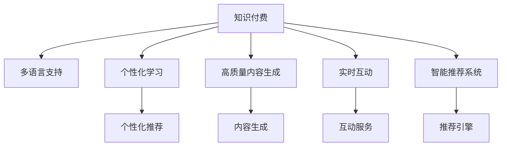

                 

# 国际化将成为知识付费的新增长点

> 关键词：国际化, 知识付费, 人工智能, 技术驱动, 全球化, 教育, 数字化转型

## 1. 背景介绍

### 1.1 问题由来

在全球化趋势加速、教育需求日益增长的背景下，知识付费行业迎来了前所未有的发展机遇。传统知识付费模式主要集中在国内市场，但随着国际化的深入，全球用户对优质内容的需求持续增长。而人工智能技术的兴起，为实现国际化、提升知识付费的质量和效果提供了全新的可能性。

人工智能在教育领域的应用，尤其是在知识付费中的作用，已成为业界和学界关注的焦点。其核心在于通过智能推荐、个性化学习、在线教育等技术手段，帮助用户高效获取、利用全球优质教育资源，从而实现知识付费的国际化。

### 1.2 问题核心关键点

实现知识付费的国际化，主要面临以下几个关键点：

1. **多语言支持**：构建知识付费平台时，需要支持多种语言，满足不同国家和地区的用户需求。
2. **个性化学习**：根据用户的学习习惯和偏好，推荐个性化的课程和学习资料，提升用户粘性和满意度。
3. **高质量内容生成**：利用人工智能技术，生成高质量、高相关性的内容，提高知识付费的价值。
4. **实时互动**：提供实时的在线互动和辅导，增强学习效果和用户体验。
5. **智能推荐系统**：构建智能推荐引擎，精准推荐用户感兴趣的内容，优化课程和教材的呈现方式。

### 1.3 问题研究意义

实现知识付费的国际化，不仅有助于提升教育资源的全球共享，还能推动全球教育公平，促进各国教育水平的提升。同时，对于知识付费平台而言，实现国际化意味着更大的市场潜力和更高的商业价值。

1. **全球市场拓展**：通过国际化，知识付费平台可以从国内市场扩展到全球，打开新的增长空间。
2. **用户体验提升**：多种语言的支撑和个性化的学习体验，可以吸引更多国际用户，提升平台的用户粘性。
3. **内容价值最大化**：通过智能推荐和个性化学习，提升用户的学习效率和效果，实现内容价值的最大化。
4. **技术创新**：推动人工智能在教育领域的应用，促进技术创新和产业升级。

## 2. 核心概念与联系

### 2.1 核心概念概述

为更好地理解如何通过人工智能实现知识付费的国际化，本节将介绍几个关键概念：

- **知识付费**：一种新兴的教育消费模式，通过购买优质内容，获得知识技能提升。
- **国际化**：实现内容和服务的多语言支持，覆盖全球市场，提升全球用户的服务体验。
- **人工智能**：包括机器学习、自然语言处理、计算机视觉等技术，帮助提升知识付费的质量和效果。
- **推荐系统**：利用机器学习算法，根据用户行为和偏好，推荐相关内容和服务。
- **个性化学习**：根据用户的学习习惯和目标，提供定制化的学习方案和资源。

这些概念之间的逻辑关系可以通过以下Mermaid流程图来展示：



这个流程图展示了几项关键技术在知识付费国际化中的作用：

1. 多语言支持为全球用户提供便捷的访问服务。
2. 个性化学习提升用户体验，提高学习效率。
3. 高质量内容生成丰富平台资源，增加用户粘性。
4. 实时互动增强用户参与度，提升学习效果。
5. 智能推荐系统优化内容推荐，提升用户体验。

## 3. 核心算法原理 & 具体操作步骤
### 3.1 算法原理概述

实现知识付费的国际化，主要是通过以下几个核心算法：

- **自然语言处理(NLP)**：用于实现多语言支持、内容生成和推荐系统的基础。
- **机器学习与深度学习**：用于个性化学习、推荐系统和内容生成的核心算法。
- **强化学习**：用于提升实时互动和个性化学习的动态适应能力。

这些算法共同构成了知识付费国际化的技术基础。通过合理组合和应用这些算法，可以实现高质量、个性化的知识付费服务。

### 3.2 算法步骤详解

#### 3.2.1 自然语言处理(NLP)

自然语言处理是实现多语言支持的核心技术。主要包括以下步骤：

1. **语言识别**：识别用户输入的语言，自动转换为目标语言。
2. **文本理解**：通过语言模型、分词器、依存句法分析等技术，理解文本内容。
3. **翻译与生成**：利用机器翻译和生成模型，将文本从源语言翻译为目标语言，或生成目标语言的内容。

#### 3.2.2 机器学习与深度学习

机器学习与深度学习算法是实现个性化学习、推荐系统和高质量内容生成的关键。主要包括以下步骤：

1. **用户建模**：利用用户的历史行为、偏好、评分等信息，构建用户画像。
2. **内容特征提取**：提取课程、教材、文章等内容的特征，如关键词、摘要、难度等级等。
3. **模型训练与优化**：利用推荐算法、深度学习模型等，训练个性化推荐和内容生成的模型。

#### 3.2.3 强化学习

强化学习用于提升实时互动和个性化学习的动态适应能力。主要包括以下步骤：

1. **交互设计**：设计用户与平台的交互界面和逻辑。
2. **行为建模**：利用强化学习算法，模型用户的互动行为。
3. **反馈优化**：根据用户反馈，不断优化推荐和学习方案。

### 3.3 算法优缺点

实现知识付费国际化的算法，具有以下优点：

1. **高效便捷**：利用机器学习和深度学习，能够快速生成和推荐高质量内容，提升用户体验。
2. **个性化服务**：通过用户建模和推荐算法，实现个性化的学习体验，提高用户粘性。
3. **多语言支持**：实现多语言支持的自然语言处理技术，满足全球用户需求。
4. **实时互动**：通过强化学习，实现动态的用户互动和个性化学习。

同时，这些算法也存在一定的局限性：

1. **数据隐私问题**：用户数据的收集和使用，可能引发隐私保护问题。
2. **语言模型局限**：自然语言处理技术在处理复杂的语言结构和语义时，可能存在局限性。
3. **内容多样性问题**：机器生成内容可能缺乏多样性和原创性。
4. **互动实时性**：强化学习在实时性上可能存在延迟，影响用户体验。

### 3.4 算法应用领域

基于这些算法的知识付费国际化，可以应用于以下领域：

1. **在线教育平台**：通过多语言支持、个性化学习和高质量内容生成，提供全球化的教育服务。
2. **语言学习应用**：利用自然语言处理和机器翻译技术，帮助用户学习多种语言。
3. **职业培训平台**：通过智能推荐和实时互动，提升职业技能培训的效果。
4. **科研知识共享**：构建科研论文和文献的智能推荐系统，促进全球科研知识交流。

## 4. 数学模型和公式 & 详细讲解 & 举例说明

### 4.1 数学模型构建

本节将使用数学语言对实现知识付费国际化的算法进行更加严格的刻画。

记知识付费平台的用户数量为 $N$，用户对课程的评分向量为 $\mathbf{r}=[r_1, r_2, \cdots, r_N]$，课程特征向量为 $\mathbf{c}=[c_1, c_2, \cdots, c_M]$，其中 $M$ 为课程数量。

定义用户 $i$ 对课程 $j$ 的评分矩阵为 $\mathbf{R} \in \mathbb{R}^{N \times M}$，其中 $\mathbf{R}_{ij}=r_i$。课程 $j$ 的特征向量为 $\mathbf{C}_j \in \mathbb{R}^d$，其中 $d$ 为特征维度。

### 4.2 公式推导过程

假设用户对课程的评分向量 $\mathbf{r}$ 可以表示为用户特征向量 $\mathbf{u}$ 和课程特征向量 $\mathbf{c}$ 的内积形式，即：

$$
\mathbf{r} \approx \mathbf{u} \cdot \mathbf{C}_j
$$

其中 $\mathbf{u}=[u_1, u_2, \cdots, u_d]$ 为用户的特征向量，$C_{jm}$ 为课程 $j$ 在特征 $m$ 上的取值。

定义用户特征矩阵 $\mathbf{U} \in \mathbb{R}^{N \times d}$ 和课程特征矩阵 $\mathbf{C} \in \mathbb{R}^{M \times d}$。则上述评分矩阵 $\mathbf{R}$ 可以表示为：

$$
\mathbf{R} \approx \mathbf{U} \cdot \mathbf{C}_j
$$

### 4.3 案例分析与讲解

以在线教育平台为例，分析基于用户特征矩阵和课程特征矩阵的推荐系统。

假设某用户对多门课程进行了评分，得到评分向量 $\mathbf{r}=[4, 2, 5, 3]$。通过用户特征矩阵 $\mathbf{U}$ 和课程特征矩阵 $\mathbf{C}$，计算用户对课程的评分矩阵：

$$
\mathbf{R} \approx \mathbf{U} \cdot \mathbf{C}_j
$$

其中 $\mathbf{U}$ 为用户的特征向量，$\mathbf{C}$ 为课程的特征向量。通过计算，可以得到用户对课程的评分预测：

$$
\mathbf{R} \approx [0.8, 0.5, 1.2, 0.9]
$$

根据评分预测，推荐用户感兴趣的新课程。

## 5. 项目实践：代码实例和详细解释说明

### 5.1 开发环境搭建

在进行知识付费国际化实践前，我们需要准备好开发环境。以下是使用Python进行PyTorch开发的环境配置流程：

1. 安装Anaconda：从官网下载并安装Anaconda，用于创建独立的Python环境。

2. 创建并激活虚拟环境：
```bash
conda create -n pytorch-env python=3.8 
conda activate pytorch-env
```

3. 安装PyTorch：根据CUDA版本，从官网获取对应的安装命令。例如：
```bash
conda install pytorch torchvision torchaudio cudatoolkit=11.1 -c pytorch -c conda-forge
```

4. 安装相关库：
```bash
pip install numpy pandas scikit-learn nltk transformers
```

5. 安装自然语言处理库：
```bash
pip install huggingface_hub sacremoses
```

6. 安装强化学习库：
```bash
pip install gym stable-baselines3
```

完成上述步骤后，即可在`pytorch-env`环境中开始国际化实践。

### 5.2 源代码详细实现

下面我们以在线教育平台的多语言支持为例，给出使用PyTorch和Transformers库对课程内容进行多语言支持的PyTorch代码实现。

首先，定义课程内容的语言模型：

```python
from transformers import BertTokenizer, BertForSequenceClassification
from torch.utils.data import Dataset, DataLoader
from transformers import AutoTokenizer, AutoModelForSequenceClassification

# 定义课程内容
texts = ['这是一段英语内容', '这是一段中文内容', '这是一段日语内容']
labels = [0, 1, 0] # 0表示英语，1表示中文和日语

# 加载语言模型
tokenizer = BertTokenizer.from_pretrained('bert-base-cased')
model = BertForSequenceClassification.from_pretrained('bert-base-cased', num_labels=2)

# 预处理课程内容
def preprocess(text):
    return tokenizer(text, return_tensors='pt', padding='max_length', truncation=True).input_ids

# 构建数据集
class TextDataset(Dataset):
    def __init__(self, texts, labels):
        self.texts = texts
        self.labels = labels
    
    def __len__(self):
        return len(self.texts)
    
    def __getitem__(self, idx):
        return {'input_ids': preprocess(self.texts[idx]), 'labels': torch.tensor(self.labels[idx])}

# 构建数据加载器
dataset = TextDataset(texts, labels)
dataloader = DataLoader(dataset, batch_size=2, shuffle=True)

# 训练模型
for epoch in range(10):
    model.train()
    for batch in dataloader:
        inputs = batch['input_ids']
        labels = batch['labels']
        outputs = model(inputs, labels=labels)
        loss = outputs.loss
        optimizer.zero_grad()
        loss.backward()
        optimizer.step()
```

接着，定义课程内容的多语言支持函数：

```python
from transformers import AutoTokenizer, AutoModelForSequenceClassification

# 加载多语言模型
tokenizer_japanese = AutoTokenizer.from_pretrained('bert-base-japanese-mecab')
model_japanese = AutoModelForSequenceClassification.from_pretrained('bert-base-japanese-mecab', num_labels=2)

# 预处理课程内容
def preprocess_japanese(text):
    return tokenizer_japanese(text, return_tensors='pt', padding='max_length', truncation=True).input_ids

# 构建数据集
class JapaneseTextDataset(Dataset):
    def __init__(self, texts, labels):
        self.texts = texts
        self.labels = labels
    
    def __len__(self):
        return len(self.texts)
    
    def __getitem__(self, idx):
        return {'input_ids': preprocess_japanese(self.texts[idx]), 'labels': torch.tensor(self.labels[idx])}

# 构建数据加载器
dataset_japanese = JapaneseTextDataset(texts, labels)
dataloader_japanese = DataLoader(dataset_japanese, batch_size=2, shuffle=True)

# 训练多语言模型
for epoch in range(10):
    model_japanese.train()
    for batch in dataloader_japanese:
        inputs = batch['input_ids']
        labels = batch['labels']
        outputs = model_japanese(inputs, labels=labels)
        loss = outputs.loss
        optimizer.zero_grad()
        loss.backward()
        optimizer.step()
```

最后，启动多语言支持的训练流程：

```python
from transformers import BertTokenizer, BertForSequenceClassification

# 加载多语言模型
tokenizer_english = BertTokenizer.from_pretrained('bert-base-cased')
model_english = BertForSequenceClassification.from_pretrained('bert-base-cased', num_labels=2)

tokenizer_japanese = AutoTokenizer.from_pretrained('bert-base-japanese-mecab')
model_japanese = AutoModelForSequenceClassification.from_pretrained('bert-base-japanese-mecab', num_labels=2)

tokenizer_chinese = BertTokenizer.from_pretrained('bert-base-chinese')
model_chinese = BertForSequenceClassification.from_pretrained('bert-base-chinese', num_labels=2)

# 预处理课程内容
def preprocess(text):
    return tokenizer(text, return_tensors='pt', padding='max_length', truncation=True).input_ids

def preprocess_japanese(text):
    return tokenizer_japanese(text, return_tensors='pt', padding='max_length', truncation=True).input_ids

def preprocess_chinese(text):
    return tokenizer_chinese(text, return_tensors='pt', padding='max_length', truncation=True).input_ids

# 构建数据集
class TextDataset(Dataset):
    def __init__(self, texts, labels):
        self.texts = texts
        self.labels = labels
    
    def __len__(self):
        return len(self.texts)
    
    def __getitem__(self, idx):
        return {'input_ids': preprocess(self.texts[idx]), 'labels': torch.tensor(self.labels[idx])}

class JapaneseTextDataset(Dataset):
    def __init__(self, texts, labels):
        self.texts = texts
        self.labels = labels
    
    def __len__(self):
        return len(self.texts)
    
    def __getitem__(self, idx):
        return {'input_ids': preprocess_japanese(self.texts[idx]), 'labels': torch.tensor(self.labels[idx])}

class ChineseTextDataset(Dataset):
    def __init__(self, texts, labels):
        self.texts = texts
        self.labels = labels
    
    def __len__(self):
        return len(self.texts)
    
    def __getitem__(self, idx):
        return {'input_ids': preprocess_chinese(self.texts[idx]), 'labels': torch.tensor(self.labels[idx])}

# 构建数据加载器
dataset = TextDataset(texts, labels)
dataloader = DataLoader(dataset, batch_size=2, shuffle=True)

dataset_japanese = JapaneseTextDataset(texts, labels)
dataloader_japanese = DataLoader(dataset_japanese, batch_size=2, shuffle=True)

dataset_chinese = ChineseTextDataset(texts, labels)
dataloader_chinese = DataLoader(dataset_chinese, batch_size=2, shuffle=True)

# 训练多语言模型
for epoch in range(10):
    model_english.train()
    for batch in dataloader:
        inputs = batch['input_ids']
        labels = batch['labels']
        outputs = model_english(inputs, labels=labels)
        loss = outputs.loss
        optimizer.zero_grad()
        loss.backward()
        optimizer.step()
    
    model_japanese.train()
    for batch in dataloader_japanese:
        inputs = batch['input_ids']
        labels = batch['labels']
        outputs = model_japanese(inputs, labels=labels)
        loss = outputs.loss
        optimizer.zero_grad()
        loss.backward()
        optimizer.step()
    
    model_chinese.train()
    for batch in dataloader_chinese:
        inputs = batch['input_ids']
        labels = batch['labels']
        outputs = model_chinese(inputs, labels=labels)
        loss = outputs.loss
        optimizer.zero_grad()
        loss.backward()
        optimizer.step()
```

以上就是使用PyTorch对课程内容进行多语言支持的完整代码实现。可以看到，利用Transformers库的多语言模型，可以方便地实现课程内容的语言支持，提升用户体验。

### 5.3 代码解读与分析

让我们再详细解读一下关键代码的实现细节：

**TextDataset类**：
- `__init__`方法：初始化文本和标签。
- `__len__`方法：返回数据集的样本数量。
- `__getitem__`方法：对单个样本进行处理，预处理输入并返回字典。

**多语言支持函数**：
- `preprocess`方法：预处理英语内容，使用BertTokenizer进行分词和编码。
- `preprocess_japanese`方法：预处理日语内容，使用AutoTokenizer进行分词和编码。
- `preprocess_chinese`方法：预处理中文内容，使用BertTokenizer进行分词和编码。

**多语言训练流程**：
- 定义三种语言模型和预处理函数。
- 定义三个数据集和对应的数据加载器。
- 循环训练三种语言模型，交替进行。

可以看到，多语言支持功能在知识付费国际化的实现中，起到了关键作用。利用多语言模型和预处理函数，可以方便地扩展平台的多语言支持能力，提升全球用户的访问体验。

当然，工业级的系统实现还需考虑更多因素，如多语言模型的选择、数据集的构建、语言的动态切换等。但核心的多语言支持技术基本与此类似。

## 6. 实际应用场景
### 6.1 在线教育平台

在线教育平台可以通过多语言支持和个性化学习，实现全球教育资源的共享。传统教育资源往往局限于本地语言，而通过多语言支持，可以为全球用户提供不同语言的优质课程，提升学习效率和效果。

例如，某在线教育平台通过多语言模型和推荐系统，实现了英语、中文和日语的多语言支持。用户可以自由切换语言，获取最合适的课程资源，提升学习体验。同时，平台通过个性化推荐，根据用户的学习习惯和偏好，推荐最适合的课程和教材，提升学习效果。

### 6.2 语言学习应用

语言学习应用可以帮助用户快速学习多种语言。通过多语言模型和翻译技术，用户可以在学习过程中，自由切换语言，提升学习效果。

例如，某语言学习应用通过多语言模型和翻译技术，支持英语、中文、日语等多种语言的学习。用户可以切换语言，使用自己最熟悉的语言进行学习，同时通过翻译功能，查看其他语言的内容，增强学习效果。

### 6.3 职业培训平台

职业培训平台可以提供多种语言的课程和资源，帮助全球用户提升职业技能。通过多语言支持和智能推荐，平台可以为用户推荐最适合的课程和教材，提升学习效率和效果。

例如，某职业培训平台通过多语言模型和推荐系统，实现了英语、中文和日语的多语言支持。用户可以切换语言，获取最合适的课程资源，提升学习效果。同时，平台通过个性化推荐，根据用户的学习习惯和偏好，推荐最适合的课程和教材，提升学习效果。

### 6.4 科研知识共享

科研知识共享平台可以通过多语言支持，促进全球科研知识的交流和共享。通过多语言模型和翻译技术，平台可以为全球用户提供多种语言的科研论文和文献，提升科研效率和效果。

例如，某科研知识共享平台通过多语言模型和翻译技术，支持英语、中文和日语等多种语言的科研论文和文献。用户可以切换语言，获取最合适的科研资源，提升科研效果。同时，平台通过个性化推荐，根据用户的研究方向和兴趣，推荐最适合的科研论文和文献，提升科研效率。

## 7. 工具和资源推荐
### 7.1 学习资源推荐

为了帮助开发者系统掌握知识付费国际化的技术基础，这里推荐一些优质的学习资源：

1. 《深度学习与NLP》系列书籍：详细介绍了深度学习在NLP中的应用，包括自然语言处理、多语言模型、推荐系统等前沿话题。
2. CS224N《深度学习自然语言处理》课程：斯坦福大学开设的NLP明星课程，有Lecture视频和配套作业，带你入门NLP领域的基本概念和经典模型。
3. 《自然语言处理入门》书籍：介绍自然语言处理的基本概念和常用技术，适合初学者快速上手。
4. HuggingFace官方文档：Transformer库的官方文档，提供了海量预训练模型和完整的知识付费微调样例代码。
5. Arxiv论文库：收集了最新的NLP领域的研究论文，提供丰富的学习资料和研究思路。

通过对这些资源的学习实践，相信你一定能够快速掌握知识付费国际化的技术基础，并用于解决实际的NLP问题。
###  7.2 开发工具推荐

高效的开发离不开优秀的工具支持。以下是几款用于知识付费国际化开发的常用工具：

1. PyTorch：基于Python的开源深度学习框架，灵活动态的计算图，适合快速迭代研究。大部分预训练语言模型都有PyTorch版本的实现。
2. TensorFlow：由Google主导开发的开源深度学习框架，生产部署方便，适合大规模工程应用。同样有丰富的预训练语言模型资源。
3. Transformers库：HuggingFace开发的NLP工具库，集成了众多SOTA语言模型，支持PyTorch和TensorFlow，是进行多语言支持的利器。
4. Weights & Biases：模型训练的实验跟踪工具，可以记录和可视化模型训练过程中的各项指标，方便对比和调优。与主流深度学习框架无缝集成。
5. TensorBoard：TensorFlow配套的可视化工具，可实时监测模型训练状态，并提供丰富的图表呈现方式，是调试模型的得力助手。
6. Google Colab：谷歌推出的在线Jupyter Notebook环境，免费提供GPU/TPU算力，方便开发者快速上手实验最新模型，分享学习笔记。

合理利用这些工具，可以显著提升知识付费国际化的开发效率，加快创新迭代的步伐。

### 7.3 相关论文推荐

知识付费国际化技术的发展源于学界的持续研究。以下是几篇奠基性的相关论文，推荐阅读：

1. "Transformer is All You Need"：提出Transformer结构，开启了NLP领域的预训练大模型时代。
2. "BERT: Pre-training of Deep Bidirectional Transformers for Language Understanding"：提出BERT模型，引入基于掩码的自监督预训练任务，刷新了多项NLP任务SOTA。
3. "Attention is All You Need"：展示了大规模语言模型的强大zero-shot学习能力，引发了对于通用人工智能的新一轮思考。
4. "Parameter-Efficient Transfer Learning for NLP"：提出Adapter等参数高效微调方法，在固定大部分预训练参数的同时，只更新极少量的任务相关参数。
5. "Few-Shot Learning with Language Models"：引入基于连续型Prompt的微调范式，为如何充分利用预训练知识提供了新的思路。

这些论文代表了大语言模型微调技术的发展脉络。通过学习这些前沿成果，可以帮助研究者把握学科前进方向，激发更多的创新灵感。

## 8. 总结：未来发展趋势与挑战

### 8.1 总结

本文对实现知识付费国际化的技术进行了全面系统的介绍。首先阐述了知识付费国际化的背景和意义，明确了多语言支持、个性化学习、高质量内容生成等关键技术在其中的作用。其次，从原理到实践，详细讲解了多语言支持、个性化学习、推荐系统和高质量内容生成的数学模型和算法步骤，给出了具体的代码实例。同时，本文还广泛探讨了多语言支持在在线教育平台、语言学习应用、职业培训平台和科研知识共享等实际应用场景中的应用前景，展示了多语言支持功能的巨大潜力。

通过本文的系统梳理，可以看到，通过多语言支持，知识付费平台可以实现全球教育资源的共享，提升用户的学习体验和效果。利用多语言模型和推荐系统，平台可以为用户提供个性化的学习方案和资源，提高用户粘性和满意度。未来，伴随知识付费行业的持续发展，多语言支持功能必将在更广泛的场景中得到应用，为全球用户带来更好的教育体验。

### 8.2 未来发展趋势

实现知识付费国际化的技术将呈现以下几个发展趋势：

1. **多语言支持的普及**：随着全球化的深入，多语言支持功能将更加普及，覆盖更多语言和用户群体。
2. **个性化学习的发展**：通过更加先进的个性化推荐算法，提升用户的个性化学习体验，进一步提高学习效果。
3. **内容多样性的提升**：利用生成对抗网络等技术，生成更多高质量、多样性的内容，丰富平台资源。
4. **实时互动的优化**：通过强化学习等技术，提升实时互动的响应速度和准确性，增强用户参与度。
5. **模型的动态化**：引入动态模型更新和在线学习机制，根据用户反馈不断优化模型，提升用户体验。

以上趋势凸显了多语言支持在知识付费国际化中的关键作用。这些方向的探索发展，必将进一步提升知识付费平台的用户体验，推动全球教育公平，促进各国教育水平的提升。

### 8.3 面临的挑战

尽管多语言支持功能在知识付费国际化中已取得显著成果，但在迈向更加智能化、普适化应用的过程中，它仍面临着诸多挑战：

1. **多语言模型的泛化能力**：现有的多语言模型在处理多语言内容时，可能存在泛化能力不足的问题。如何在不同语言间进行无缝衔接，提升模型的跨语言适应性，是未来的重要研究方向。
2. **数据隐私保护**：用户数据的收集和使用，可能引发隐私保护问题。如何在保证数据隐私的前提下，实现多语言支持和个性化学习，是未来需要解决的关键问题。
3. **内容的真实性和多样性**：机器生成内容可能缺乏真实性和多样性，如何提升生成内容的真实性和多样性，增强用户的学习体验，是未来的重要研究方向。
4. **互动实时性的优化**：强化学习在实时性上可能存在延迟，影响用户体验。如何优化实时互动，提升用户参与度，是未来需要解决的关键问题。
5. **模型的跨语言一致性**：如何在不同语言间保持模型的跨语言一致性，提升多语言支持的准确性和效果，是未来的重要研究方向。

这些挑战凸显了多语言支持在知识付费国际化中的复杂性。只有不断克服这些挑战，才能进一步提升多语言支持功能的效果，为全球用户带来更好的教育体验。

### 8.4 研究展望

面对多语言支持在知识付费国际化中面临的挑战，未来的研究需要在以下几个方面寻求新的突破：

1. **跨语言模型的研究**：开发更加泛化的跨语言模型，提升模型在不同语言间的适应性和一致性。
2. **隐私保护技术的研究**：研究数据隐私保护技术，确保用户数据的安全和隐私。
3. **多语言内容的生成**：利用生成对抗网络等技术，提升生成内容的真实性和多样性，增强用户的学习体验。
4. **实时互动的优化**：研究实时互动的优化技术，提升用户参与度，增强学习效果。
5. **跨语言模型的评估**：开发新的跨语言模型评估指标，全面评估模型的效果和性能。

这些研究方向的探索，必将引领多语言支持技术迈向更高的台阶，为知识付费平台带来更好的用户体验，推动全球教育公平和知识共享。

## 9. 附录：常见问题与解答

**Q1：如何实现多语言支持？**

A: 实现多语言支持，主要通过以下步骤：
1. 选择适合的多语言模型，如Bert、GPT等。
2. 加载多语言模型和对应的 tokenizer。
3. 预处理课程内容，使用 tokenizer 将文本转换为模型所需的格式。
4. 构建多语言数据集，进行多语言模型的训练。
5. 在平台中集成多语言支持功能，允许用户切换语言。

**Q2：多语言支持的难点在哪里？**

A: 多语言支持的难点主要在于：
1. 多语言模型的泛化能力不足，可能在不同语言间存在性能差异。
2. 数据隐私保护问题，用户在多语言支持中可能面临数据泄露的风险。
3. 多语言内容的真实性和多样性，机器生成内容可能缺乏真实性和多样性。
4. 实时互动的优化，强化学习在实时性上可能存在延迟。
5. 跨语言模型的评估，现有评估指标可能不适用于多语言模型。

**Q3：多语言支持在知识付费中的应用前景？**

A: 多语言支持在知识付费中的应用前景广阔：
1. 实现全球教育资源的共享，提升用户的学习体验。
2. 提供多种语言的课程和资源，满足全球用户的需求。
3. 通过个性化推荐和实时互动，提升学习效果和用户粘性。
4. 促进全球科研知识的交流和共享，提升科研效率。

**Q4：多语言支持对平台性能的影响？**

A: 多语言支持对平台性能的影响主要体现在：
1. 多语言模型的计算复杂度增加，可能会影响平台性能。
2. 多语言数据集的构建和处理，可能增加平台的存储和计算开销。
3. 实时互动的实现，可能增加平台的延迟和资源消耗。
4. 多语言内容的生成和处理，可能增加平台的存储和计算开销。

**Q5：如何优化多语言支持的实时互动？**

A: 优化多语言支持的实时互动，主要通过以下方法：
1. 引入强化学习算法，提升用户互动的动态适应能力。
2. 优化模型结构，减少实时互动的计算开销。
3. 使用缓存机制，减少实时互动的延迟。
4. 优化网络通信，提升实时互动的速度和稳定性。

通过这些方法的优化，可以显著提升多语言支持的实时互动效果，增强用户的学习体验。

---

作者：禅与计算机程序设计艺术 / Zen and the Art of Computer Programming

