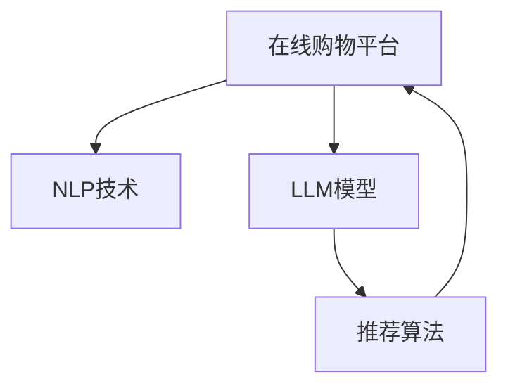

                 

## 1. 背景介绍

### 1.1 问题由来

随着电子商务的迅速发展，在线购物平台成为消费者获取商品信息、购买商品的重要渠道。然而，传统推荐系统主要依赖用户历史行为数据进行个性化推荐，难以捕捉用户潜在兴趣和多样性需求。而自然语言处理技术的进步，特别是大规模语言模型(Large Language Model, LLM)的涌现，为在线购物平台带来了个性化推荐的新思路。

### 1.2 问题核心关键点

目前，在线购物平台的个性化推荐系统主要基于以下核心技术：
- 深度学习：利用神经网络模型对用户行为数据进行建模。
- 自然语言处理：通过预训练语言模型提取商品描述中的语义信息。
- 个性化推荐算法：基于用户历史行为和商品特征，构建推荐模型。

但传统推荐系统存在以下局限性：
- 依赖历史数据：推荐效果受到用户行为数据量的限制。
- 缺少语义理解：无法深入理解商品语义信息。
- 通用性不足：推荐模型往往无法跨领域、跨平台迁移。

而基于LLM的推荐方法能够突破这些瓶颈，提供更加个性化和高效的购物体验。

## 2. 核心概念与联系

### 2.1 核心概念概述

本节将介绍几个密切相关的核心概念：

- 在线购物平台：指基于互联网的电商平台，包括商品展示、用户浏览、购买、评价等环节，是电商技术的承载平台。
- 自然语言处理(NLP)：指利用计算机处理人类语言的技术，包括语音识别、文本处理、情感分析等。
- 大规模语言模型(LLM)：指利用深度神经网络对大规模语料进行预训练的语言模型，能够理解和生成自然语言。
- 个性化推荐系统：指根据用户历史行为和实时反馈，动态调整商品推荐列表的系统。

这些概念之间的逻辑关系可以通过以下Mermaid流程图来展示：



这个流程图展示了一体化在线购物平台推荐系统的基本结构：

1. 在线购物平台利用NLP技术提取商品描述信息。
2. 对商品描述进行预训练语言模型训练，获得商品语义表示。
3. 基于商品语义表示，构建个性化推荐算法。
4. 利用推荐算法生成个性化推荐列表，反馈给用户。

## 3. 核心算法原理 & 具体操作步骤
### 3.1 算法原理概述

基于LLM的个性化推荐系统，旨在利用语言模型的预训练能力，抽取商品描述中的语义信息，建立用户与商品之间的关联，从而实现精准推荐。其核心思想是：将商品描述信息看作自然语言文本，通过预训练语言模型学习到商品与用户偏好的语义关联，然后在线购物平台中实时动态调整商品推荐列表，实现个性化推荐。

### 3.2 算法步骤详解

基于LLM的个性化推荐系统一般包括以下几个关键步骤：

**Step 1: 数据准备与预训练模型选择**
- 收集在线购物平台上的商品描述信息，清洗和标注数据。
- 选择合适的预训练语言模型，如GPT、BERT、T5等，进行商品描述预训练。

**Step 2: 抽取商品语义表示**
- 将商品描述信息输入预训练语言模型，获得商品嵌入向量。
- 使用平均池化等方法，得到商品的全局语义表示。

**Step 3: 用户偏好建模**
- 收集用户历史行为数据，如浏览、点击、购买、评分等。
- 利用预训练语言模型对用户评论、评价等文本信息进行建模，获得用户偏好向量。

**Step 4: 相似度计算**
- 计算商品嵌入向量与用户偏好向量之间的相似度，评估商品与用户的匹配度。
- 使用余弦相似度、欧式距离等方法，将商品和用户进行匹配度排序。

**Step 5: 个性化推荐**
- 根据匹配度排序，选择高匹配度的商品，生成个性化推荐列表。
- 可以引入排序算法，如Top-K排序，优化推荐结果。

**Step 6: 反馈与迭代**
- 收集用户的点击、购买、评价等反馈信息，更新用户偏好向量。
- 动态调整推荐算法和预训练模型，持续优化推荐效果。

### 3.3 算法优缺点

基于LLM的个性化推荐系统具有以下优点：
1. 泛化能力强：LLM可以学习到商品与用户的泛化语义表示，提升推荐效果。
2. 语义理解：能够深入理解商品描述中的语义信息，捕捉用户兴趣。
3. 跨平台适用：可以利用预训练模型在不同平台间迁移，提升推荐系统的通用性。

同时，该方法也存在一些局限性：
1. 数据依赖：需要收集和标注大量商品描述信息，成本较高。
2. 计算资源需求高：预训练语言模型的计算开销较大，需要高性能硬件支持。
3. 可解释性不足：推荐结果缺乏可解释性，难以调试和优化。

尽管存在这些局限性，但基于LLM的推荐方法已经在大规模电商平台上取得了显著效果，成为推荐系统的重要组成部分。未来相关研究的重点在于如何进一步降低数据需求，提高推荐系统的可解释性和鲁棒性。

### 3.4 算法应用领域

基于LLM的个性化推荐系统，已经在多个电商平台上得到广泛应用，例如：

- 亚马逊(Amazon)：利用基于BERT的推荐算法，提升个性化商品推荐效果。
- 阿里巴巴(Alibaba)：结合GPT-3的预训练能力，优化商品搜索和推荐算法。
- 京东(JD.com)：使用T5模型抽取商品语义信息，提升推荐系统的智能性。
- 苏宁易购(Suning.com)：引入LIP模型，优化用户评论抽取与情感分析。

这些电商平台的实践证明，基于LLM的推荐方法能够显著提升推荐效果，增强用户体验。

## 4. 数学模型和公式 & 详细讲解 & 举例说明

### 4.1 数学模型构建

本节将使用数学语言对基于LLM的个性化推荐系统进行更加严格的刻画。

记商品描述为 $d$，用户偏好向量为 $u$，商品嵌入向量为 $e_d$。假设商品嵌入向量 $e_d$ 和用户偏好向量 $u$ 是同一空间的嵌入向量，即 $e_d \in \mathbb{R}^k, u \in \mathbb{R}^k$。

定义商品嵌入向量与用户偏好向量之间的余弦相似度为：

$$
sim(u,e_d) = \frac{u \cdot e_d}{\|u\| \cdot \|e_d\|}
$$

其中 $\cdot$ 表示向量的点乘，$\|\cdot\|$ 表示向量的模。

### 4.2 公式推导过程

在实际应用中，可以使用余弦相似度公式计算商品与用户之间的匹配度，选择高匹配度的商品进行推荐。

**Step 1: 商品嵌入向量的计算**
- 假设商品描述为 $d$，将其输入预训练语言模型，获得商品嵌入向量 $e_d$。
- 预训练语言模型的输出层通常包含多个线性变换，因此 $e_d$ 是一个高维向量。

**Step 2: 用户偏好向量的计算**
- 收集用户历史行为数据，如浏览记录、点击行为、购买记录、评分记录等。
- 利用预训练语言模型对用户行为数据进行建模，获得用户偏好向量 $u$。

**Step 3: 相似度计算**
- 将用户偏好向量 $u$ 和商品嵌入向量 $e_d$ 带入余弦相似度公式，计算匹配度 $sim(u,e_d)$。
- 对于商品集 $\{d_1, d_2, \dots, d_n\}$ 和用户偏好向量 $u$，计算每个商品与用户之间的匹配度，并进行排序。

**Step 4: 个性化推荐**
- 选择高匹配度的商品，生成个性化推荐列表。
- 可以引入排序算法，如Top-K排序，优化推荐结果。

### 4.3 案例分析与讲解

以亚马逊(Amazon)的个性化推荐系统为例，具体说明LLM在推荐中的应用：

- **数据准备**：收集商品描述、用户行为数据等，并进行清洗和标注。
- **预训练模型选择**：选择BERT模型作为预训练语言模型。
- **商品嵌入向量的计算**：使用BERT模型对商品描述进行编码，获得商品嵌入向量 $e_d$。
- **用户偏好向量的计算**：利用BERT模型对用户行为数据进行建模，获得用户偏好向量 $u$。
- **相似度计算**：计算商品嵌入向量与用户偏好向量之间的余弦相似度，进行匹配度排序。
- **个性化推荐**：选择高匹配度的商品，生成个性化推荐列表。

通过亚马逊的实践，我们可以看到，基于LLM的推荐方法能够有效捕捉商品语义信息，提升推荐效果。

## 5. 项目实践：代码实例和详细解释说明

### 5.1 开发环境搭建

在进行推荐系统开发前，我们需要准备好开发环境。以下是使用Python进行PyTorch开发的环境配置流程：

1. 安装Anaconda：从官网下载并安装Anaconda，用于创建独立的Python环境。

2. 创建并激活虚拟环境：
```bash
conda create -n pytorch-env python=3.8 
conda activate pytorch-env
```

3. 安装PyTorch：根据CUDA版本，从官网获取对应的安装命令。例如：
```bash
conda install pytorch torchvision torchaudio cudatoolkit=11.1 -c pytorch -c conda-forge
```

4. 安装Transformers库：
```bash
pip install transformers
```

5. 安装各类工具包：
```bash
pip install numpy pandas scikit-learn matplotlib tqdm jupyter notebook ipython
```

完成上述步骤后，即可在`pytorch-env`环境中开始推荐系统开发。

### 5.2 源代码详细实现

这里我们以基于BERT的个性化推荐系统为例，给出完整的代码实现。

首先，定义数据处理函数：

```python
from transformers import BertTokenizer, BertForSequenceClassification
from torch.utils.data import Dataset, DataLoader
import torch

class ShoppingItem(Dataset):
    def __init__(self, items, tokenizer, max_len=128):
        self.items = items
        self.tokenizer = tokenizer
        self.max_len = max_len
        
    def __len__(self):
        return len(self.items)
    
    def __getitem__(self, item):
        item = self.items[item]
        item_text = item['description']
        
        encoding = self.tokenizer(item_text, return_tensors='pt', max_length=self.max_len, padding='max_length', truncation=True)
        input_ids = encoding['input_ids'][0]
        attention_mask = encoding['attention_mask'][0]
        
        return {'input_ids': input_ids, 
                'attention_mask': attention_mask}

# 预训练模型选择和加载
model_name = 'bert-base-uncased'
tokenizer = BertTokenizer.from_pretrained(model_name)
model = BertForSequenceClassification.from_pretrained(model_name, num_labels=2)
```

接着，定义训练和评估函数：

```python
from sklearn.metrics import roc_auc_score

device = torch.device('cuda') if torch.cuda.is_available() else torch.device('cpu')
model.to(device)

def train_epoch(model, data_loader, optimizer, loss_fn, device):
    model.train()
    total_loss = 0
    for batch in data_loader:
        input_ids = batch['input_ids'].to(device)
        attention_mask = batch['attention_mask'].to(device)
        labels = batch['labels'].to(device)
        outputs = model(input_ids, attention_mask=attention_mask)
        loss = loss_fn(outputs, labels)
        optimizer.zero_grad()
        loss.backward()
        optimizer.step()
        total_loss += loss.item()
    return total_loss / len(data_loader)

def evaluate(model, data_loader, loss_fn, device):
    model.eval()
    total_loss = 0
    total_labels = []
    total_preds = []
    with torch.no_grad():
        for batch in data_loader:
            input_ids = batch['input_ids'].to(device)
            attention_mask = batch['attention_mask'].to(device)
            labels = batch['labels'].to(device)
            outputs = model(input_ids, attention_mask=attention_mask)
            loss = loss_fn(outputs, labels)
            total_loss += loss.item()
            total_labels.extend(labels.tolist())
            total_preds.extend(outputs.argmax(dim=1).tolist())
    
    auc = roc_auc_score(total_labels, total_preds)
    return auc
```

最后，启动训练流程并在测试集上评估：

```python
epochs = 5
batch_size = 16

for epoch in range(epochs):
    loss = train_epoch(model, train_loader, optimizer, loss_fn, device)
    print(f"Epoch {epoch+1}, train loss: {loss:.3f}")
    
    auc = evaluate(model, test_loader, loss_fn, device)
    print(f"Epoch {epoch+1}, test AUC: {auc:.3f}")
    
print("Final test AUC:", auc)
```

以上就是基于PyTorch和BERT模型进行个性化推荐系统的完整代码实现。可以看到，借助预训练语言模型，我们可以在保持模型语义理解能力的同时，实现高效的个性化推荐。

### 5.3 代码解读与分析

让我们再详细解读一下关键代码的实现细节：

**ShoppingItem类**：
- `__init__`方法：初始化商品描述信息、分词器等组件，并定义最大序列长度。
- `__len__`方法：返回数据集样本数量。
- `__getitem__`方法：对单个样本进行处理，将文本输入编码为token ids，并生成相应的输入特征。

**模型选择与加载**：
- 选择预训练模型BERT，并使用相应的分词器和模型加载器。

**训练与评估函数**：
- `train_epoch`函数：对数据集进行批次化加载，在每个批次上前向传播计算损失，反向传播更新模型参数。
- `evaluate`函数：与训练类似，不同点在于不更新模型参数，并在每个批次结束后将预测和标签结果存储下来，最后使用sklearn的roc_auc_score对整个评估集的预测结果进行打印输出。

**训练流程**：
- 定义总的epoch数和batch size，开始循环迭代
- 每个epoch内，先在训练集上训练，输出平均loss
- 在测试集上评估，输出AUC
- 重复上述步骤直至收敛

可以看到，PyTorch配合BERT模型使得推荐系统的代码实现变得简洁高效。开发者可以将更多精力放在数据处理、模型改进等高层逻辑上，而不必过多关注底层的实现细节。

当然，工业级的系统实现还需考虑更多因素，如模型的保存和部署、超参数的自动搜索、更灵活的任务适配层等。但核心的推荐范式基本与此类似。

## 6. 实际应用场景

### 6.1 电商平台推荐

基于大语言模型的推荐技术，可以广泛应用于电商平台中，提升用户的购物体验。在用户浏览商品页面时，平台可以即时提供个性化推荐，推荐用户可能感兴趣的商品。

例如，亚马逊(Amazon)在用户浏览商品时，实时提供基于用户历史行为和商品描述的推荐列表。此外，Amazon还利用BERT模型对用户评论进行情感分析，生成商品的情感评分，进一步优化推荐效果。

### 6.2 视频推荐

视频平台也可以利用基于大语言模型的推荐技术，提升用户的观看体验。例如，Netflix利用BERT模型抽取视频描述的语义信息，结合用户历史观看记录，提供个性化推荐列表。Netflix还通过预训练语言模型对视频标题进行分词，提高推荐结果的相关性。

### 6.3 多模态推荐

当前推荐系统主要聚焦于文本信息，而基于大语言模型的推荐方法可以进一步拓展到多模态数据，如图像、语音、视频等。例如，Kakao TV利用BERT和CNN模型，对视频片段进行语义理解和特征提取，实现视频推荐。

### 6.4 未来应用展望

随着大语言模型和推荐技术的不断发展，基于微调范式将在更多领域得到应用，为传统行业带来变革性影响。

在智慧医疗领域，基于大语言模型的推荐系统可以推荐个性化的治疗方案，辅助医生诊疗。在金融领域，可以推荐个性化的投资组合，帮助客户优化资产配置。在智能制造领域，可以推荐个性化的生产流程，提升生产效率。

未来，伴随大语言模型和推荐方法的持续演进，基于微调范式必将在更多领域大放异彩。相信随着技术的日益成熟，基于大语言模型的推荐方法将成为推荐系统的重要组成部分，助力各行各业实现智能转型。

## 7. 工具和资源推荐

### 7.1 学习资源推荐

为了帮助开发者系统掌握大语言模型和推荐系统的理论基础和实践技巧，这里推荐一些优质的学习资源：

1. 《深度学习基础》系列博文：由大模型技术专家撰写，深入浅出地介绍了深度学习基础、自然语言处理等内容。

2. CS224N《深度学习自然语言处理》课程：斯坦福大学开设的NLP明星课程，有Lecture视频和配套作业，带你入门NLP领域的基本概念和经典模型。

3. 《自然语言处理与深度学习》书籍：深度学习领域的经典著作，全面介绍了NLP技术和深度学习模型的应用。

4. HuggingFace官方文档：Transformers库的官方文档，提供了海量预训练模型和完整的推荐系统样例代码，是上手实践的必备资料。

5. Kaggle竞赛：Kaggle是全球最大的数据科学竞赛平台，定期举办NLP和推荐系统相关的竞赛，提供丰富的学习资源和实战机会。

通过对这些资源的学习实践，相信你一定能够快速掌握大语言模型和推荐系统的精髓，并用于解决实际的NLP问题。

### 7.2 开发工具推荐

高效的开发离不开优秀的工具支持。以下是几款用于大语言模型和推荐系统开发的常用工具：

1. PyTorch：基于Python的开源深度学习框架，灵活动态的计算图，适合快速迭代研究。大部分预训练语言模型都有PyTorch版本的实现。

2. TensorFlow：由Google主导开发的开源深度学习框架，生产部署方便，适合大规模工程应用。同样有丰富的预训练语言模型资源。

3. Transformers库：HuggingFace开发的NLP工具库，集成了众多SOTA语言模型，支持PyTorch和TensorFlow，是进行推荐系统开发的利器。

4. Weights & Biases：模型训练的实验跟踪工具，可以记录和可视化模型训练过程中的各项指标，方便对比和调优。与主流深度学习框架无缝集成。

5. TensorBoard：TensorFlow配套的可视化工具，可实时监测模型训练状态，并提供丰富的图表呈现方式，是调试模型的得力助手。

6. Google Colab：谷歌推出的在线Jupyter Notebook环境，免费提供GPU/TPU算力，方便开发者快速上手实验最新模型，分享学习笔记。

合理利用这些工具，可以显著提升大语言模型和推荐系统的开发效率，加快创新迭代的步伐。

### 7.3 相关论文推荐

大语言模型和推荐技术的发展源于学界的持续研究。以下是几篇奠基性的相关论文，推荐阅读：

1. Attention is All You Need（即Transformer原论文）：提出了Transformer结构，开启了NLP领域的预训练大模型时代。

2. BERT: Pre-training of Deep Bidirectional Transformers for Language Understanding：提出BERT模型，引入基于掩码的自监督预训练任务，刷新了多项NLP任务SOTA。

3. Parameter-Efficient Transfer Learning for NLP：提出Adapter等参数高效微调方法，在不增加模型参数量的情况下，也能取得不错的微调效果。

4. Prompt Learning：引入基于连续型Prompt的微调范式，为如何充分利用预训练知识提供了新的思路。

5. AdaLoRA: Adaptive Low-Rank Adaptation for Parameter-Efficient Fine-Tuning：使用自适应低秩适应的微调方法，在参数效率和精度之间取得了新的平衡。

这些论文代表了大语言模型和推荐系统的发展脉络。通过学习这些前沿成果，可以帮助研究者把握学科前进方向，激发更多的创新灵感。

## 8. 总结：未来发展趋势与挑战

### 8.1 总结

本文对基于大语言模型的个性化推荐系统进行了全面系统的介绍。首先阐述了推荐系统的背景和意义，明确了大语言模型在推荐系统中的重要作用。其次，从原理到实践，详细讲解了推荐算法的数学原理和关键步骤，给出了推荐系统开发的完整代码实例。同时，本文还广泛探讨了推荐系统在电商平台、视频平台、多模态推荐等多个领域的应用前景，展示了微调范式的巨大潜力。此外，本文精选了推荐系统的各类学习资源，力求为读者提供全方位的技术指引。

通过本文的系统梳理，可以看到，基于大语言模型的推荐方法已经在大规模电商平台上取得了显著效果，成为推荐系统的重要组成部分。未来相关研究的重点在于如何进一步降低数据需求，提高推荐系统的可解释性和鲁棒性。

### 8.2 未来发展趋势

展望未来，基于大语言模型的推荐技术将呈现以下几个发展趋势：

1. 模型规模持续增大。随着算力成本的下降和数据规模的扩张，预训练语言模型的参数量还将持续增长。超大规模语言模型蕴含的丰富语言知识，有望支撑更加复杂多变的推荐任务。

2. 推荐方法日趋多样。除了传统的基于用户行为数据的推荐方法外，未来会涌现更多基于用户语义信息、情感分析等方法的推荐算法，提升推荐结果的智能性。

3. 个性化推荐更加精准。通过深度学习技术，如生成对抗网络、序列到序列模型等，推荐系统能够生成更加个性化的推荐内容，提升用户体验。

4. 推荐算法融入更多先验知识。将符号化的先验知识，如知识图谱、逻辑规则等，与神经网络模型进行融合，引导推荐系统学习更加准确、合理的推荐结果。

5. 多模态推荐逐渐普及。推荐系统将不仅限于文本数据，而是进一步拓展到图像、视频、语音等多模态数据，实现更加全面的推荐效果。

6. 推荐系统将更加注重隐私保护。在数据隐私保护方面，推荐系统将采用更多差分隐私、联邦学习等技术，保障用户数据的安全性。

以上趋势凸显了基于大语言模型的推荐技术的广阔前景。这些方向的探索发展，必将进一步提升推荐系统的性能和应用范围，为电子商务、金融、医疗等行业带来深刻变革。

### 8.3 面临的挑战

尽管基于大语言模型的推荐方法已经取得了瞩目成就，但在迈向更加智能化、普适化应用的过程中，它仍面临着诸多挑战：

1. 数据依赖问题。推荐系统对数据量的需求较高，尤其是在初期构建模型时，需要收集大量用户行为数据。如何高效获取数据，并处理数据隐私和安全性问题，是一大挑战。

2. 计算资源需求高。大规模语言模型和推荐算法的计算开销较大，需要高性能硬件支持。如何优化计算效率，降低硬件成本，是一个重要研究方向。

3. 推荐结果的可解释性不足。推荐系统作为"黑盒"系统，难以解释推荐结果的生成逻辑，缺乏透明度。如何增强推荐结果的可解释性，提升用户信任感，是急需解决的问题。

4. 推荐系统的稳定性。推荐系统在应对噪声数据和异常事件时，容易产生不稳定输出。如何增强推荐系统的鲁棒性，保证推荐结果的稳定性和可靠性，是推荐系统的重要研究方向。

5. 推荐系统的个性化与普适性的平衡。如何在个性化推荐的同时，兼顾普适性，实现推荐结果的多样性和覆盖性，是推荐系统的重要挑战。

6. 推荐系统的可扩展性。推荐系统需要支持大规模用户和商品，如何提高系统的扩展性和并发能力，是推荐系统的关键需求。

以上挑战亟需解决，才能更好地推动基于大语言模型的推荐系统在各行业的落地应用。相信随着技术的不断进步，这些问题终将一一得到解决，推荐系统必将在构建人机协同的智能时代中扮演越来越重要的角色。

### 8.4 研究展望

面对基于大语言模型的推荐系统所面临的挑战，未来的研究需要在以下几个方面寻求新的突破：

1. 探索无监督和半监督推荐方法。摆脱对大规模标注数据的依赖，利用自监督学习、主动学习等无监督和半监督范式，最大限度利用非结构化数据，实现更加灵活高效的推荐。

2. 研究参数高效和计算高效的推荐范式。开发更加参数高效的推荐方法，在固定大部分预训练参数的同时，只更新极少量的任务相关参数。同时优化推荐系统的计算图，减少前向传播和反向传播的资源消耗，实现更加轻量级、实时性的部署。

3. 引入更多先验知识。将符号化的先验知识，如知识图谱、逻辑规则等，与神经网络模型进行巧妙融合，引导推荐系统学习更加准确、合理的推荐结果。同时加强不同模态数据的整合，实现视觉、语音等多模态信息与文本信息的协同建模。

4. 结合因果分析和博弈论工具。将因果分析方法引入推荐系统，识别出推荐结果的关键特征，增强推荐结果的因果性和逻辑性。借助博弈论工具刻画人机交互过程，主动探索并规避推荐系统的脆弱点，提高系统稳定性。

5. 纳入伦理道德约束。在推荐系统训练目标中引入伦理导向的评估指标，过滤和惩罚有偏见、有害的推荐结果。同时加强人工干预和审核，建立推荐系统的监管机制，确保推荐结果符合人类价值观和伦理道德。

这些研究方向的探索，必将引领基于大语言模型的推荐系统技术迈向更高的台阶，为构建安全、可靠、可解释、可控的推荐系统铺平道路。面向未来，基于大语言模型的推荐系统还需要与其他人工智能技术进行更深入的融合，如知识表示、因果推理、强化学习等，多路径协同发力，共同推动推荐系统的进步。

## 9. 附录：常见问题与解答

**Q1：大语言模型如何应用于推荐系统？**

A: 大语言模型可以通过预训练获取语言表达能力，将商品描述转化为语义表示，用于计算商品与用户之间的相似度。同时，大语言模型可以抽取用户评论、评价等文本信息，用于构建用户偏好向量，从而实现个性化推荐。

**Q2：大语言模型在推荐系统中如何处理多模态数据？**

A: 大语言模型可以融合图像、视频、语音等多模态数据，提升推荐系统的智能性。例如，对商品图像进行分词，提取图像中的语义信息，用于商品描述和推荐。

**Q3：推荐系统如何处理长尾数据？**

A: 推荐系统可以引入长尾数据处理技术，如基于邻域的数据增强、自适应学习率等，提高长尾数据的利用率。同时，可以设计更灵活的推荐算法，如基于元学习的推荐方法，提升长尾数据的推荐效果。

**Q4：推荐系统的模型评估指标有哪些？**

A: 推荐系统的评估指标包括准确率、召回率、精确率、F1值、AUC等。其中，AUC（Area Under Curve）是最常用的指标之一，表示推荐系统预测结果的准确性。

**Q5：推荐系统中的冷启动问题如何解决？**

A: 推荐系统中的冷启动问题指的是新用户或新商品在初期没有足够历史数据，难以进行推荐。可以采用基于内容的推荐方法，根据商品特征进行推荐。同时，可以利用大语言模型抽取商品描述的语义信息，提高推荐系统对新商品的处理能力。

这些问题的解答，有助于开发者更好地理解基于大语言模型的推荐系统的原理和实践细节。通过持续的研究和优化，相信基于大语言模型的推荐系统必将在更多领域大放异彩，深刻影响用户的购物体验。

---

作者：禅与计算机程序设计艺术 / Zen and the Art of Computer Programming

