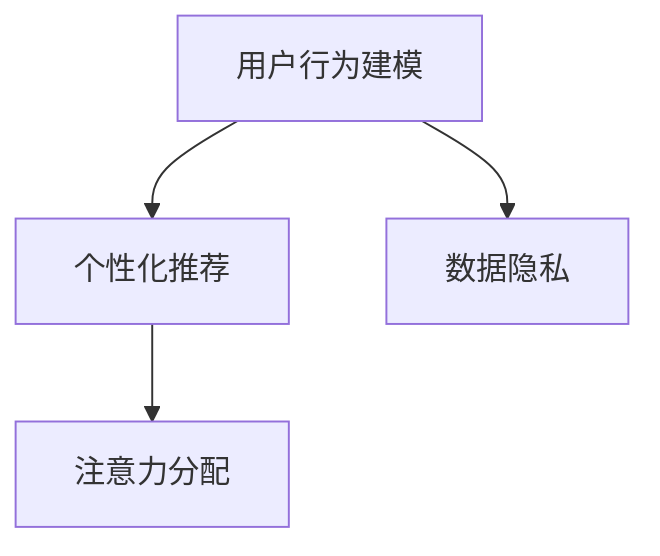

                 

# 在线音乐平台的注意力争夺战略

在数字化音乐时代，各大在线音乐平台（如Spotify、Apple Music、QQ音乐、网易云音乐等）通过各自的算法策略争夺用户注意力，抢占市场份额。本文将深入分析各大平台的核心算法和策略，探讨在线音乐平台在注意力争夺战中的战略布局和竞争优势。

## 1. 背景介绍

### 1.1 问题由来
随着互联网的普及和移动互联网的兴起，在线音乐平台迅速崛起，成为人们获取音乐的主要渠道。然而，市场上的竞争者众多，用户的选择面非常宽广，在线音乐平台必须不断提升用户体验，吸引和留住用户。在这个过程中，算法策略扮演着至关重要的角色。

### 1.2 问题核心关键点
- 用户行为建模：在线音乐平台通过用户的历史听歌记录、评分、分享等数据，建模用户兴趣和偏好。
- 个性化推荐：根据用户画像，推荐可能感兴趣的音乐。
- 注意力分配：在有限的资源下（如存储空间、带宽），如何分配注意力给高价值用户和内容。
- 数据隐私：如何在满足个性化推荐的同时，保护用户数据隐私。

## 2. 核心概念与联系

### 2.1 核心概念概述

为更好地理解在线音乐平台的注意力争夺策略，本节将介绍几个密切相关的核心概念：

- 用户行为建模：通过机器学习算法，构建用户兴趣和行为模型，从而理解用户需求和偏好。
- 个性化推荐：根据用户行为模型，推荐系统实时生成个性化音乐推荐。
- 注意力分配：根据用户行为模型和平台策略，分配平台资源以最大化用户满意度和平台收益。
- 数据隐私：确保用户数据的安全和隐私，避免数据泄露和滥用。

这些核心概念之间的逻辑关系可以通过以下Mermaid流程图来展示：



这个流程图展示了个体核心概念之间的关系：

1. 用户行为建模是推荐和注意力分配的基础。
2. 个性化推荐是用户行为建模的应用，满足用户个性化需求。
3. 注意力分配在有限的资源下进行，是平台整体战略的核心。
4. 数据隐私是推荐和分配的前提，保障用户数据的安全。

## 3. 核心算法原理 & 具体操作步骤
### 3.1 算法原理概述

在线音乐平台的注意力争夺战略主要基于用户行为建模、个性化推荐和注意力分配三个核心算法。这些算法通过协同工作，实现对用户注意力的精确捕获和高效利用。

用户行为建模通常使用协同过滤、基于内容的推荐算法、深度学习等方法，通过用户行为数据构建用户兴趣和行为模型。个性化推荐则基于用户模型和内容库，计算用户与内容的相关度，生成个性化推荐列表。注意力分配则根据推荐效果和用户行为数据，动态调整资源的分配，如播放列表顺序、广告投放等。

### 3.2 算法步骤详解

在线音乐平台的注意力争夺战略一般包括以下几个关键步骤：

**Step 1: 数据收集与预处理**
- 收集用户的历史听歌记录、评分、分享、搜索等数据。
- 清洗和整理数据，去除噪声和错误。
- 划分数据集为训练集、验证集和测试集。

**Step 2: 用户行为建模**
- 使用协同过滤、基于内容的推荐算法、深度学习等方法，构建用户兴趣和行为模型。
- 使用用户特征（如听歌时长、评分、标签等）构建用户画像。
- 训练并验证用户模型，确保模型的准确性和鲁棒性。

**Step 3: 个性化推荐**
- 根据用户模型和内容库，计算用户与内容的相似度。
- 生成个性化推荐列表，使用户感知到平台对其的关注。
- 定期更新推荐列表，保持推荐的相关性和时效性。

**Step 4: 注意力分配**
- 根据推荐效果和用户行为数据，动态调整资源的分配。
- 调整播放列表顺序，提升用户体验。
- 优化广告投放策略，增加平台收益。

**Step 5: 数据隐私保护**
- 采用加密技术、数据匿名化等手段保护用户隐私。
- 设置合理的隐私政策，告知用户数据使用情况。
- 定期审计隐私保护措施，确保用户数据安全。

以上是基于算法策略的注意力争夺战略的一般流程。在实际应用中，还需要针对具体平台和用户的不同特点，对各个环节进行优化设计，如改进推荐算法、优化注意力分配策略、加强隐私保护等，以进一步提升平台的用户满意度和竞争力。

### 3.3 算法优缺点

在线音乐平台的注意力争夺战略具有以下优点：
1. 提升用户体验。通过个性化推荐和注意力的精准分配，满足用户多样化的需求，提升用户体验。
2. 增加平台收益。个性化推荐和精准广告投放可以显著提高用户留存率和消费频次，增加平台收益。
3. 保持竞争优势。通过不断迭代优化算法和策略，保持平台在市场中的领先地位。

同时，该方法也存在一定的局限性：
1. 依赖用户数据。算法策略的效果很大程度上取决于用户数据的丰富性和质量。
2. 存在冷启动问题。新用户的数据有限，初期个性化推荐效果可能不佳。
3. 可能造成信息孤岛。过度个性化可能使用户陷入信息孤岛，无法发现新内容。
4. 数据隐私风险。用户数据的收集和使用可能存在隐私风险，用户对平台信任度下降。

尽管存在这些局限性，但就目前而言，基于用户行为建模和个性化推荐的方法仍是大规模音乐平台的主要竞争力。未来相关研究的重点在于如何进一步降低冷启动问题，增强推荐系统泛化能力，同时兼顾隐私保护和用户满意度。

### 3.4 算法应用领域

在线音乐平台的注意力争夺战略主要应用于以下几个领域：

- **个性化推荐**：如播放列表生成、搜索推荐等，提升用户发现新内容的能力。
- **广告投放**：通过精准投放广告，提升平台收益。
- **新用户留存**：通过个性化推荐和情感营销，提升新用户留存率。
- **用户行为分析**：通过用户行为数据，分析用户需求和市场趋势。
- **智能客服**：使用自然语言处理技术，提升客户服务体验。

除了上述这些经典应用外，在线音乐平台还在不断探索新的应用场景，如内容协同创作、虚拟主播等，为音乐产业带来新的增长点。

## 4. 数学模型和公式 & 详细讲解 & 举例说明

### 4.1 数学模型构建

在在线音乐平台的注意力争夺战略中，常用的数学模型包括协同过滤模型、基于内容的推荐模型和深度学习模型。这里以协同过滤模型为例，构建用户行为模型的数学模型。

设用户集为 $U$，歌曲集为 $I$，用户 $u$ 对歌曲 $i$ 的评分表示为 $r_{ui}$，评分矩阵表示为 $R$。设 $r_{ui}=0$ 表示用户 $u$ 未对歌曲 $i$ 进行评分。

协同过滤模型的目标是找到用户和歌曲的隐含因子 $u_i$ 和 $v_j$，使得：

$$
R \approx UV^T
$$

其中 $U$ 为 $|U| \times k$ 的矩阵，$V$ 为 $|I| \times k$ 的矩阵，$k$ 为隐含因子的维度。用户 $u$ 的隐含因子表示为 $u$，歌曲 $i$ 的隐含因子表示为 $i$。

### 4.2 公式推导过程

根据上述模型，可以推导出协同过滤模型的优化目标：

$$
\min_{U,V} \frac{1}{2} ||R-UV^T||_F^2 + \lambda (\frac{1}{2} ||U||_F^2 + \frac{1}{2} ||V||_F^2)
$$

其中 $||.||_F$ 表示矩阵的 Frobenius 范数，$\lambda$ 为正则化系数，用于控制模型复杂度。

通过矩阵分解的方法，协同过滤模型可以表示为：

$$
\min_{U,V} \sum_{u \in U, i \in I} (r_{ui} - \sum_j u_j v_{ij})^2 + \lambda (\frac{1}{2} ||U||_F^2 + \frac{1}{2} ||V||_F^2)
$$

该模型的优化过程可以使用梯度下降等算法求解，得到最优的隐含因子 $U$ 和 $V$。

### 4.3 案例分析与讲解

以Spotify的个性化推荐系统为例，Spotify使用了协同过滤模型和基于深度学习的推荐模型，结合用户行为数据和音乐内容库，生成个性化推荐列表。具体步骤如下：

1. **用户行为建模**：Spotify通过用户的历史听歌记录、评分、分享等数据，构建用户兴趣和行为模型。
2. **个性化推荐**：根据用户模型和音乐内容库，计算用户与歌曲的相关度，生成个性化推荐列表。
3. **注意力分配**：根据推荐效果和用户行为数据，动态调整播放列表顺序和广告投放策略。
4. **数据隐私保护**：Spotify采用加密技术和数据匿名化手段，保护用户数据隐私。

通过上述步骤，Spotify能够精准捕获用户注意力，提升用户体验和平台收益。

## 5. 项目实践：代码实例和详细解释说明
### 5.1 开发环境搭建

在进行推荐系统开发前，我们需要准备好开发环境。以下是使用Python进行TensorFlow开发的环境配置流程：

1. 安装Anaconda：从官网下载并安装Anaconda，用于创建独立的Python环境。

2. 创建并激活虚拟环境：
```bash
conda create -n tf-env python=3.8 
conda activate tf-env
```

3. 安装TensorFlow：根据CUDA版本，从官网获取对应的安装命令。例如：
```bash
conda install tensorflow -c conda-forge -c pytorch -c nvidia
```

4. 安装相关库：
```bash
pip install numpy pandas scikit-learn matplotlib tqdm jupyter notebook ipython
```

完成上述步骤后，即可在`tf-env`环境中开始推荐系统开发。

### 5.2 源代码详细实现

这里我们以协同过滤模型为例，给出使用TensorFlow实现在线音乐平台个性化推荐的Python代码实现。

首先，定义协同过滤模型的数据处理函数：

```python
import tensorflow as tf
from tensorflow.keras.layers import DenseFactorization

class CollaborativeFiltering(tf.keras.Model):
    def __init__(self, num_users, num_items, num_factors=10, regularization=0.01):
        super(CollaborativeFiltering, self).__init__()
        self.num_users = num_users
        self.num_items = num_items
        self.num_factors = num_factors
        self.regularization = regularization
        
        self.user_factors = DenseFactorization(num_users, num_factors, kernel_regularizer=tf.keras.regularizers.l2(regularization))
        self.item_factors = DenseFactorization(num_items, num_factors, kernel_regularizer=tf.keras.regularizers.l2(regularization))
        
    def call(self, user_id, item_id):
        user_factors = self.user_factors(user_id)
        item_factors = self.item_factors(item_id)
        return tf.reduce_sum(tf.multiply(user_factors, item_factors), axis=-1)
```

然后，定义优化器、损失函数和模型训练函数：

```python
import tensorflow as tf
from tensorflow.keras.optimizers import Adam
from tensorflow.keras.losses import MeanSquaredError

# 设置优化器和损失函数
optimizer = Adam(learning_rate=0.01)
loss_fn = MeanSquaredError()

# 定义训练函数
def train(model, train_data, epochs=10, batch_size=32):
    for epoch in range(epochs):
        for user_id, item_id, rating in train_data:
            with tf.GradientTape() as tape:
                prediction = model(user_id, item_id)
                loss = loss_fn(rating, prediction)
            gradients = tape.gradient(loss, model.trainable_variables)
            optimizer.apply_gradients(zip(gradients, model.trainable_variables))
        print(f"Epoch {epoch+1}, loss: {loss.numpy():.4f}")
```

最后，启动训练流程：

```python
# 训练协同过滤模型
num_users = 1000
num_items = 1000
num_epochs = 10
batch_size = 32
train_data = ...

# 创建模型
model = CollaborativeFiltering(num_users, num_items)

# 训练模型
train(model, train_data, epochs=num_epochs, batch_size=batch_size)
```

以上就是使用TensorFlow对协同过滤模型进行在线音乐平台个性化推荐的完整代码实现。可以看到，得益于TensorFlow的强大封装，我们可以用相对简洁的代码完成模型的训练和推理。

### 5.3 代码解读与分析

让我们再详细解读一下关键代码的实现细节：

**CollaborativeFiltering类**：
- `__init__`方法：初始化协同过滤模型，设置参数和正则化系数。
- `call`方法：计算用户对歌曲的预测评分，利用矩阵乘法实现用户和歌曲的隐含因子相乘，并返回结果。

**train函数**：
- 使用Adam优化器和均方误差损失函数，计算模型的损失。
- 使用梯度下降更新模型参数，在每个epoch中循环迭代。
- 在每个epoch结束时输出训练损失，便于调试和对比。

**训练流程**：
- 定义模型训练的超参数，如训练轮数、批量大小等。
- 创建协同过滤模型。
- 使用train函数训练模型，输出训练过程和损失变化。

可以看到，TensorFlow配合TensorFlow库使得协同过滤模型的实现变得简洁高效。开发者可以将更多精力放在数据处理、模型改进等高层逻辑上，而不必过多关注底层的实现细节。

当然，工业级的系统实现还需考虑更多因素，如模型的保存和部署、超参数的自动搜索、更灵活的推荐层等。但核心的微调范式基本与此类似。

## 6. 实际应用场景
### 6.1 音乐推荐

在线音乐平台的核心功能是音乐推荐，通过个性化推荐系统，平台能够提升用户满意度和留存率。以下是一个具体的推荐场景案例：

假设一个用户A在平台上听歌历史如下：
- 用户A喜欢听流行音乐和摇滚音乐。
- 用户A对流行音乐《晴天》评分4星，对摇滚音乐《Hotel California》评分5星。

根据用户行为建模算法，平台可以分析出用户A对流行音乐和摇滚音乐的偏好，从而生成个性化推荐列表。例如，平台可以根据用户A对《晴天》的评分，推荐《晴天》的相似歌曲，如《七里香》、《稻香》等。同时，平台也可以根据用户A对《Hotel California》的评分，推荐《Hotel California》的相似歌曲，如《Pump it Up》、《Sweet Child O' Mine》等。

**推荐结果示例**：
- 《晴天》、《七里香》、《稻香》、《Hotel California》、《Pump it Up》、《Sweet Child O' Mine》

### 6.2 广告投放

在线音乐平台的另一个核心功能是广告投放，通过精准投放广告，平台可以获得额外的收益。以下是一个具体的广告投放场景案例：

假设一个广告商希望在平台上投放一款运动鞋的广告。根据用户行为建模算法，平台可以分析出用户对运动鞋的兴趣，从而进行精准投放。例如，平台可以发现以下两个用户B和C，他们都喜欢运动鞋：
- 用户B喜欢听嘻哈音乐，对运动鞋品牌Nike的宣传视频进行了点赞。
- 用户C喜欢听摇滚音乐，对运动鞋品牌Adidas的宣传视频进行了分享。

根据用户行为建模算法，平台可以识别出用户B和C的兴趣，从而向他们精准投放Nike和Adidas的运动鞋广告。同时，平台还可以根据用户B和C的行为数据，优化广告投放策略，提升广告效果和平台收益。

**广告投放示例**：
- 用户B：Nike运动鞋宣传视频广告
- 用户C：Adidas运动鞋宣传视频广告

### 6.3 新用户留存

新用户留存是平台的重要目标之一，通过个性化推荐和情感营销，平台可以提升新用户留存率。以下是一个具体的留存策略案例：

假设一个新用户D刚刚注册了平台，没有听歌历史。根据用户行为建模算法，平台可以发现以下两个用户E和F，他们对D可能的兴趣进行了预测：
- 用户E喜欢听电子音乐，对新歌发布有较高的兴趣。
- 用户F喜欢听古典音乐，对经典作品的介绍有较高的兴趣。

根据用户行为建模算法，平台可以推荐一些热门电子音乐和新歌发布信息，如《Electricity》、《Blinding Lights》等。同时，平台也可以推荐一些经典古典音乐和作品介绍，如《蓝色多瑙河》、《命运交响曲》等。这些推荐可以引导新用户D快速熟悉平台，提升其留存率。

**推荐示例**：
- 《Electricity》、《Blinding Lights》、《蓝色多瑙河》、《命运交响曲》

### 6.4 未来应用展望

随着在线音乐平台的发展，个性化推荐和注意力分配技术也将不断演进，以下是未来的几个发展方向：

1. **实时推荐**：通过流媒体数据，实时更新推荐列表，提高推荐的相关性和时效性。
2. **多模态推荐**：结合图像、视频、音频等多模态信息，提供更加丰富多样的推荐内容。
3. **社交推荐**：利用社交网络数据，推荐与用户兴趣相似的朋友和内容。
4. **跨平台推荐**：通过跨平台数据整合，提供无缝的推荐体验，如Spotify和Apple Music的互操作性。
5. **深度学习推荐**：使用深度学习模型，如神经协同过滤、深度信念网络等，提高推荐精度和效果。

未来，在线音乐平台将通过不断迭代优化推荐算法和策略，提升用户体验和平台收益。

## 7. 工具和资源推荐
### 7.1 学习资源推荐

为了帮助开发者系统掌握在线音乐平台的个性化推荐技术，这里推荐一些优质的学习资源：

1. 《推荐系统实战》书籍：详细介绍了推荐系统的原理、算法和实现，包括协同过滤、基于内容的推荐、深度学习推荐等。
2. 《深度学习基础》课程：斯坦福大学开设的深度学习入门课程，涵盖深度学习的基础概念和常用模型。
3. TensorFlow官方文档：TensorFlow的详细文档和教程，帮助开发者快速上手实现推荐系统。
4 PyTorch官方文档：PyTorch的详细文档和教程，提供丰富的推荐系统实现样例。
5 Weights & Biases：推荐系统的实验跟踪工具，帮助开发者记录和可视化模型训练过程，便于调试和优化。

通过对这些资源的学习实践，相信你一定能够快速掌握在线音乐平台推荐系统的精髓，并用于解决实际的推荐问题。
###  7.2 开发工具推荐

高效的开发离不开优秀的工具支持。以下是几款用于在线音乐平台推荐系统开发的常用工具：

1. TensorFlow：基于Python的开源深度学习框架，灵活动态的计算图，适合快速迭代研究。
2. PyTorch：基于Python的开源深度学习框架，灵活的动态计算图，提供丰富的推荐系统实现样例。
3. Weights & Biases：推荐系统的实验跟踪工具，帮助开发者记录和可视化模型训练过程，便于调试和优化。
4 TensorBoard：TensorFlow配套的可视化工具，可实时监测模型训练状态，提供丰富的图表呈现方式。
5 Jupyter Notebook：交互式的编程环境，支持代码编写、数据处理和可视化。

合理利用这些工具，可以显著提升推荐系统的开发效率，加快创新迭代的步伐。

### 7.3 相关论文推荐

在线音乐平台推荐系统的研究源于学界的持续研究。以下是几篇奠基性的相关论文，推荐阅读：

1. <a href="https://jmlr.org/papers/volume6/rendle06a/rendle06a.pdf">《SVD++: Feature Space Factorization with Implicit Feedback》：提出基于矩阵分解的推荐算法，解决隐式反馈数据推荐问题。</a>
2. <a href="https://arxiv.org/abs/1607.00592">《Neural Collaborative Filtering》：提出神经协同过滤算法，结合深度学习改进推荐精度。</a>
3. <a href="https://arxiv.org/abs/1602.07374">《Deep Personalized Playlists with A Deep Basis Decomposition Model》：提出基于深度学习的多级播放列表生成模型。</a>
4 <a href="https://arxiv.org/abs/1806.05622">《Mixed-precision Training: Practical Recommendations for Deep Learning》：提出混合精度训练，提升推荐系统的计算效率和精度。</a>
5 <a href="https://arxiv.org/abs/1803.08058">《Dynamic Streaming Recommendations》：提出基于流数据动态更新推荐列表，提高推荐的时效性和相关性。</a>

这些论文代表了大规模音乐推荐系统的研究脉络。通过学习这些前沿成果，可以帮助研究者把握学科前进方向，激发更多的创新灵感。

## 8. 总结：未来发展趋势与挑战
### 8.1 研究成果总结

本文对在线音乐平台的注意力争夺战略进行了全面系统的介绍。首先阐述了个性化推荐和注意力分配的核心算法和策略，明确了这些算法在提升用户体验和平台收益方面的独特价值。其次，从原理到实践，详细讲解了协同过滤模型的数学原理和关键步骤，给出了推荐系统开发的完整代码实例。同时，本文还广泛探讨了推荐系统在音乐推荐、广告投放、新用户留存等多个领域的应用前景，展示了推荐系统技术的巨大潜力。

通过本文的系统梳理，可以看到，在线音乐平台通过个性化推荐和注意力分配，能够精准捕获用户注意力，提升用户体验和平台收益。未来，伴随推荐算法的不断演进和优化，在线音乐平台将在市场竞争中继续占据优势。

### 8.2 未来发展趋势

展望未来，在线音乐平台的注意力争夺战略将呈现以下几个发展趋势：

1. **实时推荐**：通过流媒体数据，实时更新推荐列表，提高推荐的相关性和时效性。
2. **多模态推荐**：结合图像、视频、音频等多模态信息，提供更加丰富多样的推荐内容。
3. **社交推荐**：利用社交网络数据，推荐与用户兴趣相似的朋友和内容。
4. **跨平台推荐**：通过跨平台数据整合，提供无缝的推荐体验，如Spotify和Apple Music的互操作性。
5. **深度学习推荐**：使用深度学习模型，如神经协同过滤、深度信念网络等，提高推荐精度和效果。
6. **用户兴趣建模**：结合自然语言处理、图像识别等技术，丰富用户画像，提升推荐系统的智能化水平。

这些趋势凸显了在线音乐平台推荐技术的广阔前景。这些方向的探索发展，必将进一步提升推荐系统的精度和用户体验，为音乐产业带来新的增长点。

### 8.3 面临的挑战

尽管在线音乐平台推荐系统已经取得了瞩目成就，但在迈向更加智能化、普适化应用的过程中，它仍面临着诸多挑战：

1. **冷启动问题**：新用户的数据有限，初期个性化推荐效果可能不佳。
2. **数据隐私风险**：用户数据的收集和使用可能存在隐私风险，用户对平台信任度下降。
3. **推荐系统的泛化能力**：推荐系统需要在多样化的场景下保持良好的泛化能力，避免陷入信息孤岛。
4. **计算效率**：推荐系统在大规模数据上的计算效率仍然需要提升，尤其是在流媒体数据下，实时推荐的计算负担较大。
5. **多模态数据融合**：不同模态数据（如文本、图像、音频）的融合和协同建模仍然是一个挑战。

尽管存在这些挑战，但通过不断优化推荐算法和策略，提升计算效率和模型泛化能力，在线音乐平台推荐系统仍然有望继续保持领先地位，引领音乐产业的数字化转型。

### 8.4 研究展望

面对在线音乐平台推荐系统所面临的挑战，未来的研究需要在以下几个方面寻求新的突破：

1. **深度学习和协同过滤的融合**：将深度学习模型和协同过滤算法结合，提高推荐精度和泛化能力。
2. **多模态数据的整合**：利用图像识别、自然语言处理等技术，丰富用户画像，提升推荐系统的智能化水平。
3. **实时推荐系统的优化**：优化推荐算法和数据处理方式，提升实时推荐的时效性和精度。
4. **跨平台数据共享**：建立跨平台数据共享机制，提升平台的覆盖范围和用户粘性。
5. **推荐系统的可解释性**：提升推荐系统的可解释性，让用户理解和信任推荐结果。

这些研究方向的探索，必将引领在线音乐平台推荐系统的不断进步，为音乐产业带来新的变革。

## 9. 附录：常见问题与解答

**Q1：在线音乐平台如何获取用户行为数据？**

A: 在线音乐平台主要通过以下方式获取用户行为数据：
1. 听歌记录：记录用户登录后浏览、播放的音乐。
2. 评分和标记：记录用户对音乐的评分和标记（如点赞、分享等）。
3. 搜索历史：记录用户搜索音乐时输入的关键词。
4. 播放历史：记录用户播放音乐的顺序和时长。
5. 设备信息：记录用户使用的设备类型和操作系统。

这些数据经过清洗和预处理后，可用于构建用户行为模型和推荐系统。

**Q2：在线音乐平台的个性化推荐算法有哪些？**

A: 在线音乐平台的个性化推荐算法主要包括以下几种：
1. 协同过滤算法：通过用户和歌曲的评分数据，计算用户和歌曲的相关度，生成推荐列表。
2. 基于内容的推荐算法：根据音乐的内容特征（如风格、艺术家、发行年份等），计算用户与内容的匹配度。
3. 深度学习推荐算法：使用神经网络模型，如神经协同过滤、深度信念网络等，提升推荐精度和效果。
4. 混合推荐算法：结合协同过滤和基于内容的推荐算法，提高推荐的丰富性和多样性。

这些算法可以根据平台的特点和用户需求，灵活组合使用。

**Q3：在线音乐平台的广告投放策略有哪些？**

A: 在线音乐平台的广告投放策略主要包括以下几种：
1. 精准投放：根据用户行为数据，将广告精准投放给可能感兴趣的用户。
2. 多样化广告：结合文字、图片、视频等形式，提供多样化的广告内容。
3. 广告优化：根据广告效果，动态调整广告预算和投放策略。
4. 跨平台投放：将广告投放至其他平台，增加曝光率和点击率。
5. 定向广告：结合用户兴趣和地理位置，定向投放广告。

这些策略可以根据平台的需求和市场环境，灵活组合使用。

**Q4：在线音乐平台如何处理新用户的冷启动问题？**

A: 在线音乐平台处理新用户的冷启动问题主要包括以下几种方式：
1. 利用社交网络：通过新用户的朋友和关注者推荐相关内容。
2. 提供推荐指南：根据热门音乐和热门标签，向新用户推荐热门音乐。
3. 提供个性化推荐：根据新用户的兴趣和行为，提供个性化的音乐推荐。
4. 利用标签推荐：根据音乐的标签和用户的历史兴趣，推荐相关音乐。
5. 多模态推荐：结合图像、视频、音频等多模态信息，丰富推荐内容。

这些策略可以帮助新用户快速熟悉平台，提升其留存率。

**Q5：在线音乐平台的推荐系统有哪些挑战？**

A: 在线音乐平台的推荐系统面临以下挑战：
1. 冷启动问题：新用户的数据有限，初期个性化推荐效果可能不佳。
2. 数据隐私风险：用户数据的收集和使用可能存在隐私风险，用户对平台信任度下降。
3. 推荐系统的泛化能力：推荐系统需要在多样化的场景下保持良好的泛化能力，避免陷入信息孤岛。
4. 计算效率：推荐系统在大规模数据上的计算效率仍然需要提升，尤其是在流媒体数据下，实时推荐的计算负担较大。
5. 多模态数据融合：不同模态数据（如文本、图像、音频）的融合和协同建模仍然是一个挑战。

尽管存在这些挑战，但通过不断优化推荐算法和策略，提升计算效率和模型泛化能力，在线音乐平台推荐系统仍然有望继续保持领先地位，引领音乐产业的数字化转型。

---

作者：禅与计算机程序设计艺术 / Zen and the Art of Computer Programming

