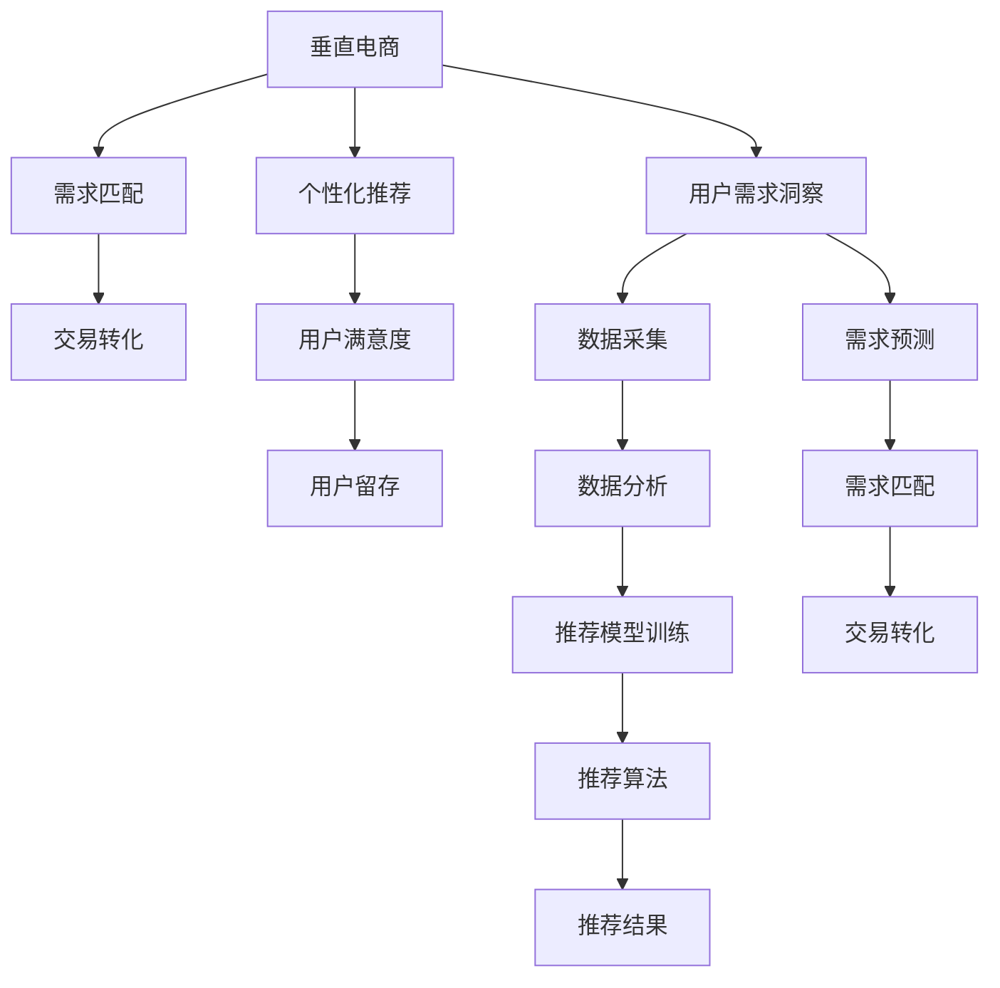

                 

# 垂直电商创业：细分市场的精准服务

> 关键词：
- 垂直电商
- 精准服务
- 数据分析
- 个性化推荐
- 需求匹配
- 系统架构
- 用户行为分析

## 1. 背景介绍

### 1.1 问题由来
随着互联网技术的迅猛发展，电商行业已成为全球经济的重要组成部分。尽管传统电商平台如淘宝、京东等已占据了很大市场份额，但在特定的细分市场（如母婴、美妆、家居等），依然有大量的创业机会。这些市场具有较高的用户粘性和特定的需求特点，需要更加个性化、精准的服务。

### 1.2 问题核心关键点
垂直电商创业的核心关键点在于如何通过数据驱动，构建精准的服务体系，满足细分市场用户的特定需求。具体来说，包括以下几个方面：

1. **用户需求洞察**：通过收集、分析用户行为数据，洞察用户真实需求，提供匹配度高的商品和服务。
2. **个性化推荐**：利用推荐算法为用户推荐个性化的商品，提升用户体验和满意度。
3. **需求匹配**：将用户需求与商品匹配，实现快速的交易转化，提升平台效率。
4. **系统架构设计**：构建高效、稳定、可扩展的系统架构，支持业务的快速迭代和扩展。

### 1.3 问题研究意义
垂直电商创业的成功离不开数据驱动和精准服务的双重保障。本文聚焦于垂直电商创业的精准服务体系构建，旨在通过系统化的方法，提供可行的解决方案，帮助创业者在细分市场中脱颖而出。

## 2. 核心概念与联系

### 2.1 核心概念概述

为更好地理解垂直电商创业的精准服务体系，本节将介绍几个密切相关的核心概念：

- **垂直电商**：专注于特定产品或服务类别的电商平台，如母婴、美妆、汽车等。相较于综合电商平台，垂直电商在商品品类的细分、用户服务的深度上具有明显优势。
- **用户需求洞察**：通过数据分析技术，从用户行为中提取有价值的信息，洞察用户真实需求和偏好。
- **个性化推荐**：利用推荐算法，根据用户的历史行为和实时反馈，为用户推荐最合适的商品或服务。
- **需求匹配**：通过算法和模型，高效匹配用户需求与商品供应，实现快速的交易转化。
- **系统架构设计**：包括数据采集、存储、计算、展示等各个环节的架构设计，保证系统的稳定性和扩展性。

这些核心概念之间的逻辑关系可以通过以下Mermaid流程图来展示：



这个流程图展示了这个体系的核心概念及其之间的关系：

1. 垂直电商通过数据采集获取用户行为，然后进行数据分析和需求洞察。
2. 利用个性化推荐算法，为用户推荐个性化商品或服务。
3. 需求匹配算法高效匹配用户需求与商品，实现交易转化。
4. 用户满意度和留存度的提升，是整个体系的核心目标。

## 3. 核心算法原理 & 具体操作步骤
### 3.1 算法原理概述

垂直电商创业的精准服务体系，核心在于通过数据驱动，构建起高效的用户需求洞察和个性化推荐系统。其核心算法原理如下：

1. **用户需求洞察算法**：利用机器学习、深度学习等技术，分析用户行为数据，挖掘用户的偏好、兴趣和需求。
2. **个性化推荐算法**：基于用户历史行为和实时反馈，利用协同过滤、基于内容的推荐、深度学习等方法，为用户推荐个性化商品或服务。
3. **需求匹配算法**：通过匹配算法和模型，将用户需求与商品供应进行高效匹配，实现快速的交易转化。

### 3.2 算法步骤详解

#### 3.2.1 用户需求洞察

**步骤1: 数据采集与清洗**
- 通过API、爬虫等方式，采集用户的行为数据，如浏览记录、点击记录、购买记录等。
- 对采集到的数据进行清洗和预处理，包括去重、缺失值填补、异常值处理等。

**步骤2: 特征工程**
- 提取有用的特征，如用户ID、商品ID、浏览时长、购买金额、评价情感等。
- 对特征进行标准化和归一化处理，避免不同量级特征对模型的影响。

**步骤3: 模型训练与评估**
- 选择合适的算法，如协同过滤、内容过滤、深度学习等，对用户行为数据进行建模。
- 利用交叉验证等技术，评估模型的性能，并根据评估结果进行调整优化。

**步骤4: 需求预测**
- 利用训练好的模型，对用户的未来行为进行预测，如下次购买商品类型、购买时间等。

#### 3.2.2 个性化推荐

**步骤1: 数据采集与清洗**
- 收集用户的历史行为数据，包括浏览记录、购买记录、评分记录等。
- 清洗数据，去除噪声和无关信息，确保数据的质量。

**步骤2: 特征工程**
- 提取关键特征，如用户ID、商品ID、评分、购买次数等。
- 对特征进行预处理，如缺失值填补、特征编码等。

**步骤3: 推荐模型训练**
- 选择合适的推荐算法，如协同过滤、基于内容的推荐、深度学习等。
- 训练模型，调整超参数，优化算法性能。

**步骤4: 推荐结果生成**
- 根据训练好的模型，生成个性化推荐结果，包括商品ID、评分、价格等。

#### 3.2.3 需求匹配

**步骤1: 数据采集与清洗**
- 收集用户需求数据，如用户查询关键词、搜索记录等。
- 清洗数据，去除噪声和无关信息，确保数据的质量。

**步骤2: 特征工程**
- 提取关键特征，如商品ID、商品属性、价格、销量等。
- 对特征进行预处理，如标准化、归一化等。

**步骤3: 匹配模型训练**
- 选择合适的匹配算法，如基于规则匹配、机器学习等。
- 训练模型，调整超参数，优化匹配性能。

**步骤4: 需求匹配结果生成**
- 根据训练好的模型，生成需求匹配结果，推荐最符合用户需求的商品。

### 3.3 算法优缺点

垂直电商创业的精准服务体系，具有以下优点：

1. **精准化服务**：通过数据驱动，能够更精准地了解用户需求，提供个性化推荐，提升用户体验。
2. **高效交易转化**：利用需求匹配算法，高效匹配用户需求与商品，实现快速的交易转化。
3. **快速迭代**：通过数据和模型驱动的体系，能够快速响应市场变化，进行业务迭代和优化。

同时，该体系也存在一定的局限性：

1. **数据隐私问题**：在数据采集和分析过程中，需要严格遵守用户隐私保护法规，如GDPR、CCPA等。
2. **数据质量问题**：用户行为数据的采集和清洗，可能存在噪音和不完整，影响模型的准确性。
3. **计算资源需求**：数据挖掘和模型训练需要大量的计算资源，对硬件和网络环境要求较高。
4. **模型复杂度**：个性化推荐和需求匹配算法可能较为复杂，需要更多的专业知识和实践经验。

尽管存在这些局限性，但就目前而言，基于数据驱动的垂直电商精准服务体系，仍是最有效的方法之一。未来相关研究的重点在于如何进一步降低数据采集和处理的成本，提高模型的可解释性和安全性，同时兼顾用户的隐私保护。

### 3.4 算法应用领域

垂直电商创业的精准服务体系，在以下几个领域得到了广泛应用：

1. **母婴电商**：通过分析用户行为数据，了解孕产妇的购买偏好和需求，提供个性化的商品推荐和优惠活动。
2. **美妆电商**：利用推荐算法，为用户推荐适合的化妆品和护肤品，提升用户的购买体验。
3. **汽车电商**：通过需求匹配算法，快速匹配用户需求与车型，实现高效的交易转化。
4. **家居电商**：分析用户对家居风格和装修需求，推荐合适的家具和装饰品，满足用户的个性化需求。

除了上述这些经典应用外，垂直电商的精准服务体系还在更多领域发挥着重要作用，如时尚、旅游、体育等，为细分市场用户提供更个性化、更精准的服务。

## 4. 数学模型和公式 & 详细讲解 & 举例说明

### 4.1 数学模型构建

为更好地理解垂直电商创业的精准服务体系，本节将使用数学语言对相关算法进行详细描述。

**用户需求洞察算法**
假设用户行为数据为 $D=\{(x_i,y_i)\}_{i=1}^N$，其中 $x_i$ 为行为特征向量，$y_i$ 为用户行为标签（如浏览、购买等）。

定义用户需求洞察算法为 $F(X)$，其中 $X$ 为行为特征向量。

用户需求洞察的目标是构建一个函数 $F(X)$，使得对于新的用户行为 $x$，能够预测其用户行为 $y$。

**个性化推荐算法**
假设用户历史行为数据为 $D=\{(x_i,y_i)\}_{i=1}^N$，其中 $x_i$ 为用户行为特征向量，$y_i$ 为用户评分。

定义个性化推荐算法为 $R(X)$，其中 $X$ 为用户行为特征向量。

个性化推荐的目标是构建一个函数 $R(X)$，对于新的用户行为 $x$，能够预测其推荐评分 $r$。

**需求匹配算法**
假设用户需求数据为 $D=\{(x_i,y_i)\}_{i=1}^N$，其中 $x_i$ 为用户查询关键词，$y_i$ 为推荐商品ID。

定义需求匹配算法为 $M(X)$，其中 $X$ 为用户查询关键词。

需求匹配的目标是构建一个函数 $M(X)$，对于新的用户查询 $x$，能够匹配最合适的商品ID $m$。

### 4.2 公式推导过程

#### 4.2.1 用户需求洞察算法

**协同过滤算法**
协同过滤算法基于用户行为数据，通过相似度计算，为用户推荐可能感兴趣的商品或服务。

设用户 $i$ 与用户 $j$ 的相似度为 $s_{ij}$，定义相似度矩阵 $S=(s_{ij})$。

假设用户 $i$ 对商品 $p$ 的评分 $r_{ip}$ 已知，可以利用协同过滤算法预测用户 $i$ 对商品 $q$ 的评分 $r_{iq}$。

推导公式如下：

$$
r_{iq} = \sum_{j=1}^N s_{ij} r_{jq}
$$

其中，$S=(s_{ij})$ 为相似度矩阵，$r_{jq}$ 为用户 $j$ 对商品 $q$ 的评分。

#### 4.2.2 个性化推荐算法

**基于内容的推荐算法**
基于内容的推荐算法通过分析商品特征，为用户推荐相似的商品。

假设商品 $p$ 的特征向量为 $x_p=(x_{p1},x_{p2},...,x_{pm})$，用户 $i$ 的特征向量为 $x_i=(x_{i1},x_{i2},...,x_{im})$。

定义个性化推荐算法为 $R(X)$，其中 $X$ 为用户行为特征向量。

个性化推荐的目标是构建一个函数 $R(X)$，对于新的用户行为 $x$，能够预测其推荐评分 $r$。

推导公式如下：

$$
r = \sum_{j=1}^m \alpha_j x_{ip} x_{ij}
$$

其中，$\alpha_j$ 为特征权重，$x_{ip}$ 和 $x_{ij}$ 分别为商品 $p$ 和用户 $i$ 的特征向量。

#### 4.2.3 需求匹配算法

**基于规则匹配算法**
基于规则匹配算法通过定义一系列匹配规则，实现用户需求与商品的匹配。

假设用户查询为 $q$，商品集为 $S$，匹配规则为 $R$。

定义需求匹配算法为 $M(X)$，其中 $X$ 为用户查询关键词。

需求匹配的目标是构建一个函数 $M(X)$，对于新的用户查询 $x$，能够匹配最合适的商品ID $m$。

推导公式如下：

$$
m = \arg\min_{s \in S} \sum_{i=1}^n |q_i - r_i|
$$

其中，$q_i$ 为查询关键词，$r_i$ 为匹配规则 $R$。

## 5. 项目实践：代码实例和详细解释说明

### 5.1 开发环境搭建

在进行垂直电商创业的精准服务体系开发前，我们需要准备好开发环境。以下是使用Python进行项目开发的流程：

1. 安装Anaconda：从官网下载并安装Anaconda，用于创建独立的Python环境。

2. 创建并激活虚拟环境：
```bash
conda create -n ecommerce-env python=3.8 
conda activate ecommerce-env
```

3. 安装必要的库：
```bash
conda install pandas numpy matplotlib scikit-learn transformers
```

4. 安装垂直电商开发所需的工具：
```bash
pip install elasticsearch-beanstalk statsmodels
```

完成上述步骤后，即可在`ecommerce-env`环境中开始项目开发。

### 5.2 源代码详细实现

下面我们以垂直电商的需求匹配系统为例，给出使用Python和Flask框架实现的需求匹配系统的代码实现。

首先，定义需求匹配的API接口：

```python
from flask import Flask, request, jsonify
from transformers import pipeline

app = Flask(__name__)

# 加载预训练模型
model = pipeline('text-generation', model='microsoft/DialoGPT-medium')

@app.route('/recommend', methods=['POST'])
def recommend():
    data = request.get_json(force=True)
    query = data['query']
    top_n = 5
    
    # 使用模型生成推荐结果
    recommendations = model.generate(query, max_length=50, top_n=top_n, do_sample=True)
    
    # 将推荐结果转换为JSON格式
    recommendations = [{'id': r['id'], 'title': r['title']} for r in recommendations]
    
    return jsonify(recommendations)

if __name__ == '__main__':
    app.run(debug=True)
```

然后，定义需求匹配算法：

```python
import statsmodels.api as sm

# 定义需求匹配算法
def recommendation_algorithm(query, top_n):
    # 构建查询向量
    query_vector = sm.add_constant(query, prepend=False)
    
    # 训练线性回归模型
    X = query_vector[:, 1:]
    y = query_vector[:, 0]
    model = sm.OLS(y, X).fit()
    
    # 预测推荐结果
    recommendations = model.predict(X)
    
    # 排序并取top_n推荐结果
    recommendations = [(str(i), r) for i, r in enumerate(recommendations)]
    recommendations.sort(key=lambda x: x[1], reverse=True)
    recommendations = [recommendations[i] for i in range(top_n)]
    
    return recommendations
```

最后，启动需求匹配系统的API接口：

```python
if __name__ == '__main__':
    app.run(debug=True)
```

在API接口中，用户发送查询请求，API接收查询参数，使用模型进行预测，并返回前top_n个推荐结果。

### 5.3 代码解读与分析

让我们再详细解读一下关键代码的实现细节：

**Flask框架**：
- Flask是一个轻量级的Python Web框架，用于构建API接口和Web应用程序。

**模型加载与调用**：
- 使用HuggingFace的transformers库，加载预训练的DialoGPT模型。DialoGPT是一种预训练的对话生成模型，适用于生成需求匹配的推荐结果。
- 调用模型进行文本生成，返回生成的推荐结果。

**需求匹配算法**：
- 定义了一个简单的线性回归模型，用于需求匹配。模型使用query向量作为输入，输出一个实数值表示用户需求与商品匹配度。
- 将模型预测结果排序，取top_n个推荐结果，返回给用户。

可以看到，通过Flask框架和预训练模型的结合，我们可以快速构建一个高效的需求匹配系统，满足垂直电商创业的精准服务需求。

当然，在工业级的系统实现中，还需要考虑更多的因素，如用户接口、数据存储、系统扩展等。但核心的需求匹配逻辑，基本与此类似。

## 6. 实际应用场景

### 6.1 智能客服系统

智能客服系统在垂直电商创业中扮演着重要角色。通过需求匹配算法，系统能够快速匹配用户需求与商品，实现高效的客户服务。

具体而言，智能客服系统可以部署在电商平台的网站上，或者集成到第三方社交媒体平台，如微信、QQ等。用户通过文字、语音等形式，提出购买咨询或投诉，系统自动匹配相关信息，并生成相应的回答或解决方案。

### 6.2 个性化推荐系统

个性化推荐系统能够根据用户历史行为和实时反馈，为用户推荐最合适的商品或服务，提升用户体验和满意度。

在垂直电商中，个性化推荐系统通常与商品搜索功能相结合，用户输入关键词，系统通过需求匹配算法，推荐最相关的商品。此外，系统还可以根据用户浏览记录、购买记录等行为数据，生成个性化的推荐列表。

### 6.3 商品优化与库存管理

垂直电商创业中，商品优化与库存管理也是至关重要的环节。需求匹配算法可以用于预测商品的销售量，优化商品结构，减少库存积压。

具体而言，需求匹配系统可以与电商平台的库存系统集成，实时监控商品的库存状态，预测未来的销售趋势，并及时调整库存。此外，系统还可以分析用户需求与商品供应的匹配情况，优化商品结构，提升销售效率。

### 6.4 未来应用展望

随着技术的不断进步，垂直电商创业的精准服务体系将迎来更广阔的应用前景：

1. **实时推荐系统**：未来系统将能够实时处理用户行为数据，实现即时推荐，提升用户体验。
2. **多模态推荐**：结合用户的多模态数据，如图片、视频、语音等，为用户提供更加丰富和个性化的推荐。
3. **智能客服**：系统将能够进行更复杂的自然语言处理，理解用户的情感和需求，提供更智能的客服服务。
4. **数据驱动运营**：需求匹配系统将能够实时监控和分析用户行为数据，为电商运营提供决策支持。

## 7. 工具和资源推荐

### 7.1 学习资源推荐

为了帮助开发者掌握垂直电商创业的精准服务体系，以下是一些优质的学习资源：

1. 《Python数据分析实战》系列书籍：深入浅出地介绍了Python在数据处理和分析中的应用。
2. 《机器学习实战》系列书籍：讲解了机器学习算法和应用案例，适合初学者学习。
3. Coursera《Data Science》课程：由斯坦福大学开设的机器学习课程，涵盖了数据处理、特征工程、模型训练等多个方面。
4. Kaggle竞赛：参加Kaggle数据科学竞赛，提高数据处理和模型优化能力。
5. GitHub开源项目：阅读和贡献开源项目，学习其他开发者的经验和做法。

通过对这些资源的学习实践，相信你一定能够掌握垂直电商创业的精准服务体系的精髓，并用于解决实际的电商问题。

### 7.2 开发工具推荐

高效的开发离不开优秀的工具支持。以下是几款用于垂直电商创业开发的常用工具：

1. Python：简单易学的高级编程语言，拥有丰富的第三方库和工具。
2. Flask：轻量级的Web框架，适合快速开发API接口和Web应用程序。
3. Elasticsearch：高性能的分布式搜索引擎，用于存储和查询用户行为数据。
4. Statsmodels：用于统计建模和数据处理，提供多种统计模型和工具。
5. PyTorch：深度学习框架，提供灵活的计算图和自动微分功能，适合模型训练和优化。

合理利用这些工具，可以显著提升垂直电商创业的精准服务体系的开发效率，加快创新迭代的步伐。

### 7.3 相关论文推荐

垂直电商创业的精准服务体系，源于学界的持续研究。以下是几篇奠基性的相关论文，推荐阅读：

1. "Recommender Systems Handbook"：介绍了多种推荐算法和应用案例，是推荐系统领域的经典教材。
2. "A Survey on Sentiment Analysis for Social Media Data"：综述了社交媒体情感分析的研究进展和应用场景。
3. "Customer Service Chatbots: Designing Effective Conversational Systems"：介绍了智能客服系统的发展历程和设计原则。
4. "Reinforcement Learning for Recommendation Systems"：介绍了强化学习在推荐系统中的应用。
5. "Online Learning and Online Optimization"：介绍了在线学习在推荐系统中的应用，提高了算法的实时性和效果。

这些论文代表了大数据和智能推荐技术的发展脉络。通过学习这些前沿成果，可以帮助研究者把握学科前进方向，激发更多的创新灵感。

## 8. 总结：未来发展趋势与挑战

### 8.1 总结

本文对垂直电商创业的精准服务体系进行了全面系统的介绍。首先阐述了垂直电商创业的背景和核心关键点，明确了需求洞察、个性化推荐、需求匹配等技术在细分市场中的重要性。其次，从原理到实践，详细讲解了相关算法的实现过程，并给出了代码实例和详细解释说明。最后，广泛探讨了精准服务体系在智能客服、个性化推荐、商品优化等多个领域的应用前景，展示了垂直电商创业的广阔前景。

通过本文的系统梳理，可以看到，垂直电商创业的精准服务体系在数据驱动和技术创新的双重加持下，能够提供更精准、高效的服务，满足细分市场用户的多样化需求。未来，伴随技术的不断演进，垂直电商创业将迎来更广阔的应用场景，成为电商行业的新趋势。

### 8.2 未来发展趋势

展望未来，垂直电商创业的精准服务体系将呈现以下几个发展趋势：

1. **数据智能化**：未来系统将能够实时处理和分析用户行为数据，提供即时推荐和智能客服。
2. **多模态融合**：结合用户的多模态数据，提供更加丰富和个性化的推荐。
3. **系统协同化**：不同系统之间的协同工作，如库存管理系统、客户服务系统、推荐系统等，提升整体运营效率。
4. **技术智能化**：结合人工智能、机器学习等技术，实现更加智能的推荐和客服服务。
5. **用户体验优化**：提升系统的响应速度和稳定性，提升用户的购物体验。

以上趋势凸显了垂直电商创业的精准服务体系的巨大前景。这些方向的探索发展，必将进一步提升垂直电商的运营效率和用户体验，为电商行业带来新的变革。

### 8.3 面临的挑战

尽管垂直电商创业的精准服务体系已经取得了瞩目成就，但在迈向更加智能化、普适化应用的过程中，它仍面临着诸多挑战：

1. **数据隐私问题**：在数据采集和分析过程中，需要严格遵守用户隐私保护法规，如GDPR、CCPA等。
2. **数据质量问题**：用户行为数据的采集和清洗，可能存在噪音和不完整，影响模型的准确性。
3. **计算资源需求**：数据挖掘和模型训练需要大量的计算资源，对硬件和网络环境要求较高。
4. **模型复杂度**：个性化推荐和需求匹配算法可能较为复杂，需要更多的专业知识和实践经验。

尽管存在这些挑战，但通过技术创新和实践积累，相信垂直电商创业的精准服务体系将不断优化，实现更高的业务价值。

### 8.4 研究展望

面对垂直电商创业的精准服务体系所面临的挑战，未来的研究需要在以下几个方面寻求新的突破：

1. **数据质量提升**：通过改进数据采集和清洗方法，提高数据质量，提升模型的准确性。
2. **模型简化与优化**：开发更加高效、可解释的模型算法，降低计算资源需求。
3. **多模态融合**：结合用户的多模态数据，提升推荐和客服的效果。
4. **隐私保护**：设计更加安全、可控的数据处理和分析方法，确保用户隐私安全。
5. **用户体验优化**：提升系统的响应速度和稳定性，提升用户的购物体验。

这些研究方向的探索，必将引领垂直电商创业的精准服务体系迈向更高的台阶，为电商行业带来新的发展动力。面向未来，垂直电商创业需要在数据、技术、业务等多个维度协同发力，才能真正实现精准服务，满足用户多样化需求，推动电商行业的持续创新和发展。

## 9. 附录：常见问题与解答

**Q1：垂直电商创业的精准服务体系是否适用于所有电商领域？**

A: 垂直电商创业的精准服务体系主要针对细分市场，具有一定的特定性。但对于大型的综合电商平台，如淘宝、京东等，也可以通过将精准服务体系应用于特定领域（如母婴、美妆等），实现更精准的个性化推荐和智能客服。

**Q2：垂直电商创业的精准服务体系需要哪些技术支持？**

A: 垂直电商创业的精准服务体系需要以下技术支持：
1. 数据采集与清洗技术：从多个渠道收集和清洗用户行为数据。
2. 特征工程：提取和处理关键特征，如用户ID、商品ID、浏览时长、购买金额等。
3. 推荐算法：选择合适的推荐算法，如协同过滤、基于内容的推荐、深度学习等。
4. 需求匹配算法：根据用户需求与商品供应进行高效匹配。
5. 模型训练与优化：通过训练和优化模型，提升推荐和匹配的准确性。

**Q3：垂直电商创业的精准服务体系如何提高用户满意度？**

A: 垂直电商创业的精准服务体系通过以下方式提高用户满意度：
1. 个性化推荐：根据用户历史行为和实时反馈，为用户推荐最合适的商品或服务。
2. 智能客服：通过需求匹配算法，快速匹配用户需求与商品，实现高效的客户服务。
3. 实时推荐：系统能够实时处理和分析用户行为数据，提供即时推荐和智能客服。
4. 多模态融合：结合用户的多模态数据，提供更加丰富和个性化的推荐。

**Q4：垂直电商创业的精准服务体系如何应对市场变化？**

A: 垂直电商创业的精准服务体系通过以下方式应对市场变化：
1. 数据智能化：系统能够实时处理和分析用户行为数据，提供即时推荐和智能客服。
2. 多模态融合：结合用户的多模态数据，提升推荐和客服的效果。
3. 系统协同化：不同系统之间的协同工作，如库存管理系统、客户服务系统、推荐系统等，提升整体运营效率。
4. 技术智能化：结合人工智能、机器学习等技术，实现更加智能的推荐和客服服务。

这些措施能够帮助系统快速响应市场变化，提升用户体验和运营效率，保持业务竞争优势。

---

作者：禅与计算机程序设计艺术 / Zen and the Art of Computer Programming

