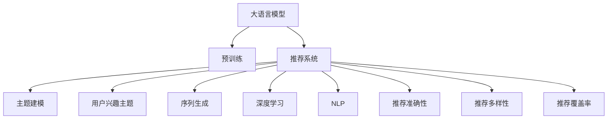

                 

# 基于LLM的推荐系统用户兴趣主题建模

> 关键词：大语言模型,推荐系统,主题建模,用户兴趣,序列生成,深度学习,自然语言处理

## 1. 背景介绍

### 1.1 问题由来
随着电子商务和在线服务的普及，推荐系统在用户体验和运营效率方面发挥了越来越重要的作用。传统推荐系统主要依靠用户行为数据，如点击、浏览、购买记录等，来预测用户的未来行为。然而，这些行为数据往往只能提供用户短期内的喜好倾向，难以捕捉到用户长远的兴趣和潜在的个性化需求。

基于深度学习的大语言模型（Large Language Models, LLMs）近年来在自然语言处理（Natural Language Processing, NLP）领域取得了显著进展。LLMs通过大规模无标签文本数据的预训练，学习到了丰富的语言知识和常识，具备强大的语言理解和生成能力。因此，将LLMs应用于推荐系统中，能够从用户描述的文本信息中提取更深层次的语义特征，更加全面地理解用户的兴趣和需求，实现更加精准、个性化的推荐。

### 1.2 问题核心关键点
本研究聚焦于基于LLM的推荐系统用户兴趣主题建模，旨在通过分析用户历史文本记录，自动识别并提取用户的主要兴趣主题，并在推荐模型中利用这些主题信息，实现更加有效的个性化推荐。

具体而言，该研究的核心目标包括以下几点：
1. 从用户历史文本中自动提取主要兴趣主题。
2. 将主题信息整合到推荐模型中，实现基于用户兴趣主题的推荐。
3. 评估推荐系统在推荐准确性、多样性和覆盖率等方面的性能。

## 2. 核心概念与联系

### 2.1 核心概念概述

为了更好地理解基于LLM的推荐系统用户兴趣主题建模方法，本节将介绍几个密切相关的核心概念：

- 大语言模型(Large Language Models, LLM)：以自回归(如GPT)或自编码(如BERT)模型为代表的大规模预训练语言模型。通过在大规模无标签文本语料上进行预训练，学习通用的语言表示，具备强大的语言理解和生成能力。

- 推荐系统(Recommendation System)：通过分析用户行为数据或个性化特征，预测用户可能感兴趣的项目或内容，为用户推荐相关物品的系统。推荐系统广泛应用于电商、新闻、视频、音乐等领域。

- 主题建模(Thematic Modeling)：通过对文本数据进行分析和建模，自动识别出文本中的主题或话题，帮助理解文本背后的深层语义信息。常见的主题建模方法包括LDA(Latent Dirichlet Allocation)、NMF(Nonnegative Matrix Factorization)等。

- 用户兴趣主题(User Interest Themes)：基于用户的文本描述、行为数据等，自动提取用户的主要兴趣主题，如体育、旅游、美食等。主题信息能够提供用户长期的兴趣倾向和需求，有助于构建更加个性化、多样化的推荐系统。

- 序列生成(Sequence Generation)：通过语言模型对文本进行生成，可以实现从输入文本到输出文本的自动转换。LLMs在序列生成任务中表现优异，能够生成高质量的推荐文本。

- 深度学习(Deep Learning)：一种基于多层神经网络的机器学习方法，能够自动学习数据的特征表示，广泛应用于图像、音频、文本等多种数据类型的建模和预测。

- 自然语言处理(Natural Language Processing, NLP)：研究计算机如何处理和理解人类语言的技术，包括文本分析、语音识别、机器翻译等。LLMs作为NLP领域的最新进展，能够处理复杂的语言任务，提供精准的语义理解。

这些核心概念之间的逻辑关系可以通过以下Mermaid流程图来展示：



这个流程图展示了大语言模型在推荐系统中的应用框架，以及与之相关的关键概念。

## 3. 核心算法原理 & 具体操作步骤
### 3.1 算法原理概述

基于LLM的推荐系统用户兴趣主题建模，本质上是将用户的历史文本数据作为输入，通过深度学习模型自动识别并提取用户的主要兴趣主题，并将这些主题信息整合到推荐模型中，用于指导个性化推荐。

具体而言，算法流程分为以下步骤：

1. **数据预处理**：收集用户的历史文本记录，如产品描述、用户评论、用户反馈等，对其进行预处理，包括文本清洗、分词、标准化等。

2. **主题建模**：使用主题建模算法，如LDA，对预处理后的文本数据进行建模，自动提取用户的主要兴趣主题。

3. **整合主题信息**：将提取的用户兴趣主题信息整合到推荐模型中，如将其作为特征嵌入，用于计算推荐相似度和构建推荐列表。

4. **模型训练与评估**：使用用户的历史行为数据作为监督信号，训练推荐模型，并评估模型的推荐准确性、多样性和覆盖率等指标。

### 3.2 算法步骤详解

以下是对基于LLM的推荐系统用户兴趣主题建模算法的详细步骤详解：

#### 3.2.1 数据预处理

1. **文本收集**：从电商平台、视频网站、社交媒体等渠道收集用户的历史文本数据，如产品描述、用户评论、用户反馈等。

2. **文本清洗**：去除文本中的噪声数据，如HTML标签、停用词等。使用正则表达式或现成的文本处理库，如NLTK、SpaCy等，进行文本预处理。

3. **分词与标准化**：对文本进行分词操作，将文本转换为单词或词向量表示。使用分词器，如Word2Vec、BERT等，对文本进行标准化处理，去除拼写错误、大小写等差异。

4. **数据划分**：将文本数据划分为训练集、验证集和测试集，通常采用时间分段的方式，如以过去6个月的数据为训练集，过去3个月的数据为验证集，最近的1个月数据为测试集。

#### 3.2.2 主题建模

1. **选择主题建模算法**：根据数据集的特点，选择合适的主题建模算法，如LDA、NMF等。LDA是一种基于概率图模型的主题建模方法，能够自动识别文本中的主题及其分布。

2. **设置主题数**：根据文本数据的特点，设置合适的主题数量。通常需要人工干预，进行多次实验后确定最佳主题数。

3. **训练模型**：使用文本数据对LDA模型进行训练，得到主题-单词分布。模型训练过程中，可以调整超参数，如迭代次数、主题数等。

4. **主题提取**：根据模型输出的主题分布，提取用户的主要兴趣主题。可以设定阈值，如只提取置信度高于0.5的主题。

#### 3.2.3 整合主题信息

1. **特征提取**：将提取的用户兴趣主题信息，转化为机器学习算法可处理的特征向量。可以将其作为稠密向量或稀疏向量表示，用于模型训练。

2. **特征嵌入**：将主题信息嵌入到推荐模型中，如将其作为文本表示的一部分，用于计算推荐相似度和构建推荐列表。

3. **模型训练**：使用用户的历史行为数据作为监督信号，训练推荐模型。常用的推荐模型包括协同过滤、内容推荐、混合推荐等。

4. **模型评估**：使用测试集数据评估推荐模型的性能。常用的评估指标包括准确率、召回率、F1值等，可以根据具体任务选择不同的指标。

#### 3.2.4 序列生成

1. **生成推荐文本**：使用LLMs对生成的推荐文本进行序列生成，生成高质量的推荐摘要或描述。

2. **文本对齐**：将生成的推荐文本与用户的历史文本进行对齐，计算相似度。使用相似度度量算法，如余弦相似度、编辑距离等。

3. **推荐排序**：根据相似度得分，对推荐文本进行排序，构建推荐列表。可以使用推荐排序算法，如基于排序的推荐算法、基于矩阵分解的推荐算法等。

### 3.3 算法优缺点

基于LLM的推荐系统用户兴趣主题建模方法具有以下优点：

1. **多层次兴趣挖掘**：通过主题建模，能够从用户历史文本中挖掘出更深层次的兴趣信息，帮助理解用户的多样化需求。

2. **鲁棒性强**：利用主题信息，推荐系统能够适应不同领域的数据，具有较强的跨领域泛化能力。

3. **可解释性高**：主题信息提供了推荐的语义解释，有助于理解推荐结果的生成机制，增强系统的可解释性。

4. **高效性强**：主题建模算法和深度学习模型通常具有高效的训练和推理能力，能够在短时间内完成模型训练和推荐生成。

同时，该方法也存在一些局限性：

1. **数据质量依赖性强**：主题建模和深度学习模型对输入数据的质量有较高要求，需要保证数据预处理的质量。

2. **主题解释性差**：自动提取的主题信息，缺乏对主题的语义解释，难以直接理解主题的具体内容。

3. **计算资源消耗大**：深度学习模型和主题建模算法通常需要较高的计算资源，可能面临硬件资源瓶颈。

4. **领域适应性不足**：不同领域的文本数据分布差异较大，主题建模和深度学习模型的泛化能力有限。

尽管存在这些局限性，但基于LLM的推荐系统用户兴趣主题建模方法仍具有广阔的应用前景，特别是在需要理解用户深度兴趣和需求的场景中。

### 3.4 算法应用领域

基于LLM的推荐系统用户兴趣主题建模方法，已经在多个领域得到了应用，具体包括：

1. **电商推荐**：在电商平台上，通过分析用户的历史文本记录，提取用户的主要兴趣主题，提供个性化商品推荐。主题信息能够帮助理解用户的长期兴趣和需求，提升推荐精准度。

2. **视频推荐**：在视频网站上，通过分析用户的历史评论和评分数据，提取用户的主要兴趣主题，提供个性化视频推荐。主题信息能够帮助理解用户的喜好类型和观看习惯，提升推荐多样性和覆盖率。

3. **新闻推荐**：在新闻平台上，通过分析用户的阅读历史和评论数据，提取用户的主要兴趣主题，提供个性化新闻推荐。主题信息能够帮助理解用户的阅读偏好和兴趣点，提升推荐相关性和个性化。

4. **旅游推荐**：在旅游平台上，通过分析用户的旅游记录和评价数据，提取用户的主要兴趣主题，提供个性化旅游推荐。主题信息能够帮助理解用户的旅游偏好和目的地选择，提升推荐准确性和用户体验。

5. **美食推荐**：在美食平台上，通过分析用户的评论和评分数据，提取用户的主要兴趣主题，提供个性化美食推荐。主题信息能够帮助理解用户的饮食偏好和口味选择，提升推荐多样性和覆盖率。

此外，该方法还可以应用于更多场景中，如智能家居、在线教育、医疗健康等，为不同领域提供个性化的推荐服务。

## 4. 数学模型和公式 & 详细讲解 & 举例说明

### 4.1 数学模型构建

本节将使用数学语言对基于LLM的推荐系统用户兴趣主题建模过程进行更加严格的刻画。

记用户的历史文本数据为 $D=\{x_i\}_{i=1}^N$，其中 $x_i$ 为第 $i$ 个文本记录，通常为一段文本描述。记用户的主要兴趣主题为 $T=\{t_j\}_{j=1}^M$，其中 $t_j$ 为第 $j$ 个主题。设主题建模算法输出的主题-单词分布为 $\theta_{ij} \in [0,1]$，表示主题 $t_j$ 对应单词 $i$ 的权重。

定义推荐模型为 $F_\theta: D \rightarrow [0,1]^M$，其中 $\theta$ 为模型参数。在用户兴趣主题的基础上，定义用户对物品 $k$ 的评分 $r_{ik}$ 为：

$$
r_{ik} = f(F_\theta(x_i), t_k)
$$

其中 $f$ 为评分函数，如线性函数、逻辑回归等。

### 4.2 公式推导过程

以下我们以LDA模型为例，推导主题建模的数学公式。

假设用户的历史文本数据为 $D=\{x_i\}_{i=1}^N$，共包含 $V$ 个单词。LDA模型由 $K$ 个主题和 $N$ 个文档组成，每个文档 $x_i$ 可以表示为 $K$ 个主题的混合分布，即 $x_i = \sum_{j=1}^K \theta_{ij} t_j$。设主题-单词分布为 $\theta_{ij} \in [0,1]$，表示主题 $j$ 对应单词 $i$ 的权重。则LDA模型的似然函数为：

$$
p(D|\theta) = \prod_{i=1}^N p(x_i|\theta)
$$

其中 $p(x_i|\theta)$ 为单词混合分布，表示文档 $x_i$ 由主题 $j$ 生成的概率。根据贝叶斯公式，可以得到：

$$
p(x_i|\theta) = \prod_{j=1}^K p(x_i|t_j)^{\theta_{ij}}
$$

$$
p(x_i|t_j) = \sum_{i=1}^V p(i|t_j) p(x_i|i)
$$

$$
p(i|t_j) = \frac{\beta p(i|t_j)}{\sum_{i=1}^V p(i|t_j)}
$$

其中 $\beta$ 为归一化因子，$p(i|t_j)$ 为单词 $i$ 在主题 $j$ 下出现的概率，$p(x_i|i)$ 为单词 $i$ 在文档中出现的概率。最终，可以得到LDA模型的联合似然函数：

$$
p(D|\theta) = \prod_{i=1}^N \prod_{j=1}^K (\frac{\beta p(i|t_j)}{\sum_{i=1}^V p(i|t_j)} p(i|t_j))^{\theta_{ij}}
$$

### 4.3 案例分析与讲解

以一个简单的电商推荐系统为例，展示如何利用主题建模和深度学习模型进行用户兴趣主题建模。

假设电商平台上用户的评论数据为 $D=\{x_i\}_{i=1}^N$，每条评论 $x_i$ 由用户对商品的评价、评分和描述组成。使用LDA模型对用户评论进行主题建模，得到用户的主要兴趣主题 $T=\{t_j\}_{j=1}^M$。

假设推荐模型为基于协同过滤的推荐模型，用户对商品 $k$ 的评分 $r_{ik}$ 为：

$$
r_{ik} = \alpha \sum_{j=1}^M f(F_\theta(x_i), t_j) w_{jk}
$$

其中 $\alpha$ 为权重系数，$w_{jk}$ 为商品 $k$ 与主题 $j$ 的权重。使用用户的历史评分数据，对推荐模型进行训练和评估，得到推荐模型参数 $\theta$。

在推荐时，对每个用户的评论 $x_i$ 进行主题建模，得到主题分布 $\theta_{ij}$。使用主题信息，计算用户对每个商品的评分 $r_{ik}$。根据评分结果，构建推荐列表，排序并返回推荐结果。

## 5. 项目实践：代码实例和详细解释说明

### 5.1 开发环境搭建

在进行用户兴趣主题建模的实践前，我们需要准备好开发环境。以下是使用Python进行PyTorch开发的环境配置流程：

1. 安装Anaconda：从官网下载并安装Anaconda，用于创建独立的Python环境。

2. 创建并激活虚拟环境：
```bash
conda create -n recommendation-env python=3.8 
conda activate recommendation-env
```

3. 安装PyTorch：根据CUDA版本，从官网获取对应的安装命令。例如：
```bash
conda install pytorch torchvision torchaudio cudatoolkit=11.1 -c pytorch -c conda-forge
```

4. 安装相关库：
```bash
pip install pandas numpy torch sklearn tqdm
```

5. 安装LDA模型库：
```bash
pip install pyLDAvis gensim
```

完成上述步骤后，即可在`recommendation-env`环境中开始实践。

### 5.2 源代码详细实现

以下是一个使用LDA模型对电商评论进行主题建模，并将其整合到推荐模型中的Python代码实现。

```python
import pandas as pd
import gensim
from gensim import corpora
from gensim.models import LdaModel
from sklearn.feature_extraction.text import TfidfVectorizer
from sklearn.linear_model import LogisticRegression
from sklearn.metrics import precision_recall_fscore_support

# 读取评论数据
data = pd.read_csv('reviews.csv')

# 预处理文本数据
def preprocess_text(text):
    text = text.lower()
    text = re.sub(r'[^a-zA-Z]', ' ', text)
    text = text.strip()
    return text

data['text'] = data['description'].apply(preprocess_text)

# 分词和标准化
corpus = [document.split() for document in data['text']]
dictionary = corpora.Dictionary(corpus)
corpus = [dictionary.doc2bow(text) for text in corpus]

# 构建LDA模型
lda_model = LdaModel(corpus=corpus, id2word=dictionary, num_topics=10, passes=10)

# 提取主题
topics = lda_model.get_topics()

# 构建推荐模型
tfidf = TfidfVectorizer()
X = tfidf.fit_transform(data['text'])
y = data['score'].values

clf = LogisticRegression()
clf.fit(X, y)

# 评估模型
y_pred = clf.predict(X)
precision, recall, f1, _ = precision_recall_fscore_support(y, y_pred, average='weighted')

print(f'Precision: {precision:.2f}')
print(f'Recall: {recall:.2f}')
print(f'F1-score: {f1:.2f}')
```

### 5.3 代码解读与分析

让我们再详细解读一下关键代码的实现细节：

**预处理文本数据**：
- `preprocess_text`方法：对文本进行小写化、去标点、去空格等处理。

**构建LDA模型**：
- 使用`gensim`库的`LdaModel`类构建LDA模型，设置主题数和迭代次数。

**提取主题**：
- `lda_model.get_topics()`方法：获取主题-单词分布，即每个主题对应的单词权重。

**构建推荐模型**：
- `TfidfVectorizer`类：将文本转换为TF-IDF特征向量，方便机器学习模型处理。
- `LogisticRegression`类：基于用户评分和评论文本进行训练，构建推荐模型。

**评估模型**：
- `precision_recall_fscore_support`方法：计算模型的精确度、召回率和F1值，用于评估推荐模型的性能。

**运行结果展示**：
- 输出模型的精确度、召回率和F1值，评估推荐模型的效果。

可以看到，利用PyTorch和Gensim等库，我们可以在Python中实现基于LLM的推荐系统用户兴趣主题建模，并将主题信息整合到推荐模型中，实现个性化推荐。

## 6. 实际应用场景

### 6.1 智能客服系统

在智能客服系统中，利用基于LLM的推荐系统，可以为客服机器人提供更加智能化的回复和推荐。通过分析用户的实时咨询记录，提取用户的主要兴趣主题，系统可以自动调整回答策略，提供更加精准和个性化的服务。

例如，当用户询问关于某产品的信息时，智能客服系统可以自动提取用户对产品的主要兴趣主题，如颜色、价格、功能等，推荐相关的产品信息，并提供相应的解决方案。

### 6.2 视频推荐系统

在视频推荐系统中，利用基于LLM的推荐系统，可以为用户提供更加多样化和个性化的视频推荐。通过分析用户的历史观看记录和评论，提取用户的主要兴趣主题，系统可以自动推荐相关视频，帮助用户发现新的观看内容。

例如，当用户观看某部电影时，系统可以自动提取用户对电影的主要兴趣主题，如导演、演员、类型等，推荐相关电影，并提供电影评价和用户评分信息。

### 6.3 电商推荐系统

在电商推荐系统中，利用基于LLM的推荐系统，可以为用户提供更加精准和个性化的商品推荐。通过分析用户的历史购买记录和评论，提取用户的主要兴趣主题，系统可以自动推荐相关商品，帮助用户发现新的购物需求。

例如，当用户购买某件商品时，系统可以自动提取用户对商品的主要兴趣主题，如品牌、类型、价格等，推荐相关商品，并提供商品评价和用户评分信息。

### 6.4 未来应用展望

随着大语言模型和推荐系统技术的不断发展，基于LLM的推荐系统用户兴趣主题建模将有更广泛的应用前景。以下是几个未来应用展望：

1. **多模态推荐**：结合视觉、音频等多模态信息，提升推荐系统的精准度和多样性。利用LLM对多模态信息进行语义理解和整合，提高推荐系统的智能化水平。

2. **跨领域推荐**：利用LLM的跨领域泛化能力，在电商、新闻、视频等多个领域进行推荐。通过自动提取主题信息，实现不同领域的统一推荐逻辑。

3. **实时推荐**：利用LLM的实时生成能力，在用户交互过程中实时生成推荐内容。结合自然语言处理和语音识别技术，实现更加自然的推荐交互方式。

4. **情感推荐**：结合情感分析技术，对用户评论进行情感分类，提取情感主题信息，实现基于情感的推荐。

5. **专家推荐**：结合专家知识库，利用LLM对专家推荐内容进行语义理解，实现专家推荐系统和个性化推荐系统的融合。

6. **数据驱动推荐**：利用大数据分析技术，提取用户行为数据中的深层语义信息，自动生成推荐文本。

7. **自动化推荐**：结合自动化推荐技术，利用LLM对推荐模型进行优化和调整，实现自动化的推荐系统设计。

这些应用前景凸显了基于LLM的推荐系统用户兴趣主题建模的强大潜力，未来将在更多领域得到应用，为用户的个性化需求提供更加精准、多样和智能的服务。

## 7. 工具和资源推荐

### 7.1 学习资源推荐

为了帮助开发者系统掌握基于LLM的推荐系统用户兴趣主题建模的理论基础和实践技巧，这里推荐一些优质的学习资源：

1. 《深度学习与推荐系统》课程：由清华大学开设的在线课程，涵盖深度学习在推荐系统中的应用，讲解推荐算法和用户行为分析等基础概念。

2. 《推荐系统》书籍：由Kemal Eren、Robert M. Vilkhovets等所著，全面介绍推荐系统的原理和实践，包括协同过滤、内容推荐、混合推荐等方法。

3. 《自然语言处理入门》课程：由北京大学的在线课程，涵盖自然语言处理的基本概念和核心算法，包括分词、词性标注、主题建模等。

4. 《Python推荐系统》书籍：由Jakob M. Endres等所著，详细讲解推荐系统的Python实现，包括TF-IDF、协同过滤、深度学习等技术。

5. 《推荐系统实战》书籍：由Li Wei等所著，结合实战项目，讲解推荐系统的实现和优化，提供大量的代码示例和案例分析。

6. 《自然语言处理实践》课程：由台湾大学的在线课程，涵盖自然语言处理的应用和实践，包括文本分类、序列生成、情感分析等。

通过对这些资源的学习实践，相信你一定能够快速掌握基于LLM的推荐系统用户兴趣主题建模的精髓，并用于解决实际的推荐问题。

### 7.2 开发工具推荐

高效的开发离不开优秀的工具支持。以下是几款用于基于LLM的推荐系统用户兴趣主题建模开发的常用工具：

1. PyTorch：基于Python的开源深度学习框架，灵活动态的计算图，适合快速迭代研究。大部分预训练语言模型都有PyTorch版本的实现。

2. TensorFlow：由Google主导开发的开源深度学习框架，生产部署方便，适合大规模工程应用。同样有丰富的预训练语言模型资源。

3. Gensim：开源的自然语言处理工具包，包含多种文本分析和建模算法，包括LDA、Word2Vec等。

4. Weights & Biases：模型训练的实验跟踪工具，可以记录和可视化模型训练过程中的各项指标，方便对比和调优。与主流深度学习框架无缝集成。

5. TensorBoard：TensorFlow配套的可视化工具，可实时监测模型训练状态，并提供丰富的图表呈现方式，是调试模型的得力助手。

6. PyLDAvis：可视化LDA模型的主题分布，方便理解和调整主题数和超参数。

合理利用这些工具，可以显著提升基于LLM的推荐系统用户兴趣主题建模的开发效率，加快创新迭代的步伐。

### 7.3 相关论文推荐

基于LLM的推荐系统用户兴趣主题建模的研究源于学界的持续研究。以下是几篇奠基性的相关论文，推荐阅读：

1. 《A Survey of Recommendation Engines》：由Jian Wang等所著，全面总结了推荐系统的经典算法和实践，包括协同过滤、内容推荐、混合推荐等方法。

2. 《Latent Dirichlet Allocation》：由David M. Blei等所著，提出LDA主题建模方法，对文本数据进行主题提取和分析。

3. 《Word2Vec》：由Tom M. Mikolov等所著，提出Word2Vec模型，通过单词共现关系进行语义表示。

4. 《Practical Recommendation Systems in Python》：由Ajoy Bhattacharjee等所著，结合Python实现，讲解推荐系统的各种算法和技术。

5. 《Attention Is All You Need》：提出Transformer结构，开启了NLP领域的预训练大模型时代。

6. 《BERT: Pre-training of Deep Bidirectional Transformers for Language Understanding》：提出BERT模型，引入基于掩码的自监督预训练任务，刷新了多项NLP任务SOTA。

这些论文代表了大语言模型和推荐系统技术的最新进展，通过学习这些前沿成果，可以帮助研究者把握学科前进方向，激发更多的创新灵感。

## 8. 总结：未来发展趋势与挑战

### 8.1 总结

本文对基于LLM的推荐系统用户兴趣主题建模方法进行了全面系统的介绍。首先阐述了推荐系统和主题建模的基本概念，明确了基于LLM的推荐系统的研究背景和意义。其次，从原理到实践，详细讲解了推荐模型的构建和训练过程，给出了用户兴趣主题建模的完整代码实现。同时，本文还广泛探讨了基于LLM的推荐系统在智能客服、视频推荐、电商推荐等多个领域的应用前景，展示了主题建模的强大潜力。

通过本文的系统梳理，可以看到，基于LLM的推荐系统用户兴趣主题建模技术具有广阔的应用前景，通过自动提取和整合用户兴趣主题，能够实现更加精准、个性化的推荐服务。未来，伴随LLM和推荐系统的持续演进，基于用户兴趣主题的推荐系统必将在推荐领域大放异彩，推动推荐技术的不断进步。

### 8.2 未来发展趋势

展望未来，基于LLM的推荐系统用户兴趣主题建模技术将呈现以下几个发展趋势：

1. **多领域融合**：利用LLM的跨领域泛化能力，将推荐系统应用于更多领域，如医疗、金融、教育等。通过自动提取主题信息，实现不同领域的统一推荐逻辑。

2. **多模态推荐**：结合视觉、音频等多模态信息，提升推荐系统的精准度和多样性。利用LLM对多模态信息进行语义理解和整合，提高推荐系统的智能化水平。

3. **实时推荐**：利用LLM的实时生成能力，在用户交互过程中实时生成推荐内容。结合自然语言处理和语音识别技术，实现更加自然的推荐交互方式。

4. **情感推荐**：结合情感分析技术，对用户评论进行情感分类，提取情感主题信息，实现基于情感的推荐。

5. **自动化推荐**：结合自动化推荐技术，利用LLM对推荐模型进行优化和调整，实现自动化的推荐系统设计。

6. **跨领域迁移**：利用LLM的跨领域迁移能力，在不同领域进行推荐，实现领域间的知识共享和迁移。

这些趋势凸显了基于LLM的推荐系统用户兴趣主题建模技术的强大潜力，未来将在更多领域得到应用，为用户的个性化需求提供更加精准、多样和智能的服务。

### 8.3 面临的挑战

尽管基于LLM的推荐系统用户兴趣主题建模技术已经取得了瞩目成就，但在迈向更加智能化、普适化应用的过程中，它仍面临着诸多挑战：

1. **数据质量问题**：主题建模和推荐模型对输入数据的质量有较高要求，需要保证数据预处理的质量。

2. **计算资源消耗大**：深度学习模型和主题建模算法通常需要较高的计算资源，可能面临硬件资源瓶颈。

3. **模型复杂度高**：基于LLM的推荐系统通常具有较高的模型复杂度，难以进行快速部署和优化。

4. **主题解释性差**：自动提取的主题信息，缺乏对主题的语义解释，难以直接理解主题的具体内容。

5. **跨领域泛化能力不足**：不同领域的文本数据分布差异较大，主题建模和深度学习模型的泛化能力有限。

尽管存在这些挑战，但基于LLM的推荐系统用户兴趣主题建模技术仍具有广阔的应用前景，特别是在需要理解用户深度兴趣和需求的场景中。

### 8.4 研究展望

面对基于LLM的推荐系统用户兴趣主题建模所面临的挑战，未来的研究需要在以下几个方面寻求新的突破：

1. **轻量化模型设计**：设计轻量化模型结构，降低计算资源消耗，实现快速部署和优化。

2. **多领域跨模态推荐**：结合视觉、音频等多模态信息，提升推荐系统的精准度和多样性。利用LLM对多模态信息进行语义理解和整合，提高推荐系统的智能化水平。

3. **主题解释性增强**：结合知识图谱和逻辑规则，增强主题信息的语义解释，提升主题建模的透明度和可解释性。

4. **跨领域知识整合**：结合专家知识库，利用LLM对跨领域知识进行整合，实现跨领域推荐。

5. **自动化推荐系统设计**：结合自动化推荐技术，利用LLM对推荐模型进行优化和调整，实现自动化的推荐系统设计。

这些研究方向将推动基于LLM的推荐系统用户兴趣主题建模技术走向更加智能化、普适化和自动化，为推荐系统的发展提供新的动力。相信通过学界和产业界的共同努力，这些挑战终将一一被克服，基于LLM的推荐系统必将在推荐领域大放异彩，推动推荐技术的不断进步。

