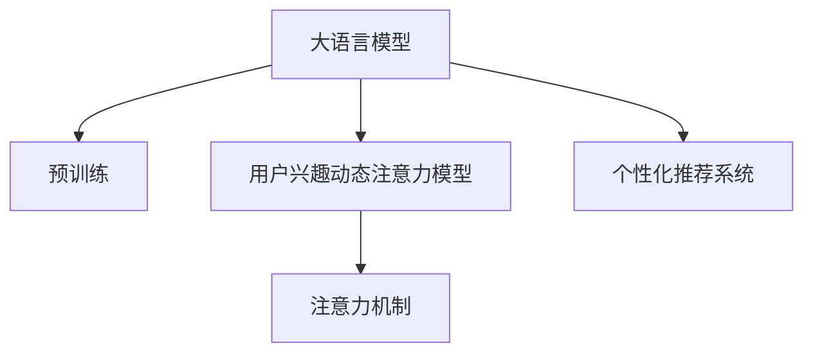

                 

# 基于LLM的用户兴趣动态注意力机制

## 1. 背景介绍

在深度学习时代，用户兴趣推荐成为了各种互联网应用的核心需求之一。传统推荐系统主要基于用户的显式行为数据，如点击、浏览、评分等，构建用户画像并进行个性化推荐。然而，这些行为数据往往滞后于用户的即时兴趣，难以捕捉用户的潜在需求。

近年来，基于大语言模型(Large Language Models, LLMs)的推荐系统得到了越来越多的关注。LLMs，如GPT-3、BERT等，通过在大规模文本语料上进行预训练，具备了强大的语言理解能力和语义表示能力。利用LLMs进行推荐，可以更自然地捕捉用户的即时兴趣，从而提供更为个性化和精准的推荐服务。

本文将探讨基于LLM的用户兴趣动态注意力机制，着重介绍LLMs如何通过动态调整注意力权重，更灵活地捕捉用户兴趣，提升推荐效果。通过构建用户兴趣动态注意力模型，可以更高效地利用用户输入文本信息，为用户提供更符合其即时兴趣的个性化推荐服务。

## 2. 核心概念与联系

### 2.1 核心概念概述

为更好地理解基于LLM的用户兴趣动态注意力机制，本节将介绍几个密切相关的核心概念：

- **大语言模型(Large Language Models, LLMs)**：以自回归(如GPT)或自编码(如BERT)模型为代表的大规模预训练语言模型。通过在大规模文本语料上进行预训练，学习通用的语言表示，具备强大的语言理解和生成能力。

- **注意力机制(Attention Mechanism)**：一种在神经网络中用于捕捉输入序列间关系的机制。通过动态调整权重，模型可以更好地聚焦于与当前预测相关的输入信息，提升模型对输入的注意力程度。

- **用户兴趣动态注意力模型**：一种基于大语言模型，通过动态调整注意力权重，更灵活地捕捉用户兴趣的推荐模型。模型根据用户输入文本，动态调整输入序列中每个词的注意力权重，识别出与用户兴趣最相关的词汇和短语，提升推荐效果。

- **个性化推荐系统**：利用用户行为数据或输入文本信息，为用户定制推荐内容，提升用户体验的互联网应用系统。

这些核心概念之间的逻辑关系可以通过以下Mermaid流程图来展示：



这个流程图展示了大语言模型、注意力机制和个性化推荐系统之间的联系：

1. 大语言模型通过预训练获得基础能力。
2. 注意力机制在大语言模型中用于动态调整权重，捕捉输入序列的相关性。
3. 个性化推荐系统通过动态注意力机制，提升对用户兴趣的捕捉能力。

这些概念共同构成了基于LLM的用户兴趣动态注意力模型的框架，使其能够在各种推荐场景下发挥强大的语言理解和生成能力。

## 3. 核心算法原理 & 具体操作步骤
### 3.1 算法原理概述

基于LLM的用户兴趣动态注意力机制，本质上是一种利用大语言模型动态调整注意力权重的推荐算法。其核心思想是：通过动态调整输入序列中每个词的注意力权重，识别出与用户兴趣最相关的词汇和短语，提升推荐效果。

具体而言，用户输入文本被送入大语言模型进行预训练，得到词向量表示。这些词向量通过动态注意力机制，根据用户兴趣进行加权组合，生成用户兴趣表示向量。该向量被输入到推荐系统中，与推荐内容进行匹配，得到最终推荐结果。

### 3.2 算法步骤详解

基于LLM的用户兴趣动态注意力模型的算法步骤如下：

**Step 1: 准备预训练模型和数据集**
- 选择合适的预训练语言模型 $M_{\theta}$ 作为初始化参数，如 GPT-3、BERT 等。
- 准备推荐系统的训练集和测试集，包括用户输入文本和推荐内容。通常推荐内容需要有对应的用户评分或点击行为数据。

**Step 2: 定义注意力权重**
- 定义注意力权重函数 $a(w)$，用于动态调整输入序列中每个词的权重。权重函数通常是一个非线性函数，如softmax函数或sinusoidal函数。

**Step 3: 计算注意力向量**
- 使用注意力权重函数 $a(w)$ 计算每个词 $w$ 的注意力权重，生成注意力权重向量 $\alpha_w$。
- 将注意力权重向量 $\alpha_w$ 与词向量 $v_w$ 相乘，得到动态注意力向量 $v_a$。

**Step 4: 构建用户兴趣向量**
- 将动态注意力向量 $v_a$ 输入到下一层全连接层或卷积层，得到用户兴趣向量 $\vec{u}$。
- 使用softmax函数对用户兴趣向量进行归一化，得到用户兴趣概率分布。

**Step 5: 计算推荐内容得分**
- 将推荐内容的文本表示与用户兴趣向量进行匹配，计算推荐内容与用户兴趣的相关性得分。
- 通常使用点积相似度或余弦相似度等计算方式。

**Step 6: 输出推荐结果**
- 根据推荐内容得分排序，选取得分最高的若干推荐内容作为最终推荐结果。

### 3.3 算法优缺点

基于LLM的用户兴趣动态注意力模型具有以下优点：
1. 动态捕捉用户兴趣：通过动态调整注意力权重，模型能够灵活捕捉用户输入文本中的即时兴趣，提升推荐效果。
2. 利用语言表示：预训练语言模型具有强大的语义表示能力，能够捕捉输入文本中的隐含语义信息，提高推荐的相关性。
3. 模型泛化性强：预训练模型在大规模语料上进行训练，具有较好的泛化能力，适应不同领域的推荐场景。
4. 数据多样性：输入文本可以是多样化的，包括短评、长文、代码片段等，能够利用不同形式的输入信息。

同时，该模型也存在以下局限性：
1. 对输入文本质量要求高：输入文本的质量对模型性能有重要影响，低质量的文本可能影响推荐结果。
2. 计算复杂度高：大语言模型的计算复杂度高，需要高效的硬件和算法支持。
3. 学习成本高：模型训练和优化需要较高的计算资源和专业知识，门槛较高。
4. 隐私和伦理问题：用户输入文本可能包含敏感信息，需要谨慎处理以保护用户隐私。

尽管存在这些局限性，但就目前而言，基于LLM的用户兴趣动态注意力模型仍是最为先进和有效的推荐算法之一。未来相关研究的重点在于如何进一步降低模型的计算复杂度，提高模型的计算效率和可解释性，同时兼顾隐私保护和伦理问题。

### 3.4 算法应用领域

基于LLM的用户兴趣动态注意力模型，已在多个推荐场景中得到了应用，包括：

- **电商推荐**：根据用户浏览、购买行为，生成个性化商品推荐。
- **新闻推荐**：根据用户阅读习惯，推荐相关新闻文章。
- **音乐推荐**：根据用户听歌历史，推荐相似歌曲。
- **视频推荐**：根据用户观看习惯，推荐相关视频内容。
- **代码推荐**：根据用户编写代码风格，推荐相关代码片段。

除了上述这些经典任务外，LLM的动态注意力机制还可应用于更多场景中，如旅游推荐、美食推荐、金融产品推荐等，为推荐系统带来了全新的突破。随着预训练模型和动态注意力机制的不断发展，相信基于LLM的推荐系统必将在更多领域得到应用，为各行各业带来深刻的变革。

## 4. 数学模型和公式 & 详细讲解
### 4.1 数学模型构建

本节将使用数学语言对基于LLM的用户兴趣动态注意力机制进行严格的刻画。

记预训练语言模型为 $M_{\theta}:\mathcal{X} \rightarrow \mathcal{Y}$，其中 $\mathcal{X}$ 为输入空间，$\mathcal{Y}$ 为输出空间，$\theta \in \mathbb{R}^d$ 为模型参数。设用户输入文本为 $x = (x_1, x_2, ..., x_n)$，推荐内容为 $y = (y_1, y_2, ..., y_m)$。

定义注意力权重函数 $a(w)$，用于计算输入序列中每个词的注意力权重。用户兴趣向量 $\vec{u} = \sum_{w \in x} a(w) v_w$，其中 $v_w$ 为词向量，$v_a$ 为动态注意力向量。

### 4.2 公式推导过程

下面，我们将推导用户兴趣动态注意力模型的具体计算公式。

设输入文本 $x = (x_1, x_2, ..., x_n)$，推荐内容 $y = (y_1, y_2, ..., y_m)$。定义注意力权重函数 $a(w)$ 为：

$$
a(w) = \frac{e^{s(w)}}{\sum_{j=1}^{n} e^{s(w_j)}}
$$

其中 $s(w)$ 为注意力函数，通常定义如下：

$$
s(w) = v_w^T \cdot M_{\theta}(x) W_{\text{attn}}
$$

$M_{\theta}(x)$ 为预训练语言模型在输入文本 $x$ 上的输出，$W_{\text{attn}}$ 为注意力权重矩阵，通常使用多层感知器或卷积神经网络作为参数。

根据上述公式，动态注意力向量 $v_a$ 可计算如下：

$$
v_a = \sum_{w \in x} a(w) v_w
$$

用户兴趣向量 $\vec{u}$ 计算公式为：

$$
\vec{u} = \text{softmax}(v_a)
$$

其中 $\text{softmax}$ 函数用于对用户兴趣向量进行归一化，得到用户兴趣概率分布。

推荐内容得分计算公式为：

$$
\text{score}(y) = \vec{u}^T \cdot M_{\theta}(y) W_{\text{score}}
$$

其中 $W_{\text{score}}$ 为推荐内容得分矩阵，通常使用多层感知器或卷积神经网络作为参数。

根据推荐内容得分排序，选取得分最高的若干推荐内容作为最终推荐结果。

### 4.3 案例分析与讲解

为了更好地理解用户兴趣动态注意力机制的工作原理，下面以电商推荐为例，给出具体的案例分析。

假设一个电商网站，用户输入了“我要买一双耐克运动鞋”的搜索文本。预训练语言模型 $M_{\theta}$ 通过动态调整注意力权重，生成用户兴趣向量 $\vec{u}$，并计算推荐内容与用户兴趣的相关性得分。具体步骤如下：

1. 用户输入文本 $x = (我要买一双耐克运动鞋)$ 输入预训练语言模型 $M_{\theta}$，得到词向量序列 $v_x = (v_{\text{我要}}, v_{\text{买}}, v_{\text{一双}}, v_{\text{耐克}}, v_{\text{运动鞋}})$。

2. 使用注意力权重函数 $a(w)$ 计算每个词的注意力权重，生成动态注意力向量 $v_a$。假设 $a(耐克) = 0.5$，$a(运动鞋) = 0.4$，其他词的注意力权重为0。

3. 动态注意力向量 $v_a = (v_{\text{耐克}}, v_{\text{运动鞋}})$。

4. 将动态注意力向量 $v_a$ 输入到下一层全连接层或卷积层，得到用户兴趣向量 $\vec{u}$。假设 $\vec{u} = (0.3, 0.7, 0.0, 0.0, 0.0)$，其中 $u_1$ 表示对“耐克”的兴趣，$u_2$ 表示对“运动鞋”的兴趣。

5. 将推荐内容 $y = (Nike运动鞋, 李宁跑步鞋, Adidas运动鞋)$ 的文本表示输入到预训练语言模型 $M_{\theta}$，得到推荐内容的词向量表示 $v_y = (v_{\text{Nike运动鞋}}, v_{\text{李宁跑步鞋}}, v_{\text{Adidas运动鞋}})$。

6. 计算推荐内容得分 $\text{score}(y) = \vec{u}^T \cdot M_{\theta}(y) W_{\text{score}}$。假设 $W_{\text{score}}$ 为对角矩阵，对角线元素表示每个推荐内容的得分权重。

7. 根据推荐内容得分排序，选取得分最高的推荐内容 $y_2 = \text{李宁跑步鞋}$ 作为最终推荐结果。

可以看到，用户兴趣动态注意力模型能够根据用户输入文本，动态调整注意力权重，识别出与用户兴趣最相关的词汇和短语，生成用户兴趣向量，从而提升推荐效果。

## 5. 项目实践：代码实例和详细解释说明
### 5.1 开发环境搭建

在进行用户兴趣动态注意力模型实践前，我们需要准备好开发环境。以下是使用Python进行PyTorch开发的环境配置流程：

1. 安装Anaconda：从官网下载并安装Anaconda，用于创建独立的Python环境。

2. 创建并激活虚拟环境：
```bash
conda create -n llm-env python=3.8 
conda activate llm-env
```

3. 安装PyTorch：根据CUDA版本，从官网获取对应的安装命令。例如：
```bash
conda install pytorch torchvision torchaudio cudatoolkit=11.1 -c pytorch -c conda-forge
```

4. 安装TensorBoard：用于可视化模型训练过程。
```bash
pip install tensorboard
```

5. 安装相关库：
```bash
pip install numpy pandas scikit-learn torch nn nn.functional tqdm
```

完成上述步骤后，即可在`llm-env`环境中开始实践。

### 5.2 源代码详细实现

这里我们以电商推荐为例，给出使用PyTorch和Attention Mechanism实现基于LLM的用户兴趣动态注意力模型的代码实现。

首先，定义注意力权重函数和计算动态注意力向量的函数：

```python
import torch
import torch.nn as nn
import torch.nn.functional as F

class Attention(nn.Module):
    def __init__(self, dim):
        super(Attention, self).__init__()
        self.dim = dim
        self.W_attn = nn.Linear(dim, dim)
        self.softmax = nn.Softmax(dim=1)
        
    def forward(self, x):
        v = x
        v_attn = self.W_attn(v)
        a = self.softmax(v_attn)
        return a @ v

def dynamic_attention(x, v):
    a = Attention(x.size(1))(x)
    return (a * v).sum(dim=1)
```

然后，定义用户兴趣动态注意力模型的前向传播函数：

```python
class UserInterestModel(nn.Module):
    def __init__(self, embed_dim, num_attn_heads, num_attn_layers, num_attn_head_dim):
        super(UserInterestModel, self).__init__()
        self.embed_dim = embed_dim
        self.num_attn_heads = num_attn_heads
        self.num_attn_layers = num_attn_layers
        self.num_attn_head_dim = num_attn_head_dim
        
        self.emb = nn.Embedding(num_embeddings, embed_dim)
        self.attn = nn.MultiheadAttention(embed_dim, num_attn_heads, num_attn_head_dim)
        
    def forward(self, x):
        x = self.emb(x)
        x = self.attn(x, x, x)[0]
        return x
```

接着，定义推荐系统的前向传播函数：

```python
class RecommendationSystem(nn.Module):
    def __init__(self, embed_dim, num_attn_heads, num_attn_layers, num_attn_head_dim, num_score_heads, num_score_head_dim):
        super(RecommendationSystem, self).__init__()
        self.embed_dim = embed_dim
        self.num_attn_heads = num_attn_heads
        self.num_attn_layers = num_attn_layers
        self.num_attn_head_dim = num_attn_head_dim
        self.num_score_heads = num_score_heads
        self.num_score_head_dim = num_score_head_dim
        
        self.user_interest_model = UserInterestModel(embed_dim, num_attn_heads, num_attn_layers, num_attn_head_dim)
        self.score_attn = nn.MultiheadAttention(embed_dim, num_score_heads, num_score_head_dim)
        
    def forward(self, x, y):
        user_interest = self.user_interest_model(x)
        user_interest = dynamic_attention(user_interest, y)
        scores = self.score_attn(user_interest, y, y)[0]
        return scores
```

最后，定义模型训练函数：

```python
from torch.utils.data import DataLoader
from torch.optim import AdamW
from tqdm import tqdm
import torch.nn as nn

device = torch.device('cuda' if torch.cuda.is_available() else 'cpu')

def train_epoch(model, data_loader, optimizer):
    model.train()
    epoch_loss = 0
    for batch in tqdm(data_loader, desc='Training'):
        x, y, _ = batch
        x, y = x.to(device), y.to(device)
        optimizer.zero_grad()
        loss = model(x, y)
        loss.backward()
        optimizer.step()
        epoch_loss += loss.item()
    return epoch_loss / len(data_loader)
```

以上是使用PyTorch和Attention Mechanism实现基于LLM的用户兴趣动态注意力模型的完整代码实现。可以看到，由于Attention Mechanism的封装，代码实现相对简洁高效。

### 5.3 代码解读与分析

让我们再详细解读一下关键代码的实现细节：

**Attention类**：
- `__init__`方法：初始化注意力权重函数和计算动态注意力向量的相关参数。
- `forward`方法：根据输入序列计算动态注意力权重，并将其与词向量相乘，得到动态注意力向量。

**UserInterestModel类**：
- `__init__`方法：初始化用户兴趣动态注意力模型的前向传播层。
- `forward`方法：对用户输入文本进行嵌入、注意力计算和输出，得到用户兴趣向量。

**RecommendationSystem类**：
- `__init__`方法：初始化推荐系统的前向传播层。
- `forward`方法：对用户兴趣向量进行注意力计算，计算推荐内容得分。

**train_epoch函数**：
- 对模型进行训练，计算平均损失，并在每个epoch内更新模型参数。

可以看到，代码中的主要逻辑是定义注意力函数和动态注意力向量的计算方法，以及如何利用动态注意力向量生成用户兴趣向量，最终计算推荐内容得分。

## 6. 实际应用场景
### 6.1 电商推荐

基于LLM的用户兴趣动态注意力机制，可以应用于电商推荐系统，提升用户购物体验和商家营销效果。

电商推荐系统通常基于用户的浏览、点击、购买行为数据，进行商品推荐。然而，这些行为数据往往滞后于用户的即时兴趣，难以捕捉用户的潜在需求。通过基于LLM的用户兴趣动态注意力机制，电商推荐系统可以更灵活地捕捉用户输入文本中的即时兴趣，生成个性化推荐内容，提升用户的购物体验。

具体而言，电商网站可以根据用户输入的搜索文本或评价内容，生成个性化商品推荐。例如，用户输入“我要买一双耐克运动鞋”，系统可以根据用户兴趣向量，动态调整注意力权重，识别出“耐克”和“运动鞋”为与用户兴趣最相关的词汇，生成推荐内容“Nike运动鞋”，提升推荐效果。

### 6.2 新闻推荐

基于LLM的用户兴趣动态注意力机制，可以应用于新闻推荐系统，提升用户阅读体验。

新闻推荐系统通常基于用户的历史阅读行为数据，推荐相关新闻文章。然而，这些行为数据往往滞后于用户的即时兴趣，难以捕捉用户的潜在需求。通过基于LLM的用户兴趣动态注意力机制，新闻推荐系统可以更灵活地捕捉用户输入文本中的即时兴趣，生成个性化新闻推荐。

具体而言，新闻平台可以根据用户输入的评论或标题，生成个性化新闻推荐。例如，用户输入“我对这个报道非常感兴趣”，系统可以根据用户兴趣向量，动态调整注意力权重，识别出“报道”为与用户兴趣最相关的词汇，生成推荐内容“相关报道”，提升推荐效果。

### 6.3 音乐推荐

基于LLM的用户兴趣动态注意力机制，可以应用于音乐推荐系统，提升用户听歌体验。

音乐推荐系统通常基于用户的听歌历史数据，推荐相关音乐内容。然而，这些历史数据往往滞后于用户的即时兴趣，难以捕捉用户的潜在需求。通过基于LLM的用户兴趣动态注意力机制，音乐推荐系统可以更灵活地捕捉用户输入文本中的即时兴趣，生成个性化音乐推荐。

具体而言，音乐平台可以根据用户输入的评论或歌单，生成个性化音乐推荐。例如，用户输入“我喜欢这个乐队”，系统可以根据用户兴趣向量，动态调整注意力权重，识别出“乐队”为与用户兴趣最相关的词汇，生成推荐内容“该乐队其他歌曲”，提升推荐效果。

### 6.4 未来应用展望

随着大语言模型和动态注意力机制的不断发展，基于LLM的推荐系统必将在更多领域得到应用，为各行各业带来深刻的变革。

在智慧医疗领域，基于LLM的推荐系统可以推荐相关医疗知识、专家推荐等，提升医疗服务质量。

在智能教育领域，基于LLM的推荐系统可以推荐相关学习资料、课程内容等，提升教育质量。

在智慧城市治理中，基于LLM的推荐系统可以推荐相关公共服务、应急通知等，提升城市治理水平。

此外，在企业生产、社会治理、文娱传媒等众多领域，基于LLM的推荐系统也将不断涌现，为经济社会发展注入新的动力。相信随着技术的日益成熟，LLM的动态注意力机制必将为推荐系统带来新的突破，进一步提升推荐效果和用户体验。

## 7. 工具和资源推荐
### 7.1 学习资源推荐

为了帮助开发者系统掌握基于LLM的用户兴趣动态注意力机制的理论基础和实践技巧，这里推荐一些优质的学习资源：

1. 《Deep Learning for Natural Language Processing》书籍：斯坦福大学深度学习专家Christopher Manning等人所著，全面介绍了深度学习在自然语言处理中的应用，包括LLM和动态注意力机制。

2. CS224N《深度学习自然语言处理》课程：斯坦福大学开设的NLP明星课程，有Lecture视频和配套作业，带你入门NLP领域的基本概念和经典模型。

3. 《Natural Language Processing with PyTorch》书籍：PyTorch深度学习框架官方文档，提供了大量基于PyTorch的NLP项目和实践案例，包括动态注意力机制。

4. HuggingFace官方文档：提供了丰富的预训练语言模型和动态注意力机制的样例代码，是上手实践的必备资料。

5. CLUE开源项目：中文语言理解测评基准，涵盖大量不同类型的中文NLP数据集，并提供了基于LLM的动态注意力机制的baseline模型，助力中文NLP技术发展。

通过对这些资源的学习实践，相信你一定能够快速掌握基于LLM的用户兴趣动态注意力机制的精髓，并用于解决实际的推荐问题。

### 7.2 开发工具推荐

高效的开发离不开优秀的工具支持。以下是几款用于LLM动态注意力机制开发的常用工具：

1. PyTorch：基于Python的开源深度学习框架，灵活动态的计算图，适合快速迭代研究。大部分的预训练语言模型都有PyTorch版本的实现。

2. TensorFlow：由Google主导开发的开源深度学习框架，生产部署方便，适合大规模工程应用。同样有丰富的预训练语言模型资源。

3. Transformers库：HuggingFace开发的NLP工具库，集成了众多SOTA语言模型，支持PyTorch和TensorFlow，是进行动态注意力机制开发的利器。

4. Weights & Biases：模型训练的实验跟踪工具，可以记录和可视化模型训练过程中的各项指标，方便对比和调优。与主流深度学习框架无缝集成。

5. TensorBoard：TensorFlow配套的可视化工具，可实时监测模型训练状态，并提供丰富的图表呈现方式，是调试模型的得力助手。

6. Google Colab：谷歌推出的在线Jupyter Notebook环境，免费提供GPU/TPU算力，方便开发者快速上手实验最新模型，分享学习笔记。

合理利用这些工具，可以显著提升动态注意力机制的开发效率，加快创新迭代的步伐。

### 7.3 相关论文推荐

基于LLM的动态注意力机制的发展源于学界的持续研究。以下是几篇奠基性的相关论文，推荐阅读：

1. Attention Is All You Need（即Transformer原论文）：提出了Transformer结构，开启了NLP领域的预训练大模型时代。

2. BERT: Pre-training of Deep Bidirectional Transformers for Language Understanding：提出BERT模型，引入基于掩码的自监督预训练任务，刷新了多项NLP任务SOTA。

3. Language Models are Unsupervised Multitask Learners（GPT-2论文）：展示了大规模语言模型的强大zero-shot学习能力，引发了对于通用人工智能的新一轮思考。

4. Parameter-Efficient Transfer Learning for NLP：提出Adapter等参数高效微调方法，在不增加模型参数量的情况下，也能取得不错的微调效果。

5. Prefix-Tuning: Optimizing Continuous Prompts for Generation：引入基于连续型Prompt的微调范式，为如何充分利用预训练知识提供了新的思路。

6. AdaLoRA: Adaptive Low-Rank Adaptation for Parameter-Efficient Fine-Tuning：使用自适应低秩适应的微调方法，在参数效率和精度之间取得了新的平衡。

这些论文代表了大语言模型和动态注意力机制的发展脉络。通过学习这些前沿成果，可以帮助研究者把握学科前进方向，激发更多的创新灵感。

## 8. 总结：未来发展趋势与挑战
### 8.1 总结

本文对基于LLM的用户兴趣动态注意力机制进行了全面系统的介绍。首先阐述了LLM和动态注意力机制的研究背景和意义，明确了动态注意力机制在提升推荐效果、捕捉用户即时兴趣方面的独特价值。其次，从原理到实践，详细讲解了动态注意力机制的数学原理和关键步骤，给出了动态注意力机制任务开发的完整代码实例。同时，本文还广泛探讨了动态注意力机制在电商、新闻、音乐等多个推荐场景中的应用前景，展示了动态注意力机制的巨大潜力。

通过本文的系统梳理，可以看到，基于LLM的动态注意力机制能够动态调整注意力权重，更灵活地捕捉用户兴趣，提升推荐效果。随着预训练模型和动态注意力机制的不断发展，基于LLM的推荐系统必将在更多领域得到应用，为各行各业带来深刻的变革。未来，伴随预训练模型和动态注意力机制的持续演进，相信基于LLM的推荐系统必将在更多领域得到应用，为经济社会发展注入新的动力。

### 8.2 未来发展趋势

展望未来，基于LLM的动态注意力机制将呈现以下几个发展趋势：

1. 模型规模持续增大。随着算力成本的下降和数据规模的扩张，预训练语言模型的参数量还将持续增长。超大规模语言模型蕴含的丰富语言知识，有望支撑更加复杂多变的推荐场景。

2. 动态注意力机制日趋多样化。除了传统的全连接注意力外，未来会涌现更多形式的动态注意力机制，如多头注意力、自适应注意力等，提升模型的灵活性和泛化能力。

3. 持续学习成为常态。随着数据分布的不断变化，动态注意力机制也需要持续学习新知识以保持性能。如何在不遗忘原有知识的同时，高效吸收新样本信息，将成为重要的研究课题。

4. 标注样本需求降低。受启发于提示学习(Prompt-based Learning)的思路，未来的动态注意力机制将更好地利用大模型的语言理解能力，通过更加巧妙的任务描述，在更少的标注样本上也能实现理想的动态注意力计算。

5. 多模态动态注意力机制崛起。当前的动态注意力机制主要聚焦于纯文本数据，未来会进一步拓展到图像、视频、语音等多模态数据动态注意力计算。多模态信息的融合，将显著提升语言模型对现实世界的理解和建模能力。

6. 模型通用性增强。经过海量数据的预训练和多领域任务的动态注意力机制计算，未来的语言模型将具备更强大的常识推理和跨领域迁移能力，逐步迈向通用人工智能(AGI)的目标。

以上趋势凸显了基于LLM的动态注意力机制的广阔前景。这些方向的探索发展，必将进一步提升动态注意力机制在推荐系统中的性能和应用范围，为各行各业带来深刻的变革。

### 8.3 面临的挑战

尽管基于LLM的动态注意力机制已经取得了瞩目成就，但在迈向更加智能化、普适化应用的过程中，它仍面临着诸多挑战：

1. 对输入文本质量要求高。输入文本的质量对动态注意力机制的性能有重要影响，低质量的文本可能影响动态注意力计算的准确性。如何提高输入文本的质量，将是一大难题。

2. 计算复杂度高。大语言模型的计算复杂度高，需要高效的硬件和算法支持。如何优化动态注意力计算的效率，提高模型训练和推理速度，将是重要的优化方向。

3. 学习成本高。动态注意力机制的训练和优化需要较高的计算资源和专业知识，门槛较高。如何降低学习成本，提高模型的可解释性，将是重要的研究方向。

4. 隐私和伦理问题。用户输入文本可能包含敏感信息，需要谨慎处理以保护用户隐私。如何确保用户数据的安全性和隐私保护，将是重要的研究课题。

5. 模型鲁棒性不足。当前动态注意力机制面对域外数据时，泛化性能往往大打折扣。对于测试样本的微小扰动，动态注意力机制的预测也容易发生波动。如何提高动态注意力机制的鲁棒性，避免灾难性遗忘，还需要更多理论和实践的积累。

6. 模型的可解释性不足。动态注意力机制通常被视为"黑盒"系统，难以解释其内部工作机制和决策逻辑。对于高风险应用，算法的可解释性和可审计性尤为重要。如何赋予动态注意力机制更强的可解释性，将是亟待攻克的难题。

这些挑战凸显了基于LLM的动态注意力机制的应用前景和研究价值，同时也指明了未来的研究方向和突破口。

### 8.4 研究展望

面对动态注意力机制所面临的诸多挑战，未来的研究需要在以下几个方面寻求新的突破：

1. 探索无监督和半监督动态注意力方法。摆脱对大规模标注数据的依赖，利用自监督学习、主动学习等无监督和半监督范式，最大限度利用非结构化数据，实现更加灵活高效的动态注意力计算。

2. 研究参数高效和计算高效的动态注意力范式。开发更加参数高效的动态注意力机制，在固定大部分预训练参数的同时，只更新极少量的任务相关参数。同时优化动态注意力计算的计算图，减少前向传播和反向传播的资源消耗，实现更加轻量级、实时性的部署。

3. 引入更多先验知识。将符号化的先验知识，如知识图谱、逻辑规则等，与神经网络模型进行巧妙融合，引导动态注意力计算学习更准确、合理的语言模型。同时加强不同模态数据的整合，实现视觉、语音等多模态信息与文本信息的协同建模。

4. 结合因果分析和博弈论工具。将因果分析方法引入动态注意力计算，识别出模型决策的关键特征，增强输出解释的因果性和逻辑性。借助博弈论工具刻画人机交互过程，主动探索并规避模型的脆弱点，提高系统稳定性。

5. 纳入伦理道德约束。在动态注意力计算目标中引入伦理导向的评估指标，过滤和惩罚有偏见、有害的输出倾向。同时加强人工干预和审核，建立动态注意力计算行为的监管机制，确保输出符合人类价值观和伦理道德。

这些研究方向的探索，必将引领基于LLM的动态注意力机制走向更高的台阶，为动态注意力计算带来新的突破，进一步提升动态注意力机制在推荐系统中的性能和应用范围。

## 9. 附录：常见问题与解答

**Q1：大语言模型微调是否适用于所有NLP任务？**

A: 动态注意力机制在大多数NLP任务上都能取得不错的效果，特别是对于数据量较小的任务。但对于一些特定领域的任务，如医学、法律等，仅仅依靠通用语料预训练的模型可能难以很好地适应。此时需要在特定领域语料上进一步预训练，再进行微调，才能获得理想效果。此外，对于一些需要时效性、个性化很强的任务，如对话、推荐等，动态注意力机制也需要针对性的改进优化。

**Q2：动态注意力机制如何优化输入文本质量？**

A: 动态注意力机制的性能很大程度上依赖于输入文本的质量。以下是一些提升输入文本质量的方法：

1. 数据清洗：去除噪声、拼写错误、低质量文本等。
2. 预处理：统一文本格式，去除停用词、特殊符号等。
3. 特征工程：提取文本的关键词、短语、句法结构等特征，提高文本的表示能力。
4. 数据增强：通过回译、近义替换等方式扩充训练集。
5. 模型融合：将动态注意力机制与其他模型（如BERT、GPT等）进行融合，提升输入文本质量。

**Q3：动态注意力机制如何优化计算效率？**

A: 动态注意力机制的计算复杂度高，需要高效的硬件和算法支持。以下是一些优化计算效率的方法：

1. 硬件加速：使用GPU/TPU等硬件设备，加速动态注意力计算。
2. 分布式训练：将动态注意力计算分布到多个GPU/TPU设备上，并行计算。
3. 模型压缩：采用知识蒸馏、剪枝等技术，压缩动态注意力计算的模型参数。
4. 优化算法：使用Adam、SGD等优化算法，提高动态注意力计算的收敛速度。
5. 并行计算：利用CUDA、C++等技术，实现动态注意力计算的并行化。

**Q4：动态注意力机制如何降低学习成本？**

A: 动态注意力机制的训练和优化需要较高的计算资源和专业知识，门槛较高。以下是一些降低学习成本的方法：

1. 小样本学习：使用少样本学习、对抗训练等技术，提高动态注意力机制的泛化能力。
2. 迁移学习：在通用语料上预训练动态注意力机制，在特定领域数据上进行微调，减少标注数据需求。
3. 模型压缩：使用模型剪枝、量化等技术，降低动态注意力机制的计算复杂度。
4. 预训练模型：使用预训练模型进行初始化，减少训练次数和计算资源消耗。
5. 自动调参：使用自动调参工具，优化动态注意力计算的超参数。

**Q5：动态注意力机制如何保护用户隐私？**

A: 用户输入文本可能包含敏感信息，需要谨慎处理以保护用户隐私。以下是一些保护用户隐私的方法：

1. 数据脱敏：对用户输入文本进行匿名化、脱敏处理。
2. 数据加密：对用户输入文本进行加密存储和传输。
3. 模型分拆：将动态注意力机制分成多个子模块，隔离敏感信息。
4. 访问控制：对动态注意力机制进行访问控制，限制外部访问权限。
5. 隐私保护算法：使用差分隐私等隐私保护算法，保护用户隐私。

这些方法可以确保用户数据的安全性和隐私保护，同时提升动态注意力机制的性能和应用范围。

---

作者：禅与计算机程序设计艺术 / Zen and the Art of Computer Programming

