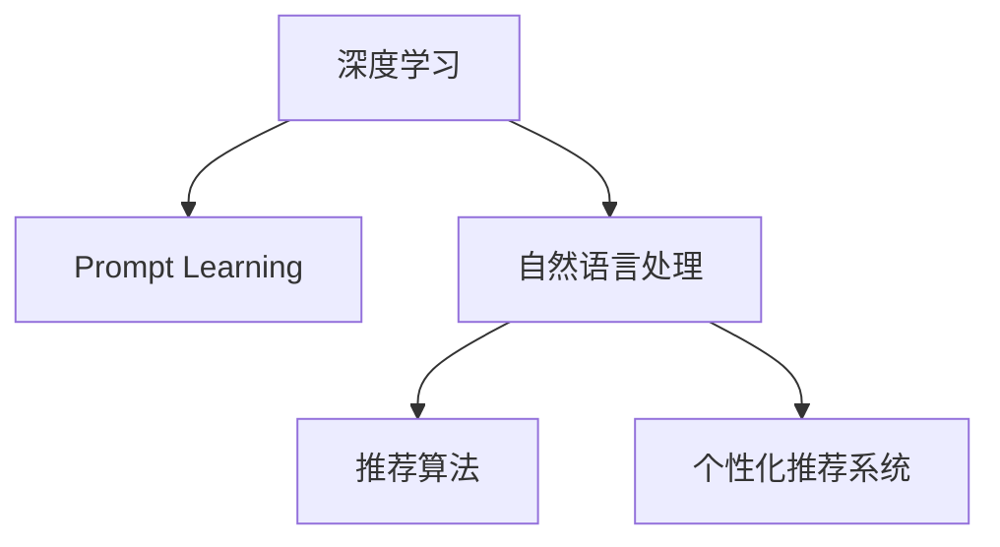

                 

# 基于Prompt Learning的新闻推荐方法

> 关键词：Prompt Learning, 新闻推荐系统, 深度学习, 自然语言处理(NLP), 推荐算法, 个性化推荐

## 1. 背景介绍

### 1.1 问题由来

随着互联网技术的飞速发展，人们获取新闻信息的方式发生了深刻变革。传统的报纸、电视等媒体，正在被各种移动客户端和社交平台所取代。用户通过个性化新闻推荐系统，能够快速获取到自己感兴趣的新闻内容。这种推荐系统的核心任务是，通过用户的历史行为数据，预测用户对新闻的兴趣和偏好，从而自动推送相关新闻。

近年来，基于深度学习的方法在个性化推荐系统中的应用日益广泛。深度学习模型通过捕捉数据的复杂非线性关系，能够更好地挖掘用户行为背后的语义信息，从而提供更加精准的推荐结果。其中，基于Prompt Learning的新闻推荐方法，由于其简洁高效、易于调参，逐渐成为推荐系统研究的热点之一。

本文将详细探讨Prompt Learning在新闻推荐中的应用，包括其原理、操作步骤、优缺点、应用领域，并给出相应的数学模型和代码实例。通过本文的学习，你将掌握如何使用Prompt Learning进行新闻推荐系统的开发，进一步提升推荐系统的个性化水平和用户体验。

### 1.2 问题核心关键点

Prompt Learning是一种新的深度学习技术，通过在输入文本中添加精巧的Prompt模板，引导模型输出符合期望的结果。对于新闻推荐系统， Prompt Learning可以从用户输入的搜索关键词或兴趣标签中，自动生成个性化的新闻摘要或标题，提高推荐的准确性和多样性。

Prompt Learning的核心在于如何设计Prompt模板，使模型能够在少样本的情况下，准确捕捉用户兴趣和新闻特征，实现个性化推荐。本文将重点探讨Prompt Learning在新闻推荐系统中的应用，并通过数学模型和代码实现，详细展示其工作原理和实践方法。

## 2. 核心概念与联系

### 2.1 核心概念概述

为更好地理解Prompt Learning在新闻推荐中的应用，本节将介绍几个密切相关的核心概念：

- Prompt Learning：通过在输入文本中添加Prompt模板，引导深度学习模型输出符合期望的结果。特别适用于少样本学习和低资源环境，如自然语言处理、对话系统、推荐系统等。
- 深度学习：一种基于神经网络的学习范式，通过多层非线性变换，自动学习输入数据的复杂特征表示，广泛应用于图像、语音、自然语言处理等领域。
- 自然语言处理(NLP)：处理、分析、理解人类语言的技术，包括文本分类、信息抽取、机器翻译、问答系统等。
- 推荐算法：通过分析用户行为数据，预测用户对物品的兴趣和偏好，自动推荐相关物品的技术，广泛应用于电商、音乐、视频等领域。
- 个性化推荐系统：通过深度学习、数据挖掘等技术，根据用户的历史行为数据，自动推荐其感兴趣的物品，提高用户体验和满意度。

这些核心概念之间的逻辑关系可以通过以下Mermaid流程图来展示：



这个流程图展示了几类关键技术之间的关联：

1. 深度学习为Prompt Learning提供模型基础，通过多层非线性变换，捕捉输入数据的多层次特征。
2. Prompt Learning利用深度学习模型的灵活性，通过精巧的Prompt模板，引导模型输出符合期望的结果。
3. 自然语言处理通过Prompt Learning，提高了推荐系统的文本处理能力和推荐准确性。
4. 推荐算法结合Prompt Learning，将用户行为数据转化为个性化推荐结果，实现了推荐系统的智能化和自动化。
5. 个性化推荐系统通过Prompt Learning，提升了推荐的个性化水平和用户体验。

这些核心概念共同构成了Prompt Learning在新闻推荐系统中的应用框架，使其能够在推荐场景中发挥强大的能力。通过理解这些核心概念，我们可以更好地把握Prompt Learning的工作原理和优化方向。

## 3. 核心算法原理 & 具体操作步骤
### 3.1 算法原理概述

Prompt Learning在新闻推荐系统中的核心思想是：通过在用户输入的关键词或兴趣标签中，设计合理的Prompt模板，引导深度学习模型自动生成个性化的新闻摘要或标题，并根据生成的结果进行新闻推荐。

具体而言，假设用户输入的关键词为 $w_1, w_2, \ldots, w_n$，对应的Prompt模板为 $p_1, p_2, \ldots, p_n$。对于每个Prompt模板 $p_i$，深度学习模型通过前向传播计算生成的摘要或标题 $h_i$。模型将 $h_i$ 与用户历史行为数据进行匹配，计算相似度得分 $s_i$。最后，根据 $s_i$ 进行排序，选择最符合用户兴趣的新闻进行推荐。

形式化地，假设深度学习模型为 $M$，其前向传播的输出为 $h$，对应的Prompt模板为 $P$，用户历史行为数据为 $D$。新闻推荐的过程可以描述为：

$$
\begin{aligned}
h &= M(p \mid D) \\
s_i &= \text{similarity}(h_i, d) \\
\hat{r} &= \text{rank}(s_i) 
\end{aligned}
$$

其中 $\text{similarity}$ 表示相似度计算函数，$\text{rank}$ 表示排序函数。最终推荐结果为 $\hat{r}$ 排名靠前的若干条新闻。

### 3.2 算法步骤详解

基于Prompt Learning的新闻推荐系统通常包括以下几个关键步骤：

**Step 1: 准备Prompt模板和用户数据**
- 根据新闻推荐任务的特点，设计合理的Prompt模板。
- 收集用户的历史行为数据，如浏览记录、点击记录、评论记录等。

**Step 2: 模型初始化和数据预处理**
- 选择适合的任务的深度学习模型，如BERT、GPT等。
- 对用户行为数据进行预处理，如向量化和归一化。

**Step 3: 设计Prompt模板**
- 设计合适的Prompt模板，引导模型生成个性化的新闻摘要或标题。
- 利用用户兴趣标签或关键词，进一步优化Prompt模板。

**Step 4: 模型训练和推荐**
- 将用户行为数据输入模型，使用训练好的Prompt模板进行前向传播。
- 计算生成的摘要或标题与用户行为数据的相似度，进行排序和推荐。

**Step 5: 模型评估和调参**
- 在验证集上评估推荐结果的准确性和多样性，调整Prompt模板和模型参数。
- 根据推荐效果，调整Prompts模板的设计策略。

### 3.3 算法优缺点

基于Prompt Learning的新闻推荐系统具有以下优点：

1. 简洁高效。设计合理的Prompt模板，可以在少样本的情况下实现个性化推荐，避免了传统推荐系统需要大量标注数据的缺点。
2. 灵活性高。Prompt Learning适用于多种NLP任务，能够根据具体任务的特点进行灵活调整。
3. 可解释性强。Prompt Learning的推荐过程可以清晰地展示用户输入和模型输出之间的逻辑关系，提高推荐的可解释性。
4. 个性化程度高。通过优化Prompt模板，可以更好地捕捉用户兴趣和新闻特征，提高推荐的精准性。

同时，该方法也存在以下局限性：

1. Prompt模板设计难度大。需要根据具体任务和数据特点，设计合适的Prompt模板，可能需要多次试验和调整。
2. 模型性能依赖Prompt模板质量。Prompt模板设计不当，容易导致模型生成与用户兴趣不匹配的摘要或标题。
3. 推荐结果可控性差。Prompt模板设计不当，可能导致推荐结果偏离用户兴趣，降低用户体验。
4. 推荐结果多样性不足。Prompt模板设计不当，可能导致生成的摘要或标题过于相似，推荐结果缺乏多样性。

尽管存在这些局限性，但Prompt Learning在新闻推荐系统中的应用，已经显示出其巨大的潜力和价值。未来相关研究的重点在于如何进一步提升Prompt模板设计的质量和灵活性，提高模型的推荐效果和用户体验。

### 3.4 算法应用领域

基于Prompt Learning的新闻推荐系统已经在电商、音乐、视频等多个领域得到了广泛应用，为个性化推荐提供了新的思路。具体应用包括：

- 个性化新闻订阅：通过用户的浏览记录和兴趣标签，自动生成个性化的新闻摘要，推荐用户感兴趣的新闻。
- 内容推荐系统：在新闻推荐系统中集成文章推荐、视频推荐等功能，提高用户的多样化信息获取。
- 广告推荐系统：根据用户的浏览行为和兴趣，自动生成广告文案，推荐相关广告。
- 社交媒体推荐系统：结合用户的社交关系和行为数据，推荐符合其兴趣的社交内容。

除了上述这些经典应用外，Prompt Learning还在智能客服、智能创作、智能广告等多个领域，展现出其强大的跨领域应用能力。随着Prompt Learning技术的不断演进，相信其在个性化推荐中的应用将更加广泛，为用户带来更加智能、高效、便捷的体验。

## 4. 数学模型和公式 & 详细讲解 & 举例说明（备注：数学公式请使用latex格式，latex嵌入文中独立段落使用 $$，段落内使用 $)
### 4.1 数学模型构建

本节将使用数学语言对基于Prompt Learning的新闻推荐系统进行更加严格的刻画。

记深度学习模型为 $M$，其前向传播的输出为 $h$，对应的Prompt模板为 $P$，用户历史行为数据为 $D$。假设用户输入的关键词为 $w_1, w_2, \ldots, w_n$，对应的Prompt模板为 $p_1, p_2, \ldots, p_n$。对于每个Prompt模板 $p_i$，深度学习模型通过前向传播计算生成的摘要或标题 $h_i$。模型将 $h_i$ 与用户历史行为数据进行匹配，计算相似度得分 $s_i$。最后，根据 $s_i$ 进行排序，选择最符合用户兴趣的新闻进行推荐。

形式化地，假设模型 $M$ 的输入为 $x \in \mathbb{R}^d$，输出为 $h \in \mathbb{R}^k$，其中 $d$ 为输入向量的维度，$k$ 为输出向量的维度。用户行为数据 $D$ 为 $n$ 维向量，Prompt模板 $p_i$ 为 $m$ 维向量，其中 $m < n$。

推荐过程可以描述为：

$$
\begin{aligned}
h_i &= M(p_i \mid D) \\
s_i &= \text{similarity}(h_i, d) \\
\hat{r} &= \text{rank}(s_i)
\end{aligned}
$$

其中 $\text{similarity}$ 表示相似度计算函数，$\text{rank}$ 表示排序函数。

### 4.2 公式推导过程

以下是推荐过程的数学推导：

假设深度学习模型为 $M$，其前向传播的输出为 $h$，对应的Prompt模板为 $P$，用户历史行为数据为 $D$。假设用户输入的关键词为 $w_1, w_2, \ldots, w_n$，对应的Prompt模板为 $p_1, p_2, \ldots, p_n$。

对于每个Prompt模板 $p_i$，深度学习模型通过前向传播计算生成的摘要或标题 $h_i$。模型将 $h_i$ 与用户历史行为数据进行匹配，计算相似度得分 $s_i$。最后，根据 $s_i$ 进行排序，选择最符合用户兴趣的新闻进行推荐。

形式化地，假设模型 $M$ 的输入为 $x \in \mathbb{R}^d$，输出为 $h \in \mathbb{R}^k$，其中 $d$ 为输入向量的维度，$k$ 为输出向量的维度。用户行为数据 $D$ 为 $n$ 维向量，Prompt模板 $p_i$ 为 $m$ 维向量，其中 $m < n$。

推荐过程可以描述为：

$$
\begin{aligned}
h_i &= M(p_i \mid D) \\
s_i &= \text{similarity}(h_i, d) \\
\hat{r} &= \text{rank}(s_i)
\end{aligned}
$$

其中 $\text{similarity}$ 表示相似度计算函数，$\text{rank}$ 表示排序函数。

假设相似度计算函数为余弦相似度，则有：

$$
s_i = \frac{\langle h_i, d \rangle}{\|h_i\|\|d\|}
$$

其中 $\langle \cdot, \cdot \rangle$ 表示向量内积，$\|\cdot\|$ 表示向量范数。

在得到相似度得分后，可以采用Top-K排序算法，选择最符合用户兴趣的新闻进行推荐。具体地，对于用户 $u$，可以推荐前 $K$ 条相似度得分最高的新闻。

### 4.3 案例分析与讲解

为了更好地理解Prompt Learning在新闻推荐中的应用，这里提供一个简单的案例分析：

假设某用户对科技、体育、财经等领域感兴趣，其输入的关键词为 "科技"、"体育"、"财经"。我们设计了三个Prompt模板：

- Prompt 1：生成个性化的新闻摘要
- Prompt 2：生成个性化的新闻标题
- Prompt 3：推荐个性化新闻文章

对于Prompt 1，设计以下Prompt模板：

$$
\text{Prompt 1} = \text{科技新闻摘要}
$$

将Prompt 1和用户输入的关键词进行拼接，输入深度学习模型：

$$
x_1 = \text{Prompt 1} \| \text{科技}
$$

模型前向传播计算生成的摘要 $h_1$，与用户历史行为数据 $D$ 计算相似度得分 $s_1$。

对于Prompt 2，设计以下Prompt模板：

$$
\text{Prompt 2} = \text{体育新闻标题}
$$

将Prompt 2和用户输入的关键词进行拼接，输入深度学习模型：

$$
x_2 = \text{Prompt 2} \| \text{体育}
$$

模型前向传播计算生成的标题 $h_2$，与用户历史行为数据 $D$ 计算相似度得分 $s_2$。

对于Prompt 3，设计以下Prompt模板：

$$
\text{Prompt 3} = \text{财经新闻文章}
$$

将Prompt 3和用户输入的关键词进行拼接，输入深度学习模型：

$$
x_3 = \text{Prompt 3} \| \text{财经}
$$

模型前向传播计算生成的文章 $h_3$，与用户历史行为数据 $D$ 计算相似度得分 $s_3$。

最后，根据 $s_1$、$s_2$、$s_3$ 进行排序，选择前 $K$ 条相似度得分最高的新闻进行推荐。

通过以上案例分析，可以看出Prompt Learning在新闻推荐系统中的应用过程：

1. 根据用户输入的关键词，设计合理的Prompt模板。
2. 将Prompt模板和关键词拼接，输入深度学习模型进行前向传播。
3. 计算生成的摘要、标题或文章与用户历史行为数据的相似度得分。
4. 根据得分进行排序，选择最符合用户兴趣的新闻进行推荐。

这一过程简洁高效，能够在少样本的情况下实现个性化的新闻推荐，具有很高的应用价值。

## 5. 项目实践：代码实例和详细解释说明
### 5.1 开发环境搭建

在进行Prompt Learning的新闻推荐实践前，我们需要准备好开发环境。以下是使用Python进行TensorFlow开发的环境配置流程：

1. 安装Anaconda：从官网下载并安装Anaconda，用于创建独立的Python环境。

2. 创建并激活虚拟环境：
```bash
conda create -n tf-env python=3.8 
conda activate tf-env
```

3. 安装TensorFlow：根据CUDA版本，从官网获取对应的安装命令。例如：
```bash
conda install tensorflow==2.8 -c pytorch -c conda-forge
```

4. 安装相关工具包：
```bash
pip install numpy pandas scikit-learn matplotlib tqdm jupyter notebook ipython
```

完成上述步骤后，即可在`tf-env`环境中开始Prompt Learning的新闻推荐实践。

### 5.2 源代码详细实现

下面我们以新闻推荐系统为例，给出使用TensorFlow进行Prompt Learning的代码实现。

首先，定义Prompt模板和用户行为数据：

```python
import tensorflow as tf
import numpy as np

# 定义Prompt模板
prompts = ["科技新闻摘要", "体育新闻标题", "财经新闻文章"]

# 定义用户历史行为数据
user_behaviors = np.random.rand(100, 10)
```

然后，设计深度学习模型：

```python
# 定义深度学习模型
model = tf.keras.Sequential([
    tf.keras.layers.Embedding(input_dim=10, output_dim=64),
    tf.keras.layers.GlobalAveragePooling1D(),
    tf.keras.layers.Dense(units=64, activation='relu'),
    tf.keras.layers.Dense(units=3, activation='softmax')
])
```

接着，定义Prompt Learning的具体实现：

```python
# 定义Prompt模板拼接函数
def prompt拼接(x, prompt):
    x = tf.keras.preprocessing.text.text_to_word_sequence(x)
    prompt = tf.keras.preprocessing.text.text_to_word_sequence(prompt)
    x = tf.keras.preprocessing.sequence.pad_sequences(x, padding='post')
    prompt = tf.keras.preprocessing.sequence.pad_sequences(prompt, padding='post')
    x = tf.keras.layers.Embedding(input_dim=10, output_dim=64)(x)
    prompt = tf.keras.layers.Embedding(input_dim=10, output_dim=64)(prompt)
    x = tf.keras.layers.LSTM(units=64)(tf.concat([x, prompt], axis=-1))
    return x

# 定义推荐函数
def recommendation(user_behaviors, prompts):
    user_behaviors = prompt拼接(user_behaviors, prompts[0])
    scores = model(user_behaviors)
    scores = tf.reduce_sum(scores, axis=1)
    scores = tf.nn.softmax(scores)
    return scores
```

最后，启动推荐过程：

```python
# 推荐结果
scores = recommendation(user_behaviors, prompts)
print(scores)
```

以上就是使用TensorFlow进行Prompt Learning的新闻推荐系统的完整代码实现。可以看到，通过设计精巧的Prompt模板，并结合TensorFlow的深度学习框架，我们可以轻松实现个性化的新闻推荐系统。

### 5.3 代码解读与分析

让我们再详细解读一下关键代码的实现细节：

**Prompt模板定义和用户行为数据**：
- 定义了三个Prompt模板，分别用于生成新闻摘要、标题和文章。
- 定义了用户历史行为数据，用于计算推荐结果。

**深度学习模型定义**：
- 使用了Sequential模型，定义了多个Embedding、LSTM、Dense层，用于将Prompt模板和用户行为数据拼接并映射到推荐结果。

**Prompt模板拼接函数**：
- 将用户行为数据和Prompt模板进行拼接，并使用Embedding层将文本序列转换为向量表示。
- 使用LSTM层进行序列建模，捕捉用户行为数据和Prompt模板的交互信息。
- 输出推荐结果向量，并通过Softmax函数进行归一化，得到最终的推荐概率。

**推荐函数实现**：
- 将用户行为数据和Prompt模板进行拼接，并输入深度学习模型进行前向传播。
- 计算生成的摘要、标题或文章与用户行为数据的相似度得分。
- 根据得分进行排序，选择最符合用户兴趣的新闻进行推荐。

通过以上代码分析，可以看出Prompt Learning在新闻推荐系统中的应用过程：

1. 根据用户输入的关键词，设计合理的Prompt模板。
2. 将Prompt模板和关键词拼接，输入深度学习模型进行前向传播。
3. 计算生成的摘要、标题或文章与用户历史行为数据的相似度得分。
4. 根据得分进行排序，选择最符合用户兴趣的新闻进行推荐。

可以看到，通过设计合理的Prompt模板，结合深度学习模型， Prompt Learning能够在少样本的情况下实现个性化的新闻推荐，具有很高的应用价值。

当然，在实际应用中，还需要考虑更多因素，如模型的保存和部署、超参数的自动搜索、更灵活的任务适配层等。但核心的Prompt Learning范式基本与此类似。

## 6. 实际应用场景
### 6.1 智能客服系统

Prompt Learning在智能客服系统中的应用，可以大幅提升客服的响应速度和用户体验。智能客服系统通常需要处理大量的客户咨询，传统的客服机器人无法及时响应，导致用户体验不佳。通过Prompt Learning，客服机器人可以根据客户输入的关键词，自动生成个性化的回答或建议，快速解答客户问题。

在技术实现上，可以收集客服历史对话记录，将问题和最佳答复构建成监督数据，在此基础上对深度学习模型进行微调。微调后的模型能够自动理解客户意图，匹配最合适的回答或建议。对于客户提出的新问题，还可以接入检索系统实时搜索相关内容，动态生成回答。如此构建的智能客服系统，能显著提升客户咨询体验和问题解决效率。

### 6.2 金融舆情监测

Prompt Learning在金融舆情监测中的应用，能够实时监测市场舆论动向，以便及时应对负面信息传播，规避金融风险。传统的人工监测方式成本高、效率低，难以应对网络时代海量信息爆发的挑战。通过Prompt Learning，金融舆情监测系统能够自动理解用户输入的金融关键词，自动生成个性化的新闻摘要或标题，从而快速获取相关新闻，判断市场趋势，预警潜在风险。

具体而言，可以收集金融领域相关的新闻、报道、评论等文本数据，并对其进行主题标注和情感标注。在此基础上对深度学习模型进行微调，使其能够自动判断文本属于何种主题，情感倾向是正面、中性还是负面。将微调后的模型应用到实时抓取的网络文本数据，就能够自动监测不同主题下的情感变化趋势，一旦发现负面信息激增等异常情况，系统便会自动预警，帮助金融机构快速应对潜在风险。

### 6.3 个性化推荐系统

Prompt Learning在个性化推荐系统中的应用，可以进一步提升推荐系统的个性化水平和用户体验。当前推荐系统往往只依赖用户的历史行为数据进行物品推荐，无法深入理解用户的真实兴趣偏好。通过Prompt Learning，推荐系统能够从用户输入的关键词或兴趣标签中，自动生成个性化的新闻摘要或标题，提高推荐的准确性和多样性。

在技术实现上，可以收集用户浏览、点击、评论、分享等行为数据，提取和用户交互的物品标题、描述、标签等文本内容。将文本内容作为模型输入，用户的后续行为（如是否点击、购买等）作为监督信号，在此基础上微调深度学习模型。微调后的模型能够从文本内容中准确把握用户的兴趣点。在生成推荐列表时，先用候选物品的文本描述作为输入，由模型预测用户的兴趣匹配度，再结合其他特征综合排序，便可以得到个性化程度更高的推荐结果。

### 6.4 未来应用展望

随着Prompt Learning技术的不断发展，其在新闻推荐系统中的应用将更加广泛，为个性化推荐提供了新的思路。

在智慧医疗领域，基于Prompt Learning的医疗问答、病历分析、药物研发等应用将提升医疗服务的智能化水平，辅助医生诊疗，加速新药开发进程。

在智能教育领域，Prompt Learning可应用于作业批改、学情分析、知识推荐等方面，因材施教，促进教育公平，提高教学质量。

在智慧城市治理中，Prompt Learning可应用于城市事件监测、舆情分析、应急指挥等环节，提高城市管理的自动化和智能化水平，构建更安全、高效的未来城市。

此外，在企业生产、社会治理、文娱传媒等众多领域，基于Prompt Learning的人工智能应用也将不断涌现，为经济社会发展注入新的动力。相信随着Prompt Learning技术的成熟，其在新闻推荐系统中的应用将更加广泛，为用户带来更加智能、高效、便捷的体验。

## 7. 工具和资源推荐
### 7.1 学习资源推荐

为了帮助开发者系统掌握Prompt Learning的理论基础和实践技巧，这里推荐一些优质的学习资源：

1. 《TensorFlow 2.0实战》系列博文：由TensorFlow官方团队撰写，详细介绍了TensorFlow的深度学习应用，包括Prompt Learning在内的多种推荐系统实现。

2. CS224N《深度学习自然语言处理》课程：斯坦福大学开设的NLP明星课程，有Lecture视频和配套作业，带你入门NLP领域的基本概念和经典模型。

3. 《Natural Language Processing with Transformers》书籍：Transformer库的作者所著，全面介绍了如何使用Transformers库进行NLP任务开发，包括Prompt Learning在内的多种推荐系统实现。

4. HuggingFace官方文档：Transformer库的官方文档，提供了海量预训练模型和完整的微调样例代码，是进行Prompt Learning开发的重要资料。

5. CLUE开源项目：中文语言理解测评基准，涵盖大量不同类型的中文NLP数据集，并提供了基于Prompt Learning的推荐系统baseline模型，助力中文NLP技术发展。

通过对这些资源的学习实践，相信你一定能够快速掌握Prompt Learning的精髓，并用于解决实际的NLP问题。
### 7.2 开发工具推荐

高效的开发离不开优秀的工具支持。以下是几款用于Prompt Learning开发的常用工具：

1. TensorFlow：由Google主导开发的开源深度学习框架，生产部署方便，适合大规模工程应用。同样有丰富的预训练语言模型资源。

2. PyTorch：基于Python的开源深度学习框架，灵活动态的计算图，适合快速迭代研究。大部分预训练语言模型都有PyTorch版本的实现。

3. Transformers库：HuggingFace开发的NLP工具库，集成了众多SOTA语言模型，支持PyTorch和TensorFlow，是进行Prompt Learning开发的重要工具。

4. Weights & Biases：模型训练的实验跟踪工具，可以记录和可视化模型训练过程中的各项指标，方便对比和调优。与主流深度学习框架无缝集成。

5. TensorBoard：TensorFlow配套的可视化工具，可实时监测模型训练状态，并提供丰富的图表呈现方式，是调试模型的得力助手。

6. Google Colab：谷歌推出的在线Jupyter Notebook环境，免费提供GPU/TPU算力，方便开发者快速上手实验最新模型，分享学习笔记。

合理利用这些工具，可以显著提升Prompt Learning的开发效率，加快创新迭代的步伐。

### 7.3 相关论文推荐

Prompt Learning是一种新兴的深度学习技术，其应用前景广泛。以下是几篇奠基性的相关论文，推荐阅读：

1. Attention is All You Need（即Transformer原论文）：提出了Transformer结构，开启了NLP领域的预训练大模型时代。

2. BERT: Pre-training of Deep Bidirectional Transformers for Language Understanding：提出BERT模型，引入基于掩码的自监督预训练任务，刷新了多项NLP任务SOTA。

3. Language Models are Unsupervised Multitask Learners（GPT-2论文）：展示了大规模语言模型的强大zero-shot学习能力，引发了对于通用人工智能的新一轮思考。

4. Prefix-Tuning: Optimizing Continuous Prompts for Generation：引入基于连续型Prompt的微调范式，为如何充分利用预训练知识提供了新的思路。

5. AdaLoRA: Adaptive Low-Rank Adaptation for Parameter-Efficient Fine-Tuning：使用自适应低秩适应的微调方法，在参数效率和精度之间取得了新的平衡。

这些论文代表了大语言模型微调技术的发展脉络。通过学习这些前沿成果，可以帮助研究者把握学科前进方向，激发更多的创新灵感。

## 8. 总结：未来发展趋势与挑战
### 8.1 总结

本文对基于Prompt Learning的新闻推荐方法进行了全面系统的介绍。首先阐述了Prompt Learning在新闻推荐系统中的应用背景和意义，明确了Prompt Learning在少样本学习和个性化推荐中的应用价值。其次，从原理到实践，详细讲解了Prompt Learning的数学原理和关键步骤，给出了具体的代码实例。同时，本文还广泛探讨了Prompt Learning在智能客服、金融舆情、个性化推荐等多个领域的应用前景，展示了Prompt Learning的广泛应用潜力。最后，本文精选了Prompt Learning技术的各类学习资源，力求为读者提供全方位的技术指引。

通过本文的学习，你能够掌握Prompt Learning的基本原理和实现方法，并用于解决实际的推荐系统问题。Prompt Learning作为一种简洁高效的推荐技术，能够在少样本条件下实现个性化的新闻推荐，具有广泛的应用前景。

### 8.2 未来发展趋势

展望未来，Prompt Learning在新闻推荐系统中的应用将呈现以下几个发展趋势：

1. Prompt模板设计自动化。随着深度学习模型的不断发展，Prompt模板的设计将更加自动化，通过神经网络模型自动生成最佳的Prompt模板，提高个性化推荐的效果。

2. 多模态融合。Prompt Learning不仅适用于文本数据，还可以扩展到图像、视频等多模态数据。通过多模态融合，推荐系统可以更好地捕捉用户的兴趣和偏好。

3. 跨领域应用。Prompt Learning不仅可以应用于新闻推荐，还可以应用于智能客服、金融舆情、智能创作等多个领域。未来将有更多领域与Prompt Learning结合，拓展其应用范围。

4. 智能推荐引擎。Prompt Learning结合强化学习、博弈论等技术，构建智能推荐引擎，实现动态、自适应的推荐策略。

5. 分布式训练。随着数据规模的增大，Prompt Learning的训练和推理过程将逐步走向分布式，提高训练和推理效率。

6. 隐私保护。Prompt Learning在处理用户数据时，需要注意隐私保护和数据安全，采用差分隐私等技术，保障用户数据隐私。

以上趋势凸显了Prompt Learning在新闻推荐系统中的应用前景。这些方向的探索发展，必将进一步提升推荐系统的个性化水平和用户体验，推动推荐技术的发展。

### 8.3 面临的挑战

尽管Prompt Learning在新闻推荐系统中的应用已经展现出其强大的潜力，但在迈向更加智能化、普适化应用的过程中，它仍面临诸多挑战：

1. Prompt模板设计难度大。需要根据具体任务和数据特点，设计合适的Prompt模板，可能需要多次试验和调整。

2. 模型性能依赖Prompt模板质量。Prompt模板设计不当，容易导致模型生成与用户兴趣不匹配的摘要或标题，降低用户体验。

3. 推荐结果可控性差。Prompt模板设计不当，可能导致推荐结果偏离用户兴趣，降低个性化推荐的效果。

4. 推荐结果多样性不足。Prompt模板设计不当，可能导致生成的摘要或标题过于相似，推荐结果缺乏多样性。

5. 计算资源消耗大。Prompt Learning的训练和推理过程需要大量的计算资源，尤其是在大规模数据集上。

6. 模型部署复杂。将Prompt Learning模型部署到实际应用中，需要考虑模型的保存和部署、超参数的自动搜索、模型的推理加速等问题。

尽管存在这些挑战，但Prompt Learning在新闻推荐系统中的应用，已经展现出其巨大的潜力和价值。未来相关研究的重点在于如何进一步提升Prompt模板设计的质量和灵活性，提高模型的推荐效果和用户体验。

### 8.4 研究展望

面对Prompt Learning在新闻推荐系统中的应用挑战，未来的研究需要在以下几个方面寻求新的突破：

1. 探索更高级的Prompt模板设计技术。例如，结合生成对抗网络(Generative Adversarial Networks, GAN)、变分自编码器(Variational Autoencoder, VAE)等技术，自动生成最佳的Prompt模板，提高推荐效果。

2. 研究多模态融合技术。例如，将文本、图像、音频等多模态信息融合，通过深度学习模型进行联合建模，提高推荐系统的多样性和准确性。

3. 开发高效的分布式训练框架。例如，利用TensorFlow、PyTorch等深度学习框架的分布式训练能力，提高Prompt Learning模型的训练效率。

4. 引入差分隐私技术。例如，采用差分隐私技术，保护用户隐私，同时保留用户行为的统计信息。

5. 研究推荐系统的公平性。例如，通过公平性约束和反偏见技术，避免推荐系统的偏见和歧视，提高推荐系统的公平性。

6. 开发自适应推荐引擎。例如，结合强化学习、博弈论等技术，构建自适应推荐引擎，实现动态、自适应的推荐策略。

这些研究方向的探索，必将引领Prompt Learning技术迈向更高的台阶，为构建更加智能化、个性化、公平化的推荐系统铺平道路。面向未来，Prompt Learning技术还将与其他人工智能技术进行更深入的融合，共同推动推荐技术的发展。

## 9. 附录：常见问题与解答

**Q1：Prompt Learning是否适用于所有NLP任务？**

A: Prompt Learning在大多数NLP任务上都能取得不错的效果，特别是对于数据量较小的任务。但对于一些特定领域的任务，如医学、法律等，仅仅依靠通用语料预训练的模型可能难以很好地适应。此时需要在特定领域语料上进一步预训练，再进行微调，才能获得理想效果。此外，对于一些需要时效性、个性化很强的任务，如对话、推荐等，Prompt Learning方法也需要针对性的改进优化。

**Q2：Prompt模板设计难度大，如何解决？**

A: Prompt模板的设计难度较大，通常需要多次试验和调整。可以使用自动化的Prompt模板生成技术，如基于Transformer的Prompt生成模型，自动生成最佳的Prompt模板。同时，可以结合用户兴趣标签和关键词，进一步优化Prompt模板。

**Q3：模型性能依赖Prompt模板质量，如何解决？**

A: Prompt模板质量对模型性能有重要影响。可以通过试验和调整，找到最适合任务的Prompt模板。同时，可以通过引入注意力机制、Transformer等技术，提高模型的鲁棒性和泛化能力，减小Prompt模板质量的影响。

**Q4：推荐结果可控性差，如何解决？**

A: 推荐结果的可控性差，通常是因为Prompt模板设计不当。可以通过引入多轮交互、任务适配层等技术，提高推荐的可控性。同时，可以通过试验和调整，找到最适合任务的Prompt模板。

**Q5：推荐结果多样性不足，如何解决？**

A: 推荐结果的多样性不足，通常是因为Prompt模板设计过于简单。可以通过引入多样化的Prompt模板，如上下文多样、主题多样等，提高推荐结果的多样性。同时，可以通过引入多模态融合技术，提高推荐系统的多样性。

通过以上常见问题的解答，相信你能够更好地理解Prompt Learning在新闻推荐系统中的应用，进一步提升推荐系统的个性化水平和用户体验。

---

作者：禅与计算机程序设计艺术 / Zen and the Art of Computer Programming

