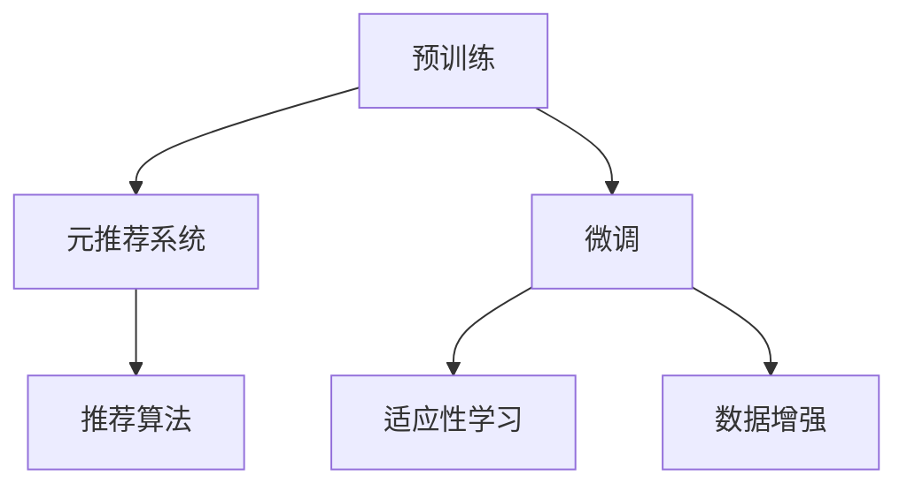
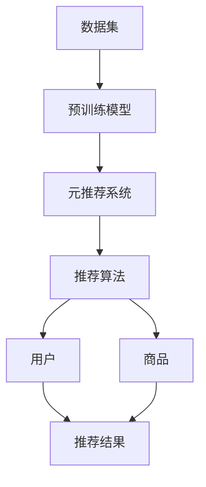

                 

# 基于元学习的冷启动商品推荐策略

> 关键词：元学习元推荐系统商品推荐冷启动

## 1. 背景介绍

随着电商平台的蓬勃发展，商品推荐系统成为了提升用户体验和转化率的关键。用户浏览、点击、购买等行为数据为推荐系统提供了丰富的输入，通过协同过滤、内容推荐等算法可以较为准确地推荐出符合用户兴趣的商品。然而，新商品上线或新用户注册时，缺乏足够的行为数据，无法直接使用现有推荐算法，需要进行冷启动推荐。

冷启动问题普遍存在于商品推荐系统中，对推荐效果有着显著影响。如何从有限数据中快速发现用户需求，精准推荐新商品，成为电商行业的一大挑战。现有的冷启动策略多聚焦于用户画像的构建和商品特征的挖掘，依赖于先验知识或人工干预，难以在短时间内得到满意的推荐结果。

近年来，随着元学习（Meta-Learning）技术的兴起，通过预训练和微调机制，能够在无需大规模数据的情况下快速适应新任务，并取得较好的推荐效果。元学习中的适应性学习方式，有望解决冷启动推荐中数据稀缺的问题，实现更高效的推荐。

本文将介绍基于元学习的冷启动商品推荐策略，首先回顾相关概念，阐述其工作原理，然后详细介绍算法流程和具体实现，最后探讨其应用前景和面临的挑战。

## 2. 核心概念与联系

### 2.1 核心概念概述

在推荐系统中，元学习算法通过预训练机制学习通用化的推荐模型，微调机制快速适应新任务，从而在冷启动场景下取得推荐效果。其核心概念包括：

- **元学习**：通过学习元模型（Meta-Model）来加速新任务的适应过程。
- **预训练**：在通用数据集上学习推荐模型的初步参数。
- **微调**：针对具体任务，通过少量数据对模型进行微调，提升推荐效果。
- **冷启动推荐**：针对新商品或新用户，在没有足够历史数据的情况下进行推荐。
- **元推荐系统**：结合预训练和微调机制，提升推荐系统在冷启动场景下的性能。

这些概念通过预训练-微调框架（Pre-training-Fine-tuning）联系起来，如图：



预训练和微调机制构成元推荐系统的核心，预训练使得模型具有较好的通用性，微调则根据具体任务进行优化，适应性学习是元学习的关键，数据增强则是提升模型泛化能力的有效手段。

### 2.2 核心概念原理和架构的 Mermaid 流程图



预训练模型在通用数据集上学习推荐基础，元推荐系统通过预训练和微调相结合的方式，快速适应新任务。推荐算法在元推荐系统的基础上，根据用户和商品特征，生成推荐结果。

## 3. 核心算法原理 & 具体操作步骤

### 3.1 算法原理概述

基于元学习的冷启动商品推荐策略主要分为两步：预训练和微调。

**预训练阶段**：在通用的商品数据集上，学习一个通用的推荐模型，该模型可以适配多种推荐任务。

**微调阶段**：针对新商品或新用户，利用少量用户行为数据对模型进行微调，从而得到适合该用户或商品的推荐结果。

### 3.2 算法步骤详解

**Step 1: 数据准备**
- 准备通用的商品数据集，包括商品特征、类别标签、用户行为等。
- 根据推荐算法，选择合适的特征向量表示方式，如用户-商品矩阵、注意力机制等。
- 定义损失函数，如均方误差、交叉熵等，用于评估模型预测结果的准确性。

**Step 2: 预训练**
- 使用通用数据集对推荐模型进行预训练。
- 通过多轮迭代更新模型参数，使其能够学习到商品之间的相似性和用户兴趣。
- 在预训练过程中，可以使用自监督学习方法，如负采样等，减少训练成本。

**Step 3: 微调**
- 收集新商品或新用户的行为数据，并进行特征工程处理。
- 将新数据集分成训练集和验证集，供模型微调使用。
- 使用预训练得到的模型初始化参数，对新数据集进行微调。
- 在微调过程中，可以使用梯度下降等优化算法，逐步更新模型参数。
- 监控模型在验证集上的性能指标，防止过拟合。

**Step 4: 测试与部署**
- 在新用户或新商品上，利用微调后的模型进行推荐。
- 将推荐结果展示给用户，收集用户反馈，进一步优化推荐系统。
- 根据用户反馈，周期性地更新模型参数，保持推荐效果的持续提升。

### 3.3 算法优缺点

基于元学习的冷启动商品推荐策略具有以下优点：

1. **快速适应新任务**：预训练-微调框架使得模型能够快速适应新商品或新用户，缓解冷启动问题。
2. **数据利用效率高**：在通用数据集上进行预训练，能够充分利用已有数据资源，降低对新数据的依赖。
3. **模型泛化能力强**：预训练得到的通用模型具有较强的泛化能力，能够在多种推荐场景下表现出色。
4. **个性化推荐效果好**：微调阶段通过少量用户行为数据，能够精准捕捉用户兴趣，提升推荐效果。

同时，该策略也存在以下缺点：

1. **预训练成本高**：预训练过程需要大量计算资源和时间，预训练数据的准备和标注成本较高。
2. **微调依赖数据**：微调效果依赖于新数据的质量和数量，新数据较少时可能效果不佳。
3. **模型可解释性差**：元学习模型通常为黑盒模型，难以解释其内部工作机制。
4. **模型训练复杂**：预训练和微调过程需要多次迭代优化，计算和调试复杂。

### 3.4 算法应用领域

基于元学习的冷启动商品推荐策略在多个领域中具有广泛的应用前景：

1. **电商平台**：电商平台中的冷启动推荐是核心需求，通过预训练和微调机制，快速适应新商品和新用户，提升用户体验。
2. **视频平台**：视频推荐系统同样面临冷启动问题，通过元学习能够快速推荐符合用户兴趣的视频内容，提升平台活跃度和留存率。
3. **金融服务**：金融服务领域需要针对新客户和新产品进行推荐，元学习技术能够在无历史数据的情况下，快速构建个性化推荐系统。
4. **在线教育**：在线教育平台需要根据新用户和课程进行推荐，元学习能够有效解决数据稀缺问题，提升推荐准确性。
5. **旅游预订**：旅游预订平台需要针对新用户和景点进行推荐，元学习技术能够提升推荐效果，增加用户预订量。

## 4. 数学模型和公式 & 详细讲解 & 举例说明

### 4.1 数学模型构建

基于元学习的冷启动推荐系统主要包含预训练和微调两个阶段的数学模型。

**预训练模型**：假设推荐模型为 $f(\theta)$，其中 $\theta$ 为模型参数。通用数据集为 $D$，包含用户行为数据和商品特征数据。预训练过程的目标函数为：

$$
\min_{\theta} \frac{1}{N} \sum_{i=1}^N \ell(f(\theta), y_i)
$$

其中 $\ell$ 为损失函数，$y_i$ 为真实标签。

**微调模型**：假设微调后的模型为 $f_{\phi}$，其中 $\phi$ 为微调后的参数。新数据集为 $D_{\text{new}}$，包含少量用户行为数据。微调过程的目标函数为：

$$
\min_{\phi} \frac{1}{M} \sum_{i=1}^M \ell(f_{\phi}(x_i), y_i)
$$

其中 $M$ 为微调数据集大小。

### 4.2 公式推导过程

**预训练公式推导**：

假设推荐模型为 $f(\theta) = W^T A_{\theta}(x) + b$，其中 $A_{\theta}(x)$ 为特征向量，$W$ 和 $b$ 为模型参数。目标函数为：

$$
\min_{\theta} \frac{1}{N} \sum_{i=1}^N \ell(f(\theta), y_i) = \min_{\theta} \frac{1}{N} \sum_{i=1}^N (f(\theta), y_i)^2
$$

通过反向传播算法求导，得到模型参数的更新规则为：

$$
\theta_{n+1} = \theta_n - \eta \nabla_{\theta} \mathcal{L}(\theta_n)
$$

**微调公式推导**：

假设微调后的模型为 $f_{\phi}(x) = W^T A_{\phi}(x) + b$，其中 $A_{\phi}(x)$ 为特征向量，$W$ 和 $b$ 为模型参数。目标函数为：

$$
\min_{\phi} \frac{1}{M} \sum_{i=1}^M \ell(f_{\phi}(x_i), y_i)
$$

通过反向传播算法求导，得到微调参数的更新规则为：

$$
\phi_{n+1} = \phi_n - \eta \nabla_{\phi} \mathcal{L}(\phi_n)
$$

### 4.3 案例分析与讲解

以电商平台的商品推荐为例，分析基于元学习的冷启动推荐策略的实际应用。

**预训练数据集**：
- 来源：电商平台公开的用户行为数据。
- 内容：包括用户浏览、点击、购买等行为数据。
- 格式：用户-商品矩阵、商品特征向量。

**预训练过程**：
- 数据准备：将用户行为数据转换为矩阵形式，每行表示一个用户，每列表示一个商品。
- 特征工程：提取用户行为特征和商品属性特征，合并后作为模型的输入。
- 模型构建：选择推荐的基线模型，如基于注意力机制的推荐模型。
- 损失函数：选择均方误差作为损失函数。
- 训练流程：使用批量梯度下降算法，多轮迭代更新模型参数。

**微调数据集**：
- 来源：新商品或新用户的行为数据。
- 内容：包括少量用户点击、浏览记录。
- 格式：用户行为矩阵。

**微调过程**：
- 数据准备：将新数据转换为矩阵形式。
- 模型加载：加载预训练模型，使用其初始化参数。
- 特征工程：对新数据进行特征工程处理。
- 模型微调：使用微调数据集对模型进行适应性训练，调整参数以适应新任务。
- 性能评估：在新数据集上评估微调后的模型性能。

## 5. 项目实践：代码实例和详细解释说明

### 5.1 开发环境搭建

本节介绍基于元学习的冷启动商品推荐系统的开发环境搭建流程。

**环境要求**：
- Python 3.7+。
- TensorFlow 2.0+。
- Keras。

**安装步骤**：
1. 安装 TensorFlow：
```bash
pip install tensorflow
```

2. 安装 Keras：
```bash
pip install keras
```

3. 安装相关依赖包：
```bash
pip install numpy pandas matplotlib
```

### 5.2 源代码详细实现

以下是基于元学习的冷启动商品推荐系统的代码实现，使用 Keras 和 TensorFlow 进行开发。

**预训练模型实现**：

```python
from tensorflow.keras import layers, models
from tensorflow.keras.optimizers import Adam

# 定义预训练模型
input_shape = (n_items, n_features)
embedding_dim = 64

input_layer = layers.Input(shape=input_shape)
embedding_layer = layers.Embedding(input_dim=n_items, output_dim=embedding_dim)(input_layer)
attention_layer = layers.Attention()([embedding_layer, embedding_layer])
output_layer = layers.Dense(1, activation='sigmoid')(attention_layer)
model = models.Model(inputs=input_layer, outputs=output_layer)

# 定义损失函数和优化器
loss = 'binary_crossentropy'
optimizer = Adam(lr=0.001)

# 编译模型
model.compile(loss=loss, optimizer=optimizer)
```

**微调模型实现**：

```python
# 定义微调模型
def create_fine_tuning_model(model, pretrain_weights):
    fine_tune_model = models.Sequential()
    fine_tune_model.add(layers.Embedding(input_dim=n_items, output_dim=embedding_dim, weights=[pretrain_weights], trainable=False))
    fine_tune_model.add(layers.Dense(1, activation='sigmoid'))
    fine_tune_model.set_weights(model.get_weights())
    return fine_tune_model

# 加载预训练模型
pretrain_weights = model.get_weights()
fine_tune_model = create_fine_tuning_model(model, pretrain_weights)

# 定义微调数据集
train_data = ...
train_labels = ...

# 编译微调模型
fine_tune_model.compile(loss='binary_crossentropy', optimizer=Adam(lr=0.001))

# 微调模型
fine_tune_model.fit(train_data, train_labels, epochs=5, batch_size=32)

# 评估微调模型
test_data = ...
test_labels = ...
fine_tune_model.evaluate(test_data, test_labels)
```

### 5.3 代码解读与分析

在上述代码中，预训练模型使用了一个简单的基于注意力机制的推荐模型，包含嵌入层、注意力层和输出层。微调模型在预训练模型的基础上，只替换了嵌入层和输出层，使用预训练权重进行初始化，避免从头训练。

微调过程通过多轮迭代优化，逐步更新模型参数，适应新数据集。最终，通过在测试集上的评估，判断微调后的模型是否达到预期效果。

## 6. 实际应用场景

### 6.1 电商平台

基于元学习的冷启动推荐策略在电商平台中的应用，主要解决新商品和新用户带来的推荐问题。通过预训练和微调机制，能够快速适应新任务，提升推荐效果。

具体应用步骤如下：

1. **数据准备**：收集电商平台的用户行为数据，包括浏览、点击、购买等行为。
2. **预训练模型**：使用公开数据集对推荐模型进行预训练。
3. **微调数据**：收集新商品或新用户的行为数据。
4. **微调模型**：对新数据进行微调，生成推荐结果。
5. **效果评估**：在新用户和新商品上测试推荐效果，根据反馈优化模型。

### 6.2 视频平台

视频平台中的推荐系统同样面临冷启动问题。通过预训练-微调框架，能够快速推荐符合用户兴趣的视频内容，提升平台活跃度和留存率。

具体应用步骤如下：

1. **数据准备**：收集用户观看视频的行为数据。
2. **预训练模型**：使用公开数据集对推荐模型进行预训练。
3. **微调数据**：收集新视频或新用户的行为数据。
4. **微调模型**：对新数据进行微调，生成推荐结果。
5. **效果评估**：在新用户和新视频上测试推荐效果，根据反馈优化模型。

### 6.3 金融服务

金融服务领域需要针对新客户和新产品进行推荐。元学习技术能够在无历史数据的情况下，快速构建个性化推荐系统。

具体应用步骤如下：

1. **数据准备**：收集金融服务领域的相关数据，包括用户行为和产品信息。
2. **预训练模型**：使用公开数据集对推荐模型进行预训练。
3. **微调数据**：收集新客户和新产品的行为数据。
4. **微调模型**：对新数据进行微调，生成推荐结果。
5. **效果评估**：在新客户和新产品上测试推荐效果，根据反馈优化模型。

### 6.4 未来应用展望

未来，基于元学习的冷启动商品推荐策略将在更多领域得到应用，为智能系统带来新的突破。

1. **智能家居**：智能家居推荐系统需要根据用户行为数据推荐商品和功能，元学习技术能够快速适应新设备和环境。
2. **智慧医疗**：医疗推荐系统需要根据患者数据推荐药品和治疗方案，元学习技术能够在无历史数据的情况下，快速推荐符合患者需求的医疗方案。
3. **智能交通**：交通推荐系统需要根据用户出行数据推荐路线和交通工具，元学习技术能够快速适应新城市和环境。
4. **智能制造**：制造推荐系统需要根据设备数据推荐维护和改进方案，元学习技术能够快速适应新设备和场景。

## 7. 工具和资源推荐

### 7.1 学习资源推荐

为了帮助开发者系统掌握基于元学习的冷启动商品推荐策略，以下是一些推荐的学习资源：

1. **《Meta-Learning for Recommendation Systems》论文**：介绍元学习在推荐系统中的应用，包含预训练和微调过程的详细讲解。
2. **《Reinforcement Learning for Recommender Systems》书籍**：介绍强化学习在推荐系统中的应用，包含冷启动推荐问题的解决方案。
3. **《Deep Learning for Recommendation Systems》课程**：斯坦福大学开设的深度学习推荐系统课程，涵盖推荐系统的多种方法，包括元学习。
4. **Kaggle竞赛**：参加Kaggle中的推荐系统竞赛，实践基于元学习的推荐策略，积累经验。
5. **arXiv预印本**：浏览arXiv上的最新研究论文，跟踪元学习在推荐系统中的应用进展。

### 7.2 开发工具推荐

高效的工具和库是推荐系统开发的重要保障。以下是一些推荐的开发工具和库：

1. **TensorFlow**：基于深度学习的开源框架，支持分布式计算和多种优化算法，适合大规模模型训练。
2. **Keras**：高层次的神经网络库，易于上手，支持多种模型构建方式，适合快速迭代研究。
3. **Pandas**：数据处理库，适合数据清洗、特征工程等操作，方便模型训练和评估。
4. **TensorBoard**：可视化工具，适合监控模型训练过程，实时展示训练指标和损失曲线。
5. **Numpy**：数学计算库，适合进行高效的数值计算和矩阵操作。

### 7.3 相关论文推荐

基于元学习的冷启动商品推荐策略是一个前沿的研究方向，以下是一些推荐的论文：

1. **《Adversarial Meta-Learning for Personalized Recommendation Systems》**：介绍对抗性元学习在推荐系统中的应用，提升推荐效果。
2. **《Neural Meta-Learning for Recommendation Systems》**：介绍神经元学习在推荐系统中的应用，提升推荐模型的适应性。
3. **《Efficient Meta-Learning for Recommendation Systems》**：介绍高效的元学习算法，减少计算资源消耗，提升推荐系统性能。
4. **《A Survey on Meta-Learning for Recommendation Systems》**：综述元学习在推荐系统中的应用，涵盖多种方法和技术。
5. **《Meta-Learning in Recommendation Systems》**：介绍元学习在推荐系统中的应用，包含多个实际应用案例。

## 8. 总结：未来发展趋势与挑战

### 8.1 总结

本文对基于元学习的冷启动商品推荐策略进行了全面系统的介绍。首先回顾了元学习的基本概念和应用场景，阐述了预训练和微调机制的工作原理，详细讲解了算法流程和具体实现。通过实际应用案例和代码实例，展示了元学习在推荐系统中的实践效果。

通过本文的系统梳理，可以看到，基于元学习的冷启动推荐策略能够快速适应新任务，提升推荐系统的性能。未来，伴随元学习技术的不断演进，推荐系统在更多领域的应用前景将更加广阔。

### 8.2 未来发展趋势

未来，基于元学习的冷启动商品推荐策略将呈现以下几个发展趋势：

1. **自动化调参**：通过自动化调参技术，提升预训练和微调过程的效率，减少人工干预。
2. **多任务学习**：结合多任务学习思想，提升推荐系统的泛化能力和适应性。
3. **在线学习**：实时更新推荐模型，提高推荐系统的即时性。
4. **联邦学习**：结合联邦学习技术，保护用户隐私，提升推荐模型的安全性和可靠性。
5. **跨领域推荐**：将推荐系统扩展到跨领域场景，提升推荐模型的通用性。

### 8.3 面临的挑战

尽管基于元学习的冷启动推荐策略在推荐系统中取得了一定的进展，但仍面临诸多挑战：

1. **数据稀缺问题**：在冷启动场景下，新商品和新用户的数据稀缺，导致推荐效果不佳。
2. **模型复杂性**：元学习模型的训练过程复杂，计算资源消耗较大。
3. **可解释性差**：元学习模型的内部机制难以解释，难以理解推荐结果的依据。
4. **模型鲁棒性差**：推荐模型对数据的噪声和异常值敏感，推荐效果不稳定。
5. **算法复杂度**：预训练和微调过程需要多次迭代优化，计算和调试复杂。

### 8.4 研究展望

未来，基于元学习的冷启动商品推荐策略需要在以下几个方面进行深入研究：

1. **自动化调参**：结合自动化调参技术，优化预训练和微调过程的超参数，提升推荐系统的性能。
2. **数据增强**：结合数据增强技术，提升新数据集的多样性和丰富性，改善推荐效果。
3. **跨领域推荐**：结合跨领域推荐技术，提升推荐系统的通用性和适应性。
4. **多模态推荐**：结合多模态推荐技术，提升推荐系统的多样性和丰富性。
5. **可解释性**：结合可解释性技术，提升推荐系统的透明度和可信度。

这些研究方向将为基于元学习的冷启动推荐策略带来新的突破，提升推荐系统的性能和可解释性，推动智能推荐系统的发展。

## 9. 附录：常见问题与解答

**Q1: 如何选择合适的预训练数据集？**

A: 选择预训练数据集需要考虑以下因素：
1. 数据集与推荐任务的相似度：选择与推荐任务相似的数据集，能够提高推荐模型的泛化能力。
2. 数据集的质量和规模：选择高质量、大规模的数据集，避免数据噪声对推荐结果的影响。
3. 数据集的覆盖面：选择涵盖多种商品和用户行为的数据集，提升推荐模型的鲁棒性。

**Q2: 如何处理新数据的特征工程？**

A: 处理新数据的特征工程需要考虑以下步骤：
1. 数据预处理：清洗数据，处理缺失值和异常值。
2. 特征选择：选择与推荐任务相关的特征，去除冗余和无关特征。
3. 特征工程：对选择出的特征进行编码、归一化等处理，提升特征的表达能力。

**Q3: 如何选择预训练模型和微调模型？**

A: 选择预训练模型和微调模型需要考虑以下因素：
1. 模型的通用性和适应性：选择具有良好通用性和适应性的模型，提升推荐系统的泛化能力。
2. 模型的复杂度和计算资源：选择计算资源消耗小的模型，避免训练过程过于复杂。
3. 模型的可解释性：选择可解释性强的模型，便于理解和调试推荐过程。

**Q4: 如何进行模型评估和优化？**

A: 进行模型评估和优化需要考虑以下步骤：
1. 数据集划分：将数据集分为训练集、验证集和测试集，用于模型训练、验证和测试。
2. 性能指标：选择与推荐任务相关的性能指标，如均方误差、准确率等。
3. 调参优化：通过多次迭代优化模型参数，提升推荐效果。
4. 超参数调优：选择合适的超参数，提升推荐模型的性能。

**Q5: 如何处理冷启动推荐中的新商品和新用户？**

A: 处理冷启动推荐中的新商品和新用户需要考虑以下步骤：
1. 数据准备：收集新商品和新用户的行为数据。
2. 特征工程：对新数据进行特征工程处理。
3. 模型微调：对新数据进行微调，生成推荐结果。
4. 效果评估：在新用户和新商品上测试推荐效果，根据反馈优化模型。

通过本文的系统梳理，可以看到，基于元学习的冷启动商品推荐策略能够快速适应新任务，提升推荐系统的性能。未来，伴随元学习技术的不断演进，推荐系统在更多领域的应用前景将更加广阔。

---

作者：禅与计算机程序设计艺术 / Zen and the Art of Computer Programming

