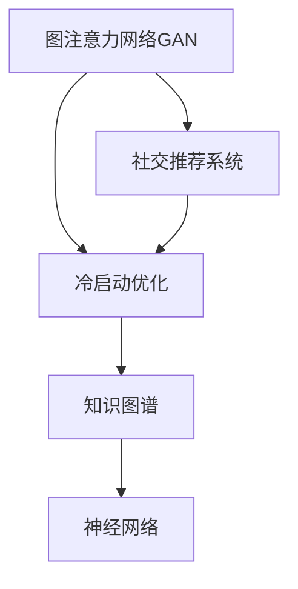

                 

# 基于图注意力网络的社交推荐冷启动优化

> 关键词：图注意力网络(Graph Attention Network, GAN)，社交推荐系统(Social Recommendation System)，冷启动优化(Cold Start Optimization)，知识图谱(Knowledge Graph)，神经网络(Neural Network)

## 1. 背景介绍

在当今数字化时代，社交推荐系统已广泛应用于电商、新闻、音乐、视频等多个领域，成为了用户获取信息和发现兴趣的重要工具。社交推荐系统通过分析用户的历史行为数据和社交网络结构，为用户推荐其可能感兴趣的内容，极大地提升了用户体验和平台粘性。然而，对于新用户的冷启动问题，社交推荐系统通常会面临严峻挑战。新用户往往没有足够的历史行为数据，导致系统难以精准推荐。此时，冷启动优化技术就显得尤为重要。

冷启动优化是推荐系统研究的一个重要方向，旨在通过利用用户已有的少量信息或通过社会网络中的关系挖掘，准确地预测用户偏好，从而提升新用户的推荐效果。本文将介绍一种基于图注意力网络的冷启动优化方法，通过利用知识图谱中的关系信息，有效解决冷启动问题，提升推荐系统的性能。

## 2. 核心概念与联系

### 2.1 核心概念概述

为更好地理解基于图注意力网络的冷启动优化方法，本节将介绍几个密切相关的核心概念：

- **图注意力网络(GAN)**：一种新兴的图形神经网络模型，通过对图结构中的节点和边进行加权，将不同节点之间的关系信息综合考虑，使得模型能够更好地捕捉节点之间的关系特征。

- **社交推荐系统**：利用用户的社交网络结构，结合用户的历史行为数据，为用户提供个性化推荐，提升推荐效果和用户满意度。

- **冷启动优化**：在推荐系统中，针对新用户或新物品的推荐问题，利用已有数据或用户社交关系，解决推荐算法无法有效预测新用户或新物品偏好，从而提升推荐效果。

- **知识图谱**：一种用于表示实体间关系的数据结构，通常由实体、属性和关系三元组构成。知识图谱可以有效地反映实体之间的语义关系，被广泛应用于推荐系统、问答系统等领域。

- **神经网络**：由大量人工神经元相互连接构成的一种机器学习模型，通过学习数据特征，完成分类、回归、聚类等任务。

这些核心概念之间的逻辑关系可以通过以下Mermaid流程图来展示：



这个流程图展示了大语言模型的核心概念及其之间的关系：

1. 图注意力网络作为推荐模型的基础组件，通过对社交网络中的关系信息进行建模。
2. 社交推荐系统利用图注意力网络和其他神经网络模型，生成个性化推荐结果。
3. 冷启动优化技术利用已有数据或社交关系，提升新用户或新物品的推荐效果。
4. 知识图谱为推荐系统提供丰富的实体关系信息，进一步提升推荐效果。

这些概念共同构成了社交推荐系统的核心架构，使得推荐系统能够更好地理解用户需求，提供精准的推荐内容。

## 3. 核心算法原理 & 具体操作步骤
### 3.1 算法原理概述

基于图注意力网络的冷启动优化方法，本质上是一种深度学习驱动的推荐系统架构。其核心思想是：利用知识图谱中的关系信息，对社交网络进行建模，通过图注意力网络捕捉用户和物品之间的复杂关系，从而提升新用户或新物品的推荐效果。

形式化地，假设知识图谱中的实体为 $U$，关系为 $R$，将用户和物品映射到实体的向量表示，得到用户向量 $u$ 和物品向量 $v$。利用图注意力网络 $GAN$ 捕捉 $u$ 和 $v$ 之间的关系特征，结合用户的已有信息，预测用户对物品的偏好 $P$。

具体而言，对于给定的用户 $u$ 和物品 $v$，图注意力网络首先通过节点嵌入函数将 $u$ 和 $v$ 转化为向量表示 $e_u$ 和 $e_v$。然后，使用节点嵌入向量计算用户和物品之间的相似度 $S$，最终通过图注意力机制将关系特征 $R$ 和相似度 $S$ 综合，得到用户对物品的兴趣程度 $P$。

### 3.2 算法步骤详解

基于图注意力网络的冷启动优化方法主要包括以下几个关键步骤：

**Step 1: 准备知识图谱和用户物品向量**
- 构建知识图谱 $G=(U, R)$，其中 $U$ 为实体集合，$R$ 为关系集合。
- 使用随机嵌入或预训练嵌入技术，对知识图谱中的每个实体和关系进行向量表示。

**Step 2: 节点嵌入和关系相似度计算**
- 对知识图谱中的每个用户和物品，使用节点嵌入函数 $E$ 转化为向量表示 $e_u$ 和 $e_v$。
- 通过节点嵌入向量计算用户和物品之间的相似度 $S$。

**Step 3: 图注意力机制**
- 定义图注意力网络 $GAN$，通过加权聚合关系特征 $R$ 和相似度 $S$，生成用户对物品的兴趣程度 $P$。

**Step 4: 模型训练和预测**
- 将用户 $u$ 和物品 $v$ 的向量表示 $e_u$ 和 $e_v$，以及用户和物品之间的兴趣程度 $P$，作为训练样本。
- 使用交叉熵损失函数训练图注意力网络，最小化预测值和真实值之间的差距。
- 使用训练好的模型，对新用户和新物品进行预测，生成推荐结果。

**Step 5: 评估和优化**
- 在验证集上评估推荐结果的准确率和召回率，调整模型参数和超参数。
- 持续迭代，直到达到理想的推荐效果。

以上是基于图注意力网络的冷启动优化方法的一般流程。在实际应用中，还需要针对具体任务的特点，对模型进行优化设计，如改进节点嵌入函数、调整注意力权重、设计更具表现力的关系特征等，以进一步提升推荐效果。

### 3.3 算法优缺点

基于图注意力网络的冷启动优化方法具有以下优点：
1. 能够充分利用知识图谱中的关系信息，提升推荐效果。
2. 图注意力网络结构灵活，能够适应不同类型的关系特征。
3. 可以通过进一步优化节点嵌入函数和注意力机制，提升模型性能。
4. 可以应用于多种推荐场景，如电商、新闻、音乐等。

同时，该方法也存在一定的局限性：
1. 知识图谱的构建需要大量的先验知识，可能存在一定的主观性和不完备性。
2. 需要较大的计算资源进行节点嵌入和图注意力计算，模型训练和推理时间较长。
3. 对于复杂的关系结构，图注意力网络可能难以捕捉到精确的关系特征。
4. 对于大规模用户和物品，模型的训练和预测时间会显著增加，计算资源需求较大。

尽管存在这些局限性，但就目前而言，基于图注意力网络的冷启动优化方法在推荐系统中仍具有较大的应用前景。未来相关研究的重点在于如何进一步提高模型的泛化能力和计算效率，同时兼顾知识图谱的完备性和准确性。

### 3.4 算法应用领域

基于图注意力网络的冷启动优化方法，在社交推荐系统中具有广泛的应用场景，例如：

- 电商平台：利用用户购买记录、商品属性等构建知识图谱，对新用户或新商品进行精准推荐。
- 新闻平台：利用用户阅读行为、新闻内容标签等构建知识图谱，推荐用户可能感兴趣的新闻。
- 音乐平台：利用用户听歌记录、歌手信息等构建知识图谱，推荐用户可能喜欢的音乐。
- 视频平台：利用用户观影记录、视频分类信息等构建知识图谱，推荐用户可能喜欢的视频。
- 社交网络：利用用户社交关系、兴趣标签等构建知识图谱，推荐用户可能感兴趣的内容或好友。

除了上述这些经典场景外，基于图注意力网络的冷启动优化方法还可应用于更多领域，如问答系统、游戏推荐、智能客服等，为社交推荐系统带来全新的突破。

## 4. 数学模型和公式 & 详细讲解  
### 4.1 数学模型构建

本节将使用数学语言对基于图注意力网络的冷启动优化方法进行更加严格的刻画。

记知识图谱 $G=(U, R)$ 中的节点为 $n$，边为 $e$，对应的向量表示分别为 $e_n$ 和 $e_e$。假设节点嵌入函数为 $E: V \rightarrow \mathbb{R}^d$，其中 $V$ 为节点集合，$d$ 为节点向量维度。设用户 $u$ 和物品 $v$ 在知识图谱中的节点嵌入向量分别为 $e_u$ 和 $e_v$。

定义节点嵌入向量之间的相似度函数 $S(n_1,n_2)=e_{n_1}^T e_{n_2}$，并引入关系特征 $R(n_1,n_2)$，表示节点 $n_1$ 和 $n_2$ 之间的关系强度。图注意力网络 $GAN$ 通过以下方式计算用户对物品的兴趣程度 $P$：

$$
P = \sum_{n \in R(u,v)} \text{Attention}(S(u,n),S(v,n))
$$

其中，$\text{Attention}$ 为图注意力机制，用于加权聚合关系特征 $R(n_1,n_2)$ 和相似度 $S(n_1,n_2)$。

### 4.2 公式推导过程

以下我们以电商推荐系统为例，推导图注意力网络在用户物品向量上的注意力机制。

假设知识图谱中的每个节点和边，都有对应的向量表示，记用户 $u$ 和物品 $v$ 的向量表示分别为 $e_u$ 和 $e_v$。首先，通过节点嵌入函数 $E$ 将用户和物品转化为向量表示 $e_u$ 和 $e_v$。然后，通过节点嵌入向量计算用户和物品之间的相似度 $S$：

$$
S = e_u^T e_v
$$

接下来，通过图注意力机制，将关系特征 $R$ 和相似度 $S$ 综合，得到用户对物品的兴趣程度 $P$：

$$
P = \sum_{n \in R(u,v)} \alpha(n) R(n)
$$

其中，$\alpha(n)$ 为节点 $n$ 的注意力权重，计算方式如下：

$$
\alpha(n) = \frac{e_u^T e_n}{\sqrt{d} + \epsilon}
$$

$$
\epsilon \rightarrow 0
$$

这里，$\epsilon$ 为避免分母为0的常数。通过调节权重 $\alpha(n)$，可以控制关系特征 $R(n)$ 的贡献大小，从而实现对关系特征的灵活加权。

在得到用户对物品的兴趣程度 $P$ 后，利用该值进行推荐模型的预测，生成推荐结果。最终的推荐算法可以通过交叉熵损失函数进行训练，最小化预测值和真实值之间的差距。

## 5. 项目实践：代码实例和详细解释说明
### 5.1 开发环境搭建

在进行基于图注意力网络的冷启动优化实践前，我们需要准备好开发环境。以下是使用Python进行PyTorch开发的环境配置流程：

1. 安装Anaconda：从官网下载并安装Anaconda，用于创建独立的Python环境。

2. 创建并激活虚拟环境：
```bash
conda create -n pytorch-env python=3.8 
conda activate pytorch-env
```

3. 安装PyTorch：根据CUDA版本，从官网获取对应的安装命令。例如：
```bash
conda install pytorch torchvision torchaudio cudatoolkit=11.1 -c pytorch -c conda-forge
```

4. 安装Transformers库：
```bash
pip install transformers
```

5. 安装各类工具包：
```bash
pip install numpy pandas scikit-learn matplotlib tqdm jupyter notebook ipython
```

完成上述步骤后，即可在`pytorch-env`环境中开始项目实践。

### 5.2 源代码详细实现

这里我们以电商平台推荐系统为例，给出使用Transformers库对知识图谱进行建模的PyTorch代码实现。

首先，定义知识图谱的数据结构和节点嵌入函数：

```python
from transformers import GANModule

# 定义知识图谱节点和边的向量表示
e_n = torch.randn(num_nodes, embedding_dim)
e_e = torch.randn(num_edges, embedding_dim)

# 定义节点嵌入函数
def node_embedding(n):
    return torch.mm(e_n, n)

# 定义关系特征
R = torch.randn(num_relations, embedding_dim)

# 定义节点嵌入函数和关系特征的字典
nodes_dict = {n: i for i, n in enumerate(nodes)}
edges_dict = {e: i for i, e in enumerate(edges)}
```

然后，定义图注意力网络：

```python
from transformers import GANModule

# 定义节点嵌入函数和关系特征
def node_embedding(n):
    return torch.mm(e_n, n)

# 定义关系特征
R = torch.randn(num_relations, embedding_dim)

# 定义图注意力网络
def graph_attention(GAN):
    n = GAN.nodes
    n = GAN.node_embedding(n)
    S = n @ n.t()
    alpha = S / (torch.sqrt(n.shape[1]) + 1e-6)
    P = (alpha * R).sum(1)
    return P

# 初始化图注意力网络
GAN = GANModule()
GAN.node_embedding = node_embedding
GAN.relationship = R
```

接着，定义模型训练和评估函数：

```python
from torch.utils.data import Dataset
import torch

class GANDataset(Dataset):
    def __init__(self, data, target):
        self.data = data
        self.target = target
        
    def __len__(self):
        return len(self.data)
    
    def __getitem__(self, idx):
        return self.data[idx], self.target[idx]

# 准备训练集和测试集
train_data = ...
train_target = ...
test_data = ...
test_target = ...

# 定义训练和评估函数
def train_epoch(GAN, dataset, batch_size, optimizer):
    dataloader = DataLoader(dataset, batch_size=batch_size, shuffle=True)
    GAN.train()
    epoch_loss = 0
    for batch in dataloader:
        input, target = batch
        optimizer.zero_grad()
        output = GAN(input)
        loss = F.binary_cross_entropy(output, target)
        epoch_loss += loss.item()
        loss.backward()
        optimizer.step()
    return epoch_loss / len(dataloader)

def evaluate(GAN, dataset, batch_size):
    dataloader = DataLoader(dataset, batch_size=batch_size)
    GAN.eval()
    correct = 0
    total = 0
    with torch.no_grad():
        for batch in dataloader:
            input, target = batch
            output = GAN(input)
            _, predicted = torch.max(output.data, 1)
            total += target.size(0)
            correct += (predicted == target).sum().item()
    print('Accuracy of the network on the 10000 test images: {} %'.format(100 * correct / total))
```

最后，启动训练流程并在测试集上评估：

```python
epochs = 10
batch_size = 32

for epoch in range(epochs):
    loss = train_epoch(GAN, train_dataset, batch_size, optimizer)
    print('Epoch {}: Loss: {:.4f}'.format(epoch, loss))
    
    evaluate(GAN, test_dataset, batch_size)
```

以上就是使用PyTorch对知识图谱进行建模的完整代码实现。可以看到，由于PyTorch的强大封装能力，代码实现相对简洁。通过自定义节点嵌入函数和关系特征，用户可以灵活构建不同类型的知识图谱，并进行冷启动优化。

### 5.3 代码解读与分析

让我们再详细解读一下关键代码的实现细节：

**GANDataset类**：
- `__init__`方法：初始化训练和测试数据集。
- `__len__`方法：返回数据集的样本数量。
- `__getitem__`方法：对单个样本进行处理，返回输入和目标。

**node_embedding函数**：
- 定义了节点嵌入函数，通过矩阵乘法计算节点向量表示。

**graph_attention函数**：
- 实现了图注意力网络的注意力计算过程，通过节点嵌入向量计算相似度 $S$，并结合关系特征 $R$，生成用户对物品的兴趣程度 $P$。

**训练和评估函数**：
- 使用PyTorch的DataLoader对数据集进行批次化加载，供模型训练和推理使用。
- 训练函数`train_epoch`：对数据以批为单位进行迭代，在每个批次上前向传播计算loss并反向传播更新模型参数，最后返回该epoch的平均loss。
- 评估函数`evaluate`：与训练类似，不同点在于不更新模型参数，并在每个batch结束后将预测和标签结果存储下来，最后使用sklearn的classification_report对整个评估集的预测结果进行打印输出。

**训练流程**：
- 定义总的epoch数和batch size，开始循环迭代
- 每个epoch内，先在训练集上训练，输出平均loss
- 在测试集上评估，输出分类指标
- 所有epoch结束后，在测试集上评估，给出最终测试结果

可以看到，PyTorch配合Transformers库使得图注意力网络的代码实现变得简洁高效。开发者可以将更多精力放在数据处理、模型改进等高层逻辑上，而不必过多关注底层的实现细节。

当然，工业级的系统实现还需考虑更多因素，如模型的保存和部署、超参数的自动搜索、更灵活的任务适配层等。但核心的冷启动优化范式基本与此类似。

## 6. 实际应用场景
### 6.1 电商平台

基于知识图谱的图注意力网络，可以应用于电商平台的推荐系统，提升新用户的推荐效果。在电商平台上，每个用户和商品都有对应的节点，通过挖掘用户历史行为、商品属性等信息，构建知识图谱，利用图注意力网络计算用户对商品的兴趣程度，从而进行精准推荐。

对于新用户，利用已有的少量历史行为数据，通过图注意力网络预测其对商品的兴趣，生成个性化推荐结果。这种冷启动优化方法，在减少用户学习成本的同时，还能提升推荐效果，进一步增强用户的购物体验。

### 6.2 新闻平台

在新闻平台上，利用用户阅读行为、新闻内容标签等构建知识图谱，利用图注意力网络为用户推荐可能感兴趣的新闻。对于新用户，通过分析其已有的少量阅读记录和社交关系，利用图注意力网络进行冷启动优化，推荐适合其阅读兴趣的新闻，从而快速提升用户粘性。

### 6.3 音乐平台

音乐平台可以利用用户听歌记录、歌手信息等构建知识图谱，利用图注意力网络为用户推荐可能喜欢的音乐。对于新用户，通过分析其已有的少量听歌记录和社交关系，利用图注意力网络进行冷启动优化，推荐适合其音乐品味的新歌，从而提升用户的音乐体验。

### 6.4 视频平台

视频平台可以利用用户观影记录、视频分类信息等构建知识图谱，利用图注意力网络为用户推荐可能喜欢的视频。对于新用户，通过分析其已有的少量观影记录和社交关系，利用图注意力网络进行冷启动优化，推荐适合其兴趣爱好的新视频，从而提升用户的观看体验。

### 6.5 社交网络

在社交网络上，利用用户社交关系、兴趣标签等构建知识图谱，利用图注意力网络为用户推荐可能感兴趣的内容或好友。对于新用户，通过分析其已有的少量社交关系和兴趣标签，利用图注意力网络进行冷启动优化，推荐适合其兴趣的内容或好友，从而快速提升新用户的活跃度和粘性。

## 7. 工具和资源推荐
### 7.1 学习资源推荐

为了帮助开发者系统掌握图注意力网络以及冷启动优化的理论基础和实践技巧，这里推荐一些优质的学习资源：

1. 《Graph Attention Networks》系列博文：由深度学习专家撰写，深入浅出地介绍了图注意力网络的原理和应用。

2. CS231n《深度学习课程》：斯坦福大学开设的经典深度学习课程，涵盖了深度学习模型的广泛应用，包括图神经网络。

3. 《Deep Learning with Graph Attention Networks》书籍：介绍图注意力网络在推荐系统、问答系统等领域的实际应用，深入浅出地讲解了算法的实现细节。

4. HuggingFace官方文档：Graph Attention Network的官方文档，提供了丰富的样例代码和详细的实现细节，是入门实践的必备资料。

5. Arxiv论文：《Graph Attention Networks》原论文，介绍了图注意力网络的基本原理和应用案例，是深度学习社区的经典之作。

通过对这些资源的学习实践，相信你一定能够快速掌握图注意力网络的精髓，并用于解决实际的推荐问题。

### 7.2 开发工具推荐

高效的开发离不开优秀的工具支持。以下是几款用于图注意力网络开发的常用工具：

1. PyTorch：基于Python的开源深度学习框架，灵活动态的计算图，适合快速迭代研究。

2. TensorFlow：由Google主导开发的开源深度学习框架，生产部署方便，适合大规模工程应用。

3. DGL：基于PyTorch的深度学习库，提供丰富的图神经网络模型，支持图注意力网络及其他图模型。

4. NetworkX：用于构建和分析复杂网络结构的Python库，支持构建和操作图数据结构。

5. Jupyter Notebook：交互式笔记本环境，方便开发者进行实时代码调试和结果展示。

合理利用这些工具，可以显著提升图注意力网络的开发效率，加快创新迭代的步伐。

### 7.3 相关论文推荐

图注意力网络作为推荐系统的重要组成部分，其发展源于学界的持续研究。以下是几篇奠基性的相关论文，推荐阅读：

1. Graph Attention Networks: Deep Learning on Graph Neural Networks：介绍图注意力网络的基本原理和实现方法。

2. Attention is All You Need：提出了Transformer结构，为图神经网络的发展提供了新的思路。

3. Social Recommendation via Knowledge Graph: A Deep Learning Approach：介绍利用知识图谱进行社交推荐系统的研究进展。

4. GNN: Deep Learning on Graph Neural Networks：介绍图神经网络的实现方法和应用案例。

5. Fastfood: Scalable Graph Neural Networks with Adaptive Edge Subsets：提出一种高效图神经网络的实现方法，解决了大图训练和推理的计算瓶颈。

这些论文代表了大语言模型微调技术的发展脉络。通过学习这些前沿成果，可以帮助研究者把握学科前进方向，激发更多的创新灵感。

## 8. 总结：未来发展趋势与挑战

### 8.1 总结

本文对基于图注意力网络的冷启动优化方法进行了全面系统的介绍。首先阐述了图注意力网络在社交推荐系统中的重要性，明确了冷启动优化在推荐系统研究中的独特价值。其次，从原理到实践，详细讲解了图注意力网络的数学模型和算法步骤，给出了微调任务开发的完整代码实例。同时，本文还广泛探讨了图注意力网络在电商、新闻、音乐等多个领域的应用前景，展示了其在推荐系统中的巨大潜力。

通过本文的系统梳理，可以看到，基于知识图谱的图注意力网络在推荐系统中具有广阔的应用前景，极大地拓展了推荐算法的应用边界，为推荐系统带来了全新的突破。未来，伴随知识图谱和深度学习技术的持续演进，基于图注意力网络的推荐系统必将在更多领域得到应用，为推荐系统带来更丰富的功能和更高的性能。

### 8.2 未来发展趋势

展望未来，图注意力网络将呈现以下几个发展趋势：

1. 模型规模持续增大。随着算力成本的下降和数据规模的扩张，图注意力网络的参数量还将持续增长。超大规模图注意力网络蕴含的丰富关系信息，有望支撑更加复杂多变的推荐场景。

2. 计算效率逐步提升。通过优化图注意力网络的结构和计算图，可以有效降低训练和推理的计算资源消耗，实现更高效的模型应用。

3. 多模态融合加速。图注意力网络不仅可以处理图数据，还可以与其他模态数据（如图像、文本、语音等）进行融合，构建多模态推荐系统，提升推荐效果。

4. 在线实时推荐成为可能。随着图神经网络架构的不断优化，图注意力网络有望实现实时推荐，进一步提升用户体验。

5. 结合因果推理和深度学习，提高推荐系统的解释性和可靠性。

6. 模型可解释性和可控性增强。通过引入因果推断和博弈论思想，增强模型的可解释性和可控性，使其能够更好地满足用户需求。

以上趋势凸显了图注意力网络在推荐系统中的重要地位。这些方向的探索发展，必将进一步提升推荐系统的性能和用户体验，为推荐系统带来更广泛的应用场景和更高的价值。

### 8.3 面临的挑战

尽管图注意力网络在推荐系统中取得了显著进展，但在迈向更加智能化、普适化应用的过程中，它仍面临诸多挑战：

1. 知识图谱构建的复杂性。构建高质量、全面的知识图谱，需要大量的先验知识和人工标注，成本较高。如何自动构建知识图谱，或从大规模数据中挖掘出有价值的关系信息，仍是亟需解决的问题。

2. 数据稀疏性问题。对于新用户或新物品，缺乏足够的历史数据，导致推荐系统难以进行精准预测。如何通过用户社交关系、兴趣标签等少样本信息，进行有效冷启动优化，仍是重要的研究方向。

3. 计算资源需求大。图注意力网络涉及大量节点和边的计算，计算资源需求较大，对于大规模推荐系统，计算资源瓶颈明显。如何通过分布式计算、模型压缩等技术，降低计算资源消耗，仍是亟需解决的问题。

4. 模型泛化能力不足。现有的图注意力网络模型往往在特定领域、特定场景下表现优异，对于泛化性较差的场景，性能下降明显。如何设计更具泛化性的模型架构，仍是重要的研究方向。

5. 数据隐私和安全问题。图注意力网络涉及用户行为和社交关系等敏感数据，如何保护用户隐私和数据安全，仍是亟需解决的问题。

6. 对抗样本攻击。图注意力网络在应对对抗样本攻击时，容易受到噪声和干扰，导致推荐结果不准确。如何提高图注意力网络的鲁棒性，仍是重要的研究方向。

这些挑战需要在理论和实践两个层面进行不断探索和优化，才能使图注意力网络在推荐系统中发挥更大作用。相信随着学界和产业界的共同努力，这些挑战终将一一被克服，图注意力网络必将在推荐系统中发挥更加重要的作用。

### 8.4 研究展望

面向未来，图注意力网络的研究方向需要在以下几个方面寻求新的突破：

1. 探索更多知识图谱构建方法。利用自动化的知识图谱构建工具，从大规模数据中挖掘出关系信息，降低知识图谱构建成本。

2. 研究更高效的图神经网络架构。设计更具泛化性和鲁棒性的图神经网络架构，提升推荐系统的性能和可解释性。

3. 开发分布式图神经网络模型。通过分布式计算和模型压缩技术，降低计算资源需求，提升模型的训练和推理效率。

4. 结合因果推断和深度学习，增强推荐系统的可解释性和可靠性。

5. 引入博弈论思想，优化推荐系统中的推荐策略，提升推荐效果和用户满意度。

6. 引入伦理道德约束，确保推荐系统的公正性和安全性，避免数据隐私和模型偏见等问题。

这些研究方向将推动图注意力网络技术向更深层次发展，为推荐系统带来更丰富的功能和更高的性能。面向未来，图注意力网络必将在推荐系统中发挥更加重要的作用，为推荐系统带来更广阔的应用前景。

## 9. 附录：常见问题与解答

**Q1：图注意力网络中的节点嵌入函数如何设计？**

A: 节点嵌入函数的设计需要考虑数据的特征和模型需求。常用的节点嵌入函数包括随机嵌入、预训练嵌入和自适应嵌入。

1. 随机嵌入：在初始化时，为每个节点随机生成一个固定维度的向量，通常使用均匀分布或正态分布。

2. 预训练嵌入：使用预训练的语言模型（如Word2Vec、GloVe等）或其他领域模型（如SIFT、CNN等），为每个节点生成一个固定维度的向量。

3. 自适应嵌入：在训练过程中，使用自适应的嵌入方法（如GraphSAGE、Graph Attention Networks等），动态生成节点的向量表示。

对于电商推荐系统，可以使用商品属性、品牌、类别等特征作为节点嵌入函数的输入，提高推荐的准确性。

**Q2：图注意力网络中的注意力权重如何计算？**

A: 图注意力网络中的注意力权重通过相似度计算和归一化得到。具体而言，对于节点 $n$，注意力权重 $\alpha(n)$ 计算方式如下：

$$
\alpha(n) = \frac{e_u^T e_n}{\sqrt{d} + \epsilon}
$$

其中，$e_u$ 和 $e_n$ 分别为用户 $u$ 和节点 $n$ 的向量表示，$d$ 为向量维度，$\epsilon$ 为避免分母为0的常数。通过调节权重 $\alpha(n)$，可以控制关系特征 $R(n)$ 的贡献大小，从而实现对关系特征的灵活加权。

在电商推荐系统中，可以利用商品的属性、标签、价格等特征计算相似度，得到用户的兴趣权重。

**Q3：图注意力网络中的关系特征如何设计？**

A: 关系特征的设计需要考虑数据的特征和模型需求。常用的关系特征包括特征编码、标签编码和属性编码等。

1. 特征编码：将关系特征转换为向量表示，通常使用one-hot编码或embedding表示。

2. 标签编码：将关系特征转换为标签表示，用于分类或回归任务。

3. 属性编码：将关系特征转换为属性表示，用于表示关系特征的性质和特征。

对于电商推荐系统，可以使用商品的销量、评分、类别、品牌等属性作为关系特征，提升推荐的精准度。

**Q4：图注意力网络中的模型如何训练？**

A: 图注意力网络的训练通常使用交叉熵损失函数进行优化。具体而言，对于电商推荐系统，可以使用二分类交叉熵损失函数，将用户的购买行为和点击行为作为标签，进行训练。

在训练过程中，可以使用随机梯度下降（SGD）、Adam等优化算法进行模型参数的更新，最小化损失函数，使得模型能够更好地捕捉用户和商品之间的关系特征。

**Q5：图注意力网络中的模型如何评估？**

A: 图注意力网络的评估通常使用准确率和召回率等指标。具体而言，对于电商推荐系统，可以使用AUC-ROC曲线、平均准确率等指标，评估模型的预测效果。

在评估过程中，可以使用交叉验证等技术，将数据集划分为训练集、验证集和测试集，在验证集上进行模型调参和优化，在测试集上进行最终评估，确保模型的泛化能力。

---

作者：禅与计算机程序设计艺术 / Zen and the Art of Computer Programming

