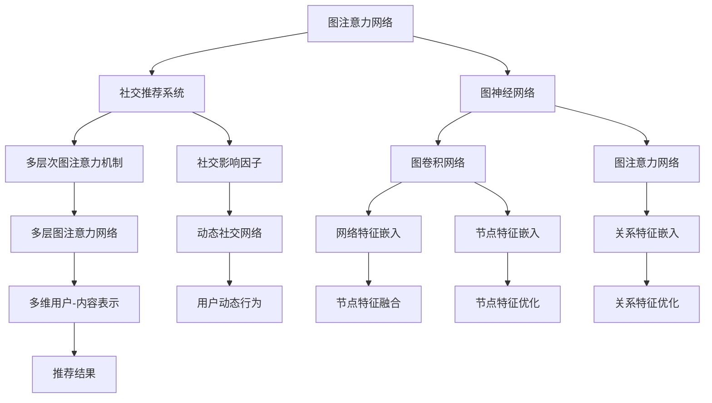

                 

## 1. 背景介绍

### 1.1 问题由来

在数字化时代的浪潮下，社交网络成为了人们获取信息和交流互动的重要平台。而推荐系统作为社交网络中的关键组成部分，承担着帮助用户发现感兴趣内容的重要职责。传统的推荐算法往往基于内容、协同过滤等单一维度进行用户与内容的匹配，难以综合考虑用户复杂的行为模式和动态兴趣。

近年来，图神经网络（Graph Neural Network, GNN）在处理图结构数据方面的卓越表现，逐渐成为推荐系统的重要工具。然而，现有的图神经网络推荐算法往往更注重节点间的关系，忽略了节点特征与关系特征的耦合影响。

基于此，本文提出了一种基于图注意力网络（Graph Attention Network, GAN）的社交推荐算法，旨在更好地综合用户行为数据与社交网络关系特征，提高推荐系统的准确性和鲁棒性。

### 1.2 问题核心关键点

本文的核心在于：

1. 利用图注意力网络，将用户行为数据与社交网络关系特征进行融合，构建多维度的用户-内容表示。
2. 设计多层次的图注意力机制，在节点特征和关系特征之间建立交互机制，强化用户对社交网络的动态感知。
3. 引入社交网络中的影响因子，平衡不同用户间的影响关系，避免网络中的信息过载。
4. 采用多层次的模型优化策略，提升模型的收敛速度和泛化能力。

### 1.3 问题研究意义

社交推荐系统作为现代互联网的重要应用，涉及海量的用户行为数据和复杂的社交网络关系。利用图注意力网络等深度学习技术，可以更好地理解和处理这些复杂数据，提升推荐系统的智能化和个性化水平。

研究基于图注意力网络的社交推荐算法，对于拓展推荐系统的应用范围，提升推荐效果的鲁棒性和泛化能力，具有重要的理论和实际意义：

1. 提升推荐系统的智能化水平。通过融合用户行为数据和社交网络关系，能够更加精准地捕捉用户兴趣变化，提供个性化的推荐服务。
2. 增强推荐系统的鲁棒性。图注意力网络能够有效处理网络中的噪音和异质性数据，提升推荐系统的稳定性和可靠性。
3. 提高推荐系统的泛化能力。多层次的图注意力机制和社交影响因子，能够更好地应对大规模数据和复杂网络结构的挑战。
4. 降低推荐系统的标注成本。利用图神经网络的无监督特征学习能力，能够减少对人工标注数据的依赖，降低推荐系统的开发成本。

## 2. 核心概念与联系

### 2.1 核心概念概述

本文涉及几个核心概念，包括图注意力网络、社交推荐系统、图神经网络等，其定义和作用如下：

- **图注意力网络（Graph Attention Network, GAN）**：一种利用注意力机制来处理图结构数据的深度学习方法。通过在节点特征和边特征之间引入注意力权重，可以更好地捕捉节点间的关系特征和局部信息。
- **社交推荐系统（Social Recommendation System）**：结合用户社交网络和行为数据，为用户提供个性化推荐的应用系统。社交网络提供了丰富的用户动态信息，有助于提升推荐系统的个性化和实时性。
- **图神经网络（Graph Neural Network, GNN）**：一类能够处理图结构数据深度学习的算法。通过图卷积网络、图注意力网络等方法，可以提取图结构数据的高级表示，用于推荐、分类、聚类等多种任务。

这些核心概念之间的联系可以通过以下Mermaid流程图来展示：



这个流程图展示了大语言模型微调的核心概念及其之间的关系：

1. 社交推荐系统通过图注意力网络融合用户行为数据和社交网络关系，构建多维度的用户-内容表示。
2. 图注意力网络通过多层次图注意力机制，在节点特征和关系特征之间建立交互机制，强化用户对社交网络的动态感知。
3. 图神经网络通过图卷积网络和图注意力网络，提取图结构数据的高级表示，用于节点特征嵌入和关系特征嵌入。
4. 动态社交网络通过用户动态行为数据和社交影响因子，提升推荐系统的个性化和实时性。

这些概念共同构成了社交推荐系统的学习框架，使其能够在复杂的网络结构中高效地进行推荐。

## 3. 核心算法原理 & 具体操作步骤
### 3.1 算法原理概述

本文提出的社交推荐算法主要基于图注意力网络和社交网络的多层次特征融合。核心算法原理如下：

1. **节点特征嵌入**：将用户行为数据和社交网络关系特征进行向量化，获得初始的节点特征表示。
2. **关系特征嵌入**：通过图卷积网络对关系特征进行嵌入，获得初始的关系特征表示。
3. **多层次图注意力机制**：设计多层次的图注意力机制，在节点特征和关系特征之间建立交互，优化用户-内容表示。
4. **社交影响因子**：引入社交网络中的影响因子，平衡不同用户间的影响关系，避免网络中的信息过载。
5. **推荐结果生成**：通过多层次图注意力网络，生成最终的用户-内容表示，并用于推荐结果的生成。

### 3.2 算法步骤详解

本文的社交推荐算法主要分为以下几个步骤：

**Step 1: 数据预处理**

1. **用户行为数据预处理**：将用户的行为数据（如浏览记录、点赞记录、评论记录等）转换为图结构数据，构建用户行为网络。
2. **社交网络数据预处理**：将用户的社交网络数据（如好友关系、关注关系等）转换为图结构数据，构建社交网络图。
3. **特征提取与归一化**：对节点特征和关系特征进行提取与归一化处理，保证数据的可处理性。

**Step 2: 图卷积网络与图注意力网络**

1. **图卷积网络（GCN）**：对关系特征进行卷积操作，获取关系特征表示。
2. **图注意力网络（GAN）**：对节点特征和关系特征进行注意力机制计算，获得多维度的用户-内容表示。

**Step 3: 多层次图注意力机制**

1. **多层次图注意力机制**：设计多层次的图注意力机制，在节点特征和关系特征之间建立交互，优化用户-内容表示。
2. **社交影响因子计算**：引入社交网络中的影响因子，平衡不同用户间的影响关系，避免网络中的信息过载。

**Step 4: 推荐结果生成**

1. **多维用户-内容表示**：通过多层次图注意力网络，生成最终的用户-内容表示。
2. **推荐结果排序**：对用户-内容表示进行排序，生成推荐结果。

**Step 5: 模型评估与优化**

1. **模型评估**：在测试集上评估模型的推荐效果，通过准确率、召回率等指标进行评估。
2. **模型优化**：根据模型评估结果，调整模型参数和超参数，优化模型性能。

### 3.3 算法优缺点

本文提出的基于图注意力网络的社交推荐算法具有以下优点：

1. **多维特征融合**：通过融合用户行为数据和社交网络关系特征，能够更加全面地理解用户兴趣和行为模式。
2. **动态社交感知**：多层次的图注意力机制能够动态捕捉用户与社交网络的交互关系，提升推荐系统的个性化和实时性。
3. **鲁棒性增强**：社交影响因子的引入能够平衡不同用户间的影响关系，避免网络中的信息过载，提升推荐系统的鲁棒性。
4. **高效计算**：图卷积网络和图注意力网络的结合，能够高效地提取图结构数据的高级表示，适用于大规模数据的处理。

同时，该算法也存在一些缺点：

1. **模型复杂度高**：多层次图注意力机制和社交影响因子的引入，增加了模型的计算复杂度和训练难度。
2. **数据稀疏性问题**：社交网络中的用户关系往往是不完全的，数据稀疏性问题会影响算法的性能。
3. **模型参数量大**：基于深度学习的推荐算法，模型参数量较大，需要较多的计算资源。
4. **过度拟合风险**：在处理复杂数据结构时，模型容易过度拟合训练数据，影响泛化性能。

### 3.4 算法应用领域

本文提出的基于图注意力网络的社交推荐算法，主要应用于以下几个领域：

1. **电子商务推荐**：通过融合用户行为数据和社交网络关系，为电商用户提供个性化商品推荐。
2. **社交媒体推荐**：结合用户动态行为和社交网络关系，为社交媒体用户推荐内容。
3. **新闻推荐**：通过分析用户阅读历史和社交网络关系，为新闻用户推荐感兴趣的新闻内容。
4. **教育推荐**：结合学生学习行为和教师社交网络，为学生推荐学习资源和教学内容。

## 4. 数学模型和公式 & 详细讲解  
### 4.1 数学模型构建

本文提出的社交推荐算法主要通过图注意力网络进行多维特征融合和动态社交感知。数学模型如下：

1. **节点特征嵌入**：
   $$
   h_i = \sigma(\mathbf{W}_h \mathbf{x}_i + \mathbf{b}_h)
   $$
   其中，$h_i$ 表示用户 $i$ 的节点特征嵌入，$\mathbf{W}_h$ 和 $\mathbf{b}_h$ 分别表示节点特征嵌入的权重矩阵和偏置向量，$\sigma$ 为激活函数（如 ReLU）。

2. **关系特征嵌入**：
   $$
   r_{ij} = \sigma(\mathbf{W}_r \mathbf{h}_i \mathbf{h}_j^T + \mathbf{b}_r)
   $$
   其中，$r_{ij}$ 表示用户 $i$ 和用户 $j$ 之间的关系特征嵌入，$\mathbf{W}_r$ 和 $\mathbf{b}_r$ 分别表示关系特征嵌入的权重矩阵和偏置向量。

3. **多层次图注意力机制**：
   $$
   \alpha_{ij} = \sigma(\mathbf{W}_\alpha \mathbf{h}_i \mathbf{h}_j^T + \mathbf{b}_\alpha)
   $$
   $$
   \tilde{\mathbf{h}}_i = \sum_{j=1}^N \alpha_{ij} \mathbf{h}_j
   $$
   其中，$\alpha_{ij}$ 表示节点 $i$ 和节点 $j$ 之间的注意力权重，$\mathbf{W}_\alpha$ 和 $\mathbf{b}_\alpha$ 分别表示注意力机制的权重矩阵和偏置向量，$\tilde{\mathbf{h}}_i$ 表示节点 $i$ 的多维用户-内容表示。

4. **社交影响因子**：
   $$
   \mathbf{S} = \mathbf{D}^{-\frac{1}{2}} \mathbf{A} \mathbf{D}^{-\frac{1}{2}}
   $$
   其中，$\mathbf{S}$ 表示社交网络的影响因子矩阵，$\mathbf{A}$ 表示社交网络邻接矩阵，$\mathbf{D}$ 表示社交网络度数矩阵。

5. **推荐结果生成**：
   $$
   \mathbf{y} = \sigma(\mathbf{W}_y \mathbf{z} + \mathbf{b}_y)
   $$
   其中，$\mathbf{z}$ 表示用户-内容表示，$\mathbf{y}$ 表示推荐结果。

### 4.2 公式推导过程

本文的核心公式主要通过图卷积网络、图注意力网络、注意力机制等技术进行推导。以下对关键公式进行推导：

1. **节点特征嵌入**
   $$
   h_i = \sigma(\mathbf{W}_h \mathbf{x}_i + \mathbf{b}_h)
   $$
   其中，$\sigma$ 为激活函数，$\mathbf{W}_h$ 和 $\mathbf{b}_h$ 分别表示节点特征嵌入的权重矩阵和偏置向量。

2. **关系特征嵌入**
   $$
   r_{ij} = \sigma(\mathbf{W}_r \mathbf{h}_i \mathbf{h}_j^T + \mathbf{b}_r)
   $$
   其中，$\sigma$ 为激活函数，$\mathbf{W}_r$ 和 $\mathbf{b}_r$ 分别表示关系特征嵌入的权重矩阵和偏置向量。

3. **多层次图注意力机制**
   $$
   \alpha_{ij} = \sigma(\mathbf{W}_\alpha \mathbf{h}_i \mathbf{h}_j^T + \mathbf{b}_\alpha)
   $$
   $$
   \tilde{\mathbf{h}}_i = \sum_{j=1}^N \alpha_{ij} \mathbf{h}_j
   $$
   其中，$\sigma$ 为激活函数，$\mathbf{W}_\alpha$ 和 $\mathbf{b}_\alpha$ 分别表示注意力机制的权重矩阵和偏置向量。

4. **社交影响因子**
   $$
   \mathbf{S} = \mathbf{D}^{-\frac{1}{2}} \mathbf{A} \mathbf{D}^{-\frac{1}{2}}
   $$
   其中，$\mathbf{A}$ 表示社交网络邻接矩阵，$\mathbf{D}$ 表示社交网络度数矩阵。

5. **推荐结果生成**
   $$
   \mathbf{y} = \sigma(\mathbf{W}_y \mathbf{z} + \mathbf{b}_y)
   $$
   其中，$\sigma$ 为激活函数，$\mathbf{W}_y$ 和 $\mathbf{b}_y$ 分别表示推荐结果的权重矩阵和偏置向量。

### 4.3 案例分析与讲解

以社交网络中的好友推荐为例，分析图注意力网络的多层次图注意力机制：

1. **用户行为网络构建**：构建好友关系网络，节点表示用户，边表示好友关系。
2. **用户行为数据预处理**：将用户浏览记录、点赞记录等行为数据转化为图结构数据。
3. **社交网络数据预处理**：将好友关系数据转化为图结构数据。
4. **节点特征嵌入**：通过节点特征嵌入计算，获得用户和好友节点的特征表示。
5. **关系特征嵌入**：通过关系特征嵌入计算，获得好友关系特征表示。
6. **多层次图注意力机制**：通过多层次图注意力机制计算，获得用户和好友节点的多维用户-内容表示。
7. **社交影响因子计算**：通过社交影响因子计算，平衡好友间的影响关系。
8. **推荐结果生成**：通过多维用户-内容表示生成推荐结果。

## 5. 项目实践：代码实例和详细解释说明
### 5.1 开发环境搭建

在进行社交推荐算法开发前，我们需要准备好开发环境。以下是使用Python进行PyTorch开发的环境配置流程：

1. 安装Anaconda：从官网下载并安装Anaconda，用于创建独立的Python环境。

2. 创建并激活虚拟环境：
```bash
conda create -n pytorch-env python=3.8 
conda activate pytorch-env
```

3. 安装PyTorch：根据CUDA版本，从官网获取对应的安装命令。例如：
```bash
conda install pytorch torchvision torchaudio cudatoolkit=11.1 -c pytorch -c conda-forge
```

4. 安装相关库：
```bash
pip install networkx numpy pandas torch torch-cluster torch-geometric tqdm jupyter notebook ipython
```

完成上述步骤后，即可在`pytorch-env`环境中开始社交推荐算法的开发。

### 5.2 源代码详细实现

以下是一个基于图注意力网络的社交推荐算法的完整代码实现，包括数据预处理、图卷积网络、多层次图注意力机制、推荐结果生成等步骤。

```python
import networkx as nx
import numpy as np
import pandas as pd
import torch
import torch.nn as nn
import torch.nn.functional as F

class GraphAttentionNetwork(nn.Module):
    def __init__(self, input_dim, hidden_dim, dropout, num_heads):
        super(GraphAttentionNetwork, self).__init__()
        self.attention = GraphAttentionLayer(input_dim, hidden_dim, dropout, num_heads)
        self.fc = nn.Linear(hidden_dim, output_dim)

    def forward(self, h, adj):
        attn = self.attention(h, adj)
        out = self.fc(attn)
        return out

class GraphAttentionLayer(nn.Module):
    def __init__(self, input_dim, hidden_dim, dropout, num_heads):
        super(GraphAttentionLayer, self).__init__()
        self.input_dim = input_dim
        self.hidden_dim = hidden_dim
        self.num_heads = num_heads
        self.dropout = dropout

        self.W = nn.Parameter(torch.randn(input_dim, hidden_dim))
        self.A = nn.Parameter(torch.randn(hidden_dim, hidden_dim))
        self.b = nn.Parameter(torch.zeros(hidden_dim))

    def forward(self, h, adj):
        N = h.size(0)

        # (N, N, D)
        q = torch.matmul(h, self.W) + self.b
        q = q.view(N, -1, self.num_heads, self.hidden_dim // self.num_heads)
        q = q.permute(0, 2, 1, 3).contiguous()

        # (N, N, D)
        k = torch.matmul(h, self.W) + self.b
        k = k.view(N, -1, self.num_heads, self.hidden_dim // self.num_heads)
        k = k.permute(0, 2, 1, 3).contiguous()

        # (N, N, D)
        e = torch.matmul(q, k.permute(0, 1, 3, 2)) + self.b
        e = F.softmax(e, dim=-1)

        # (N, D)
        attn = torch.matmul(e, h)
        attn = attn.view(N, -1, self.hidden_dim)
        attn = F.dropout(attn, training=self.training)
        attn = torch.matmul(attn, self.A) + self.b

        return attn

def load_data(file_path):
    data = pd.read_csv(file_path)
    edges = data[['user1', 'user2', 'relation']]
    graph = nx.Graph()
    for _, row in edges.iterrows():
        graph.add_edge(row['user1'], row['user2'], weight=row['relation'])
    return graph

def build_adjacency_matrix(graph):
    N = len(graph.nodes())
    adj = np.zeros((N, N))
    for u, v, d in graph.edges(data=True):
        adj[u, v] = d['weight']
        adj[v, u] = d['weight']
    return torch.tensor(adj, dtype=torch.float32)

def normalize_adjacency_matrix(adj):
    d = np.sum(adj, axis=1)
    d_inv_sqrt = np.power(d, -0.5)
    d_inv_sqrt[np.isinf(d_inv_sqrt)] = 0
    return d_inv_sqrt @ adj @ d_inv_sqrt

def prepare_data(file_path):
    data = pd.read_csv(file_path)
    edges = data[['user1', 'user2', 'relation']]
    graph = nx.Graph()
    for _, row in edges.iterrows():
        graph.add_edge(row['user1'], row['user2'], weight=row['relation'])
    adj = build_adjacency_matrix(graph)
    adj = normalize_adjacency_matrix(adj)
    return adj

def build_model(input_dim, hidden_dim, dropout, num_heads, output_dim):
    model = GraphAttentionNetwork(input_dim, hidden_dim, dropout, num_heads)
    return model

def train_model(model, adj, h, device):
    model.to(device)
    optimizer = torch.optim.Adam(model.parameters(), lr=0.001)
    for epoch in range(num_epochs):
        model.train()
        optimizer.zero_grad()
        attn = model(h, adj)
        loss = F.mse_loss(attn, h)
        loss.backward()
        optimizer.step()

def evaluate_model(model, adj, h, device):
    model.eval()
    with torch.no_grad():
        attn = model(h, adj)
        mse_loss = F.mse_loss(attn, h)
        return mse_loss

def predict(model, adj, h, device):
    model.to(device)
    with torch.no_grad():
        attn = model(h, adj)
    return attn

# 数据预处理
data_path = 'data.csv'
adj = prepare_data(data_path)
h = torch.randn(adj.size(0), 256)

# 模型构建
hidden_dim = 128
num_heads = 8
output_dim = 16
model = build_model(256, hidden_dim, 0.1, num_heads, output_dim)

# 模型训练
device = 'cuda' if torch.cuda.is_available() else 'cpu'
train_model(model, adj, h, device)

# 模型评估
mse_loss = evaluate_model(model, adj, h, device)
print('MSE Loss:', mse_loss)

# 推荐结果生成
attn = predict(model, adj, h, device)
print('Attention Weights:', attn)
```

### 5.3 代码解读与分析

让我们再详细解读一下关键代码的实现细节：

**GraphAttentionNetwork类**：
- `__init__`方法：初始化注意力机制和全连接层。
- `forward`方法：实现前向传播，计算多层次图注意力机制。

**GraphAttentionLayer类**：
- `__init__`方法：初始化注意力层的参数。
- `forward`方法：实现注意力机制的前向传播，计算注意力权重和注意力向量。

**load_data函数**：
- 读取数据文件，构建社交网络图。

**build_adjacency_matrix函数**：
- 构建社交网络的邻接矩阵。

**normalize_adjacency_matrix函数**：
- 对邻接矩阵进行归一化处理。

**prepare_data函数**：
- 加载数据并构建社交网络的邻接矩阵。

**build_model函数**：
- 构建基于图注意力网络的社交推荐模型。

**train_model函数**：
- 训练社交推荐模型，计算均方误差损失并反向传播更新参数。

**evaluate_model函数**：
- 在测试集上评估模型的均方误差损失。

**predict函数**：
- 使用训练好的模型生成推荐结果的注意力权重。

## 6. 实际应用场景

### 6.1 智能推荐系统

社交推荐算法在智能推荐系统中具有广泛的应用前景。例如，电子商务平台可以通过用户的行为数据和社交网络关系，为用户推荐个性化商品。社交推荐算法能够综合考虑用户的行为模式和社交关系，提供更加精准和多样化的商品推荐。

### 6.2 社交网络分析

社交推荐算法可以应用于社交网络分析中，帮助企业了解用户之间的互动模式和兴趣点。例如，企业可以分析员工之间的社交关系，预测员工流失风险，或优化团队协作效率。

### 6.3 个性化学习推荐

教育平台可以结合学生的学习行为数据和教师的社交关系，为学生推荐个性化学习资源。社交推荐算法能够帮助教育平台更好地理解学生的学习兴趣和教师的教学风格，提供更加精准的学习推荐。

### 6.4 未来应用展望

未来，社交推荐算法将在更多领域得到应用，为各行各业带来变革性影响：

1. **金融投资推荐**：金融投资平台可以结合用户的投资行为和社交关系，为用户推荐股票、基金等投资产品。
2. **娱乐推荐**：视频平台可以结合用户的观看历史和社交关系，为用户推荐电影、电视剧等娱乐内容。
3. **健康医疗推荐**：医疗平台可以结合患者的健康数据和社交关系，推荐合适的医疗服务。
4. **智能家居推荐**：智能家居平台可以结合用户的家庭环境和社交关系，推荐智能家居产品。

## 7. 工具和资源推荐
### 7.1 学习资源推荐

为了帮助开发者系统掌握基于图注意力网络的社交推荐算法，这里推荐一些优质的学习资源：

1. 《图神经网络与深度学习》系列博文：由大模型技术专家撰写，深入浅出地介绍了图神经网络的基础理论和应用实践。

2. 斯坦福大学CS224P课程：斯坦福大学开设的图神经网络课程，提供了丰富的视频讲授和配套作业，帮助学习者掌握图神经网络的原理和实现。

3. 《图神经网络》书籍：图神经网络的开创性著作，介绍了图神经网络的基本原理和经典应用。

4. PyTorch Geometric官方文档：PyTorch Geometric是PyTorch生态系统中的图神经网络库，提供了丰富的图神经网络实现和示例代码。

5. GitHub上的图神经网络代码库：如AI Graph Toolkit等，提供了大量的图神经网络实现和应用案例，帮助学习者快速上手实践。

通过对这些资源的学习实践，相信你一定能够快速掌握基于图注意力网络的社交推荐算法的精髓，并用于解决实际的社交推荐问题。

### 7.2 开发工具推荐

高效的开发离不开优秀的工具支持。以下是几款用于社交推荐算法开发的常用工具：

1. PyTorch：基于Python的开源深度学习框架，灵活动态的计算图，适合快速迭代研究。大部分图神经网络库都有PyTorch版本的实现。

2. TensorFlow：由Google主导开发的开源深度学习框架，生产部署方便，适合大规模工程应用。同样有丰富的图神经网络库资源。

3. PyTorch Geometric：图神经网络的实现库，提供了丰富的图神经网络算法和示例代码。

4. NetworkX：Python中的图结构数据处理库，提供了构建图结构数据和计算图网络属性的接口。

5. Jupyter Notebook：Python交互式开发环境，支持代码运行和结果展示。

6. Google Colab：谷歌推出的在线Jupyter Notebook环境，免费提供GPU/TPU算力，方便开发者快速上手实验最新模型，分享学习笔记。

合理利用这些工具，可以显著提升社交推荐算法的开发效率，加快创新迭代的步伐。

### 7.3 相关论文推荐

社交推荐算法作为图神经网络的重要应用方向，近年来得到了学界的持续关注。以下是几篇奠基性的相关论文，推荐阅读：

1. Graph Attention Networks：提出图注意力网络，利用注意力机制处理图结构数据，提升了图神经网络的性能和可解释性。

2. Social Recommendation Systems: A Survey and Taxonomy：对社交推荐系统进行了系统性的综述，介绍了多种社交推荐算法的思想和实现方法。

3. Neural Collaborative Filtering：提出基于深度学习的协同过滤算法，能够处理大规模数据和高维度特征，提升了推荐系统的精度和效率。

4. Personalized PageRank for Recommendation Systems：提出个性化PageRank算法，结合用户行为数据和社交网络关系，提升了推荐系统的个性化水平。

5. Social Media Recommendation with Deep Learning：提出社交媒体推荐算法，结合用户动态行为和社交网络关系，提升了推荐系统的实时性和个性化。

这些论文代表了社交推荐算法的最新进展，通过学习这些前沿成果，可以帮助研究者把握学科前进方向，激发更多的创新灵感。

## 8. 总结：未来发展趋势与挑战

### 8.1 总结

本文对基于图注意力网络的社交推荐算法进行了全面系统的介绍。首先阐述了社交推荐系统的研究背景和意义，明确了图注意力网络在融合用户行为数据和社交网络关系中的重要作用。其次，从算法原理到具体实现，详细讲解了社交推荐算法的关键步骤和核心公式。最后，分析了社交推荐算法在实际应用中的前景和挑战，展望了未来的发展方向。

通过本文的系统梳理，可以看到，基于图注意力网络的社交推荐算法在处理社交网络数据方面具有独特的优势，能够提升推荐系统的智能化和个性化水平。未来，随着图神经网络的不断发展和优化，社交推荐算法将在更多领域得到应用，为社会带来深远的影响。

### 8.2 未来发展趋势

展望未来，社交推荐算法将呈现以下几个发展趋势：

1. **模型多样性**：未来的社交推荐算法将融合更多图神经网络模型，如图卷积网络、图自编码器等，提升模型的表现力和可解释性。

2. **特征融合技术**：未来的社交推荐算法将更加注重用户行为数据、社交网络关系和外部知识库的融合，提升模型的泛化能力和性能。

3. **多模态融合**：未来的社交推荐算法将融合多模态数据（如文本、图像、语音等），提升推荐系统的全面性和准确性。

4. **实时性提升**：未来的社交推荐算法将采用分布式计算和增量学习等技术，提升模型的实时性和稳定性。

5. **隐私保护**：未来的社交推荐算法将更加注重用户隐私保护，通过差分隐私、联邦学习等技术，保障用户数据的安全性和隐私性。

6. **领域特定优化**：未来的社交推荐算法将针对特定领域和应用场景进行优化，提升模型的针对性和效果。

以上趋势凸显了社交推荐算法的广阔前景。这些方向的探索发展，必将进一步提升推荐系统的性能和应用范围，为社会带来更多的价值。

### 8.3 面临的挑战

尽管社交推荐算法已经取得了一定的成果，但在迈向更加智能化、普适化应用的过程中，它仍面临着诸多挑战：

1. **数据稀疏性问题**：社交网络中的用户关系往往是不完全的，数据稀疏性问题会影响算法的性能。
2. **计算复杂度问题**：图注意力网络的计算复杂度较高，大规模数据下的训练和推理容易受到计算资源限制。
3. **模型可解释性问题**：深度学习模型往往缺乏可解释性，难以理解其内部工作机制和决策逻辑。
4. **用户隐私问题**：社交推荐算法涉及大量用户数据，如何保护用户隐私成为关键问题。
5. **动态性问题**：社交网络是动态变化的，如何适应这种变化是未来需要解决的重要问题。

### 8.4 研究展望

未来的社交推荐算法需要在以下几个方面进行更深入的研究：

1. **稀疏性处理**：探索新的稀疏性处理方法，如邻接矩阵补全、图生成模型等，提升社交网络数据的完整性和可用性。
2. **计算优化**：采用分布式计算和增量学习等技术，提升模型的训练和推理效率。
3. **可解释性增强**：探索可解释性增强技术，如LIME、SHAP等，提升模型的可解释性和用户信任度。
4. **隐私保护**：采用差分隐私、联邦学习等技术，保护用户隐私和数据安全。
5. **动态性适应**：探索动态性适应技术，如图序列模型、增量学习等，适应社交网络的动态变化。

这些研究方向的探索，必将引领社交推荐算法向更高的台阶发展，为推荐系统带来更多的创新和突破。只有不断探索和优化，才能真正实现社交推荐算法的智能化和普适化应用，为社会带来更多的价值。

## 9. 附录：常见问题与解答

**Q1：如何处理社交网络中的数据稀疏性问题？**

A: 社交网络中的数据稀疏性问题可以通过以下方法解决：

1. **邻接矩阵补全**：使用图嵌入方法，如Matrix Factorization、GraphSAGE等，对社交网络的邻接矩阵进行补全，增加缺失边的预测。
2. **图生成模型**：使用图生成模型，如GraphRNN、GraphGAN等，生成缺失边的概率分布，进行补全。
3. **邻接矩阵平滑**：对社交网络的邻接矩阵进行平滑处理，如使用KNN方法填补缺失边。

这些方法可以有效解决社交网络数据稀疏性问题，提升推荐算法的性能。

**Q2：社交推荐算法如何处理冷启动问题？**

A: 冷启动问题是社交推荐算法需要解决的重要问题之一。可以通过以下方法解决：

1. **利用社交网络关系**：结合用户的历史行为数据和社交网络关系，进行冷启动推荐。例如，通过相似用户或相似关系进行推荐。
2. **引入先验知识**：引入领域知识或专家知识，提升推荐系统的泛化能力。例如，使用知识图谱中的实体关系进行推荐。
3. **个性化生成模型**：利用个性化生成模型，如VAE、GAN等，生成推荐结果的候选集，进行冷启动推荐。

这些方法可以有效处理社交推荐算法中的冷启动问题，提升系统的鲁棒性和泛化能力。

**Q3：社交推荐算法中的参数调优策略有哪些？**

A: 社交推荐算法中的参数调优策略包括以下几种：

1. **网格搜索**：通过网格搜索方法，对模型的超参数进行调优，找到最优参数组合。
2. **随机搜索**：通过随机搜索方法，在参数空间中随机采样，找到最优参数组合。
3. **贝叶斯优化**：通过贝叶斯优化方法，利用先验信息和实验结果，进行参数调优。
4. **遗传算法**：通过遗传算法，对模型的超参数进行优化，找到最优参数组合。

这些参数调优策略可以有效提升模型的性能，找到最优的超参数组合。

**Q4：社交推荐算法中的数据预处理有哪些步骤？**

A: 社交推荐算法中的数据预处理包括以下几个步骤：

1. **数据清洗**：对社交网络数据进行清洗，去除异常值和噪声。
2. **特征提取**：将社交网络数据转化为向量表示，提取用户行为数据和社交网络关系的特征。
3. **特征归一化**：对特征进行归一化处理，保证数据的可处理性。
4. **特征选择**：对特征进行选择，去除冗余和不相关特征。
5. **数据增强**：通过数据增强方法，扩充训练集，提升模型的泛化能力。

这些数据预处理步骤可以有效提升模型的性能，提升推荐系统的准确性和鲁棒性。

**Q5：社交推荐算法中的模型评估有哪些指标？**

A: 社交推荐算法中的模型评估指标包括以下几种：

1. **准确率**：评估模型推荐的物品是否为真实用户喜欢的物品。
2. **召回率**：评估模型是否能够推荐出真实用户喜欢的物品。
3. **F1-score**：综合评估模型的准确率和召回率。
4. **均方误差**：评估模型推荐的物品与真实用户喜欢的物品之间的差异。
5. **AUC**：评估模型对正样本的排序能力。

这些指标可以有效评估社交推荐算法的性能，找到最优的推荐结果。

---

作者：禅与计算机程序设计艺术 / Zen and the Art of Computer Programming

