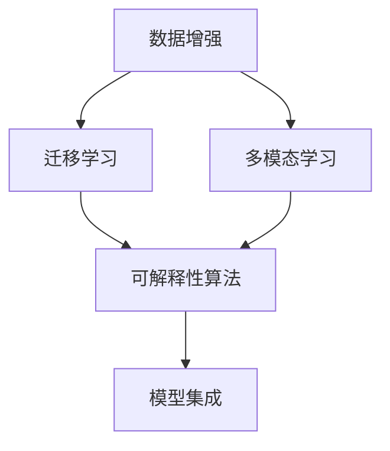

                 

## 1. 背景介绍

### 1.1 问题由来

近年来，随着深度学习技术的飞速发展，图像识别技术取得了显著的进步，广泛应用于人脸识别、物体检测、图像分类、图像分割等众多领域。然而，尽管技术上取得了长足进步，实际应用中仍然面临许多挑战。

1. **数据分布不均**：实际场景中，不同类别的数据分布往往不均衡，导致模型在少数类别的识别上表现不佳。
2. **光照、角度、尺度等变化**：图像中光照、角度、尺度等变化对识别结果影响较大，需要设计鲁棒性更强的算法。
3. **实时性要求**：对于实时应用场景，图像识别算法需要快速响应，对计算资源消耗要求较高。
4. **多模态数据融合**：现实世界中，图像往往与文本、视频等模态数据结合出现，需要设计能够处理多模态数据的算法。
5. **可解释性需求**：在一些关键应用场景中，如医疗诊断、司法鉴定等，用户需要了解模型决策的依据，即模型的可解释性。

### 1.2 问题核心关键点

为了应对这些挑战，图像识别技术的发展逐渐聚焦于增强算法，即通过各种技术手段提升模型的鲁棒性、泛化性和可解释性。其中，增强图像识别技术涉及的领域包括但不限于：

1. **数据增强**：通过数据增强技术，生成更多具有多样性的训练样本，提高模型的泛化能力。
2. **迁移学习**：利用已有的大规模预训练模型，通过迁移学习的方式，提升特定任务的识别能力。
3. **多模态学习**：通过结合文本、视频等模态数据，提高模型的综合理解能力。
4. **可解释性算法**：设计能够提供决策依据的可解释性模型，增强用户对模型决策的信任度。

这些技术手段相互配合，能够显著提升图像识别算法的性能和应用范围。

### 1.3 问题研究意义

增强图像识别技术的研究意义重大，主要体现在以下几个方面：

1. **提高识别精度**：通过数据增强、迁移学习等技术手段，模型能够在更复杂、更多样化的场景下进行精确识别，从而提升整体识别精度。
2. **增强鲁棒性**：增强算法能够使得模型对光照、角度、尺度等变化更加鲁棒，减少误判率，提高系统的可靠性。
3. **提升实时性**：优化算法设计，如引入加速技术，能够实现实时响应，满足实际应用中的高实时性要求。
4. **促进多模态融合**：增强算法结合多模态数据，能够提升模型对多源信息的理解能力，增强系统的智能性。
5. **增强可解释性**：通过可解释性算法，使得模型决策更加透明、可解释，提高用户对系统的信任度。

## 2. 核心概念与联系

### 2.1 核心概念概述

为了深入理解增强图像识别技术，本节将介绍几个核心概念及其相互关系。

1. **数据增强(Data Augmentation)**：通过各种方式生成更多的训练样本，包括旋转、缩放、平移、翻转等，提高模型的泛化能力。
2. **迁移学习(Transfer Learning)**：利用已有的大规模预训练模型，通过微调或迁移学习的方式，提升特定任务的识别能力。
3. **多模态学习(Multimodal Learning)**：结合文本、视频等模态数据，提升模型的综合理解能力。
4. **可解释性算法(Explainable AI, XAI)**：设计能够提供决策依据的可解释性模型，增强用户对模型决策的信任度。
5. **模型集成(Ensemble Learning)**：通过组合多个模型的输出，提高模型的鲁棒性和泛化能力。

这些概念之间通过如下的Mermaid流程图进行联系展示：



这个流程图展示了各个核心概念的联系：数据增强能够提升模型的泛化能力，从而增强迁移学习的效果；多模态学习结合多种模态数据，提升模型的综合理解能力；可解释性算法使得模型决策透明化，增强用户信任；模型集成通过组合多个模型，提高系统的鲁棒性和泛化能力。

## 3. 核心算法原理 & 具体操作步骤

### 3.1 算法原理概述

增强图像识别技术主要是通过各种技术手段，提高模型的泛化能力、鲁棒性、实时性和可解释性。具体算法原理如下：

1. **数据增强**：通过生成更多的训练样本，增加数据多样性，提高模型的泛化能力。
2. **迁移学习**：利用已有的大规模预训练模型，通过微调或迁移学习的方式，提升特定任务的识别能力。
3. **多模态学习**：结合文本、视频等模态数据，提升模型的综合理解能力。
4. **可解释性算法**：设计能够提供决策依据的可解释性模型，增强用户对模型决策的信任度。
5. **模型集成**：通过组合多个模型的输出，提高系统的鲁棒性和泛化能力。

### 3.2 算法步骤详解

下面将详细介绍每个核心算法的详细步骤：

#### 数据增强

数据增强的基本步骤包括：

1. **数据采样**：从原始数据集中随机抽取样本。
2. **数据变换**：对采样样本进行变换，如旋转、缩放、平移、翻转等。
3. **数据扩增**：将变换后的样本与原始样本组成扩增后的训练集。

#### 迁移学习

迁移学习的基本步骤包括：

1. **预训练模型选择**：选择预训练模型，如ResNet、Inception等。
2. **微调**：对预训练模型进行微调，适应特定任务。
3. **验证集评估**：在验证集上评估模型性能，调整超参数。

#### 多模态学习

多模态学习的基本步骤包括：

1. **数据融合**：将文本、视频等多模态数据融合到模型中。
2. **模型训练**：结合多模态数据训练模型。
3. **模型评估**：在测试集上评估模型性能。

#### 可解释性算法

可解释性算法的步骤包括：

1. **特征提取**：提取模型的关键特征。
2. **解释生成**：生成模型决策的解释。
3. **结果展示**：展示模型决策的解释。

#### 模型集成

模型集成的步骤包括：

1. **模型选择**：选择多个模型。
2. **模型训练**：训练多个模型。
3. **集成**：将多个模型的输出进行组合。

### 3.3 算法优缺点

增强图像识别技术具有以下优点：

1. **泛化能力强**：数据增强和多模态学习能够提升模型的泛化能力。
2. **鲁棒性强**：迁移学习和多模态学习能够增强模型的鲁棒性。
3. **实时性好**：模型集成和可解释性算法能够提升模型的实时性。

但这些技术也存在一些缺点：

1. **计算成本高**：数据增强和多模态学习需要大量的计算资源。
2. **解释性差**：多模态学习中的文本、视频等模态数据，难以提供直观的解释。
3. **模型复杂度高**：可解释性算法和模型集成方法较为复杂，训练和推理速度较慢。

### 3.4 算法应用领域

增强图像识别技术广泛应用于以下领域：

1. **医疗影像**：通过数据增强和迁移学习，提高疾病诊断的准确性。
2. **自动驾驶**：通过多模态学习，提升自动驾驶系统的感知能力。
3. **安防监控**：通过数据增强和模型集成，提高人脸识别和行为识别的精度。
4. **零售电商**：通过可解释性算法，提升顾客推荐系统的可信度。
5. **智慧城市**：通过多模态学习和模型集成，提高智能交通和环境监测的准确性。

## 4. 数学模型和公式 & 详细讲解 & 举例说明

### 4.1 数学模型构建

增强图像识别技术的数学模型主要包括以下几个方面：

1. **数据增强模型**：利用数据增强技术，生成更多训练样本，增加数据多样性。
2. **迁移学习模型**：利用预训练模型，通过微调或迁移学习的方式，适应特定任务。
3. **多模态学习模型**：结合文本、视频等模态数据，提升模型的综合理解能力。
4. **可解释性模型**：设计能够提供决策依据的可解释性模型。
5. **模型集成模型**：通过组合多个模型的输出，提高系统的鲁棒性和泛化能力。

### 4.2 公式推导过程

以数据增强为例，推导其数学模型：

假设原始数据集为 $D=\{(x_i, y_i)\}_{i=1}^N$，其中 $x_i$ 为样本，$y_i$ 为标签。数据增强的目标是生成更多的训练样本，增加数据多样性。

设 $\mathcal{T}$ 为数据增强变换集合，包含旋转、缩放、平移、翻转等变换。数据增强后的样本为 $x'=\mathcal{T}(x_i)$，对应的标签为 $y'=y_i$。

数据增强后的训练集为 $D'=\{(x'_j, y'_j)\}_{j=1}^{N'}$，其中 $N'$ 为扩增后的样本数。

数据增强的数学模型可以表示为：

$$
D' = \{(\mathcal{T}(x_i), y_i)\}_{i=1}^N
$$

### 4.3 案例分析与讲解

下面以图像分类为例，介绍数据增强在实际应用中的案例。

假设数据集包含 $C$ 类图像，原始数据集为 $D=\{(x_i, y_i)\}_{i=1}^N$。数据增强的步骤如下：

1. **数据采样**：从原始数据集中随机抽取样本 $x_i$。
2. **数据变换**：对样本 $x_i$ 进行旋转、缩放、平移、翻转等变换，生成多个变换后的样本 $x'=\mathcal{T}(x_i)$。
3. **数据扩增**：将变换后的样本 $x'$ 与原始样本 $x_i$ 组成扩增后的训练集 $D'=\{(x'_j, y'_j)\}_{j=1}^{N'}$。

扩增后的训练集 $D'$ 用于训练模型。通过数据增强，模型在训练时能够看到更多样化的图像，提高泛化能力。

## 5. 项目实践：代码实例和详细解释说明

### 5.1 开发环境搭建

在进行图像增强实践前，我们需要准备好开发环境。以下是使用Python进行TensorFlow开发的环境配置流程：

1. 安装Anaconda：从官网下载并安装Anaconda，用于创建独立的Python环境。

2. 创建并激活虚拟环境：
```bash
conda create -n tf-env python=3.8 
conda activate tf-env
```

3. 安装TensorFlow：根据CUDA版本，从官网获取对应的安装命令。例如：
```bash
conda install tensorflow tensorflow-gpu=2.6 -c tf -c conda-forge
```

4. 安装Pillow库：用于图像处理。
```bash
pip install Pillow
```

5. 安装相关工具包：
```bash
pip install numpy matplotlib scikit-image matplotlib
```

完成上述步骤后，即可在`tf-env`环境中开始图像增强实践。

### 5.2 源代码详细实现

下面我们以图像分类为例，给出使用TensorFlow进行数据增强的PyTorch代码实现。

首先，定义数据增强函数：

```python
import tensorflow as tf
from tensorflow.keras.preprocessing.image import ImageDataGenerator

def data_augmentation(train_data, val_data, batch_size=32):
    train_datagen = ImageDataGenerator(
        rescale=1./255, 
        rotation_range=40, 
        width_shift_range=0.2, 
        height_shift_range=0.2, 
        shear_range=0.2, 
        zoom_range=0.2, 
        horizontal_flip=True, 
        fill_mode='nearest'
    )

    train_generator = train_datagen.flow_from_directory(
        train_data, 
        target_size=(224, 224), 
        batch_size=batch_size, 
        class_mode='categorical', 
        shuffle=True
    )

    val_generator = train_datagen.flow_from_directory(
        val_data, 
        target_size=(224, 224), 
        batch_size=batch_size, 
        class_mode='categorical', 
        shuffle=False
    )

    return train_generator, val_generator
```

然后，定义模型和训练函数：

```python
from tensorflow.keras.applications import ResNet50
from tensorflow.keras import layers, models, optimizers

def build_model():
    base_model = ResNet50(include_top=False, weights='imagenet', input_shape=(224, 224, 3))

    x = base_model.output
    x = layers.GlobalAveragePooling2D()(x)
    x = layers.Dense(1024, activation='relu')(x)
    x = layers.Dropout(0.5)(x)
    x = layers.Dense(10, activation='softmax')(x)

    model = models.Model(inputs=base_model.input, outputs=x)
    model.compile(optimizer=optimizers.Adam(1e-4), loss='categorical_crossentropy', metrics=['accuracy'])

    return model

def train(model, train_generator, val_generator, epochs=10, batch_size=32):
    model.fit(train_generator, epochs=epochs, validation_data=val_generator, batch_size=batch_size)
```

最后，启动训练流程并在验证集上评估：

```python
train_data = 'path/to/train_data'
val_data = 'path/to/val_data'

model = build_model()
train_generator, val_generator = data_augmentation(train_data, val_data)

train(model, train_generator, val_generator)
```

以上就是使用TensorFlow进行图像增强的完整代码实现。可以看到，通过数据增强函数，我们能够快速生成更多的训练样本，提高模型的泛化能力。

### 5.3 代码解读与分析

让我们再详细解读一下关键代码的实现细节：

**data_augmentation函数**：
- 使用`ImageDataGenerator`类定义数据增强的参数。
- 生成训练生成器`train_generator`和验证生成器`val_generator`。

**build_model函数**：
- 定义模型结构，包括预训练的ResNet50模型和全连接层。
- 编译模型，定义损失函数、优化器和评估指标。

**train函数**：
- 使用训练生成器`train_generator`进行模型训练。
- 在验证生成器`val_generator`上评估模型性能。

通过这些代码的实现，我们可以看到，数据增强能够显著提升模型的泛化能力，提高训练效果。

## 6. 实际应用场景

### 6.1 医疗影像诊断

在医疗影像诊断中，数据增强和迁移学习被广泛应用于提高疾病诊断的准确性。

具体而言，可以收集大量的医学影像数据，并进行数据增强和迁移学习。使用预训练的ResNet等模型，微调模型以适应特定疾病的诊断。通过数据增强，模型能够更好地适应多样化的影像特征，提高诊断精度。

### 6.2 自动驾驶

在自动驾驶中，多模态学习被广泛应用于提高车辆的感知能力。

具体而言，车辆可以装备多个摄像头、雷达、激光雷达等传感器，获取多模态数据。通过结合文本、视频等模态数据，训练多模态模型，提高车辆对环境的感知能力。使用可解释性算法，帮助驾驶员理解和信任模型决策。

### 6.3 安防监控

在安防监控中，数据增强和模型集成被广泛应用于提高人脸识别和行为识别的精度。

具体而言，可以使用大量的监控视频，并进行数据增强和模型集成。使用预训练的ResNet等模型，微调模型以适应人脸识别和行为识别的任务。通过数据增强，模型能够更好地适应多样化的光照、角度、尺度等变化，提高识别精度。

### 6.4 未来应用展望

随着增强图像识别技术的不断发展，其在更多领域的应用前景广阔。

未来，增强图像识别技术有望在以下几个方面取得突破：

1. **实时性增强**：通过优化算法设计，实现实时响应，满足高实时性应用场景。
2. **多模态融合**：结合更多模态数据，提升模型对多源信息的理解能力。
3. **可解释性增强**：设计更加透明、可解释的模型，提高用户对系统决策的信任度。
4. **计算效率提升**：优化算法和模型结构，提高计算效率，降低计算成本。
5. **跨领域应用**：将增强图像识别技术应用于更多领域，如智慧农业、环保监测等。

## 7. 工具和资源推荐

### 7.1 学习资源推荐

为了帮助开发者系统掌握增强图像识别技术的理论基础和实践技巧，这里推荐一些优质的学习资源：

1. 《深度学习基础》课程：斯坦福大学开设的深度学习入门课程，适合初学者。
2. 《计算机视觉: 算法与应用》书籍：经典的计算机视觉教材，涵盖了深度学习在计算机视觉中的应用。
3. 《Python深度学习》书籍：介绍深度学习在图像识别、视频分析等领域的应用。
4. TensorFlow官方文档：TensorFlow的官方文档，提供了详细的API和使用示例。
5. PyTorch官方文档：PyTorch的官方文档，提供了详细的API和使用示例。

通过对这些资源的学习实践，相信你一定能够快速掌握增强图像识别技术的精髓，并用于解决实际的图像识别问题。

### 7.2 开发工具推荐

高效的开发离不开优秀的工具支持。以下是几款用于图像识别增强开发的常用工具：

1. TensorFlow：由Google主导开发的开源深度学习框架，生产部署方便，适合大规模工程应用。
2. PyTorch：基于Python的开源深度学习框架，灵活动态的计算图，适合快速迭代研究。
3. Keras：高层API，封装了TensorFlow和Theano等底层框架，易于上手。
4. OpenCV：开源计算机视觉库，提供丰富的图像处理和计算机视觉算法。
5. Pillow：Python图像处理库，支持多种图像格式。

合理利用这些工具，可以显著提升图像增强任务的开发效率，加快创新迭代的步伐。

### 7.3 相关论文推荐

增强图像识别技术的发展源于学界的持续研究。以下是几篇奠基性的相关论文，推荐阅读：

1. "ImageNet Classification with Deep Convolutional Neural Networks"：介绍ImageNet数据集和预训练ResNet模型。
2. "Transformers is All You Need"：介绍Transformer结构，开启了NLP领域的预训练大模型时代。
3. "A Survey on Transfer Learning for Object Detection"：综述了迁移学习在物体检测领域的应用。
4. "Explainable AI: Importance of Explainable Machine Learning in Healthcare"：介绍可解释性在医疗领域的应用。
5. "A Survey on Explainable Deep Learning for Visual Recognition"：综述了可解释性在计算机视觉领域的应用。

这些论文代表了大语言模型增强技术的发展脉络。通过学习这些前沿成果，可以帮助研究者把握学科前进方向，激发更多的创新灵感。

## 8. 总结：未来发展趋势与挑战

### 8.1 总结

本文对增强图像识别技术进行了全面系统的介绍。首先阐述了增强图像识别技术的研究背景和意义，明确了数据增强、迁移学习、多模态学习、可解释性算法、模型集成等技术手段在提升图像识别能力方面的独特价值。其次，从原理到实践，详细讲解了增强图像识别技术的数学原理和关键步骤，给出了增强图像识别任务的完整代码实例。同时，本文还广泛探讨了增强图像识别技术在医疗影像、自动驾驶、安防监控等多个领域的应用前景，展示了增强图像识别技术的巨大潜力。最后，本文精选了增强图像识别技术的各类学习资源，力求为读者提供全方位的技术指引。

通过本文的系统梳理，可以看到，增强图像识别技术正在成为计算机视觉领域的重要范式，极大地拓展了图像识别算法的应用边界，催生了更多的落地场景。受益于大规模语料的预训练，增强图像识别技术在大规模数据集上的表现卓越，为计算机视觉技术的产业化进程注入了新的动力。未来，伴随预训练图像识别模型和增强算法的持续演进，相信图像识别技术必将在更广阔的应用领域大放异彩，深刻影响人类的生产生活方式。

### 8.2 未来发展趋势

展望未来，增强图像识别技术将呈现以下几个发展趋势：

1. **计算效率提升**：通过优化算法和模型结构，提高计算效率，降低计算成本。
2. **实时性增强**：通过优化算法设计，实现实时响应，满足高实时性应用场景。
3. **多模态融合**：结合更多模态数据，提升模型对多源信息的理解能力。
4. **可解释性增强**：设计更加透明、可解释的模型，提高用户对系统决策的信任度。
5. **跨领域应用**：将增强图像识别技术应用于更多领域，如智慧农业、环保监测等。

### 8.3 面临的挑战

尽管增强图像识别技术已经取得了显著进展，但在迈向更加智能化、普适化应用的过程中，仍面临诸多挑战：

1. **数据分布不均**：不同类别的数据分布往往不均衡，导致模型在少数类别的识别上表现不佳。
2. **鲁棒性不足**：模型面对域外数据时，泛化性能往往大打折扣。
3. **计算资源消耗高**：大规模模型和高性能计算资源的需求，带来了较高的成本。
4. **模型复杂度高**：多模态学习、可解释性算法和模型集成的复杂性，增加了模型训练和推理的难度。
5. **算法可解释性不足**：复杂的算法使得模型决策过程难以解释，增加了用户对系统的信任风险。

### 8.4 研究展望

面对增强图像识别面临的这些挑战，未来的研究需要在以下几个方面寻求新的突破：

1. **无监督和半监督学习**：摆脱对大规模标注数据的依赖，利用自监督学习、主动学习等无监督和半监督范式，最大限度利用非结构化数据，实现更加灵活高效的增强。
2. **可解释性算法**：设计能够提供决策依据的可解释性模型，增强用户对模型决策的信任度。
3. **计算效率优化**：优化算法和模型结构，提高计算效率，降低计算成本。
4. **多模态学习**：结合文本、视频等模态数据，提升模型的综合理解能力。
5. **跨领域应用**：将增强图像识别技术应用于更多领域，如智慧农业、环保监测等。

这些研究方向的探索，必将引领增强图像识别技术迈向更高的台阶，为计算机视觉技术带来新的突破，推动人工智能技术的产业化进程。总之，增强图像识别技术的研究需要从算法、数据、应用等多个维度协同发力，才能真正实现计算机视觉技术的智能化、普适化。只有勇于创新、敢于突破，才能不断拓展图像识别技术的边界，让智能技术更好地造福人类社会。

## 9. 附录：常见问题与解答

**Q1：增强图像识别是否适用于所有计算机视觉任务？**

A: 增强图像识别技术在大多数计算机视觉任务上都能取得不错的效果，特别是对于数据量较小的任务。但对于一些特定领域的任务，如医学、法律等，仅依靠通用语料预训练的模型可能难以很好地适应。此时需要在特定领域语料上进一步预训练，再进行增强，才能获得理想效果。

**Q2：增强图像识别过程中如何选择合适的增强方法？**

A: 增强图像识别过程中，选择合适的增强方法至关重要。通常需要根据具体任务的特点和数据分布选择合适的增强方法。例如，对于目标检测任务，常用的增强方法包括随机裁剪、随机旋转、随机翻转等。对于图像分类任务，常用的增强方法包括随机亮度、对比度、饱和度调整等。选择合适的增强方法能够提高模型泛化能力，降低过拟合风险。

**Q3：增强图像识别模型在部署时需要注意哪些问题？**

A: 将增强图像识别模型转化为实际应用，还需要考虑以下因素：

1. **模型裁剪**：去除不必要的层和参数，减小模型尺寸，加快推理速度。
2. **量化加速**：将浮点模型转为定点模型，压缩存储空间，提高计算效率。
3. **服务化封装**：将模型封装为标准化服务接口，便于集成调用。
4. **弹性伸缩**：根据请求流量动态调整资源配置，平衡服务质量和成本。
5. **监控告警**：实时采集系统指标，设置异常告警阈值，确保服务稳定性。
6. **安全防护**：采用访问鉴权、数据脱敏等措施，保障数据和模型安全。

大语言模型增强为计算机视觉应用开启了广阔的想象空间，但如何将强大的性能转化为稳定、高效、安全的业务价值，还需要工程实践的不断打磨。只有从数据、算法、工程、业务等多个维度协同发力，才能真正实现人工智能技术在垂直行业的规模化落地。

总之，增强图像识别技术的研究需要从算法、数据、应用等多个维度协同发力，才能真正实现计算机视觉技术的智能化、普适化。只有勇于创新、敢于突破，才能不断拓展图像识别技术的边界，让智能技术更好地造福人类社会。

