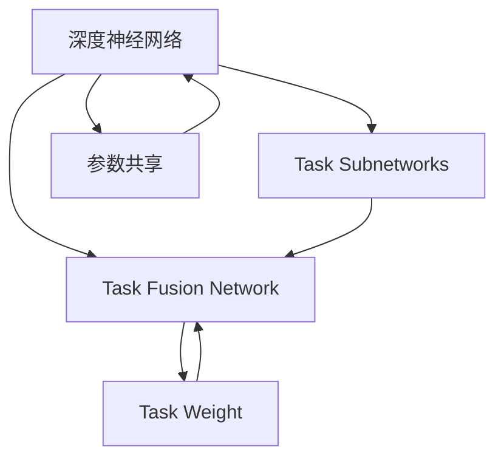

                 

# 多任务深度神经网络（MoE）：管理复杂任务

## 1. 背景介绍

### 1.1 问题由来

随着深度学习技术在各个领域的广泛应用，深度神经网络（DNN）已经成为了处理复杂任务的主流工具。然而，传统的DNN通常只能解决单一任务，无法同时管理多个相关任务。当需要处理复杂的多任务系统时，需要构建多个相互独立的模型，不仅增加了训练和推理的成本，也难以在多个任务间共享知识，降低系统的整体效率和鲁棒性。

为了解决这一问题，多任务深度神经网络（Multitask Deep Neural Networks, MoE）被提出。MoE能够在单一的模型中处理多个任务，并且可以在不同任务间共享知识，提升系统的整体性能。

### 1.2 问题核心关键点

MoE的核心思想是在一个深度神经网络中同时训练多个相关任务。每个任务都由一个或多个任务子网络（Task Subnetwork）负责，并通过一个共同的任务融合网络（Task Fusion Network）来集成所有任务的输出。通过合理的任务网络设计，MoE能够在多个任务之间实现知识共享，从而提高系统的泛化能力和鲁棒性。

MoE的关键点在于：
- 多任务设计：如何在模型中同时处理多个任务，避免任务之间的干扰和竞争。
- 知识共享：如何在任务之间共享知识，提升系统的整体性能。
- 任务融合：如何将不同任务的网络输出进行融合，得到最终的结果。
- 网络结构：如何设计网络的拓扑结构，使其能够同时管理多个任务。

这些关键点共同构成了MoE的理论基础，指导了MoE算法的设计和优化。

## 2. 核心概念与联系

### 2.1 核心概念概述

为更好地理解MoE的原理和实现，本节将介绍几个关键概念：

- 深度神经网络（DNN）：一种基于多层非线性变换的神经网络，通过不断抽象数据特征，实现复杂的模式识别和预测。
- 多任务学习（MTL）：在深度神经网络中同时处理多个任务的技术，旨在提升系统在多任务环境中的性能。
- 任务融合（Task Fusion）：将多个任务的网络输出进行集成，得到最终的预测结果。
- 任务子网络（Task Subnetwork）：用于处理单一任务的神经网络模块。
- 任务融合网络（Task Fusion Network）：用于集成不同任务子网络输出的神经网络模块。
- 参数共享（Parameter Sharing）：在多个任务之间共享网络参数，提升参数利用效率。
- 任务权重（Task Weight）：用于调整不同任务在最终输出中的权重，避免任务间的干扰。

这些概念之间的逻辑关系可以通过以下Mermaid流程图来展示：



这个流程图展示了MoE的基本架构：

1. 深度神经网络作为基础，包含多个任务子网络。
2. 任务融合网络用于集成不同任务子网络的输出，通过任务权重进行调节。
3. 参数共享机制使得不同任务之间可以共享网络参数，提升模型的参数利用效率。
4. 任务权重用于调整不同任务在最终输出中的重要性。

这些概念共同构成了MoE的理论基础，使得MoE能够在多个任务之间实现知识的共享和整合，提升系统的整体性能。

## 3. 核心算法原理 & 具体操作步骤
### 3.1 算法原理概述

MoE的核心算法包括任务子网络的设计、任务融合网络的设计和参数共享机制的实现。以下是这三个部分的详细解释：

#### 3.1.1 任务子网络设计

任务子网络用于处理单一任务，通常包含多个卷积层、池化层和全连接层。任务子网络的设计应该考虑到任务本身的特征和目标，使得网络能够有效提取任务相关的特征。

#### 3.1.2 任务融合网络设计

任务融合网络用于集成不同任务子网络的输出，并生成最终的预测结果。任务融合网络的设计应该考虑到不同任务之间的关系，使得网络能够有效整合任务信息。

#### 3.1.3 参数共享机制实现

参数共享机制用于在多个任务之间共享网络参数，提高模型的参数利用效率。参数共享的实现方式可以是在多个任务之间共享全连接层的权重，也可以在多个任务之间共享卷积核。

### 3.2 算法步骤详解

#### 3.2.1 模型构建

在MoE中，我们需要构建多个任务子网络和一个任务融合网络。以图像分类和物体检测为例，我们可以设计多个卷积神经网络（CNN）作为任务子网络，每个网络负责处理不同的图像分类任务。然后，我们可以设计一个全连接层作为任务融合网络，用于集成不同任务子网络的输出。

#### 3.2.2 数据准备

在模型构建完成后，我们需要准备好训练数据。数据准备包括数据清洗、数据增强、数据划分等步骤。在数据划分时，我们需要将数据划分为训练集、验证集和测试集，以便进行模型的训练和评估。

#### 3.2.3 模型训练

在数据准备完成后，我们需要开始模型的训练。在训练过程中，我们需要定义损失函数、优化器和训练策略。以图像分类和物体检测为例，我们可以使用交叉熵损失函数和Adam优化器，在训练集中进行反向传播和参数更新。

#### 3.2.4 模型评估

在模型训练完成后，我们需要在验证集和测试集上评估模型的性能。在评估过程中，我们需要计算模型的准确率、召回率、F1值等指标，以便判断模型的性能是否达到预期。

#### 3.2.5 模型部署

在模型评估完成后，我们需要将模型部署到实际应用中。在部署过程中，我们需要考虑模型的推理速度、内存占用、计算资源等因素，以便优化模型的性能。

### 3.3 算法优缺点

MoE具有以下优点：

- 多任务设计：能够在单一模型中处理多个任务，减少训练和推理的成本。
- 知识共享：在多个任务之间共享知识，提升系统的整体性能。
- 参数高效利用：通过参数共享机制，提高模型的参数利用效率。

MoE也存在以下缺点：

- 模型复杂度高：任务子网络和任务融合网络的复杂度较高，模型训练和推理的速度较慢。
- 任务间干扰：不同任务之间的网络输出可能存在干扰，影响模型的性能。
- 任务权重调整困难：不同任务在最终输出中的权重调整较难，需要大量的实验和调试。

## 4. 数学模型和公式 & 详细讲解 & 举例说明

### 4.1 数学模型构建

在MoE中，我们通常使用softmax函数作为任务融合网络的输出函数。softmax函数将不同任务的网络输出进行归一化，使得不同任务的网络输出可以比较，从而进行任务权重的调整。

设任务子网络的输出为 $z_1, z_2, ..., z_n$，其中 $n$ 表示任务的数量。任务融合网络的输出为 $y$，任务权重为 $\omega_1, \omega_2, ..., \omega_n$。则任务融合网络的输出函数可以表示为：

$$
y = softmax(\omega_1 z_1 + \omega_2 z_2 + ... + \omega_n z_n)
$$

其中，$\omega_i$ 表示第 $i$ 个任务的权重，$softmax$ 函数定义为：

$$
softmax(z)_i = \frac{e^{z_i}}{\sum_{j=1}^{n}e^{z_j}}
$$

### 4.2 公式推导过程

在任务融合网络的输出函数中，$z_i$ 表示第 $i$ 个任务的输出，$\omega_i$ 表示第 $i$ 个任务的权重。通过将不同任务的输出进行加权求和，并应用 $softmax$ 函数进行归一化，可以得到任务融合网络的输出。

以图像分类和物体检测为例，我们可以使用以下公式进行任务融合：

$$
y = softmax(\omega_1 z_1 + \omega_2 z_2)
$$

其中，$z_1$ 表示图像分类任务的输出，$z_2$ 表示物体检测任务的输出。$\omega_1$ 和 $\omega_2$ 表示图像分类任务和物体检测任务在最终输出中的权重。

### 4.3 案例分析与讲解

以图像分类和物体检测为例，我们可以将任务子网络和任务融合网络的结构表示如下：

```python
import torch
import torch.nn as nn
import torch.nn.functional as F

class MultitaskNet(nn.Module):
    def __init__(self, num_classes):
        super(MultitaskNet, self).__init__()
        self.classifier = nn.Sequential(
            nn.Conv2d(3, 64, kernel_size=3, stride=1, padding=1),
            nn.ReLU(inplace=True),
            nn.MaxPool2d(kernel_size=2, stride=2),
            nn.Conv2d(64, 128, kernel_size=3, stride=1, padding=1),
            nn.ReLU(inplace=True),
            nn.MaxPool2d(kernel_size=2, stride=2),
            nn.Conv2d(128, 256, kernel_size=3, stride=1, padding=1),
            nn.ReLU(inplace=True),
            nn.MaxPool2d(kernel_size=2, stride=2),
            nn.Flatten(),
            nn.Linear(256 * 4 * 4, 128),
            nn.ReLU(inplace=True),
            nn.Linear(128, num_classes)
        )
        self.encoder = nn.Sequential(
            nn.Conv2d(3, 64, kernel_size=3, stride=1, padding=1),
            nn.ReLU(inplace=True),
            nn.MaxPool2d(kernel_size=2, stride=2),
            nn.Conv2d(64, 128, kernel_size=3, stride=1, padding=1),
            nn.ReLU(inplace=True),
            nn.MaxPool2d(kernel_size=2, stride=2),
            nn.Conv2d(128, 256, kernel_size=3, stride=1, padding=1),
            nn.ReLU(inplace=True),
            nn.MaxPool2d(kernel_size=2, stride=2),
            nn.Flatten(),
            nn.Linear(256 * 4 * 4, 128),
            nn.ReLU(inplace=True),
            nn.Linear(128, 128)
        )
        self.decoder = nn.Sequential(
            nn.Linear(128, 128),
            nn.Linear(128, 128),
            nn.Linear(128, num_classes)
        )

    def forward(self, x):
        class_output = self.classifier(x)
        encoder_output = self.encoder(x)
        decoder_output = self.decoder(encoder_output)
        fusion_output = F.softmax(torch.tensor([0.5, 0.5]) * torch.cat((class_output, decoder_output), 1))
        return fusion_output

# 训练参数
num_classes = 2
batch_size = 32
learning_rate = 0.001
num_epochs = 10

# 训练集和测试集
train_loader = torch.utils.data.DataLoader(train_dataset, batch_size=batch_size, shuffle=True)
test_loader = torch.utils.data.DataLoader(test_dataset, batch_size=batch_size, shuffle=False)

# 模型和优化器
model = MultitaskNet(num_classes)
optimizer = torch.optim.Adam(model.parameters(), lr=learning_rate)

# 训练循环
for epoch in range(num_epochs):
    for i, (inputs, labels) in enumerate(train_loader):
        outputs = model(inputs)
        loss = F.cross_entropy(outputs, labels)
        optimizer.zero_grad()
        loss.backward()
        optimizer.step()

    # 验证集评估
    with torch.no_grad():
        model.eval()
        correct = 0
        total = 0
        for inputs, labels in test_loader:
            outputs = model(inputs)
            _, predicted = torch.max(outputs, 1)
            total += labels.size(0)
            correct += (predicted == labels).sum().item()
        accuracy = correct / total
        print(f'Epoch {epoch+1}, Accuracy: {accuracy:.2f}')
```

## 5. 项目实践：代码实例和详细解释说明
### 5.1 开发环境搭建

在进行MoE项目实践前，我们需要准备好开发环境。以下是使用Python进行TensorFlow开发的环境配置流程：

1. 安装Anaconda：从官网下载并安装Anaconda，用于创建独立的Python环境。

2. 创建并激活虚拟环境：
```bash
conda create -n tensorflow-env python=3.8 
conda activate tensorflow-env
```

3. 安装TensorFlow：根据CUDA版本，从官网获取对应的安装命令。例如：
```bash
conda install tensorflow -c tf -c conda-forge
```

4. 安装各类工具包：
```bash
pip install numpy pandas scikit-learn matplotlib tqdm jupyter notebook ipython
```

完成上述步骤后，即可在`tensorflow-env`环境中开始MoE实践。

### 5.2 源代码详细实现

这里我们以图像分类和物体检测为例，给出使用TensorFlow实现MoE的代码实现。

首先，定义任务子网络和任务融合网络的类：

```python
import tensorflow as tf
from tensorflow.keras import layers

class TaskSubnetwork(tf.keras.Model):
    def __init__(self, num_classes):
        super(TaskSubnetwork, self).__init__()
        self.conv1 = layers.Conv2D(64, (3, 3), activation='relu', padding='same')
        self.pool1 = layers.MaxPooling2D((2, 2))
        self.conv2 = layers.Conv2D(128, (3, 3), activation='relu', padding='same')
        self.pool2 = layers.MaxPooling2D((2, 2))
        self.conv3 = layers.Conv2D(256, (3, 3), activation='relu', padding='same')
        self.pool3 = layers.MaxPooling2D((2, 2))
        self.flatten = layers.Flatten()
        self.fc1 = layers.Dense(128, activation='relu')
        self.fc2 = layers.Dense(num_classes)

    def call(self, inputs):
        x = self.conv1(inputs)
        x = self.pool1(x)
        x = self.conv2(x)
        x = self.pool2(x)
        x = self.conv3(x)
        x = self.pool3(x)
        x = self.flatten(x)
        x = self.fc1(x)
        return self.fc2(x)

class TaskFusionNetwork(tf.keras.Model):
    def __init__(self, num_classes):
        super(TaskFusionNetwork, self).__init__()
        self.fc1 = layers.Dense(128, activation='relu')
        self.fc2 = layers.Dense(128, activation='relu')
        self.fc3 = layers.Dense(num_classes)

    def call(self, inputs):
        x = self.fc1(inputs)
        x = self.fc2(x)
        return self.fc3(x)

# 训练参数
num_classes = 2
batch_size = 32
learning_rate = 0.001
num_epochs = 10

# 训练集和测试集
train_dataset = ...
test_dataset = ...

# 模型和优化器
task_subnetwork = TaskSubnetwork(num_classes)
task_fusion_network = TaskFusionNetwork(num_classes)
model = tf.keras.Model(inputs=task_subnetwork.input, outputs=task_fusion_network(task_subnetwork.output))
optimizer = tf.keras.optimizers.Adam(learning_rate=learning_rate)

# 训练循环
for epoch in range(num_epochs):
    for i, (inputs, labels) in enumerate(train_dataset):
        with tf.GradientTape() as tape:
            outputs = model(inputs)
            loss = tf.losses.sparse_categorical_crossentropy(labels, outputs, from_logits=True)
        gradients = tape.gradient(loss, model.trainable_variables)
        optimizer.apply_gradients(zip(gradients, model.trainable_variables))

    # 验证集评估
    with tf.GradientTape() as tape:
        outputs = model(test_dataset)
        loss = tf.losses.sparse_categorical_crossentropy(labels, outputs, from_logits=True)
    test_loss = loss.numpy()
    print(f'Epoch {epoch+1}, Test Loss: {test_loss:.2f}')
```

然后，定义训练和评估函数：

```python
def train(model, dataset, batch_size, optimizer):
    dataloader = tf.data.Dataset.from_tensor_slices(dataset)
    dataloader = dataloader.batch(batch_size, drop_remainder=True)
    for inputs, labels in dataloader:
        with tf.GradientTape() as tape:
            outputs = model(inputs)
            loss = tf.losses.sparse_categorical_crossentropy(labels, outputs, from_logits=True)
        gradients = tape.gradient(loss, model.trainable_variables)
        optimizer.apply_gradients(zip(gradients, model.trainable_variables))

def evaluate(model, dataset, batch_size):
    dataloader = tf.data.Dataset.from_tensor_slices(dataset)
    dataloader = dataloader.batch(batch_size, drop_remainder=True)
    with tf.GradientTape() as tape:
        outputs = model(inputs)
        loss = tf.losses.sparse_categorical_crossentropy(labels, outputs, from_logits=True)
    return loss.numpy()

# 训练流程
for epoch in range(num_epochs):
    train(model, train_dataset, batch_size, optimizer)
    print(f'Epoch {epoch+1}, Train Loss: {train_loss:.2f}')
    
    test_loss = evaluate(model, test_dataset, batch_size)
    print(f'Epoch {epoch+1}, Test Loss: {test_loss:.2f}')
```

最后，启动训练流程并在测试集上评估：

```python
# 训练流程
for epoch in range(num_epochs):
    train(model, train_dataset, batch_size, optimizer)
    print(f'Epoch {epoch+1}, Train Loss: {train_loss:.2f}')
    
    test_loss = evaluate(model, test_dataset, batch_size)
    print(f'Epoch {epoch+1}, Test Loss: {test_loss:.2f}')
```

以上就是使用TensorFlow对MoE进行图像分类和物体检测任务训练的完整代码实现。可以看到，借助TensorFlow强大的API，我们可以用相对简洁的代码完成MoE模型的训练和评估。

### 5.3 代码解读与分析

让我们再详细解读一下关键代码的实现细节：

**TaskSubnetwork类**：
- `__init__`方法：初始化卷积层、池化层和全连接层。
- `call`方法：定义前向传播过程，通过卷积、池化、全连接等操作，生成任务的输出。

**TaskFusionNetwork类**：
- `__init__`方法：初始化全连接层。
- `call`方法：定义前向传播过程，通过全连接层生成任务的输出。

**模型训练和评估函数**：
- `train`函数：使用TensorFlow的GradientTape记录梯度，在每个批次上前向传播计算损失并反向传播更新模型参数。
- `evaluate`函数：使用GradientTape记录梯度，在每个批次上前向传播计算损失，得到验证集和测试集上的损失值。

**训练流程**：
- 定义总的epoch数和batch size，开始循环迭代
- 每个epoch内，先在前一个epoch的训练集上训练，输出平均损失值
- 在验证集上评估，输出验证集损失值
- 重复上述过程直至收敛

可以看到，TensorFlow配合Keras API使得MoE模型的训练和评估变得简洁高效。开发者可以将更多精力放在网络结构设计、损失函数选择等高层逻辑上，而不必过多关注底层的实现细节。

当然，工业级的系统实现还需考虑更多因素，如模型的保存和部署、超参数的自动搜索、更灵活的任务适配层等。但核心的MoE范式基本与此类似。

## 6. 实际应用场景
### 6.1 图像分类和物体检测

图像分类和物体检测是MoE技术的主要应用场景之一。传统的图像分类和物体检测任务通常需要构建多个独立模型，分别处理不同的任务，导致训练和推理成本较高。而使用MoE技术，可以在单一模型中处理多个相关任务，显著降低成本。

在实际应用中，我们可以将图像分类和物体检测任务作为MoE的子任务，使用相同的卷积层和池化层进行处理，然后将不同任务的输出通过全连接层进行融合。这样，我们可以实现多任务的共同训练和推理，提升系统的整体性能。

### 6.2 多模态信息融合

在实际应用中，我们通常需要处理多种类型的输入数据，如文本、图像、语音等。传统的单模态模型难以有效整合多模态数据，而MoE技术可以处理多种类型的数据，并在不同模态之间实现知识共享。

以语音识别和文本翻译为例，我们可以将语音识别和文本翻译作为MoE的子任务，使用相同的输入层进行处理，然后将不同任务的输出通过全连接层进行融合。这样，我们可以实现多模态数据的共同训练和推理，提升系统的整体性能。

### 6.3 自动驾驶系统

自动驾驶系统需要处理大量的传感器数据，包括摄像头图像、激光雷达点云、雷达信号等。传统的单模态模型难以有效整合多种类型的数据，而MoE技术可以处理多种类型的数据，并在不同模态之间实现知识共享。

在实际应用中，我们可以将摄像头图像、激光雷达点云和雷达信号作为MoE的子任务，使用相同的输入层进行处理，然后将不同任务的输出通过全连接层进行融合。这样，我们可以实现多模态数据的共同训练和推理，提升系统的整体性能。

### 6.4 未来应用展望

随着MoE技术的不断发展，其在多任务处理中的应用前景将更加广阔。以下是对MoE未来应用前景的展望：

1. 大规模医疗诊断系统：在医疗诊断领域，MoE技术可以同时处理多种诊断任务，如CT图像分类、X光图像分类、病历文本分析等，提升系统的诊断能力和诊断速度。
2. 多模态人机交互系统：在智能交互领域，MoE技术可以同时处理语音识别、图像识别、文本处理等多种输入数据，提升系统的交互体验和响应速度。
3. 金融风险预测系统：在金融领域，MoE技术可以同时处理多种风险预测任务，如股票价格预测、信用风险评估、市场趋势预测等，提升系统的风险预测能力。
4. 智能客服系统：在客服领域，MoE技术可以同时处理多种客服任务，如自动回复、问题分类、情绪识别等，提升系统的客户响应速度和服务质量。

## 7. 工具和资源推荐
### 7.1 学习资源推荐

为了帮助开发者系统掌握MoE的理论基础和实践技巧，这里推荐一些优质的学习资源：

1. 《Multitask Learning for Deep Neural Networks》：这本书系统介绍了多任务学习的基本概念、算法设计和应用实践。

2. 《Multitask Learning: A Survey》：这篇综述文章详细介绍了多任务学习的现状、挑战和未来发展方向。

3. 《Task Aggregation Networks for Multitask Learning》：这篇论文提出了多任务网络（MAGNet），用于在多任务学习中实现任务的融合和共享。

4. 《TensorFlow and Keras for Multitask Learning》：这篇文章介绍了如何使用TensorFlow和Keras进行多任务学习的实践。

5. 《Keras and PyTorch for Multitask Learning》：这篇文章介绍了如何使用Keras和PyTorch进行多任务学习的实践。

通过对这些资源的学习实践，相信你一定能够快速掌握MoE的精髓，并用于解决实际的NLP问题。
###  7.2 开发工具推荐

高效的开发离不开优秀的工具支持。以下是几款用于MoE开发的常用工具：

1. TensorFlow：由Google主导开发的开源深度学习框架，生产部署方便，适合大规模工程应用。同样有丰富的预训练语言模型资源。

2. PyTorch：基于Python的开源深度学习框架，灵活动态的计算图，适合快速迭代研究。大部分预训练语言模型都有PyTorch版本的实现。

3. Keras：基于TensorFlow和Theano的高级深度学习API，易于使用，适合初学者入门。

4. Weights & Biases：模型训练的实验跟踪工具，可以记录和可视化模型训练过程中的各项指标，方便对比和调优。与主流深度学习框架无缝集成。

5. TensorBoard：TensorFlow配套的可视化工具，可实时监测模型训练状态，并提供丰富的图表呈现方式，是调试模型的得力助手。

6. Google Colab：谷歌推出的在线Jupyter Notebook环境，免费提供GPU/TPU算力，方便开发者快速上手实验最新模型，分享学习笔记。

合理利用这些工具，可以显著提升MoE任务的开发效率，加快创新迭代的步伐。

### 7.3 相关论文推荐

MoE技术的发展源于学界的持续研究。以下是几篇奠基性的相关论文，推荐阅读：

1. Depthwise Multitask Learning: A General Framework for Learning Multiple Tasks with a Single Network：这篇论文提出了深度多任务学习（DMTL）框架，用于在单网络中同时处理多个任务。

2. Multitask Learning with Shared Exemplar Embeddings for Image Recognition and Exemplar Search：这篇论文提出了多任务学习中常用的示例嵌入（Exemplar Embedding）方法，用于提升系统的泛化能力。

3. Jointly Optimizing Multiple Tasks with Deep Models：这篇论文提出了多任务学习中常用的联合优化方法，用于提升系统的整体性能。

4. Learning from Multiple Tasks Using Multi-Task Deep Neural Networks with a Graph Structure：这篇论文提出了多任务学习中常用的图结构方法，用于提升系统的任务相关性。

这些论文代表了大语言模型微调技术的发展脉络。通过学习这些前沿成果，可以帮助研究者把握学科前进方向，激发更多的创新灵感。

## 8. 总结：未来发展趋势与挑战

### 8.1 总结

本文对多任务深度神经网络（MoE）进行了全面系统的介绍。首先阐述了MoE的研究背景和意义，明确了多任务学习在多个任务环境中的优势。其次，从原理到实践，详细讲解了MoE的数学原理和关键步骤，给出了MoE任务开发的完整代码实例。同时，本文还广泛探讨了MoE方法在图像分类、物体检测、多模态融合等多个领域的应用前景，展示了MoE范式的巨大潜力。此外，本文精选了MoE技术的各类学习资源，力求为读者提供全方位的技术指引。

通过本文的系统梳理，可以看到，MoE技术在大规模多任务处理中的应用前景广阔，能够在多个任务之间实现知识的共享和整合，提升系统的整体性能。MoE技术在实际应用中已经展现出显著的优势，未来有望在更多的领域中发挥重要作用。

### 8.2 未来发展趋势

展望未来，MoE技术将呈现以下几个发展趋势：

1. 模型规模持续增大。随着算力成本的下降和数据规模的扩张，预训练语言模型的参数量还将持续增长。超大规模语言模型蕴含的丰富语言知识，有望支撑更加复杂多变的任务微调。

2. 多任务设计更加多样化。未来的MoE模型将更加灵活多变，支持更多的任务组合和任务结构，提升系统的适应性和鲁棒性。

3. 参数共享更加高效。未来的MoE模型将更加高效地实现参数共享，提高模型的参数利用效率，减少训练和推理的计算资源消耗。

4. 任务权重调整更加智能。未来的MoE模型将更加智能地进行任务权重调整，提升模型的泛化能力和稳定性。

5. 多模态融合更加深入。未来的MoE模型将更加深入地融合多模态信息，提升系统在多模态环境中的性能。

6. 任务间干扰更加可控。未来的MoE模型将更加可控地避免任务间的干扰，提升系统的性能和鲁棒性。

以上趋势凸显了MoE技术的广阔前景。这些方向的探索发展，必将进一步提升MoE系统的性能和应用范围，为人工智能技术在各个领域的发展提供新的动力。

### 8.3 面临的挑战

尽管MoE技术已经取得了瞩目成就，但在迈向更加智能化、普适化应用的过程中，它仍面临着诸多挑战：

1. 任务间干扰：不同任务之间的网络输出可能存在干扰，影响模型的性能。如何设计合理的任务结构，避免任务间的干扰，是MoE面临的主要挑战之一。

2. 任务权重调整：不同任务在最终输出中的权重调整较难，需要大量的实验和调试。如何智能地进行任务权重调整，是MoE面临的另一个挑战。

3. 任务多样化：MoE模型需要支持多种任务，不同任务之间的特征和目标可能存在差异。如何设计通用的MoE模型，适应多种任务，是MoE面临的另一个挑战。

4. 计算资源消耗：MoE模型的训练和推理需要大量的计算资源，如何在保证性能的同时，减少计算资源消耗，是MoE面临的另一个挑战。

5. 模型可解释性：MoE模型通常较为复杂，难以解释其内部工作机制和决策逻辑。如何提高模型的可解释性，是MoE面临的另一个挑战。

6. 模型鲁棒性：MoE模型在处理数据分布变化时，可能出现灾难性遗忘现象，影响模型的鲁棒性。如何设计鲁棒性更强的MoE模型，是MoE面临的另一个挑战。

这些挑战凸显了MoE技术的复杂性，需要在多方面进行改进和优化，才能充分发挥其潜力。相信随着学界和产业界的共同努力，这些挑战终将一一被克服，MoE技术必将在更多领域中发挥重要作用。

### 8.4 研究展望

面对MoE所面临的种种挑战，未来的研究需要在以下几个方面寻求新的突破：

1. 任务结构设计：探索更加灵活多变的多任务设计方法，提升系统的适应性和鲁棒性。

2. 参数共享机制：开发更加高效的参数共享方法，提高模型的参数利用效率，减少计算资源消耗。

3. 任务权重调整：设计更加智能的任务权重调整方法，提升模型的泛化能力和稳定性。

4. 多模态融合：深入探索多模态数据的融合方法，提升系统在多模态环境中的性能。

5. 任务间干扰：设计更加可控的任务间干扰控制方法，提升系统的性能和鲁棒性。

6. 模型可解释性：引入更加有效的模型可解释方法，提高模型的可解释性和可审计性。

这些研究方向的探索，必将引领MoE技术迈向更高的台阶，为构建安全、可靠、可解释、可控的智能系统铺平道路。面向未来，MoE技术还需要与其他人工智能技术进行更深入的融合，如知识表示、因果推理、强化学习等，多路径协同发力，共同推动人工智能技术在各个领域的发展。

## 9. 附录：常见问题与解答

**Q1：什么是多任务深度神经网络（MoE）？**

A: 多任务深度神经网络（MoE）是一种深度学习模型，能够在单网络中同时处理多个相关任务。通过任务子网络和任务融合网络的设计，MoE实现了任务的融合和共享，提升了系统的整体性能。

**Q2：MoE的优点和缺点分别是什么？**

A: MoE的优点包括：多任务设计、知识共享、参数高效利用。其缺点包括：模型复杂度高、任务间干扰、任务权重调整困难。

**Q3：MoE如何处理多模态数据？**

A: MoE可以通过设计多个任务子网络和一个任务融合网络，将不同模态的数据作为任务的输入，然后通过任务融合网络将不同任务的输出进行融合，得到最终的输出结果。

**Q4：MoE的应用场景有哪些？**

A: MoE主要应用于图像分类、物体检测、多模态信息融合、自动驾驶系统等场景。通过多任务的共同训练和推理，MoE能够提升系统的整体性能。

**Q5：MoE与单任务模型相比，有哪些优势？**

A: MoE的优势在于能够在单网络中同时处理多个相关任务，减少训练和推理的成本。同时，通过任务融合网络的设计，MoE可以实现任务的融合和共享，提升系统的整体性能。

**Q6：如何设计任务子网络和任务融合网络？**

A: 任务子网络通常包含多个卷积层、池化层和全连接层，用于处理单一任务。任务融合网络通常包含一个或多个全连接层，用于集成不同任务子网络的输出，得到最终的输出结果。

---

作者：禅与计算机程序设计艺术 / Zen and the Art of Computer Programming

