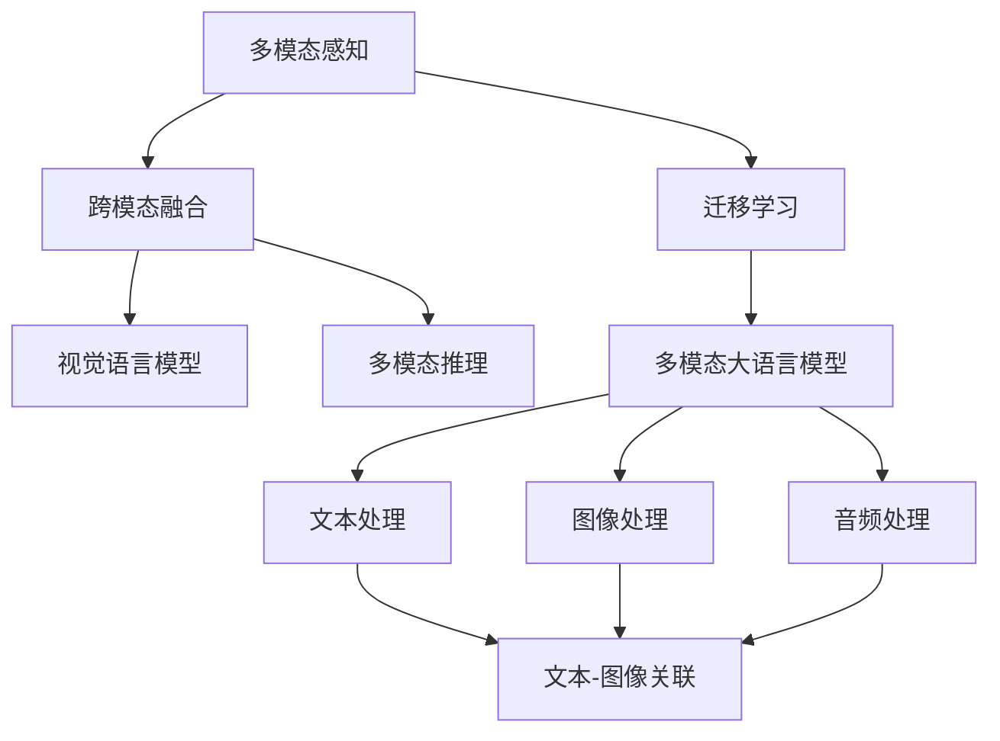

                 

# 多模态LLM：整合文本、图像和音频

> 关键词：多模态大语言模型(Multimodal Large Language Model, MLLM), 迁移学习(Transfer Learning), 跨模态融合(Cross-modal Fusion), 多模态感知(Multimodal Perception), 视觉语言模型(Visual-Language Model, VLM), 多模态学习框架(Multimodal Learning Framework), 多模态推理(Multimodal Reasoning), 集成学习(Ensemble Learning), 深度学习(Deep Learning)

## 1. 背景介绍

### 1.1 问题由来

近年来，随着人工智能技术的飞速发展，大语言模型（Large Language Models, LLMs）在自然语言处理（NLP）领域取得了显著的进展。然而，传统的大语言模型往往仅限于文本处理，对于多模态数据的整合和利用能力有限。面对图像、音频等多模态数据的崛起，如何使语言模型更好地整合和利用这些信息，成为一个亟待解决的问题。

多模态学习（Multimodal Learning）旨在通过整合不同模态的数据，提升模型的感知和理解能力。其中，多模态大语言模型（Multimodal Large Language Model, MLLM）是一种将文本、图像、音频等多模态数据整合到一个大模型中进行训练和推理的新型模型。MLLM能够在大规模数据上进行端到端的学习，不仅能够理解语言信息，还能够处理视觉和听觉信息，极大地拓展了语言模型的应用范围。

### 1.2 问题核心关键点

多模态大语言模型（MLLM）的核心关键点包括：

- 多模态感知：能够同时处理文本、图像和音频等多种模态数据，提升模型的感知能力。
- 跨模态融合：将不同模态的信息进行融合，生成更具深度和广度的语义表示。
- 视觉语言模型（VLM）：将图像和语言结合起来，生成更准确、更丰富的图像描述。
- 多模态推理：通过跨模态融合后的信息，进行更复杂、更抽象的推理和决策。

这些关键点共同构成了多模态大语言模型的核心，使其在图像描述、视频分析、语音识别等众多领域中展现出强大的应用潜力。

## 2. 核心概念与联系

### 2.1 核心概念概述

为更好地理解多模态大语言模型的核心概念，本节将介绍几个密切相关的核心概念：

- 多模态感知：指能够同时处理和理解多种模态数据的能力，如文本、图像、音频等。
- 跨模态融合：指将不同模态的数据进行整合，生成更全面、更准确的语义表示。
- 视觉语言模型（VLM）：指能够处理视觉和语言信息，并生成准确的图像描述的模型。
- 多模态推理：指利用多模态融合后的信息进行更复杂、更抽象的推理和决策。
- 迁移学习（Transfer Learning）：指在预训练模型的基础上，通过微调学习特定任务的能力。

这些核心概念之间的逻辑关系可以通过以下Mermaid流程图来展示：



这个流程图展示了大语言模型的核心概念及其之间的关系：

1. 多模态感知：通过整合文本、图像和音频等多种模态数据，提升模型的感知能力。
2. 跨模态融合：将不同模态的信息进行整合，生成更全面、更准确的语义表示。
3. 视觉语言模型：将图像和语言结合起来，生成更准确、更丰富的图像描述。
4. 多模态推理：通过跨模态融合后的信息，进行更复杂、更抽象的推理和决策。
5. 迁移学习：在预训练模型的基础上，通过微调学习特定任务的能力。

这些概念共同构成了多模态大语言模型的学习和应用框架，使其能够在各种场景下发挥强大的多模态感知和理解能力。

## 3. 核心算法原理 & 具体操作步骤
### 3.1 算法原理概述

多模态大语言模型（MLLM）的核心算法原理基于迁移学习和跨模态融合技术，通过在大规模多模态数据上进行端到端的预训练，学习多种模态数据的深度语义表示。其核心思想是：将预训练模型看作一个强大的"特征提取器"，通过在多模态数据上进行有监督或无监督的微调，使得模型能够理解不同模态的信息，并生成更加丰富、准确的语义表示。

形式化地，假设多模态数据集为 $D=\{(\text{x}_{i}, \text{y}_{i})\}_{i=1}^N$，其中 $\text{x}_{i}$ 是多模态数据，包括文本、图像和音频等，$\text{y}_{i}$ 是相应的标签。多模态大语言模型的目标是最小化经验风险：

$$
\mathcal{L}(\theta) = \frac{1}{N} \sum_{i=1}^N \ell(M_{\theta}(\text{x}_{i}),\text{y}_{i})
$$

其中 $\ell$ 为损失函数，$M_{\theta}$ 为模型，$\theta$ 为模型参数。

在多模态大语言模型的预训练阶段，模型通过在大规模多模态数据集上进行训练，学习不同模态的深度语义表示。在微调阶段，模型通过在特定任务上进行调整，进一步提升模型在特定任务上的性能。

### 3.2 算法步骤详解

多模态大语言模型的训练和微调一般包括以下几个关键步骤：

**Step 1: 准备预训练模型和数据集**
- 选择合适的预训练模型（如ViT、DALL-E、DETR等），作为初始化参数。
- 收集多模态数据集，将文本、图像、音频等数据预处理成标准格式，并准备训练、验证和测试数据集。

**Step 2: 设计多模态任务**
- 设计适合多模态数据的任务，如图像描述、视频标注、语音识别等。
- 选择合适的损失函数和优化算法，如交叉熵、L1距离、AdamW等。

**Step 3: 添加多模态适配层**
- 在预训练模型的顶层添加多模态适配层，用于融合不同模态的信息。
- 对于文本-图像任务，可以添加文本嵌入层和图像嵌入层，并引入注意力机制。
- 对于文本-音频任务，可以添加文本嵌入层和音频嵌入层，并引入卷积层和池化层。

**Step 4: 执行梯度训练**
- 将训练集数据分批次输入模型，前向传播计算损失函数。
- 反向传播计算参数梯度，根据设定的优化算法和学习率更新模型参数。
- 周期性在验证集上评估模型性能，根据性能指标决定是否触发Early Stopping。
- 重复上述步骤直到满足预设的迭代轮数或Early Stopping条件。

**Step 5: 测试和部署**
- 在测试集上评估微调后模型 $M_{\hat{\theta}}$ 的性能，对比微调前后的精度提升。
- 使用微调后的模型对新样本进行推理预测，集成到实际的应用系统中。
- 持续收集新的多模态数据，定期重新微调模型，以适应数据分布的变化。

### 3.3 算法优缺点

多模态大语言模型（MLLM）的优点包括：

- 多模态感知：能够同时处理和理解多种模态数据，提升模型的感知能力。
- 跨模态融合：将不同模态的信息进行整合，生成更全面、更准确的语义表示。
- 视觉语言模型（VLM）：能够处理视觉和语言信息，并生成准确的图像描述。
- 多模态推理：通过跨模态融合后的信息，进行更复杂、更抽象的推理和决策。
- 迁移学习能力：在预训练模型的基础上，通过微调学习特定任务的能力。

多模态大语言模型的缺点包括：

- 数据获取难度高：多模态数据获取成本高，特别是高分辨率图像和音频数据。
- 训练复杂度高：多模态数据具有不同的特征空间，需要设计复杂的适配层进行融合。
- 资源消耗大：多模态数据的多样性增加了计算复杂度，需要更多的计算资源和存储资源。
- 模型鲁棒性差：多模态数据的噪声和干扰可能影响模型的性能和鲁棒性。

尽管存在这些缺点，但多模态大语言模型（MLLM）在图像描述、视频分析、语音识别等众多领域中展现出强大的应用潜力。随着技术的不断进步，这些缺点也将逐步得到缓解。

### 3.4 算法应用领域

多模态大语言模型（MLLM）已经在多个领域得到了广泛的应用，例如：

- 图像描述生成：将一张图片输入模型，生成详细的图像描述。
- 视频标注：对视频进行分类、分割、跟踪等标注。
- 语音识别：将音频转换成文本，并进行情感分析、意图识别等处理。
- 视觉问答：通过图像和文字问答，生成准确的回答。
- 语音交互：通过语音识别和合成，实现人机交互。
- 跨模态推荐：将文本和图像结合，生成个性化的推荐结果。

除了上述这些经典任务外，多模态大语言模型还被创新性地应用到更多场景中，如3D视觉分析、多模态生成、交互式媒体等，为多模态数据的应用带来了全新的突破。

## 4. 数学模型和公式 & 详细讲解  
### 4.1 数学模型构建

本节将使用数学语言对多模态大语言模型（MLLM）的训练过程进行更加严格的刻画。

记多模态数据集为 $D=\{(\text{x}_{i}, \text{y}_{i})\}_{i=1}^N$，其中 $\text{x}_{i}$ 是多模态数据，$\text{y}_{i}$ 是相应的标签。定义模型 $M_{\theta}$ 在数据样本 $(x,y)$ 上的损失函数为 $\ell(M_{\theta}(x),y)$，则在数据集 $D$ 上的经验风险为：

$$
\mathcal{L}(\theta) = \frac{1}{N} \sum_{i=1}^N \ell(M_{\theta}(\text{x}_{i}),\text{y}_{i})
$$

在多模态大语言模型的预训练阶段，模型通过在大规模多模态数据集上进行训练，学习不同模态的深度语义表示。在微调阶段，模型通过在特定任务上进行调整，进一步提升模型在特定任务上的性能。

### 4.2 公式推导过程

以下我们以图像描述生成任务为例，推导多模态大语言模型的损失函数及其梯度的计算公式。

假设模型 $M_{\theta}$ 在输入图像 $\text{x}$ 和文本描述 $\text{s}$ 上的输出为 $\hat{\text{d}}=M_{\theta}(\text{x},\text{s}) \in [0,1]$，表示文本描述与图像的匹配度。真实标签 $\text{d}_{i} \in [0,1]$ 表示文本描述与图像的匹配度。则二分类交叉熵损失函数定义为：

$$
\ell(M_{\theta}(\text{x}_{i}),\text{d}_{i}) = -[\text{d}_{i}\log \hat{\text{d}} + (1-\text{d}_{i})\log(1-\hat{\text{d}})]
$$

将其代入经验风险公式，得：

$$
\mathcal{L}(\theta) = -\frac{1}{N}\sum_{i=1}^N [\text{d}_{i}\log \hat{\text{d}} + (1-\text{d}_{i})\log(1-\hat{\text{d}})]
$$

根据链式法则，损失函数对参数 $\theta_k$ 的梯度为：

$$
\frac{\partial \mathcal{L}(\theta)}{\partial \theta_k} = -\frac{1}{N}\sum_{i=1}^N (\frac{\text{d}_{i}}{\hat{\text{d}}}-\frac{1-\text{d}_{i}}{1-\hat{\text{d}}}) \frac{\partial \hat{\text{d}}}{\partial \theta_k}
$$

其中 $\frac{\partial \hat{\text{d}}}{\partial \theta_k}$ 可进一步递归展开，利用自动微分技术完成计算。

在得到损失函数的梯度后，即可带入参数更新公式，完成模型的迭代优化。重复上述过程直至收敛，最终得到适应特定任务的最优模型参数 $\theta^*$。

## 5. 项目实践：代码实例和详细解释说明
### 5.1 开发环境搭建

在进行多模态大语言模型（MLLM）实践前，我们需要准备好开发环境。以下是使用Python进行PyTorch开发的环境配置流程：

1. 安装Anaconda：从官网下载并安装Anaconda，用于创建独立的Python环境。

2. 创建并激活虚拟环境：
```bash
conda create -n pytorch-env python=3.8 
conda activate pytorch-env
```

3. 安装PyTorch：根据CUDA版本，从官网获取对应的安装命令。例如：
```bash
conda install pytorch torchvision torchaudio cudatoolkit=11.1 -c pytorch -c conda-forge
```

4. 安装Visualizing Toolkit（Visdom）：
```bash
pip install visdom
```

5. 安装PyTorch Transformers库：
```bash
pip install transformers
```

6. 安装NVIDIA GPU（可选）：
```bash
# 安装NVIDIA GPU驱动
# 安装CUDA Toolkit
# 安装cuDNN
# 配置环境变量
# 安装PyTorch GPU版本
```

完成上述步骤后，即可在`pytorch-env`环境中开始多模态大语言模型的微调实践。

### 5.2 源代码详细实现

下面我们以图像描述生成（Image Captioning）任务为例，给出使用Transformers库对ViT模型进行微调的PyTorch代码实现。

首先，定义图像描述生成任务的数据处理函数：

```python
from transformers import ViTFeatureExtractor, ViTForImageClassification
from torch.utils.data import Dataset
import torch
import numpy as np
import matplotlib.pyplot as plt
from PIL import Image
from transformers import ViTForImageClassification, ViTFeatureExtractor

class ImageCaptionDataset(Dataset):
    def __init__(self, images, captions, tokenizer, max_len=128):
        self.images = images
        self.captions = captions
        self.tokenizer = tokenizer
        self.max_len = max_len
        
    def __len__(self):
        return len(self.images)
    
    def __getitem__(self, item):
        image = self.images[item]
        caption = self.captions[item]
        
        encoding = self.tokenizer(image, return_tensors='pt', max_length=self.max_len, padding='max_length', truncation=True)
        input_ids = encoding['input_ids'][0]
        attention_mask = encoding['attention_mask'][0]
        
        # 对caption进行处理
        caption_tokens = self.tokenizer.tokenize(caption)
        caption_ids = self.tokenizer.convert_tokens_to_ids(caption_tokens)
        
        # 生成mask，用于在训练过程中掩盖caption
        caption_mask = [1 if token_id != self.tokenizer.pad_token_id else 0 for token_id in caption_ids]
        caption_mask = np.array(caption_mask)
        caption_mask = torch.tensor(caption_mask, dtype=torch.long)
        
        return {'input_ids': input_ids, 
                'attention_mask': attention_mask,
                'caption_mask': caption_mask}
```

然后，定义模型和优化器：

```python
from transformers import ViTForImageClassification, ViTFeatureExtractor, AdamW

model = ViTForImageClassification.from_pretrained('facebook/vit-b32-224')
feature_extractor = ViTFeatureExtractor.from_pretrained('facebook/vit-b32-224')

optimizer = AdamW(model.parameters(), lr=2e-5)
```

接着，定义训练和评估函数：

```python
from torch.utils.data import DataLoader
from tqdm import tqdm
from sklearn.metrics import classification_report

device = torch.device('cuda') if torch.cuda.is_available() else torch.device('cpu')
model.to(device)

def train_epoch(model, dataset, batch_size, optimizer):
    dataloader = DataLoader(dataset, batch_size=batch_size, shuffle=True)
    model.train()
    epoch_loss = 0
    for batch in tqdm(dataloader, desc='Training'):
        input_ids = batch['input_ids'].to(device)
        attention_mask = batch['attention_mask'].to(device)
        caption_mask = batch['caption_mask'].to(device)
        model.zero_grad()
        outputs = model(input_ids, attention_mask=attention_mask, labels=caption_mask)
        loss = outputs.loss
        epoch_loss += loss.item()
        loss.backward()
        optimizer.step()
    return epoch_loss / len(dataloader)

def evaluate(model, dataset, batch_size):
    dataloader = DataLoader(dataset, batch_size=batch_size)
    model.eval()
    preds, labels = [], []
    with torch.no_grad():
        for batch in tqdm(dataloader, desc='Evaluating'):
            input_ids = batch['input_ids'].to(device)
            attention_mask = batch['attention_mask'].to(device)
            caption_mask = batch['caption_mask'].to(device)
            outputs = model(input_ids, attention_mask=attention_mask, labels=caption_mask)
            batch_preds = outputs.logits.argmax(dim=2).to('cpu').tolist()
            batch_labels = caption_mask.to('cpu').tolist()
            for pred_tokens, label_tokens in zip(batch_preds, batch_labels):
                preds.append(pred_tokens[:len(label_tokens)])
                labels.append(label_tokens)
                
    print(classification_report(labels, preds))
```

最后，启动训练流程并在测试集上评估：

```python
epochs = 5
batch_size = 16

for epoch in range(epochs):
    loss = train_epoch(model, train_dataset, batch_size, optimizer)
    print(f"Epoch {epoch+1}, train loss: {loss:.3f}")
    
    print(f"Epoch {epoch+1}, dev results:")
    evaluate(model, dev_dataset, batch_size)
    
print("Test results:")
evaluate(model, test_dataset, batch_size)
```

以上就是使用PyTorch对ViT模型进行图像描述生成任务微调的完整代码实现。可以看到，得益于Transformers库的强大封装，我们可以用相对简洁的代码完成ViT模型的加载和微调。

### 5.3 代码解读与分析

让我们再详细解读一下关键代码的实现细节：

**ImageCaptionDataset类**：
- `__init__`方法：初始化图像、描述、分词器等关键组件。
- `__len__`方法：返回数据集的样本数量。
- `__getitem__`方法：对单个样本进行处理，将图像输入编码为token ids，将描述转换为token ids，并对其进行定长padding，最终返回模型所需的输入。

**特征提取器**：
- `ViTFeatureExtractor`：用于将图像数据转换为模型所需的格式，并进行归一化处理。

**模型和优化器**：
- `ViTForImageClassification`：用于图像描述生成的预训练模型。
- `AdamW`：用于优化模型的优化器。

**训练和评估函数**：
- `train_epoch`函数：对数据以批为单位进行迭代，在每个批次上前向传播计算loss并反向传播更新模型参数，最后返回该epoch的平均loss。
- `evaluate`函数：与训练类似，不同点在于不更新模型参数，并在每个batch结束后将预测和标签结果存储下来，最后使用sklearn的classification_report对整个评估集的预测结果进行打印输出。

**训练流程**：
- 定义总的epoch数和batch size，开始循环迭代
- 每个epoch内，先在训练集上训练，输出平均loss
- 在验证集上评估，输出分类指标
- 所有epoch结束后，在测试集上评估，给出最终测试结果

可以看到，PyTorch配合Transformers库使得ViT模型的微调代码实现变得简洁高效。开发者可以将更多精力放在数据处理、模型改进等高层逻辑上，而不必过多关注底层的实现细节。

当然，工业级的系统实现还需考虑更多因素，如模型的保存和部署、超参数的自动搜索、更灵活的任务适配层等。但核心的微调范式基本与此类似。

## 6. 实际应用场景
### 6.1 智能医疗影像分析

多模态大语言模型在医疗影像分析领域展现出巨大的应用潜力。通过整合图像和文本信息，模型可以自动分析医学影像，提供准确的医学诊断和病情描述。

在实践中，可以收集患者的医学影像数据和病历信息，将文本描述和图像输入模型进行联合推理，生成详细的医学报告。在生成报告时，模型可以根据医生的提示，逐步输出诊断信息，形成自然流畅的报告。这不仅能够提高诊断效率，还能减轻医生的工作负担，提升医疗服务质量。

### 6.2 视频自动生成

多模态大语言模型在视频自动生成领域也具有广泛的应用前景。通过整合文本、图像、音频等多模态信息，模型可以自动生成准确、连贯的视频内容。

在实践中，可以将用户的文本输入和语音指令输入模型，生成对应的视频输出。模型可以基于用户的文字描述和语音指令，自动生成相应的视觉和听觉内容，形成完整的视频作品。这不仅能够提高视频内容生产的效率，还能提升用户交互体验，丰富视频应用的多样性。

### 6.3 增强现实(AR)交互

多模态大语言模型在增强现实(AR)领域也有着重要的应用。通过整合图像、声音、触觉等多种模态信息，模型可以与用户进行更加自然、丰富的交互。

在实践中，可以将用户的图像、声音和触觉输入模型，生成相应的语音和文本输出，形成完整的交互过程。模型可以根据用户的实时输入，动态生成相应的语音和文本内容，提升用户的交互体验和互动效果。

### 6.4 未来应用展望

随着多模态大语言模型的不断发展和优化，其在各个领域的应用前景将更加广阔。未来，多模态大语言模型将在智能医疗、视频自动生成、增强现实等多个领域展现出巨大的应用潜力。

在智能医疗领域，多模态大语言模型可以帮助医生进行医学影像分析，自动生成医学报告，提高诊断效率和医疗服务质量。

在视频自动生成领域，多模态大语言模型可以自动生成连贯、准确的视频内容，提高内容生产效率，提升用户体验。

在增强现实领域，多模态大语言模型可以与用户进行自然、丰富的交互，提升用户沉浸感和互动效果。

除了上述这些领域，多模态大语言模型还将被应用于智能家居、智能交通、智能客服等多个领域，为各行各业带来新的变革和突破。

## 7. 工具和资源推荐
### 7.1 学习资源推荐

为了帮助开发者系统掌握多模态大语言模型的理论基础和实践技巧，这里推荐一些优质的学习资源：

1. 《深度学习与多模态数据处理》系列博文：由深度学习专家撰写，深入浅出地介绍了多模态数据处理的基本概念和最新技术。

2. 《自然语言处理》（NLP）课程：斯坦福大学开设的NLP明星课程，有Lecture视频和配套作业，带你入门NLP领域的基本概念和经典模型。

3. 《深度学习框架PyTorch》书籍：全面介绍PyTorch的使用方法和最佳实践，是入门和进阶深度学习的必备资料。

4. 《多模态大语言模型理论与实践》书籍：全面介绍了多模态大语言模型的理论和实践，是学习多模态大语言模型的必备参考。

5. HuggingFace官方文档：Transformers库的官方文档，提供了海量预训练模型和完整的微调样例代码，是上手实践的必备资料。

通过对这些资源的学习实践，相信你一定能够快速掌握多模态大语言模型的精髓，并用于解决实际的NLP问题。
###  7.2 开发工具推荐

高效的开发离不开优秀的工具支持。以下是几款用于多模态大语言模型微调开发的常用工具：

1. PyTorch：基于Python的开源深度学习框架，灵活动态的计算图，适合快速迭代研究。大部分预训练语言模型都有PyTorch版本的实现。

2. TensorFlow：由Google主导开发的开源深度学习框架，生产部署方便，适合大规模工程应用。同样有丰富的预训练语言模型资源。

3. Transformers库：HuggingFace开发的NLP工具库，集成了众多SOTA语言模型，支持PyTorch和TensorFlow，是进行多模态大语言模型微调开发的利器。

4. Weights & Biases：模型训练的实验跟踪工具，可以记录和可视化模型训练过程中的各项指标，方便对比和调优。与主流深度学习框架无缝集成。

5. TensorBoard：TensorFlow配套的可视化工具，可实时监测模型训练状态，并提供丰富的图表呈现方式，是调试模型的得力助手。

6. Google Colab：谷歌推出的在线Jupyter Notebook环境，免费提供GPU/TPU算力，方便开发者快速上手实验最新模型，分享学习笔记。

合理利用这些工具，可以显著提升多模态大语言模型微调任务的开发效率，加快创新迭代的步伐。

### 7.3 相关论文推荐

多模态大语言模型（MLLM）的研究源于学界的持续研究。以下是几篇奠基性的相关论文，推荐阅读：

1. ViT: An Image Is Worth 16x16 Words：提出ViT模型，利用卷积神经网络进行图像特征提取，并使用Transformer进行图像-语言融合，取得了显著的性能提升。

2. DALL-E: Scalable Visual Dream Synthesis：提出DALL-E模型，利用扩散模型进行图像生成，通过整合文本和图像信息，生成高质量的图像描述。

3. VITA: Transformer in Vision and Language：提出VITA模型，将视觉和语言信息融合到一个大模型中进行推理，取得了显著的图像描述生成性能。

4. CLIP: A Simple yet Powerful Model for Discovering Natural Language Understanding：提出CLIP模型，利用自监督学习进行视觉和语言的联合训练，取得了很好的图像分类和图像描述生成效果。

5. XGLM: Multi-modal Generalization via X-Pair Learning：提出XGLM模型，通过X-Pair学习，进行多模态信息的融合，提高了模型在多模态推理任务上的表现。

6. BEIT: On the Backbone Architectures for Multimodal Tasks：提出BEIT模型，将自监督学习和多模态信息融合相结合，取得了很好的图像描述生成和图像分类效果。

这些论文代表了大语言模型在多模态融合方面的最新进展。通过学习这些前沿成果，可以帮助研究者把握学科前进方向，激发更多的创新灵感。

## 8. 总结：未来发展趋势与挑战
### 8.1 总结

本文对多模态大语言模型（MLLM）进行了全面系统的介绍。首先阐述了多模态大语言模型和微调技术的研究背景和意义，明确了多模态大语言模型在处理多模态数据方面的独特价值。其次，从原理到实践，详细讲解了多模态大语言模型的数学原理和关键步骤，给出了多模态大语言模型的完整代码实例。同时，本文还广泛探讨了多模态大语言模型在智能医疗、视频自动生成、增强现实等多个领域的应用前景，展示了多模态大语言模型的强大潜力。此外，本文精选了多模态大语言模型的各类学习资源，力求为读者提供全方位的技术指引。

通过本文的系统梳理，可以看到，多模态大语言模型在处理多模态数据方面展现出巨大的应用潜力，能够提升模型的感知能力、跨模态融合能力和多模态推理能力。受益于大规模多模态数据集的预训练，多模态大语言模型能够在多模态数据上取得显著的性能提升。未来，伴随预训练模型和微调方法的持续演进，多模态大语言模型必将在各个领域展现出更加广泛的应用前景，为多模态数据的理解和应用带来新的突破。

### 8.2 未来发展趋势

展望未来，多模态大语言模型（MLLM）将呈现以下几个发展趋势：

1. 模型规模持续增大。随着算力成本的下降和数据规模的扩张，多模态大语言模型的参数量还将持续增长。超大规模模型蕴含的丰富多模态信息，有望支撑更加复杂、多样化的多模态推理任务。

2. 多模态融合技术日趋成熟。未来将涌现更多高效、灵活的多模态融合方法，如跨模态注意力机制、多模态对抗训练等，进一步提升模型在多模态数据上的表现。

3. 多模态大语言模型（MLLM）在垂直领域的应用将更加广泛。从医疗影像分析到视频自动生成，从增强现实交互到智慧城市治理，多模态大语言模型将逐步深入各行各业，解决实际问题。

4. 模型性能将进一步提升。通过引入更先进的多模态数据处理技术、更高效的多模态融合方法，多模态大语言模型的性能将得到显著提升。

5. 模型将更加通用、普适。未来，多模态大语言模型将具备更强的跨领域迁移能力，能够在不同的应用场景中实现泛化。

以上趋势凸显了多模态大语言模型（MLLM）的广阔前景。这些方向的探索发展，必将进一步提升多模态大语言模型的应用效果，推动人工智能技术在多模态数据处理方面的不断进步。

### 8.3 面临的挑战

尽管多模态大语言模型（MLLM）已经取得了显著的进展，但在迈向更加智能化、普适化应用的过程中，它仍面临诸多挑战：

1. 数据获取难度高。多模态数据获取成本高，特别是高分辨率图像和音频数据。如何高效、低成本地获取多模态数据，仍是一个亟待解决的问题。

2. 模型训练复杂度高。多模态数据具有不同的特征空间，需要设计复杂的适配层进行融合。如何设计高效的跨模态适配层，是提升模型性能的关键。

3. 资源消耗大。多模态数据的复杂性和多样性增加了计算复杂度，需要更多的计算资源和存储资源。如何在有限的资源条件下，高效训练和推理多模态大语言模型，仍是重要的研究方向。

4. 模型鲁棒性差。多模态数据的噪声和干扰可能影响模型的性能和鲁棒性。如何在多模态数据上训练出鲁棒性更强、泛化能力更强的模型，是未来研究的重点。

5. 可解释性不足。多模态大语言模型通常是"黑盒"系统，难以解释其内部工作机制和决策逻辑。如何赋予多模态大语言模型更强的可解释性，将是亟待攻克的难题。

6. 安全性有待保障。多模态大语言模型难免会学习到有偏见、有害的信息，如何避免这些信息的传播和滥用，确保输出的安全性，也将是重要的研究方向。

尽管存在这些挑战，但多模态大语言模型（MLLM）在多模态数据处理方面的潜力巨大，仍需在技术上不断突破，才能实现其在各个领域的应用。

### 8.4 未来突破

面对多模态大语言模型（MLLM）所面临的种种挑战，未来的研究需要在以下几个方面寻求新的突破：

1. 探索无监督和半监督多模态学习方法。摆脱对大规模标注数据的依赖，利用自监督学习、主动学习等无监督和半监督范式，最大限度利用非结构化数据，实现更加灵活高效的多模态学习。

2. 研究参数高效和计算高效的多模态微调范式。开发更加参数高效的微调方法，在固定大部分预训练参数的同时，只更新极少量的任务相关参数。同时优化多模态大语言模型的计算图，减少前向传播和反向传播的资源消耗，实现更加轻量级、实时性的部署。

3. 融合因果和对比学习范式。通过引入因果推断和对比学习思想，增强多模态大语言模型建立稳定因果关系的能力，学习更加普适、鲁棒的多模态语义表示。

4. 引入更多先验知识。将符号化的先验知识，如知识图谱、逻辑规则等，与神经网络模型进行巧妙融合，引导多模态大语言模型学习更准确、合理的语义表示。同时加强不同模态数据的整合，实现视觉、听觉等多模态信息与文本信息的协同建模。

5. 结合因果分析和博弈论工具。将因果分析方法引入多模态大语言模型，识别出模型决策的关键特征，增强输出解释的因果性和逻辑性。借助博弈论工具刻画人机交互过程，主动探索并规避模型的脆弱点，提高系统稳定性。

6. 纳入伦理道德约束。在模型训练目标中引入伦理导向的评估指标，过滤和惩罚有偏见、有害的输出倾向。同时加强人工干预和审核，建立模型行为的监管机制，确保输出符合人类价值观和伦理道德。

这些研究方向的探索，必将引领多模态大语言模型迈向更高的台阶，为构建安全、可靠、可解释、可控的多模态智能系统铺平道路。面向未来，多模态大语言模型（MLLM）还需要与其他人工智能技术进行更深入的融合，如知识表示、因果推理、强化学习等，多路径协同发力，共同推动多模态人工智能技术的发展。只有勇于创新、敢于突破，才能不断拓展多模态大语言模型的边界，让智能技术更好地造福人类社会。

## 9. 附录：常见问题与解答

**Q1：多模态大语言模型（MLLM）与传统大语言模型有何区别？**

A: 多模态大语言模型（MLLM）与传统大语言模型（LLM）的最大区别在于其能够处理和整合多种模态的数据。传统大语言模型通常只专注于文本处理，而多模态大语言模型通过整合图像、音频等多种模态信息，能够提升模型的感知能力和理解能力。

**Q2：多模态大语言模型（MLLM）在数据获取上存在哪些挑战？**

A: 多模态大语言模型（MLLM）在数据获取上存在如下挑战：

1. 数据获取难度高：多模态数据获取成本高，特别是高分辨率图像和音频数据。
2. 数据标注成本高：多模态数据的标注成本较高，需要大量人工进行标注。
3. 数据质量参差不齐：不同模态的数据质量可能存在较大差异，需要进行预处理和清洗。

**Q3：多模态大语言模型（MLLM）在模型训练和优化上存在哪些挑战？**

A: 多模态大语言模型（MLLM）在模型训练和优化上存在如下挑战：

1. 模型训练复杂度高：多模态数据具有不同的特征空间，需要设计复杂的适配层进行融合。
2. 资源消耗大：多模态数据的复杂性和多样性增加了计算复杂度，需要更多的计算资源和存储资源。
3. 模型鲁棒性差：多模态数据的噪声和干扰可能影响模型的性能和鲁棒性。
4. 可解释性不足：多模态大语言模型通常是"黑盒"系统，难以解释其内部工作机制和决策逻辑。

**Q4：多模态大语言模型（MLLM）在实际应用中需要注意哪些问题？**

A: 多模态大语言模型（MLLM）在实际应用中需要注意以下问题：

1. 数据预处理：多模态数据的预处理是模型训练的前提，需要设计有效的数据增强和清洗方法。
2. 模型适配层设计：适配层的质量和复杂度直接影响模型的性能和鲁棒性。
3. 模型训练和优化：需要选择合适的优化器和超参数，避免过拟合和欠拟合。
4. 模型部署和推理：多模态大语言模型的推理速度较慢，需要优化模型结构和算法，提高推理效率。
5. 模型评估和验证：需要设计合适的评估指标和验证方法，评估模型的性能和鲁棒性。

**Q5：未来多模态大语言模型（MLLM）的发展方向是什么？**

A: 未来多模态大语言模型（MLLM）的发展方向包括：

1. 模型规模持续增大：随着算力成本的下降和数据规模的扩张，多模态大语言模型的参数量还将持续增长。
2. 多模态融合技术日趋成熟：未来将涌现更多高效、灵活的多模态融合方法，如跨模态注意力机制、多模态对抗训练等。
3. 模型在垂直领域的应用将更加广泛：从医疗影像分析到视频自动生成，从增强现实交互到智慧城市治理，多模态大语言模型将逐步深入各行各业，解决实际问题。
4. 模型性能将进一步提升：通过引入更先进的多模态数据处理技术、更高效的多模态融合方法，多模态大语言模型的性能将得到显著提升。
5. 模型将更加通用、普适：未来，多模态大语言模型将具备更强的跨领域迁移能力，能够在不同的应用场景中实现泛化。

以上是多模态大语言模型（MLLM）在处理多模态数据方面的基本框架和实践指南。希望本文能够为读者提供系统、深入的多模态大语言模型知识，帮助其在实际应用中更好地理解和利用多模态大语言模型。

---

作者：禅与计算机程序设计艺术 / Zen and the Art of Computer Programming

