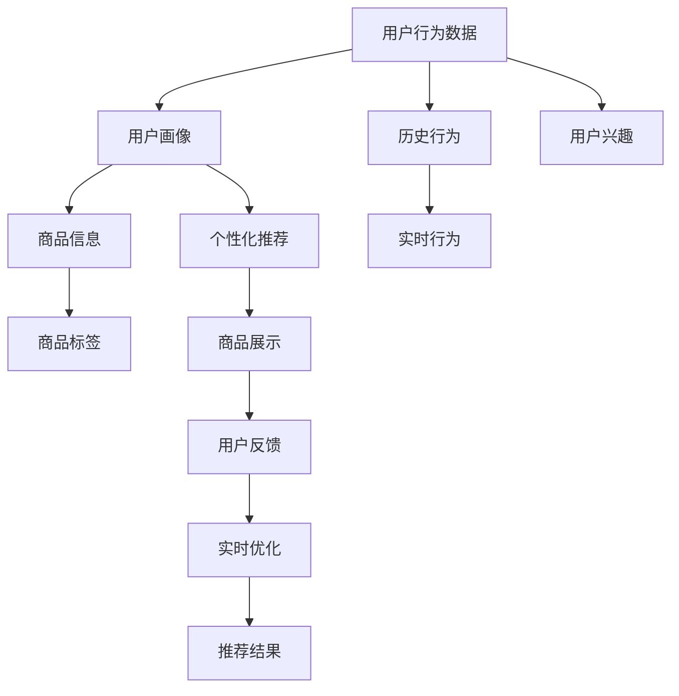

                 

## 1. 背景介绍

### 1.1 问题由来

在电商平台上，搜索推荐系统（Search and Recommendation System, SR）不仅是用户体验的核心，也是驱动销售增长的重要引擎。随着消费者行为和偏好的不断变化，传统的基于规则和关键词的搜索推荐系统已难以满足市场需求，需要引入大数据和AI技术进行升级转型。

### 1.2 问题核心关键点

1. **个性化推荐**：利用用户历史行为和兴趣，推荐相关商品，提高用户体验和转化率。
2. **实时性优化**：根据实时数据动态调整推荐策略，捕捉用户最新需求。
3. **多模态融合**：将用户行为数据、商品信息、用户画像等多源数据进行整合，提升推荐效果。
4. **数据安全和隐私保护**：保护用户数据隐私，确保推荐过程的公平性和安全性。
5. **模型性能优化**：通过技术手段提升推荐模型的准确性和效率。

### 1.3 问题研究意义

构建高效、个性化、实时性的搜索推荐系统，对电商平台而言意义重大：

- 提高用户满意度：精准的个性化推荐能显著提升用户购物体验，增加用户粘性。
- 增强销售转化率：通过深入了解用户需求，有效促进用户购买决策，提高转化率。
- 优化库存管理：动态推荐有助于库存调节，避免商品积压或缺货。
- 提升运营效率：通过精准定位用户需求，优化广告投放和营销策略，提升整体运营效率。

### 1.4 研究目的和目标

本文章将系统介绍基于大数据与AI技术的电商平台搜索推荐系统的设计与实现，重点内容包括：
1. 搜索推荐系统的核心概念和架构。
2. 搜索推荐算法的基本原理及实现步骤。
3. 数学模型和公式推导，以提升推荐效果。
4. 项目实践中的代码实现与分析。
5. 实际应用场景，探讨未来发展趋势和面临的挑战。
6. 推荐系统的工具和资源推荐，提供技术指引。

通过深入理解搜索推荐系统的核心技术和实践应用，希望能为电商平台提供有价值的参考，推动电商行业数字化转型。

## 2. 核心概念与联系

### 2.1 核心概念概述

为更好地理解搜索推荐系统的构建，本节将介绍几个核心概念：

1. **搜索推荐系统（Search and Recommendation System, SR）**：
   - 是电商平台的核心功能模块，通过分析和理解用户行为，推荐个性化商品，提高用户满意度和转化率。
   - 通常由两部分组成：搜索系统和推荐系统，分别处理用户查询和推荐商品。

2. **个性化推荐（Personalized Recommendation）**：
   - 根据用户历史行为、兴趣、背景等多维数据，推荐可能感兴趣的商品。
   - 目标是缩小搜索范围，减少用户选择成本，提升购物体验。

3. **协同过滤（Collaborative Filtering）**：
   - 基于用户与商品之间的交互历史，预测用户对未交互商品的偏好。
   - 包括基于用户的协同过滤和基于物品的协同过滤两种方法。

4. **内容推荐（Content-Based Recommendation）**：
   - 利用商品的属性信息（如价格、描述、标签等）推荐相关商品。
   - 适用于用户行为数据不足或用户画像难以刻画的情况。

5. **深度学习（Deep Learning）**：
   - 通过构建神经网络模型，捕捉用户和商品之间的复杂关联，提升推荐效果。
   - 典型的深度学习推荐算法包括神经协同过滤、序列推荐、跨域推荐等。

### 2.2 核心概念原理和架构的 Mermaid 流程图



此流程图展示了搜索推荐系统的主要流程：

1. 收集用户行为数据。
2. 构建用户画像，分析用户兴趣和偏好。
3. 整合商品信息，提取商品特征。
4. 通过个性化推荐算法，预测用户可能感兴趣的商品。
5. 展示推荐结果，接收用户反馈。
6. 根据用户反馈，实时调整推荐策略。

## 3. 核心算法原理 & 具体操作步骤

### 3.1 算法原理概述

搜索推荐系统主要由两个部分组成：搜索模块和推荐模块。搜索模块处理用户查询，推荐模块根据用户查询结果和用户画像推荐商品。

### 3.2 算法步骤详解

#### 3.2.1 数据准备

1. **数据采集**：
   - 收集用户行为数据（如点击、浏览、购买等）。
   - 收集商品信息（如价格、描述、标签等）。
   - 构建用户画像（如年龄、性别、地理位置等）。

2. **数据清洗**：
   - 处理缺失值、异常值等数据噪声。
   - 进行数据归一化和标准化处理。

#### 3.2.2 特征工程

1. **特征提取**：
   - 从用户行为数据中提取用户特征，如浏览时间、点击次数、购买频率等。
   - 从商品信息中提取商品特征，如价格、标签、类别等。
   - 利用用户画像构建用户特征，如性别、年龄、地理位置等。

2. **特征选择**：
   - 通过特征选择方法（如卡方检验、信息增益等），选择最具区分力的特征。
   - 对特征进行降维处理，减少维度灾难。

#### 3.2.3 模型训练

1. **选择模型**：
   - 根据推荐系统需求选择合适的推荐算法，如协同过滤、内容推荐、深度学习等。
   - 常用算法包括基于用户的协同过滤、基于物品的协同过滤、矩阵分解、神经协同过滤等。

2. **模型训练**：
   - 使用历史数据对模型进行训练。
   - 使用交叉验证等技术进行模型评估和调优。

#### 3.2.4 实时推荐

1. **数据采集**：
   - 实时采集用户行为数据，如点击、浏览等。
   - 动态更新用户画像和商品信息。

2. **推荐预测**：
   - 根据实时数据，使用训练好的推荐模型进行预测。
   - 采用增量学习等技术，实时更新模型参数。

#### 3.2.5 推荐结果展示

1. **展示推荐结果**：
   - 将推荐结果展示给用户，通常通过搜索结果页面或个性化推荐模块。
   - 展示方式包括推荐列表、侧边栏推荐等。

2. **用户反馈收集**：
   - 收集用户对推荐结果的反馈，如点击、购买、评价等。
   - 使用A/B测试等方法评估推荐效果。

### 3.3 算法优缺点

#### 3.3.1 优点

1. **提高用户满意度**：
   - 个性化推荐能够根据用户行为和兴趣推荐商品，提升用户体验。
   - 减少用户选择成本，提高用户满意度。

2. **增强销售转化率**：
   - 通过精准推荐，提高用户购买意愿，提升销售转化率。
   - 优化商品库存管理，避免积压或缺货。

3. **提升运营效率**：
   - 精准定位用户需求，优化广告投放和营销策略。
   - 实时调整推荐策略，提升运营效率。

#### 3.3.2 缺点

1. **数据隐私问题**：
   - 收集和分析用户数据，可能涉及隐私问题。
   - 需要遵守相关法律法规，保护用户隐私。

2. **算法复杂度**：
   - 深度学习等复杂算法，计算量较大。
   - 需要高性能计算资源支持。

3. **推荐多样性**：
   - 推荐结果可能偏向热门商品，忽略长尾商品。
   - 需要设计多样性约束，避免推荐单一商品。

4. **冷启动问题**：
   - 新用户或新商品的数据较少，难以进行个性化推荐。
   - 需要引入启发式方法，解决冷启动问题。

### 3.4 算法应用领域

搜索推荐系统在电商平台上有着广泛的应用：

1. **商品搜索**：
   - 用户通过搜索功能查找商品。
   - 搜索系统需要快速准确地返回相关商品。

2. **个性化推荐**：
   - 根据用户行为和兴趣推荐相关商品。
   - 提升用户体验和销售转化率。

3. **广告投放**：
   - 根据用户兴趣和行为，精准投放广告。
   - 优化广告投放策略，提升广告效果。

4. **用户画像构建**：
   - 通过分析用户行为，构建用户画像。
   - 用于个性化推荐和广告投放。

5. **市场分析**：
   - 利用推荐系统数据，进行市场分析和预测。
   - 优化库存管理和营销策略。

## 4. 数学模型和公式 & 详细讲解 & 举例说明

### 4.1 数学模型构建

搜索推荐系统的数学模型通常包括以下组成部分：

1. **用户行为数据模型**：
   - 描述用户历史行为和兴趣的向量。
   - 模型形式为：$u \in \mathbb{R}^n$，其中 $n$ 为特征维度。

2. **商品信息模型**：
   - 描述商品属性和特征的向量。
   - 模型形式为：$i \in \mathbb{R}^m$，其中 $m$ 为特征维度。

3. **推荐模型**：
   - 描述用户与商品之间的关联关系。
   - 常用模型包括矩阵分解、神经协同过滤等。

### 4.2 公式推导过程

#### 4.2.1 矩阵分解

矩阵分解是常用的推荐算法之一，其基本思想是将用户行为矩阵 $U$ 和商品特征矩阵 $I$ 进行分解，得到用户隐式表示 $U'$ 和商品隐式表示 $I'$，然后计算用户对商品的预测评分 $r_{ui}$。

设用户行为矩阵为 $U$，商品特征矩阵为 $I$，用户隐式表示为 $U'$，商品隐式表示为 $I'$，预测评分公式为：

$$
r_{ui} = \hat{p}_{ui} = \frac{\mathbf{u}'_i \mathbf{i}'_u}{\|\mathbf{u}'_i\|\|\mathbf{i}'_u\|}
$$

其中，$\mathbf{u}'_i = U'_i$ 表示用户 $u$ 对商品 $i$ 的预测评分。

#### 4.2.2 神经协同过滤

神经协同过滤（Neural Collaborative Filtering, NCF）是深度学习推荐算法的一种，其基本思想是构建深度神经网络，通过多层网络结构提取用户和商品的特征表示，预测用户对商品的评分。

设神经网络为 $f_{\theta}$，用户特征向量为 $\mathbf{u}$，商品特征向量为 $\mathbf{i}$，预测评分公式为：

$$
\hat{p}_{ui} = f_{\theta}(\mathbf{u}, \mathbf{i})
$$

其中，$f_{\theta}$ 为神经网络，$\mathbf{u}$ 和 $\mathbf{i}$ 分别为用户特征和商品特征向量。

### 4.3 案例分析与讲解

以协同过滤算法为例，分析其在推荐系统中的应用。

1. **基于用户的协同过滤**：
   - 根据用户 $u$ 对商品 $i$ 的评分数据，构建用户评分矩阵 $R$。
   - 设 $R$ 为 $N \times M$ 的矩阵，$N$ 为用户数，$M$ 为商品数。

2. **用户隐式表示**：
   - 将 $R$ 分解为用户隐式表示矩阵 $U$ 和商品特征矩阵 $I$。
   - 设 $U$ 为 $N \times d$ 矩阵，$I$ 为 $M \times d$ 矩阵，$d$ 为隐式维度。

3. **商品隐式表示**：
   - 将 $R$ 分解为 $U'$ 和 $I'$，$U'$ 为 $N \times d'$ 矩阵，$I'$ 为 $M \times d'$ 矩阵，$d'$ 为隐式维度。

4. **预测评分**：
   - 计算用户 $u$ 对商品 $i$ 的预测评分 $r_{ui}$。
   - 预测评分公式为 $r_{ui} = \frac{\mathbf{u}'_i \mathbf{i}'_u}{\|\mathbf{u}'_i\|\|\mathbf{i}'_u\|}$。

## 5. 项目实践：代码实例和详细解释说明

### 5.1 开发环境搭建

#### 5.1.1 环境配置

1. **安装Python**：
   - 下载并安装最新版本的Python，推荐使用Anaconda环境管理工具。

2. **创建虚拟环境**：
   - 使用Anaconda创建虚拟环境，并激活。

   ```bash
   conda create -n recommendation-env python=3.8
   conda activate recommendation-env
   ```

3. **安装依赖包**：
   - 安装TensorFlow、Pandas、NumPy、Scikit-learn、Matplotlib等常用库。

   ```bash
   pip install tensorflow pandas numpy scikit-learn matplotlib
   ```

### 5.2 源代码详细实现

#### 5.2.1 数据处理

1. **数据读取**：
   - 读取用户行为数据和商品信息。
   - 数据格式通常为CSV格式，使用Pandas进行读取和处理。

   ```python
   import pandas as pd

   # 读取用户行为数据
   user_data = pd.read_csv('user_behavior.csv')

   # 读取商品信息
   item_data = pd.read_csv('item_data.csv')
   ```

2. **数据清洗**：
   - 处理缺失值、异常值等数据噪声。
   - 进行数据归一化和标准化处理。

   ```python
   # 数据清洗
   user_data = user_data.dropna()
   item_data = item_data.dropna()
   user_data = user_data.apply(lambda x: (x - x.mean()) / x.std())
   item_data = item_data.apply(lambda x: (x - x.mean()) / x.std())
   ```

#### 5.2.2 特征工程

1. **特征提取**：
   - 提取用户特征，如浏览时间、点击次数、购买频率等。
   - 提取商品特征，如价格、标签、类别等。

   ```python
   # 特征提取
   user_features = user_data[['click_time', 'purchase_frequency', 'age', 'gender']]
   item_features = item_data[['price', 'label', 'category']]
   ```

2. **特征选择**：
   - 使用卡方检验选择最具区分力的特征。
   - 对特征进行降维处理，减少维度灾难。

   ```python
   from sklearn.feature_selection import SelectKBest, chi2

   # 特征选择
   user_selector = SelectKBest(chi2, k=10)
   user_features_selected = user_selector.fit_transform(user_features, user_data['label'])

   # 降维处理
   from sklearn.decomposition import PCA
   pca = PCA(n_components=5)
   user_features_reduced = pca.fit_transform(user_features_selected)
   ```

#### 5.2.3 模型训练

1. **选择模型**：
   - 使用神经协同过滤算法进行模型训练。
   - 构建深度神经网络模型，使用TensorFlow实现。

   ```python
   import tensorflow as tf
   from tensorflow.keras.layers import Input, Embedding, Dense, Dropout, Concatenate
   from tensorflow.keras.models import Model

   # 定义模型输入层
   user_input = Input(shape=(user_features_reduced.shape[1],))
   item_input = Input(shape=(item_features.shape[1],))

   # 定义用户隐式表示层
   user_embedding = Embedding(user_features_reduced.shape[1], 100)(user_input)

   # 定义商品隐式表示层
   item_embedding = Embedding(item_features.shape[1], 100)(item_input)

   # 定义神经网络层
   concat = Concatenate()([user_embedding, item_embedding])
   hidden = Dense(64, activation='relu')(concat)
   hidden = Dropout(0.5)(hidden)
   output = Dense(1, activation='sigmoid')(hidden)

   # 定义模型
   model = Model(inputs=[user_input, item_input], outputs=output)

   # 编译模型
   model.compile(optimizer='adam', loss='binary_crossentropy', metrics=['accuracy'])
   ```

2. **模型训练**：
   - 使用交叉验证等技术进行模型评估和调优。

   ```python
   # 训练模型
   model.fit([user_features_reduced, item_features], user_data['label'], epochs=10, batch_size=64, validation_split=0.2)
   ```

### 5.3 代码解读与分析

#### 5.3.1 数据处理

1. **数据读取**：
   - 使用Pandas读取CSV格式的用户行为数据和商品信息数据。
   - 数据格式为二维表格，每一行代表一个用户行为记录，每一列代表一个特征。

2. **数据清洗**：
   - 使用Pandas进行数据清洗，处理缺失值、异常值等数据噪声。
   - 使用归一化和标准化方法处理数据，避免不同特征的尺度不一致。

#### 5.3.2 特征工程

1. **特征提取**：
   - 根据需求提取用户和商品的特征。
   - 特征可以是连续值、离散值或分类变量。

2. **特征选择**：
   - 使用卡方检验等方法选择最具区分力的特征。
   - 对特征进行降维处理，减少维度灾难，提升模型性能。

#### 5.3.3 模型训练

1. **模型选择**：
   - 根据推荐系统需求选择合适的模型，如神经协同过滤。
   - 使用TensorFlow构建深度神经网络模型，并进行编译。

2. **模型训练**：
   - 使用交叉验证等技术进行模型评估和调优。
   - 设置合适的训练参数，如学习率、批次大小等。

### 5.4 运行结果展示

#### 5.4.1 训练效果

1. **模型评估**：
   - 在训练集和验证集上进行评估，输出模型准确率和损失。

   ```python
   # 评估模型
   loss, accuracy = model.evaluate([user_features_reduced, item_features], user_data['label'], batch_size=64)
   print(f'Training loss: {loss}, Training accuracy: {accuracy}')
   ```

2. **可视化结果**：
   - 使用Matplotlib等工具进行可视化，展示训练过程中的损失和准确率曲线。

   ```python
   import matplotlib.pyplot as plt

   # 可视化训练结果
   plt.plot(history.history['loss'])
   plt.plot(history.history['accuracy'])
   plt.title('Training Loss and Accuracy')
   plt.xlabel('Epoch')
   plt.ylabel('Loss/Accuracy')
   plt.legend(['Loss', 'Accuracy'])
   plt.show()
   ```

#### 5.4.2 推荐结果

1. **预测结果**：
   - 使用训练好的模型对新用户行为进行预测，推荐相关商品。

   ```python
   # 预测新用户行为
   new_user_behavior = pd.read_csv('new_user_behavior.csv')
   predicted_labels = model.predict([new_user_behavior[['click_time', 'purchase_frequency', 'age', 'gender']], item_features])
   ```

2. **展示推荐结果**：
   - 将推荐结果展示给用户，通常通过搜索结果页面或个性化推荐模块。

   ```python
   # 展示推荐结果
   recommended_items = item_data.loc[item_data['label'] == predicted_labels]
   recommended_items.head()
   ```

## 6. 实际应用场景

### 6.1 智能客服

#### 6.1.1 系统设计

智能客服系统通过搜索推荐系统，实现智能问答和问题解决。系统设计包括用户行为数据采集、用户画像构建、商品信息管理、搜索推荐算法等多个环节。

1. **用户行为数据采集**：
   - 采集用户的历史查询记录、聊天记录等。
   - 使用NLP技术进行文本处理，提取用户意图。

2. **用户画像构建**：
   - 分析用户查询记录，构建用户画像。
   - 包括用户兴趣、问题类型、情绪等信息。

3. **商品信息管理**：
   - 管理商品信息，包括商品描述、FAQ、常见问题等。
   - 使用标签、分类等结构化信息，提高搜索效率。

4. **搜索推荐算法**：
   - 根据用户查询和用户画像，推荐相关FAQ或常见问题。
   - 使用基于用户和基于物品的协同过滤算法，提升推荐效果。

#### 6.1.2 系统实现

1. **数据采集与处理**：
   - 使用Flume、Kafka等工具采集用户行为数据。
   - 使用Hadoop、Spark等技术处理和存储数据。

2. **用户画像构建**：
   - 使用MLLlib、TensorFlow等工具构建用户画像。
   - 结合NLP技术，进行情感分析、意图识别等处理。

3. **商品信息管理**：
   - 使用ElasticSearch、Solr等搜索引擎，管理商品信息。
   - 提供API接口，方便搜索推荐系统调用。

4. **搜索推荐算法**：
   - 使用TensorFlow、PyTorch等深度学习框架，实现推荐算法。
   - 结合协同过滤、内容推荐等方法，提升推荐效果。

#### 6.1.3 系统优化

1. **数据优化**：
   - 优化数据采集和存储，提高数据处理效率。
   - 使用数据压缩、分布式存储等技术，减少存储成本。

2. **算法优化**：
   - 优化推荐算法，提升推荐效果。
   - 结合增量学习、对抗训练等技术，实现实时推荐。

3. **系统优化**：
   - 优化系统架构，提高系统响应速度。
   - 使用缓存、负载均衡等技术，提高系统稳定性。

### 6.2 个性化推荐

#### 6.2.1 系统设计

个性化推荐系统通过搜索推荐系统，实现个性化商品推荐。系统设计包括用户行为数据采集、用户画像构建、商品信息管理、搜索推荐算法等多个环节。

1. **用户行为数据采集**：
   - 采集用户的浏览、点击、购买等行为数据。
   - 使用日志、数据流等技术采集和存储数据。

2. **用户画像构建**：
   - 分析用户行为数据，构建用户画像。
   - 包括用户兴趣、购买历史、搜索偏好等信息。

3. **商品信息管理**：
   - 管理商品信息，包括商品描述、标签、类别等。
   - 使用结构化数据，提高搜索和推荐效率。

4. **搜索推荐算法**：
   - 根据用户画像和商品信息，推荐相关商品。
   - 使用协同过滤、内容推荐等算法，提升推荐效果。

#### 6.2.2 系统实现

1. **数据采集与处理**：
   - 使用Flume、Kafka等工具采集用户行为数据。
   - 使用Hadoop、Spark等技术处理和存储数据。

2. **用户画像构建**：
   - 使用MLLlib、TensorFlow等工具构建用户画像。
   - 结合NLP技术，进行情感分析、意图识别等处理。

3. **商品信息管理**：
   - 使用ElasticSearch、Solr等搜索引擎，管理商品信息。
   - 提供API接口，方便搜索推荐系统调用。

4. **搜索推荐算法**：
   - 使用TensorFlow、PyTorch等深度学习框架，实现推荐算法。
   - 结合协同过滤、内容推荐等方法，提升推荐效果。

#### 6.2.3 系统优化

1. **数据优化**：
   - 优化数据采集和存储，提高数据处理效率。
   - 使用数据压缩、分布式存储等技术，减少存储成本。

2. **算法优化**：
   - 优化推荐算法，提升推荐效果。
   - 结合增量学习、对抗训练等技术，实现实时推荐。

3. **系统优化**：
   - 优化系统架构，提高系统响应速度。
   - 使用缓存、负载均衡等技术，提高系统稳定性。

### 6.3 实时推荐

#### 6.3.1 系统设计

实时推荐系统通过搜索推荐系统，实现实时商品推荐。系统设计包括用户行为数据采集、用户画像构建、商品信息管理、实时推荐算法等多个环节。

1. **用户行为数据采集**：
   - 实时采集用户的浏览、点击、购买等行为数据。
   - 使用日志、数据流等技术采集和存储数据。

2. **用户画像构建**：
   - 实时分析用户行为数据，构建用户画像。
   - 包括用户兴趣、购买历史、搜索偏好等信息。

3. **商品信息管理**：
   - 管理商品信息，包括商品描述、标签、类别等。
   - 使用结构化数据，提高搜索和推荐效率。

4. **实时推荐算法**：
   - 根据实时数据，使用训练好的推荐模型进行推荐。
   - 采用增量学习等技术，实时更新模型参数。

#### 6.3.2 系统实现

1. **数据采集与处理**：
   - 使用Flume、Kafka等工具实时采集用户行为数据。
   - 使用Hadoop、Spark等技术实时处理和存储数据。

2. **用户画像构建**：
   - 使用MLLlib、TensorFlow等工具实时构建用户画像。
   - 结合NLP技术，进行情感分析、意图识别等处理。

3. **商品信息管理**：
   - 使用ElasticSearch、Solr等搜索引擎，管理商品信息。
   - 提供API接口，方便实时推荐系统调用。

4. **实时推荐算法**：
   - 使用TensorFlow、PyTorch等深度学习框架，实现实时推荐算法。
   - 结合增量学习、对抗训练等方法，实现实时推荐。

#### 6.3.3 系统优化

1. **数据优化**：
   - 优化数据采集和存储，提高数据处理效率。
   - 使用数据压缩、分布式存储等技术，减少存储成本。

2. **算法优化**：
   - 优化推荐算法，提升推荐效果。
   - 结合增量学习、对抗训练等技术，实现实时推荐。

3. **系统优化**：
   - 优化系统架构，提高系统响应速度。
   - 使用缓存、负载均衡等技术，提高系统稳定性。

## 7. 工具和资源推荐

### 7.1 学习资源推荐

1. **《推荐系统理论与算法》书籍**：
   - 介绍推荐系统的基本概念、算法和应用。
   - 包括协同过滤、内容推荐、深度学习等多种推荐方法。

2. **Coursera《推荐系统》课程**：
   - 斯坦福大学开设的推荐系统课程，涵盖推荐系统的理论基础和实际应用。
   - 提供丰富的视频和作业资源，适合初学者入门。

3. **Kaggle推荐系统竞赛**：
   - 通过参与推荐系统竞赛，提升算法设计和数据处理能力。
   - 提供大量开源数据集和模型，方便学习和研究。

4. **Arxiv推荐系统论文**：
   - 最新推荐系统论文，涵盖各种深度学习推荐方法。
   - 提供详细的研究思路和算法实现。

### 7.2 开发工具推荐

1. **TensorFlow**：
   - 开源深度学习框架，支持分布式计算和GPU加速。
   - 适合构建深度学习推荐模型。

2. **PyTorch**：
   - 开源深度学习框架，支持动态计算图和GPU加速。
   - 适合构建深度学习推荐模型，具有易用性和灵活性。

3. **Spark**：
   - 开源大数据处理框架，支持分布式计算。
   - 适合处理大规模数据，优化推荐系统性能。

4. **Hadoop**：
   - 开源大数据处理框架，支持分布式存储和计算。
   - 适合处理大规模数据，优化推荐系统性能。

5. **Flume**：
   - 开源数据流处理框架，支持实时数据采集和存储。
   - 适合采集用户行为数据，优化推荐系统性能。

### 7.3 相关论文推荐

1. **《基于协同过滤的推荐系统》论文**：
   - 介绍协同过滤算法的基本原理和实现方法。
   - 涵盖基于用户的协同过滤和基于物品的协同过滤两种方法。

2. **《基于深度学习的推荐系统》论文**：
   - 介绍深度学习推荐算法的基本原理和实现方法。
   - 涵盖神经协同过滤、序列推荐、跨域推荐等多种方法。

3. **《推荐系统中的用户画像建模》论文**：
   - 介绍用户画像建模的方法和应用场景。
   - 涵盖用户画像的构建、特征选择和降维处理等技术。

4. **《推荐系统中的实时推荐》论文**：
   - 介绍实时推荐算法的基本原理和实现方法。
   - 涵盖增量学习、对抗训练等技术，实现实时推荐。

## 8. 总结：未来发展趋势与挑战

### 8.1 研究成果总结

本文章介绍了基于大数据与AI技术的电商平台搜索推荐系统的设计与实现，详细讲解了搜索推荐算法的基本原理及实现步骤，并提供了项目实践的代码实现与分析。

### 8.2 未来发展趋势

1. **个性化推荐**：
   - 随着深度学习和多模态数据的融合，个性化推荐将更加精准和高效。
   - 通过引入上下文和背景信息，提升推荐效果。

2. **实时性优化**：
   - 实时推荐系统将成为未来趋势，提高用户响应速度。
   - 通过增量学习和对抗训练等技术，实现实时推荐。

3. **多模态融合**：
   - 将文本、图像、视频等多模态数据进行整合，提升推荐效果。
   - 通过跨模态学习，增强推荐系统对复杂场景的理解。

4. **数据安全和隐私保护**：
   - 随着数据量增加，数据安全和隐私保护将更加重要。
   - 采用加密技术和差分隐私技术，保护用户数据。

5. **知识整合能力**：
   - 引入专家知识库和规则库，增强推荐系统的决策能力。
   - 通过知识图谱和逻辑规则，优化推荐策略。

### 8.3 面临的挑战

1. **数据隐私问题**：
   - 随着用户数据量的增加，数据隐私问题将更加凸显。
   - 需要采用加密技术和差分隐私技术，保护用户数据。

2. **算法复杂度**：
   - 深度学习等复杂算法，计算量较大。
   - 需要高性能计算资源支持。

3. **推荐多样性**：
   - 推荐结果可能偏向热门商品，忽略长尾商品。
   - 需要设计多样性约束，避免推荐单一商品。

4. **冷启动问题**：
   - 新用户或新商品的数据较少，难以进行个性化推荐。
   - 需要引入启发式方法，解决冷启动问题。

### 8.4 研究展望

1. **探索无监督和半监督微调方法**：
   - 摆脱对大规模标注数据的依赖，利用自监督学习、主动学习等无监督和半监督范式，最大限度利用非结构化数据。

2. **研究参数高效和计算高效的微调范式**：
   - 开发更加参数高效的微调方法，在固定大部分预训练参数的同时，只更新极少量的任务相关参数。

3. **融合因果和对比学习范式**：
   - 通过引入因果推断和对比学习思想，增强推荐模型的稳定性，学习更加普适、鲁棒的语言表征。

4. **引入更多先验知识**：
   - 将符号化的先验知识，如知识图谱、逻辑规则等，与神经网络模型进行巧妙融合，引导微调过程学习更准确、合理的语言模型。

5. **结合因果分析和博弈论工具**：
   - 将因果分析方法引入推荐模型，识别出模型决策的关键特征，增强输出解释的因果性和逻辑性。

6. **纳入伦理道德约束**：
   - 在模型训练目标中引入伦理导向的评估指标，过滤和惩罚有偏见、有害的输出倾向。

通过这些研究方向的探索，将推动大语言模型微调技术迈向更高的台阶，为构建安全、可靠、可解释、可控的智能系统铺平道路。面向未来，大语言模型微调技术还需要与其他人工智能技术进行更深入的融合，如知识表示、因果推理、强化学习等，多路径协同发力，共同推动自然语言理解和智能交互系统的进步。只有勇于创新、敢于突破，才能不断拓展语言模型的边界，让智能技术更好地造福人类社会。

## 9. 附录：常见问题与解答

### Q1: 电商平台的搜索推荐系统与传统搜索系统有何不同？

**A1:** 电商平台的搜索推荐系统与传统搜索系统的主要区别在于，前者不仅关注查询结果的准确性，还注重推荐结果的个性化和多样性，以提升用户体验和转化率。具体来说，电商平台搜索推荐系统具有以下几个特点：

1. **个性化推荐**：
   - 根据用户历史行为和兴趣，推荐相关商品。
   - 通过深度学习和多模态融合，提升推荐效果。

2. **实时性优化**：
   - 根据实时数据动态调整推荐策略，捕捉用户最新需求。
   - 使用增量学习和对抗训练等技术，实现实时推荐。

3. **多模态融合**：
   - 将用户行为数据、商品信息、用户画像等多源数据进行整合，提升推荐效果。
   - 通过跨模态学习，增强推荐系统对复杂场景的理解。

### Q2: 如何提升推荐系统的冷启动问题？

**A2:** 推荐系统的冷启动问题是指新用户或新商品缺乏足够数据，难以进行个性化推荐。为解决冷启动问题，可以采用以下几种方法：

1. **启发式方法**：
   - 利用相似性度量，将新用户或新商品与已有用户或商品进行匹配，推荐相似的商品或用户。
   - 使用协同过滤和内容推荐等启发式方法，提升推荐效果。

2. **多模态融合**：
   - 将用户行为数据、商品信息、用户画像等多源数据进行整合，提升推荐效果。
   - 通过跨模态学习，增强推荐系统对复杂场景的理解。

3. **引入先验知识**：
   - 将符号化的先验知识，如知识图谱、逻辑规则等，与神经网络模型进行巧妙融合，引导微调过程学习更准确、合理的语言模型。
   - 通过知识图谱和逻辑规则，优化推荐策略。

### Q3: 如何平衡推荐系统中的推荐效果和用户隐私保护？

**A3:** 推荐系统中的推荐效果和用户隐私保护是一对矛盾的关系。为了平衡这两者，可以采用以下几种方法：

1. **差分隐私**：
   - 使用差分隐私技术，对用户数据进行噪声处理，保护用户隐私。
   - 在推荐模型训练中引入差分隐私约束，减少隐私泄露风险。

2. **匿名化处理**：
   - 对用户数据进行匿名化处理，去除用户标识信息。
   - 在推荐模型中使用匿名化数据，避免用户隐私泄露。

3. **数据加密**：
   - 使用数据加密技术，对用户数据进行加密处理。
   - 在推荐模型中使用加密数据，保护用户隐私。

4. **隐私保护算法**：
   - 使用隐私保护算法，如联邦学习、本地差分隐私等，保护用户隐私。
   - 在推荐模型中使用隐私保护算法，减少隐私泄露风险。

通过这些方法，可以在提升推荐效果的同时，保护用户隐私，确保推荐系统的公平性和安全性。

---

作者：禅与计算机程序设计艺术 / Zen and the Art of Computer Programming

