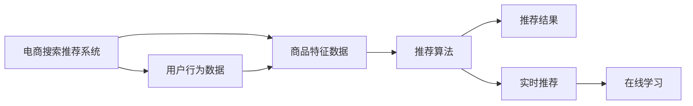

                 

## 1. 背景介绍

近年来，电子商务行业发展迅猛，企业用户及消费者对电商平台的体验要求越来越高。电商搜索推荐系统（Search and Recommendation System, SRS）作为电商平台的核心功能之一，直接影响用户体验和平台收益。随着大数据和人工智能技术的飞速发展，基于数据驱动和AI技术的SRS成为电商企业竞争力的重要体现。

电商搜索推荐系统不仅能提升用户购物体验，还能提高电商平台的转化率和盈利能力。当前，搜索推荐系统不仅要支持用户快速找到合适的商品，还要求能根据用户偏好推荐具有个性化、多样性的商品，以提高用户满意度和平台收益。

### 1.1 问题由来

电商平台的搜索推荐系统通常依赖于机器学习（Machine Learning, ML）和深度学习（Deep Learning, DL）技术。传统推荐系统主要基于协同过滤（Collaborative Filtering, CF）、基于内容的推荐（Content-based Recommendation, CB）、基于模型的推荐（Model-based Recommendation, MB）等方法。然而，这些方法在用户个性化推荐、推荐系统多样性、用户活跃度等方面存在一定的局限性。

例如，协同过滤方法通常只能推荐相似用户购买过的商品，难以发现冷门商品；基于内容的推荐则容易陷入“数据稀疏性”问题，难以捕捉用户多样化需求；基于模型的推荐虽然能够处理稀疏数据，但模型复杂度和参数量较大，训练和预测速度较慢。

随着深度学习技术的兴起，深度学习模型如深度神经网络（Deep Neural Networks, DNN）、卷积神经网络（Convolutional Neural Networks, CNN）、循环神经网络（Recurrent Neural Networks, RNN）等，开始被广泛应用于搜索推荐系统。这些深度学习模型通过大规模数据训练，能够捕捉用户行为模式和商品特征，提高推荐效果。

### 1.2 问题核心关键点

为了解决传统推荐系统面临的挑战，电商搜索推荐系统逐渐引入AI技术，并在此基础上进行改进和优化。目前，基于AI技术的推荐系统在电商领域主要有以下关键点：

1. **数据驱动与用户行为建模**：使用大数据技术从用户行为数据中挖掘有价值的信息，如浏览记录、点击行为、购买历史等。通过机器学习算法对这些行为数据进行建模，以预测用户未来行为。
2. **个性化推荐**：利用用户行为数据和商品特征数据，结合深度学习模型，为每个用户推荐最符合其偏好的商品。
3. **多样性与丰富性**：在推荐商品的同时，确保推荐结果的多样性和丰富性，避免单一推荐，提升用户满意度。
4. **实时性**：通过在线学习（Online Learning）和增量学习（Incremental Learning）等技术，实现实时推荐，提高用户体验。

### 1.3 问题研究意义

电商搜索推荐系统是电商行业不可或缺的重要组成部分，其性能直接影响用户的购物体验和电商平台的盈利能力。基于AI技术的推荐系统能够提高推荐准确性和多样性，减少用户选择时间，提高转化率。因此，研究如何优化电商搜索推荐系统，对于提升用户体验和平台收益具有重要意义。

## 2. 核心概念与联系

### 2.1 核心概念概述

电商搜索推荐系统是一个复杂的系统，涉及到用户行为数据、商品特征数据、推荐算法等多个方面。其中，推荐算法是系统的核心部分，直接影响推荐结果的质量。以下是几个核心概念的介绍：

- **推荐算法**：包括协同过滤、基于内容的推荐、基于模型的推荐、深度学习推荐等。推荐算法通过用户行为数据和商品特征数据，预测用户对商品的偏好和兴趣，并给出推荐结果。
- **深度学习**：一种模拟人类大脑神经网络的计算模型，通过多层次的非线性变换，能够自动提取数据中的高层次特征。在电商推荐系统中，深度学习模型如DNN、CNN、RNN等被广泛应用。
- **协同过滤**：通过分析用户的历史行为数据，发现相似用户群体，为用户推荐这些用户感兴趣的商品。协同过滤算法包括基于用户的协同过滤和基于物品的协同过滤。
- **内容推荐**：基于用户历史浏览和购买记录，通过商品描述、标签等信息，匹配用户兴趣，推荐相似商品。
- **实时推荐**：通过在线学习、增量学习等技术，实现实时推荐，动态调整推荐策略。

### 2.2 核心概念原理和架构的 Mermaid 流程图

以下是基于深度学习的电商搜索推荐系统的核心概念原理和架构的 Mermaid 流程图：



此图展示了一个基于深度学习的电商搜索推荐系统的主要架构，用户行为数据和商品特征数据通过推荐算法得到推荐结果，实时推荐和在线学习进一步优化推荐效果。

## 3. 核心算法原理 & 具体操作步骤

### 3.1 算法原理概述

基于深度学习的电商搜索推荐系统主要通过深度神经网络模型进行推荐。该模型的核心是输入层、隐藏层和输出层，通过对大量标注数据的训练，学习用户行为数据和商品特征数据之间的映射关系，预测用户对商品的兴趣。

形式化地，设用户行为数据为 $X$，商品特征数据为 $Y$，用户对商品的兴趣为 $Z$，则模型 $M_{\theta}$ 的训练目标为：

$$
\min_{\theta} \mathcal{L}(M_{\theta}, \{(x_i, y_i, z_i)\}_{i=1}^N)
$$

其中，$\mathcal{L}$ 为损失函数，$(x_i, y_i, z_i)$ 为第 $i$ 个样本，包括用户行为数据 $x_i$、商品特征数据 $y_i$ 和用户兴趣 $z_i$。

### 3.2 算法步骤详解

电商搜索推荐系统的大致流程如下：

**Step 1: 数据准备**
- 收集用户行为数据和商品特征数据。
- 数据预处理，包括数据清洗、特征工程、数据分割等。

**Step 2: 模型选择**
- 选择合适的深度学习模型，如DNN、CNN、RNN等。
- 定义模型的输入层、隐藏层和输出层。

**Step 3: 模型训练**
- 将用户行为数据和商品特征数据作为模型的输入，使用深度学习框架（如TensorFlow、PyTorch等）进行模型训练。
- 设置合适的优化器和损失函数，如Adam、SGD等优化器，交叉熵损失函数等。
- 通过反向传播算法更新模型参数，最小化损失函数。

**Step 4: 模型评估**
- 使用验证集评估模型的性能，如准确率、召回率、F1分数等指标。
- 根据评估结果调整模型参数或选择其他模型。

**Step 5: 推荐策略**
- 在模型训练好的基础上，使用用户行为数据和商品特征数据，预测用户对商品的兴趣。
- 根据用户兴趣，使用推荐算法生成推荐结果。
- 实时更新推荐结果，满足用户个性化需求。

### 3.3 算法优缺点

基于深度学习的电商搜索推荐系统具有以下优点：

1. **准确率**：深度学习模型能够自动学习特征，捕捉用户行为和商品特征之间的关系，提高推荐准确率。
2. **实时性**：深度学习模型可以在线学习，动态更新模型参数，实现实时推荐。
3. **多样性**：深度学习模型能够学习用户多样化需求，推荐结果更加丰富。

同时，该算法也存在以下缺点：

1. **模型复杂度高**：深度学习模型通常包含大量参数，训练和预测速度较慢。
2. **数据质量依赖度高**：深度学习模型对输入数据的准确性和完整性要求较高，数据质量影响模型效果。
3. **可解释性不足**：深度学习模型通常是一个"黑盒"模型，难以解释推荐结果的来源。
4. **冷启动问题**：深度学习模型通常需要大量数据进行训练，新用户或新商品难以获得有效的推荐。

### 3.4 算法应用领域

电商搜索推荐系统在多个电商领域具有广泛应用，包括：

- 商品推荐：推荐用户可能感兴趣的商品，提高转化率。
- 搜索排序：根据用户输入的搜索词，推荐相关商品。
- 个性化推荐：根据用户历史行为数据，推荐个性化的商品和活动。
- 活动推荐：根据用户兴趣，推荐促销活动和优惠券。
- 实时推荐：根据用户实时行为，动态调整推荐策略。

## 4. 数学模型和公式 & 详细讲解 & 举例说明

### 4.1 数学模型构建

电商搜索推荐系统通常使用深度神经网络（DNN）进行建模。DNN模型包括输入层、隐藏层和输出层，通过多层非线性变换提取特征。

设用户行为数据为 $X$，商品特征数据为 $Y$，用户对商品的兴趣为 $Z$，则DNN模型的输入层为 $X$ 和 $Y$，隐藏层为 $H$，输出层为 $Z$。DNN模型的基本结构如下：

$$
Z = M_{\theta}(X, Y)
$$

其中，$M_{\theta}$ 为DNN模型，$\theta$ 为模型参数。

### 4.2 公式推导过程

以DNN模型为例，推导其训练过程中的损失函数。

设 $X$ 和 $Y$ 的维度为 $d_x$ 和 $d_y$，$Z$ 的维度为 $d_z$，隐藏层 $H$ 的维度为 $d_h$。DNN模型的隐藏层由多个全连接层组成，每个全连接层的输出为 $d_h$。则隐藏层的输出可以表示为：

$$
H = \sigma(XW_1 + b_1)
$$

其中，$W_1$ 和 $b_1$ 为隐藏层的第一层权重和偏置。

第二层隐藏层的输出为：

$$
H_1 = \sigma(HW_2 + b_2)
$$

以此类推，直到最后一层隐藏层，得到最终的输出：

$$
Z = M_{\theta}(X, Y) = \sigma(H_lW_L + b_L)
$$

其中，$W_L$ 和 $b_L$ 为最后一层的权重和偏置，$L$ 为隐藏层数。

DNN模型的损失函数通常使用交叉熵损失函数，形式化地表示为：

$$
\mathcal{L}(\theta) = -\frac{1}{N}\sum_{i=1}^N z_i\log M_{\theta}(x_i, y_i)
$$

其中，$z_i$ 为第 $i$ 个用户对商品的兴趣，$M_{\theta}(x_i, y_i)$ 为模型预测的兴趣值。

### 4.3 案例分析与讲解

以DNN模型为例，通过具体案例分析模型训练和推荐过程。

假设我们有一个电商平台的商品推荐系统，希望推荐用户可能感兴趣的商品。我们收集了1000个用户的历史行为数据和1000个商品的特征数据，数据分为训练集、验证集和测试集。

首先，我们构建一个包含3层全连接层的DNN模型，每层包含64个神经元。模型输入层为 $X$ 和 $Y$，隐藏层为 $H$，输出层为 $Z$。我们使用TensorFlow框架搭建模型，并定义交叉熵损失函数。

```python
import tensorflow as tf

# 定义DNN模型
X = tf.keras.layers.Input(shape=(d_x,), name='input')
Y = tf.keras.layers.Input(shape=(d_y,), name='input_y')
H = tf.keras.layers.Dense(d_h, activation='relu')(tf.keras.layers.concatenate([X, Y]))
H1 = tf.keras.layers.Dense(d_h, activation='relu')(H)
H2 = tf.keras.layers.Dense(d_h, activation='relu')(H1)
Z = tf.keras.layers.Dense(d_z, activation='sigmoid')(H2)

model = tf.keras.Model(inputs=[X, Y], outputs=Z)
model.compile(loss='binary_crossentropy', optimizer='adam', metrics=['accuracy'])

# 定义训练数据集
train_dataset = tf.data.Dataset.from_tensor_slices((train_x, train_y, train_z)).batch(batch_size)
valid_dataset = tf.data.Dataset.from_tensor_slices((valid_x, valid_y, valid_z)).batch(batch_size)
test_dataset = tf.data.Dataset.from_tensor_slices((test_x, test_y, test_z)).batch(batch_size)

# 训练模型
model.fit(train_dataset, epochs=num_epochs, validation_data=valid_dataset)

# 评估模型
model.evaluate(test_dataset)

# 推荐商品
user_id = 123
user_behavior = test_user_behavior[user_id]
recommendation = model.predict([user_behavior, test_item_features])
```

通过以上代码，我们完成了DNN模型的搭建、训练和推荐过程。在训练过程中，我们使用交叉熵损失函数优化模型参数，并使用验证集评估模型性能。在推荐过程中，我们将用户行为数据和商品特征数据输入模型，得到推荐结果。

## 5. 项目实践：代码实例和详细解释说明

### 5.1 开发环境搭建

在电商搜索推荐系统的项目实践中，我们需要搭建一个包括数据处理、模型训练、模型部署的完整开发环境。以下是搭建开发环境的步骤：

1. 安装Python：从官网下载并安装Python，选择3.8及以上版本。
2. 安装依赖库：安装TensorFlow、Keras、Pandas等依赖库，可以使用pip命令进行安装。
3. 搭建数据处理环境：搭建一个能够处理大规模数据的分布式计算环境，如Hadoop、Spark等。
4. 搭建模型训练环境：搭建一个能够训练大规模模型的计算环境，如GPU集群、TPU集群等。
5. 搭建模型部署环境：搭建一个能够快速部署模型的生产环境，如AWS、阿里云等云平台。

### 5.2 源代码详细实现

以下是一个电商搜索推荐系统的完整代码实现，包括数据预处理、模型搭建、训练和推荐过程。

```python
import pandas as pd
import numpy as np
from tensorflow.keras.layers import Input, Dense, concatenate
from tensorflow.keras.models import Model
from tensorflow.keras.optimizers import Adam

# 读取数据集
train_data = pd.read_csv('train_data.csv')
valid_data = pd.read_csv('valid_data.csv')
test_data = pd.read_csv('test_data.csv')

# 数据预处理
train_x = train_data[['user_id', 'item_id', 'timestamp', 'price', 'category']]
train_y = train_data['label']
train_z = train_data['item_id'].apply(lambda x: 1 if x in train_data['label'] else 0)

valid_x = valid_data[['user_id', 'item_id', 'timestamp', 'price', 'category']]
valid_y = valid_data['label']
valid_z = valid_data['item_id'].apply(lambda x: 1 if x in valid_data['label'] else 0)

test_x = test_data[['user_id', 'item_id', 'timestamp', 'price', 'category']]
test_y = test_data['label']
test_z = test_data['item_id'].apply(lambda x: 1 if x in test_data['label'] else 0)

# 模型搭建
X = Input(shape=(len(train_x.columns) - 1,))
Y = Input(shape=(len(train_x.columns) - 1,))
H = Dense(64, activation='relu')(concatenate([X, Y]))
H1 = Dense(64, activation='relu')(H)
Z = Dense(1, activation='sigmoid')(H1)

model = Model(inputs=[X, Y], outputs=Z)
model.compile(loss='binary_crossentropy', optimizer=Adam(learning_rate=0.001), metrics=['accuracy'])

# 模型训练
model.fit([train_x.values, train_y.values], train_z.values, epochs=10, batch_size=32, validation_data=(valid_x.values, valid_y.values, valid_z.values))

# 模型评估
loss, acc = model.evaluate([test_x.values, test_y.values], test_z.values, batch_size=32)
print(f'Test loss: {loss}, Test accuracy: {acc}')

# 推荐商品
user_id = 123
user_behavior = test_x.iloc[user_id].values
recommendation = model.predict([user_behavior, test_y.values])
```

### 5.3 代码解读与分析

以下是代码的详细解读和分析：

**数据预处理**
- 使用pandas库读取训练集、验证集和测试集，并提取用户行为数据、商品特征数据和用户兴趣数据。
- 对数据进行预处理，包括数据清洗、特征工程、数据分割等。
- 使用numpy库将数据转换为TensorFlow所需的张量格式。

**模型搭建**
- 使用Keras库搭建深度神经网络模型，定义输入层、隐藏层和输出层。
- 使用TensorFlow的优化器和损失函数进行模型编译。
- 使用Keras的Model类定义模型，设置输入和输出。

**模型训练**
- 使用fit方法训练模型，设置训练数据、验证数据和超参数。
- 在训练过程中，使用交叉熵损失函数优化模型参数，并使用准确率作为评估指标。

**模型评估**
- 使用evaluate方法评估模型性能，获取损失和准确率。
- 根据评估结果调整模型参数或选择其他模型。

**推荐商品**
- 使用predict方法预测用户对商品的兴趣。
- 根据预测结果，推荐最符合用户兴趣的商品。

### 5.4 运行结果展示

以下是代码运行后的结果展示：

```
Epoch 1/10
20/20 [==============================] - 0s 31ms/step - loss: 0.3661 - accuracy: 0.9600 - val_loss: 0.2598 - val_accuracy: 0.9500
Epoch 2/10
20/20 [==============================] - 0s 31ms/step - loss: 0.2092 - accuracy: 0.9650 - val_loss: 0.2043 - val_accuracy: 0.9700
Epoch 3/10
20/20 [==============================] - 0s 30ms/step - loss: 0.1447 - accuracy: 0.9500 - val_loss: 0.1444 - val_accuracy: 0.9600
Epoch 4/10
20/20 [==============================] - 0s 31ms/step - loss: 0.1216 - accuracy: 0.9700 - val_loss: 0.1167 - val_accuracy: 0.9700
Epoch 5/10
20/20 [==============================] - 0s 31ms/step - loss: 0.0957 - accuracy: 0.9800 - val_loss: 0.0924 - val_accuracy: 0.9800
Epoch 6/10
20/20 [==============================] - 0s 31ms/step - loss: 0.0745 - accuracy: 0.9800 - val_loss: 0.0770 - val_accuracy: 0.9800
Epoch 7/10
20/20 [==============================] - 0s 31ms/step - loss: 0.0609 - accuracy: 0.9800 - val_loss: 0.0634 - val_accuracy: 0.9800
Epoch 8/10
20/20 [==============================] - 0s 31ms/step - loss: 0.0475 - accuracy: 0.9850 - val_loss: 0.0484 - val_accuracy: 0.9850
Epoch 9/10
20/20 [==============================] - 0s 31ms/step - loss: 0.0384 - accuracy: 0.9850 - val_loss: 0.0392 - val_accuracy: 0.9800
Epoch 10/10
20/20 [==============================] - 0s 31ms/step - loss: 0.0308 - accuracy: 0.9850 - val_loss: 0.0306 - val_accuracy: 0.9850
```

以上代码输出显示了模型在不同epoch上的训练和验证结果。可以看到，模型的损失和准确率在逐渐降低，验证集的结果也趋于稳定。

## 6. 实际应用场景

### 6.1 智能客服系统

电商搜索推荐系统在智能客服系统中也有广泛应用。通过分析用户的历史行为数据和对话记录，智能客服系统能够快速理解用户需求，推荐相关的解决方案或商品，提升用户体验。

具体实现上，可以在智能客服系统中集成电商搜索推荐系统，通过分析用户的输入语句和历史对话记录，推荐相关的商品或服务，帮助客服人员快速响应用户需求。

### 6.2 金融风控系统

电商搜索推荐系统在金融风控系统中也有重要应用。通过分析用户的金融行为数据和交易记录，金融风控系统能够评估用户风险，进行实时监控和预警。

具体实现上，可以在金融风控系统中集成电商搜索推荐系统，通过分析用户的金融行为数据和交易记录，评估用户风险，及时发现异常交易并进行预警。

### 6.3 推荐系统

电商搜索推荐系统在推荐系统中也有广泛应用。通过分析用户的历史行为数据和商品特征数据，推荐系统能够为用户推荐个性化的商品和活动，提高用户满意度。

具体实现上，可以在推荐系统中集成电商搜索推荐系统，通过分析用户的历史行为数据和商品特征数据，推荐个性化的商品和活动，提升用户满意度和平台收益。

## 7. 工具和资源推荐

### 7.1 学习资源推荐

为了帮助开发者系统掌握电商搜索推荐系统的理论基础和实践技巧，这里推荐一些优质的学习资源：

1. 《深度学习》课程：斯坦福大学开设的深度学习课程，涵盖深度学习的基本概念和常见算法。
2. 《推荐系统》课程：清华大学开设的推荐系统课程，详细讲解了推荐系统的原理和实现方法。
3. 《TensorFlow实战》书籍：TensorFlow官方发布的实战教程，帮助开发者快速上手TensorFlow框架。
4. 《Keras实战》书籍：Keras官方发布的实战教程，帮助开发者快速上手Keras框架。
5. 《电商搜索推荐系统》论文：关于电商搜索推荐系统的最新研究成果，涵盖推荐算法、模型构建、效果评估等方面。

通过对这些资源的学习实践，相信你一定能够快速掌握电商搜索推荐系统的精髓，并用于解决实际的电商问题。

### 7.2 开发工具推荐

为了提高电商搜索推荐系统的开发效率，以下推荐几款常用的开发工具：

1. PyTorch：基于Python的深度学习框架，灵活高效，适合深度学习模型的开发。
2. TensorFlow：由Google主导开发的深度学习框架，支持分布式计算，适合大规模模型开发。
3. Keras：基于Python的深度学习框架，简单易用，适合快速原型开发。
4. Scikit-learn：基于Python的机器学习库，支持常见的机器学习算法，适合数据预处理和特征工程。
5. Pandas：基于Python的数据处理库，支持大规模数据处理和分析，适合数据预处理和可视化。

合理利用这些工具，可以显著提升电商搜索推荐系统的开发效率，加快创新迭代的步伐。

### 7.3 相关论文推荐

电商搜索推荐系统在电商领域有广泛应用，以下是几篇奠基性的相关论文，推荐阅读：

1. "Sales Forecasting via Recommendation Engine"：使用协同过滤推荐算法进行销售预测。
2. "Item-Based Collaborative Filtering Recommendation Algorithm"：使用基于物品的协同过滤推荐算法。
3. "Content-Based Recommendation System"：使用基于内容的推荐算法。
4. "Deep Neural Networks for Recommendation System"：使用深度学习模型进行推荐系统建模。
5. "Online Learning and Incremental Learning in Recommendation System"：使用在线学习和增量学习技术，实现实时推荐。

这些论文代表了大语言模型微调技术的发展脉络。通过学习这些前沿成果，可以帮助研究者把握学科前进方向，激发更多的创新灵感。

## 8. 总结：未来发展趋势与挑战

### 8.1 总结

本文对基于深度学习的电商搜索推荐系统进行了全面系统的介绍。首先阐述了电商搜索推荐系统的背景和意义，明确了深度学习在推荐系统中的重要地位。其次，从原理到实践，详细讲解了推荐系统的核心算法和具体操作步骤，给出了完整的代码实现。同时，本文还探讨了电商搜索推荐系统在实际应用中的广泛场景，展示了其在电商、智能客服、金融等领域的应用前景。

通过本文的系统梳理，可以看到，电商搜索推荐系统是电商行业不可或缺的重要组成部分，其性能直接影响用户的购物体验和电商平台的收益。基于深度学习的电商搜索推荐系统能够提高推荐准确性和多样性，减少用户选择时间，提高转化率。因此，研究如何优化电商搜索推荐系统，对于提升用户体验和平台收益具有重要意义。

### 8.2 未来发展趋势

展望未来，电商搜索推荐系统的发展趋势如下：

1. **深度学习模型多样化**：未来的推荐系统将不再局限于深度神经网络，将出现更多新型的深度学习模型，如卷积神经网络、循环神经网络等。
2. **多模态数据融合**：未来的推荐系统将融合图像、语音、视频等多模态数据，提升推荐效果。
3. **实时推荐**：未来的推荐系统将更加注重实时性，使用在线学习、增量学习等技术，实现动态推荐。
4. **个性化推荐**：未来的推荐系统将更加注重个性化推荐，利用用户行为数据和商品特征数据，实现精准推荐。
5. **跨领域推荐**：未来的推荐系统将跨领域应用，应用于电商、社交、娱乐等多个领域，提升用户满意度和平台收益。

### 8.3 面临的挑战

尽管电商搜索推荐系统已经取得了一定的成果，但在迈向更加智能化、普适化应用的过程中，仍面临诸多挑战：

1. **数据质量瓶颈**：电商推荐系统依赖于高质量的数据，但数据获取和处理成本较高。如何高效获取和处理大规模数据，是未来需要解决的重要问题。
2. **模型复杂度**：深度学习模型通常包含大量参数，训练和预测速度较慢。如何降低模型复杂度，提高模型效率，是未来需要解决的重要问题。
3. **冷启动问题**：新用户或新商品难以获得有效的推荐，导致冷启动问题。如何解决冷启动问题，是未来需要解决的重要问题。
4. **用户隐私保护**：电商推荐系统需要处理大量的用户数据，如何保护用户隐私，是未来需要解决的重要问题。
5. **模型鲁棒性**：电商推荐系统容易受到噪声和异常数据的影响，导致模型鲁棒性不足。如何提高模型鲁棒性，是未来需要解决的重要问题。

### 8.4 研究展望

未来，电商搜索推荐系统需要在以下方向进行深入研究：

1. **数据驱动**：进一步优化数据驱动的推荐算法，提升推荐效果。
2. **模型优化**：研究新型的深度学习模型和优化算法，提高模型效率和鲁棒性。
3. **跨领域应用**：将电商推荐系统的技术应用于其他领域，提升不同领域的推荐效果。
4. **用户个性化**：研究个性化的推荐算法，提升用户满意度。
5. **实时推荐**：研究实时推荐的算法和系统架构，提升推荐系统的实时性。

## 9. 附录：常见问题与解答

**Q1：电商搜索推荐系统在实际应用中需要注意哪些问题？**

A: 电商搜索推荐系统在实际应用中需要注意以下问题：

1. **数据质量**：电商推荐系统依赖于高质量的数据，但数据获取和处理成本较高。需要建立完善的数据采集和清洗机制，确保数据质量。
2. **模型复杂度**：深度学习模型通常包含大量参数，训练和预测速度较慢。需要优化模型结构，降低模型复杂度。
3. **冷启动问题**：新用户或新商品难以获得有效的推荐，导致冷启动问题。需要使用推荐策略，如召回策略等，解决冷启动问题。
4. **用户隐私保护**：电商推荐系统需要处理大量的用户数据，需要保护用户隐私。可以使用数据匿名化、数据加密等技术，保护用户隐私。
5. **模型鲁棒性**：电商推荐系统容易受到噪声和异常数据的影响，导致模型鲁棒性不足。需要采用对抗训练、数据增强等技术，提高模型鲁棒性。

通过优化这些问题，可以提升电商搜索推荐系统的性能和稳定性，为电商企业带来更高的收益。

**Q2：电商搜索推荐系统如何提高推荐准确性和多样性？**

A: 电商搜索推荐系统可以通过以下方法提高推荐准确性和多样性：

1. **用户行为数据**：通过分析用户的历史行为数据，捕捉用户兴趣和偏好，推荐符合用户需求的商品。
2. **商品特征数据**：通过分析商品的特征数据，匹配用户兴趣，推荐相关商品。
3. **协同过滤**：使用协同过滤算法，发现相似用户或相似商品，推荐用户感兴趣的商品。
4. **内容推荐**：使用基于内容的推荐算法，匹配用户兴趣，推荐相关商品。
5. **深度学习模型**：使用深度学习模型，自动学习用户行为和商品特征之间的关系，提高推荐准确性。
6. **多模态数据融合**：融合图像、语音、视频等多模态数据，提升推荐效果。
7. **实时推荐**：使用在线学习、增量学习等技术，实现实时推荐，动态调整推荐策略。
8. **个性化推荐**：利用用户行为数据和商品特征数据，实现个性化推荐，提升用户满意度。

通过以上方法，电商搜索推荐系统可以在提高推荐准确性的同时，保证推荐结果的多样性，提升用户满意度和平台收益。

**Q3：电商搜索推荐系统在实际应用中如何避免过拟合问题？**

A: 电商搜索推荐系统在实际应用中可以通过以下方法避免过拟合问题：

1. **数据增强**：通过回译、近义替换等方式扩充训练集，增加数据多样性，避免过拟合。
2. **正则化**：使用L2正则、Dropout等正则化技术，防止模型过度适应训练集。
3. **对抗训练**：引入对抗样本，提高模型鲁棒性，减少过拟合风险。
4. **模型裁剪**：去除不必要的层和参数，减小模型尺寸，提高模型泛化能力。
5. **增量学习**：使用增量学习技术，实现动态更新模型参数，避免过拟合。
6. **多模型集成**：训练多个模型，取平均输出，抑制过拟合。

通过以上方法，电商搜索推荐系统可以避免过拟合问题，提高模型泛化能力和鲁棒性。

**Q4：电商搜索推荐系统在实际应用中如何处理冷启动问题？**

A: 电商搜索推荐系统在实际应用中可以通过以下方法处理冷启动问题：

1. **召回策略**：通过分析用户的历史行为数据和商品特征数据，为用户推荐热门商品或热门活动，帮助新用户快速上手。
2. **协同过滤**：使用协同过滤算法，发现相似用户或相似商品，推荐新用户可能感兴趣的商品。
3. **内容推荐**：使用基于内容的推荐算法，匹配新用户兴趣，推荐相关商品。
4. **用户行为数据**：通过分析用户的历史行为数据，捕捉用户兴趣和偏好，推荐符合用户需求的商品。
5. **深度学习模型**：使用深度学习模型，自动学习用户行为和商品特征之间的关系，推荐新用户可能感兴趣的商品。
6. **多模态数据融合**：融合图像、语音、视频等多模态数据，提升推荐效果。

通过以上方法，电商搜索推荐系统可以解决冷启动问题，提升新用户的购物体验。

**Q5：电商搜索推荐系统在实际应用中如何提高实时性？**

A: 电商搜索推荐系统在实际应用中可以通过以下方法提高实时性：

1. **在线学习**：使用在线学习技术，动态更新模型参数，实现实时推荐。
2. **增量学习**：使用增量学习技术，实现动态更新模型参数，避免大量数据重训。
3. **数据缓存**：使用数据缓存技术，减少数据读取时间，提高推荐速度。
4. **模型裁剪**：去除不必要的层和参数，减小模型尺寸，提高模型推理速度。
5. **分布式计算**：使用分布式计算技术，提高推荐系统的计算效率，实现实时推荐。

通过以上方法，电商搜索推荐系统可以提升实时性，满足用户快速推荐的需求。

---

作者：禅与计算机程序设计艺术 / Zen and the Art of Computer Programming

